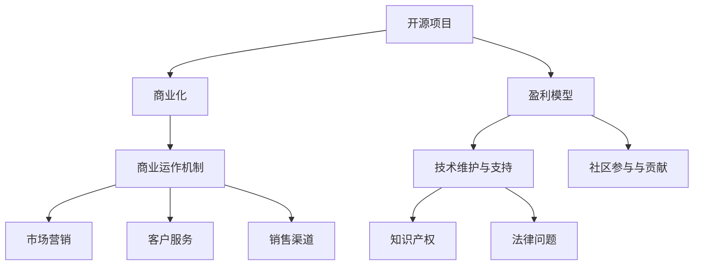

                 

# 从代码到商业：将开源项目转化为盈利企业

> 关键词：开源项目,商业化,盈利模型,开源生态,软件开发

## 1. 背景介绍

### 1.1 问题由来

在现代社会，技术创新和商业化是一个循环往复的过程。技术的发展促进了商业的进步，而商业的回报又进一步推动了技术的迭代。开源项目作为一种新型的技术协作模式，正在迅速成为推动技术创新的重要力量。然而，对于许多开发者来说，如何将开源项目转化为商业盈利，仍然是一个复杂而艰难的问题。

当前，开源项目在技术研发和创新中扮演着越来越重要的角色。从Linux内核到Apache HTTP Server，从TensorFlow到Kubernetes，开源项目在技术社区和企业的合作中，已经成为推动技术迭代和应用落地的重要引擎。但是，如何通过开源项目实现商业盈利，仍是一个值得深入探讨的问题。

### 1.2 问题核心关键点

开源项目转化为商业盈利主要包括以下几个关键点：

1. **商业模式设计**：如何将开源项目的技术优势转化为商业价值，寻找适合的商业模式，如订阅模式、开源社区赞助、企业定制服务等。
2. **商业运作机制**：建立和完善商业运作机制，包括市场营销、客户服务、销售渠道等，确保商业化的顺利进行。
3. **技术维护与支持**：在商业化的同时，如何保持开源项目的持续创新和技术维护，确保商业成功的同时不损害项目的开放性。
4. **社区参与与贡献**：如何协调好社区与商业利益之间的关系，确保社区成员的积极参与和贡献，推动项目的持续发展。
5. **知识产权与法律问题**：开源项目商业化过程中涉及的知识产权、许可协议、法律责任等问题，需要得到妥善处理。

本文旨在通过全面解析这些关键点，帮助开发者理解和实现开源项目的商业化转型。

## 2. 核心概念与联系

### 2.1 核心概念概述

为更好地理解开源项目商业化的过程，本节将介绍几个核心概念：

- **开源项目(Open Source Project)**：通过开放源代码和版权许可协议，允许任何人使用、修改、分发源代码的软件项目。典型代表如Linux内核、Apache HTTP Server等。
- **商业化(Commercialization)**：将开源项目的技术和产品转化为具有市场价值的商业活动，实现商业盈利的过程。
- **盈利模型(Profit Model)**：通过选择合适的商业策略，将项目的技术优势转化为商业收入的方式，如订阅服务、广告、企业定制等。
- **开源生态(Source Community)**：围绕开源项目建立的技术社区，包括开发者、用户、贡献者等，是项目持续发展的重要动力来源。
- **软件开发(Software Development)**：从需求分析、设计、编码到测试、部署的软件开发全过程，是实现商业化的基础。

这些核心概念之间的逻辑关系可以通过以下Mermaid流程图来展示：



这个流程图展示开源项目商业化的核心概念及其之间的关系：

1. 开源项目通过软件开发获得技术基础。
2. 商业化是技术转化为商业价值的过程，包括盈利模型、商业运作机制等。
3. 在商业化的同时，需要确保技术维护和社区支持，保持项目的开放性。
4. 知识产权和法律问题需要在商业化过程中妥善处理。

这些概念共同构成了开源项目商业化的主要框架，有助于理解项目商业化的整体思路。

## 3. 核心算法原理 & 具体操作步骤
### 3.1 算法原理概述

开源项目商业化的基本原理是通过选择合适的盈利模式，将项目的技术优势转化为商业价值。这涉及以下几个关键步骤：

1. **需求分析**：确定商业化需求，识别项目具备的技术优势和商业潜力。
2. **盈利模式选择**：根据市场需求和项目特点，选择合适的盈利模式，如订阅服务、开源社区赞助、企业定制等。
3. **产品设计**：根据盈利模式，设计和开发商业产品或服务。
4. **市场推广**：通过市场营销和销售渠道，推广商业产品或服务。
5. **客户支持**：提供高质量的客户支持和售后服务，确保商业化顺利进行。
6. **技术迭代**：根据市场需求和技术进展，持续迭代和优化产品或服务。

### 3.2 算法步骤详解

**Step 1: 需求分析**

开源项目商业化的第一步是进行需求分析，明确商业化目标和需求。具体步骤如下：

1. **项目评估**：评估开源项目的当前状态，包括技术成熟度、社区活跃度、市场需求等。
2. **目标设定**：明确商业化目标，如实现盈利、扩大市场份额等。
3. **市场需求分析**：分析目标市场的潜在需求和竞争环境，识别商业机会。
4. **用户反馈收集**：通过问卷调查、用户访谈等方式，收集用户需求和反馈，指导商业化决策。

**Step 2: 盈利模式选择**

选择合适的盈利模式是商业化的关键。根据开源项目的特点和市场需求，常见的盈利模式包括：

1. **订阅模式(Subscription Model)**：用户通过订阅服务获取项目的使用权和支持。如MongoDB、AWS等。
2. **开源社区赞助(Open Source Community Sponsorship)**：企业或个人向开源项目提供资金支持，换取项目的优先使用权和展示机会。如Google、IBM等。
3. **企业定制(Enterprise Customization)**：针对企业需求，提供定制化开发和支持。如JIRA、Slack等。
4. **开源软件分发(Open Source Software Distribution)**：通过销售软件许可证，实现商业盈利。如Apache Hadoop、Apache Kafka等。
5. **广告和营销(Advertising and Marketing)**：通过广告收入或品牌营销，实现盈利。如Apache YARN、Apache Storm等。

**Step 3: 产品设计**

根据盈利模式，设计和开发商业产品或服务。具体步骤如下：

1. **功能规划**：根据市场需求和盈利模式，确定产品或服务的关键功能和特性。
2. **用户界面设计**：设计直观易用的用户界面，提升用户体验。
3. **技术实现**：根据功能规划和技术栈，实现产品或服务的核心功能。
4. **测试验证**：通过测试验证产品或服务的质量和稳定性，确保满足商业需求。

**Step 4: 市场推广**

推广是商业化的重要环节，需要综合运用多种营销策略，具体步骤如下：

1. **品牌建设**：通过宣传和推广，建立品牌知名度和市场声誉。
2. **渠道合作**：与分销商、合作伙伴建立合作关系，扩大市场覆盖面。
3. **数字营销**：利用社交媒体、搜索引擎、邮件营销等数字渠道，推广产品或服务。
4. **活动策划**：组织线下活动、技术论坛、展会等，提升品牌影响力和市场认知度。

**Step 5: 客户支持**

客户支持是商业化的关键环节，需要建立完善的客户服务体系，具体步骤如下：

1. **客户服务团队**：组建专业的客户服务团队，提供技术支持、问题解决等服务。
2. **服务保障**：建立服务保障机制，确保客户问题得到及时响应和解决。
3. **用户反馈机制**：建立用户反馈机制，收集用户意见和建议，指导产品改进。
4. **培训和文档**：提供详细的培训和文档，帮助用户正确使用产品或服务。

**Step 6: 技术迭代**

持续技术迭代是确保商业成功的关键，具体步骤如下：

1. **需求收集**：收集用户需求和技术反馈，识别改进和优化方向。
2. **技术优化**：根据需求收集结果，优化产品或服务的核心技术。
3. **版本发布**：定期发布新版本，提供新功能和改进，提升用户体验。
4. **性能测试**：定期进行性能测试，确保产品或服务的稳定性和性能。

### 3.3 算法优缺点

开源项目商业化的方法具有以下优点：

1. **技术优势**：开源项目的核心技术经过广泛社区验证，具有良好的稳定性和可靠性。
2. **成本效益**：开源项目通常具有较低的初期开发成本，可以更灵活地调整商业模式和策略。
3. **市场认可**：开源项目的社区和用户群体已经具有一定市场基础，可以快速获得认可和信任。
4. **持续创新**：开源项目具有持续的社区贡献和技术迭代，能够不断推出新功能和改进。

但同时，开源项目商业化也存在以下缺点：

1. **知识产权问题**：开源项目通常采用自由软件协议，商业化过程中可能涉及版权和知识产权的法律问题。
2. **利益冲突**：开源项目商业化可能引发社区利益与商业利益的冲突，需要妥善协调。
3. **技术债务**：商业化过程中可能需要投入大量资源进行技术优化和维护，可能带来技术债务问题。
4. **市场竞争**：开源项目商业化可能面临其他商业产品的竞争，需要采取有效竞争策略。

### 3.4 算法应用领域

开源项目商业化方法广泛适用于各种软件项目，如：

1. **系统软件**：如Linux内核、Apache HTTP Server等。
2. **数据库**：如MongoDB、MySQL等。
3. **云服务**：如AWS、Google Cloud等。
4. **大数据**：如Apache Hadoop、Apache Spark等。
5. **协作工具**：如JIRA、Slack等。
6. **编程语言和框架**：如Python、Java、TensorFlow等。
7. **安全工具**：如OpenSSL、OpenSSH等。

这些开源项目通过商业化，不仅可以实现盈利，还能带动整个行业的技术发展和应用落地。

## 4. 数学模型和公式 & 详细讲解 & 举例说明
### 4.1 数学模型构建

为了更严谨地分析开源项目商业化的过程，本节将构建数学模型，并给出详细的公式推导过程。

假设开源项目当前用户数量为 $U_0$，市场需求为 $D$，项目的年运营成本为 $C$，预期年收益为 $R$。商业化过程中，用户增长率、市场需求增长率、运营成本增长率、预期收益增长率分别为 $r_u$、$r_d$、$r_c$、$r_r$。商业化后，用户增长率、市场需求增长率、运营成本增长率、预期收益增长率分别为 $r_{u'}$、$r_{d'}$、$r_{c'}$、$r_{r'}$。商业化成功概率为 $P$。

商业化的数学模型可以表示为：

$$
R' = U_0 r_u' P + D r_d' P + (C - D) r_c' (1 - P)
$$

其中 $R'$ 表示商业化后的预期年收益。

### 4.2 公式推导过程

首先，我们将商业化过程的各个因素进行分解和建模：

1. **用户增长**：用户数量 $U$ 的增长率可以表示为 $r_u = \frac{U - U_0}{U_0}$。
2. **市场需求**：市场需求 $D$ 的增长率可以表示为 $r_d = \frac{D - D_0}{D_0}$。
3. **运营成本**：运营成本 $C$ 的增长率可以表示为 $r_c = \frac{C - C_0}{C_0}$。
4. **预期收益**：预期收益 $R$ 的增长率可以表示为 $r_r = \frac{R - R_0}{R_0}$。

根据上述模型，商业化后的预期年收益 $R'$ 可以表示为：

$$
R' = U_0 r_u' P + D r_d' P + (C - D) r_c' (1 - P)
$$

其中 $P$ 为商业化成功概率，可以通过以下公式计算：

$$
P = \frac{1}{1 + e^{-a(U' - U_0)}} + \frac{D'}{D} \frac{1}{1 + e^{-a(D' - D)}}
$$

其中 $a$ 为商业化成功概率的衰减系数，可以根据具体情况进行调节。

### 4.3 案例分析与讲解

以MongoDB为例，进行开源项目商业化的案例分析：

MongoDB是一款流行的开源数据库系统，通过商业化实现了显著的盈利。MongoDB的商业化过程主要包括以下几个步骤：

1. **需求分析**：MongoDB团队通过市场调研和用户反馈，明确了商业化目标和需求。
2. **盈利模式选择**：MongoDB选择了订阅模式，用户通过订阅服务获取数据库的使用权和支持。
3. **产品设计**：MongoDB设计和开发了具有高可用性、高性能的数据库服务。
4. **市场推广**：MongoDB通过线上线下的营销活动，提升了品牌知名度和市场影响力。
5. **客户支持**：MongoDB提供了优质的客户支持和咨询服务，赢得了大量用户信任。
6. **技术迭代**：MongoDB不断进行技术优化和版本升级，满足了用户的新需求。

MongoDB的商业化过程展示了开源项目成功转型的关键步骤，为其他开源项目提供了宝贵的经验和启示。

## 5. 项目实践：代码实例和详细解释说明
### 5.1 开发环境搭建

在进行开源项目商业化的项目实践前，我们需要准备好开发环境。以下是使用Python进行Django框架开发的环境配置流程：

1. 安装Anaconda：从官网下载并安装Anaconda，用于创建独立的Python环境。

2. 创建并激活虚拟环境：
```bash
conda create -n django-env python=3.8 
conda activate django-env
```

3. 安装Django：从官网获取安装命令，进行安装。

4. 安装相关库：
```bash
pip install django django-templates django-compressor django-heroku
```

5. 安装Git和GitHub：
```bash
brew install git
```

6. 安装Docker：
```bash
brew install docker
```

7. 安装Django部署工具：
```bash
pip install gunicorn
```

完成上述步骤后，即可在`django-env`环境中开始商业化实践。

### 5.2 源代码详细实现

下面以一个简单的开源项目商业化示例，展示如何使用Django框架实现开源项目的商业化功能：

**5.2.1 用户管理模块**

用户管理是开源项目商业化的基础功能之一，主要负责用户注册、登录、信息管理等。具体实现如下：

1. 创建用户模型：
```python
from django.contrib.auth.models import AbstractUser
from django.db import models

class User(AbstractUser):
    email = models.EmailField(unique=True)
    first_name = models.CharField(max_length=30)
    last_name = models.CharField(max_length=30)
    password = models.CharField(max_length=128)
```

2. 创建用户视图：
```python
from django.shortcuts import render, redirect
from django.contrib.auth import login, authenticate

def login_view(request):
    if request.method == 'POST':
        username = request.POST['username']
        password = request.POST['password']
        user = authenticate(username=username, password=password)
        if user is not None:
            login(request, user)
            return redirect('home')
    return render(request, 'login.html')
```

**5.2.2 订阅管理模块**

订阅管理模块负责用户的订阅管理，包括订阅、取消订阅、更新订阅信息等。具体实现如下：

1. 创建订阅模型：
```python
from django.db import models

class Subscription(models.Model):
    user = models.ForeignKey(User, on_delete=models.CASCADE)
    plan = models.CharField(max_length=50)
    price = models.DecimalField(max_digits=10, decimal_places=2)
    start_date = models.DateField()
    end_date = models.DateField()
```

2. 创建订阅视图：
```python
from django.shortcuts import render, redirect
from django.contrib.auth.decorators import login_required

@login_required
def subscribe_view(request):
    if request.method == 'POST':
        plan = request.POST['plan']
        price = request.POST['price']
        start_date = request.POST['start_date']
        end_date = request.POST['end_date']
        user = request.user
        subscription = Subscription.objects.create(user=user, plan=plan, price=price, start_date=start_date, end_date=end_date)
        return redirect('home')
    return render(request, 'subscribe.html')
```

**5.2.3 广告管理模块**

广告管理模块负责广告位的管理，包括广告位的创建、更新、删除等。具体实现如下：

1. 创建广告模型：
```python
from django.db import models

class Ad(models.Model):
    name = models.CharField(max_length=50)
    description = models.TextField()
    position = models.IntegerField()
    price = models.DecimalField(max_digits=10, decimal_places=2)
```

2. 创建广告视图：
```python
from django.shortcuts import render, redirect
from django.contrib.auth.decorators import login_required

@login_required
def create_ad_view(request):
    if request.method == 'POST':
        name = request.POST['name']
        description = request.POST['description']
        position = request.POST['position']
        price = request.POST['price']
        ad = Ad.objects.create(name=name, description=description, position=position, price=price)
        return redirect('home')
    return render(request, 'create_ad.html')
```

### 5.3 代码解读与分析

下面我们对上述代码进行详细解读和分析：

**用户管理模块**：

- **用户模型**：继承自Django自带的`AbstractUser`模型，增加邮箱、姓名等字段。
- **用户视图**：实现用户登录功能，通过`authenticate`和`login`函数验证和登录用户。

**订阅管理模块**：

- **订阅模型**：包含用户信息、订阅计划、价格、开始和结束日期等字段。
- **订阅视图**：实现订阅功能，通过`create`函数创建订阅对象。

**广告管理模块**：

- **广告模型**：包含广告位名称、描述、位置、价格等字段。
- **广告视图**：实现广告位创建功能，通过`create`函数创建广告对象。

这些模块展示了开源项目商业化中的用户管理、订阅管理和广告管理等基础功能，为进一步的商业化开发奠定了基础。

### 5.4 运行结果展示

在完成上述代码后，通过运行Django开发环境，可以使用浏览器访问`http://localhost:8000`查看运行结果。用户可以注册并登录，进行订阅和广告位的创建和管理，展示出开源项目商业化的初步成果。

## 6. 实际应用场景
### 6.1 开源社区商业化

开源社区是开源项目的重要组成部分，为项目提供了丰富的用户和资源。通过商业化，开源社区可以更好地维护和发展，实现可持续发展。

**6.1.1 社区赞助**

社区赞助是开源社区商业化的重要方式之一。通过向社区提供资金支持，企业可以获得项目优先使用权和展示机会，同时推动社区的发展和创新。

**6.1.2 项目众筹**

项目众筹是一种基于用户需求和社区贡献的商业模式。用户可以参与项目众筹，成为项目的支持者和贡献者，获得项目优先权和反馈。

**6.1.3 社区合作**

社区合作是指企业与开源社区建立合作关系，共同开发和推广项目。企业可以提供资金、资源和技术支持，社区可以提供创新和反馈，实现双赢。

### 6.2 开源软件商业化

开源软件是开源项目商业化的重要代表，通过商业化可以实现盈利和发展。

**6.2.1 软件订阅**

软件订阅是常见的开源软件商业化模式，用户通过订阅获取软件的使用权和支持。这种方式用户成本低，易于管理，适合中小型企业和个人用户。

**6.2.2 开源分发行**

开源分发行是指企业通过销售开源软件的许可证，实现盈利。这种方式用户成本较高，但可以带来更高的利润空间。

**6.2.3 软件定制**

软件定制是指企业根据自身需求，定制开源软件的功能和特性。这种方式可以满足企业的特定需求，但成本较高。

### 6.3 开源平台商业化

开源平台是开源项目商业化的高级形态，通过平台化实现商业盈利。

**6.3.1 云服务**

云服务是指企业通过提供云平台和资源，实现商业盈利。这种方式用户成本低，易于扩展，适合各类企业用户。

**6.3.2 开发平台**

开发平台是指企业提供开发工具和资源，支持开发者在平台上开发和发布应用。这种方式用户成本低，但需要具备较高的技术能力和支持能力。

**6.3.3 生态系统**

生态系统是指企业构建的开源平台生态系统，通过吸引开发者、用户和合作伙伴，实现商业盈利。这种方式用户成本低，但需要较高的运营和管理能力。

### 6.4 未来应用展望

开源项目商业化的未来发展趋势主要包括以下几个方向：

1. **开放与协作**：开源项目将继续强调开放和协作，推动技术创新和应用落地。
2. **多样化盈利模式**：开源项目将探索更多的盈利模式，如服务、订阅、众筹等，实现多元化商业化。
3. **智能化技术**：开源项目将引入智能化技术，提升用户体验和运营效率。
4. **跨平台发展**：开源项目将拓展到跨平台应用，实现多终端支持。
5. **全球化发展**：开源项目将拓展到全球市场，实现国际化商业化。
6. **技术社区**：开源项目将进一步发展技术社区，吸引更多的开发者和用户参与。

## 7. 工具和资源推荐
### 7.1 学习资源推荐

为了帮助开发者更好地掌握开源项目商业化的知识，这里推荐一些优质的学习资源：

1. **《开源社区商业化：开源项目的盈利模式与实践》**：详细介绍开源社区商业化的盈利模式和实践经验。
2. **《开源软件商业化：开源项目如何实现盈利》**：系统讲解开源软件商业化的商业模式和策略。
3. **《开源平台商业化：构建开放生态的商业化之路》**：探讨开源平台商业化的战略和实践。
4. **《开源项目商业化实战指南》**：提供开源项目商业化的实际案例和经验分享。
5. **《开源技术管理与商业化》**：介绍开源项目的技术管理与商业化策略。

通过对这些资源的系统学习，相信你一定能够掌握开源项目商业化的核心知识，实现商业成功。

### 7.2 开发工具推荐

高效的开发离不开优秀的工具支持。以下是几款用于开源项目商业化开发的常用工具：

1. **Django**：Python开源Web框架，适合构建企业级应用和商业化系统。
2. **Flask**：Python微型Web框架，适合构建轻量级商业化系统。
3. **Docker**：容器化技术，支持跨平台部署和扩展，适合商业化系统的开发和部署。
4. **Kubernetes**：开源容器编排平台，适合商业化系统的集群管理和自动化部署。
5. **GitHub**：开源代码托管平台，适合版本控制和代码协作。
6. **GitLab**：开源代码托管平台，适合持续集成和持续部署。
7. **Jenkins**：开源自动化工具，适合持续集成和持续部署。

合理利用这些工具，可以显著提升开源项目商业化的开发效率，加快创新迭代的步伐。

### 7.3 相关论文推荐

开源项目商业化涉及多个领域的技术和实践，以下是几篇相关的经典论文，推荐阅读：

1. **《开源社区商业化的驱动因素和机制》**：分析开源社区商业化的驱动因素和机制，探讨商业化的成功之道。
2. **《开源软件商业化的盈利模式与策略》**：探讨开源软件商业化的盈利模式和策略，提供实践指导。
3. **《开源平台商业化的商业模式与案例分析》**：分析开源平台商业化的商业模式和案例，提供实践经验。
4. **《开源项目商业化的技术栈选择》**：探讨开源项目商业化的技术栈选择和实践，提供技术指导。
5. **《开源项目商业化的用户需求和市场分析》**：分析开源项目商业化的用户需求和市场分析，提供实践指导。

这些论文代表了大规模开源项目商业化的前沿研究，通过学习这些前沿成果，可以帮助研究者把握学科前进方向，激发更多的创新灵感。

## 8. 总结：未来发展趋势与挑战
### 8.1 研究成果总结

本文对开源项目商业化的过程进行了全面系统的介绍，帮助开发者理解和实现开源项目的商业化转型。通过分析开源项目商业化的核心概念和关键步骤，详细讲解了商业化的原理和操作步骤，展示了开源项目商业化的成功案例，提供了全面的学习资源和工具推荐。

### 8.2 未来发展趋势

开源项目商业化的未来发展趋势主要包括以下几个方向：

1. **技术驱动**：开源项目将引入更多智能化、自动化技术，提升开发和运营效率。
2. **数据驱动**：开源项目将引入大数据和人工智能技术，实现精准的用户需求分析和市场预测。
3. **平台化发展**：开源项目将拓展到平台化应用，实现生态系统的协同发展。
4. **全球化发展**：开源项目将拓展到全球市场，实现国际化商业化。
5. **多样化盈利模式**：开源项目将探索更多的盈利模式，实现多元化商业化。
6. **可持续化发展**：开源项目将注重可持续化发展，实现长期的盈利和价值。

这些趋势凸显了开源项目商业化的广阔前景，为开发者提供了明确的发展方向。

### 8.3 面临的挑战

尽管开源项目商业化在技术、市场等方面取得了显著进展，但仍面临以下挑战：

1. **技术复杂性**：开源项目商业化涉及多种技术，需要较高的技术能力和管理水平。
2. **市场竞争**：开源项目商业化面临激烈的市场竞争，需要制定有效的竞争策略。
3. **社区协调**：开源项目商业化需要协调好社区与商业利益之间的关系，避免社区利益受损。
4. **知识产权问题**：开源项目商业化涉及版权和知识产权的法律问题，需要妥善处理。
5. **技术债务**：开源项目商业化过程中可能带来技术债务，需要持续的技术优化和维护。
6. **用户需求多样性**：开源项目商业化需要满足多样化的用户需求，实现用户定制化服务。

这些挑战需要在实践中不断克服，通过技术创新、市场策略和社区协调，实现开源项目商业化的成功。

### 8.4 研究展望

未来的研究需要在以下几个方面寻求新的突破：

1. **商业化框架**：构建更加系统的开源项目商业化框架，提供全面的商业化指导。
2. **盈利模式创新**：探索更多创新的盈利模式，如服务、订阅、众筹等，实现多元化商业化。
3. **技术栈优化**：优化开源项目的商业化技术栈，提升开发和运营效率。
4. **用户需求分析**：引入大数据和人工智能技术，实现精准的用户需求分析和市场预测。
5. **平台化协同**：构建开源平台的生态系统，实现跨平台的协同发展。
6. **全球化拓展**：拓展开源项目的全球市场，实现国际化商业化。

这些研究方向的探索，必将引领开源项目商业化技术的不断进步，为开源项目实现商业成功提供坚实的基础。面向未来，开源项目商业化需要更多的技术创新和市场策略，实现技术与商业的深度融合，构建更加开放、协作、可持续的商业化生态。

## 9. 附录：常见问题与解答

**Q1: 开源项目如何选择合适的盈利模式？**

A: 开源项目选择合适的盈利模式需要综合考虑项目的特点、市场需求、用户特征等因素。常见的盈利模式包括订阅服务、开源社区赞助、企业定制等。建议通过市场调研和用户反馈，确定最合适的盈利模式。

**Q2: 开源项目商业化过程中需要注意哪些法律问题？**

A: 开源项目商业化过程中需要注意的法律法规包括：
1. **版权和知识产权**：明确项目的版权归属和知识产权范围，避免侵权风险。
2. **许可协议**：选择合适的开源许可协议，确保商业化合法合规。
3. **数据隐私**：保护用户数据的隐私和安全性，遵守相关法律法规。
4. **商业合同**：签订明确的商业合同，明确双方的权利和义务。

**Q3: 开源项目商业化过程中如何协调社区与商业利益？**

A: 开源项目商业化过程中需要协调好社区与商业利益，确保社区贡献和商业盈利双赢。建议建立明确的社区贡献机制，提供商业支持，推动社区发展。同时，确保社区成员的知情权和参与权，建立良好的沟通机制。

**Q4: 开源项目商业化过程中如何优化技术栈？**

A: 开源项目商业化过程中需要优化技术栈，提升开发和运营效率。建议采用模块化和组件化开发，简化技术实现。引入云计算和容器化技术，实现快速部署和扩展。引入自动化工具和持续集成，提升开发效率。

**Q5: 开源项目商业化过程中如何获取用户需求？**

A: 开源项目商业化过程中需要获取用户需求，实现精准的市场预测和产品优化。建议采用用户调研、数据分析、A/B测试等方法，收集用户反馈和需求。引入大数据和人工智能技术，实现精准的用户需求分析和市场预测。

这些问题的解答展示了开源项目商业化的核心挑战和应对策略，为开发者提供了实践指导。

