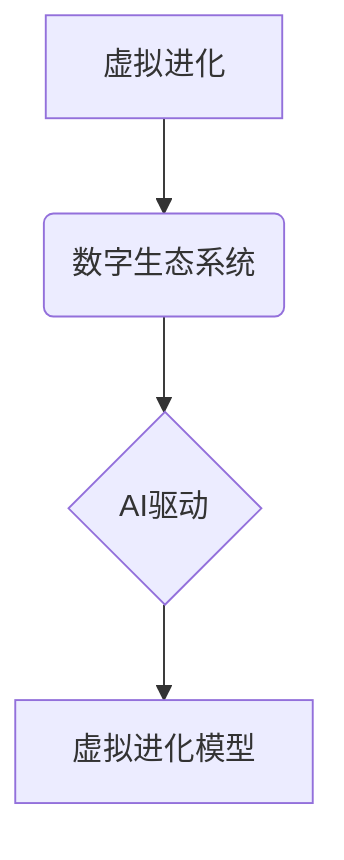

                 

## 虚拟进化模拟：AI驱动的数字生态系统研究

> 关键词：虚拟进化、人工智能、数字生态系统、模拟演化、算法优化、机器学习、深度学习

## 1. 背景介绍

随着人工智能技术的飞速发展，我们正处于一个前所未有的时代。AI已经渗透到生活的方方面面，从智能手机的语音助手到自动驾驶汽车，无处不在。然而，我们对AI的理解还停留在模仿人类智能的层面，而真正理解和模拟自然世界复杂演化的机制，仍然是一个巨大的挑战。

数字生态系统，作为人类社会和自然界相互交织的复杂网络，其演化规律和动态机制蕴藏着丰富的智慧和价值。虚拟进化模拟，作为一种利用人工智能技术模拟自然演化过程的全新方法，为我们探索数字生态系统提供了新的视角和工具。

## 2. 核心概念与联系

**2.1 虚拟进化**

虚拟进化是指利用计算机模拟自然演化过程，通过算法和数据驱动，观察和研究虚拟个体在虚拟环境中的演化轨迹。

**2.2 数字生态系统**

数字生态系统是指由数字技术、数据、算法、用户和服务等要素组成的复杂网络系统。其特点是开放、动态、自组织和协同进化。

**2.3 AI驱动的虚拟进化**

AI驱动的虚拟进化是指利用人工智能技术，例如机器学习和深度学习，来构建更智能、更逼真的虚拟进化模型。

**2.4 核心概念关系图**



## 3. 核心算法原理 & 具体操作步骤

**3.1 算法原理概述**

虚拟进化模拟的核心算法通常基于自然演化的基本原理，包括变异、选择和遗传。

* **变异:** 在虚拟个体之间引入随机变化，以增加遗传多样性。
* **选择:** 根据个体在虚拟环境中的适应度，选择更优良的个体进行繁殖。
* **遗传:** 将优良个体的特征传递给下一代，从而推动虚拟种群的进化。

**3.2 算法步骤详解**

1. **初始化:** 创建初始虚拟种群，每个个体都具有随机生成的特征。
2. **评估适应度:** 将虚拟个体放入虚拟环境中，根据其在环境中的表现，评估其适应度。
3. **选择:** 根据适应度进行选择，选择更优良的个体进行繁殖。
4. **交叉:** 将选中的个体进行交叉操作，将部分特征进行交换，产生新的个体。
5. **变异:** 在新的个体中引入随机变异，增加遗传多样性。
6. **更新种群:** 将新的个体加入到种群中，重复步骤2-5，直到达到预设的进化代数或目标适应度。

**3.3 算法优缺点**

* **优点:** 能够模拟自然演化过程，探索复杂系统的演化规律，并找到最优解。
* **缺点:** 计算量大，需要大量的计算资源和时间，并且难以控制演化方向。

**3.4 算法应用领域**

* **生物学:** 模拟生物进化过程，研究物种起源和演化机制。
* **计算机科学:** 优化算法设计，例如遗传算法和进化策略。
* **经济学:** 研究市场竞争和经济演化规律。
* **社会学:** 模拟社会群体行为和演化趋势。

## 4. 数学模型和公式 & 详细讲解 & 举例说明

**4.1 数学模型构建**

虚拟进化模拟的数学模型通常基于适应度函数和概率分布。

* **适应度函数:** 用于评估虚拟个体在虚拟环境中的表现，通常是一个数值函数，其值越高表示个体越适应环境。
* **概率分布:** 用于控制个体选择、交叉和变异的概率，例如正态分布、均匀分布等。

**4.2 公式推导过程**

* **适应度函数:**

$$
f(x) = \sum_{i=1}^{n} w_i \cdot g_i(x)
$$

其中，$f(x)$ 是个体 $x$ 的适应度，$w_i$ 是每个特征 $g_i(x)$ 的权重，$n$ 是个体特征的数量。

* **选择概率:**

$$
p(x) = \frac{f(x)}{\sum_{i=1}^{N} f(x_i)}
$$

其中，$p(x)$ 是个体 $x$ 的选择概率，$N$ 是种群大小。

**4.3 案例分析与讲解**

假设我们模拟一个虚拟环境，其中个体需要适应不同的地形和资源分布。我们可以定义适应度函数为：

$$
f(x) = height \cdot food + distance \cdot water
$$

其中，$height$ 是个体在该地形上的高度，$food$ 是该地形上的食物资源，$distance$ 是个体到水源的距离，$water$ 是水源的资源量。

通过调整权重 $w_i$，我们可以控制个体对不同特征的敏感度，从而模拟不同的演化压力。

## 5. 项目实践：代码实例和详细解释说明

**5.1 开发环境搭建**

* Python 3.x
* NumPy
* Matplotlib
* TensorFlow 或 PyTorch

**5.2 源代码详细实现**

```python
import numpy as np
import matplotlib.pyplot as plt

# 定义适应度函数
def fitness_function(individual):
    # ...

# 定义选择操作
def selection(population, fitness_values):
    # ...

# 定义交叉操作
def crossover(parent1, parent2):
    # ...

# 定义变异操作
def mutation(individual):
    # ...

# 初始化种群
population_size = 100
population = np.random.rand(population_size, num_genes)

# 进化循环
for generation in range(num_generations):
    # 计算适应度
    fitness_values = np.array([fitness_function(individual) for individual in population])

    # 选择个体
    selected_individuals = selection(population, fitness_values)

    # 交叉和变异
    new_population = crossover(selected_individuals)
    new_population = mutation(new_population)

    # 更新种群
    population = new_population

# 展示结果
plt.plot(fitness_values)
plt.xlabel("Generation")
plt.ylabel("Average Fitness")
plt.title("Evolutionary Algorithm Results")
plt.show()
```

**5.3 代码解读与分析**

* `fitness_function`: 定义个体适应度的计算方法。
* `selection`: 选择适应度更高的个体进行繁殖。
* `crossover`: 将两个父代个体的特征进行交换，产生新的子代个体。
* `mutation`: 在个体特征中引入随机变化，增加遗传多样性。
* 进化循环: 重复选择、交叉和变异操作，直到达到预设的进化代数或目标适应度。

**5.4 运行结果展示**

运行代码后，会生成一个图表，展示种群平均适应度的变化趋势。随着进化代数的增加，平均适应度通常会逐渐提高，表明虚拟种群正在朝着更适应环境的方向进化。

## 6. 实际应用场景

**6.1 智能城市规划**

利用虚拟进化模拟，可以模拟城市交通流量、资源分配、人口流动等复杂系统，探索最优的城市规划方案。

**6.2 生物医药研发**

模拟药物分子结构和作用机制，加速药物研发过程。

**6.3 机器人控制**

训练机器人适应不同的环境和任务，提高机器人控制的智能化水平。

**6.4 金融风险管理**

模拟金融市场波动和风险，帮助金融机构制定更有效的风险管理策略。

**6.5 未来应用展望**

随着人工智能技术的不断发展，虚拟进化模拟将在更多领域得到应用，例如个性化教育、精准医疗、可持续发展等。

## 7. 工具和资源推荐

**7.1 学习资源推荐**

* **书籍:**
    * 《进化算法》
    * 《人工智能：现代方法》
* **在线课程:**
    * Coursera: Evolutionary Algorithms
    * edX: Artificial Intelligence

**7.2 开发工具推荐**

* **Python:** 广泛应用于人工智能领域，拥有丰富的库和工具。
* **TensorFlow:** Google 开发的开源机器学习框架。
* **PyTorch:** Facebook 开发的开源机器学习框架。

**7.3 相关论文推荐**

* **《A Survey of Evolutionary Algorithms》**
* **《Deep Reinforcement Learning》**

## 8. 总结：未来发展趋势与挑战

**8.1 研究成果总结**

虚拟进化模拟为我们探索数字生态系统提供了新的视角和工具，并取得了一定的成果。

**8.2 未来发展趋势**

* **更智能的虚拟进化模型:** 利用更先进的人工智能技术，构建更智能、更逼真的虚拟进化模型。
* **更广泛的应用领域:** 将虚拟进化模拟应用到更多领域，例如个性化教育、精准医疗、可持续发展等。
* **更深入的理论研究:** 深入研究虚拟进化模拟的理论基础，探索其更深层的机制和规律。

**8.3 面临的挑战**

* **计算复杂度:** 虚拟进化模拟的计算复杂度较高，需要更强大的计算资源和算法优化。
* **模型准确性:** 构建准确的虚拟进化模型是一个挑战，需要对真实世界进行深入的理解和建模。
* **伦理问题:** 虚拟进化模拟的应用可能引发一些伦理问题，例如人工智能的自主性、数据隐私等。

**8.4 研究展望**

未来，虚拟进化模拟将继续发展，成为探索数字生态系统和人工智能的重要工具。


## 9. 附录：常见问题与解答

* **Q1: 虚拟进化模拟与传统模拟有什么区别？**

* **A1:** 虚拟进化模拟利用人工智能技术，能够模拟自然演化过程，并探索复杂系统的演化规律，而传统模拟通常是基于预设的规则和模型，难以捕捉到自然演化的复杂性和随机性。

* **Q2: 虚拟进化模拟的应用场景有哪些？**

* **A2:** 虚拟进化模拟的应用场景非常广泛，例如智能城市规划、生物医药研发、机器人控制、金融风险管理等。

* **Q3: 如何构建一个有效的虚拟进化模型？**

* **A3:** 构建一个有效的虚拟进化模型需要考虑以下几个因素：
    * 适应度函数的设计
    * 选择、交叉和变异操作的策略
    * 种群规模和进化代数
    * 环境的复杂性和随机性

* **Q4: 虚拟进化模拟有哪些局限性？**

* **A4:** 虚拟进化模拟的局限性包括计算复杂度高、模型准确性难以保证、伦理问题等。


作者：禅与计算机程序设计艺术 / Zen and the Art of Computer Programming 
<end_of_turn>

