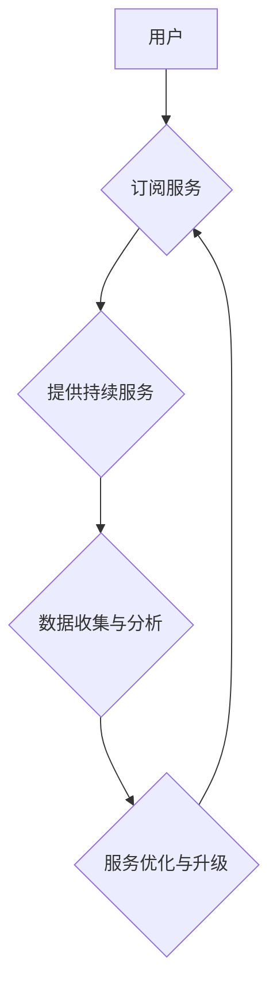

                 

## 订阅制经济的崛起:从软件到搜索引擎

> 关键词：订阅制经济、软件即服务(SaaS)、搜索引擎、商业模式、用户体验、数据驱动、云计算、人工智能

### 1. 背景介绍

互联网的蓬勃发展催生了各种创新的商业模式，其中订阅制经济的崛起尤为引人注目。从传统的软件销售模式向订阅制模式的转变，标志着科技行业的一次重大变革。订阅制经济的核心在于用户按需付费使用服务，而非一次性购买产品。这种模式不仅改变了软件行业，也逐渐渗透到搜索引擎、云计算、在线教育等领域，成为未来经济发展的重要趋势。

### 2. 核心概念与联系

订阅制经济的核心概念是“持续服务”。用户通过支付定期费用，获得持续的访问权和使用权限。这种模式与传统的购买模式形成鲜明对比，后者强调一次性交易，而前者则强调长期关系和价值创造。

**订阅制经济的架构**



**订阅制经济的优势:**

* **稳定收入:** 订阅模式为企业提供稳定的收入来源，有助于预测和管理财务状况。
* **用户粘性:** 持续的服务和更新可以增强用户粘性，降低用户流失率。
* **数据驱动:** 订阅模式可以收集大量用户数据，为服务优化和个性化提供依据。
* **创新动力:** 持续的服务和更新可以鼓励企业不断创新，开发新的功能和服务。

**订阅制经济的挑战:**

* **用户获取成本:** 吸引新用户和建立用户基础需要投入大量资源。
* **用户留存率:** 提高用户留存率和降低流失率是持续挑战。
* **服务质量:** 持续提供高质量服务是维持用户信任的关键。
* **价格策略:** 找到合适的定价策略，平衡收入和用户接受度，是关键。

### 3. 核心算法原理 & 具体操作步骤

订阅制经济的成功离不开强大的算法支持。这些算法在用户获取、留存、服务推荐等方面发挥着重要作用。

#### 3.1  算法原理概述

* **推荐算法:** 基于用户行为、偏好和历史数据，推荐个性化的服务和内容，提高用户参与度和留存率。
* **用户画像算法:** 分析用户数据，构建用户画像，了解用户需求和行为模式，为精准营销和服务提供支持。
* **预测分析算法:** 利用历史数据预测用户行为，例如 churn rate (用户流失率) 和 subscription renewal rate (订阅续费率)，帮助企业制定策略应对挑战。

#### 3.2  算法步骤详解

以推荐算法为例，其基本步骤包括：

1. **数据收集:** 收集用户行为数据，例如浏览记录、搜索历史、购买记录、评价等。
2. **数据预处理:** 清洗、转换和格式化数据，使其适合算法训练。
3. **特征工程:** 从原始数据中提取特征，例如用户兴趣、商品属性、时间戳等，为算法提供输入。
4. **模型训练:** 选择合适的推荐算法模型，例如协同过滤、内容过滤、深度学习等，并利用训练数据进行模型训练。
5. **模型评估:** 使用测试数据评估模型性能，例如准确率、召回率、覆盖率等。
6. **模型部署:** 将训练好的模型部署到线上环境，为用户提供个性化推荐。

#### 3.3  算法优缺点

**优点:**

* **个性化推荐:** 能够根据用户需求和偏好提供个性化的服务和内容。
* **提高用户参与度:** 个性化推荐可以提高用户参与度和留存率。
* **数据驱动:** 基于数据分析，能够不断优化推荐算法，提高推荐效果。

**缺点:**

* **数据依赖:** 推荐算法依赖于大量用户数据，数据质量直接影响推荐效果。
* **算法复杂度:** 一些推荐算法模型复杂度高，训练和部署成本较高。
* **冷启动问题:** 对新用户和新商品的推荐效果可能较差。

#### 3.4  算法应用领域

推荐算法广泛应用于各种领域，例如：

* **电商平台:** 推荐商品、促销活动和个性化套餐。
* **视频网站:** 推荐视频内容、用户关注的频道和相关视频。
* **音乐平台:** 推荐音乐歌曲、播放列表和音乐人。
* **社交媒体:** 推荐好友、群组和相关内容。

### 4. 数学模型和公式 & 详细讲解 & 举例说明

订阅制经济的运作可以抽象为数学模型，例如用户价值模型、生命周期价值模型等。

#### 4.1  数学模型构建

**用户价值模型:**

$$
User Value = \sum_{i=1}^{n} (Benefit_i - Cost_i)
$$

其中：

* $User Value$：用户获得的价值
* $Benefit_i$：用户从服务中获得的第 i 个利益
* $Cost_i$：用户使用服务所支付的第 i 个成本

**生命周期价值模型:**

$$
CLTV = \sum_{t=1}^{T} (Revenue_t - Cost_t)
$$

其中：

* $CLTV$：客户生命周期价值
* $Revenue_t$：在第 t 个时间段内获得的收入
* $Cost_t$：在第 t 个时间段内支付的成本
* $T$：客户生命周期长度

#### 4.2  公式推导过程

用户价值模型和生命周期价值模型的推导过程基于以下假设：

* 用户的行为可以被量化，例如使用时长、购买次数、评价分数等。
* 用户的价值可以被货币化，例如收入、成本、利润等。
* 用户的价值随时间推移而变化，需要考虑时间因素。

#### 4.3  案例分析与讲解

假设一家 SaaS 公司提供云存储服务，用户可以通过每月订阅获得不同容量的存储空间。

* **用户价值模型:** 用户从服务中获得的价值包括存储空间、数据安全、便捷访问等利益，而成本包括订阅费用、网络费用等。
* **生命周期价值模型:** 公司需要预测用户的订阅时长和使用频率，并计算出每个用户的生命周期价值。

通过分析用户价值和生命周期价值，公司可以制定更精准的定价策略、用户获取策略和服务优化策略。

### 5. 项目实践：代码实例和详细解释说明

以下是一个简单的订阅制经济系统代码实例，使用 Python 语言实现用户订阅功能。

#### 5.1  开发环境搭建

* Python 3.x
* Flask 框架

#### 5.2  源代码详细实现

```python
from flask import Flask, render_template, request

app = Flask(__name__)

users = {}

@app.route('/')
def index():
    return render_template('index.html')

@app.route('/subscribe', methods=['POST'])
def subscribe():
    username = request.form['username']
    plan = request.form['plan']
    users[username] = {'plan': plan}
    return '订阅成功!'

if __name__ == '__main__':
    app.run(debug=True)
```

#### 5.3  代码解读与分析

* `users` 变量存储用户订阅信息，以用户名为 key，订阅计划为 value。
* `/` 路由渲染首页 `index.html` 模板。
* `/subscribe` 路由处理用户订阅请求，获取用户名和订阅计划，并将信息存储到 `users` 变量中。

#### 5.4  运行结果展示

运行代码后，访问 `http://127.0.0.1:5000/`，即可看到首页，并可以通过表单提交订阅请求。

### 6. 实际应用场景

订阅制经济已经广泛应用于各种领域，例如：

* **软件行业:** SaaS (Software as a Service) 模式，例如 Salesforce、Dropbox、Zoom 等。
* **搜索引擎:** 搜索引擎广告，例如 Google Ads、Baidu Ads 等。
* **云计算:** 云存储、云服务器、云数据库等服务，例如 AWS、Azure、Aliyun 等。
* **在线教育:** 在线课程、在线辅导、在线考试等服务，例如 Coursera、Udemy、Khan Academy 等。

### 6.4  未来应用展望

订阅制经济的未来发展趋势包括：

* **个性化订阅:** 基于用户行为和偏好，提供更个性化的订阅服务和内容。
* **混合订阅:** 结合多种订阅模式，例如按需订阅、按量订阅、套餐订阅等，满足不同用户的需求。
* **人工智能驱动:** 利用人工智能技术，优化订阅策略、预测用户行为、提供个性化推荐等。
* **元宇宙融合:** 将订阅制经济模式融入元宇宙，提供虚拟世界中的订阅服务和体验。

### 7. 工具和资源推荐

#### 7.1  学习资源推荐

* **书籍:**

    * 《订阅经济》
    * 《The Subscription Economy》

* **在线课程:**

    * Coursera: Subscription Business Models
    * Udemy: The Subscription Economy

#### 7.2  开发工具推荐

* **Python:** 强大的编程语言，适合开发订阅制经济系统。
* **Flask:** 轻量级 Web 框架，方便快速搭建 Web 应用。
* **Django:** 功能强大的 Web 框架，适合开发复杂 Web 应用。

#### 7.3  相关论文推荐

* **The Subscription Economy: A New Business Model for the Digital Age**
* **The Impact of Subscription Models on Customer Loyalty and Retention**

### 8. 总结：未来发展趋势与挑战

订阅制经济正在改变着传统商业模式，为企业提供了新的增长机会。然而，订阅制经济也面临着一些挑战，例如用户获取成本、用户留存率、服务质量等。未来，订阅制经济的发展将更加注重个性化、智能化和融合性，需要企业不断创新和探索。

#### 8.1  研究成果总结

* 订阅制经济的成功依赖于强大的算法支持，例如推荐算法、用户画像算法、预测分析算法等。
* 订阅制经济的运作可以抽象为数学模型，例如用户价值模型、生命周期价值模型等。
* 订阅制经济的应用场景不断拓展，涵盖软件、搜索引擎、云计算、在线教育等领域。

#### 8.2  未来发展趋势

* **个性化订阅:** 基于用户行为和偏好，提供更个性化的订阅服务和内容。
* **混合订阅:** 结合多种订阅模式，例如按需订阅、按量订阅、套餐订阅等，满足不同用户的需求。
* **人工智能驱动:** 利用人工智能技术，优化订阅策略、预测用户行为、提供个性化推荐等。
* **元宇宙融合:** 将订阅制经济模式融入元宇宙，提供虚拟世界中的订阅服务和体验。

#### 8.3  面临的挑战

* **用户获取成本:** 吸引新用户和建立用户基础需要投入大量资源。
* **用户留存率:** 提高用户留存率和降低流失率是持续挑战。
* **服务质量:** 持续提供高质量服务是维持用户信任的关键。
* **价格策略:** 找到合适的定价策略，平衡收入和用户接受度，是关键。

#### 8.4  研究展望

* 深入研究订阅制经济的数学模型和算法，提高推荐精度和用户体验。
* 探索订阅制经济在元宇宙中的应用场景，构建新的商业模式。
* 研究订阅制经济对社会经济的影响，探讨其长远发展趋势。

### 9. 附录：常见问题与解答

* **什么是订阅制经济？**

订阅制经济是一种商业模式，用户通过支付定期费用，获得持续的访问权和使用权限。

* **订阅制经济的优势有哪些？**

稳定收入、用户粘性、数据驱动、创新动力。

* **订阅制经济的挑战有哪些？**

用户获取成本、用户留存率、服务质量、价格策略。


作者：禅与计算机程序设计艺术 / Zen and the Art of Computer Programming 
<end_of_turn>

