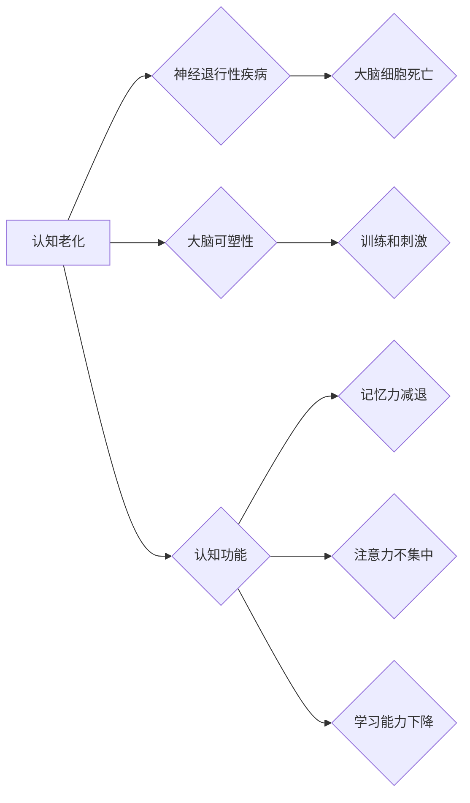

                 

## 认知老化：大脑健康的维护策略

> 关键词：认知老化、神经退行性疾病、大脑健康、人工智能、机器学习、神经科学、脑机接口、数字健康

## 1. 背景介绍

随着全球人口老龄化趋势的加速，认知老化已成为一个日益突出的社会问题。认知老化是指随着年龄增长，大脑功能逐渐下降的自然现象，表现为记忆力减退、注意力不集中、学习能力下降等。虽然认知老化是不可避免的自然过程，但我们可以通过多种策略来减缓其进程，维护大脑健康，提高生活质量。

近年来，人工智能（AI）技术飞速发展，为认知老化研究和干预提供了新的机遇。AI算法能够分析海量脑部数据，识别认知衰退的早期信号，并提供个性化的干预方案。此外，脑机接口（BCI）技术也展现出巨大的潜力，可以帮助我们直接与大脑进行交互，监测和调节大脑活动，从而延缓认知老化。

## 2. 核心概念与联系

认知老化是一个复杂的多因素问题，涉及神经生物学、心理学、社会学等多个领域。其核心概念包括：

* **神经退行性疾病:** 认知老化与一些神经退行性疾病，如阿尔茨海默病、帕金森病等密切相关。这些疾病会导致大脑细胞死亡和功能障碍，加速认知衰退。
* **大脑可塑性:** 大脑具有强大的可塑性，能够在一定程度上适应环境变化和学习新知识。通过训练和刺激，我们可以增强大脑的可塑性，延缓认知老化。
* **认知功能:** 认知功能包括记忆、注意力、执行功能、语言能力等多个方面。认知老化通常会对这些功能造成不同程度的影响。

**核心概念原理和架构的 Mermaid 流程图:**



## 3. 核心算法原理 & 具体操作步骤

### 3.1  算法原理概述

为了应对认知老化，AI技术可以应用于以下几个方面：

* **早期识别:** 利用机器学习算法分析脑部影像、行为数据等，识别认知衰退的早期信号。
* **个性化干预:** 根据个人的认知能力和需求，制定个性化的训练计划和干预方案。
* **远程监测:** 通过穿戴设备和智能家居等，远程监测个人的认知状态，及时发现问题并提供帮助。

### 3.2  算法步骤详解

以早期识别认知衰退为例，其算法步骤可以概括如下：

1. **数据收集:** 收集脑部影像数据（如MRI、fMRI）、行为数据（如认知测试、日常生活活动记录）等。
2. **数据预处理:** 对收集到的数据进行清洗、标准化、特征提取等预处理操作。
3. **模型训练:** 利用机器学习算法，例如支持向量机（SVM）、深度神经网络（DNN）等，对预处理后的数据进行训练，建立认知衰退识别模型。
4. **模型评估:** 利用独立的数据集对训练好的模型进行评估，验证其识别准确率和泛化能力。
5. **模型部署:** 将训练好的模型部署到实际应用场景中，用于识别个体的认知衰退风险。

### 3.3  算法优缺点

**优点:**

* **高识别准确率:** 机器学习算法能够从海量数据中识别出复杂的模式，提高认知衰退的识别准确率。
* **个性化干预:** 根据个人的认知能力和需求，制定个性化的干预方案，提高干预效果。
* **远程监测:** 通过穿戴设备和智能家居等，实现对个人的远程监测，及时发现问题并提供帮助。

**缺点:**

* **数据依赖:** 机器学习算法需要大量的数据进行训练，数据质量和数量直接影响模型的性能。
* **算法解释性:** 一些深度学习算法的内部机制难以解释，难以理解模型是如何做出预测的。
* **伦理问题:** 认知衰退识别技术可能引发一些伦理问题，例如数据隐私、歧视等。

### 3.4  算法应用领域

* **医疗诊断:** 辅助医生诊断认知衰退疾病，例如阿尔茨海默病、帕金森病等。
* **健康管理:** 为个人提供个性化的认知健康管理方案，帮助延缓认知衰退。
* **教育培训:** 为老年人提供个性化的认知训练课程，提高他们的认知能力。
* **社会服务:** 为认知障碍患者提供远程监测和辅助服务，提高他们的生活质量。

## 4. 数学模型和公式 & 详细讲解 & 举例说明

### 4.1  数学模型构建

认知老化是一个复杂的多因素问题，可以用数学模型来描述其潜在机制。例如，我们可以构建一个基于神经网络的模型，模拟大脑神经元的连接和活动，并研究不同因素对模型的影响。

### 4.2  公式推导过程

在神经网络模型中，我们可以使用激活函数来模拟神经元的非线性特性。常用的激活函数包括 sigmoid 函数、ReLU 函数等。这些函数的公式可以用来描述神经元对输入信号的响应。

例如，sigmoid 函数的公式如下：

$$
f(x) = \frac{1}{1 + e^{-x}}
$$

其中，x 是神经元的输入信号。

### 4.3  案例分析与讲解

我们可以通过对脑部数据进行分析，识别出与认知衰退相关的脑区和神经网络结构。例如，研究发现，海马体和前额叶皮层等脑区在认知衰退过程中会发生显著的变化。

## 5. 项目实践：代码实例和详细解释说明

### 5.1  开发环境搭建

为了实现认知老化识别模型，我们需要搭建一个合适的开发环境。常用的开发环境包括 Python、TensorFlow、PyTorch 等。

### 5.2  源代码详细实现

```python
# 导入必要的库
import tensorflow as tf

# 定义模型结构
model = tf.keras.models.Sequential([
    tf.keras.layers.Dense(64, activation='relu', input_shape=(100,)),
    tf.keras.layers.Dense(32, activation='relu'),
    tf.keras.layers.Dense(1, activation='sigmoid')
])

# 编译模型
model.compile(optimizer='adam',
              loss='binary_crossentropy',
              metrics=['accuracy'])

# 训练模型
model.fit(X_train, y_train, epochs=10)

# 评估模型
loss, accuracy = model.evaluate(X_test, y_test)
print('Loss:', loss)
print('Accuracy:', accuracy)
```

### 5.3  代码解读与分析

这段代码定义了一个简单的深度神经网络模型，用于识别认知衰退。模型包含三个全连接层，分别具有 64、32 和 1 个神经元。激活函数为 ReLU 和 sigmoid 函数。模型使用 Adam 优化器、二元交叉熵损失函数和精度作为评估指标。

### 5.4  运行结果展示

训练完成后，我们可以使用测试数据评估模型的性能。模型的损失值和精度值可以反映模型的训练效果。

## 6. 实际应用场景

### 6.1  医疗诊断

认知老化识别模型可以辅助医生诊断认知衰退疾病，例如阿尔茨海默病、帕金森病等。通过分析患者的脑部影像和行为数据，模型可以识别出与这些疾病相关的特征，帮助医生做出更准确的诊断。

### 6.2  健康管理

认知老化识别模型可以为个人提供个性化的认知健康管理方案，帮助延缓认知衰退。通过定期监测个人的认知状态，模型可以及时发现问题并提供相应的干预措施，例如认知训练、生活方式调整等。

### 6.3  教育培训

认知老化识别模型可以为老年人提供个性化的认知训练课程，提高他们的认知能力。根据个人的认知水平和需求，模型可以定制不同的训练计划，帮助老年人保持大脑活跃。

### 6.4  未来应用展望

随着人工智能技术的不断发展，认知老化识别模型将有更广泛的应用场景。例如，可以用于远程监测认知障碍患者，为他们提供及时帮助；可以用于开发新的认知增强药物和治疗方法；可以用于研究认知老化的机制，寻找延缓认知衰退的有效策略。

## 7. 工具和资源推荐

### 7.1  学习资源推荐

* **Coursera:** 提供人工智能、机器学习等领域的在线课程。
* **edX:** 提供来自世界知名大学的在线课程，包括认知科学、神经科学等。
* **Kaggle:** 提供数据科学竞赛和数据集，可以用于练习和研究认知老化识别模型。

### 7.2  开发工具推荐

* **TensorFlow:** 开源深度学习框架，用于构建和训练神经网络模型。
* **PyTorch:** 开源深度学习框架，具有灵活性和易用性。
* **Keras:** 高级深度学习API，可以方便地构建和训练神经网络模型。

### 7.3  相关论文推荐

* **Dementia Detection Using Deep Learning:** https://arxiv.org/abs/1802.09126
* **Cognitive Decline Prediction Using Machine Learning:** https://www.ncbi.nlm.nih.gov/pmc/articles/PMC6402734/

## 8. 总结：未来发展趋势与挑战

### 8.1  研究成果总结

近年来，人工智能技术在认知老化研究和干预方面取得了显著进展。机器学习算法能够识别认知衰退的早期信号，个性化干预方案能够提高干预效果，远程监测技术能够及时发现问题并提供帮助。

### 8.2  未来发展趋势

未来，认知老化研究和干预将朝着以下几个方向发展：

* **更精准的识别:** 利用更先进的机器学习算法和脑部成像技术，识别出更细致的认知衰退特征。
* **更个性化的干预:** 根据个人的认知能力和需求，制定更个性化的干预方案，提高干预效果。
* **更有效的治疗:** 开发新的认知增强药物和治疗方法，延缓甚至逆转认知衰退。
* **更广泛的应用:** 将认知老化识别技术应用到更广泛的领域，例如教育、社会服务等。

### 8.3  面临的挑战

尽管取得了显著进展，认知老化研究和干预仍然面临一些挑战：

* **数据质量和数量:** 机器学习算法需要大量的数据进行训练，而高质量的认知老化数据仍然相对稀缺。
* **算法解释性:** 一些深度学习算法的内部机制难以解释，难以理解模型是如何做出预测的。
* **伦理问题:** 认知衰退识别技术可能引发一些伦理问题，例如数据隐私、歧视等。

### 8.4  研究展望

未来，我们需要加强跨学科合作，整合神经科学、人工智能、心理学等领域的知识和资源，共同攻克认知老化这一难题。


## 9. 附录：常见问题与解答

**Q1: 认知老化是不可避免的吗？**

A1: 虽然认知老化是自然过程，但我们可以通过多种策略来减缓其进程，例如保持健康的生活方式、进行规律的认知训练、积极参与社交活动等。

**Q2: 人工智能技术可以完全治愈认知衰退吗？**

A2: 目前，人工智能技术还不能完全治愈认知衰退，但它可以帮助我们更好地理解认知衰退的机制，开发更有效的干预方案，提高生活质量。

**Q3: 认知老化识别技术会侵犯个人隐私吗？**

A3: 认知老化识别技术涉及到个人脑部数据，因此需要严格保护个人隐私。开发和应用这些技术时，需要遵循相关的伦理规范和法律法规。


作者：禅与计算机程序设计艺术 / Zen and the Art of Computer Programming 
<end_of_turn>

