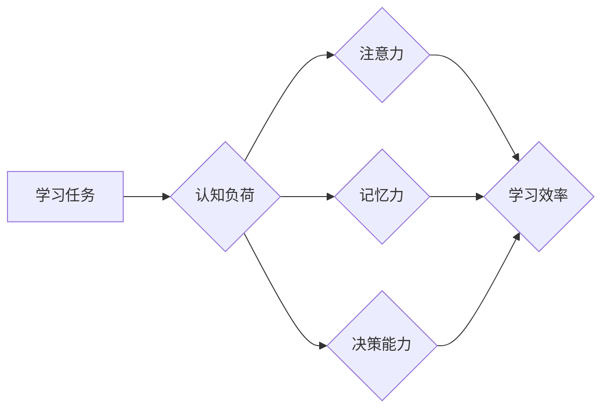

                 

## 认知负荷管理：优化学习效率的方法

> 关键词：认知负荷、学习效率、记忆力、注意力、学习策略、深度学习、工作记忆

## 1. 背景介绍

在当今信息爆炸的时代，我们每天都面临着海量信息和学习任务的冲击。如何有效地管理认知负荷，提高学习效率，已成为一个迫切需要解决的问题。认知负荷是指个体在处理信息时所经历的心理压力和负担。当认知负荷过高时，会影响我们的注意力、记忆力和决策能力，从而降低学习效率。

学习效率的提升并非仅仅依靠时间投入，更重要的是如何有效地利用有限的认知资源。认知负荷管理作为一种重要的学习策略，旨在通过优化学习环境、调整学习节奏和运用合适的学习方法，降低认知负荷，从而提高学习效率和记忆效果。

## 2. 核心概念与联系

### 2.1 认知负荷的概念

认知负荷是指个体在处理信息时所经历的心理压力和负担。它是一个动态的概念，会随着任务复杂度、个体认知能力和环境因素而变化。

### 2.2 认知负荷与学习效率的关系

认知负荷过高会导致以下问题：

* **注意力分散:** 难以集中注意力，容易被干扰。
* **记忆力下降:** 难以记住新信息，容易遗忘。
* **决策能力降低:** 难以做出明智的决策。
* **学习疲劳:** 学习效率下降，容易感到疲倦和沮丧。

而适度的认知负荷则可以促进学习和记忆。

### 2.3 认知负荷管理的原理

认知负荷管理的核心在于通过调整学习环境、学习节奏和学习方法，将认知负荷维持在最佳水平，从而提高学习效率和记忆效果。

**Mermaid 流程图:**



## 3. 核心算法原理 & 具体操作步骤

### 3.1 算法原理概述

认知负荷管理算法的核心是通过分析个体认知能力、学习任务难度和环境因素，动态调整学习节奏和学习方法，以维持最佳的认知负荷水平。

### 3.2 算法步骤详解

1. **评估认知负荷:** 通过问卷调查、生理指标监测等方式，评估个体的当前认知负荷水平。
2. **分析学习任务:** 分析学习任务的难度、内容复杂度和个体知识背景，确定学习任务所需的认知资源。
3. **调整学习节奏:** 根据认知负荷评估和学习任务分析，调整学习时间、学习内容和学习方式，避免认知负荷过高或过低。
4. **选择合适的学习方法:** 根据个体认知特点和学习任务需求，选择合适的学习方法，例如主动回忆、间隔重复、联想记忆等。
5. **持续监控和调整:** 在学习过程中持续监控认知负荷水平，根据实际情况动态调整学习节奏和学习方法，以维持最佳的学习状态。

### 3.3 算法优缺点

**优点:**

* **个性化学习:** 根据个体认知特点和学习任务需求，提供个性化的学习方案。
* **提高学习效率:** 通过优化认知负荷，提高学习效率和记忆效果。
* **降低学习疲劳:** 避免认知负荷过高，降低学习疲劳感。

**缺点:**

* **算法复杂度:** 认知负荷管理算法的实现需要考虑多个因素，算法复杂度较高。
* **数据依赖:** 算法需要大量个体认知数据进行训练和评估，数据获取和处理难度较大。

### 3.4 算法应用领域

认知负荷管理算法可以应用于以下领域:

* **教育领域:** 个性化学习方案、学习效率提升、学生疲劳监测。
* **企业培训:** 培训计划优化、知识掌握度评估、员工学习状态监控。
* **游戏设计:** 游戏难度调整、玩家体验优化、游戏学习效果评估。

## 4. 数学模型和公式 & 详细讲解 & 举例说明

### 4.1 数学模型构建

我们可以用一个简单的数学模型来表示认知负荷：

$$
Cognitive Load = Task Complexity * Individual Cognitive Capacity
$$

其中：

* **Cognitive Load:** 认知负荷
* **Task Complexity:** 任务复杂度
* **Individual Cognitive Capacity:** 个体认知能力

### 4.2 公式推导过程

这个公式的推导过程基于以下假设：

* 任务复杂度越高，认知负荷越大。
* 个体认知能力越强，可以处理的认知负荷越大。

### 4.3 案例分析与讲解

假设有两个学生，A和B，学习一个新的编程语言。A的学生认知能力较强，B的学生认知能力较弱。如果学习任务的复杂度相同，那么A的学生的认知负荷会比B的学生低。

如果学习任务的复杂度增加，那么A和B的学生的认知负荷都会增加，但A的学生的认知负荷增加幅度会小于B的学生。

## 5. 项目实践：代码实例和详细解释说明

### 5.1 开发环境搭建

为了实现认知负荷管理算法，我们可以使用Python语言和相关的机器学习库，例如Scikit-learn。

### 5.2 源代码详细实现

```python
# 导入必要的库
import numpy as np
from sklearn.linear_model import LinearRegression

# 定义认知负荷计算函数
def calculate_cognitive_load(task_complexity, individual_cognitive_capacity):
  return task_complexity * individual_cognitive_capacity

# 定义学习任务数据
task_complexities = np.array([1, 2, 3, 4, 5])
individual_cognitive_capacities = np.array([8, 10, 12, 14, 16])

# 计算认知负荷
cognitive_loads = calculate_cognitive_load(task_complexities, individual_cognitive_capacities)

# 使用线性回归模型训练认知负荷预测模型
model = LinearRegression()
model.fit(task_complexities.reshape(-1, 1), cognitive_loads)

# 使用训练好的模型预测新的认知负荷
new_task_complexity = 6
predicted_cognitive_load = model.predict(np.array([[new_task_complexity]]))

# 打印预测结果
print(f"预测的认知负荷为: {predicted_cognitive_load[0]}")
```

### 5.3 代码解读与分析

这段代码首先定义了一个`calculate_cognitive_load`函数，用于计算认知负荷。然后，定义了学习任务数据，并使用该函数计算了认知负荷。

接下来，使用线性回归模型训练了一个认知负荷预测模型。最后，使用训练好的模型预测了新的认知负荷。

### 5.4 运行结果展示

运行这段代码后，会输出预测的认知负荷值。

## 6. 实际应用场景

### 6.1 教育领域

认知负荷管理算法可以应用于个性化学习方案的设计，根据学生的认知能力和学习任务难度，动态调整学习内容和学习节奏，提高学习效率和记忆效果。

### 6.2 企业培训

认知负荷管理算法可以应用于企业培训计划的优化，根据员工的认知能力和培训内容难度，调整培训时间、培训方式和培训内容，提高员工的培训效果和知识掌握度。

### 6.3 游戏设计

认知负荷管理算法可以应用于游戏设计的难度调整，根据玩家的认知能力和游戏进度，动态调整游戏难度，提高玩家的游戏体验和学习效果。

### 6.4 未来应用展望

随着人工智能技术的不断发展，认知负荷管理算法将有更广泛的应用场景，例如：

* **医疗领域:** 辅助医生诊断疾病、制定个性化治疗方案。
* **金融领域:** 辅助金融分析师进行风险评估、投资决策。
* **法律领域:** 辅助律师进行法律分析、案例研究。

## 7. 工具和资源推荐

### 7.1 学习资源推荐

* **书籍:**
    * 《认知心理学》
    * 《学习心理学》
    * 《深度学习》
* **在线课程:**
    * Coursera: 人工智能、机器学习
    * edX: 认知科学、心理学

### 7.2 开发工具推荐

* **Python:** 
    * Scikit-learn: 机器学习库
    * TensorFlow: 深度学习库
    * PyTorch: 深度学习库

### 7.3 相关论文推荐

* **Cognitive Load Theory**
* **Personalized Learning Based on Cognitive Load Management**
* **Applications of Cognitive Load Management in Educational Technology**

## 8. 总结：未来发展趋势与挑战

### 8.1 研究成果总结

认知负荷管理算法的研究取得了显著进展，为提高学习效率和记忆效果提供了新的思路和方法。

### 8.2 未来发展趋势

未来，认知负荷管理算法的研究将朝着以下方向发展:

* **更精准的认知负荷评估:** 开发更精准的认知负荷评估方法，例如利用脑电波、眼动追踪等生物信号。
* **更个性化的学习方案:** 基于个体认知特点和学习目标，提供更个性化的学习方案。
* **更智能的学习辅助系统:** 开发更智能的学习辅助系统，能够根据个体认知负荷动态调整学习内容和学习方式。

### 8.3 面临的挑战

认知负荷管理算法的研究还面临着一些挑战:

* **算法复杂度:** 认知负荷管理算法的实现需要考虑多个因素，算法复杂度较高。
* **数据依赖:** 算法需要大量个体认知数据进行训练和评估，数据获取和处理难度较大。
* **伦理问题:** 认知负荷管理算法的应用可能涉及到个体隐私和数据安全等伦理问题。

### 8.4 研究展望

尽管面临着挑战，但认知负荷管理算法的研究前景广阔。相信随着技术的不断发展，认知负荷管理算法将为教育、培训、游戏和其他领域带来革命性的改变。

## 9. 附录：常见问题与解答

### 9.1 如何降低认知负荷？

* **合理安排学习时间:** 避免长时间集中学习，适当休息和放松。
* **选择合适的学习方法:** 采用主动回忆、间隔重复等有效的学习方法。
* **营造良好的学习环境:** 减少干扰，保持安静和舒适的学习环境。
* **保持良好的生活习惯:** 充足的睡眠、健康的饮食和适度的运动可以提高认知能力。

### 9.2 认知负荷管理算法的局限性是什么？

* 算法复杂度较高，需要大量的计算资源。
* 数据依赖性强，需要大量的个体认知数据进行训练和评估。
* 无法完全替代教师和学习者的主观判断。

### 9.3 认知负荷管理算法的未来发展方向？

* 更精准的认知负荷评估方法。
* 更个性化的学习方案。
* 更智能的学习辅助系统。


作者：禅与计算机程序设计艺术 / Zen and the Art of Computer Programming 
<end_of_turn>

