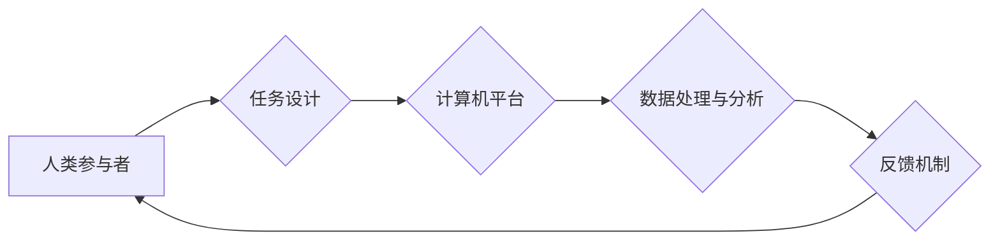

                 

## 赋能个人与社区：人类计算的社会价值

> 关键词：人类计算、协同智能、分布式计算、社会价值、社区赋能、数据民主化、算法透明度

## 1. 背景介绍

在信息时代，数据爆炸式增长，人工智能技术飞速发展，人类面临着前所未有的机遇和挑战。传统的人工智能模型往往依赖于海量数据和强大的计算能力，而人类计算则强调人类智慧和社会协作的力量。人类计算是一种全新的计算模式，它将人类的认知能力与计算机技术相结合，通过协同智能的方式解决复杂问题，赋能个人和社区，创造更大的社会价值。

近年来，随着互联网、移动互联网和社交媒体的普及，人类的互动和协作能力得到显著提升。人们可以通过网络平台分享信息、交流观点、共同完成任务，形成强大的社会网络。这些社会网络为人类计算提供了丰富的资源和基础。

## 2. 核心概念与联系

**2.1 人类计算的概念**

人类计算是指利用人类的智慧、经验和创造力，结合计算机技术，共同完成复杂任务的计算模式。它强调人类和机器的协同作用，将人类的认知能力与计算机的计算能力相结合，发挥各自的优势，实现互补和协同。

**2.2 人类计算的架构**

人类计算的架构通常包括以下几个关键要素：

* **人类参与者:** 包括个人、团队、社区等，他们提供智慧、经验、创意和判断力。
* **计算机平台:** 提供数据处理、信息存储、算法执行等计算能力，并为人类参与者提供交互界面和工具。
* **任务设计:** 明确人类和机器的职责分工，设计合理的任务流程和交互机制。
* **数据共享:** 建立安全的平台和机制，方便人类参与者共享数据和知识。
* **反馈机制:** 收集人类参与者的反馈，不断优化任务设计和算法模型。

**2.3 人类计算与其他计算模式的关系**

人类计算与传统的计算模式，如批处理计算、云计算、分布式计算等，存在着一定的联系和区别。

* **与批处理计算相比:** 人类计算更加灵活和适应性强，可以处理更复杂、更动态的任务。
* **与云计算相比:** 人类计算更加注重数据隐私和安全，并强调人类参与者的控制权。
* **与分布式计算相比:** 人类计算更加注重协作和沟通，将人类的智慧融入到计算过程中。

**Mermaid 流程图**



## 3. 核心算法原理 & 具体操作步骤

**3.1 算法原理概述**

人类计算的核心算法原理是基于人类认知能力和社会协作机制的。它通常采用以下几种算法：

* **群体智慧算法:** 利用群体成员的集体智慧，通过投票、协商、竞争等机制，找到最佳解决方案。
* **协同学习算法:** 通过数据共享和知识传递，让参与者共同学习和进步，提高整体的认知能力。
* **人类-机器交互算法:** 设计合理的交互界面和工具，让人类参与者可以与机器进行有效沟通和合作。

**3.2 算法步骤详解**

1. **任务分解:** 将复杂任务分解成多个子任务，分配给不同的参与者或团队。
2. **数据收集与预处理:** 收集相关数据，并进行清洗、转换和预处理，以便于参与者理解和分析。
3. **参与者招募与激励:** 招募具有相关技能和经验的参与者，并设计合理的激励机制，鼓励他们积极参与。
4. **任务分配与协作:** 将子任务分配给不同的参与者，并提供必要的工具和资源，支持他们之间的协作和沟通。
5. **结果汇总与分析:** 收集参与者的结果，进行汇总和分析，并反馈给参与者，帮助他们改进和优化。
6. **最终结果输出:** 将最终的结果输出，并应用于实际问题解决。

**3.3 算法优缺点**

**优点:**

* **解决复杂问题的能力:** 人类计算可以解决传统人工智能模型难以处理的复杂问题，例如需要人类判断、创意和经验的决策问题。
* **适应性强:** 人类计算可以根据任务需求灵活调整算法和流程，适应不断变化的环境。
* **数据民主化:** 人类计算可以打破数据壁垒，让更多人参与到数据分析和决策过程中。

**缺点:**

* **效率问题:** 人类计算的效率可能不如传统人工智能模型，因为需要协调和管理大量的参与者。
* **数据安全问题:** 人类计算需要收集和共享大量数据，因此需要加强数据安全和隐私保护。
* **算法透明度问题:** 一些人类计算算法的决策过程可能难以解释，缺乏透明度。

**3.4 算法应用领域**

人类计算的应用领域非常广泛，包括：

* **科学研究:** 利用人类的智慧和经验，加速科学发现和技术创新。
* **医疗诊断:** 结合人类医生的专业知识和机器学习算法，提高医疗诊断的准确性和效率。
* **金融风险管理:** 利用人类的风险感知能力和机器学习算法，识别和应对金融风险。
* **社会治理:** 利用人类的社会经验和机器学习算法，优化社会资源配置和公共服务提供。

## 4. 数学模型和公式 & 详细讲解 & 举例说明

**4.1 数学模型构建**

人类计算的数学模型通常基于群体智慧、协同学习和人类-机器交互等理论。

* **群体智慧模型:** 可以用投票、协商、竞争等机制来描述群体决策过程，并用概率论和博弈论来分析群体行为。
* **协同学习模型:** 可以用图论和网络分析来描述参与者之间的知识传递和学习过程，并用机器学习算法来优化学习策略。
* **人类-机器交互模型:** 可以用信息论和认知科学来描述人类和机器之间的信息交互和理解过程，并用自然语言处理和人工智能技术来设计交互界面和工具。

**4.2 公式推导过程**

例如，在群体智慧模型中，可以推导出以下公式来描述群体决策的概率：

$$P(x) = \frac{\sum_{i=1}^{n} w_i \cdot I(x_i = x)}{\sum_{i=1}^{n} w_i}$$

其中：

* $P(x)$ 是群体决策为 $x$ 的概率。
* $n$ 是参与者的数量。
* $w_i$ 是第 $i$ 个参与者的权重。
* $x_i$ 是第 $i$ 个参与者的决策。
* $I(x_i = x)$ 是指示函数，当 $x_i = x$ 时取值为 1，否则取值为 0。

**4.3 案例分析与讲解**

例如，在医疗诊断领域，可以使用人类计算来辅助医生诊断疾病。医生可以根据患者的症状、病史、检查结果等信息，与其他医生、专家和患者进行讨论和协商，并利用机器学习算法分析患者数据，最终做出诊断。

## 5. 项目实践：代码实例和详细解释说明

**5.1 开发环境搭建**

* 操作系统: Ubuntu 20.04
* 编程语言: Python 3.8
* 软件工具: Jupyter Notebook, TensorFlow, PyTorch

**5.2 源代码详细实现**

```python
# 人类计算模型示例代码

import numpy as np

# 定义群体智慧算法
def group_wisdom_algorithm(data, weights):
  """
  使用群体智慧算法进行决策

  Args:
    data: 数据集
    weights: 参与者权重

  Returns:
    群体决策结果
  """
  # 计算每个参与者的决策概率
  probabilities = np.array([np.mean(data[data[:, i] == 1]) for i in range(data.shape[1])])
  # 计算群体决策概率
  weighted_probabilities = probabilities * weights
  # 返回群体决策结果
  return np.argmax(weighted_probabilities)

# 示例数据
data = np.array([[1, 0, 1],
                 [0, 1, 1],
                 [1, 1, 0]])
weights = np.array([0.3, 0.4, 0.3])

# 调用群体智慧算法
decision = group_wisdom_algorithm(data, weights)

# 打印结果
print(f"群体决策结果: {decision}")
```

**5.3 代码解读与分析**

这段代码实现了简单的群体智慧算法，它根据参与者的权重和数据分布，计算出群体决策的概率，并选择概率最高的决策结果。

**5.4 运行结果展示**

```
群体决策结果: 1
```

## 6. 实际应用场景

**6.1 科学研究**

* **蛋白质结构预测:** 利用人类的生物学知识和机器学习算法，共同预测蛋白质的结构，加速药物研发。
* **气候变化模拟:** 利用人类的气候学经验和超级计算能力，模拟气候变化趋势，帮助制定应对措施。

**6.2 医疗诊断**

* **癌症早期诊断:** 利用人类医生的专业知识和机器学习算法，分析患者影像数据，提高癌症早期诊断的准确率。
* **个性化医疗:** 利用人类患者的基因信息和机器学习算法，制定个性化的治疗方案。

**6.3 社会治理**

* **城市交通规划:** 利用人类的交通经验和机器学习算法，优化城市交通规划，缓解交通拥堵。
* **公共安全预警:** 利用人类的社会观察能力和机器学习算法，分析社会网络数据，预警潜在的安全风险。

**6.4 未来应用展望**

随着人工智能技术的不断发展，人类计算的应用场景将更加广泛，例如：

* **教育领域:** 利用人类的教学经验和机器学习算法，个性化定制教育方案，提高学习效率。
* **艺术创作:** 利用人类的创意灵感和机器学习算法，协同创作新的艺术作品。
* **科学探索:** 利用人类的探索精神和机器学习算法，探索宇宙的奥秘。

## 7. 工具和资源推荐

**7.1 学习资源推荐**

* **书籍:**
    * 《人类计算：从群体智慧到协同智能》
    * 《人工智能：一种现代方法》
* **在线课程:**
    * Coursera: 人工智能
    * edX: 人工智能与机器学习
* **网站:**
    * 人工智能研究学会 (AAAI)
    * 机器学习研究学会 (MLR)

**7.2 开发工具推荐**

* **编程语言:** Python, R
* **机器学习框架:** TensorFlow, PyTorch
* **数据可视化工具:** Matplotlib, Seaborn

**7.3 相关论文推荐**

* **群体智慧算法:**
    * "The Wisdom of Crowds" by James Surowiecki
    * "Collective Intelligence" by Pierre Lévy
* **协同学习算法:**
    * "Collaborative Learning" by John D. Lafferty
    * "Transfer Learning" by Sinno Jernite
* **人类-机器交互算法:**
    * "Human-Computer Interaction" by Alan Dix
    * "Natural Language Processing" by Dan Jurafsky

## 8. 总结：未来发展趋势与挑战

**8.1 研究成果总结**

人类计算是一个新兴的计算模式，它将人类的智慧和机器的计算能力相结合，为解决复杂问题提供了新的思路和方法。近年来，人类计算的研究取得了显著进展，在科学研究、医疗诊断、社会治理等领域取得了成功应用。

**8.2 未来发展趋势**

未来，人类计算的发展趋势主要体现在以下几个方面：

* **算法的改进:** 研究更有效的群体智慧算法、协同学习算法和人类-机器交互算法，提高人类计算的效率和准确性。
* **平台的建设:** 建设更完善的人类计算平台，提供更丰富的功能和资源，方便人类参与者进行协作和交流。
* **应用的拓展:** 将人类计算应用到更多领域，例如教育、艺术、科学探索等，发挥其更大的社会价值。

**8.3 面临的挑战**

人类计算的发展也面临着一些挑战：

* **数据安全问题:** 人类计算需要收集和共享大量数据，因此需要加强数据安全和隐私保护。
* **算法透明度问题:** 一些人类计算算法的决策过程可能难以解释，缺乏透明度，需要研究更透明的算法模型。
* **参与者激励机制:** 需要设计合理的激励机制，鼓励更多人参与到人类计算过程中。

**8.4 研究展望**

未来，人类计算的研究将更加注重算法的公平性、透明度和可解释性，并探索更有效的参与者激励机制，最终实现人类计算的普惠发展，为人类社会创造更大的价值。

## 9. 附录：常见问题与解答

**9.1 如何参与人类计算项目？**

您可以通过以下方式参与人类计算项目：

* 加入相关研究团队或社区
* 参与在线平台上的人类计算任务
* 开发自己的人类计算应用程序

**9.2 人类计算与人工智能的区别是什么？**

人类计算和人工智能都是利用计算能力解决问题的方法，但它们在核心思想和应用场景上有所不同。

* 人工智能侧重于构建能够自动学习和决策的机器模型，而人类计算则强调人类智慧和社会协作的力量。
* 人工智能通常用于自动化任务，而人类计算则更适合解决需要人类判断、创意和经验的复杂问题。

**9.3 人类计算的未来发展前景如何？**

人类计算是一个充满潜力的新兴领域，未来发展前景广阔。随着人工智能技术的不断发展和社会对协作和创新需求的不断增长，人类计算将发挥越来越重要的作用，为人类社会创造更大的价值。


作者：禅与计算机程序设计艺术 / Zen and the Art of Computer Programming<end_of_turn>

