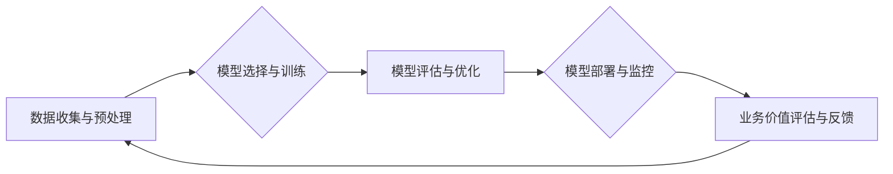

                 

## 跨行业AI最佳实践：Lepton AI的案例库

> 关键词：人工智能、跨行业应用、Lepton AI、机器学习、深度学习、案例库、最佳实践、模型部署、数据分析

## 1. 背景介绍

人工智能（AI）正以惊人的速度发展，并开始渗透到各个行业，从医疗保健和金融到制造业和零售。然而，将AI技术成功应用于不同行业面临着独特的挑战。每个行业都有其特定的数据结构、业务流程和监管环境。因此，需要针对不同行业定制AI解决方案，并确保其能够有效地解决实际问题。

Lepton AI 作为一家领先的AI解决方案提供商，致力于帮助企业跨行业应用AI技术。我们积累了丰富的经验和案例，并将其汇集到一个名为“Lepton AI案例库”的平台中。该平台旨在为企业提供AI最佳实践的参考，帮助他们更快、更有效地将AI技术融入业务。

## 2. 核心概念与联系

Lepton AI 的跨行业AI最佳实践的核心概念包括：

* **数据驱动:** AI模型的性能取决于数据的质量和数量。Lepton AI 强调数据收集、清洗和预处理的重要性，并提供相应的工具和服务。
* **模型可解释性:** 为了获得用户信任，AI模型的决策过程需要透明可解释。Lepton AI 致力于开发可解释的AI模型，并提供工具帮助用户理解模型的决策逻辑。
* **模型部署与维护:** 将AI模型部署到生产环境并进行持续维护是实现AI价值的关键。Lepton AI 提供了多种部署选项和监控工具，帮助企业轻松管理AI模型的生命周期。

**Lepton AI 跨行业AI最佳实践架构**



## 3. 核心算法原理 & 具体操作步骤

Lepton AI 在跨行业应用中广泛使用以下核心算法：

### 3.1  算法原理概述

* **机器学习 (Machine Learning):**  机器学习算法通过学习数据中的模式来进行预测或分类。Lepton AI 使用各种机器学习算法，包括线性回归、逻辑回归、支持向量机 (SVM)、决策树和随机森林等。
* **深度学习 (Deep Learning):** 深度学习算法使用多层神经网络来学习复杂的数据模式。Lepton AI 使用卷积神经网络 (CNN) 和循环神经网络 (RNN) 等深度学习算法进行图像识别、自然语言处理和时间序列分析等任务。

### 3.2  算法步骤详解

1. **数据收集与预处理:** 收集相关数据，并进行清洗、转换和特征工程等预处理步骤，以确保数据质量和模型训练效果。
2. **模型选择与训练:** 根据具体任务选择合适的机器学习或深度学习算法，并使用训练数据训练模型参数。
3. **模型评估与优化:** 使用测试数据评估模型性能，并通过调整模型参数或算法结构进行优化，以提高模型精度和泛化能力。
4. **模型部署与监控:** 将训练好的模型部署到生产环境，并进行持续监控，及时发现和解决模型性能下降或异常情况。

### 3.3  算法优缺点

| 算法类型 | 优点 | 缺点 |
|---|---|---|
| 机器学习 | 易于理解和解释，训练速度快 | 难以处理复杂数据模式，性能可能不如深度学习 |
| 深度学习 | 能够学习复杂数据模式，性能通常优于机器学习 | 训练时间长，需要大量数据，模型解释性差 |

### 3.4  算法应用领域

* **机器学习:** 欺诈检测、客户关系管理、推荐系统、预测分析等
* **深度学习:** 图像识别、语音识别、自然语言处理、机器翻译等

## 4. 数学模型和公式 & 详细讲解 & 举例说明

### 4.1  数学模型构建

Lepton AI 使用多种数学模型来构建AI解决方案，例如线性回归模型、逻辑回归模型、支持向量机模型等。这些模型通常基于统计学和概率论的原理，并使用数学公式来描述数据之间的关系。

### 4.2  公式推导过程

例如，线性回归模型的目标是找到一条直线，该直线能够最佳地拟合数据点。模型的数学公式如下：

$$y = mx + c$$

其中：

* $y$ 是预测值
* $x$ 是输入特征
* $m$ 是斜率
* $c$ 是截距

通过最小化预测值与实际值的误差，可以求解出最佳的 $m$ 和 $c$ 值。

### 4.3  案例分析与讲解

在医疗保健领域，Lepton AI 使用线性回归模型来预测患者的住院时间。模型的输入特征包括患者的年龄、性别、疾病类型等，输出特征是预测的住院时间。通过训练模型，Lepton AI 可以帮助医院更好地规划资源，提高患者的护理效率。

## 5. 项目实践：代码实例和详细解释说明

### 5.1  开发环境搭建

Lepton AI 的开发环境基于 Python 语言和 TensorFlow 或 PyTorch 深度学习框架。开发人员需要安装 Python、必要的库和框架，以及 GPU 硬件以加速模型训练。

### 5.2  源代码详细实现

以下是一个使用 TensorFlow 实现图像分类的简单代码示例：

```python
import tensorflow as tf

# 定义模型结构
model = tf.keras.models.Sequential([
  tf.keras.layers.Conv2D(32, (3, 3), activation='relu', input_shape=(28, 28, 1)),
  tf.keras.layers.MaxPooling2D((2, 2)),
  tf.keras.layers.Conv2D(64, (3, 3), activation='relu'),
  tf.keras.layers.MaxPooling2D((2, 2)),
  tf.keras.layers.Flatten(),
  tf.keras.layers.Dense(10, activation='softmax')
])

# 编译模型
model.compile(optimizer='adam',
              loss='sparse_categorical_crossentropy',
              metrics=['accuracy'])

# 训练模型
model.fit(x_train, y_train, epochs=5)

# 评估模型
loss, accuracy = model.evaluate(x_test, y_test)
print('Test loss:', loss)
print('Test accuracy:', accuracy)
```

### 5.3  代码解读与分析

这段代码定义了一个简单的卷积神经网络模型，用于图像分类任务。模型包含两层卷积层、两层最大池化层、一层全连接层和一层输出层。模型使用 Adam 优化器、交叉熵损失函数和准确率作为评估指标。

### 5.4  运行结果展示

训练完成后，模型可以用来预测新的图像类别。

## 6. 实际应用场景

Lepton AI 的跨行业AI最佳实践已在多个行业得到成功应用，例如：

### 6.1  医疗保健

* **疾病诊断:** 使用深度学习算法分析医学图像，辅助医生诊断疾病。
* **药物研发:** 使用机器学习算法分析药物数据，加速药物研发过程。
* **个性化医疗:** 使用AI技术分析患者数据，提供个性化的医疗方案。

### 6.2  金融

* **欺诈检测:** 使用机器学习算法分析交易数据，识别欺诈行为。
* **风险评估:** 使用AI技术分析客户数据，评估贷款风险。
* **投资决策:** 使用机器学习算法分析市场数据，辅助投资决策。

### 6.3  制造业

* **设备故障预测:** 使用机器学习算法分析设备运行数据，预测设备故障。
* **生产过程优化:** 使用AI技术分析生产数据，优化生产流程。
* **质量控制:** 使用计算机视觉技术进行产品质量检测。

### 6.4  未来应用展望

Lepton AI 将继续致力于推动AI技术在各行业的应用，并探索新的应用场景。未来，我们期待看到AI技术在以下领域取得突破：

* **自动驾驶:** 使用深度学习算法实现自动驾驶汽车。
* **机器人技术:** 使用AI技术赋予机器人更强的智能和适应能力。
* **个性化教育:** 使用AI技术提供个性化的教育方案。

## 7. 工具和资源推荐

### 7.1  学习资源推荐

* **在线课程:** Coursera、edX、Udacity 等平台提供丰富的AI课程。
* **书籍:** 《深度学习》、《机器学习实战》等书籍是学习AI的基础。
* **博客和论坛:** Kaggle、Towards Data Science 等平台提供AI相关的博客文章和论坛讨论。

### 7.2  开发工具推荐

* **Python:** 作为AI开发的主要语言，Python拥有丰富的库和框架。
* **TensorFlow:** Google 开发的开源深度学习框架。
* **PyTorch:** Facebook 开发的开源深度学习框架。
* **Jupyter Notebook:** 用于交互式编程和数据可视化的工具。

### 7.3  相关论文推荐

* **《ImageNet Classification with Deep Convolutional Neural Networks》:** AlexNet 模型的论文。
* **《Attention Is All You Need》:** Transformer 模型的论文。
* **《BERT: Pre-training of Deep Bidirectional Transformers for Language Understanding》:** BERT 模型的论文。

## 8. 总结：未来发展趋势与挑战

### 8.1  研究成果总结

Lepton AI 的跨行业AI最佳实践取得了显著成果，为企业提供了有效的AI解决方案。我们积累了丰富的经验和案例，并不断探索新的应用场景和技术方向。

### 8.2  未来发展趋势

* **模型可解释性:** 提高AI模型的可解释性，帮助用户更好地理解模型的决策逻辑。
* **边缘计算:** 将AI模型部署到边缘设备，实现更快速的响应和更低的延迟。
* **联邦学习:** 允许在不共享原始数据的情况下训练AI模型，保护用户隐私。

### 8.3  面临的挑战

* **数据质量:** AI模型的性能取决于数据的质量，获取高质量数据仍然是一个挑战。
* **算法效率:** 训练大型AI模型需要大量的计算资源，提高算法效率是未来研究方向。
* **伦理问题:** AI技术的应用需要考虑伦理问题，例如算法偏见和数据隐私。

### 8.4  研究展望

Lepton AI 将继续致力于推动AI技术的进步，并将其应用于更多领域，为社会创造更大的价值。我们相信，AI技术将改变我们的生活，并为人类带来美好的未来。

## 9. 附录：常见问题与解答

**Q1: Lepton AI 的跨行业AI最佳实践适用于哪些行业？**

**A1:** Lepton AI 的跨行业AI最佳实践适用于医疗保健、金融、制造业、零售、教育等多个行业。

**Q2: Lepton AI 的 AI 模型是否可以部署到我的企业环境？**

**A2:** 是的，Lepton AI 提供多种部署选项，可以根据您的需求部署模型到云端、本地服务器或边缘设备。

**Q3: 我需要具备哪些技术技能才能使用 Lepton AI 的 AI 解决方案？**

**A3:** 您可以根据您的需求选择不同的解决方案。一些解决方案可以无需编程知识即可使用，而其他解决方案则需要一定的编程和数据分析技能。

**Q4: Lepton AI 的 AI 解决方案是否安全可靠？**

**A4:** Lepton AI 非常重视数据安全和模型可靠性。我们采用行业标准的安全措施保护用户数据，并对模型进行严格测试和验证。


作者：禅与计算机程序设计艺术 / Zen and the Art of Computer Programming 
<end_of_turn>

