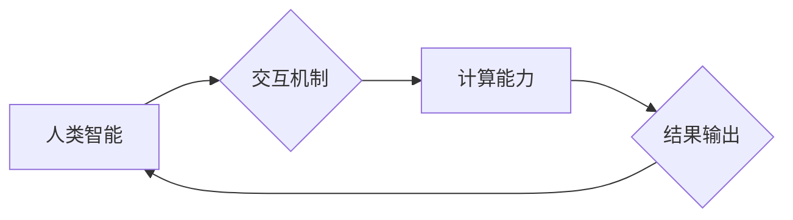

                 

## 跨越学科边界：人类计算的多元化应用

> 关键词：人类计算、跨学科融合、人工智能、机器学习、自然语言处理、数据科学、计算模型

## 1. 背景介绍

人类计算，顾名思义，是指将人类的认知能力与计算能力相结合，以实现更智能、更灵活、更创新的计算模式。随着人工智能技术的飞速发展，人类计算已不再是科幻小说中的幻想，而是正在逐渐成为现实。

传统计算模式主要依赖于计算机硬件和软件的执行能力，而人类计算则强调人类的智慧、经验和创造力。它打破了传统计算的局限性，能够处理更复杂、更抽象、更具创造性的问题。

人类计算的应用领域非常广泛，涵盖了科学研究、医疗诊断、教育培训、艺术创作等多个领域。例如，在科学研究中，人类计算可以帮助科学家分析海量数据，发现新的规律和模式；在医疗诊断中，人类计算可以辅助医生进行更精准的诊断和治疗；在教育培训中，人类计算可以提供个性化的学习体验，提高学习效率。

## 2. 核心概念与联系

人类计算的核心概念包括：

* **人类智能:** 指人类的认知能力、学习能力、推理能力、创造能力等。
* **计算能力:** 指计算机的处理能力、存储能力、网络能力等。
* **交互机制:** 指人类与计算机之间进行信息交换和协作的机制。

**Mermaid 流程图:**



人类计算通过交互机制将人类智能与计算能力相结合，实现协同工作，最终输出结果。

## 3. 核心算法原理 & 具体操作步骤

### 3.1  算法原理概述

人类计算的核心算法原理是将人类的认知过程模拟成计算机程序，并通过机器学习等技术不断优化算法，使其能够更好地理解和处理人类语言、图像、声音等信息。

### 3.2  算法步骤详解

1. **数据采集:** 收集人类行为、语言、知识等相关数据。
2. **数据预处理:** 对收集到的数据进行清洗、转换、格式化等处理，使其能够被算法理解。
3. **特征提取:** 从数据中提取关键特征，例如文本中的关键词、图像中的物体、声音中的音调等。
4. **模型训练:** 使用机器学习算法对提取的特征进行训练，建立人类计算模型。
5. **模型评估:** 对训练好的模型进行评估，测试其准确率、效率等指标。
6. **模型优化:** 根据评估结果，对模型进行调整和优化，提高其性能。
7. **应用部署:** 将优化后的模型部署到实际应用场景中。

### 3.3  算法优缺点

**优点:**

* 能够处理复杂、抽象、非结构化数据。
* 具有学习和适应能力，能够不断提高性能。
* 可以实现个性化、定制化的计算服务。

**缺点:**

* 数据依赖性强，需要大量高质量数据进行训练。
* 算法复杂度高，训练时间长。
* 缺乏可解释性，难以理解模型的决策过程。

### 3.4  算法应用领域

* **自然语言处理:** 语音识别、机器翻译、文本摘要、情感分析等。
* **计算机视觉:** 图像识别、物体检测、图像分割、视频分析等。
* **数据科学:** 数据挖掘、模式识别、预测分析等。
* **医疗诊断:** 病理图像分析、疾病预测、个性化治疗方案推荐等。
* **教育培训:** 个性化学习推荐、智能辅导、在线考试批改等。

## 4. 数学模型和公式 & 详细讲解 & 举例说明

### 4.1  数学模型构建

人类计算的数学模型通常基于概率论、统计学和机器学习等领域。例如，自然语言处理中常用的词嵌入模型，如Word2Vec和GloVe，将单词映射到一个低维向量空间，并利用向量之间的相似性来理解单词之间的语义关系。

### 4.2  公式推导过程

Word2Vec模型的核心算法是负采样，其目标是最大化目标词与上下文词之间的相似度，同时最小化与其他无关词之间的相似度。

假设我们有一个句子“The cat sat on the mat”，其中“cat”是目标词，而“the”和“sat”是上下文词。Word2Vec模型会学习一个词向量表示，使得“cat”的向量与“the”和“sat”的向量之间的距离更近，而与其他无关词的距离更远。

负采样公式如下：

$$
\mathcal{L} = -\frac{1}{T} \sum_{i=1}^{T} \log \sigma(u_w^T v_c)
$$

其中：

* $\mathcal{L}$ 是损失函数。
* $T$ 是负采样数量。
* $u_w$ 是词向量表示。
* $v_c$ 是上下文词向量表示。
* $\sigma$ 是sigmoid函数。

### 4.3  案例分析与讲解

通过训练Word2Vec模型，我们可以得到每个单词的词向量表示。例如，“cat”和“dog”的词向量可能比较接近，因为它们都是动物。而“cat”和“table”的词向量则可能比较远，因为它们属于不同的类别。

我们可以利用这些词向量来进行各种自然语言处理任务，例如：

* **词语相似度计算:** 计算两个词语之间的语义相似度。
* **文本分类:** 将文本分类到不同的类别。
* **机器翻译:** 将文本从一种语言翻译成另一种语言。

## 5. 项目实践：代码实例和详细解释说明

### 5.1  开发环境搭建

为了实现人类计算项目，我们需要搭建一个合适的开发环境。

* **操作系统:** Linux、macOS或Windows。
* **编程语言:** Python、Java或C++。
* **机器学习框架:** TensorFlow、PyTorch或Scikit-learn。
* **数据存储:** MySQL、MongoDB或Redis。

### 5.2  源代码详细实现

以下是一个使用Python和TensorFlow实现简单的文本分类模型的代码示例：

```python
import tensorflow as tf

# 定义模型结构
model = tf.keras.models.Sequential([
    tf.keras.layers.Embedding(input_dim=10000, output_dim=128),
    tf.keras.layers.LSTM(units=64),
    tf.keras.layers.Dense(units=2, activation='softmax')
])

# 编译模型
model.compile(optimizer='adam',
              loss='sparse_categorical_crossentropy',
              metrics=['accuracy'])

# 训练模型
model.fit(x_train, y_train, epochs=10)

# 评估模型
loss, accuracy = model.evaluate(x_test, y_test)
print('Loss:', loss)
print('Accuracy:', accuracy)
```

### 5.3  代码解读与分析

这段代码定义了一个简单的文本分类模型，它包含三个层：

* **Embedding层:** 将单词映射到一个低维向量空间。
* **LSTM层:** 用于处理文本序列数据。
* **Dense层:** 用于输出分类结果。

模型使用Adam优化器、稀疏类别交叉熵损失函数和准确率作为评估指标。

### 5.4  运行结果展示

训练完成后，我们可以使用模型对新的文本进行分类。

## 6. 实际应用场景

### 6.1  科学研究

人类计算可以帮助科学家分析海量数据，发现新的规律和模式。例如，在基因组学研究中，人类计算可以帮助科学家识别疾病相关的基因变异；在天文物理学研究中，人类计算可以帮助科学家分析星系和星云的结构和演化。

### 6.2  医疗诊断

人类计算可以辅助医生进行更精准的诊断和治疗。例如，在医学影像分析中，人类计算可以帮助医生识别肿瘤、骨折和其他疾病；在药物研发中，人类计算可以帮助科学家筛选潜在的药物候选物。

### 6.3  教育培训

人类计算可以提供个性化的学习体验，提高学习效率。例如，在在线教育平台中，人类计算可以根据学生的学习进度和能力，推荐个性化的学习内容；在智能辅导系统中，人类计算可以帮助学生解决学习上的难题。

### 6.4  未来应用展望

人类计算的应用前景广阔，未来将有更多新的应用场景出现。例如，在自动驾驶领域，人类计算可以帮助车辆更好地理解道路环境和行人行为；在机器人领域，人类计算可以使机器人更加智能、更加灵活、更加安全。

## 7. 工具和资源推荐

### 7.1  学习资源推荐

* **书籍:**
    * 《深度学习》
    * 《机器学习》
    * 《自然语言处理》
* **在线课程:**
    * Coursera
    * edX
    * Udacity

### 7.2  开发工具推荐

* **编程语言:** Python、Java、C++
* **机器学习框架:** TensorFlow、PyTorch、Scikit-learn
* **数据存储:** MySQL、MongoDB、Redis

### 7.3  相关论文推荐

* **Word2Vec:** Mikolov et al. (2013)
* **GloVe:** Pennington et al. (2014)
* **BERT:** Devlin et al. (2018)

## 8. 总结：未来发展趋势与挑战

### 8.1  研究成果总结

人类计算是一个跨学科的领域，它融合了人工智能、计算机科学、认知科学等多个学科的成果。近年来，人类计算取得了显著的进展，在自然语言处理、计算机视觉、数据科学等领域取得了突破性的应用。

### 8.2  未来发展趋势

未来，人类计算将朝着以下几个方向发展：

* **更智能的计算模型:** 开发更智能、更灵活、更适应复杂环境的计算模型。
* **更广泛的应用场景:** 将人类计算应用到更多新的领域，例如自动驾驶、机器人、医疗诊断等。
* **更强的可解释性:** 提高人类计算模型的可解释性，使其决策过程更加透明、更加可信。

### 8.3  面临的挑战

人类计算也面临着一些挑战：

* **数据安全和隐私:** 人类计算需要处理大量的人类数据，如何保证数据的安全和隐私是一个重要的挑战。
* **算法偏见:** 人类计算模型可能存在算法偏见，导致不公平的结果。如何解决算法偏见是一个重要的研究课题。
* **伦理问题:** 人类计算的应用可能会带来一些伦理问题，例如人工智能的责任和义务、人工智能的控制等。

### 8.4  研究展望

尽管面临着挑战，但人类计算仍然是一个充满希望的领域。未来，我们将继续努力，开发更智能、更安全、更可信的人类计算技术，为人类社会创造更多价值。

## 9. 附录：常见问题与解答

**Q1: 人类计算与人工智能有什么区别？**

**A1:** 人工智能是一个广义的概念，指机器能够模拟人类智能的行为。而人类计算则是人工智能的一种具体应用，它强调人类智能与计算能力的结合。

**Q2: 人类计算的应用场景有哪些？**

**A2:** 人类计算的应用场景非常广泛，包括科学研究、医疗诊断、教育培训、艺术创作等多个领域。

**Q3: 如何学习人类计算？**

**A3:** 可以通过阅读相关书籍、参加在线课程、学习编程语言和机器学习框架等方式学习人类计算。


作者：禅与计算机程序设计艺术 / Zen and the Art of Computer Programming 
<end_of_turn>

