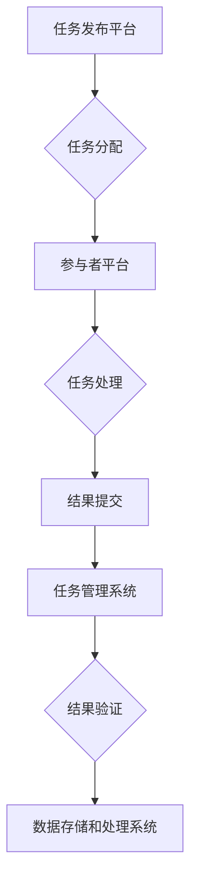

                 

## 连接全球社区的力量：人类计算的全球影响力

> 关键词：人类计算、分布式计算、协作智能、全球社区、数据分析、机器学习、社会影响

### 1. 背景介绍

在信息爆炸的时代，数据量呈指数级增长，传统的计算模式已难以应对海量数据的处理和分析需求。人类计算作为一种新兴的计算模式，通过将人类的智慧和计算能力与机器智能相结合，为解决复杂问题提供了新的思路和方法。

人类计算的核心思想是利用全球社区的智慧和力量，通过协作和互动的方式，共同完成复杂的计算任务。它打破了传统计算的局限性，将计算任务分解成更小的单元，并分配给全球各地的参与者进行处理。

近年来，随着互联网技术的普及和移动设备的广泛应用，人类计算得到了蓬勃发展。各种在线平台和应用程序，例如亚马逊 Mechanical Turk、Google reCAPTCHA、Zooniverse 等，都利用人类计算的力量，完成各种数据标注、图像识别、文本分析等任务。

### 2. 核心概念与联系

#### 2.1 人类计算的本质

人类计算的核心概念是将人类的智慧和计算能力与机器智能相结合，通过协作和互动的方式，共同完成复杂的计算任务。它本质上是一种分布式计算模式，将计算任务分解成更小的单元，并分配给全球各地的参与者进行处理。

#### 2.2 人类计算的架构

人类计算的架构通常包括以下几个关键部分：

* **任务发布平台:** 用于发布计算任务，并分配给参与者。
* **参与者平台:** 用于参与者注册、登录、接收任务和提交结果。
* **任务管理系统:** 用于管理任务的分配、进度和结果。
* **数据存储和处理系统:** 用于存储和处理参与者提交的结果数据。

**Mermaid 流程图**



### 3. 核心算法原理 & 具体操作步骤

#### 3.1 算法原理概述

人类计算的算法原理主要基于以下几个方面：

* **任务分解:** 将复杂的计算任务分解成更小的、易于处理的子任务。
* **分布式计算:** 将子任务分配给全球各地的参与者进行处理。
* **协作和互动:** 鼓励参与者之间进行协作和互动，共同解决问题。
* **结果汇总和分析:** 收集参与者提交的结果，并进行汇总和分析，最终得到最终的计算结果。

#### 3.2 算法步骤详解

1. **任务定义:** 首先需要明确要解决的问题，并将其分解成具体的计算任务。
2. **任务发布:** 将任务发布到人类计算平台，并设置相应的奖励机制。
3. **参与者招募:** 通过平台的宣传和推广，吸引参与者参与任务处理。
4. **任务分配:** 根据参与者的能力和经验，将任务分配给合适的参与者。
5. **任务处理:** 参与者根据任务要求，进行数据标注、图像识别、文本分析等操作。
6. **结果提交:** 参与者完成任务后，将结果提交到平台。
7. **结果验证:** 平台对参与者提交的结果进行验证，确保结果的准确性和可靠性。
8. **结果汇总:** 收集所有参与者提交的结果，并进行汇总和分析。
9. **最终结果输出:** 根据汇总分析的结果，输出最终的计算结果。

#### 3.3 算法优缺点

**优点:**

* **可扩展性强:** 可以利用全球社区的智慧和力量，处理海量数据。
* **成本效益高:** 相比于传统计算模式，人类计算的成本更低。
* **灵活性强:** 可以灵活地调整任务分配和参与者数量。
* **创新性强:** 可以激发参与者的创造力和创新能力。

**缺点:**

* **结果质量难以保证:** 人类参与者可能会出现错误或偏差。
* **任务设计难度高:** 需要精心设计任务，才能保证参与者的效率和准确性。
* **数据安全问题:** 需要采取措施保护参与者提交的数据安全。

#### 3.4 算法应用领域

人类计算的应用领域非常广泛，包括：

* **数据标注:** 用于训练机器学习模型的数据标注。
* **图像识别:** 用于识别图像中的物体、场景和人物。
* **文本分析:** 用于分析文本内容，提取关键词、情感倾向等信息。
* **科学研究:** 用于解决复杂的科学问题，例如蛋白质折叠、药物发现等。
* **社会调查:** 用于收集和分析社会数据，了解公众的意见和需求。

### 4. 数学模型和公式 & 详细讲解 & 举例说明

#### 4.1 数学模型构建

人类计算的数学模型可以基于概率论和统计学原理构建。例如，可以利用贝叶斯定理来评估参与者提交结果的准确性，并根据结果的准确性调整任务分配策略。

#### 4.2 公式推导过程

假设参与者 $i$ 提交的结果 $r_i$，真实结果为 $t$，则参与者 $i$ 的准确率 $P(r_i|t)$ 可以用贝叶斯定理表示为：

$$P(r_i|t) = \frac{P(t|r_i)P(r_i)}{P(t)}$$

其中：

* $P(t|r_i)$ 是给定结果 $r_i$ 的情况下真实结果 $t$ 的概率。
* $P(r_i)$ 是结果 $r_i$ 的概率。
* $P(t)$ 是真实结果 $t$ 的概率。

#### 4.3 案例分析与讲解

例如，在图像识别任务中，假设参与者 $i$ 识别出图像中的物体为“猫”，真实结果也为“猫”。则参与者 $i$ 的准确率 $P(r_i|t)$ 可以根据贝叶斯定理计算。

### 5. 项目实践：代码实例和详细解释说明

#### 5.1 开发环境搭建

人类计算项目开发环境通常包括以下软件：

* **编程语言:** Python、Java、C++ 等。
* **框架:** Django、Flask、Spring Boot 等。
* **数据库:** MySQL、PostgreSQL、MongoDB 等。
* **云平台:** AWS、Azure、GCP 等。

#### 5.2 源代码详细实现

以下是一个简单的 Python 代码实例，用于实现一个简单的任务发布和结果提交系统：

```python
# 任务发布平台

from flask import Flask, request, jsonify

app = Flask(__name__)

tasks = []

@app.route('/tasks', methods=['POST'])
def create_task():
    task = request.get_json()
    tasks.append(task)
    return jsonify({'message': 'Task created successfully'}), 201

@app.route('/tasks/<int:task_id>', methods=['GET'])
def get_task(task_id):
    task = tasks[task_id]
    return jsonify(task)

if __name__ == '__main__':
    app.run(debug=True)
```

#### 5.3 代码解读与分析

* 该代码使用 Flask 框架构建了一个简单的任务发布平台。
* `/tasks` 路由用于创建新的任务，接收 JSON 格式的任务数据。
* `/tasks/<int:task_id>` 路由用于获取指定 ID 的任务数据。

#### 5.4 运行结果展示

运行该代码后，可以访问 http://127.0.0.1:5000/tasks 接口，创建和获取任务数据。

### 6. 实际应用场景

#### 6.1 数据标注

人类计算在数据标注领域有着广泛的应用。例如，在训练图像识别模型时，需要大量标注好的图像数据。通过利用人类计算平台，可以快速高效地标注图像数据，降低训练成本。

#### 6.2 医疗诊断

人类计算可以辅助医生进行医疗诊断。例如，可以利用人类计算平台，收集和分析患者的病历、影像资料等数据，帮助医生做出更准确的诊断。

#### 6.3 科学研究

人类计算可以加速科学研究的进程。例如，在蛋白质折叠问题上，人类计算可以帮助科学家分析蛋白质结构，预测蛋白质功能。

#### 6.4 未来应用展望

随着人工智能技术的不断发展，人类计算的应用场景将更加广泛。例如，可以利用人类计算平台，开发更智能的虚拟助手、更精准的个性化推荐系统等。

### 7. 工具和资源推荐

#### 7.1 学习资源推荐

* **书籍:**

    * 《人类计算：从数据标注到人工智能》
    * 《分布式计算》

* **在线课程:**

    * Coursera 上的《人类计算》课程
    * edX 上的《分布式系统》课程

#### 7.2 开发工具推荐

* **任务发布平台:**

    * Amazon Mechanical Turk
    * Google reCAPTCHA
    * Zooniverse

* **数据处理工具:**

    * Python
    * R
    * Hadoop

#### 7.3 相关论文推荐

* **人类计算的定义和分类:**

    * "Human Computation: A Survey"

* **人类计算的应用案例:**

    * "Human Computation for Scientific Discovery"

* **人类计算的未来发展趋势:**

    * "The Future of Human Computation"

### 8. 总结：未来发展趋势与挑战

#### 8.1 研究成果总结

人类计算作为一种新兴的计算模式，在解决复杂问题、处理海量数据方面展现出巨大的潜力。它打破了传统计算的局限性，将人类的智慧和计算能力与机器智能相结合，为人工智能的发展提供了新的思路和方法。

#### 8.2 未来发展趋势

未来，人类计算将朝着以下几个方向发展：

* **更智能的算法:** 开发更智能的算法，提高人类计算的效率和准确性。
* **更广泛的应用场景:** 将人类计算应用到更多领域，例如医疗、教育、金融等。
* **更安全的平台:** 建立更安全的平台，保护参与者数据安全。

#### 8.3 面临的挑战

人类计算也面临着一些挑战：

* **结果质量控制:** 如何保证参与者提交结果的准确性和可靠性。
* **任务设计难度:** 如何设计出能够有效利用人类智慧的任务。
* **数据安全问题:** 如何保护参与者提交的数据安全。

#### 8.4 研究展望

未来，我们需要继续研究和探索人类计算的潜力，克服其面临的挑战，使其更好地服务于人类社会。

### 9. 附录：常见问题与解答

#### 9.1 如何参与人类计算项目？

您可以通过以下方式参与人类计算项目：

* 注册到人类计算平台，例如 Amazon Mechanical Turk、Google reCAPTCHA 等。
* 关注人类计算领域的开源项目，例如 Zooniverse。
* 参与人类计算相关的学术研究。

#### 9.2 人类计算的安全性如何保证？

人类计算平台通常会采取以下措施保证安全性：

* 数据加密：对参与者提交的数据进行加密，防止数据泄露。
* 身份验证：对参与者进行身份验证，防止恶意参与。
* 数据匿名化：对参与者数据进行匿名化处理，保护个人隐私。


作者：禅与计算机程序设计艺术 / Zen and the Art of Computer Programming 
<end_of_turn>

