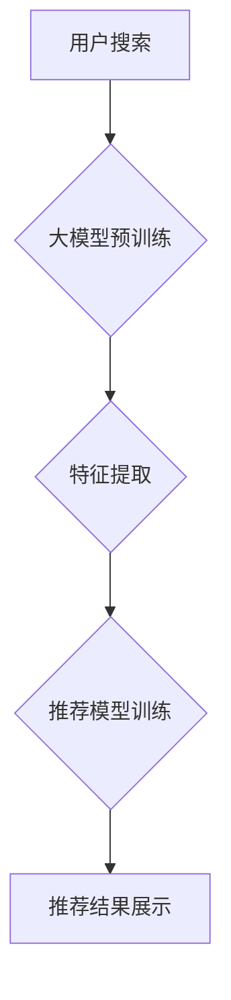

                 

## AI 大模型在电商搜索推荐中的冷启动策略：应对数据不足的挑战

> 关键词：电商搜索推荐、冷启动、大模型、数据不足、策略

## 1. 背景介绍

电商搜索推荐作为电商平台的核心功能之一，直接影响着用户体验和商业转化。传统的搜索推荐系统通常依赖海量用户行为数据进行训练，然而，对于新上线的商品或新注册的用户，由于缺乏历史数据，系统难以准确预测用户需求，导致推荐效果低下，进而影响用户粘性和平台发展。这种现象被称为“冷启动问题”。

随着大模型技术的快速发展，其强大的泛化能力和学习能力为解决电商搜索推荐的冷启动问题提供了新的思路。大模型能够通过预训练的方式学习到丰富的语义知识和模式，即使在数据不足的情况下，也能对新商品或用户进行有效的推荐。

## 2. 核心概念与联系

### 2.1  电商搜索推荐

电商搜索推荐是指根据用户搜索历史、浏览记录、购买行为等数据，为用户推荐相关商品的过程。其目标是提高用户搜索结果的准确性和相关性，引导用户发现感兴趣的商品，从而提升用户体验和转化率。

### 2.2  冷启动问题

冷启动问题是指在推荐系统初期，由于缺乏用户数据，导致推荐效果不佳的现象。

* **商品冷启动:** 新上线的商品缺乏用户行为数据，难以准确预测用户需求，导致推荐效果低下。
* **用户冷启动:** 新注册的用户缺乏历史数据，难以构建用户画像，导致推荐结果不精准。

### 2.3  大模型

大模型是指参数量巨大、训练数据量庞大的深度学习模型。其强大的学习能力和泛化能力使其能够在各种自然语言处理任务中表现出色，例如文本分类、机器翻译、问答系统等。

**大模型在电商搜索推荐中的应用流程:**



## 3. 核心算法原理 & 具体操作步骤

### 3.1  算法原理概述

大模型在电商搜索推荐中的冷启动策略主要基于以下几个核心算法原理：

* **预训练语言模型:** 利用大规模文本数据预训练语言模型，学习到丰富的语义知识和模式，为商品和用户特征提取提供基础。
* **迁移学习:** 将预训练模型迁移到电商搜索推荐任务中，通过少量电商数据进行微调，提升模型在特定领域的性能。
* **知识图谱嵌入:** 将商品、用户等实体信息嵌入到知识图谱中，利用知识图谱的结构信息进行关联分析，挖掘潜在的推荐关系。

### 3.2  算法步骤详解

1. **数据预处理:** 收集电商平台的商品信息、用户行为数据等，进行清洗、格式化和特征提取。
2. **预训练语言模型:** 利用公开的预训练语言模型，例如BERT、RoBERTa等，对电商平台的文本数据进行预训练，学习到丰富的语义知识和模式。
3. **迁移学习:** 将预训练模型迁移到电商搜索推荐任务中，使用电商平台的少量数据进行微调，优化模型在特定领域的性能。
4. **知识图谱构建:** 将商品、用户等实体信息构建成知识图谱，并利用知识图谱嵌入技术将实体信息嵌入到向量空间中。
5. **推荐模型训练:** 基于预训练模型、迁移学习和知识图谱嵌入技术，训练电商搜索推荐模型，例如基于协同过滤的推荐模型、基于内容过滤的推荐模型等。
6. **推荐结果展示:** 将训练好的推荐模型应用于实际场景，为用户展示个性化的商品推荐结果。

### 3.3  算法优缺点

**优点:**

* **数据效率:** 大模型能够利用预训练知识，即使在数据不足的情况下也能有效进行推荐。
* **泛化能力强:** 预训练模型已经学习到丰富的语义知识，能够更好地理解用户需求和商品特征。
* **个性化推荐:** 通过结合用户行为数据和知识图谱信息，能够提供更精准的个性化推荐。

**缺点:**

* **计算资源消耗:** 大模型训练和部署需要大量的计算资源。
* **模型复杂度高:** 大模型的结构复杂，需要专业的技术人员进行维护和优化。
* **数据安全问题:** 大模型训练需要使用大量用户数据，需要做好数据安全和隐私保护工作。

### 3.4  算法应用领域

大模型在电商搜索推荐领域的应用不仅限于冷启动问题，还可以应用于以下场景:

* **商品分类:** 利用大模型对商品文本进行分析，自动进行商品分类和标签识别。
* **商品描述生成:** 利用大模型生成商品描述文本，提高商品信息的可读性和吸引力。
* **用户画像构建:** 利用大模型分析用户行为数据，构建用户画像，为用户提供更精准的个性化推荐。

## 4. 数学模型和公式 & 详细讲解 & 举例说明

### 4.1  数学模型构建

在电商搜索推荐中，大模型通常采用基于神经网络的推荐模型，例如深度协同过滤模型、深度内容过滤模型等。这些模型利用用户行为数据和商品特征数据进行训练，学习到用户和商品之间的潜在关系。

### 4.2  公式推导过程

深度协同过滤模型的损失函数通常采用均方误差 (MSE) 或二阶交叉熵 (BCE) 等损失函数，其目标是最小化预测结果与真实结果之间的差异。

**均方误差 (MSE):**

$$
MSE = \frac{1}{N} \sum_{i=1}^{N} (y_i - \hat{y}_i)^2
$$

其中:

* $N$ 为样本数量
* $y_i$ 为真实评分
* $\hat{y}_i$ 为预测评分

**二阶交叉熵 (BCE):**

$$
BCE = -\frac{1}{N} \sum_{i=1}^{N} y_i \log(\hat{y}_i) + (1-y_i) \log(1-\hat{y}_i)
$$

其中:

* $N$ 为样本数量
* $y_i$ 为真实标签 (0 或 1)
* $\hat{y}_i$ 为预测概率

### 4.3  案例分析与讲解

假设我们有一个电商平台，用户对商品进行评分，我们想要利用深度协同过滤模型进行商品推荐。

1. **数据预处理:** 收集用户评分数据，并将用户和商品信息转换为向量表示。
2. **模型训练:** 利用 MSE 或 BCE 损失函数，训练深度协同过滤模型，学习到用户和商品之间的潜在关系。
3. **推荐结果展示:** 根据训练好的模型，为用户推荐评分最高的商品。

## 5. 项目实践：代码实例和详细解释说明

### 5.1  开发环境搭建

* Python 3.7+
* TensorFlow 或 PyTorch
* Jupyter Notebook

### 5.2  源代码详细实现

```python
import tensorflow as tf

# 定义深度协同过滤模型
class RecommenderModel(tf.keras.Model):
    def __init__(self, user_embedding_dim, item_embedding_dim):
        super(RecommenderModel, self).__init__()
        self.user_embedding = tf.keras.layers.Embedding(num_users, user_embedding_dim)
        self.item_embedding = tf.keras.layers.Embedding(num_items, item_embedding_dim)
        self.dense = tf.keras.layers.Dense(1, activation='sigmoid')

    def call(self, user_ids, item_ids):
        user_embeddings = self.user_embedding(user_ids)
        item_embeddings = self.item_embedding(item_ids)
        combined_embeddings = user_embeddings * item_embeddings
        predictions = self.dense(combined_embeddings)
        return predictions

# 训练模型
model = RecommenderModel(user_embedding_dim=64, item_embedding_dim=64)
model.compile(optimizer='adam', loss='binary_crossentropy', metrics=['accuracy'])
model.fit(x=[user_ids, item_ids], y=ratings, epochs=10)

# 推荐商品
user_id = 123
item_ids = model.predict([user_id])
top_k_items = tf.argsort(item_ids, direction='DESCENDING')[:5]
```

### 5.3  代码解读与分析

* **模型定义:** 定义了一个深度协同过滤模型，包含用户嵌入层、商品嵌入层和全连接层。
* **模型训练:** 使用 Adam 优化器、二分类交叉熵损失函数和准确率指标训练模型。
* **推荐商品:** 根据用户 ID，预测用户对商品的评分，并选择评分最高的商品进行推荐。

### 5.4  运行结果展示

运行代码后，可以得到用户对商品的评分预测结果，并根据预测结果进行商品推荐。

## 6. 实际应用场景

### 6.1  新商品推荐

对于新上线的商品，由于缺乏用户行为数据，传统的推荐系统难以准确预测用户需求。大模型可以利用预训练知识和少量商品信息进行推荐，帮助新商品快速获得曝光和销量。

### 6.2  新用户推荐

对于新注册的用户，由于缺乏历史数据，难以构建用户画像，导致推荐结果不精准。大模型可以利用用户注册信息、浏览行为等数据进行分析，构建用户画像，并根据画像进行个性化推荐。

### 6.3  个性化推荐

大模型可以结合用户行为数据、商品特征数据和知识图谱信息，构建更精准的用户画像，并根据画像进行个性化推荐，提升用户体验和转化率。

### 6.4  未来应用展望

随着大模型技术的不断发展，其在电商搜索推荐领域的应用场景将更加广泛，例如：

* **多模态推荐:** 利用图像、视频等多模态数据进行商品推荐。
* **跨平台推荐:** 将用户行为数据整合到多个平台，进行跨平台的个性化推荐。
* **实时推荐:** 利用实时数据流进行动态推荐，提供更及时和精准的推荐结果。

## 7. 工具和资源推荐

### 7.1  学习资源推荐

* **书籍:**
    * 《深度学习》 - Ian Goodfellow, Yoshua Bengio, Aaron Courville
    * 《自然语言处理》 - Dan Jurafsky, James H. Martin
* **在线课程:**
    * Coursera: 深度学习 Specialization
    * Udacity: 自然语言处理 Nanodegree
* **博客和网站:**
    * TensorFlow Blog: https://blog.tensorflow.org/
    * PyTorch Blog: https://pytorch.org/blog/

### 7.2  开发工具推荐

* **TensorFlow:** https://www.tensorflow.org/
* **PyTorch:** https://pytorch.org/
* **Keras:** https://keras.io/

### 7.3  相关论文推荐

* **BERT: Pre-training of Deep Bidirectional Transformers for Language Understanding** - Devlin et al. (2018)
* **RoBERTa: A Robustly Optimized BERT Pretraining Approach** - Liu et al. (2019)
* **Knowledge Graph Embedding: A Survey** - Wang et al. (2019)

## 8. 总结：未来发展趋势与挑战

### 8.1  研究成果总结

大模型在电商搜索推荐中的冷启动策略取得了显著的成果，能够有效解决数据不足的问题，提升推荐效果。

### 8.2  未来发展趋势

* **模型规模和能力提升:** 大模型的规模和能力将不断提升，能够学习到更丰富的知识和模式，提供更精准的推荐结果。
* **多模态融合:** 大模型将融合图像、视频等多模态数据，提供更丰富的商品信息和用户体验。
* **个性化推荐增强:** 大模型将结合更丰富的用户数据和行为分析，提供更个性化的推荐服务。

### 8.3  面临的挑战

* **计算资源消耗:** 大模型训练和部署需要大量的计算资源，成本较高。
* **模型复杂度:** 大模型的结构复杂，需要专业的技术人员进行维护和优化。
* **数据安全问题:** 大模型训练需要使用大量用户数据，需要做好数据安全和隐私保护工作。

### 8.4  研究展望

未来，大模型在电商搜索推荐领域的应用将更加广泛，其研究方向包括：

* **高效训练方法:** 研究更有效的训练方法，降低大模型训练的计算成本。
* **模型解释性:** 研究大模型的决策机制，提高模型的解释性和可信度。
* **联邦学习:** 研究联邦学习技术，解决大模型训练的数据安全问题。


## 9. 附录：常见问题与解答

**Q1: 大模型训练需要多少数据？**

A1: 大模型的训练数据量通常非常庞大，通常需要百万甚至数十亿级别的文本数据。

**Q2: 如何评估大模型的推荐效果？**

A2: 大模型的推荐效果通常通过指标如点击率 (CTR)、转化率 (CVR) 等进行评估。

**Q3: 如何解决大模型的计算资源消耗问题？**

A3: 可以采用模型压缩、模型并行等技术，降低大模型的计算资源消耗。


作者：禅与计算机程序设计艺术 / Zen and the Art of Computer Programming 
<end_of_turn>

