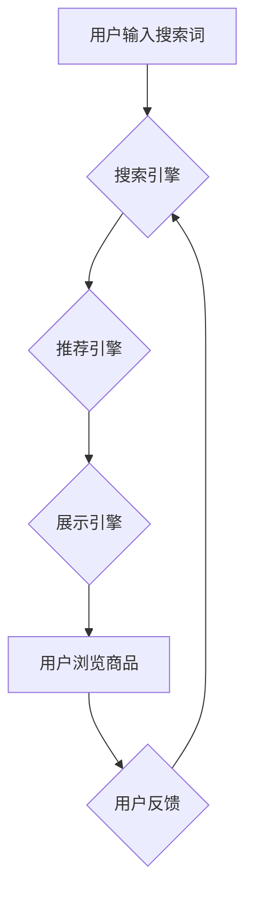

                 

## AI 大模型在电商搜索推荐中的用户体验优化：以用户需求为中心的设计

> 关键词：电商搜索推荐、AI大模型、用户体验、个性化推荐、深度学习、自然语言处理

## 1. 背景介绍

在当今数字经济时代，电商平台已成为人们获取商品和服务的首选方式。搜索推荐作为电商平台的核心功能之一，直接影响着用户购物体验和平台商业成功。传统的搜索推荐系统主要依赖于关键词匹配和商品属性分析，难以满足用户日益增长的个性化需求。

近年来，随着深度学习技术的快速发展，AI大模型在电商搜索推荐领域展现出巨大的潜力。AI大模型能够学习用户行为、偏好和上下文信息，提供更精准、更个性化的推荐结果，从而提升用户体验和平台转化率。

## 2. 核心概念与联系

### 2.1  电商搜索推荐系统

电商搜索推荐系统旨在帮助用户快速找到所需商品，并根据用户的兴趣和需求提供个性化的推荐。它通常由以下几个模块组成：

* **搜索引擎:** 处理用户搜索词，并返回相关商品列表。
* **推荐引擎:** 基于用户历史行为、商品属性和上下文信息，推荐用户可能感兴趣的商品。
* **展示引擎:** 将搜索结果和推荐结果以用户友好的方式展示给用户。

### 2.2  AI大模型

AI大模型是指在海量数据上训练的深度学习模型，具有强大的学习和泛化能力。常见的AI大模型类型包括：

* **Transformer模型:** 擅长处理自然语言文本，例如BERT、GPT-3等。
* **图神经网络:** 擅长处理关系数据，例如知识图谱嵌入、推荐系统等。
* **生成对抗网络(GAN):** 擅长生成新数据，例如图像、文本等。

### 2.3  用户需求

用户需求是电商搜索推荐系统设计的核心驱动力。用户希望能够：

* **快速找到所需商品:** 搜索结果应准确、高效地匹配用户搜索词。
* **获得个性化推荐:** 推荐结果应符合用户的兴趣和需求，避免信息过载。
* **享受流畅的购物体验:** 搜索和推荐过程应简洁、直观、易于操作。

**Mermaid 流程图**



## 3. 核心算法原理 & 具体操作步骤

### 3.1  算法原理概述

在电商搜索推荐系统中，常用的算法包括：

* **基于内容的推荐:** 根据商品属性和用户历史行为推荐相关商品。
* **基于协同过滤的推荐:** 根据用户相似度和商品相似度推荐商品。
* **基于深度学习的推荐:** 利用深度学习模型学习用户行为和商品特征，进行个性化推荐。

### 3.2  算法步骤详解

以基于深度学习的推荐算法为例，其具体步骤如下：

1. **数据预处理:** 收集用户行为数据、商品属性数据等，并进行清洗、转换、编码等操作。
2. **特征工程:** 从原始数据中提取用户特征、商品特征等，构建模型输入。
3. **模型训练:** 利用深度学习模型，例如Transformer模型，对训练数据进行训练，学习用户行为和商品特征之间的关系。
4. **模型评估:** 使用测试数据评估模型性能，例如准确率、召回率、NDCG等。
5. **模型部署:** 将训练好的模型部署到线上环境，为用户提供个性化推荐。

### 3.3  算法优缺点

**基于深度学习的推荐算法**

* **优点:** 能够学习用户行为和商品特征之间的复杂关系，提供更精准的推荐结果。
* **缺点:** 需要海量数据进行训练，训练成本较高；模型解释性较差，难以理解模型推荐结果背后的原因。

### 3.4  算法应用领域

基于深度学习的推荐算法广泛应用于电商平台、社交媒体、音乐流媒体等领域，例如：

* **商品推荐:** 根据用户历史行为和商品属性，推荐用户可能感兴趣的商品。
* **内容推荐:** 根据用户兴趣和阅读历史，推荐用户可能感兴趣的文章、视频等内容。
* **广告推荐:** 根据用户兴趣和行为特征，推荐用户可能感兴趣的广告。

## 4. 数学模型和公式 & 详细讲解 & 举例说明

### 4.1  数学模型构建

在基于深度学习的推荐系统中，常用的数学模型包括：

* **协同过滤模型:** 利用矩阵分解技术，学习用户和商品之间的隐向量表示，预测用户对商品的评分。
* **深度神经网络模型:** 利用多层神经网络，学习用户行为和商品特征之间的复杂关系，预测用户对商品的点击、购买等行为。

### 4.2  公式推导过程

以协同过滤模型为例，其目标是学习用户-商品评分矩阵的低秩分解，即：

$$R = U \cdot V^T$$

其中：

* $R$ 是用户-商品评分矩阵。
* $U$ 是用户特征矩阵。
* $V$ 是商品特征矩阵。

通过最小化预测评分与真实评分之间的误差，可以学习出用户和商品的隐向量表示。

### 4.3  案例分析与讲解

假设有一个用户-商品评分矩阵，其中每个元素表示用户对商品的评分。通过协同过滤模型，可以学习出用户和商品的隐向量表示，例如：

* 用户1的隐向量表示为：[0.2, 0.5, -0.1]
* 商品A的隐向量表示为：[0.3, 0.1, 0.4]

根据这两个隐向量表示，可以预测用户1对商品A的评分：

$$评分 = 用户1的隐向量 \cdot 商品A的隐向量^T$$

$$评分 = [0.2, 0.5, -0.1] \cdot [0.3, 0.1, 0.4]^T$$

$$评分 = 0.2 \cdot 0.3 + 0.5 \cdot 0.1 + (-0.1) \cdot 0.4 = 0.1$$

## 5. 项目实践：代码实例和详细解释说明

### 5.1  开发环境搭建

* **操作系统:** Ubuntu 20.04
* **编程语言:** Python 3.8
* **深度学习框架:** TensorFlow 2.0
* **其他工具:** Jupyter Notebook、Git

### 5.2  源代码详细实现

```python
import tensorflow as tf

# 定义用户-商品评分矩阵
ratings = tf.constant([[5, 4, 3],
                      [4, 5, 2],
                      [3, 2, 5]])

# 定义用户特征矩阵
user_features = tf.Variable(tf.random.normal([3, 2]))

# 定义商品特征矩阵
item_features = tf.Variable(tf.random.normal([3, 2]))

# 计算预测评分
predictions = tf.matmul(user_features, item_features, transpose_b=True)

# 计算损失函数
loss = tf.reduce_mean(tf.square(predictions - ratings))

# 定义优化器
optimizer = tf.keras.optimizers.Adam()

# 训练模型
for epoch in range(100):
    with tf.GradientTape() as tape:
        loss_value = loss
    gradients = tape.gradient(loss_value, [user_features, item_features])
    optimizer.apply_gradients(zip(gradients, [user_features, item_features]))

# 打印训练结果
print(f"训练完成，损失函数值为：{loss.numpy()}")
```

### 5.3  代码解读与分析

* 代码首先定义了用户-商品评分矩阵、用户特征矩阵和商品特征矩阵。
* 然后计算预测评分，并定义损失函数，用于衡量预测评分与真实评分之间的误差。
* 使用Adam优化器对模型参数进行更新，最小化损失函数值。
* 最后打印训练结果，即损失函数值。

### 5.4  运行结果展示

训练完成后，可以观察损失函数值的变化趋势，判断模型训练效果。

## 6. 实际应用场景

### 6.1  电商平台商品推荐

AI大模型可以根据用户的浏览历史、购买记录、购物车内容等信息，推荐用户可能感兴趣的商品，提高用户购物体验和转化率。

### 6.2  个性化广告推荐

AI大模型可以根据用户的兴趣爱好、行为特征等信息，推荐用户可能感兴趣的广告，提高广告精准度和点击率。

### 6.3  内容推荐

AI大模型可以根据用户的阅读历史、点赞记录、评论内容等信息，推荐用户可能感兴趣的文章、视频等内容，提高用户内容消费体验。

### 6.4  未来应用展望

随着AI技术的不断发展，AI大模型在电商搜索推荐领域的应用场景将更加广泛，例如：

* **多模态推荐:** 结合文本、图像、视频等多模态数据进行推荐，提供更丰富的用户体验。
* **实时推荐:** 基于用户的实时行为，提供更精准、更及时地推荐结果。
* **个性化服务:** 利用AI大模型，为用户提供更个性化的购物体验，例如定制化商品推荐、个性化客服服务等。

## 7. 工具和资源推荐

### 7.1  学习资源推荐

* **书籍:**
    * 深度学习
    * 自然语言处理
    * 推荐系统
* **在线课程:**
    * Coursera
    * edX
    * Udacity

### 7.2  开发工具推荐

* **深度学习框架:** TensorFlow, PyTorch
* **数据处理工具:** Pandas, NumPy
* **云计算平台:** AWS, Azure, Google Cloud

### 7.3  相关论文推荐

* BERT: Pre-training of Deep Bidirectional Transformers for Language Understanding
* Transformer: Attention Is All You Need
* Collaborative Filtering for Recommender Systems

## 8. 总结：未来发展趋势与挑战

### 8.1  研究成果总结

AI大模型在电商搜索推荐领域取得了显著成果，能够提供更精准、更个性化的推荐结果，提升用户体验和平台商业成功。

### 8.2  未来发展趋势

未来，AI大模型在电商搜索推荐领域将朝着以下方向发展：

* **多模态推荐:** 结合文本、图像、视频等多模态数据进行推荐，提供更丰富的用户体验。
* **实时推荐:** 基于用户的实时行为，提供更精准、更及时地推荐结果。
* **个性化服务:** 利用AI大模型，为用户提供更个性化的购物体验，例如定制化商品推荐、个性化客服服务等。

### 8.3  面临的挑战

AI大模型在电商搜索推荐领域也面临一些挑战：

* **数据隐私:** 如何保护用户数据隐私，是AI大模型应用中的重要问题。
* **模型解释性:** 深度学习模型的决策过程难以解释，这可能会导致用户对推荐结果的信任度降低。
* **公平性:** AI大模型可能会存在偏见，导致推荐结果不公平。

### 8.4  研究展望

未来，需要进一步研究如何解决AI大模型在电商搜索推荐领域面临的挑战，使其能够更加安全、可靠、公平地服务于用户。

## 9. 附录：常见问题与解答

* **Q1: AI大模型的训练需要多少数据？**

* **A1:** AI大模型的训练需要海量数据，通常需要百万甚至数十亿条数据。

* **Q2: 如何评估AI大模型的推荐效果？**

* **A2:** 可以使用准确率、召回率、NDCG等指标来评估AI大模型的推荐效果。

* **Q3: 如何解决AI大模型的偏见问题？**

* **A3:** 可以通过数据预处理、模型设计、算法调优等方法来解决AI大模型的偏见问题。


作者：禅与计算机程序设计艺术 / Zen and the Art of Computer Programming 
<end_of_turn>

