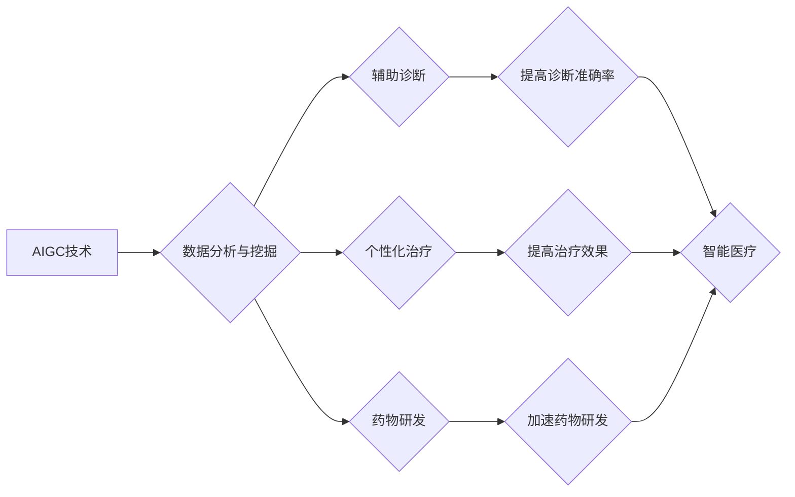

                 

## AIGC推动智能医疗发展

> 关键词：AIGC, 智能医疗, 医疗影像分析, 疾病诊断, 药物研发, 个性化医疗, 自然语言处理, 深度学习

## 1. 背景介绍

医疗行业正处于数字化转型和智能化升级的关键时期。随着人工智能（AI）技术的快速发展，特别是生成式人工智能（AIGC）的兴起，智能医疗迎来了前所未有的机遇。AIGC能够利用海量医疗数据，学习和模拟人类的智能行为，为医疗诊断、治疗、科研等领域提供强大的支持。

传统医疗模式面临着诸多挑战，例如医疗资源短缺、诊断效率低下、个性化治疗缺乏等。AIGC技术可以有效解决这些问题，提升医疗服务质量和效率，为患者带来更精准、更便捷、更个性化的医疗体验。

## 2. 核心概念与联系

### 2.1  AIGC概述

AIGC是指利用人工智能技术，能够生成新内容的模型。它可以理解和生成文本、图像、音频、视频等多种形式的数据，并能够根据用户需求进行定制化生成。

### 2.2  智能医疗概述

智能医疗是指利用人工智能技术，对医疗信息进行分析和处理，提高医疗诊断、治疗、科研等方面的效率和精准度。

### 2.3  AIGC与智能医疗的联系

AIGC技术为智能医疗的发展提供了强大的技术支撑。

* **数据分析与挖掘:** AIGC可以对海量医疗数据进行分析和挖掘，发现隐藏的规律和模式，为疾病诊断、治疗方案制定提供数据支持。
* **辅助诊断:** AIGC可以辅助医生进行疾病诊断，例如分析医学影像、识别病理特征，提高诊断的准确性和效率。
* **个性化治疗:** AIGC可以根据患者的个体特征，制定个性化的治疗方案，提高治疗效果。
* **药物研发:** AIGC可以加速药物研发过程，例如预测药物的活性、筛选潜在的药物靶点。

**Mermaid 流程图**



## 3. 核心算法原理 & 具体操作步骤

### 3.1  算法原理概述

AIGC在智能医疗领域的应用主要依赖于以下核心算法：

* **深度学习:** 深度学习算法能够从海量数据中学习复杂的特征，用于疾病诊断、图像识别、自然语言处理等任务。
* **自然语言处理 (NLP):** NLP算法能够理解和处理自然语言文本，用于分析患者病历、医学文献、在线问答等。
* **计算机视觉:** 计算机视觉算法能够识别和理解图像和视频，用于分析医学影像、识别病理特征等。

### 3.2  算法步骤详解

以医学影像分析为例，AIGC技术应用的具体步骤如下：

1. **数据收集:** 收集大量医学影像数据，包括X光片、CT扫描、MRI等。
2. **数据预处理:** 对收集到的数据进行清洗、标注、增强等预处理操作，提高数据质量和训练效果。
3. **模型训练:** 利用深度学习算法，训练一个能够识别疾病特征的模型。
4. **模型评估:** 使用测试数据评估模型的性能，例如准确率、召回率、F1-score等。
5. **模型部署:** 将训练好的模型部署到实际应用场景中，例如医院的诊断系统。

### 3.3  算法优缺点

**优点:**

* **高准确率:** 深度学习算法能够学习复杂的特征，提高疾病诊断的准确率。
* **自动化程度高:** AIGC技术可以自动化完成许多医疗任务，例如图像分析、数据挖掘等，提高效率。
* **个性化程度高:** AIGC可以根据患者的个体特征，制定个性化的治疗方案。

**缺点:**

* **数据依赖性强:** AIGC算法需要大量高质量的数据进行训练，否则性能会下降。
* **解释性差:** 深度学习模型的决策过程比较复杂，难以解释，这可能会影响医生的信任度。
* **伦理风险:** AIGC技术在医疗领域的应用可能带来一些伦理风险，例如数据隐私泄露、算法偏见等。

### 3.4  算法应用领域

AIGC技术在智能医疗领域的应用领域非常广泛，包括：

* **疾病诊断:** 辅助医生诊断各种疾病，例如癌症、心血管疾病、神经系统疾病等。
* **影像分析:** 分析医学影像数据，例如X光片、CT扫描、MRI等，识别病灶、测量肿瘤大小等。
* **药物研发:** 预测药物的活性、筛选潜在的药物靶点、加速药物研发过程。
* **个性化治疗:** 根据患者的个体特征，制定个性化的治疗方案，提高治疗效果。
* **患者管理:** 辅助医生管理患者信息，例如预约挂号、提醒服药等。

## 4. 数学模型和公式 & 详细讲解 & 举例说明

### 4.1  数学模型构建

AIGC技术在智能医疗领域的应用中，常用的数学模型包括：

* **神经网络:** 神经网络是一种模仿人脑神经网络结构的算法，能够学习复杂的非线性关系。
* **卷积神经网络 (CNN):** CNN是一种专门用于处理图像数据的深度学习算法，能够有效地提取图像特征。
* **循环神经网络 (RNN):** RNN是一种专门用于处理序列数据的深度学习算法，能够学习时间序列中的依赖关系。

### 4.2  公式推导过程

以CNN为例，其核心操作是卷积和池化。

* **卷积操作:** 卷积操作使用一个卷积核对图像进行滑动计算，提取图像局部特征。卷积核的权重可以通过训练得到。

$$
y_{i,j} = \sum_{m=0}^{M-1} \sum_{n=0}^{N-1} x_{i+m,j+n} * w_{m,n}
$$

其中：

* $y_{i,j}$ 是卷积输出的像素值。
* $x_{i+m,j+n}$ 是输入图像的像素值。
* $w_{m,n}$ 是卷积核的权重。
* $M$ 和 $N$ 是卷积核的大小。

* **池化操作:** 池化操作对卷积输出进行降维，减少计算量，提高模型的鲁棒性。常用的池化方法有最大池化和平均池化。

### 4.3  案例分析与讲解

例如，在医学影像分析中，可以使用CNN识别肺结核病灶。训练数据包括大量肺部X光片，其中标注了病灶的位置和类型。CNN模型通过卷积和池化操作，学习到肺部图像的特征，并能够识别出病灶的特征。

## 5. 项目实践：代码实例和详细解释说明

### 5.1  开发环境搭建

AIGC在智能医疗领域的应用可以使用多种编程语言和框架进行开发，例如Python、TensorFlow、PyTorch等。

### 5.2  源代码详细实现

以下是一个简单的Python代码示例，使用TensorFlow框架实现一个简单的图像分类模型：

```python
import tensorflow as tf

# 定义模型结构
model = tf.keras.models.Sequential([
    tf.keras.layers.Conv2D(32, (3, 3), activation='relu', input_shape=(28, 28, 1)),
    tf.keras.layers.MaxPooling2D((2, 2)),
    tf.keras.layers.Conv2D(64, (3, 3), activation='relu'),
    tf.keras.layers.MaxPooling2D((2, 2)),
    tf.keras.layers.Flatten(),
    tf.keras.layers.Dense(10, activation='softmax')
])

# 编译模型
model.compile(optimizer='adam',
              loss='sparse_categorical_crossentropy',
              metrics=['accuracy'])

# 训练模型
model.fit(x_train, y_train, epochs=5)

# 评估模型
loss, accuracy = model.evaluate(x_test, y_test)
print('Test loss:', loss)
print('Test accuracy:', accuracy)
```

### 5.3  代码解读与分析

这段代码定义了一个简单的卷积神经网络模型，用于图像分类任务。模型包含两个卷积层、两个池化层、一个全连接层和一个输出层。

* **Conv2D层:** 用于提取图像特征。
* **MaxPooling2D层:** 用于降维，提高模型的鲁棒性。
* **Flatten层:** 将多维数据转换为一维数据。
* **Dense层:** 全连接层，用于分类。

### 5.4  运行结果展示

训练完成后，可以使用测试数据评估模型的性能。

## 6. 实际应用场景

### 6.1  疾病诊断

AIGC技术可以辅助医生诊断各种疾病，例如癌症、心血管疾病、神经系统疾病等。例如，AIGC可以分析医学影像数据，识别病灶、测量肿瘤大小等，为医生提供诊断依据。

### 6.2  药物研发

AIGC可以加速药物研发过程，例如预测药物的活性、筛选潜在的药物靶点、模拟药物与靶点的相互作用等。

### 6.3  个性化治疗

AIGC可以根据患者的个体特征，制定个性化的治疗方案，提高治疗效果。例如，AIGC可以分析患者的基因信息、生活习惯、病史等，推荐最适合患者的治疗方案。

### 6.4  未来应用展望

AIGC技术在智能医疗领域的应用前景广阔，未来可能在以下方面得到进一步发展：

* **更精准的诊断:** AIGC模型的准确率会不断提高，能够更精准地诊断疾病。
* **更个性化的治疗:** AIGC能够更加深入地分析患者的个体特征，制定更个性化的治疗方案。
* **更便捷的医疗服务:** AIGC可以辅助医生完成许多医疗任务，例如预约挂号、提醒服药等，提高医疗服务效率。
* **远程医疗:** AIGC可以支持远程医疗，让患者即使身处偏远地区也能获得高质量的医疗服务。

## 7. 工具和资源推荐

### 7.1  学习资源推荐

* **在线课程:** Coursera、edX、Udacity等平台提供许多关于人工智能和深度学习的在线课程。
* **书籍:** 《深度学习》、《机器学习》、《自然语言处理》等书籍是学习人工智能的基础。
* **博客和论坛:** 许多人工智能领域的专家和学者在博客和论坛上分享他们的知识和经验。

### 7.2  开发工具推荐

* **TensorFlow:** Google开发的开源深度学习框架。
* **PyTorch:** Facebook开发的开源深度学习框架。
* **Keras:** TensorFlow的高级API，更易于使用。

### 7.3  相关论文推荐

* **Attention Is All You Need:** https://arxiv.org/abs/1706.03762
* **Deep Residual Learning for Image Recognition:** https://arxiv.org/abs/1512.03385
* **Generative Adversarial Networks:** https://arxiv.org/abs/1406.2661

## 8. 总结：未来发展趋势与挑战

### 8.1  研究成果总结

AIGC技术在智能医疗领域的应用取得了显著的成果，例如提高了疾病诊断的准确率、加速了药物研发过程、提供了个性化的治疗方案等。

### 8.2  未来发展趋势

未来，AIGC技术在智能医疗领域的应用将朝着以下方向发展：

* **更精准的诊断:** AIGC模型的准确率会不断提高，能够更精准地诊断疾病，甚至能够预测疾病的发生风险。
* **更个性化的治疗:** AIGC能够更加深入地分析患者的个体特征，制定更个性化的治疗方案，提高治疗效果。
* **更便捷的医疗服务:** AIGC可以辅助医生完成许多医疗任务，例如预约挂号、提醒服药等，提高医疗服务效率。
* **远程医疗:** AIGC可以支持远程医疗，让患者即使身处偏远地区也能获得高质量的医疗服务。

### 8.3  面临的挑战

AIGC技术在智能医疗领域的应用也面临着一些挑战：

* **数据隐私和安全:** AIGC模型需要大量医疗数据进行训练，如何保护患者的隐私和安全是一个重要的挑战。
* **算法解释性和可信度:** AIGC模型的决策过程比较复杂，难以解释，这可能会影响医生的信任度。
* **伦理风险:** AIGC技术在医疗领域的应用可能带来一些伦理风险，例如算法偏见、医疗决策的责任归属等。

### 8.4  研究展望

未来，需要进一步研究如何解决AIGC技术在智能医疗领域的挑战，例如开发更加安全、可解释、可信的AIGC模型，制定相应的伦理规范，确保AIGC技术在医疗领域的应用能够真正造福人类。

## 9. 附录：常见问题与解答

### 9.1  AIGC技术是否会取代医生？

AIGC技术可以辅助医生完成许多医疗任务，提高医疗效率，但不会取代医生。医生仍然需要根据患者的具体情况，做出最终的诊断和治疗决策。

### 9.2  AIGC技术在医疗领域的应用有哪些伦理风险？

AIGC技术在医疗领域的应用可能带来一些伦理风险，例如算法偏见、医疗决策的责任归属等。需要制定相应的伦理规范，确保AIGC技术在医疗领域的应用能够安全、有效、公平地造福人类。

### 9.3  如何保证AIGC模型的准确性和可靠性？

AIGC模型的准确性和可靠性取决于训练数据的质量和模型的结构。需要使用高质量的医疗数据进行训练，并不断改进模型的结构和算法，提高模型的性能。


作者：禅与计算机程序设计艺术 / Zen and the Art of Computer Programming 


<end_of_turn>

