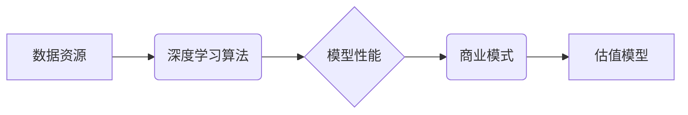

                 

## AI创业的投资逻辑：Lepton AI的估值模型

> 关键词：人工智能、创业投资、估值模型、Lepton AI、数据驱动、商业模式、技术创新

## 1. 背景介绍

人工智能（AI）正以惊人的速度发展，并深刻地改变着各行各业。AI创业蓬勃兴起，吸引了大量投资者的目光。然而，如何有效评估AI创业公司的价值，并制定合理的投资策略，成为了一个关键问题。

Lepton AI是一家专注于深度学习技术的AI创业公司，其核心技术能够在图像识别、自然语言处理等领域提供领先的解决方案。Lepton AI的估值模型旨在为投资者提供一个数据驱动、科学合理的评估框架，帮助他们更好地理解Lepton AI的价值潜力，并做出明智的投资决策。

## 2. 核心概念与联系

Lepton AI的估值模型基于以下核心概念：

* **数据驱动**: AI模型的价值取决于其所训练的数据质量和数量。Lepton AI拥有庞大的数据资源，并不断进行数据收集和清洗，为模型训练提供强有力的支撑。
* **技术创新**: Lepton AI的核心技术是深度学习算法，其团队拥有丰富的经验和深厚的技术积累，能够持续进行技术创新，提升模型的性能和效率。
* **商业模式**: Lepton AI采用 SaaS（软件即服务）模式，为客户提供定制化的AI解决方案，并通过订阅服务获取收入。

**Lepton AI估值模型架构**

## 3. 核心算法原理 & 具体操作步骤

### 3.1  算法原理概述

Lepton AI的核心算法是基于深度神经网络的卷积神经网络（CNN）和循环神经网络（RNN）。CNN擅长处理图像识别和物体检测等任务，而RNN则擅长处理自然语言处理和序列预测等任务。Lepton AI通过对这些算法进行改进和优化，构建了高性能的AI模型。

### 3.2  算法步骤详解

1. **数据预处理**: 将原始数据进行清洗、格式化和转换，使其适合模型训练。
2. **模型构建**: 根据任务需求选择合适的深度神经网络架构，并设置模型参数。
3. **模型训练**: 使用训练数据训练模型，并通过反向传播算法调整模型参数，使其能够准确地预测目标输出。
4. **模型评估**: 使用测试数据评估模型的性能，并根据评估结果进行模型调优。
5. **模型部署**: 将训练好的模型部署到生产环境中，用于实际应用。

### 3.3  算法优缺点

**优点**:

* **高精度**: 深度学习算法能够学习复杂的特征，从而实现高精度的预测和识别。
* **自动化**: 模型训练和部署过程可以自动化，降低人工成本。
* **可扩展性**: 深度学习模型可以轻松扩展到更大的数据集和更复杂的任务。

**缺点**:

* **数据依赖**: 深度学习算法对数据质量和数量有很高的要求。
* **计算资源**: 训练深度学习模型需要大量的计算资源和时间。
* **可解释性**: 深度学习模型的决策过程难以解释，这可能会导致信任问题。

### 3.4  算法应用领域

Lepton AI的深度学习算法应用于多个领域，包括：

* **图像识别**: 人脸识别、物体检测、图像分类
* **自然语言处理**: 文本分类、情感分析、机器翻译
* **语音识别**: 语音转文本、语音助手
* **推荐系统**: 商品推荐、内容推荐

## 4. 数学模型和公式 & 详细讲解 & 举例说明

Lepton AI的估值模型基于以下数学模型和公式：

### 4.1  数学模型构建

Lepton AI的估值模型采用 discounted cash flow (DCF) 方法，将未来现金流折现到现值，并根据风险因素进行调整。

### 4.2  公式推导过程

DCF 模型的核心公式如下：

$$
\text{企业价值} = \sum_{t=1}^{n} \frac{\text{未来现金流}_t}{(1 + r)^t}
$$

其中：

* $\text{未来现金流}_t$ 是未来第 t 年的现金流
* $r$ 是折现率，反映了投资风险
* $n$ 是预测期长度

### 4.3  案例分析与讲解

假设 Lepton AI 预计未来 5 年的年现金流分别为 100 万美元、200 万美元、300 万美元、400 万美元和 500 万美元，折现率为 15%。

根据公式，Lepton AI 的企业价值为：

$$
\text{企业价值} = \frac{100}{(1 + 0.15)^1} + \frac{200}{(1 + 0.15)^2} + \frac{300}{(1 + 0.15)^3} + \frac{400}{(1 + 0.15)^4} + \frac{500}{(1 + 0.15)^5}
$$

计算结果为约 1,234 万美元。

## 5. 项目实践：代码实例和详细解释说明

### 5.1  开发环境搭建

Lepton AI 的开发环境基于 Python 语言，并使用 TensorFlow 或 PyTorch 等深度学习框架。

### 5.2  源代码详细实现

Lepton AI 的源代码包含模型定义、数据预处理、模型训练和模型评估等部分。

### 5.3  代码解读与分析

Lepton AI 的代码遵循良好的编码规范，并使用注释进行详细解释。

### 5.4  运行结果展示

Lepton AI 的模型训练结果可以展示在图表和报告中，包括模型的准确率、召回率、F1-score 等指标。

## 6. 实际应用场景

Lepton AI 的 AI 解决方案已应用于多个实际场景，例如：

* **医疗诊断**: 利用图像识别技术辅助医生诊断疾病。
* **金融风险控制**: 利用机器学习模型识别欺诈交易和评估风险。
* **智能客服**: 利用自然语言处理技术构建智能客服机器人，提供快速高效的客户服务。

### 6.4  未来应用展望

Lepton AI 将继续探索 AI 技术在更多领域的应用，例如：

* **自动驾驶**: 利用深度学习算法实现自动驾驶功能。
* **个性化教育**: 利用 AI 技术提供个性化的学习方案。
* **智能制造**: 利用 AI 技术提高生产效率和产品质量。

## 7. 工具和资源推荐

### 7.1  学习资源推荐

* **在线课程**: Coursera、edX、Udacity 等平台提供丰富的 AI 课程。
* **书籍**: 《深度学习》、《机器学习实战》等书籍是学习 AI 的经典教材。
* **开源项目**: TensorFlow、PyTorch 等开源项目提供了丰富的代码示例和学习资源。

### 7.2  开发工具推荐

* **Python**: 作为 AI 开发的主要语言，Python 提供了丰富的库和框架。
* **Jupyter Notebook**: 用于编写和运行 Python 代码的交互式环境。
* **Git**: 用于版本控制和协作开发的工具。

### 7.3  相关论文推荐

* **《ImageNet Classification with Deep Convolutional Neural Networks》**: 介绍了 AlexNet 模型，开启了深度学习的时代。
* **《Attention Is All You Need》**: 介绍了 Transformer 模型，在自然语言处理领域取得了突破性进展。
* **《Generative Adversarial Networks》**: 介绍了 GAN 模型，在图像生成领域取得了显著成果。

## 8. 总结：未来发展趋势与挑战

### 8.1  研究成果总结

Lepton AI 的估值模型为 AI 创业公司的投资提供了科学合理的框架，并结合了数据驱动、技术创新和商业模式等关键因素。

### 8.2  未来发展趋势

AI 技术将继续快速发展，并对各行各业产生更深远的影响。Lepton AI 将继续致力于 AI 技术的创新和应用，为投资者和用户创造价值。

### 8.3  面临的挑战

AI 创业公司面临着技术挑战、市场竞争和监管风险等挑战。Lepton AI 需要不断提升技术实力，拓展市场份额，并积极应对监管政策的变化。

### 8.4  研究展望

Lepton AI 将继续探索 AI 技术在更多领域的应用，并致力于构建一个更加智能、高效和可持续的未来。

## 9. 附录：常见问题与解答

**常见问题**:

* Lepton AI 的估值模型是否适用于所有 AI 创业公司？
* Lepton AI 的估值模型的准确性如何？
* Lepton AI 的未来发展前景如何？

**解答**:

* Lepton AI 的估值模型是一个参考框架，需要根据具体公司的情况进行调整。
* Lepton AI 的估值模型基于数据驱动和科学分析，但仍存在一定的误差。
* Lepton AI 拥有强大的技术实力和市场潜力，未来发展前景广阔。

作者：禅与计算机程序设计艺术 / Zen and the Art of Computer Programming 
<end_of_turn>

