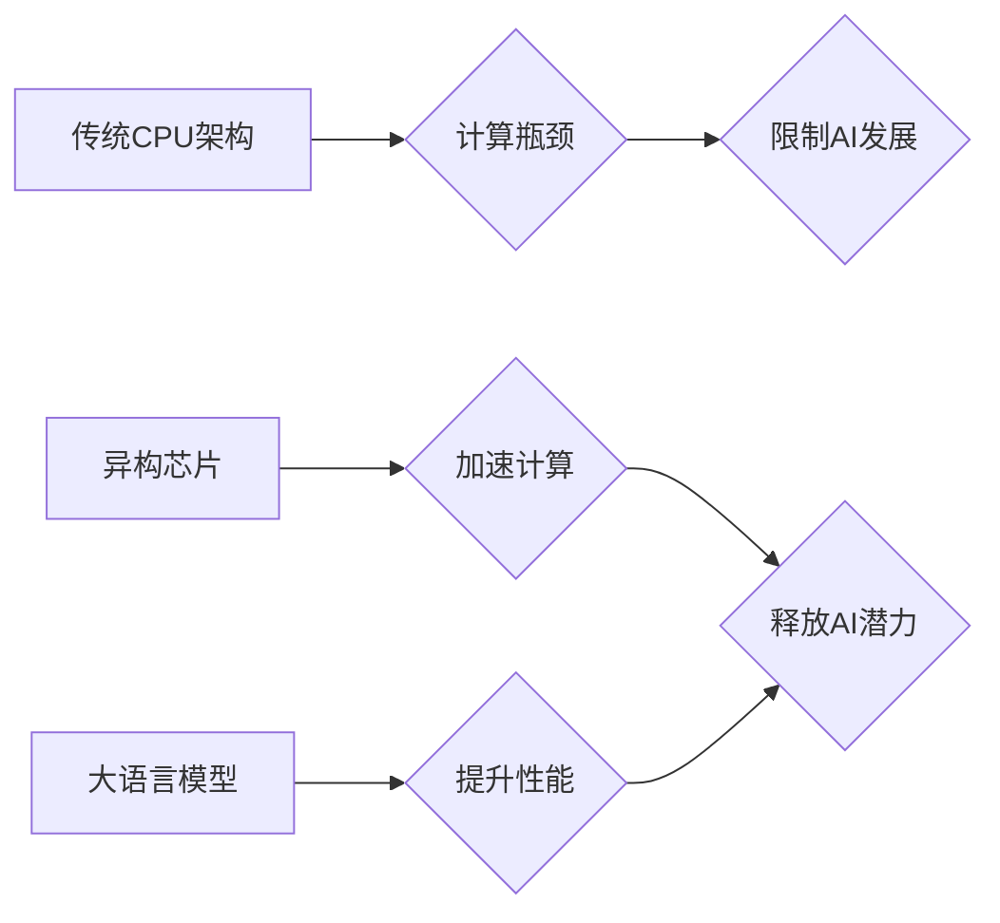

                 

## AI加速的乐观展望：贾扬清的观点，异构芯片与大语言模型架构

> 关键词：人工智能、异构芯片、大语言模型、AI加速、贾扬清、深度学习、模型架构、计算架构

## 1. 背景介绍

人工智能（AI）正以惊人的速度发展，其应用领域不断拓展，从自动驾驶到医疗诊断，再到自然语言处理，AI正在深刻地改变着我们的生活。然而，AI的快速发展也面临着巨大的挑战，其中之一就是计算能力的瓶颈。传统的CPU架构在处理海量数据和复杂计算时效率低下，这限制了AI模型的规模和性能。

贾扬清，一位享誉全球的AI专家、程序员、软件架构师和计算机领域大师，在多次演讲和著作中强调了AI加速的重要性，并提出了异构芯片和大语言模型架构的解决方案。他认为，只有突破计算瓶颈，才能真正释放AI的潜力，推动人工智能技术向更广阔的领域迈进。

## 2. 核心概念与联系

### 2.1 异构芯片

异构芯片是指将不同类型的处理器集成在一个芯片上，例如CPU、GPU、FPGA等，每个处理器负责特定的计算任务，从而实现资源的优化利用和计算效率的提升。

### 2.2 大语言模型

大语言模型（LLM）是指参数量巨大、训练数据海量的人工智能模型，能够理解和生成人类语言。LLM在自然语言处理领域取得了突破性的进展，例如机器翻译、文本摘要、对话系统等。

### 2.3 联系

异构芯片和大语言模型架构是互补的，它们共同构成了AI加速的解决方案。异构芯片可以提供强大的计算能力，支持大规模模型的训练和推理；而大语言模型则可以利用异构芯片的优势，实现更复杂的语言理解和生成任务。

**Mermaid 流程图**



## 3. 核心算法原理 & 具体操作步骤

### 3.1 算法原理概述

大语言模型的训练主要基于深度学习算法，特别是Transformer架构。Transformer架构利用注意力机制，能够捕捉文本序列中长距离依赖关系，从而实现更准确的语言理解和生成。

### 3.2 算法步骤详解

1. **数据预处理:** 将文本数据进行清洗、分词、词向量化等预处理操作，以便模型训练。
2. **模型构建:** 根据Transformer架构设计模型结构，包括编码器、解码器和注意力机制等模块。
3. **模型训练:** 使用海量文本数据训练模型，通过反向传播算法不断调整模型参数，使其能够准确地预测下一个词。
4. **模型评估:** 使用测试数据评估模型的性能，例如准确率、困惑度等指标。
5. **模型部署:** 将训练好的模型部署到实际应用场景中，例如聊天机器人、机器翻译等。

### 3.3 算法优缺点

**优点:**

* 能够捕捉文本序列中长距离依赖关系，实现更准确的语言理解和生成。
* 训练数据量大，模型参数量大，能够学习更复杂的语言模式。

**缺点:**

* 训练成本高，需要大量的计算资源和时间。
* 模型参数量大，部署成本高。

### 3.4 算法应用领域

* **自然语言处理:** 机器翻译、文本摘要、问答系统、对话系统等。
* **计算机视觉:** 图像识别、物体检测、图像生成等。
* **语音识别:** 语音转文本、语音合成等。

## 4. 数学模型和公式 & 详细讲解 & 举例说明

### 4.1 数学模型构建

大语言模型的训练基于深度学习算法，其核心是神经网络模型。神经网络模型由多个层组成，每层包含多个神经元。神经元之间通过权重连接，传递信息。

### 4.2 公式推导过程

Transformer架构的核心是注意力机制，其公式如下：

$$
Attention(Q, K, V) = softmax(\frac{QK^T}{\sqrt{d_k}})V
$$

其中：

* $Q$：查询矩阵
* $K$：键矩阵
* $V$：值矩阵
* $d_k$：键向量的维度
* $softmax$：softmax函数

注意力机制能够计算每个词与其他词之间的相关性，从而捕捉文本序列中长距离依赖关系。

### 4.3 案例分析与讲解

例如，在翻译句子“The cat sat on the mat”时，注意力机制可以计算每个词与其他词之间的相关性，例如“cat”与“sat”之间的相关性较高，因为它们描述了同一件事。

## 5. 项目实践：代码实例和详细解释说明

### 5.1 开发环境搭建

* 操作系统：Linux
* Python版本：3.7+
* 深度学习框架：TensorFlow或PyTorch

### 5.2 源代码详细实现

```python
# 使用TensorFlow实现简单的Transformer模型

import tensorflow as tf

# 定义Transformer模型
class Transformer(tf.keras.Model):
    def __init__(self, vocab_size, embedding_dim, num_heads, num_layers):
        super(Transformer, self).__init__()
        self.embedding = tf.keras.layers.Embedding(vocab_size, embedding_dim)
        self.transformer_layers = tf.keras.layers.StackedRNNCells([
            tf.keras.layers.Attention(num_heads=num_heads)
            for _ in range(num_layers)
        ])

    def call(self, inputs):
        embeddings = self.embedding(inputs)
        outputs = self.transformer_layers(embeddings)
        return outputs

# 实例化模型
model = Transformer(vocab_size=10000, embedding_dim=128, num_heads=8, num_layers=6)

# 训练模型
model.compile(optimizer='adam', loss='sparse_categorical_crossentropy', metrics=['accuracy'])
model.fit(x_train, y_train, epochs=10)
```

### 5.3 代码解读与分析

* 代码首先定义了一个Transformer模型类，包含嵌入层、多头注意力层和循环神经网络层。
* 嵌入层将词向量化，将每个词映射到一个向量空间。
* 多头注意力层能够捕捉文本序列中长距离依赖关系。
* 循环神经网络层将注意力输出进行编码，最终输出预测结果。
* 代码实例化了模型，并使用Adam优化器和交叉熵损失函数进行训练。

### 5.4 运行结果展示

训练完成后，可以使用测试数据评估模型的性能，例如准确率、困惑度等指标。

## 6. 实际应用场景

### 6.1 机器翻译

大语言模型可以用于机器翻译，例如将英文翻译成中文。

### 6.2 文本摘要

大语言模型可以用于文本摘要，例如将长篇文章总结成简短的摘要。

### 6.3 对话系统

大语言模型可以用于构建对话系统，例如聊天机器人。

### 6.4 未来应用展望

* **个性化教育:** 根据学生的学习进度和风格，提供个性化的学习内容和辅导。
* **医疗诊断:** 辅助医生进行疾病诊断，提高诊断准确率。
* **法律服务:** 自动分析法律文件，提供法律建议。

## 7. 工具和资源推荐

### 7.1 学习资源推荐

* **书籍:**
    * 《深度学习》
    * 《自然语言处理》
* **在线课程:**
    * Coursera
    * edX
* **博客:**
    * Jay Alammar's Blog
    * Google AI Blog

### 7.2 开发工具推荐

* **深度学习框架:** TensorFlow, PyTorch
* **编程语言:** Python
* **云计算平台:** AWS, Google Cloud, Azure

### 7.3 相关论文推荐

* **Attention Is All You Need**
* **BERT: Pre-training of Deep Bidirectional Transformers for Language Understanding**
* **GPT-3: Language Models are Few-Shot Learners**

## 8. 总结：未来发展趋势与挑战

### 8.1 研究成果总结

近年来，大语言模型在自然语言处理领域取得了突破性的进展，其应用场景不断拓展。异构芯片的出现为大语言模型的训练和推理提供了强大的计算能力，推动了AI加速的发展。

### 8.2 未来发展趋势

* **模型规模更大:** 模型参数量将继续增加，从而学习更复杂的语言模式。
* **多模态学习:** 大语言模型将融合视觉、音频等多模态数据，实现更全面的理解和生成。
* **可解释性增强:** 研究如何提高大语言模型的可解释性，使其决策过程更加透明。

### 8.3 面临的挑战

* **计算资源需求:** 训练大型语言模型需要大量的计算资源，成本高昂。
* **数据安全和隐私:** 大语言模型的训练需要海量数据，如何保证数据安全和隐私是一个重要挑战。
* **伦理问题:** 大语言模型可能被用于生成虚假信息、进行恶意攻击等，如何规范其应用，避免负面影响是一个需要认真思考的伦理问题。

### 8.4 研究展望

未来，大语言模型将继续朝着更强大、更智能的方向发展，其应用场景将更加广泛。研究者将继续探索新的算法、架构和训练方法，以克服现有挑战，释放大语言模型的巨大潜力。

## 9. 附录：常见问题与解答

* **Q: 如何选择合适的异构芯片？**
    * **A:** 异构芯片的选择取决于具体的应用场景和模型需求。例如，对于需要高并行计算能力的模型，可以选择GPU；对于需要低功耗的模型，可以选择FPGA。
* **Q: 如何训练大型语言模型？**
    * **A:** 训练大型语言模型需要大量的计算资源、海量数据和专业的技术团队。可以使用云计算平台进行训练，并采用分布式训练技术提高效率。
* **Q: 如何评估大语言模型的性能？**
    * **A:** 大语言模型的性能可以评估指标包括准确率、困惑度、BLEU分数等。可以使用测试数据进行评估，并与其他模型进行比较。


作者：禅与计算机程序设计艺术 / Zen and the Art of Computer Programming 
<end_of_turn>

