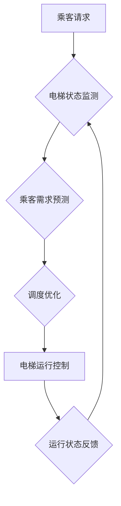

                 

## AI在智能电梯管理中的应用：减少等待时间

> 关键词：人工智能、智能电梯、预测算法、机器学习、优化调度、等待时间、乘客体验

## 1. 背景介绍

随着城市化进程的加速和人口密集度的增加，电梯作为现代建筑不可或缺的一部分，承担着越来越重要的运输任务。然而，传统的电梯管理系统往往难以应对日益增长的乘客需求，导致电梯等待时间过长、运行效率低下，给乘客带来不便。

人工智能（AI）技术的快速发展为智能电梯管理提供了新的解决方案。AI算法能够分析乘客出行数据、预测电梯需求，并优化电梯调度策略，从而有效减少电梯等待时间，提升乘客体验。

## 2. 核心概念与联系

### 2.1 智能电梯管理系统

智能电梯管理系统是指利用传感器、网络通信、人工智能等技术，实现电梯运行状态实时监控、乘客需求预测、调度优化等功能的系统。

### 2.2 核心概念

* **乘客需求预测:** 利用历史乘客数据、实时电梯状态等信息，预测未来乘客的出行需求，包括电梯方向、楼层目标等。
* **电梯调度优化:** 根据乘客需求预测结果，优化电梯运行路线和速度，最大限度地满足乘客需求，减少等待时间。
* **机器学习:** 利用机器学习算法从海量乘客数据中学习规律，提高乘客需求预测的准确性。

### 2.3 系统架构



## 3. 核心算法原理 & 具体操作步骤

### 3.1 算法原理概述

智能电梯管理系统中常用的算法包括：

* **时间序列分析:** 利用历史乘客数据，分析电梯使用规律，预测未来乘客需求。
* **机器学习:** 利用机器学习算法，从历史乘客数据中学习乘客出行模式，提高预测准确性。
* **遗传算法:** 用于优化电梯调度策略，找到最优的运行路线和速度。

### 3.2 算法步骤详解

**时间序列分析算法:**

1. 收集历史乘客数据，包括时间、楼层、方向等信息。
2. 对数据进行预处理，例如平滑、去噪等。
3. 选择合适的时序模型，例如ARIMA、SARIMA等。
4. 对模型进行训练，学习乘客出行规律。
5. 利用训练好的模型预测未来乘客需求。

**机器学习算法:**

1. 收集历史乘客数据，包括时间、楼层、方向、天气等信息。
2. 对数据进行特征提取，例如时间段、楼层分布等。
3. 选择合适的机器学习模型，例如回归模型、分类模型等。
4. 对模型进行训练，学习乘客出行模式。
5. 利用训练好的模型预测未来乘客需求。

**遗传算法:**

1. 定义电梯调度策略的编码方式。
2. 初始化种群，生成多个不同的调度策略。
3. 计算每个策略的适应度，例如等待时间、运行效率等。
4. 利用遗传操作，例如选择、交叉、变异等，生成新的策略。
5. 重复步骤3-4，直到找到最优的调度策略。

### 3.3 算法优缺点

**时间序列分析算法:**

* **优点:** 算法简单易实现，对数据要求不高。
* **缺点:** 难以捕捉复杂乘客出行模式，预测精度有限。

**机器学习算法:**

* **优点:** 能够学习复杂乘客出行模式，预测精度较高。
* **缺点:** 对数据要求较高，需要大量历史数据进行训练。

**遗传算法:**

* **优点:** 可以找到全局最优解，适应性强。
* **缺点:** 计算复杂度高，需要大量计算资源。

### 3.4 算法应用领域

* **智能交通:** 优化交通信号灯控制、公交车调度等。
* **智能制造:** 优化生产线调度、机器维护等。
* **智能能源:** 优化能源分配、预测能源需求等。

## 4. 数学模型和公式 & 详细讲解 & 举例说明

### 4.1 数学模型构建

智能电梯管理系统中常用的数学模型包括：

* **乘客需求预测模型:** 利用历史乘客数据，建立预测模型，例如线性回归模型、ARIMA模型等。
* **电梯调度优化模型:** 利用乘客需求预测结果，建立优化模型，例如遗传算法、模拟退火算法等。

### 4.2 公式推导过程

**线性回归模型:**

假设乘客需求 $y$ 与时间 $x$ 的关系为线性关系，则可以建立如下线性回归模型:

$$y = \beta_0 + \beta_1 x + \epsilon$$

其中:

* $y$ 为乘客需求
* $x$ 为时间
* $\beta_0$ 为截距
* $\beta_1$ 为时间系数
* $\epsilon$ 为随机误差

通过最小二乘法，可以求解 $\beta_0$ 和 $\beta_1$ 的值。

### 4.3 案例分析与讲解

假设某栋大楼的电梯数据如下表所示:

| 时间 (小时) | 乘客需求 |
|---|---|
| 8 | 10 |
| 9 | 20 |
| 10 | 30 |
| 11 | 40 |
| 12 | 50 |

利用线性回归模型，可以预测未来乘客需求。

## 5. 项目实践：代码实例和详细解释说明

### 5.1 开发环境搭建

* 操作系统: Ubuntu 20.04
* Python 版本: 3.8
* 必要的库: pandas, numpy, scikit-learn

### 5.2 源代码详细实现

```python
import pandas as pd
from sklearn.linear_model import LinearRegression

# 加载电梯数据
data = pd.read_csv('elevator_data.csv')

# 准备数据
X = data[['时间']]
y = data['乘客需求']

# 创建线性回归模型
model = LinearRegression()

# 训练模型
model.fit(X, y)

# 预测未来乘客需求
future_time = pd.DataFrame({'时间': [13, 14, 15]})
future_demand = model.predict(future_time)

# 打印预测结果
print(future_demand)
```

### 5.3 代码解读与分析

* 代码首先加载电梯数据，并准备数据用于模型训练。
* 然后创建线性回归模型，并使用训练数据训练模型。
* 最后利用训练好的模型预测未来乘客需求，并打印结果。

### 5.4 运行结果展示

运行代码后，可以得到未来乘客需求的预测结果。

## 6. 实际应用场景

智能电梯管理系统已在一些大型建筑、写字楼、医院等场所得到应用，取得了显著效果。

### 6.1 乘客体验提升

通过优化电梯调度策略，智能电梯管理系统可以有效减少乘客等待时间，提升乘客体验。

### 6.2 运行效率提高

智能电梯管理系统可以根据乘客需求动态调整电梯运行路线和速度，提高电梯运行效率。

### 6.3 能耗降低

智能电梯管理系统可以根据乘客需求优化电梯运行，减少电梯空载运行，降低能耗。

### 6.4 未来应用展望

随着人工智能技术的不断发展，智能电梯管理系统将更加智能化、个性化。未来，智能电梯管理系统将能够:

* 更准确地预测乘客需求，提供更个性化的服务。
* 与其他智能系统协同工作，例如智能楼宇管理系统、智能交通系统等。
* 利用大数据分析，发现电梯运行中的潜在问题，并进行预警和预防。

## 7. 工具和资源推荐

### 7.1 学习资源推荐

* **书籍:**
    * 《人工智能：一种现代方法》
    * 《机器学习》
* **在线课程:**
    * Coursera: 人工智能
    * edX: 机器学习

### 7.2 开发工具推荐

* **Python:** 广泛应用于人工智能开发，拥有丰富的库和工具。
* **TensorFlow:** 开源深度学习框架，用于构建和训练神经网络模型。
* **PyTorch:** 开源深度学习框架，具有灵活性和易用性。

### 7.3 相关论文推荐

* **《基于深度学习的电梯调度优化算法》**
* **《智能电梯管理系统的设计与实现》**

## 8. 总结：未来发展趋势与挑战

### 8.1 研究成果总结

智能电梯管理系统利用人工智能技术，有效提高了电梯运行效率，提升了乘客体验。

### 8.2 未来发展趋势

智能电梯管理系统将更加智能化、个性化，并与其他智能系统协同工作。

### 8.3 面临的挑战

* 数据质量问题: 智能电梯管理系统需要大量高质量的数据进行训练，而数据获取和清洗成本较高。
* 模型复杂度问题: 随着算法的复杂化，模型训练和部署难度增加。
* 安全性和隐私问题: 智能电梯管理系统需要保障乘客数据安全和隐私。

### 8.4 研究展望

未来研究将重点关注以下方面:

* 开发更准确、更鲁棒的预测算法。
* 探索更有效的优化调度策略。
* 研究智能电梯管理系统的安全性和隐私保护机制。


## 9. 附录：常见问题与解答

* **Q1: 智能电梯管理系统是否会增加电梯的硬件成本?**

* **A1:** 智能电梯管理系统主要依赖软件算法，对硬件成本影响较小。

* **Q2: 智能电梯管理系统是否会影响电梯的安全性?**

* **A2:** 智能电梯管理系统的设计必须符合安全标准，并进行严格的测试，确保电梯的安全运行。

* **Q3: 智能电梯管理系统是否适用于所有类型的电梯?**

* **A3:** 智能电梯管理系统可以应用于多种类型的电梯，但具体应用效果取决于电梯的硬件配置和软件环境。


作者：禅与计算机程序设计艺术 / Zen and the Art of Computer Programming 
<end_of_turn>

