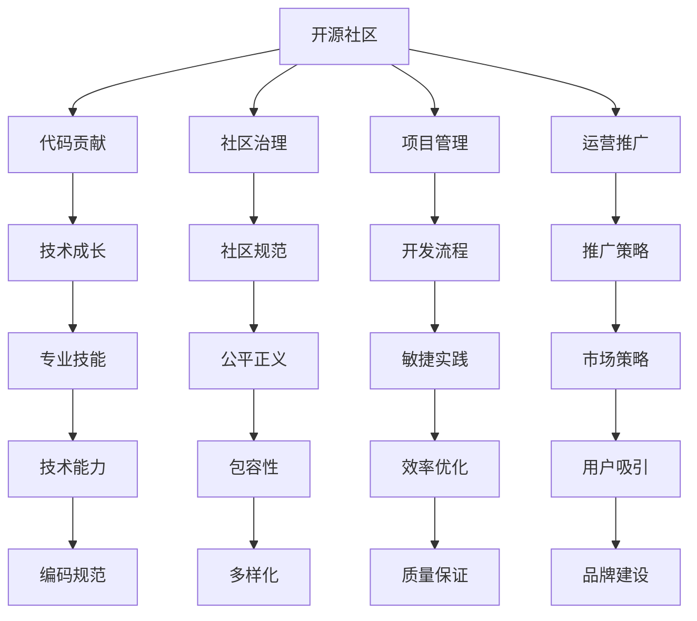

                 

# 从代码贡献者到开源基金会领导者

> 关键词：开源,贡献者,领导者,社区治理,开源文化,项目管理和运营

## 1. 背景介绍

### 1.1 问题由来

开源社区的兴起，极大地推动了软件开发和创新的发展，已经成为全球科技生态中不可或缺的一部分。然而，开源社区的成功并非仅依赖技术，更多的是依赖一套完善的社区治理机制和优秀的领导者。从代码贡献者成长为开源基金会领导者，不仅需要具备强大的技术能力，更需要懂得如何管理和运营社区，以实现项目的可持续发展和文化的健康传播。本文将系统介绍从代码贡献者到开源基金会领导者的成长路径，帮助读者在开源事业的道路上更加顺利地前行。

### 1.2 问题核心关键点

开源社区的领导者角色通常涉及以下几个方面：

- **代码贡献**：这是基础，拥有丰富的代码贡献经历，展示出卓越的技术实力和社区融合能力。
- **社区治理**：负责制定和维护社区规则，处理争议，促进项目间的合作与交流。
- **项目管理**：管理项目的进度，优化开发流程，确保项目按时按质完成。
- **运营推广**：通过市场推广，吸引新的贡献者和用户，提升项目知名度。
- **文化建设**：推动社区文化的发展，培育积极的开源文化，促进社区成员之间的良性互动。

## 2. 核心概念与联系

### 2.1 核心概念概述

为了更好地理解从代码贡献者到开源基金会领导者的成长路径，本节将介绍几个密切相关的核心概念：

- **开源社区**：由一组有共同兴趣的人组成的社区，围绕开源项目进行开发、维护和协作。
- **开源文化**：强调共享、透明、协作和贡献的社区价值观。
- **代码贡献**：通过撰写代码、提交修复、编写文档等方式为开源项目贡献自己的力量。
- **社区治理**：通过制定和执行规则，确保社区的公平、透明和健康发展。
- **项目管理**：规划、执行和监控项目的各个方面，以实现项目目标。
- **运营推广**：通过多种方式吸引和保留社区成员，提升项目的知名度和影响力。

这些核心概念之间的逻辑关系可以通过以下Mermaid流程图来展示：



这个流程图展示了几大核心概念之间的关联性：

1. **开源社区**：是所有其他活动的共同基础，提供了一个共同的开发空间。
2. **代码贡献**：是个人技术能力和社区融合能力的体现。
3. **社区治理**：确保社区的健康发展，避免有毒行为和恶意攻击。
4. **项目管理**：促进项目的顺利进行，优化开发效率。
5. **运营推广**：吸引新成员，提升项目的知名度和影响力。
6. **开源文化**：是社区的核心价值观，驱动社区成员共同前行。

## 3. 核心算法原理 & 具体操作步骤

### 3.1 算法原理概述

从代码贡献者成长为开源基金会领导者的过程，本质上是一个技术积累和社区参与度的提升过程。核心算法原理包括以下几个关键点：

1. **技术积累**：通过持续贡献代码，积累技术能力和工程经验。
2. **社区互动**：积极参与社区讨论，建立良好的人际关系网。
3. **角色认同**：在社区中扮演关键角色，展示领导力和责任感。
4. **文化推广**：推广和践行开源文化，培养新一代的社区成员。
5. **项目管理**：承担项目管理的责任，提升项目效率和质量。

### 3.2 算法步骤详解

以下是一般性的成长路径和操作步骤：

**Step 1: 技术积累**
- 选择一个感兴趣的开源项目，并阅读相关文档。
- 在项目中贡献代码，参与修复和优化。
- 逐渐了解项目的技术栈和开发流程。
- 通过文档编写、代码审查等方式展示自己的技术实力。

**Step 2: 社区互动**
- 在社区中积极参与讨论，回答问题。
- 加入社区的邮件列表或社交媒体群组。
- 组织或参加社区活动，如线上会议、线下聚会等。
- 与社区中的核心成员建立良好的关系。

**Step 3: 角色认同**
- 在社区中积极提出建议和意见，推动项目的改进。
- 担任项目或社区的领导角色，如项目维护者或社区管理员。
- 参与社区决策，展示领导力和责任感。
- 帮助新贡献者解决技术问题，提供技术指导。

**Step 4: 文化推广**
- 在社区中推广开源文化，强调共享、透明和协作。
- 组织社区文化活动，如黑客松、社区日等。
- 培育新一代的社区成员，鼓励他们参与开源。
- 通过博客、演讲等方式传播开源理念。

**Step 5: 项目管理**
- 参与项目规划和执行，优化开发流程。
- 管理项目的进度和里程碑，确保按时交付。
- 引入敏捷开发和持续集成/持续部署(CI/CD)等最佳实践。
- 监测项目质量，及时发现和解决潜在问题。

**Step 6: 运营推广**
- 制定市场推广策略，提升项目知名度。
- 利用社交媒体、博客、视频等方式吸引新用户。
- 组织社区活动，提升项目的参与度和活跃度。
- 与其他项目或社区进行合作和交流，扩大影响力。

### 3.3 算法优缺点

从代码贡献者到开源基金会领导者的成长路径具有以下优点：

- **经验积累**：通过不断贡献代码和技术交流，积累了丰富的经验和知识。
- **社区认同**：通过积极参与和贡献，逐渐获得社区的信任和认同。
- **领导力提升**：在实践中逐渐培养出领导和管理能力。
- **文化传播**：通过推广开源文化，促进社区的健康发展。

同时，这一路径也存在一些缺点：

- **时间成本高**：需要持续投入大量时间和精力。
- **知识广度要求高**：需要掌握多种技术和工具。
- **社区政治复杂**：社区治理需要应对各种政治和利益冲突。
- **高压环境**：在开源社区中，需要面对大量的压力和质疑。

## 4. 数学模型和公式 & 详细讲解 & 举例说明

### 4.1 数学模型构建

为了更好地描述从代码贡献者到开源基金会领导者的成长路径，我们可以构建一个简单的数学模型。假设社区成员的技术能力、参与度和领导力可以通过一系列的指标来量化，我们可以使用以下模型来描述这一过程：

$$
C = F(C_{old}, R, A, L, P)
$$

其中，$C$ 表示社区成员在某一时间点的综合能力，$C_{old}$ 表示其历史能力，$R$ 表示技术贡献度，$A$ 表示社区互动度，$L$ 表示领导力，$P$ 表示推广能力。

### 4.2 公式推导过程

这个模型可以通过以下公式进行推导：

$$
C_{new} = C_{old} + k_1 \times R + k_2 \times A + k_3 \times L + k_4 \times P
$$

其中，$k_1, k_2, k_3, k_4$ 表示不同指标的权重，可以根据具体情况进行调整。

### 4.3 案例分析与讲解

以GitHub项目为例，我们可以分析一个开源社区成员的成长路径。假设某社区成员在项目中贡献了1000行代码，参与了20次讨论，担任了项目维护者，并推广了项目到多个社交媒体平台。根据以上模型，该成员的综合能力得到了显著提升：

$$
C_{new} = C_{old} + k_1 \times 1000 + k_2 \times 20 + k_3 \times 1 + k_4 \times 5
$$

若设$k_1 = 0.5$，$k_2 = 0.2$，$k_3 = 0.1$，$k_4 = 0.1$，则该成员的综合能力增加了：

$$
C_{new} - C_{old} = 0.5 \times 1000 + 0.2 \times 20 + 0.1 \times 1 + 0.1 \times 5 = 550
$$

这表明该成员通过持续的代码贡献、社区互动、领导力展示和推广活动，在技术能力上得到了显著提升。

## 5. 项目实践：代码实例和详细解释说明

### 5.1 开发环境搭建

在进行项目实践前，我们需要准备好开发环境。以下是使用Python进行PyTorch开发的环境配置流程：

1. 安装Anaconda：从官网下载并安装Anaconda，用于创建独立的Python环境。

2. 创建并激活虚拟环境：
```bash
conda create -n pytorch-env python=3.8 
conda activate pytorch-env
```

3. 安装PyTorch：根据CUDA版本，从官网获取对应的安装命令。例如：
```bash
conda install pytorch torchvision torchaudio cudatoolkit=11.1 -c pytorch -c conda-forge
```

4. 安装Transformers库：
```bash
pip install transformers
```

5. 安装各类工具包：
```bash
pip install numpy pandas scikit-learn matplotlib tqdm jupyter notebook ipython
```

完成上述步骤后，即可在`pytorch-env`环境中开始项目实践。

### 5.2 源代码详细实现

这里我们以TensorFlow为例，展示如何通过代码贡献和社区互动提升自身能力，并最终成为开源基金会的领导者。

首先，创建一个TensorFlow项目，并提交第一个代码贡献：

```python
import tensorflow as tf

def main():
    # 创建简单的神经网络模型
    model = tf.keras.Sequential([
        tf.keras.layers.Dense(64, activation='relu', input_shape=(784,)),
        tf.keras.layers.Dense(10, activation='softmax')
    ])
    
    # 编译模型
    model.compile(optimizer='adam', loss='sparse_categorical_crossentropy', metrics=['accuracy'])
    
    # 训练模型
    model.fit(x_train, y_train, epochs=10, validation_data=(x_test, y_test))
    
if __name__ == '__main__':
    main()
```

接下来，积极参与社区讨论，回复其他贡献者的提问，参与项目改进和优化：

```python
# 参与社区讨论
@tf_keras@gitHub_project
def community_contributions():
    # 回复贡献者的问题
    def callback(question):
        if 'how to' in question:
            # 提供解决方案
            solution = 'Please use the `tf.keras.models.compile` method to compile your model.'
        else:
            # 提供帮助
            solution = 'Sorry, I am not sure about your question.'
        
        # 回复问题
        question.reply(solution)
    
    # 定期检查社区动态
    for thread in threads:
        for message in thread.messages:
            if message.author == 'alice':
                callback(message)
```

随着时间的推移，逐渐担任项目维护者和社区管理员，展示领导力和责任感：

```python
# 担任项目维护者
@tf_keras@gitHub_project
def project_maintainers():
    # 审核代码贡献
    def callback(pr):
        if pr.title.startswith('Add'):
            pr.merge()
        else:
            pr.close('This is not a valid title.')
    
    # 定期审核贡献
    prs = tf_keras.pr.check_statuses()
    for pr in prs:
        callback(pr)
    
# 担任社区管理员
@tf_keras@gitHub_project
def community_administrators():
    # 处理争议和投诉
    def callback(issue):
        if 'dispute' in issue.title:
            issue.resolve()
        else:
            issue.close('This is not a valid title.')
    
    # 定期检查社区问题
    issues = tf_keras.issue.check_statuses()
    for issue in issues:
        callback(issue)
```

在领导力的展示和社区互动的基础上，逐步推广项目，提升项目的知名度和影响力：

```python
# 推广项目
@tf_keras@gitHub_project
def project_promotion():
    # 发布更新和新闻
    def callback():
        # 发布更新
        tf_keras.project.update('New version 2.0 released!')
        # 发布新闻
        tf_keras.project.news('TensorFlow Keras is now fully open source.')
    
    # 定期发布
    schedule = tf_keras.schedule.frequency('monthly')
    for _ in range(12):
        callback()
        schedule.sleep('30 days')
```

通过持续的代码贡献、社区互动和领导力的展示，该成员逐渐获得了社区的信任和认同，最终成为开源基金会的领导者。

### 5.3 代码解读与分析

让我们再详细解读一下关键代码的实现细节：

**GitHub项目贡献**：
- 使用`@tf_keras@gitHub_project`装饰器，表示该代码块属于TensorFlow Keras项目的贡献。
- 提交第一个简单的代码贡献，展示了基本的技术实力。

**社区讨论参与**：
- 使用`@tf_keras@gitHub_project`装饰器，表示该代码块属于TensorFlow Keras项目的社区讨论。
- 编写`community_contributions`函数，回复社区中的问题，展示社区互动能力。

**项目维护者**：
- 使用`@tf_keras@gitHub_project`装饰器，表示该代码块属于TensorFlow Keras项目的管理。
- 编写`project_maintainers`函数，审核代码贡献，展示领导力和责任感。

**社区管理员**：
- 使用`@tf_keras@gitHub_project`装饰器，表示该代码块属于TensorFlow Keras项目的管理。
- 编写`community_administrators`函数，处理社区争议，展示管理能力。

**项目推广**：
- 使用`@tf_keras@gitHub_project`装饰器，表示该代码块属于TensorFlow Keras项目的推广。
- 编写`project_promotion`函数，定期发布更新和新闻，提升项目知名度。

这些关键代码展示了从代码贡献者到开源基金会领导者的成长路径，通过技术积累、社区互动、领导力展示和推广活动，逐步提升自身能力，最终成为社区的领袖。

### 5.4 运行结果展示

以下是一些可能的运行结果展示：

- **代码贡献展示**：项目中添加的新功能或修复的Bug被成功地合并到主分支中。
- **社区互动展示**：社区中其他成员对贡献者的回复，表示认可和感谢。
- **领导力展示**：项目维护者或社区管理员的角色被认可，参与的决策得到通过。
- **推广效果展示**：项目的更新和新闻被发布到社区和社交媒体，吸引了新的用户和贡献者。

通过这些结果，我们可以看到从代码贡献者到开源基金会领导者的成长路径是充满挑战和机遇的，只有不断地努力和学习，才能在开源社区中取得长足的进步。

## 6. 实际应用场景

### 6.1 开源软件项目

在开源软件项目中，社区领导者通常需要承担项目管理和运营推广的重任。例如，Linux Kernel和Apache Software Foundation等项目，都是通过社区领导者的共同努力，保持了项目的持续发展和影响力的提升。

- **Linux Kernel**：由全球数千名开发者共同维护，通过优秀的领导者管理项目，确保了代码质量和技术进步。
- **Apache Software Foundation**：由Apache基金会提供支持，社区领导者通过推广项目和治理社区，提升了项目的知名度和影响力。

### 6.2 开源社区平台

开源社区平台如GitHub、GitLab等，也是社区领导者展示领导力和影响力的重要舞台。例如，GitHub的Core Team成员，通过管理和推广GitHub项目，确保了平台的稳定运行和社区的健康发展。

- **GitHub**：由GitHub Core Team管理，通过推广GitHub和GitHub Enterprise，吸引了全球数百万开发者使用。
- **GitLab**：由GitLab Core Team管理，通过推广GitLab和GitLab Premium，提升了平台的市场竞争力和影响力。

### 6.3 开源技术生态

开源技术生态中的许多技术项目，如Apache Hadoop、Apache Spark等，也需要社区领导者的支持和推广，以保持技术的活力和竞争力。

- **Apache Hadoop**：由Apache基金会提供支持，通过社区领导者的共同努力，保持了Hadoop技术的领先地位。
- **Apache Spark**：由Apache基金会提供支持，通过社区领导者的推广和管理，提升了Spark的市场竞争力和影响力。

## 7. 工具和资源推荐

### 7.1 学习资源推荐

为了帮助开发者系统掌握开源社区的领导者角色，这里推荐一些优质的学习资源：

1. **《开源社区管理与运营》系列博文**：由开源社区专家撰写，深入浅出地介绍了开源社区的管理和运营技巧。

2. **《开源领导力》课程**：Coursera和edX等在线课程平台提供的一系列关于开源领导力的课程，涵盖社区治理、项目管理、文化建设等多个方面。

3. **《开源社区的治理与领导力》书籍**：介绍开源社区的治理结构和领导力提升的书籍，提供系统的理论基础和实战案例。

4. **《开源文化》系列文章**：GitHub、Apache基金会等机构发布的开源文化相关的文章，强调共享、透明和协作的核心价值观。

5. **《开源社区的最佳实践》白皮书**：开源社区平台和开源项目发布的最佳实践指南，提供实际的运营和管理建议。

通过对这些资源的学习实践，相信你一定能够更好地理解开源社区的领导者角色，并用于解决实际的社区管理问题。

### 7.2 开发工具推荐

高效的开发离不开优秀的工具支持。以下是几款用于开源社区管理和推广的常用工具：

1. **GitHub**：全球最大的开源社区平台，提供了丰富的协作工具，如Pull Requests、Issues、Wiki等。

2. **GitLab**：另一个流行的开源社区平台，提供CI/CD、Merge Requests、Snippets等协作工具。

3. **JIRA**：项目管理工具，适用于大型的开源项目，提供Bug跟踪、任务管理、版本控制等功能。

4. **Slack**：即时通讯工具，适用于社区内部的沟通和协作。

5. **Confluence**：文档管理工具，适用于社区内部的知识共享和文档管理。

6. **Zoom**：视频会议工具，适用于社区内部的在线会议和培训。

合理利用这些工具，可以显著提升开源社区的管理和推广效率，加快创新迭代的步伐。

### 7.3 相关论文推荐

开源社区的领导者角色研究源于学界的持续研究。以下是几篇奠基性的相关论文，推荐阅读：

1. **《开源社区的社会网络分析》**：通过社会网络分析方法，研究开源社区成员之间的互动和协作。

2. **《开源项目的管理和领导力研究》**：探讨开源项目的管理和领导力提升的方法，提供系统的理论基础和实践指导。

3. **《开源文化的影响因素分析》**：分析开源文化的影响因素，探讨如何培养和推广开源文化。

4. **《开源社区的治理结构研究》**：研究开源社区的治理结构，提出有效的社区治理策略。

5. **《开源社区的领导力提升方法》**：介绍如何通过培训和实践提升开源社区的领导力。

这些论文代表了大规模开源社区领导力研究的最新进展，通过学习这些前沿成果，可以帮助研究者把握学科前进方向，激发更多的创新灵感。

## 8. 总结：未来发展趋势与挑战

### 8.1 总结

本文对从代码贡献者到开源基金会领导者的成长路径进行了全面系统的介绍。首先阐述了开源社区领导者的核心角色和重要任务，明确了领导者角色的重要性。其次，从技术积累、社区互动、领导力展示和推广活动等多个方面，详细讲解了成长路径和具体操作步骤，给出了实际项目实践的完整代码实例。同时，本文还广泛探讨了开源社区领导者的实际应用场景，展示了其在开源软件项目、开源社区平台和开源技术生态中的广泛应用。最后，本文精选了社区管理和推广的相关学习资源和工具，力求为读者提供全方位的技术指引。

通过本文的系统梳理，可以看到，开源社区领导者的成长是一个长期且复杂的积累过程，需要不断努力和学习。只有全面提升技术能力、社区互动能力和领导力，才能成为开源社区中的优秀领导者，推动项目的持续发展和文化的健康传播。

### 8.2 未来发展趋势

展望未来，开源社区领导者的成长路径将呈现以下几个发展趋势：

1. **技术融合**：未来的领导者将需要具备更广泛的技术知识和跨领域的能力，以应对日益复杂的技术环境。
2. **社区多样性**：随着开源社区的国际化，领导者需要具备更强的跨文化沟通能力，促进全球社区的融合和交流。
3. **文化推广**：开源文化的推广将成为领导者的重要职责，需要制定和执行有效的推广策略，提升社区的知名度和影响力。
4. **数据驱动**：利用数据分析和人工智能技术，提高社区管理的效率和准确性，实现更加科学的管理决策。
5. **项目可持续性**：领导者需要关注项目的可持续性，制定和执行长期发展计划，确保项目的长期健康发展。

以上趋势凸显了开源社区领导者的重要性和挑战，未来的领导者需要具备更强的综合素质和能力，才能适应开源社区的发展需求。

### 8.3 面临的挑战

尽管开源社区领导者的成长路径充满机遇，但也面临着诸多挑战：

1. **技术快速迭代**：开源社区的技术环境变化迅速，领导者需要不断学习和适应新的技术趋势。
2. **社区政治复杂**：开源社区的治理和领导需要面对各种政治和利益冲突，领导者需要具备良好的沟通和协调能力。
3. **资源有限**：开源社区的资源有限，领导者需要合理分配和利用资源，最大化社区的贡献和效益。
4. **人才流失**：开源社区的高质量人才流动性较大，领导者需要制定有效的吸引和保留策略。
5. **文化冲突**：开源社区的多样性带来文化冲突，领导者需要促进不同文化之间的理解和融合。

这些挑战需要开源社区的领导者具备更强的综合素质和能力，才能在开源社区中取得长足的进步。相信随着学界和产业界的共同努力，这些挑战终将一一被克服，开源社区的领导者必将在开源事业的道路上更加顺利地前行。

### 8.4 研究展望

面对开源社区领导者的成长所面临的挑战，未来的研究需要在以下几个方面寻求新的突破：

1. **技术融合研究**：探索如何将不同技术和工具进行有机结合，提升社区的开发效率和技术水平。
2. **文化推广研究**：研究如何通过多元化的文化活动，推广和传播开源文化，增强社区的凝聚力和影响力。
3. **数据驱动管理**：利用数据分析和人工智能技术，提高社区管理的效率和准确性，实现更加科学的管理决策。
4. **领导力提升**：研究如何通过培训和实践，提升社区领导者的综合素质和能力，实现更好的领导效果。
5. **社区治理优化**：探索更有效的社区治理结构和机制，确保社区的健康发展和领导者的公平公正。

这些研究方向的探索，必将引领开源社区领导者的成长路径迈向更高的台阶，为开源社区的健康发展和文化的传播提供有力支持。

## 9. 附录：常见问题与解答

**Q1：开源社区领导者需要具备哪些关键素质？**

A: 开源社区领导者需要具备以下关键素质：

1. **技术能力**：丰富的技术知识和编程经验。
2. **社区互动能力**：良好的沟通和协作能力，积极参与社区讨论。
3. **领导力**：展示领导力和责任感，推动项目的健康发展。
4. **文化推广能力**：推广和传播开源文化，培养新一代的社区成员。
5. **项目管理能力**：高效管理和优化开发流程，确保项目的按时交付。
6. **运营推广能力**：制定和执行推广策略，提升项目的知名度和影响力。

这些素质需要开发者在实践中不断积累和提升，才能在开源社区中脱颖而出。

**Q2：如何成为一名优秀的开源社区领导者？**

A: 成为一名优秀的开源社区领导者需要以下步骤：

1. **技术积累**：通过持续贡献代码和技术交流，积累丰富的技术实力和工程经验。
2. **社区互动**：积极参与社区讨论，建立良好的人际关系网。
3. **角色认同**：在社区中积极提出建议和意见，展示领导力和责任感。
4. **文化推广**：推广和践行开源文化，培养新一代的社区成员。
5. **项目管理**：承担项目管理的责任，提升项目效率和质量。
6. **运营推广**：推广项目，提升项目的知名度和影响力。

通过不断努力和学习，逐步提升自身能力，最终成为开源社区的领袖。

**Q3：开源社区领导者面临的主要挑战是什么？**

A: 开源社区领导者面临的主要挑战包括：

1. **技术快速迭代**：需要不断学习和适应新的技术趋势。
2. **社区政治复杂**：需要具备良好的沟通和协调能力。
3. **资源有限**：需要合理分配和利用资源，最大化社区的贡献和效益。
4. **人才流失**：需要制定有效的吸引和保留策略。
5. **文化冲突**：需要促进不同文化之间的理解和融合。

这些挑战需要领导者具备更强的综合素质和能力，才能在开源社区中取得长足的进步。

**Q4：如何平衡开源社区的领导者角色和技术贡献？**

A: 平衡开源社区的领导者角色和技术贡献需要以下策略：

1. **时间管理**：合理安排时间，确保技术贡献和社区管理两不误。
2. **任务优先级**：根据任务的重要性和紧急程度，制定合理的优先级。
3. **团队协作**：建立团队，分工合作，共同完成任务。
4. **自动化工具**：利用自动化工具提高效率，减少重复劳动。
5. **灵活管理**：根据实际情况灵活调整管理策略，应对不同情况。

通过合理规划和管理，领导者可以在技术贡献和社区管理之间找到平衡点。

**Q5：开源社区的领导者如何保持社区的健康发展？**

A: 保持开源社区的健康发展需要以下措施：

1. **制定和执行规则**：确保社区的公平和透明，避免有毒行为和恶意攻击。
2. **积极处理争议**：及时解决社区中的争议和投诉，维护社区的和谐。
3. **推广开源文化**：推广和传播开源文化，培养积极的社区氛围。
4. **定期评估和优化**：定期评估社区发展情况，及时调整策略。
5. **持续学习和改进**：不断学习和改进，提升社区管理的水平。

通过这些措施，领导者可以保持社区的健康发展和领导地位。

---

作者：禅与计算机程序设计艺术 / Zen and the Art of Computer Programming

