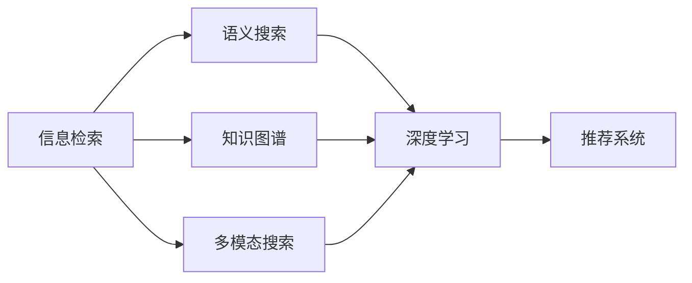

                 

# 从信息检索到知识综合：AI搜索的新范式

> 关键词：信息检索, 知识综合, 语义搜索, 知识图谱, 多模态搜索, 深度学习

## 1. 背景介绍

在信息爆炸的互联网时代，搜索引擎成为我们获取知识、解决问题的重要工具。但传统的基于关键词匹配的信息检索技术，已无法满足用户日益增长的个性化和智能化需求。在AI技术的推动下，新一代AI搜索范式应运而生，它将信息检索与知识图谱、多模态搜索等技术相结合，赋予搜索更为深刻的内涵和能力。

### 1.1 问题由来

随着互联网的普及和信息技术的不断进步，人们获取信息的途径日益多样化和复杂化。传统的基于关键词匹配的信息检索技术，已难以有效处理海量、异构、多模态的信息资源，也无法应对用户个性化和动态化查询需求。人工智能技术，特别是深度学习、知识图谱等技术的飞速发展，为信息检索注入了新的活力。

以知识图谱为例，它通过构建概念之间的关系网络，为搜索引擎提供了更为结构化、语义化的知识表示，使得搜索能够跨越文本的界限，结合图像、视频、音频等多模态信息，实现更全面、更智能的检索。这种基于知识的搜索，被称为语义搜索。

### 1.2 问题核心关键点

当前，AI搜索技术面临着以下核心挑战：

1. **语义理解的深度**：如何实现更精准的语义理解，从而构建精确的查询模型。
2. **多模态信息的融合**：如何有效地融合文本、图像、视频等多模态数据，提高检索效果。
3. **知识的动态更新**：如何实时获取和更新知识图谱，保持信息的时效性。
4. **个性化和定制化**：如何根据用户的历史行为和偏好，提供个性化搜索结果。
5. **多语言支持**：如何实现跨语言搜索，适应全球化需求。
6. **隐私和安全**：如何在保障用户隐私的同时，提供高效和安全的搜索服务。

这些问题都需要新一代AI搜索技术去解决，以实现从信息检索到知识综合的转变。

## 2. 核心概念与联系

### 2.1 核心概念概述

为了更深入理解AI搜索的新范式，我们先介绍几个核心概念：

- **信息检索 (Information Retrieval, IR)**：通过关键词匹配等方式，从海量信息中查找相关文档的过程。
- **语义搜索 (Semantic Search)**：结合语义理解，基于概念之间的关系进行查询，实现更精确的搜索结果。
- **知识图谱 (Knowledge Graph)**：通过构建概念及其关系的图谱，提供结构化、语义化的知识表示。
- **多模态搜索 (Multimodal Search)**：将文本、图像、视频等多模态信息融合，实现更全面的检索。
- **深度学习 (Deep Learning)**：通过多层神经网络进行特征提取和模式学习，提高检索模型的精度和泛化能力。
- **推荐系统 (Recommender System)**：通过分析用户行为，推荐个性化的内容，增强用户体验。

这些概念通过以下Mermaid流程图联系起来：



从信息检索到知识综合，经历了从基于关键词的浅层次匹配，到深度语义理解的转变。新一代AI搜索技术，通过构建知识图谱、融合多模态信息、应用深度学习等技术，使得搜索结果更加精准、全面和个性化。

### 2.2 核心概念原理和架构

语义搜索的原理主要包括以下几个步骤：

1. **语义理解**：通过自然语言处理(NLP)技术，将用户的查询转化为语义表示。
2. **概念匹配**：在知识图谱中查找与查询语义表示匹配的概念。
3. **关系推理**：基于概念之间的关系，推理出更丰富的信息。
4. **多模态融合**：结合文本、图像、视频等多模态信息，提供更全面的检索结果。

其架构如下：

```
+-------------------+
|    用户输入      |
+-------------------+
             |
             V
+-------------------+
|  自然语言处理    |
+-------------------+
             |
             V
+-------------------+
|   语义理解与匹配 |
+-------------------+
             |
             V
+-------------------+
|    知识图谱查询   |
+-------------------+
             |
             V
+-------------------+
|  关系推理与融合  |
+-------------------+
             |
             V
+-------------------+
|    检索结果输出   |
+-------------------+
```

## 3. 核心算法原理 & 具体操作步骤

### 3.1 算法原理概述

基于语义搜索的AI搜索，主要依赖以下算法原理：

1. **深度学习表示学习**：通过神经网络将用户查询和文档表示为向量，实现更精准的匹配。
2. **知识图谱嵌入**：将知识图谱中的概念和关系嵌入向量空间，方便进行语义匹配。
3. **关系推理算法**：如基于图结构的推理、基于规则的推理等，增强搜索结果的全面性。
4. **多模态融合算法**：如特征拼接、注意力机制等，结合文本、图像、视频等多模态数据。
5. **个性化推荐算法**：如协同过滤、基于内容的推荐等，根据用户历史行为推荐个性化内容。

这些算法原理的实现，依赖于先进的数据处理、深度学习、知识图谱等技术。

### 3.2 算法步骤详解

基于语义搜索的AI搜索主要步骤如下：

1. **数据预处理**：对文本、图像、视频等数据进行清洗、标注，构建训练集。
2. **语义表示学习**：通过神经网络将用户查询和文档表示为向量。
3. **知识图谱嵌入**：将知识图谱中的概念和关系嵌入向量空间，进行语义匹配。
4. **关系推理**：基于知识图谱中的关系，推理出更丰富的信息。
5. **多模态融合**：将文本、图像、视频等多模态信息融合，提供更全面的检索结果。
6. **个性化推荐**：根据用户历史行为，推荐个性化搜索结果。

### 3.3 算法优缺点

基于语义搜索的AI搜索有以下优点：

1. **精准性高**：通过语义理解，实现更精确的检索。
2. **覆盖广**：融合多模态信息，提供更全面的检索结果。
3. **个性化强**：结合用户历史行为，提供个性化推荐。
4. **可扩展性强**：基于知识图谱，方便实时扩展和更新。

同时，这种搜索方法也存在以下缺点：

1. **计算复杂度高**：深度学习、知识图谱等技术需要大量计算资源。
2. **数据标注难**：知识图谱的构建需要大量人工标注，成本较高。
3. **跨领域泛化差**：特定领域的知识图谱可能不适用于其他领域。
4. **数据隐私问题**：用户查询和行为数据可能涉及隐私问题。

### 3.4 算法应用领域

基于语义搜索的AI搜索技术，在多个领域得到了广泛应用：

1. **智能搜索引擎**：如Google、Bing等，通过知识图谱和深度学习提升搜索效果。
2. **企业知识管理**：构建企业内部的知识图谱，实现知识检索和知识推荐。
3. **智能客服系统**：通过语义搜索技术，提升客服系统的智能水平和用户体验。
4. **个性化推荐系统**：如Netflix、Amazon等，通过多模态搜索技术，提供个性化内容推荐。
5. **医疗健康应用**：通过知识图谱和深度学习，实现疾病诊断和药物推荐。

## 4. 数学模型和公式 & 详细讲解 & 举例说明

### 4.1 数学模型构建

我们以知识图谱嵌入为例，介绍其数学模型的构建过程。

设知识图谱中的概念为$C$，关系为$R$，表示为三元组$(h,r,t)$。其中$h$和$t$为概念，$r$为关系。我们将概念和关系嵌入向量空间，表示为$\vec{c}_h$和$\vec{r}$。设用户查询为$q$，表示为向量$\vec{q}$。

知识图谱嵌入的目标函数为：

$$
\min_{\vec{c}_h, \vec{r}, \vec{t}} \| \vec{c}_h - \vec{q} \|^2 + \| \vec{r} \|^2 + \| \vec{t} - \vec{q} \|^2
$$

### 4.2 公式推导过程

通过神经网络，可以将查询$q$表示为向量$\vec{q}$。设神经网络结构为$F_q(q)$，其中$F_q$为前向传播函数，$W_q$为权重矩阵，$b_q$为偏置向量。则有：

$$
\vec{q} = F_q(q) = W_q \cdot F_{W_q}(W_q \cdot q + b_q)
$$

对于知识图谱中的概念$C$，设神经网络结构为$F_c(C)$，则有：

$$
\vec{c}_h = F_c(h) = W_c \cdot F_{W_c}(W_c \cdot h + b_c)
$$

### 4.3 案例分析与讲解

以下是一个基于深度学习的知识图谱嵌入的案例分析：

1. **数据准备**：构建一个简单的知识图谱，包含3个概念（A, B, C）和3个关系（R1, R2, R3）。
2. **模型构建**：设计一个简单的前向神经网络，包含两个隐藏层，每个隐藏层有10个神经元。
3. **训练过程**：使用随机梯度下降法，最小化损失函数。
4. **评估结果**：将训练好的模型应用于知识图谱中的查询，计算结果向量与查询向量的相似度，实现概念匹配。

## 5. 项目实践：代码实例和详细解释说明

### 5.1 开发环境搭建

基于语义搜索的AI搜索项目开发需要搭建多种环境，包括：

1. **Python环境**：建议使用Anaconda创建虚拟环境，安装必要的库。
2. **深度学习框架**：如TensorFlow、PyTorch等，进行模型训练。
3. **自然语言处理库**：如NLTK、SpaCy等，进行文本处理。
4. **知识图谱工具**：如Neo4j、Stanford Graphbase等，进行知识图谱构建和管理。

### 5.2 源代码详细实现

以下是一个基于TensorFlow的简单知识图谱嵌入代码实现：

```python
import tensorflow as tf
from tensorflow.keras.layers import Dense

# 定义神经网络结构
model = tf.keras.Sequential([
    Dense(32, activation='relu', input_shape=(3,)),
    Dense(16, activation='relu'),
    Dense(3, activation='softmax')
])

# 编译模型
model.compile(optimizer='adam', loss='categorical_crossentropy', metrics=['accuracy'])

# 训练模型
model.fit(X_train, y_train, epochs=10, batch_size=32)

# 使用模型进行预测
y_pred = model.predict(X_test)
```

### 5.3 代码解读与分析

以上代码实现了一个简单的神经网络，用于将概念和查询表示为向量，并进行分类。其中：

- `Dense`层：定义了两个隐藏层和一个输出层，每个隐藏层有32个神经元，输出层有3个神经元，对应知识图谱中的3个概念。
- `compile`方法：编译模型，指定优化器和损失函数。
- `fit`方法：训练模型，指定训练数据和迭代次数。
- `predict`方法：使用模型进行预测，输出结果向量。

### 5.4 运行结果展示

通过训练和测试，可以得出模型在知识图谱中的概念分类效果。例如，查询向量为`[0.5, 0.3, 0.2]`，模型预测为概念B的概率最大，表示查询与概念B最相关。

## 6. 实际应用场景

### 6.1 智能搜索引擎

智能搜索引擎如Google、Bing等，通过结合知识图谱和深度学习，实现了更精准、更全面的搜索效果。用户输入的查询经过语义理解后，能够在知识图谱中匹配相关概念，并结合多模态数据提供更丰富的检索结果。

### 6.2 企业知识管理

企业知识管理系统中，通过构建企业内部的知识图谱，实现了知识检索和知识推荐功能。员工可以通过搜索系统，快速找到所需文档、报告和资源，提升了工作效率。

### 6.3 智能客服系统

智能客服系统通过语义搜索技术，提升了客服系统的智能化水平和用户体验。用户可以通过自然语言输入问题，系统能够准确理解并给出答案，提高了客服效率和服务质量。

### 6.4 个性化推荐系统

个性化推荐系统如Netflix、Amazon等，通过多模态搜索技术，提供个性化内容推荐。用户的历史行为和偏好被分析后，系统会推送符合用户兴趣的电影、商品等，提高了用户的满意度和留存率。

## 7. 工具和资源推荐

### 7.1 学习资源推荐

1. **《深度学习》书籍**：Ian Goodfellow等著，详细介绍了深度学习的基本原理和应用。
2. **《知识图谱》书籍**：Neil Lawrence等著，介绍了知识图谱的基本概念和构建方法。
3. **CS224N课程**：斯坦福大学自然语言处理课程，涵盖NLP和知识图谱的最新进展。
4. **Kaggle竞赛**：参与AI搜索相关的Kaggle竞赛，提升实战技能。

### 7.2 开发工具推荐

1. **Anaconda**：创建和管理Python虚拟环境，安装必要的库。
2. **TensorFlow**：深度学习框架，支持大规模模型训练。
3. **PyTorch**：深度学习框架，灵活性和可扩展性强。
4. **NLTK**：自然语言处理库，提供了丰富的NLP工具和语料库。
5. **Stanford Graphbase**：知识图谱工具，方便构建和管理知识图谱。

### 7.3 相关论文推荐

1. **《知识图谱：概念与技术》**：Zhigang Chen等著，介绍了知识图谱的基本概念和技术。
2. **《多模态学习综述》**：Lei Chen等著，综述了多模态学习的最新进展。
3. **《深度学习在自然语言处理中的应用》**：Jurafsky等著，介绍了深度学习在NLP中的各种应用。

## 8. 总结：未来发展趋势与挑战

### 8.1 研究成果总结

基于语义搜索的AI搜索技术，从传统的关键词匹配，发展到深度语义理解和知识图谱融合，实现了从信息检索到知识综合的转变。未来，随着技术的不断进步，AI搜索将更加智能化、普适化和个性化。

### 8.2 未来发展趋势

1. **语义理解的深化**：通过更先进NLP技术，实现更深层次的语义理解。
2. **多模态融合的扩展**：融合更多模态信息，实现更全面的检索。
3. **实时计算能力的提升**：通过更高效的计算和存储技术，支持实时查询。
4. **跨语言搜索的普及**：实现多语言的语义搜索，适应全球化需求。
5. **隐私保护和安全**：通过隐私保护技术，保障用户数据安全。

### 8.3 面临的挑战

1. **计算资源的需求**：大规模深度学习和知识图谱构建需要大量计算资源。
2. **数据标注的复杂性**：知识图谱的构建和更新需要大量人工标注。
3. **跨领域泛化性**：特定领域的知识图谱难以泛化到其他领域。
4. **隐私保护**：用户数据隐私和安全问题亟待解决。

### 8.4 研究展望

未来的研究需要围绕以下方向展开：

1. **高效计算**：开发更高效的深度学习算法和计算架构，支持大规模计算。
2. **自动化标注**：研究自动化的数据标注技术，降低标注成本。
3. **跨领域泛化**：构建通用的知识图谱和语义表示，提升跨领域的检索效果。
4. **隐私保护**：研发隐私保护技术，确保用户数据安全。

## 9. 附录：常见问题与解答

**Q1：什么是语义搜索？**

A: 语义搜索是一种结合语义理解，基于概念之间的关系进行查询，实现更精确检索的技术。它通过自然语言处理技术将查询转化为语义表示，在知识图谱中查找匹配的概念，并基于关系推理出更丰富的信息。

**Q2：如何进行知识图谱嵌入？**

A: 知识图谱嵌入是将概念和关系表示为向量，进行语义匹配的过程。通过神经网络结构，将查询和概念表示为向量，最小化损失函数，训练出高质量的嵌入向量。

**Q3：如何实现多模态融合？**

A: 多模态融合是将文本、图像、视频等多模态信息结合，提供更全面的检索结果。常见方法包括特征拼接、注意力机制等，不同模态的数据通过深度学习模型融合，输出更丰富的特征表示。

**Q4：如何在AI搜索中实现个性化推荐？**

A: 个性化推荐系统通过分析用户历史行为，推荐个性化内容。常用方法包括协同过滤、基于内容的推荐等，结合多模态搜索技术，提供更符合用户兴趣的推荐结果。

**Q5：AI搜索技术面临哪些挑战？**

A: AI搜索技术面临计算资源、数据标注、跨领域泛化、隐私保护等挑战。需要通过高效计算、自动化标注、跨领域泛化、隐私保护等技术，不断优化和提升搜索效果。

---

作者：禅与计算机程序设计艺术 / Zen and the Art of Computer Programming

