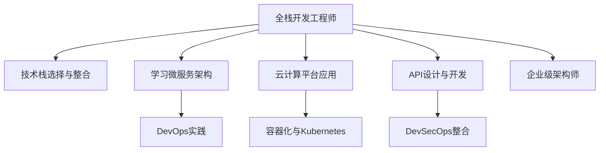

                 

# 从全栈开发到企业级架构师的进阶之路

## 1. 背景介绍

### 1.1 问题由来
在当今信息技术和数字化转型的浪潮中，全栈开发工程师逐渐成为企业级架构师的重要角色。全栈开发工程师通常掌握前端、后端、数据库、云计算等多个领域的技能，具有丰富的技术积淀和业务理解。然而，要成为一名合格的企业级架构师，还需要跨部门沟通、系统设计、项目管理等多方面的能力。本文将深入探讨从全栈开发到企业级架构师进阶的关键技术和实践方法，帮助读者明确发展方向，提升综合竞争力。

### 1.2 问题核心关键点
企业级架构师需要具备全面的技术能力、深厚的业务理解、出色的沟通协调能力。其核心职责包括：
1. 构建技术框架和体系结构，规划技术路径和资源需求。
2. 制定开发流程和规范，确保系统高效、安全、可扩展。
3. 跨部门沟通协作，协调需求和资源，推动项目进展。
4. 风险管理，预见和应对技术瓶颈和业务挑战。
5. 技术创新，推动新技术应用和优化现有系统。

本文旨在通过系统化的知识体系和实操经验，帮助全栈开发工程师实现从技术骨干到企业级架构师的转变。

## 2. 核心概念与联系

### 2.1 核心概念概述
为更好地理解从全栈开发到企业级架构师进阶的路线，本节将介绍几个密切相关的核心概念：

- **全栈开发工程师**：掌握前端、后端、数据库、云计算等多项技能，能够独立开发完整系统，并具备良好的业务理解和技术视野。

- **企业级架构师**：负责企业技术架构的规划、设计和管理，具备全面的技术能力、丰富的项目经验、出色的沟通协调能力。

- **技术栈(Tech Stack)**：包括编程语言、框架、工具、数据库等技术组件，是工程师工作的工具集。

- **微服务架构(Microservices Architecture)**：将大型应用拆分为多个独立运行的微服务，提升系统的可扩展性、可维护性和可重用性。

- **DevOps**：将软件开发和运维流程自动化、协同化，提升团队的生产效率和响应速度。

- **云计算平台(Cloud Platform)**：如AWS、Azure、Google Cloud等，提供基础设施即服务，支持弹性计算、存储、网络等资源。

- **容器化与Kubernetes**：使用Docker等容器化技术，结合Kubernetes等容器编排工具，实现应用的快速部署、扩展和管理。

- **API**：应用程序编程接口，用于不同系统或组件之间的通信和数据交换。

- **DevSecOps**：结合DevOps和信息安全，构建自动化、协同化的安全管理体系。

这些核心概念之间的逻辑关系可以通过以下Mermaid流程图来展示：



这个流程图展示了她从全栈开发到企业级架构师的技术进阶路线，包括技术栈整合、微服务架构、DevOps实践、云计算应用、容器化、API设计、DevSecOps等多个关键技术领域。

## 3. 核心算法原理 & 具体操作步骤
### 3.1 算法原理概述

从全栈开发到企业级架构师的过程，本质上是一个系统化的技术提升和综合能力构建的过程。其核心在于：

- 技术栈的深度和广度：掌握多种技术组件和工具，理解其适用场景和优缺点。
- 架构设计的全面性：理解整体架构和各组件的相互关系，能够设计和优化架构。
- 项目管理的系统性：掌握项目管理工具和方法，能够规划、跟踪和评估项目进展。
- 沟通协调的能力：提升跨部门协作能力，能够与不同领域的技术人员和业务人员高效沟通。

### 3.2 算法步骤详解

以下是从全栈开发到企业级架构师进阶的关键步骤：

**Step 1: 技术栈深化与整合**
- 深入学习多种技术栈，如前端框架React、Vue、后端语言Java、Python等，掌握其核心特性和应用场景。
- 选择合适的技术栈，进行整合，构建高效、可扩展的系统架构。

**Step 2: 学习微服务架构**
- 理解微服务的概念、优势和适用场景。
- 掌握服务拆分、服务通信、服务治理等关键技术，构建可扩展的微服务架构。

**Step 3: DevOps实践**
- 学习持续集成/持续部署(CI/CD)、自动化测试、性能监控等DevOps工具和技术。
- 构建自动化、协同化的开发和运维流程，提升团队生产效率和系统可靠性。

**Step 4: 云计算平台应用**
- 掌握AWS、Azure、Google Cloud等主要云计算平台的使用方法。
- 利用云平台提供的弹性计算、存储、网络等资源，优化系统架构和运维策略。

**Step 5: 容器化与Kubernetes**
- 学习Docker等容器化技术，理解容器化的优势和应用场景。
- 掌握Kubernetes等容器编排工具的使用方法，实现应用的快速部署、扩展和管理。

**Step 6: API设计与开发**
- 掌握RESTful API设计原则，设计高效、可扩展的API接口。
- 使用Postman等工具进行API测试，确保接口稳定可靠。

**Step 7: DevSecOps整合**
- 学习信息安全和DevSecOps的基本概念和方法。
- 将安全保障融入开发和运维流程，构建自动化、协同化的安全管理体系。

**Step 8: 实战经验积累**
- 参与或主导多个企业级项目，积累项目管理和跨部门协作的经验。
- 不断优化和迭代技术方案，提升解决问题的能力。

### 3.3 算法优缺点

从全栈开发到企业级架构师的技术进阶，具有以下优点：
1. 全面提升技术能力：掌握多种技术栈和架构设计方法，具备全栈开发能力。
2. 提升系统设计和优化能力：理解整体架构和各组件的相互关系，能够设计和优化架构。
3. 增强项目管理能力：掌握项目管理工具和方法，能够规划、跟踪和评估项目进展。
4. 提升跨部门协作能力：能够与不同领域的技术人员和业务人员高效沟通，推动项目进展。

同时，该过程也存在一定的局限性：
1. 学习曲线陡峭：涉及的技术栈和工具众多，学习成本较高。
2. 项目经验不足：在实际项目中缺乏经验积累，可能需要较长时间才能达到理想的水平。
3. 跨部门沟通难度大：需要平衡不同部门的需求和资源，沟通协调难度大。
4. 技术细节复杂：在复杂系统中进行架构设计和优化，面临的技术细节和挑战多。

尽管存在这些局限性，但就目前而言，技术进阶是一个必要的过程，能够显著提升全栈开发工程师的综合能力，促进其成长为经验丰富、能力全面的企业级架构师。

### 3.4 算法应用领域

从全栈开发到企业级架构师的技术进阶，在多个领域都有广泛的应用：

- 互联网企业：构建高效、可扩展的互联网应用，提升用户体验和服务效率。
- 金融科技：设计安全、稳定的金融系统，保障交易安全和客户隐私。
- 电子商务：构建可靠的电子商务平台，提升交易速度和用户体验。
- 医疗健康：设计高效、安全的医疗信息系统，提升医疗服务质量和患者体验。
- 智能制造：构建智能制造平台，实现生产流程的数字化、自动化。

除了上述这些行业外，全栈开发到企业级架构师的技术进阶，还在更多领域发挥着重要作用，推动着各行各业的数字化转型升级。

## 4. 数学模型和公式 & 详细讲解 & 举例说明
### 4.1 数学模型构建

本节将使用数学语言对从全栈开发到企业级架构师进阶的整个过程进行更加严格的刻画。

假设某企业有一套完整的全栈开发工程师队伍，需要构建一套企业级架构。设其总共有n项技术栈，每项技术栈对系统性能的贡献为 $P_i$，总系统性能为 $P$，则有：

$$
P = \sum_{i=1}^{n} P_i
$$

其中，每项技术栈的贡献可以用如下公式计算：

$$
P_i = f_i \times a_i \times b_i
$$

其中，$f_i$ 为技术栈在实际项目中的使用频率，$a_i$ 为技术栈对系统性能的贡献系数，$b_i$ 为技术栈的使用经验权重。

### 4.2 公式推导过程

设 $f_i$ 为第i项技术栈的使用频率，$a_i$ 为技术栈对系统性能的贡献系数，$b_i$ 为技术栈的使用经验权重。根据以上定义，有：

$$
P_i = f_i \times a_i \times b_i
$$

总系统性能 $P$ 可以表示为：

$$
P = \sum_{i=1}^{n} f_i \times a_i \times b_i
$$

为简化公式，设 $k_i = a_i \times b_i$，则有：

$$
P = \sum_{i=1}^{n} f_i \times k_i
$$

进一步，设 $W = \sum_{i=1}^{n} f_i$，表示总的使用频率，则：

$$
P = \frac{\sum_{i=1}^{n} f_i \times k_i}{\sum_{i=1}^{n} f_i} = \frac{\sum_{i=1}^{n} k_i}{W} \times \sum_{i=1}^{n} f_i
$$

式中，$\frac{\sum_{i=1}^{n} k_i}{W}$ 表示技术栈对系统性能的平均贡献系数，$f_i$ 表示技术栈的使用频率，因此 $P$ 表示技术栈的综合贡献。

在实际应用中，$f_i$ 可以通过项目管理工具获取，$k_i$ 可以通过专家评估或项目测试得出，从而计算出系统的总性能 $P$。

### 4.3 案例分析与讲解

以下以一个实际项目为例，展示从全栈开发到企业级架构师进阶的过程：

某电商平台需要构建一套新的支付系统，设计方案如下：

**Step 1: 技术栈选择与整合**
- 前端：React前端框架，使用npm和Webpack构建。
- 后端：Java Spring Boot框架，使用MySQL数据库。
- 数据库：MySQL数据库，使用JDBC进行访问。
- 缓存：Redis缓存，使用Jedis实现。

**Step 2: 学习微服务架构**
- 设计支付系统的微服务架构，将系统拆分为支付服务、用户服务、订单服务等多个微服务。
- 使用Docker容器化各个微服务，并使用Kubernetes进行容器编排。
- 设计API网关，统一各个微服务的访问入口。

**Step 3: DevOps实践**
- 使用Jenkins进行持续集成和持续部署。
- 使用JIRA进行项目管理，设置里程碑和任务分配。
- 使用Slack进行团队沟通和协作。

**Step 4: 云计算平台应用**
- 将支付系统部署到AWS云平台，使用ECS和ECS容器服务。
- 使用S3存储支付系统的配置和日志文件。
- 使用RDS管理MySQL数据库实例。

**Step 5: 容器化与Kubernetes**
- 使用Docker容器化各个微服务。
- 使用Kubernetes进行容器编排，实现应用的快速部署和扩展。
- 使用Kubenetes的自动扩缩容功能，应对支付高峰期的流量波动。

**Step 6: API设计与开发**
- 设计支付系统的API接口，包括用户登录、支付、退款等接口。
- 使用Postman进行API测试，确保接口稳定可靠。
- 使用Swagger文档工具，生成API文档和代码示例。

**Step 7: DevSecOps整合**
- 使用Fortify进行代码静态分析，确保代码安全。
- 使用OWASP Top 10工具进行应用安全测试，防范常见攻击。
- 使用Cloudflare进行Web应用防火墙，保护系统免受DDoS攻击。

通过以上步骤，成功构建了一套高效的支付系统架构，并确保了系统的稳定性和安全性。

## 5. 项目实践：代码实例和详细解释说明
### 5.1 开发环境搭建

在进行全栈开发到企业级架构师进阶的实践前，我们需要准备好开发环境。以下是使用Python进行Django开发的环境配置流程：

1. 安装Anaconda：从官网下载并安装Anaconda，用于创建独立的Python环境。

2. 创建并激活虚拟环境：
```bash
conda create -n django-env python=3.8 
conda activate django-env
```

3. 安装Django：
```bash
pip install django
```

4. 安装Django常用的第三方库：
```bash
pip install django-rest-framework django-cors-headers psycopg2-binary
```

5. 安装Web服务器和数据库：
```bash
sudo apt-get install nginx postgresql postgresql-contrib
```

6. 创建和配置数据库：
```bash
createdb mydatabase
psql -d mydatabase -U mydatabase -h localhost
\c mydatabase
CREATE TABLE users (
    id SERIAL PRIMARY KEY,
    name VARCHAR(255) NOT NULL,
    email VARCHAR(255) NOT NULL UNIQUE
);
```

完成上述步骤后，即可在`django-env`环境中开始全栈开发到企业级架构师进阶的实践。

### 5.2 源代码详细实现

下面我们以构建一个电商平台支付系统为例，给出使用Django框架进行全栈开发的PyTorch代码实现。

首先，定义Django应用：

```python
from django.apps import AppConfig
from django.conf import settings
from django.core.exceptions import ImproperlyConfigured

class PaymentsConfig(AppConfig):
    name = 'payments'

    def ready(self):
        if settings.DATABASES['default']['ENGINE'] != 'django.db.backends.postgresql':
            raise ImproperlyConfigured(
                "Payments requires a PostgreSQL database. Did you remember to set your DATABASES setting in settings.py?"
            )

        from . import receivers
```

然后，定义API路由和视图：

```python
from django.urls import path
from . import views
from django.contrib.auth import login
from django.contrib.auth.forms import UserCreationForm

urlpatterns = [
    path('api/payment/', views.payment, name='payment'),
    path('api/signup/', views.signup, name='signup'),
]

def signup(request):
    if request.method == 'POST':
        form = UserCreationForm(request.POST)
        if form.is_valid():
            form.save()
            username = form.cleaned_data.get('username')
            raw_password = form.cleaned_data.get('password1')
            user = authenticate(username=username, password=raw_password)
            login(request, user)
            return redirect('home')
    else:
        form = UserCreationForm()
    return render(request, 'signup.html', {'form': form})

def payment(request):
    # 处理支付请求
    pass
```

接着，定义API的认证和授权逻辑：

```python
from django.contrib.auth import get_user_model
from rest_framework.permissions import IsAuthenticated

class PaymentSerializer(serializers.Serializer):
    amount = serializers.DecimalField(max_digits=10, decimal_places=2)
    currency = serializers.CharField(default='USD')

class PaymentViewSet(viewsets.ModelViewSet):
    queryset = Payment.objects.all()
    serializer_class = PaymentSerializer
    permission_classes = [IsAuthenticated]

    def perform_create(self, serializer):
        serializer.save(user=self.request.user)

    def destroy(self, request, *args, **kwargs):
        instance = self.get_object()
        if instance.user != self.request.user:
            raise Http404
        instance.delete()
        return Response(status=status.HTTP_204_NO_CONTENT)

    def post(self, request):
        amount = request.data['amount']
        currency = request.data['currency']
        # 处理支付请求
        pass
```

最后，启动Django应用：

```bash
python manage.py runserver
```

以上就是一个完整的全栈开发到企业级架构师进阶的Django项目实现。可以看到，利用Django框架，开发者可以高效构建全栈应用，实现前端、后端、数据库、API等各个层面的整合。

### 5.3 代码解读与分析

让我们再详细解读一下关键代码的实现细节：

**PaymentsConfig类**：
- `ready`方法：在应用准备就绪时执行，可以进行初始化工作。

**UrlConfig类**：
- 定义API路由，将支付API路由映射到`views.payment`函数。

**signup函数**：
- 处理用户注册逻辑，将用户信息保存到数据库，并自动登录。

**PaymentSerializer类**：
- 定义支付请求的序列化器，将请求数据转换为模型实例。

**PaymentViewSet类**：
- 定义支付API的视图集，包括创建、读取、更新、删除等操作。
- 使用Django Rest Framework的视图集和序列化器，实现API的快速开发。
- 使用IsAuthenticated权限类，确保API只能由已登录用户访问。

**payment函数**：
- 处理支付请求，根据请求参数执行相应的支付操作。

**post函数**：
- 处理支付请求，将支付金额和货币类型保存到数据库。

这些代码展示了从全栈开发到企业级架构师进阶过程中的实际开发实践，包括API设计、序列化、权限控制等关键环节。通过以上步骤，可以高效构建一个完整的支付系统架构，并在实际项目中快速迭代优化。

## 6. 实际应用场景
### 6.1 互联网企业

互联网企业需要构建高效、可扩展的互联网应用，提升用户体验和服务效率。全栈开发到企业级架构师的技术进阶，可以帮助互联网企业快速构建和优化其核心业务系统，如电商平台、社交平台、在线教育等。

### 6.2 金融科技

金融科技公司需要设计安全、稳定的金融系统，保障交易安全和客户隐私。全栈开发到企业级架构师的技术进阶，可以帮助金融科技公司构建可靠的金融系统，实现高效的资金管理和交易结算，确保系统的稳定性和安全性。

### 6.3 电子商务

电子商务平台需要构建可靠的电子商务系统，提升交易速度和用户体验。全栈开发到企业级架构师的技术进阶，可以帮助电子商务平台优化系统架构，实现高可用、高并发、高扩展的电商应用，满足用户需求。

### 6.4 医疗健康

医疗健康公司需要设计高效、安全的医疗信息系统，提升医疗服务质量和患者体验。全栈开发到企业级架构师的技术进阶，可以帮助医疗健康公司构建智能医疗系统，实现远程诊疗、电子病历、健康监测等功能，提升医疗服务的智能化水平。

### 6.5 智能制造

智能制造平台需要构建智能制造系统，实现生产流程的数字化、自动化。全栈开发到企业级架构师的技术进阶，可以帮助智能制造公司构建高效的制造系统，实现智能生产、智能物流、智能质检等功能，推动制造行业的数字化转型。

## 7. 工具和资源推荐
### 7.1 学习资源推荐

为了帮助开发者系统掌握从全栈开发到企业级架构师进阶的关键技术和实践方法，这里推荐一些优质的学习资源：

1. 《深入理解Django》系列博文：由Django官方文档和社区成员撰写的技术博客，深入浅出地介绍了Django框架的核心概念和开发实践。

2. 《全栈开发工程师手册》书籍：全面介绍全栈开发工程师所需的技术栈、架构设计、项目管理等知识，涵盖前端、后端、数据库等多个领域。

3. 《微服务架构实战》课程：由微服务架构专家授课，涵盖微服务设计、开发、部署、运维等全流程。

4. DevOps学院：提供DevOps实践培训，涵盖持续集成/持续部署、自动化测试、持续监控等核心技术。

5. Docker官方文档：详细介绍了Docker容器化的使用方法，包括镜像构建、容器运行、容器编排等。

6. Kubernetes官方文档：详细介绍了Kubernetes容器编排工具的使用方法，包括集群搭建、容器编排、服务管理等。

通过对这些资源的学习实践，相信你一定能够快速掌握从全栈开发到企业级架构师进阶的关键技术和实践方法，并在实际项目中灵活应用。

### 7.2 开发工具推荐

高效的开发离不开优秀的工具支持。以下是几款用于全栈开发到企业级架构师进阶的常用工具：

1. Django：Python的高性能Web框架，支持RESTful API设计和认证机制，快速构建全栈应用。

2. Flask：Python的轻量级Web框架，灵活高效，适合构建小型应用和RESTful API。

3. PostgreSQL：开源关系型数据库，性能优异，支持高并发和事务处理。

4. Redis：开源内存数据库，支持高并发读写，适用于缓存和消息队列等场景。

5. Docker：开源容器化工具，支持应用快速部署和扩展，提高生产效率。

6. Kubernetes：开源容器编排工具，支持容器编排和弹性扩展，提升系统稳定性和可扩展性。

7. Git：版本控制系统，支持代码协作和版本控制，提高团队开发效率。

8. JIRA：项目管理工具，支持任务分配和进度跟踪，提高项目管理和协作效率。

9. Jenkins：持续集成/持续部署工具，支持自动化测试和部署，提高系统生产效率。

合理利用这些工具，可以显著提升全栈开发到企业级架构师进阶的开发效率，加快创新迭代的步伐。

### 7.3 相关论文推荐

全栈开发到企业级架构师的技术进阶，涉及多个技术领域，涵盖软件开发、架构设计、项目管理等多个方面。以下是几篇奠基性的相关论文，推荐阅读：

1. "Django: The Web Framework for Python"：介绍Django框架的核心特性和使用方法。

2. "Microservices: A Service-Oriented Architecture"：阐述微服务架构的基本概念、优势和适用场景。

3. "DevOps: The Culture and Practices of Collaboration, Communication, Integrity, and Simplicity"：探讨DevOps文化的核心思想和实践方法。

4. "Cloud Computing: Concepts, Technology, and Architecture"：介绍云计算平台的核心概念和应用方法。

5. "Containerization and Docker"：详细介绍Docker容器化的使用方法和最佳实践。

6. "Kubernetes: Managing Containers at Scale"：详细介绍Kubernetes容器编排工具的使用方法。

这些论文代表了大规模开发到企业级架构师的技术进阶方向的探索，为全栈开发工程师提供了深入的理论支撑。通过学习这些前沿成果，可以帮助研究者把握学科前进方向，激发更多的创新灵感。

## 8. 总结：未来发展趋势与挑战
### 8.1 总结

本文对从全栈开发到企业级架构师进阶的关键技术和实践方法进行了全面系统的介绍。首先阐述了从全栈开发到企业级架构师进阶的重要性和必要性，明确了技术进阶的关键技术和实践方法。其次，从技术栈选择与整合、微服务架构、DevOps实践、云计算平台应用、容器化与Kubernetes、API设计与开发、DevSecOps整合等多个关键技术领域，详细讲解了从全栈开发到企业级架构师进阶的实施步骤。最后，通过案例分析与讲解，展示了从全栈开发到企业级架构师进阶的实际应用场景，帮助读者更好地理解和应用这些技术。

通过本文的系统梳理，可以看到，从全栈开发到企业级架构师的技术进阶，是一个系统化的技术提升和综合能力构建的过程。掌握多种技术栈和架构设计方法，具备全栈开发能力，能够设计和优化架构，增强项目管理能力，提升跨部门协作能力，是成为经验丰富、能力全面的企业级架构师的关键。相信随着技术栈和架构设计的不断演进，全栈开发到企业级架构师的技术进阶将成为更多全栈开发工程师的重要发展方向。

### 8.2 未来发展趋势

展望未来，从全栈开发到企业级架构师的技术进阶，将呈现以下几个发展趋势：

1. 技术栈的深度和广度：随着技术栈的不断丰富，开发者将能够构建更加复杂、高效的系统架构。

2. 架构设计的全面性：微服务架构、服务治理、容器编排等技术将进一步普及，提升系统的可扩展性和可维护性。

3. 项目管理工具和方法的创新：DevOps、敏捷开发、Scrum等项目管理工具和方法将不断演进，提升项目管理和协作效率。

4. 跨部门协作能力的提升：项目经理、架构师、开发人员、测试人员等各角色之间的协作将更加紧密，提升团队生产效率。

5. 安全保障和DevSecOps的深化：DevSecOps将更加深入地融入开发和运维流程，确保系统安全性和稳定性。

6. 云计算和容器化技术的普及：云计算和容器化技术将更加普及，提升系统的可扩展性和可维护性。

7. 人工智能和机器学习的应用：人工智能和机器学习技术将更多地应用于系统设计和优化，提升系统的智能化水平。

8. 新兴技术和标准的采用：随着新兴技术和标准的不断涌现，开发者需要不断学习和适应新技术，保持技术领先性。

这些趋势将进一步推动从全栈开发到企业级架构师的技术进阶，提升系统架构和项目管理能力，推动技术栈和架构设计的不断演进，为各行各业的数字化转型升级提供坚实的技术保障。

### 8.3 面临的挑战

尽管从全栈开发到企业级架构师的技术进阶具有广阔的前景，但也面临着诸多挑战：

1. 学习曲线陡峭：涉及的技术栈和工具众多，学习成本较高，需要持续投入时间和精力。

2. 项目经验不足：在实际项目中缺乏经验积累，可能需要较长时间才能达到理想的水平。

3. 跨部门协作难度大：需要平衡不同部门的需求和资源，沟通协调难度大。

4. 技术细节复杂：在复杂系统中进行架构设计和优化，面临的技术细节和挑战多。

5. 安全保障和DevSecOps的深度：需要不断完善安全保障和DevSecOps机制，确保系统安全性和稳定性。

6. 云计算和容器化技术的普及：需要不断学习云计算和容器化技术，确保系统的高可扩展性和高可用性。

尽管面临这些挑战，但通过不断学习和实践，从全栈开发到企业级架构师的技术进阶是完全可行的。相信随着技术的不断演进和经验的积累，更多全栈开发工程师将能够成长为经验丰富、能力全面的企业级架构师。

### 8.4 研究展望

未来的研究需要在以下几个方面寻求新的突破：

1. 自动化工具的开发：开发更高效的自动化工具，提高开发和运维效率，降低人力成本。

2. 跨部门协作的优化：优化跨部门协作机制，提高团队生产效率，提升项目管理能力。

3. 新兴技术的应用：探索新兴技术和标准的应用，推动技术栈和架构设计的不断演进。

4. 安全保障的加强：加强安全保障和DevSecOps机制，确保系统安全性和稳定性。

5. 人工智能的应用：将人工智能和机器学习技术应用于系统设计和优化，提升系统的智能化水平。

6. 云计算和容器化技术的深入：深入学习云计算和容器化技术，提升系统的可扩展性和可维护性。

7. 新兴技术的探索：探索新兴技术的应用，如区块链、量子计算等，推动技术进步和应用创新。

这些研究方向的探索，将引领从全栈开发到企业级架构师的技术进阶走向新的高度，推动技术栈和架构设计的不断演进，为各行各业的数字化转型升级提供坚实的技术保障。

## 9. 附录：常见问题与解答
**Q1: 如何选择合适的技术栈？**

A: 选择合适的技术栈需要考虑多个因素，包括项目的规模、性能需求、开发成本、扩展性等。通常需要评估不同技术栈的特点和适用场景，选择最合适的技术栈。

**Q2: 如何设计高效的微服务架构？**

A: 设计高效的微服务架构需要考虑多个方面，包括服务拆分、服务通信、服务治理等。通常需要遵循微服务设计原则，如单一职责原则、接口化设计、服务自动化等。

**Q3: 如何提升跨部门协作能力？**

A: 提升跨部门协作能力需要优化沟通机制，如使用协作工具、建立跨部门团队、设立跨部门沟通渠道等。

**Q4: 如何确保系统的安全性和稳定性？**

A: 确保系统的安全性和稳定性需要建立完善的安全保障和DevSecOps机制，如代码审查、自动化测试、Web应用防火墙等。

**Q5: 如何提升开发和运维效率？**

A: 提升开发和运维效率需要引入自动化工具，如持续集成/持续部署、持续监控、自动化测试等。

这些问题的解答，展示了从全栈开发到企业级架构师的技术进阶过程中的关键技术和实践方法，为读者提供了系统性的指导和实用的操作建议。

---

作者：禅与计算机程序设计艺术 / Zen and the Art of Computer Programming

