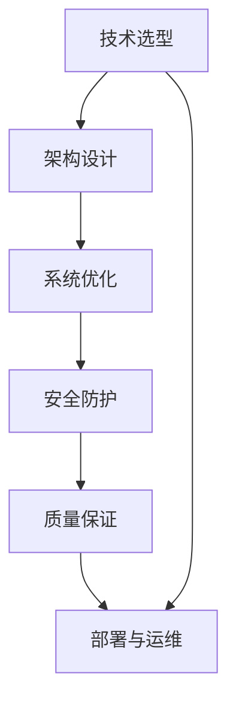

                 

# 从全栈开发到技术架构师的进阶

## 1. 背景介绍

### 1.1 问题由来

随着技术的发展，软件工程的规模和复杂度都在不断增加。对于一名普通的全栈开发工程师而言，已经很难再像以往那样对项目进行全面把控。与此同时，企业的技术栈也在不断变化，需要掌握的技术和工具也越来越多。因此，全栈开发工程师必须不断学习新的技术，才能保持竞争力。然而，这种不断的学习往往是碎片化的，难以形成一个系统的知识体系。

在这样的背景下，技术架构师的职责应运而生。技术架构师负责对企业的技术体系进行顶层设计，帮助企业构建一个稳定、可扩展、高性能的技术生态系统。技术架构师需要从多个维度考虑企业技术的发展，包括但不限于技术选型、架构设计、系统优化、安全防护等。

### 1.2 问题核心关键点

技术架构师之所以受到企业重视，是因为他们能够将全栈开发工程师的知识体系进行系统化、结构化，从更高的维度对技术体系进行把控。以下是技术架构师工作的核心关键点：

1. **技术选型**：根据企业的业务需求和技术特点，选择最适合的技术栈。这包括编程语言、框架、数据库、中间件等。

2. **架构设计**：设计一个可扩展、高性能、稳定的系统架构。这包括系统的模块划分、组件间通信、数据流动等。

3. **系统优化**：通过代码优化、性能测试、缓存优化等手段，提升系统的运行效率和稳定性。

4. **安全防护**：设计系统的网络安全、数据安全、应用安全等安全防护措施，确保系统的稳定运行。

5. **质量保证**：制定和执行代码审查、单元测试、功能测试等流程，确保代码质量和系统可靠性。

### 1.3 问题研究意义

技术架构师在企业中的重要性不言而喻。他们不仅能够提升企业的技术水平，还能提升企业的市场竞争力。在实际应用中，技术架构师可以帮助企业快速响应市场变化，提升产品的技术壁垒，降低技术风险。

同时，技术架构师能够从全局的角度考虑问题，帮助企业构建一个稳定、可扩展的技术生态系统。他们还能够帮助企业避免重复造轮子，提高资源利用率，降低技术债务。此外，技术架构师还能够指导全栈开发工程师进行技术提升，提升团队的开发效率和技术水平。

## 2. 核心概念与联系

### 2.1 核心概念概述

为了更好地理解技术架构师的工作，我们先介绍一些核心概念：

- **技术选型**：根据项目需求选择合适的技术栈，包括编程语言、框架、数据库、中间件等。
- **架构设计**：设计一个可扩展、高性能、稳定的系统架构。架构设计需要考虑模块划分、组件间通信、数据流动等。
- **系统优化**：通过代码优化、性能测试、缓存优化等手段，提升系统的运行效率和稳定性。
- **安全防护**：设计系统的网络安全、数据安全、应用安全等安全防护措施，确保系统的稳定运行。
- **质量保证**：制定和执行代码审查、单元测试、功能测试等流程，确保代码质量和系统可靠性。

这些核心概念之间存在密切的联系。技术选型是基础，架构设计是关键，系统优化和安全防护是保障，而质量保证则是持续改进的保证。这些概念共同构成了技术架构师的工作内容，帮助企业构建一个稳定、可扩展、高性能的技术生态系统。

### 2.2 核心概念原理和架构的 Mermaid 流程图



这个流程图展示了技术架构师工作的流程和关键环节。从技术选型到架构设计，再到系统优化、安全防护和质量保证，最终部署和运维，每个环节都至关重要。

## 3. 核心算法原理 & 具体操作步骤

### 3.1 算法原理概述

技术架构师的工作虽然不涉及具体的算法，但需要对系统架构和优化进行设计。以下是技术架构师工作的核心算法原理：

1. **模块划分**：将系统划分为多个模块，每个模块负责不同的功能，确保系统的可扩展性。

2. **组件间通信**：设计组件之间的通信方式，确保系统的高性能和可扩展性。

3. **数据流动**：设计数据的存储和流动方式，确保系统的稳定性和可扩展性。

4. **系统优化**：通过代码优化、性能测试、缓存优化等手段，提升系统的运行效率和稳定性。

5. **安全防护**：设计系统的网络安全、数据安全、应用安全等安全防护措施，确保系统的稳定运行。

### 3.2 算法步骤详解

以下是技术架构师工作的详细步骤：

1. **需求分析**：与产品经理、开发团队进行沟通，了解项目需求和业务场景。

2. **技术选型**：根据项目需求选择合适的技术栈，包括编程语言、框架、数据库、中间件等。

3. **架构设计**：设计一个可扩展、高性能、稳定的系统架构。架构设计需要考虑模块划分、组件间通信、数据流动等。

4. **系统优化**：通过代码优化、性能测试、缓存优化等手段，提升系统的运行效率和稳定性。

5. **安全防护**：设计系统的网络安全、数据安全、应用安全等安全防护措施，确保系统的稳定运行。

6. **质量保证**：制定和执行代码审查、单元测试、功能测试等流程，确保代码质量和系统可靠性。

7. **部署与运维**：将系统部署到生产环境，进行持续的监控和维护。

### 3.3 算法优缺点

技术架构师的工作虽然重要，但也存在一些缺点：

1. **沟通成本高**：需要与产品经理、开发团队进行频繁的沟通，耗费大量时间和精力。

2. **决策压力大**：技术选型和架构设计需要考虑到多方面的因素，决策压力较大。

3. **知识更新快**：需要不断学习和掌握新的技术，否则容易被淘汰。

4. **工作量较大**：需要从全局的角度考虑问题，工作量较大。

5. **需要综合素质**：不仅需要技术能力，还需要沟通、协调、管理等多方面的能力。

### 3.4 算法应用领域

技术架构师的工作不仅仅局限于企业内部，还可以应用到其他领域：

1. **互联网公司**：设计大规模、高性能的互联网系统架构，确保系统的稳定运行。

2. **传统企业**：帮助传统企业进行数字化转型，构建一个可扩展、高性能的技术生态系统。

3. **政府部门**：设计政府部门的核心业务系统，确保系统的高性能和安全性。

4. **医疗行业**：设计医疗系统的架构，确保系统的稳定性和可靠性。

5. **金融行业**：设计金融系统的架构，确保系统的安全性和高效性。

## 4. 数学模型和公式 & 详细讲解 & 举例说明

虽然技术架构师的工作不涉及具体的数学模型，但需要对系统架构和优化进行设计。以下是系统优化的一些数学模型和公式：

### 4.1 数学模型构建

在性能优化的过程中，我们需要使用数学模型来分析系统的瓶颈和优化方向。以下是性能优化的一些数学模型：

1. **响应时间模型**：计算系统响应的时间，分析瓶颈所在。

2. **负载均衡模型**：计算系统的负载均衡情况，分析优化方向。

3. **缓存命中率模型**：计算缓存的命中率，分析缓存策略的有效性。

4. **内存使用模型**：计算内存的使用情况，分析内存泄漏的来源。

### 4.2 公式推导过程

以下是响应时间模型的推导过程：

设系统响应时间为 $T$，包括处理时间 $t$、I/O操作时间 $i$ 和网络延迟 $n$。则有：

$$
T = t + i + n
$$

其中 $t$、$i$ 和 $n$ 都是随机变量，可以通过实验数据分析得到它们的期望值。通过计算这些期望值，可以得到系统的平均响应时间。

### 4.3 案例分析与讲解

假设一个电商系统的响应时间由以下因素决定：

1. 处理时间 $t$：订单处理时间。

2. I/O操作时间 $i$：数据库读写时间。

3. 网络延迟 $n$：网络传输时间。

我们可以通过实验数据分析得到 $t$、$i$ 和 $n$ 的期望值，进而计算系统的平均响应时间。

$$
\begin{aligned}
t &= 100ms \\
i &= 50ms \\
n &= 10ms \\
T &= t + i + n \\
&= 100ms + 50ms + 10ms \\
&= 160ms
\end{aligned}
$$

通过这个计算过程，我们可以分析系统的瓶颈所在，并采取相应的优化措施。

## 5. 项目实践：代码实例和详细解释说明

### 5.1 开发环境搭建

在进行技术架构设计的实践时，我们需要准备开发环境。以下是使用Python进行Django开发的开发环境配置流程：

1. 安装Anaconda：从官网下载并安装Anaconda，用于创建独立的Python环境。

2. 创建并激活虚拟环境：
```bash
conda create -n django-env python=3.8 
conda activate django-env
```

3. 安装Django：
```bash
pip install django
```

4. 安装各类工具包：
```bash
pip install numpy pandas scikit-learn matplotlib tqdm jupyter notebook ipython
```

完成上述步骤后，即可在`django-env`环境中开始技术架构设计的实践。

### 5.2 源代码详细实现

我们以一个简单的电商网站为例，给出使用Django进行技术架构设计的PyTorch代码实现。

首先，定义Django项目：

```python
from django.urls import path
from . import views

urlpatterns = [
    path('user/', views.UserView.as_view(), name='user'),
    path('product/', views.ProductView.as_view(), name='product'),
    path('cart/', views.CartView.as_view(), name='cart'),
    path('order/', views.OrderView.as_view(), name='order'),
]
```

然后，定义视图函数：

```python
from django.shortcuts import render
from .models import User, Product, Cart, Order

class UserView(View):
    def get(self, request):
        users = User.objects.all()
        return render(request, 'user.html', {'users': users})

class ProductView(View):
    def get(self, request):
        products = Product.objects.all()
        return render(request, 'product.html', {'products': products})

class CartView(View):
    def get(self, request):
        cart = Cart.objects.get(cart_id=request.session['cart_id'])
        return render(request, 'cart.html', {'cart': cart})

class OrderView(View):
    def get(self, request):
        orders = Order.objects.all()
        return render(request, 'order.html', {'orders': orders})
```

接着，定义模型：

```python
from django.db import models

class User(models.Model):
    name = models.CharField(max_length=50)
    email = models.EmailField()
    phone = models.CharField(max_length=20)
    
class Product(models.Model):
    name = models.CharField(max_length=50)
    price = models.DecimalField(max_digits=10, decimal_places=2)
    description = models.TextField()
    
class Cart(models.Model):
    user = models.ForeignKey(User, on_delete=models.CASCADE)
    cart_id = models.CharField(max_length=50, unique=True)
    items = models.ManyToManyField(Product, through='CartItem')
    
class CartItem(models.Model):
    cart = models.ForeignKey(Cart, on_delete=models.CASCADE)
    product = models.ForeignKey(Product, on_delete=models.CASCADE)
    quantity = models.IntegerField()
    
class Order(models.Model):
    user = models.ForeignKey(User, on_delete=models.CASCADE)
    order_id = models.CharField(max_length=50, unique=True)
    items = models.ManyToManyField(Product, through='OrderItem')
    
class OrderItem(models.Model):
    order = models.ForeignKey(Order, on_delete=models.CASCADE)
    product = models.ForeignKey(Product, on_delete=models.CASCADE)
    quantity = models.IntegerField()
```

最后，启动Django服务器：

```bash
python manage.py runserver
```

### 5.3 代码解读与分析

让我们再详细解读一下关键代码的实现细节：

**Django项目定义**：
- `urlpatterns`定义了项目的URL路由。

**视图函数**：
- `UserView`、`ProductView`、`CartView`和`OrderView`分别对应电商网站的用户、商品、购物车和订单模块。
- 每个视图函数通过`render`方法将数据渲染为HTML页面，并返回给客户端。

**模型定义**：
- `User`、`Product`、`Cart`、`CartItem`、`Order`和`OrderItem`分别对应用户、商品、购物车、购物车商品、订单和订单商品。

**启动Django服务器**：
- 通过`python manage.py runserver`命令启动Django服务器，可以访问`http://127.0.0.1:8000`进行调试。

可以看到，Django使得技术架构设计的代码实现变得简洁高效。开发者可以将更多精力放在架构设计、系统优化等高层逻辑上，而不必过多关注底层的实现细节。

当然，工业级的系统实现还需考虑更多因素，如多用户并发、数据缓存、任务队列等。但核心的架构设计基本与此类似。

## 6. 实际应用场景

### 6.1 电商系统

技术架构师可以在电商系统中设计一个高性能、可扩展的系统架构，确保系统的稳定运行。具体而言，可以采用以下技术：

1. **数据库分片**：将数据库划分为多个分片，避免单点故障，提升系统的可扩展性。

2. **负载均衡**：使用Nginx等负载均衡器，分散请求，提升系统的吞吐量。

3. **缓存策略**：使用Redis等缓存机制，减少数据库压力，提升系统的响应速度。

4. **CDN加速**：使用CDN加速静态资源的加载，减少网络延迟，提升用户体验。

### 6.2 社交网络

技术架构师可以在社交网络中设计一个高性能、可扩展的系统架构，确保系统的稳定运行。具体而言，可以采用以下技术：

1. **消息队列**：使用RabbitMQ等消息队列，异步处理请求，提升系统的并发能力。

2. **分布式存储**：使用Hadoop等分布式存储，存储大规模数据，提升系统的可扩展性。

3. **高可用性设计**：使用主从复制、故障转移等高可用性设计，避免单点故障，提升系统的可靠性。

4. **实时计算**：使用Spark等实时计算框架，处理实时数据，提升系统的响应速度。

### 6.3 金融系统

技术架构师可以在金融系统中设计一个高性能、可扩展的系统架构，确保系统的安全性和稳定性。具体而言，可以采用以下技术：

1. **分布式事务**：使用TCC等分布式事务处理方式，确保数据的原子性、一致性、隔离性和持久性。

2. **数据加密**：使用AES等数据加密技术，保护数据的安全性。

3. **防火墙**：使用防火墙等网络安全设备，防止网络攻击，保护系统的安全。

4. **多层次安全防护**：使用入侵检测、DDoS防护等技术，提升系统的安全防护能力。

### 6.4 未来应用展望

随着技术架构师的工作内容和职责范围不断扩展，技术架构师的重要性将越来越凸显。未来技术架构师的工作将涵盖更多技术领域，如云计算、大数据、人工智能等。

### 6.5 技术栈选择

技术架构师在技术选型时，需要综合考虑技术栈的成熟度、稳定性、扩展性、可维护性等因素。以下是一些常用的技术栈：

1. **Web技术栈**：
   - 前端：React、Vue、Angular
   - 后端：Django、Flask、Spring Boot
   - 数据库：MySQL、PostgreSQL、MongoDB

2. **大数据技术栈**：
   - 分布式存储：Hadoop、Hive、Spark
   - 数据可视化：ECharts、Tableau、Power BI

3. **人工智能技术栈**：
   - 深度学习框架：TensorFlow、PyTorch、Keras
   - 数据处理：Pandas、NumPy、Scikit-Learn
   - 模型部署：TensorFlow Serving、Kubeflow

4. **云计算技术栈**：
   - 云平台：AWS、Azure、阿里云
   - 容器化：Docker、Kubernetes
   - 云服务：Amazon S3、AWS Lambda、AWS Kinesis

## 7. 工具和资源推荐

### 7.1 学习资源推荐

为了帮助技术架构师全面掌握技术栈，以下是一些优质的学习资源：

1. **《深入理解Django》**：一本深入浅出介绍Django技术的书籍，适合初学者和进阶开发者阅读。

2. **《Django实战》**：一本实战性较强的书籍，通过具体项目案例讲解Django开发技巧。

3. **《深入理解Java架构》**：一本全面介绍Java架构技术的书籍，适合Java开发者阅读。

4. **《Spring Boot实战》**：一本实战性较强的书籍，通过具体项目案例讲解Spring Boot开发技巧。

5. **《微服务架构实战》**：一本全面介绍微服务架构技术的书籍，适合微服务开发者阅读。

6. **《云计算实战》**：一本全面介绍云计算技术的书籍，适合云计算开发者阅读。

7. **《大数据技术实战》**：一本全面介绍大数据技术的书籍，适合大数据开发者阅读。

通过这些资源的学习，相信你一定能够快速掌握技术架构师的工作内容和职责范围。

### 7.2 开发工具推荐

技术架构师的工作离不开优秀的工具支持。以下是几款用于技术架构师开发的常用工具：

1. **Visual Studio Code**：一款轻量级、功能强大的IDE，支持多种编程语言。

2. **Git**：一款版本控制系统，支持分布式协作开发。

3. **Docker**：一款容器化平台，支持跨平台部署和运维。

4. **Jenkins**：一款持续集成和持续部署工具，支持自动化测试和部署。

5. **Ansible**：一款自动化运维工具，支持批量配置和自动化操作。

6. **Kubernetes**：一款容器编排工具，支持大规模部署和弹性伸缩。

7. **Prometheus**：一款开源监控系统，支持分布式应用监控。

合理利用这些工具，可以显著提升技术架构师的工作效率，加快技术架构设计的迭代速度。

### 7.3 相关论文推荐

技术架构师的工作不仅需要掌握技术，还需要关注最新的研究进展。以下是几篇奠基性的相关论文，推荐阅读：

1. **《分布式系统设计》**：一本系统介绍分布式系统设计的书籍，适合技术架构师阅读。

2. **《微服务架构模式》**：一本介绍微服务架构模式和最佳实践的书籍，适合微服务开发者阅读。

3. **《云计算基础》**：一本全面介绍云计算技术的书籍，适合云计算开发者阅读。

4. **《大数据技术》**：一本全面介绍大数据技术的书籍，适合大数据开发者阅读。

这些论文代表了大规模系统设计、微服务架构、云计算和大数据技术的最新研究进展。通过学习这些前沿成果，可以帮助技术架构师更好地把握技术趋势，提升技术水平。

## 8. 总结：未来发展趋势与挑战

### 8.1 总结

本文对技术架构师的工作进行了全面系统的介绍。首先阐述了技术架构师在企业中的重要性，明确了技术架构师的工作内容和职责范围。其次，从原理到实践，详细讲解了技术架构师的工作流程和关键技术，给出了技术架构设计实践的完整代码实例。同时，本文还广泛探讨了技术架构师在电商、社交网络、金融等多个行业领域的应用前景，展示了技术架构师的巨大潜力。

通过本文的系统梳理，可以看到，技术架构师的工作不仅需要掌握技术，还需要从全局的角度考虑问题，帮助企业构建一个稳定、可扩展、高性能的技术生态系统。技术架构师的工作虽然复杂，但也充满挑战和机遇，具有广阔的发展前景。

### 8.2 未来发展趋势

展望未来，技术架构师的工作将呈现以下几个发展趋势：

1. **技术栈多样化**：技术架构师需要掌握更多技术栈，涵盖云计算、大数据、人工智能等领域。

2. **系统设计复杂化**：系统规模和复杂度不断增加，技术架构师需要设计更复杂、更可扩展的系统架构。

3. **安全防护精细化**：安全防护要求不断提高，技术架构师需要设计更精细、更全面的安全防护措施。

4. **性能优化极致化**：性能优化要求不断提高，技术架构师需要设计更高效、更优化的系统架构。

5. **系统管理智能化**：系统管理要求不断提高，技术架构师需要设计更智能、更自动化的系统管理方案。

以上趋势凸显了技术架构师的工作内容和职责范围。这些方向的探索发展，必将进一步提升技术架构师的技术水平和实践能力，为构建稳定、可扩展、高性能的技术生态系统铺平道路。

### 8.3 面临的挑战

尽管技术架构师的工作内容和职责范围不断扩展，但在迈向更加智能化、普适化应用的过程中，他们仍面临着诸多挑战：

1. **技术更新快**：需要不断学习新的技术，否则容易被淘汰。

2. **决策压力大**：技术选型和架构设计需要考虑到多方面的因素，决策压力较大。

3. **知识深度广**：需要掌握多个技术栈，难度较大。

4. **工作量较大**：需要从全局的角度考虑问题，工作量较大。

5. **沟通协调复杂**：需要与产品经理、开发团队进行频繁的沟通，耗费大量时间和精力。

6. **安全防护压力大**：系统安全防护要求不断提高，压力较大。

7. **性能优化困难**：系统性能优化难度较大，需要综合考虑多个因素。

### 8.4 研究展望

面对技术架构师面临的这些挑战，未来的研究需要在以下几个方面寻求新的突破：

1. **技术选型优化**：通过算法优化和模型训练，帮助技术架构师进行更精准的技术选型。

2. **架构设计自动化**：通过自动化工具，帮助技术架构师进行更高效的架构设计。

3. **系统优化自动化**：通过自动化工具，帮助技术架构师进行更高效的系统优化。

4. **安全防护自动化**：通过自动化工具，帮助技术架构师进行更高效的安全防护。

5. **系统管理智能化**：通过智能运维工具，帮助技术架构师进行更智能的系统管理。

这些研究方向的探索，必将引领技术架构师的工作内容和职责范围走向更高的台阶，为构建稳定、可扩展、高性能的技术生态系统提供新的技术支持。

## 9. 附录：常见问题与解答

**Q1：技术架构师的工作内容有哪些？**

A: 技术架构师的工作内容包括技术选型、架构设计、系统优化、安全防护、质量保证等多个方面。需要从全局的角度考虑问题，帮助企业构建一个稳定、可扩展、高性能的技术生态系统。

**Q2：如何选择合适的技术栈？**

A: 选择技术栈时，需要综合考虑业务需求、技术成熟度、可扩展性、可维护性等多个因素。可以通过调研、试验等方式，找到最适合的技术栈。

**Q3：技术架构设计的难点是什么？**

A: 技术架构设计的难点在于需要考虑多方面的因素，如性能、安全、可扩展性、可维护性等。需要进行全面的需求分析和技术调研，才能设计出合适的架构方案。

**Q4：如何优化系统的响应时间？**

A: 优化系统的响应时间需要综合考虑处理时间、I/O操作时间和网络延迟等因素。可以通过数据库分片、负载均衡、缓存策略等手段，提升系统的响应速度。

**Q5：技术架构师需要掌握哪些技术？**

A: 技术架构师需要掌握多种技术，如Web开发、数据库管理、云计算、大数据、人工智能等。需要不断学习新技术，保持技术栈的更新。

---

作者：禅与计算机程序设计艺术 / Zen and the Art of Computer Programming

