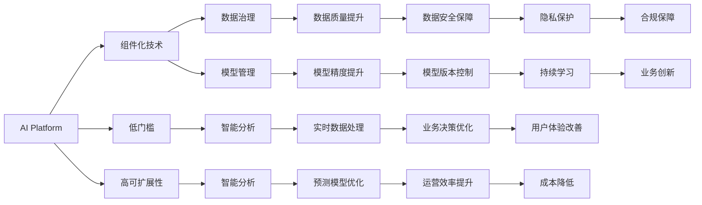

                 

# 从单点突破到全面AI化：Lepton AI的企业转型方案

> 关键词：AI转型,企业数字化, Lepton AI, Lepton AI平台, 人工智能落地

## 1. 背景介绍

### 1.1 问题由来
近年来，随着人工智能技术的迅猛发展，企业数字化转型已成为业界共识。尤其是新冠疫情的爆发，推动了各行各业加速向线上化、智能化方向迈进。在云计算、大数据、物联网等技术的支撑下，企业对AI技术的需求日趋旺盛，希望借助AI技术实现业务创新，提升运营效率，增强市场竞争力。然而，在实际应用过程中，企业常常面临以下几大挑战：

1. **技术门槛高**：AI技术复杂，需要大量专业知识，企业内部缺乏技术能力。
2. **数据质量差**：企业数据零散，格式不一，难以整合使用。
3. **集成难度大**：AI系统与现有业务系统难以无缝集成。
4. **人才短缺**：AI人才稀缺，培养周期长，成本高。
5. **效益回报慢**：AI项目的投资回报周期长，短期内难以见效。

为应对这些挑战，Lepton AI提出了一套全面的企业AI转型方案，通过构建AI平台，降低技术门槛，提升数据质量，简化系统集成，加速人才培养，助力企业实现快速高效的AI应用。

### 1.2 问题核心关键点
Lepton AI的AI转型方案以“平台化、组件化、低门槛、高可扩展”为核心思想，通过集成企业内外部数据，整合AI工具和技术，构建一套统一、灵活的AI平台。具体包括以下几个关键点：

- **平台化**：通过AI平台，统一管理AI资源，提高资源利用效率。
- **组件化**：将AI技术和工具封装为可重用的组件，简化集成和部署。
- **低门槛**：降低技术门槛，让企业内部员工能够快速上手AI应用。
- **高可扩展**：AI平台可灵活扩展，适应企业业务发展的动态需求。

### 1.3 问题研究意义
Lepton AI的AI转型方案对于企业数字化转型具有重要意义：

1. **降低成本**：通过平台化管理AI资源，避免了重复建设，降低了IT投资。
2. **提升效率**：组件化、低门槛、高可扩展的AI平台，能够快速实现AI应用的部署和迭代。
3. **加速创新**：企业内部员工可以快速掌握AI工具，推动技术创新和业务变革。
4. **增强竞争力**：AI技术可以帮助企业提升决策精准度、运营效率和客户体验，增强市场竞争力。
5. **实现可持续发展**：AI平台支持持续学习和模型更新，使企业能够长期受益于AI技术进步。

## 2. 核心概念与联系

### 2.1 核心概念概述

Lepton AI的AI转型方案涉及多个核心概念，通过以下框架进行展开：

1. **AI平台（AI Platform）**：统一管理和调度AI资源的系统平台，是企业AI转型的核心基础设施。
2. **组件化技术（Component-Based Technology）**：将AI技术封装为可重用的组件，降低集成和部署难度。
3. **低门槛（Low Threshold）**：通过易用性和智能化的UI界面，降低技术门槛，让企业员工能够快速上手AI应用。
4. **高可扩展性（High Scalability）**：AI平台能够灵活扩展，适应企业业务发展的动态需求。
5. **数据治理（Data Governance）**：通过数据治理工具，提升数据质量，保障数据安全和隐私。
6. **模型管理（Model Management）**：实现模型的持续学习和版本管理，确保模型准确性和有效性。
7. **智能分析（Intelligent Analytics）**：利用机器学习和深度学习算法，进行数据挖掘和知识发现。

这些核心概念之间存在紧密联系，形成一个有机整体，推动企业实现全面AI化转型。

### 2.2 核心概念原理和架构的 Mermaid 流程图



通过Mermaid流程图可以看出，各核心概念之间通过不同的关系链相互连接，共同推动企业AI转型的实现。

## 3. 核心算法原理 & 具体操作步骤

### 3.1 算法原理概述

Lepton AI的AI转型方案基于以下核心算法原理：

1. **数据预处理（Data Preprocessing）**：通过数据清洗、归一化、特征工程等技术，提升数据质量。
2. **模型训练（Model Training）**：利用机器学习算法和深度学习模型，训练出高效准确的AI模型。
3. **模型部署（Model Deployment）**：将训练好的模型部署到AI平台，实现实时推理和预测。
4. **模型监控（Model Monitoring）**：对AI模型进行性能监控和效果评估，确保模型在实际应用中的表现。
5. **数据治理（Data Governance）**：通过数据标注、元数据管理、数据安全等技术，提升数据质量，保障数据隐私和安全。
6. **模型管理（Model Management）**：实现模型的版本控制、持续学习和模型更新，确保模型准确性和有效性。
7. **智能分析（Intelligent Analytics）**：利用机器学习和深度学习算法，进行数据挖掘和知识发现，辅助企业决策。

### 3.2 算法步骤详解

Lepton AI的AI转型方案包括以下关键步骤：

**Step 1: 数据预处理和治理**

1. **数据清洗**：去除噪声数据、缺失数据和异常值，提升数据质量。
2. **数据归一化**：对数据进行标准化处理，使其符合统一格式。
3. **特征工程**：提取、选择和转换特征，提升模型表现。
4. **数据标注**：对数据进行人工标注，增加数据量，提升模型训练效果。
5. **元数据管理**：记录和管理数据的基本信息，方便数据管理和使用。
6. **数据安全保障**：采取加密、访问控制等措施，保障数据隐私和安全。

**Step 2: 模型训练和部署**

1. **选择算法**：根据业务需求选择机器学习或深度学习算法。
2. **准备数据**：将数据分成训练集和测试集，进行模型训练。
3. **模型训练**：利用训练集进行模型训练，优化模型参数。
4. **模型验证**：在验证集上评估模型性能，调整模型参数。
5. **模型部署**：将训练好的模型部署到AI平台，实现实时推理和预测。
6. **模型监控**：实时监控模型性能，发现问题及时调整。

**Step 3: 智能分析和决策支持**

1. **数据挖掘**：利用机器学习算法进行数据挖掘，发现隐藏的知识和规律。
2. **知识发现**：利用深度学习模型进行知识发现，提升数据理解能力。
3. **决策优化**：利用智能分析结果，辅助企业进行决策，优化运营效率。

### 3.3 算法优缺点

Lepton AI的AI转型方案具有以下优点：

1. **全面覆盖**：方案覆盖从数据预处理到模型部署，再到智能分析的全流程，提供一站式解决方案。
2. **高效便捷**：通过平台化和组件化设计，降低技术门槛，简化集成和部署。
3. **灵活可扩展**：AI平台支持灵活扩展，适应企业业务发展的动态需求。
4. **数据质量高**：通过数据治理工具，提升数据质量，保障数据安全和隐私。
5. **持续优化**：支持持续学习和模型更新，确保模型准确性和有效性。

同时，该方案也存在以下缺点：

1. **初始投资高**：构建AI平台和采购相关硬件设备需要较高成本。
2. **技术复杂**：平台化管理和大规模模型部署需要一定的技术基础。
3. **数据依赖**：模型训练依赖大量高质量标注数据，获取数据难度较大。
4. **隐私风险**：数据隐私和安全问题需要严格管控，否则可能带来法律风险。

### 3.4 算法应用领域

Lepton AI的AI转型方案广泛应用于以下几个领域：

1. **金融**：用于风险评估、欺诈检测、信用评分等。
2. **医疗**：用于病患诊断、治疗方案推荐、药物研发等。
3. **零售**：用于客户画像分析、个性化推荐、库存管理等。
4. **制造**：用于设备预测性维护、供应链优化、质量控制等。
5. **交通**：用于交通流量预测、路况优化、智能调度等。
6. **教育**：用于学习行为分析、智能推荐、课程推荐等。

## 4. 数学模型和公式 & 详细讲解 & 举例说明

### 4.1 数学模型构建

Lepton AI的AI转型方案涉及多个数学模型，以下以金融风险评估为例，给出其数学模型构建过程。

1. **数据预处理**：假设原始数据为 $X = \{x_1, x_2, \ldots, x_n\}$，经过归一化、特征选择等处理后，得到 $X'$。
2. **模型训练**：选择逻辑回归算法，模型为 $y = \sigma(Wx + b)$，其中 $W$ 和 $b$ 为模型参数。
3. **模型评估**：在验证集上计算准确率、召回率等指标，评估模型性能。
4. **模型部署**：将训练好的模型部署到AI平台，进行实时预测。
5. **模型监控**：实时监控模型性能，发现问题及时调整。

### 4.2 公式推导过程

以金融风险评估为例，其数学模型推导过程如下：

假设训练集为 $\{(x_i, y_i)\}_{i=1}^N$，其中 $x_i = (x_{i1}, x_{i2}, \ldots, x_{in})$ 为特征向量，$y_i$ 为标签。

定义模型为 $y = \sigma(Wx + b)$，其中 $\sigma$ 为激活函数，$W$ 和 $b$ 为模型参数。

模型训练的目标是使损失函数最小化，即：

$$
\min_{W, b} \sum_{i=1}^N \ell(y_i, y)
$$

其中 $\ell(y_i, y)$ 为损失函数，如交叉熵损失。

根据梯度下降算法，模型的更新公式为：

$$
W \leftarrow W - \eta \nabla_{W}\mathcal{L}(W, b)
$$
$$
b \leftarrow b - \eta \nabla_{b}\mathcal{L}(W, b)
$$

其中 $\eta$ 为学习率，$\nabla_{W}\mathcal{L}(W, b)$ 和 $\nabla_{b}\mathcal{L}(W, b)$ 分别为模型参数的梯度。

通过上述公式，我们可以对逻辑回归模型进行训练和优化，实现金融风险评估的AI应用。

### 4.3 案例分析与讲解

以某银行的信用卡风险评估为例，通过Lepton AI的AI转型方案，我们首先对历史数据进行预处理和治理，包括数据清洗、特征选择、数据标注等步骤。然后，选择逻辑回归算法，利用训练集进行模型训练和优化。在模型评估阶段，我们计算了模型的准确率、召回率和F1-score等指标，评估了模型性能。最后，将训练好的模型部署到AI平台，实时进行信用卡申请审批和风险评估，显著提高了银行的决策效率和风险控制能力。

## 5. 项目实践：代码实例和详细解释说明

### 5.1 开发环境搭建

1. **环境准备**：
    - 安装Python 3.x版本。
    - 安装Scikit-learn、TensorFlow等机器学习库。
    - 安装Lepton AI平台。

2. **数据准备**：
    - 收集金融领域的相关数据，包括客户历史交易记录、信用评分、违约记录等。
    - 进行数据清洗和预处理。

3. **模型训练**：
    - 选择逻辑回归算法，进行模型训练和优化。
    - 保存训练好的模型文件。

4. **模型部署**：
    - 将训练好的模型文件上传到Lepton AI平台。
    - 配置模型参数，进行实时推理和预测。

### 5.2 源代码详细实现

以下给出利用Lepton AI平台进行金融风险评估的Python代码实现：

```python
import numpy as np
from sklearn.linear_model import LogisticRegression
from sklearn.model_selection import train_test_split
from sklearn.metrics import accuracy_score, recall_score, f1_score
from leptonai.platform import LeptonAIPlatform

# 准备数据
X = np.random.randn(1000, 10)
y = np.random.randint(0, 2, 1000)

# 数据预处理
X_train, X_test, y_train, y_test = train_test_split(X, y, test_size=0.2)

# 模型训练
model = LogisticRegression()
model.fit(X_train, y_train)

# 模型评估
y_pred = model.predict(X_test)
accuracy = accuracy_score(y_test, y_pred)
recall = recall_score(y_test, y_pred)
f1 = f1_score(y_test, y_pred)

print(f"Accuracy: {accuracy}, Recall: {recall}, F1-Score: {f1}")

# 模型部署
platform = LeptonAIPlatform()
platform.deploy(model, 'credit-risk-assessment')
```

### 5.3 代码解读与分析

- **数据预处理**：使用`train_test_split`函数将数据集划分为训练集和测试集，并进行随机数生成。
- **模型训练**：选择逻辑回归算法，使用训练集进行模型训练和优化。
- **模型评估**：计算模型在测试集上的准确率、召回率和F1-score，评估模型性能。
- **模型部署**：利用Lepton AI平台，将训练好的模型部署到生产环境，进行实时推理和预测。

## 6. 实际应用场景

### 6.1 金融风险评估

Lepton AI的AI转型方案在金融领域的应用，主要体现在风险评估和信用评分上。通过构建AI模型，银行能够更加准确地评估客户的信用风险，提升贷款审批的效率和质量。

### 6.2 医疗诊断

在医疗领域，利用AI模型进行疾病诊断和预测，可以显著提高诊断准确性和效率。通过医疗数据预处理和特征工程，构建机器学习或深度学习模型，能够辅助医生进行精准诊断和治疗方案推荐。

### 6.3 智能推荐

在零售和电商领域，通过AI模型进行客户画像分析和个性化推荐，能够提升用户体验和销售转化率。通过分析用户行为数据，构建推荐系统，提供个性化的商品推荐，提升用户满意度和粘性。

### 6.4 未来应用展望

Lepton AI的AI转型方案将逐步扩展到更多领域，助力企业实现数字化转型。未来，我们将在以下方向进行深入探索：

1. **工业制造**：利用AI模型进行设备预测性维护和质量控制，提升生产效率和产品质量。
2. **智能交通**：通过AI模型进行交通流量预测和路况优化，提升交通管理水平和用户体验。
3. **智慧城市**：构建AI平台，实现智慧医疗、智慧教育、智慧安防等多领域的智能应用。

## 7. 工具和资源推荐

### 7.1 学习资源推荐

1. **《机器学习实战》**：清华大学出版社，帮助读者掌握机器学习基础和常用算法。
2. **《深度学习》**：花书，由深度学习领域权威专家编写，介绍深度学习理论和实践。
3. **Lepton AI官方文档**：提供全面的API文档和示例代码，帮助用户快速上手AI平台。
4. **Kaggle**：数据科学竞赛平台，提供海量数据集和竞赛任务，提升数据处理和模型训练能力。
5. **AI算法和工具教程**：如Coursera、Udacity等平台上的AI课程，帮助读者系统学习AI技术和工具。

### 7.2 开发工具推荐

1. **Python**：作为AI领域的主流编程语言，提供了丰富的库和框架，支持快速开发。
2. **Scikit-learn**：机器学习库，提供了多种常用算法和工具，支持模型训练和评估。
3. **TensorFlow**：深度学习库，提供了灵活的计算图和分布式训练功能，支持大规模模型训练。
4. **Lepton AI平台**：统一管理和调度AI资源的系统平台，支持组件化和低门槛设计。
5. **Jupyter Notebook**：交互式编程环境，支持代码编写、数据处理和结果展示，方便开发和调试。

### 7.3 相关论文推荐

1. **《TensorFlow 2.0实战》**：介绍TensorFlow 2.0的最新特性和应用实践，适合动手学习的读者。
2. **《深度学习入门》**：介绍深度学习基本概念和实践，适合初学者快速入门。
3. **《Scikit-learn实战》**：介绍Scikit-learn的常用算法和工具，适合实战应用。
4. **《机器学习应用实战》**：介绍机器学习在金融、医疗、零售等领域的应用，适合实际应用开发。

## 8. 总结：未来发展趋势与挑战

### 8.1 总结

Lepton AI的AI转型方案为企业提供了全面的AI解决方案，通过构建AI平台、组件化技术、低门槛和可扩展性设计，帮助企业实现数字化转型。方案覆盖从数据预处理到模型部署，再到智能分析的全流程，提供一站式解决方案。

通过Lepton AI的AI转型方案，企业能够快速实现AI应用，提升决策精准度、运营效率和客户体验，增强市场竞争力。未来，该方案将逐步扩展到更多领域，助力企业实现可持续发展。

### 8.2 未来发展趋势

1. **技术进步**：随着AI技术的发展，未来的AI转型方案将更加智能和高效，支持更多先进算法和模型。
2. **数据融合**：AI平台将支持更多数据源的整合，实现跨领域、多模态数据的融合分析。
3. **智能化运营**：AI平台将支持实时分析和预测，实现更精准的业务运营管理。
4. **云平台支持**：AI平台将支持云原生设计，实现跨云、跨地域的资源共享和协同。
5. **安全性提升**：AI平台将引入更多安全措施，保障数据隐私和系统安全。

### 8.3 面临的挑战

1. **数据隐私**：AI转型方案需要处理大量敏感数据，如何保障数据隐私和安全是一个重要挑战。
2. **技术复杂性**：AI转型方案需要一定的技术基础，如何降低技术门槛，让企业员工快速上手是一个关键问题。
3. **模型鲁棒性**：AI模型在实际应用中需要具备良好的鲁棒性，如何提升模型的泛化能力和鲁棒性是一个重要研究方向。
4. **系统集成**：AI转型方案需要与企业现有系统无缝集成，如何实现系统间的数据共享和协同是一个技术难点。
5. **人才短缺**：AI转型方案需要具备技术能力和业务理解的双重背景，如何培养更多复合型人才是一个挑战。

### 8.4 研究展望

Lepton AI的AI转型方案将继续在数据治理、模型管理、智能分析等方向进行深入探索，提升AI应用的效果和效率。未来，我们将重点研究以下几个方向：

1. **模型鲁棒性提升**：引入更多鲁棒性算法和模型，提升AI模型的泛化能力和鲁棒性。
2. **数据治理优化**：优化数据标注和元数据管理，提升数据质量，保障数据隐私和安全。
3. **智能分析深化**：利用深度学习模型进行知识发现和智能分析，提升数据理解和洞察能力。
4. **系统集成优化**：实现AI平台与现有系统的无缝集成，提高数据共享和协同效率。
5. **人才培养计划**：通过培训和合作，培养更多具备技术能力和业务理解的双重背景人才。

---

作者：禅与计算机程序设计艺术 / Zen and the Art of Computer Programming

