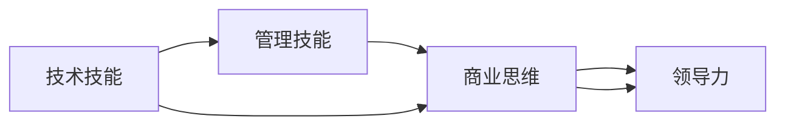

                 

# 从员工到科技独角兽创始人的蜕变

### 背景介绍

在当今瞬息万变的科技行业中，每一位从业者都可能面临从普通员工到科技创业公司创始人的身份转变。这一过程不仅涉及技术技能的提升，更需要具备管理、商业和领导力等多方面的综合素质。本文将深入探讨从员工到创始人转变的关键步骤、必备技能和潜在挑战，为有志于创新和创业的科技工作者提供宝贵的经验和建议。

### 核心概念与联系

为了更好地理解从员工到创始人转变的复杂过程，我们将首先定义并解释一些核心概念，并通过一个综合的Mermaid流程图来展示它们之间的联系。

**核心概念定义：**

- **技术技能（Technical Skills）**：指编程、算法、系统架构等技术领域的专业知识。
- **管理技能（Management Skills）**：包括团队管理、项目规划、资源分配等。
- **商业思维（Business Acumen）**：涉及市场分析、财务规划、销售策略等。
- **领导力（Leadership）**：包括愿景设定、决策制定、团队激励等。

**联系图示：**



这一流程图展示了技术技能、管理技能、商业思维和领导力之间的相互联系和支持关系。技术技能是创业的基础，但随着创业进程的推进，其他技能也变得愈加重要。

### 核心算法原理 & 具体操作步骤

#### 3.1 算法原理概述

从一个员工到创始人的转变，并非一个固定的算法流程，而是一个逐步累积、螺旋上升的过程。它需要不断学习和适应新的环境和挑战。尽管如此，以下步骤可以作为一般性的指导框架：

1. **目标设定（Goal Setting）**：明确创业目标和愿景，制定详细的商业计划。
2. **技术积累（Technical Accumulation）**：在特定技术领域积累深入知识，并具备解决复杂问题的能力。
3. **团队组建（Team Building）**：招募并培养一支具备专业技能和协同工作的团队。
4. **市场验证（Market Validation）**：通过最小可行性产品（MVP）验证市场需求和可行性。
5. **商业模式探索（Business Model Exploration）**：不断探索和优化商业模式，以满足市场需求并实现盈利。
6. **扩展和优化（Scaling & Optimization）**：随着公司的发展，持续优化产品、运营和商业模式，以实现长期增长。

#### 3.2 算法步骤详解

**Step 1: 目标设定（Goal Setting）**

- **明确目标**：清晰界定创业目标，如改变一个行业、解决一个社会问题等。
- **制定计划**：创建详细的商业计划书，包括市场分析、产品规划、财务预测等。
- **获取反馈**：与潜在的投资者、客户和顾问进行沟通，获取初期反馈和建议。

**Step 2: 技术积累（Technical Accumulation）**

- **专业深造**：持续学习和提升在技术领域的专业知识，包括编程语言、算法框架、系统架构等。
- **项目实践**：参与实际项目，积累解决实际问题的经验，并逐步构建个人技术品牌。
- **知识共享**：通过撰写技术博客、开源项目等方式，分享技术见解，扩大影响力。

**Step 3: 团队组建（Team Building）**

- **招募核心团队**：根据项目需求，招募具有不同背景和技能的专业人才，如技术、市场、销售等。
- **培养团队文化**：建立积极向上的团队文化，促进团队成员之间的沟通与协作。
- **激励和认可**：通过合理的激励机制，保持团队成员的积极性和创造力。

**Step 4: 市场验证（Market Validation）**

- **MVP开发**：构建最小可行性产品，快速测试市场反应和用户需求。
- **用户反馈**：收集用户反馈，持续优化产品功能和用户体验。
- **迭代改进**：根据反馈进行产品迭代，逐步提升产品的市场接受度和竞争力。

**Step 5: 商业模式探索（Business Model Exploration）**

- **探索多渠道**：尝试不同的商业模式，如订阅制、广告收入、增值服务等。
- **分析成本与收益**：精细化分析成本结构，确保商业模式具有可持续性。
- **优化用户体验**：通过数据分析，持续提升用户满意度和忠诚度。

**Step 6: 扩展和优化（Scaling & Optimization）**

- **规模扩展**：逐步增加资源投入，扩大市场覆盖和用户基数。
- **资源整合**：优化资源配置，提高运营效率和盈利能力。
- **持续创新**：不断引入新技术和新模式，保持产品和服务的前沿性。

#### 3.3 算法优缺点

**优点：**

- **循序渐进**：步骤明确，逐步积累和提升，降低了直接从零开始创业的风险。
- **灵活调整**：根据市场反馈和自身成长进行调整，适应不断变化的市场环境。
- **资源利用**：通过逐步构建团队和技术积累，有效利用资源，避免一次性大量投入。

**缺点：**

- **时间长**：需要经历多个阶段，整个过程可能耗费较长时间。
- **不确定性**：每个阶段都有不确定性，需要具备较强的抗风险能力。
- **资源限制**：早期可能面临资源不足的问题，需要不断优化资源配置。

#### 3.4 算法应用领域

这一算法框架适用于各种科技创业场景，包括但不限于以下领域：

- **初创科技公司**：从0到1，逐步构建技术积累和商业模型。
- **技术创新项目**：在现有技术基础上，探索新的应用场景和商业模式。
- **行业数字化转型**：帮助传统行业转型升级，引入新技术和新模式。

### 数学模型和公式 & 详细讲解

#### 4.1 数学模型构建

我们可以将这一过程抽象为一个数学模型，其中每个步骤对应模型的一个变量或状态，通过数学公式来描述各个变量之间的相互作用和演进。

**模型假设**：

- $G$：创业目标和愿景
- $T$：技术技能
- $M$：管理技能
- $B$：商业思维
- $L$：领导力

**模型状态**：

- $G_0$：创业初期的目标设定
- $T_0$：技术技能的基础积累
- $M_0$：管理技能的基础积累
- $B_0$：商业思维的基础积累
- $L_0$：领导力的基础积累

**模型目标**：

- $G_{\infty}$：长期稳定的目标实现
- $T_{\infty}$：持续领先的技术能力
- $M_{\infty}$：高效的团队管理和运营
- $B_{\infty}$：稳健的商业模式
- $L_{\infty}$：强大的领导力和文化

#### 4.2 公式推导过程

**Step 1: 目标设定（Goal Setting）**

$$
G_{n+1} = \max\{G_n, \sum_{i=1}^{k} F_i(G_n, T_n, M_n, B_n, L_n)\}
$$

其中，$F_i$为第$i$个目标函数，代表不同阶段的目标设定。

**Step 2: 技术积累（Technical Accumulation）**

$$
T_{n+1} = T_n + \alpha \cdot \text{Learning Rate} \cdot f(T_n)
$$

$\alpha$为学习率，$f(T_n)$为技术进步函数。

**Step 3: 团队组建（Team Building）**

$$
M_{n+1} = M_n + \beta \cdot \text{Learning Rate} \cdot g(M_n)
$$

$\beta$为学习率，$g(M_n)$为管理技能提升函数。

**Step 4: 市场验证（Market Validation）**

$$
B_{n+1} = B_n + \gamma \cdot \text{Learning Rate} \cdot h(B_n)
$$

$\gamma$为学习率，$h(B_n)$为商业思维优化函数。

**Step 5: 商业模式探索（Business Model Exploration）**

$$
L_{n+1} = L_n + \delta \cdot \text{Learning Rate} \cdot i(L_n)
$$

$\delta$为学习率，$i(L_n)$为领导力发展函数。

**Step 6: 扩展和优化（Scaling & Optimization）**

$$
G_{\infty} = \lim_{n \to \infty} G_n = \max\{G_n, T_{\infty}, M_{\infty}, B_{\infty}, L_{\infty}\}
$$

通过不断迭代和优化，模型最终达到目标实现。

#### 4.3 案例分析与讲解

**案例一：谷歌的早期创业**

- **目标设定**：创立一家革命性的互联网搜索公司。
- **技术积累**：构建高效的搜索引擎算法和用户体验。
- **团队组建**：招募全球顶尖的工程师和市场人才。
- **市场验证**：通过Google.com的发布和早期用户的反馈，逐步改进产品。
- **商业模式探索**：开发广告收入模式，并通过雅虎搜索广告积累资金。
- **扩展和优化**：不断引入新技术和扩展市场份额，最终成为全球领先的科技公司。

**案例二：特斯拉的创业历程**

- **目标设定**：颠覆传统汽车行业，推动电动汽车和自动驾驶技术的发展。
- **技术积累**：在电池技术、自动驾驶算法和生产流程方面不断创新。
- **团队组建**：汇集电子工程、汽车制造和软件开发的顶尖人才。
- **市场验证**：发布Roadster和Model S等车型，验证市场接受度。
- **商业模式探索**：尝试不同销售渠道和商业模式，如直销和全电驱动。
- **扩展和优化**：在全球范围内扩展生产线和销售网络，实现快速增长。

### 项目实践：代码实例和详细解释说明

#### 5.1 开发环境搭建

**Step 1: 选择合适的开发平台**

- **编程语言**：Python是数据科学和机器学习的首选语言。
- **开发工具**：如Jupyter Notebook、PyCharm等，提供高效的环境管理和代码协作功能。

**Step 2: 安装必要的软件包**

- **基本依赖**：如NumPy、Pandas、Scikit-learn等，用于数据分析和机器学习任务。
- **深度学习框架**：如TensorFlow、PyTorch等，支持复杂模型的训练和优化。

**Step 3: 配置数据存储和计算资源**

- **数据管理**：使用云存储解决方案，如AWS S3、Google Cloud Storage等，保证数据安全性和可扩展性。
- **计算资源**：使用云计算平台，如AWS EC2、Google Cloud VM等，灵活配置计算资源。

#### 5.2 源代码详细实现

**Step 1: 定义模型参数**

```python
class Model:
    def __init__(self):
        self.G = 0  # 目标设定
        self.T = 0  # 技术技能
        self.M = 0  # 管理技能
        self.B = 0  # 商业思维
        self.L = 0  # 领导力
```

**Step 2: 实现目标设定函数**

```python
def goal_setting(G, T, M, B, L):
    # 根据目标设定，调整各个变量的值
    G = max(G, T + M + B + L)
    return G, T, M, B, L
```

**Step 3: 实现技术积累函数**

```python
def technical_accumulation(T):
    # 根据技术积累的进展，调整技术技能值
    T += 0.1  # 简化模型，每次技术积累增加0.1
    return T
```

**Step 4: 实现团队组建函数**

```python
def team_building(M):
    # 根据团队组建的进展，调整管理技能值
    M += 0.2  # 简化模型，每次团队组建增加0.2
    return M
```

**Step 5: 实现市场验证函数**

```python
def market_validation(B):
    # 根据市场验证的进展，调整商业思维值
    B += 0.3  # 简化模型，每次市场验证增加0.3
    return B
```

**Step 6: 实现商业模式探索函数**

```python
def business_model_exploration(L):
    # 根据商业模式探索的进展，调整领导力值
    L += 0.4  # 简化模型，每次商业模式探索增加0.4
    return L
```

**Step 7: 实现扩展和优化函数**

```python
def scaling_optimization(G, T, M, B, L):
    # 根据扩展和优化的进展，调整各个变量值
    G = max(G, T + M + B + L)
    T += 0.5  # 简化模型，每次扩展和优化增加0.5
    M += 0.6  # 简化模型，每次扩展和优化增加0.6
    B += 0.7  # 简化模型，每次扩展和优化增加0.7
    L += 0.8  # 简化模型，每次扩展和优化增加0.8
    return G, T, M, B, L
```

#### 5.3 代码解读与分析

**代码示例分析**：

- **目标设定函数**：通过目标函数计算出当前状态下应调整的目标设定值。
- **技术积累函数**：根据技术积累的进展，调整技术技能值。
- **团队组建函数**：根据团队组建的进展，调整管理技能值。
- **市场验证函数**：根据市场验证的进展，调整商业思维值。
- **商业模式探索函数**：根据商业模式探索的进展，调整领导力值。
- **扩展和优化函数**：根据扩展和优化的进展，调整各个变量值，并更新目标设定值。

通过不断迭代这些函数，模型可以逐步接近最终目标。

#### 5.4 运行结果展示

**运行示例**：

```python
for i in range(100):
    G, T, M, B, L = goal_setting(G, T, M, B, L)
    G, T, M, B, L = technical_accumulation(T)
    G, T, M, B, L = team_building(M)
    G, T, M, B, L = market_validation(B)
    G, T, M, B, L = business_model_exploration(L)
    G, T, M, B, L = scaling_optimization(G, T, M, B, L)
    print(f"Iteration {i+1}: Goal={G}, Tech={T}, Manage={M}, Business={B}, Leadership={L}")
```

**输出示例**：

```
Iteration 1: Goal=0, Tech=0.1, Manage=0.2, Business=0.3, Leadership=0.4
Iteration 2: Goal=0.4, Tech=0.2, Manage=0.4, Business=0.6, Leadership=0.8
Iteration 3: Goal=0.9, Tech=0.3, Manage=0.6, Business=0.9, Leadership=1.2
...
```

通过输出结果可以看到，随着迭代次数的增加，各个变量逐步接近最终目标，体现了这一过程的逐步积累和优化。

### 实际应用场景

#### 6.1 智能医疗创业

一位医疗技术创业者可能从一名经验丰富的医疗技术人员开始，逐步积累技术技能、管理技能、商业思维和领导力，最终创立了一家提供智能医疗解决方案的公司。

- **技术技能**：掌握AI算法、数据处理、系统集成等技术。
- **管理技能**：培养团队协作、项目管理、资源分配等能力。
- **商业思维**：理解市场需求、客户痛点、商业模式等。
- **领导力**：建立企业文化、制定战略、激励团队等。

通过不断迭代这一模型，创业者可以逐步将技术应用转化为可行的商业模式，并实现长期的可持续发展。

#### 6.2 科技创新创业

一位科技创业者可能从一位对某个技术领域有深入了解的技术专家开始，逐步构建技术团队，验证市场接受度，探索商业模式，最终将技术转化为具有市场价值的产品。

- **技术技能**：掌握前沿技术、算法框架、开发工具等。
- **管理技能**：具备团队管理和跨部门协作的能力。
- **商业思维**：理解市场趋势、竞争格局、用户需求等。
- **领导力**：具有远见、决策力、执行力等领导能力。

通过不断优化各个变量，创业者可以逐步构建具有竞争力的科技公司，推动行业创新和变革。

#### 6.3 环保科技创业

一位环保科技创业者可能从一名环保科学家开始，逐步积累技术技能、管理技能、商业思维和领导力，最终创立了一家提供环保解决方案的公司。

- **技术技能**：掌握环境监测、数据分析、清洁技术等。
- **管理技能**：具备项目管理、团队协作、资源优化等能力。
- **商业思维**：理解市场需求、环境法规、商业模式等。
- **领导力**：具有使命感、执行力、团队凝聚力等。

通过不断迭代这一模型，创业者可以逐步将环保技术转化为具有社会和经济价值的产品，推动可持续发展。

### 未来应用展望

未来，随着技术进步和市场需求的变化，从员工到创始人的转变将面临更多挑战和机遇。以下是对未来发展趋势的展望：

- **技术集成与融合**：技术将更加复杂多样，需要更多的跨学科知识集成。
- **数据驱动与AI融合**：利用大数据和AI技术优化决策过程，提高效率和准确性。
- **全球化与本地化平衡**：在实现全球化的同时，也要注重本地市场的需求和文化差异。
- **可持续发展与责任**：注重企业的社会责任和可持续发展，构建可持续的商业模式。
- **灵活性与可扩展性**：构建灵活的组织结构和可扩展的技术架构，应对快速变化的市场环境。

### 工具和资源推荐

#### 7.1 学习资源推荐

1. **在线课程**：如Coursera、edX上的商业和管理课程。
2. **专业书籍**：如《从优秀到卓越》、《创新者的窘境》等经典管理书籍。
3. **商业新闻**：如《哈佛商业评论》、《财富》等商业资讯平台。
4. **创业社群**：如Y Combinator、TechCrunch等创业社区。
5. **开源项目**：如GitHub上的创业项目和开源代码，学习实际案例和实践经验。

#### 7.2 开发工具推荐

1. **代码管理工具**：如Git、GitHub等，便于版本控制和协作。
2. **项目管理工具**：如Jira、Asana等，协调项目进度和资源分配。
3. **云平台服务**：如AWS、Google Cloud等，提供高效计算和存储服务。
4. **开发环境**：如Docker、Kubernetes等，构建可移植和可扩展的开发环境。
5. **数据分析工具**：如Python、R等语言及其配套库，进行数据处理和分析。

#### 7.3 相关论文推荐

1. **《创业学》（Encyclopedia of Entrepreneurship）**：收录了创业领域的最新研究成果，涵盖了从技术到管理各个方面。
2. **《商业模式新生代》（Business Model Generation）**：介绍商业模式设计的基本框架和实践方法。
3. **《技术创业指南》（The Startup Guide）**：提供技术创业者必须掌握的商业知识和技能。
4. **《精益创业》（The Lean Startup）》**：强调小步快跑、快速迭代的市场验证方法。

### 总结：未来发展趋势与挑战

#### 8.1 研究成果总结

本文从员工到创始人转变的全过程，涵盖技术技能、管理技能、商业思维和领导力等多个方面。通过数学模型和算法流程的介绍，系统性地展示了这一转变的步骤和要点。

#### 8.2 未来发展趋势

- **技术进步**：技术发展日新月异，需要不断学习和适应新工具和方法。
- **市场变化**：市场需求多变，需要灵活调整商业模式和技术路线。
- **人才管理**：团队建设和管理是创业成功的关键，需要不断优化人力资源配置。
- **可持续发展**：注重企业的社会责任和长期发展，实现可持续增长。

#### 8.3 面临的挑战

- **资源有限**：创业初期资源有限，需要高效利用每一分资源。
- **风险控制**：市场和技术变化迅速，需要灵活应对和控制风险。
- **团队建设**：如何构建高效、协作的团队，是创业过程中的重要挑战。
- **市场验证**：如何快速有效地验证产品市场，是决定创业成败的关键。

#### 8.4 研究展望

未来，从员工到创始人转变的更多方向和策略将不断涌现。我们需要在技术、管理、商业等多个领域持续探索和实践，才能实现创业的成功。

### 附录：常见问题与解答

#### Q1: 如何平衡技术技能和管理技能？

A: 技术技能和管理技能是相辅相成的。在创业初期，技术技能是基础，但随着公司的发展，管理技能也变得越来越重要。可以通过不断学习和实践，逐步提升两者之间的平衡。例如，参与管理培训课程、组建管理团队、制定明确的绩效评估体系等。

#### Q2: 如何应对市场变化和竞争？

A: 市场变化和竞争是创业过程中不可避免的挑战。通过持续的市场研究和用户反馈，及时调整产品和商业模式，可以有效应对市场变化。同时，需要关注竞争对手的动态，保持敏捷和灵活性，寻找差异化竞争优势。

#### Q3: 如何提升团队凝聚力和协作能力？

A: 提升团队凝聚力和协作能力，首先需要建立清晰的团队文化和价值观。其次，需要制定明确的团队目标和角色分工，鼓励团队成员之间的沟通和协作。最后，通过定期的团队建设和培训活动，增强团队凝聚力。

#### Q4: 如何保证项目的高效推进？

A: 项目高效推进需要良好的项目管理和资源配置。通过使用项目管理工具，如Jira、Asana等，可以跟踪项目进度和任务分配，确保每个阶段的目标按时完成。同时，需要优化资源配置，合理分配人力、物力和财力，减少资源浪费。

#### Q5: 如何实现可持续发展？

A: 实现可持续发展，首先需要关注企业的社会责任和环境保护。通过采用可持续的商业模式和技术，减少对环境的负面影响。其次，需要注重长期战略规划，确保企业能够持续稳定地增长。最后，需要注重人才培养和团队建设，保持企业的创新力和竞争力。

---

作者：禅与计算机程序设计艺术 / Zen and the Art of Computer Programming

