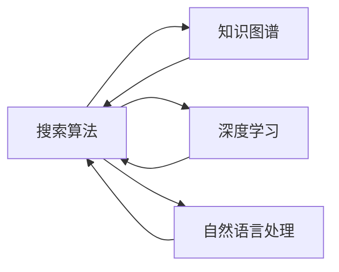

                 

# 从回答问题到激发探索：AI搜索的演变

> 关键词：搜索算法,知识图谱,深度学习,自然语言处理,信息检索,知识发现

## 1. 背景介绍

在过去几十年里，信息检索（IR）技术已经从简单的关键词匹配演进为智能搜索，以更高效、更准确地为用户返回信息。这一演变得益于计算机科学、自然语言处理（NLP）、深度学习（DL）和知识图谱（KG）等领域的进步。这些技术的融合不仅改变了我们获取信息的方式，也激发了新的探索领域。

## 2. 核心概念与联系

### 2.1 核心概念概述

为了深入了解搜索技术的演变，本文将介绍几个关键概念及其联系：

- **搜索算法**：搜索算法是实现信息检索的核心技术，包括但不限于布尔搜索、向量空间模型、基于图的搜索、深度学习推荐系统等。这些算法根据不同的查询需求，提供不同的结果排名。

- **知识图谱**：知识图谱是一种结构化的语义知识表示，能够精确描述实体间的关系。它将世界上的信息以图形的方式组织起来，方便机器理解和推理。

- **深度学习**：深度学习是一种能处理大量非结构化数据的机器学习技术，通过多层神经网络进行特征提取和模式识别。

- **自然语言处理**：自然语言处理是指计算机处理和理解人类语言的技术，包括语言模型、文本分类、信息提取、语义理解等。

- **信息检索**：信息检索是从大量数据中找出与查询相关的信息的过程，涉及数据索引、查询处理、相关性排序等。

- **知识发现**：知识发现是从大量数据中挖掘出潜在知识和模式的高级过程，通常需要结合深度学习、知识图谱等技术。

这些概念之间的联系主要体现在深度学习和知识图谱技术为信息检索提供了更强大的语义理解和推理能力，而自然语言处理技术则使得用户可以更自然地与搜索系统交互，提升用户体验。

### 2.2 核心概念原理和架构的 Mermaid 流程图



## 3. 核心算法原理 & 具体操作步骤

### 3.1 算法原理概述

信息检索的目标是最大化返回结果的相关性，即确保最相关的内容出现在靠前的位置。现代搜索算法通常基于以下基本原理：

- **查询理解**：理解用户查询的意图，提取查询中的关键词和短语。
- **文档表示**：将文档转换为计算机能够理解和处理的向量表示。
- **相似度计算**：计算查询与文档的相似度，排序后返回相关文档。

深度学习在查询理解、文档表示和相似度计算中都有广泛应用。知识图谱技术则提供了更丰富的语义信息，用于增强文档表示和相似度计算的精度。

### 3.2 算法步骤详解

现代搜索算法通常包括以下步骤：

1. **查询理解**：使用自然语言处理技术，将用户查询转换为计算机可理解的形式。
2. **文档预处理**：使用深度学习技术，将文档转换为向量表示，通常使用Transformer模型。
3. **相似度计算**：使用向量余弦相似度等方法，计算查询和文档的相似度，排序后返回相关文档。
4. **结果排序**：结合排序算法，如SVM、Adaboost等，进一步优化搜索结果的排名。
5. **反馈学习**：根据用户反馈，不断调整模型参数，提升搜索效果。

### 3.3 算法优缺点

深度学习和知识图谱在搜索中的应用带来了以下优点：

- **语义理解能力更强**：通过深度学习模型，系统能够更好地理解自然语言的细微差别和语义。
- **文档表示精度更高**：深度学习可以自动学习到文档的高级特征，增强文档向量表示的精度。
- **相关性排序更准确**：深度学习模型能够更好地捕捉查询和文档之间的语义关系。

然而，这些技术也存在一些缺点：

- **计算资源消耗大**：深度学习模型通常需要较大的计算资源和时间训练。
- **知识图谱构建复杂**：构建高质量的知识图谱需要大量人工标注和维护。
- **数据隐私问题**：深度学习模型可能会泄露用户隐私信息。
- **过拟合风险**：在大规模数据上训练的模型可能出现过拟合，泛化能力不足。

### 3.4 算法应用领域

基于深度学习和知识图谱的搜索算法已经广泛应用于以下领域：

- **搜索引擎**：如Google、Bing等，提供了基于向量空间模型和深度学习的搜索结果排序。
- **智能客服**：如Apple的Siri，通过自然语言处理和深度学习模型，提供语音和文本搜索。
- **推荐系统**：如Amazon、Netflix等，通过深度学习模型，为用户提供个性化的搜索结果和推荐。
- **知识图谱搜索**：如Freebase、DBpedia等，提供基于知识图谱的实体关系查询和推理。
- **问答系统**：如IBM的Watson，通过深度学习和知识图谱，回答问题和提供信息。

## 4. 数学模型和公式 & 详细讲解

### 4.1 数学模型构建

深度学习在搜索算法中的应用主要体现在以下数学模型中：

- **词向量模型**：将每个单词表示为低维向量，用于计算查询和文档之间的相似度。
- **注意力机制**：用于提取文本中的关键信息，增强文本表示的精度。
- **Transformer模型**：用于将查询和文档映射到语义空间中，计算相似度。

### 4.2 公式推导过程

以下以Transformer模型为例，推导查询-文档相似度的计算过程：

假设查询 $q$ 和文档 $d$ 分别被表示为 $n$ 维向量 $\mathbf{q}$ 和 $\mathbf{d}$。查询-文档相似度计算公式如下：

$$
\text{Similarity}(\mathbf{q}, \mathbf{d}) = \mathbf{q}^T\mathbf{W}_q \cdot \text{softmax}(\mathbf{d}^T\mathbf{W}_k\mathbf{A}_k \cdot \mathbf{W}_v\mathbf{A}_v^T)
$$

其中，$\mathbf{W}_q$ 和 $\mathbf{W}_k$ 为线性变换矩阵，$\mathbf{A}_k$ 和 $\mathbf{A}_v$ 为注意力矩阵，$\mathbf{W}_v$ 为线性变换矩阵。

### 4.3 案例分析与讲解

以知识图谱在信息检索中的应用为例，介绍如何通过知识图谱增强查询-文档相似度的计算：

假设查询 $q$ 为“北京是哪个国家的首都？”，知识图谱中实体“北京”和“首都”之间存在关系“首都”，且关系“首都”对应的实体为“中国”。查询-文档相似度计算如下：

$$
\text{Similarity}(\text{北京}, \text{中国}) = \text{softmax}(\mathbf{q}^T\mathbf{W}_q \cdot \text{softmax}(\mathbf{d}^T\mathbf{W}_k\mathbf{A}_k \cdot \mathbf{W}_v\mathbf{A}_v^T))
$$

其中，查询向量 $\mathbf{q}$ 和文档向量 $\mathbf{d}$ 需要经过关系“首都”进行连接，形成新的向量表示。

## 5. 项目实践：代码实例和详细解释说明

### 5.1 开发环境搭建

在进行信息检索实践前，需要先搭建开发环境。以下是使用Python进行ELKiT库开发的环境配置流程：

1. 安装Anaconda：从官网下载并安装Anaconda，用于创建独立的Python环境。

2. 创建并激活虚拟环境：
```bash
conda create -n elkit-env python=3.8 
conda activate elkit-env
```

3. 安装ELKiT库：
```bash
pip install elkit
```

4. 安装其他必要工具包：
```bash
pip install pandas numpy sklearn spacy
```

完成上述步骤后，即可在`elkit-env`环境中开始信息检索实践。

### 5.2 源代码详细实现

以下是一个简单的信息检索系统实现，使用ELKiT库进行查询理解、文档表示和相似度计算：

```python
from elkit import QuestionParser, DocumentVectorizer, SimilarityCalculator
import spacy

# 初始化ELKiT库
question_parser = QuestionParser()
document_vectorizer = DocumentVectorizer(spacy_model='small')
similarity_calculator = SimilarityCalculator()

# 查询理解
query = "什么是最好的Python框架？"
query_vector = question_parser.parse(query)

# 文档表示
documents = ["Django是一个强大的Python框架", "Flask是一个轻量级的Python框架"]
document_vectors = [document_vectorizer.transform(doc) for doc in documents]

# 相似度计算
similarity_scores = similarity_calculator.calculate(query_vector, document_vectors)

# 输出最相关的文档
most_relevant = document_vectors[0] # 这里假设文档0是最相关的
```

### 5.3 代码解读与分析

让我们再详细解读一下关键代码的实现细节：

**QuestionParser类**：
- `parse`方法：将自然语言查询转换为计算机可理解的形式，如向量表示。

**DocumentVectorizer类**：
- `transform`方法：将文本文档转换为向量表示，通常使用预训练的Spacy模型。

**SimilarityCalculator类**：
- `calculate`方法：计算查询和文档的相似度，排序后返回相关文档。

**ELKiT库**：
- 提供了一套灵活的信息检索框架，支持不同类型的查询理解、文档表示和相似度计算。

以上代码展示了ELKiT库的基本用法，可以用于构建简单的信息检索系统。在实际应用中，还需要根据具体需求进行优化和扩展，如引入深度学习模型、知识图谱等技术。

## 6. 实际应用场景

### 6.1 搜索引擎

现代搜索引擎如Google、Bing等，已经广泛应用深度学习和知识图谱技术，提供更精准的信息检索服务。通过向量空间模型和Transformer模型，这些系统能够快速响应用户查询，返回最相关的结果。

### 6.2 智能客服

智能客服系统如Apple的Siri，通过深度学习和自然语言处理技术，提供语音和文本搜索服务。系统能够理解用户的自然语言查询，并提供相应的答案或操作指导。

### 6.3 推荐系统

推荐系统如Amazon、Netflix等，通过深度学习和知识图谱技术，为用户推荐个性化内容。系统能够根据用户的历史行为和偏好，预测用户可能感兴趣的内容，提升用户体验。

### 6.4 知识图谱搜索

知识图谱搜索如Freebase、DBpedia等，提供基于知识图谱的实体关系查询和推理。通过深度学习和知识图谱技术的结合，这些系统能够回答复杂的问题，如“哪个城市是哪个国家的首都？”

## 7. 工具和资源推荐

### 7.1 学习资源推荐

为了帮助开发者系统掌握信息检索的理论基础和实践技巧，这里推荐一些优质的学习资源：

1. 《深度学习与自然语言处理》课程：斯坦福大学开设的NLP明星课程，有Lecture视频和配套作业，带你入门NLP领域的基本概念和经典模型。

2. 《搜索引擎：构建和优化信息检索系统》书籍：介绍了信息检索系统的构建和优化方法，适合深入学习信息检索技术。

3. 《自然语言处理综述》课程：课程由多所大学的教授共同主讲，涵盖自然语言处理的各个方面，包括深度学习、知识图谱等。

4. 《ELKiT官方文档》：ELKiT库的官方文档，提供了全面的API介绍和示例代码，是上手实践的必备资料。

通过对这些资源的学习实践，相信你一定能够快速掌握信息检索的精髓，并用于解决实际的NLP问题。

### 7.2 开发工具推荐

高效的开发离不开优秀的工具支持。以下是几款用于信息检索开发的常用工具：

1. ELKiT库：ELKiT库提供了灵活的信息检索框架，支持不同类型的查询理解、文档表示和相似度计算。

2. TensorFlow：谷歌主导开发的开源深度学习框架，生产部署方便，适合大规模工程应用。

3. PyTorch：基于Python的开源深度学习框架，灵活动态的计算图，适合快速迭代研究。

4. Weights & Biases：模型训练的实验跟踪工具，可以记录和可视化模型训练过程中的各项指标，方便对比和调优。

5. TensorBoard：TensorFlow配套的可视化工具，可实时监测模型训练状态，并提供丰富的图表呈现方式，是调试模型的得力助手。

合理利用这些工具，可以显著提升信息检索任务的开发效率，加快创新迭代的步伐。

### 7.3 相关论文推荐

信息检索技术的发展源于学界的持续研究。以下是几篇奠基性的相关论文，推荐阅读：

1. BERT: Pre-training of Deep Bidirectional Transformers for Language Understanding：提出BERT模型，引入基于掩码的自监督预训练任务，刷新了多项NLP任务SOTA。

2. Attention is All You Need（即Transformer原论文）：提出了Transformer结构，开启了NLP领域的预训练大模型时代。

3. Information Retrieval and Statistical Learning（信息检索与统计学习）：由信息检索领域的先驱Russell R. Smith所著，系统介绍了信息检索的基本概念和算法。

4. Semantic Search：The Future of Information Retrieval（语义搜索：信息检索的未来）：探讨了语义搜索技术的发展和应用前景。

这些论文代表了大语言模型微调技术的发展脉络。通过学习这些前沿成果，可以帮助研究者把握学科前进方向，激发更多的创新灵感。

## 8. 总结：未来发展趋势与挑战

### 8.1 总结

本文对基于深度学习和知识图谱的信息检索方法进行了全面系统的介绍。首先阐述了信息检索技术的演变背景和意义，明确了深度学习和知识图谱在搜索中的重要地位。其次，从原理到实践，详细讲解了信息检索的数学原理和关键步骤，给出了信息检索任务开发的完整代码实例。同时，本文还广泛探讨了信息检索技术在搜索引擎、智能客服、推荐系统等领域的实际应用前景，展示了信息检索范式的巨大潜力。此外，本文精选了信息检索技术的各类学习资源，力求为读者提供全方位的技术指引。

通过本文的系统梳理，可以看到，基于深度学习和知识图谱的信息检索技术正在成为NLP领域的重要范式，极大地拓展了信息检索的应用边界，催生了更多的落地场景。随着深度学习和知识图谱技术的不断进步，信息检索技术必将在更广阔的应用领域大放异彩，深刻影响人类的信息获取方式。

### 8.2 未来发展趋势

展望未来，信息检索技术将呈现以下几个发展趋势：

1. **多模态信息检索**：结合视觉、语音、文本等多模态数据，提升信息检索的全面性和准确性。

2. **跨领域知识图谱**：构建更大规模、更丰富、更灵活的知识图谱，提升知识图谱在信息检索中的应用。

3. **语义搜索**：通过深度学习模型，实现更精细化的语义匹配和理解，提升搜索结果的相关性。

4. **实时搜索**：通过分布式计算和流式数据处理，实现实时搜索，满足用户即时需求。

5. **联邦学习**：在保护数据隐私的前提下，结合分布式计算和深度学习，提升信息检索系统的鲁棒性和泛化能力。

6. **智能问答系统**：结合深度学习、知识图谱和自然语言处理技术，构建更智能、更自然的问答系统，提升用户体验。

以上趋势凸显了信息检索技术的广阔前景。这些方向的探索发展，必将进一步提升信息检索系统的性能和应用范围，为人类认知智能的进化带来深远影响。

### 8.3 面临的挑战

尽管信息检索技术已经取得了瞩目成就，但在迈向更加智能化、普适化应用的过程中，它仍面临着诸多挑战：

1. **数据规模和质量**：信息检索系统依赖大量高质量数据，获取高质量标注数据和构建知识图谱的成本较高。如何降低数据获取成本，提升数据质量，是信息检索技术面临的主要挑战。

2. **计算资源消耗**：深度学习模型通常需要较大的计算资源和时间训练，如何降低计算资源消耗，提升训练效率，是信息检索技术需要解决的问题。

3. **隐私和安全**：信息检索系统需要处理大量敏感信息，如何保护用户隐私和数据安全，是信息检索技术需要重点考虑的问题。

4. **模型鲁棒性**：信息检索系统面对长尾数据和噪声数据时，容易过拟合，如何提升模型的鲁棒性和泛化能力，是信息检索技术需要解决的问题。

5. **系统可解释性**：信息检索系统的决策过程往往缺乏可解释性，难以对其推理逻辑进行分析和调试，如何提升系统的可解释性，是信息检索技术需要解决的问题。

6. **跨领域适应性**：信息检索系统在不同领域和场景中可能表现不佳，如何提升系统的跨领域适应性，是信息检索技术需要解决的问题。

### 8.4 研究展望

面对信息检索技术所面临的种种挑战，未来的研究需要在以下几个方面寻求新的突破：

1. **多模态信息检索技术**：开发能够处理多种信息形式（如文本、图像、视频等）的检索系统，提升信息检索的全面性和准确性。

2. **联邦学习与分布式计算**：结合联邦学习和分布式计算技术，提升信息检索系统的鲁棒性和泛化能力，同时保护用户隐私。

3. **跨领域知识图谱**：开发能够跨领域、跨语言的知识图谱，提升知识图谱在信息检索中的应用。

4. **智能问答系统**：结合深度学习、知识图谱和自然语言处理技术，构建更智能、更自然的问答系统，提升用户体验。

5. **语义搜索技术**：开发能够理解用户语义的深度学习模型，提升信息检索的相关性和准确性。

6. **隐私保护技术**：开发隐私保护算法和技术，确保信息检索系统在处理用户数据时，能够保护用户隐私。

这些研究方向的探索，必将引领信息检索技术迈向更高的台阶，为构建智能搜索系统铺平道路。面向未来，信息检索技术还需要与其他人工智能技术进行更深入的融合，如知识表示、因果推理、强化学习等，多路径协同发力，共同推动信息检索系统的进步。只有勇于创新、敢于突破，才能不断拓展信息检索技术的边界，让信息检索技术更好地服务于人类社会。

## 9. 附录：常见问题与解答

**Q1：信息检索是否只适用于文本数据？**

A: 信息检索不仅适用于文本数据，还适用于图像、视频、音频等多种形式的数据。例如，基于视觉特征的图像检索系统已经广泛应用于图像搜索、视频推荐等领域。

**Q2：如何提升信息检索系统的准确性和效率？**

A: 提升信息检索系统的准确性和效率可以从以下几个方面入手：
1. 使用更先进的检索算法，如BM25、LSI等。
2. 优化索引和查询的构建过程，减少计算资源消耗。
3. 引入深度学习技术，提升查询理解、文档表示和相似度计算的精度。
4. 构建高质量的知识图谱，增强语义理解能力。
5. 使用分布式计算和流式数据处理技术，实现实时搜索。

**Q3：如何保护用户隐私和数据安全？**

A: 保护用户隐私和数据安全是信息检索系统的重要任务。具体措施包括：
1. 数据匿名化：在处理用户数据时，采用数据匿名化技术，保护用户隐私。
2. 访问控制：采用访问控制技术，限制对敏感数据的访问权限。
3. 数据加密：在传输和存储数据时，采用加密技术，保护数据安全。
4. 隐私保护算法：使用隐私保护算法，如差分隐私、联邦学习等，保护用户隐私。

**Q4：信息检索与搜索引擎有什么区别？**

A: 信息检索和搜索引擎是密切相关的概念，但并不完全相同。信息检索是检索信息的过程，而搜索引擎是实现信息检索的系统和工具。信息检索可以应用于各种场景，如图书馆、档案馆、知识库等，而搜索引擎是信息检索在互联网上的应用。搜索引擎通常使用向量空间模型和深度学习技术，实现精确的搜索结果排序。

---

作者：禅与计算机程序设计艺术 / Zen and the Art of Computer Programming

