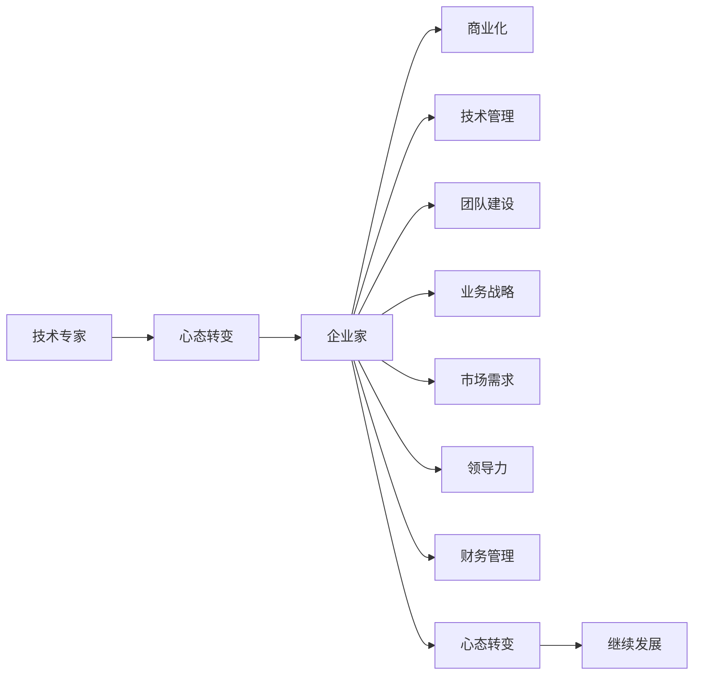

                 

# 从技术专家到企业家的心态转变

> 关键词：技术专家,企业家,心态转变,创业,技术管理,团队建设,业务战略,市场需求,领导力,财务管理

## 1. 背景介绍

在快速发展的IT行业中，技术专家与企业家之间的角色转换越来越频繁。这不仅因为技术专家具备丰富的技术背景，易于理解技术创新点，而且他们往往具备敏锐的市场洞察力，能够迅速识别到技术在实际应用中的需求和潜力。然而，从技术专家到企业家的角色转变并非一蹴而就，它需要一系列的心态调整和能力提升。本文将从技术专家到企业家的心态转变角度出发，探讨技术专家在创业过程中所需的心态转变、面临的挑战和解决策略，旨在为即将或正在进行角色转换的技术专家提供一些实用的建议和方向。

## 2. 核心概念与联系

### 2.1 核心概念概述

在探讨从技术专家到企业家的心态转变时，我们首先需要明确几个核心概念及其相互之间的关系：

- **技术专家**：在某个特定技术领域具有深厚理论知识与实践经验的专业人员。他们通常关注技术本身，解决具体技术问题，注重技术创新与性能优化。

- **企业家**：以创新商业模式为核心，关注市场机会，具备管理和运营能力，能够将技术转化为实际产品和服务，实现商业价值的创造。

- **心态转变**：从关注技术本身转向关注市场与商业模式，从个体操作转向团队管理与战略规划，从被动接受任务转向主动开拓市场。

- **商业化**：将技术成果转化为可销售的产品或服务，解决市场实际问题，满足用户需求。

- **技术管理**：不仅管理技术团队，还包括规划技术方向，确保技术与业务的紧密结合。

- **团队建设**：组建并培养一支高效运作的技术团队，提高团队协作与创新能力。

- **业务战略**：制定公司整体发展方向，包括产品定位、市场策略等，指导技术开发和商业化进程。

- **市场需求**：深入理解用户需求，抓住市场机会，快速响应市场变化。

- **领导力**：不仅是技术领域的专家，还是团队的领导者和市场的领导者，具备解决复杂问题的能力。

- **财务管理**：确保公司的财务健康，能够进行资金的合理规划与使用。

这些概念之间相互关联，共同构成了从技术专家到企业家角色的转变过程。

### 2.2 核心概念原理和架构的 Mermaid 流程图



该图展示了从技术专家到企业家角色的转变过程，其中心态转变是核心环节。技术专家通过心态转变，最终成为能够进行商业化和技术管理的全面型企业家。

## 3. 核心算法原理 & 具体操作步骤

### 3.1 算法原理概述

从技术专家到企业家的心态转变，本质上是一个从技术思维到商业思维的转变过程。这种转变涉及多个方面的改变，包括但不限于：

- **问题识别**：从关注技术问题转向关注市场需求和用户痛点。
- **目标设定**：从技术性能优化转向商业目标实现，如市场占有率、用户满意度等。
- **策略制定**：从技术创新转向商业模式创新，如订阅模式、服务化等。
- **团队管理**：从个人技术能力转向团队协作与领导力。
- **市场洞察**：从对技术趋势的理解转向对市场动态的把握。
- **财务规划**：从技术预算转向全面财务规划与成本控制。

### 3.2 算法步骤详解

以下是具体实现从技术专家到企业家的心态转变步骤：

**Step 1: 市场调研与需求分析**
- 进行市场调研，了解行业现状、用户需求、竞争对手情况等。
- 分析用户痛点，明确产品或服务的目标用户和应用场景。

**Step 2: 确定商业模式**
- 基于市场调研结果，确定合适的商业模式，如SaaS、B2B、B2C等。
- 设计合理的盈利模式，包括定价策略、收入来源等。

**Step 3: 制定业务战略**
- 制定产品路线图，明确产品迭代计划和关键里程碑。
- 规划市场推广策略，确定推广渠道和推广内容。

**Step 4: 组建团队与资源整合**
- 组建跨职能团队，包括产品经理、市场经理、技术经理等。
- 整合内部资源，明确各团队之间的协作与沟通机制。

**Step 5: 技术规划与实施**
- 根据业务战略和技术趋势，确定技术选型与架构设计。
- 制定技术开发计划，明确各阶段的技术实现目标。

**Step 6: 产品迭代与市场反馈**
- 进行产品开发与测试，收集用户反馈。
- 根据反馈持续优化产品功能与用户体验。

**Step 7: 市场推广与销售**
- 制定推广计划，实施市场推广活动。
- 建立销售渠道，开拓市场，获取客户。

**Step 8: 财务规划与运营管理**
- 制定财务预算，监控资金使用情况。
- 进行成本控制与效益分析，确保财务健康。

**Step 9: 持续优化与创新**
- 根据市场变化，持续优化产品和服务。
- 探索新的技术趋势与市场机会，推动技术创新。

### 3.3 算法优缺点

**优点**：
- 从技术角度快速理解市场需求，提高产品竞争力。
- 将技术专长转化为商业价值，实现技术创新与市场开拓的双赢。
- 多角度思考问题，提升决策的全面性和合理性。

**缺点**：
- 角色转换初期，可能需要适应全新的工作节奏与压力。
- 缺乏商业管理经验，可能面临运营与财务上的挑战。
- 需要平衡技术兴趣与商业目标，可能产生心理冲突。

### 3.4 算法应用领域

从技术专家到企业家的心态转变，不仅适用于初创企业，也适用于已有企业进行技术转型与创新。在以下领域中，该方法具有显著优势：

- **初创公司**：技术团队具备技术专长，能够快速识别并实现市场需求。
- **技术驱动型公司**：通过技术创新驱动业务增长，提升产品竞争力。
- **业务转型公司**：引入技术驱动的新业务方向，实现企业跨越式发展。
- **行业领先公司**：利用技术优势，探索新的市场机会，保持行业领先地位。

## 4. 数学模型和公式 & 详细讲解 & 举例说明

### 4.1 数学模型构建

假设有一个技术专家想要转型成为企业家，他需要面对的是一个新市场。我们可以用以下数学模型来表示这一过程：

- **市场规模**：$M$，表示潜在客户总数。
- **用户增长率**：$r$，表示每年用户增长的百分比。
- **渗透率**：$p$，表示目标市场占总市场份额的百分比。
- **Lifetime Value**：$LV$，表示每个用户的终生价值。

**目标**：最大化总市场价值 $V$。

$$
V = M \cdot p \cdot r^t \cdot LV
$$

其中 $t$ 表示时间。

### 4.2 公式推导过程

通过上述模型，我们可以推导出以下结论：

1. **市场规模**：$M$ 越大，潜在市场价值越大。
2. **用户增长率**：$r$ 越高，用户数量增长越快，市场价值增长也越快。
3. **渗透率**：$p$ 越高，目标市场份额越大，市场价值也越大。
4. **Lifetime Value**：$LV$ 越高，每个用户带来的长期收益越高，市场价值也越高。

### 4.3 案例分析与讲解

假设一个技术专家想要进入智能家居市场，进行智能家居设备的研发与推广。

1. **市场调研**：经过调研，发现智能家居市场规模庞大，每年以20%的速度增长。
2. **用户需求**：识别到用户对智能家居设备的便捷性与安全性有较高需求。
3. **竞争分析**：发现主要竞争对手包括某知名科技公司的产品，但存在市场占有率低的问题。
4. **产品规划**：决定开发具备高性价比、易用性、高安全性的智能家居设备。
5. **商业模式**：采取B2C模式，提供订阅服务，进行按月收费。
6. **推广策略**：通过线上线下结合的方式，进行大规模市场推广。
7. **财务规划**：初期投入1000万元，预计第1年实现500万元收入，毛利率为30%。

通过以上步骤，这位技术专家成功转型为企业家，并在智能家居市场中取得了初步成功。

## 5. 项目实践：代码实例和详细解释说明

### 5.1 开发环境搭建

从技术专家到企业家的心态转变，并不仅限于理论知识的掌握，还包括实际操作技能的提升。以下是开发环境的搭建步骤：

1. **选择开发平台**：根据业务需求选择合适的开发平台，如AWS、Google Cloud、Azure等云平台。
2. **配置开发环境**：安装所需的软件开发工具，如IDE、数据库、开发框架等。
3. **版本控制**：使用Git等版本控制系统，进行代码管理与团队协作。
4. **持续集成**：建立持续集成与持续部署系统，确保代码质量与快速迭代。

### 5.2 源代码详细实现

下面是一个简单的项目实现示例：

1. **需求分析**：使用问卷调查等方式收集用户需求。
2. **业务规划**：制定业务目标与规划。
3. **技术选型**：选择适合的技术栈，如React、Vue、Flask等。
4. **开发实现**：编写代码，实现业务功能。
5. **测试优化**：进行单元测试、集成测试，优化代码性能。
6. **部署上线**：将项目部署到生产环境，进行实际应用。

### 5.3 代码解读与分析

以下是对项目实现的代码解读：

```python
# 项目需求分析
user_feedback = collect_feedback()

# 业务规划
business_plan = generate_business_plan()

# 技术选型
tech_stack = choose_technology()

# 开发实现
def implement_functionality():
    # 业务逻辑代码
    pass

# 测试优化
def test_code():
    # 单元测试代码
    pass

# 部署上线
def deploy_to_production():
    # 部署代码
    pass
```

通过以上代码实现，可以清晰地看到技术专家如何逐步转型为企业家，通过系统化的方法完成项目开发。

### 5.4 运行结果展示

以下是项目运行结果的展示：

1. **用户反馈**：根据用户反馈，明确产品开发方向。
2. **业务规划**：制定详细的业务计划与目标。
3. **技术选型**：选择适合的技术栈与开发工具。
4. **功能实现**：实现核心业务功能，确保用户体验。
5. **性能优化**：进行代码优化，提升系统性能。
6. **部署上线**：将项目部署到生产环境，确保系统稳定运行。

## 6. 实际应用场景

### 6.1 智能家居市场

智能家居市场的快速发展，为技术专家转型为企业家提供了广阔的空间。通过深入分析市场和用户需求，利用技术专长，开发出具备高性价比与易用性的智能家居设备，可以实现快速占领市场，满足用户需求。

### 6.2 医疗健康领域

医疗健康领域面临大量的技术需求，尤其是在远程医疗、智能诊断、健康管理等方面。技术专家可以利用自身的技术优势，开发智能医疗设备，提升医疗服务质量，推动健康产业的创新发展。

### 6.3 教育科技行业

教育科技行业是技术驱动的重要领域，技术专家可以通过开发智能教育平台、在线课程等产品，满足不同教育阶段的需求，推动教育行业的数字化转型。

## 7. 工具和资源推荐

### 7.1 学习资源推荐

1. **技术书籍**：
   - 《从零到一：构建创业公司的底层逻辑》：通过实际案例，介绍创业初期的技术、产品、市场等方面。
   - 《精益创业》：通过迭代式开发，快速验证市场需求，优化商业模式。
   
2. **在线课程**：
   - Coursera《创业管理》课程：涵盖创业的各个方面，包括市场调研、商业模式、团队管理等。
   - Udacity《人工智能创业》课程：结合人工智能与创业，提供实战经验。
   
3. **博客文章**：
   - TechCrunch《如何从一个技术专家转型为企业家》：分享实际案例与心得体会。
   - Medium《从技术到管理：我的创业之路》：展示技术专家到企业家的心路历程。

### 7.2 开发工具推荐

1. **开发平台**：
   - AWS：提供强大的云服务，支持多语言、多平台开发。
   - Google Cloud：提供丰富的AI与机器学习工具，便于技术创新。
   - Azure：提供全面的云计算解决方案，支持混合云架构。

2. **开发工具**：
   - IDE：如Visual Studio Code、PyCharm、IntelliJ IDEA等，提供高效开发环境。
   - 数据库：如MySQL、PostgreSQL、MongoDB等，进行数据管理与存储。
   - 开发框架：如React、Vue、Flask等，提供快速开发与部署方案。

3. **项目管理**：
   - JIRA：进行任务管理与进度跟踪。
   - Trello：进行看板式管理，提高团队协作效率。
   - Asana：进行项目计划与任务分配。

### 7.3 相关论文推荐

1. **创业理论**：
   - 《创业管理》：哈佛商学院出版的经典创业管理教材，涵盖创业理论、实践与管理。
   - 《创业者手册》：提供创业过程中所需的各种知识与资源。

2. **技术创新**：
   - 《深度学习》：介绍深度学习理论、算法与应用。
   - 《AI未来》：探讨AI技术对未来社会的影响与挑战。

## 8. 总结：未来发展趋势与挑战

### 8.1 总结

从技术专家到企业家的心态转变，是一个系统性、全面性的过程，需要技术、管理、市场等多方面能力的提升。本文从心态转变、商业化、技术管理、团队建设、业务战略等多个角度，全面解析了这一过程。技术专家通过心态转变，能够更好地理解和应对市场需求，将技术优势转化为商业价值，推动技术创新与市场开拓。

### 8.2 未来发展趋势

未来，技术专家向企业家的转型将更加频繁，这一趋势具有以下几个特点：

1. **技术驱动**：随着技术迭代速度的加快，技术专长将成为创业成功的关键。
2. **市场导向**：市场对技术解决方案的需求将更加多样化，企业家需要敏锐的市场洞察力。
3. **团队协作**：创业项目需要多学科、多领域的协作，团队管理与协作能力将越来越重要。
4. **持续创新**：技术环境的变化要求企业家不断创新，保持竞争力。
5. **全球化视野**：全球市场为技术创新提供了更广阔的空间，企业家需要具备全球化视角。

### 8.3 面临的挑战

在转型过程中，技术专家将面临以下挑战：

1. **角色转换**：从技术角色到管理角色，需要适应全新的工作内容与职责。
2. **管理能力**：缺乏管理经验，可能面临团队建设与资源管理的挑战。
3. **商业认知**：需要重新学习市场与商业运作的各个方面。
4. **战略规划**：需要具备全面的战略视野，进行合理的业务规划与战略决策。
5. **财务压力**：初创企业在资金、财务方面往往面临较大的压力。

### 8.4 研究展望

未来，技术专家向企业家的转型将继续深入发展，研究者需要关注以下几个方向：

1. **教育培训**：建立系统化的创业教育培训体系，帮助技术专家顺利完成角色转换。
2. **支持平台**：建立创业孵化器、加速器等平台，提供创业资源与支持。
3. **政策导向**：政府部门需要制定支持技术创新与创业的政策，提供更多创业激励。
4. **跨学科融合**：促进技术与管理的跨学科融合，培养具有复合能力的创业人才。

## 9. 附录：常见问题与解答

**Q1: 技术专家如何更好地进行市场调研？**

A: 技术专家可以通过以下步骤进行市场调研：
1. **定义调研目标**：明确需要了解的领域与问题。
2. **选择调研方法**：使用问卷调查、访谈、焦点小组等方式，收集数据。
3. **分析调研结果**：总结市场趋势与用户需求，识别机会与风险。
4. **制定市场策略**：根据调研结果，制定市场推广策略，优化产品方案。

**Q2: 技术专家如何管理团队？**

A: 技术专家可以采取以下措施管理团队：
1. **明确团队目标**：设定清晰的团队目标与绩效标准。
2. **分配任务**：根据成员能力与兴趣，合理分配任务与职责。
3. **提供支持**：提供必要的技术支持与管理指导。
4. **激励机制**：建立激励机制，提高团队凝聚力与积极性。
5. **沟通协调**：建立高效的沟通渠道，解决团队冲突。

**Q3: 技术专家如何进行财务规划？**

A: 技术专家可以采取以下措施进行财务规划：
1. **预算管理**：制定详细的预算计划，控制成本。
2. **资金筹集**：进行融资与投资，确保资金充足。
3. **财务监控**：实时监控财务状况，进行风险控制。
4. **效益分析**：进行成本效益分析，优化资源配置。

**Q4: 技术专家如何提高领导力？**

A: 技术专家可以采取以下措施提高领导力：
1. **学习管理知识**：阅读管理书籍，参加管理培训。
2. **实践管理经验**：参与实际管理项目，积累管理经验。
3. **建立信任**：与团队成员建立良好的信任关系。
4. **提升沟通能力**：提高沟通技巧，增强表达能力。
5. **倾听反馈**：主动听取团队成员的反馈意见，及时调整策略。

通过这些步骤与措施，技术专家可以逐步完成心态转变，提升各项能力，顺利转型为企业家，推动技术的商业化与创新发展。

