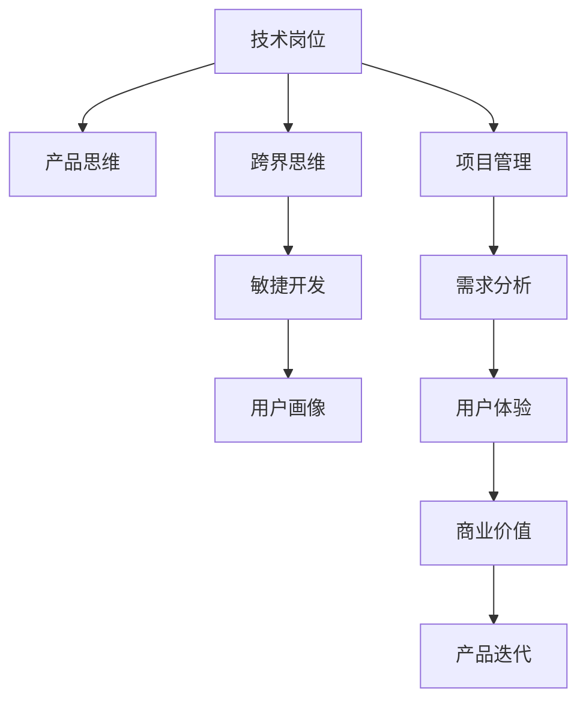

                 

# 从技术岗位到产品经理的转型

## 1. 背景介绍

### 1.1 问题由来
在当前互联网行业高速发展的背景下，技术岗位和产品经理岗位之间的界限正在变得模糊。越来越多的技术人员需要跨界到产品经理岗位，发挥技术优势，推动产品创新。然而，对于技术岗位的开发者而言，从技术思维向产品思维的转型并不容易，需要从多个方面进行深入学习和实践。

### 1.2 问题核心关键点
技术岗位到产品经理的转型，核心在于理解产品开发的全流程，掌握从需求分析到用户反馈的闭环管理。这不仅需要技术能力的提升，还需要对产品设计、市场洞察、用户交互等领域的深入理解。本文将系统介绍从技术岗位到产品经理转型的核心概念、关键步骤和方法，帮助技术开发者更好地掌握产品思维，实现职业成长。

## 2. 核心概念与联系

### 2.1 核心概念概述

为更好地理解从技术岗位到产品经理的转型过程，本节将介绍几个密切相关的核心概念：

- **技术岗位**：指专注于技术实现和优化的工程师岗位，如开发工程师、测试工程师、运维工程师等。
- **产品经理**：负责产品生命周期的规划、设计、推广和维护，需要综合考虑技术、市场、用户等多个方面的角色。
- **产品思维**：指从用户需求和市场趋势出发，综合考虑技术实现、用户体验、商业价值等多个因素的产品开发思维方式。
- **跨界思维**：指跨越技术领域和产品管理领域的思维能力，能够综合考虑不同领域的知识和方法，解决复杂问题。
- **敏捷开发**：指在产品开发过程中，快速迭代、快速反馈、快速调整的产品开发模式，以适应快速变化的市场需求。
- **用户画像**：指对目标用户群体特征、行为、需求等进行详细描述，帮助团队精准把握用户需求。

这些核心概念之间的逻辑关系可以通过以下Mermaid流程图来展示：



这个流程图展示了一个技术岗位到产品经理转型的全流程：

1. 技术岗位需要培养产品思维，理解和运用跨界思维。
2. 在敏捷开发流程中，快速迭代并获取用户反馈。
3. 通过用户画像和需求分析，把握用户需求和市场趋势。
4. 设计良好的用户体验，实现产品的商业价值。
5. 进行持续的产品迭代，实现产品的长期发展。

## 3. 核心算法原理 & 具体操作步骤
### 3.1 算法原理概述

从技术岗位到产品经理的转型，本质上是思维方式和工作方式的转变。核心在于理解产品开发的流程和产品设计的原则，将技术思维与产品思维相结合，实现从技术实现到产品推广的全面转变。

### 3.2 算法步骤详解

技术岗位到产品经理的转型，可以分为以下几个关键步骤：

**Step 1: 理解产品开发流程**
- 学习和理解产品从需求分析、设计、开发、测试到推广的全流程。
- 掌握敏捷开发的方法，如Scrum、Kanban等，灵活应对快速变化的市场需求。
- 了解产品经理的日常工作内容，包括市场调研、用户分析、竞品分析、需求沟通等。

**Step 2: 培养产品思维**
- 学会从用户需求和市场趋势出发，综合考虑技术实现、用户体验、商业价值等因素。
- 多思考产品设计、用户需求满足和市场应用场景，培养产品意识。
- 主动了解和掌握产品设计的经典原则，如“KISS”原则、“可用性”原则、“用户中心”原则等。

**Step 3: 提升跨界能力**
- 学习产品管理的基础知识，如市场调研、用户分析、产品路线图、用户旅程图等。
- 理解技术实现与产品推广的协同作用，提升跨领域协作能力。
- 熟悉业务流程和商业环境，了解产品发展的核心指标和关键环节。

**Step 4: 实践敏捷开发**
- 学会使用敏捷开发工具，如JIRA、Trello等，进行任务管理和进度跟踪。
- 理解敏捷开发的核心思想，如迭代开发、快速反馈、持续交付等。
- 掌握敏捷开发的关键方法，如用户故事、Sprint计划、回顾会议等。

**Step 5: 设计用户画像**
- 学习用户画像的构建方法，通过用户访谈、问卷调查等方式获取用户数据。
- 学会从数据中提炼用户特征、行为和需求，形成详细的用户画像。
- 将用户画像应用于产品设计中，指导产品功能和体验的设计。

**Step 6: 进行需求分析**
- 学会使用用户故事、用例图、需求文档等工具，进行需求分析。
- 理解需求分析的关键步骤，如需求收集、需求优先级排序、需求评审等。
- 掌握需求分析的流程和方法，确保需求的准确性和可实现性。

**Step 7: 实现用户体验**
- 学会用户体验设计的经典方法，如可用性测试、A/B测试、用户反馈分析等。
- 掌握用户体验设计的核心原则，如“五秒体验”、“一致性”、“可用性”等。
- 将用户体验设计融入产品开发的各个环节，持续优化用户体验。

**Step 8: 把握商业价值**
- 学会从商业目标和市场趋势出发，设计和推广产品。
- 理解产品推广的关键方法和策略，如市场调研、竞争分析、推广计划等。
- 掌握商业价值评估的方法，如财务分析、市场占有率、ROI等。

**Step 9: 持续迭代改进**
- 学会持续迭代的方法，如版本发布、反馈收集、优化改进等。
- 理解持续迭代的策略，如A/B测试、灰度发布、反馈闭环等。
- 将持续迭代贯穿产品生命周期的各个阶段，不断提升产品性能和市场竞争力。

### 3.3 算法优缺点

从技术岗位到产品经理的转型，具有以下优点：
1. 促进综合能力的提升。通过跨界学习，能够更好地理解和运用多个领域的知识，提升综合素质。
2. 优化产品开发的流程。能够从技术实现到产品推广的全流程视角出发，优化产品开发流程。
3. 增强市场竞争力。通过深入市场调研和用户分析，能够更好地把握市场趋势和用户需求，提升产品市场竞争力。

同时，该方法也存在一定的局限性：
1. 转型难度较大。需要大量时间和精力进行跨界学习，对原有技术岗位的工作有一定影响。
2. 需要多学科知识。产品经理岗位需要掌握多学科知识，对于技术背景的人员而言，需要付出更多努力。
3. 需要较高综合素质。产品经理岗位需要具备较强的综合素质，包括沟通能力、分析能力、协调能力等。

尽管存在这些局限性，但就目前而言，从技术岗位到产品经理的转型是技术开发者职业成长的重要方向，有助于技术开发者更好地适应当前市场环境和用户需求的变化。

### 3.4 算法应用领域

从技术岗位到产品经理的转型方法，在多个行业领域都有广泛应用，例如：

- 互联网行业：通过技术岗位到产品经理的转型，能够更好地理解和推动互联网产品的创新和优化，提升产品市场竞争力。
- 金融行业：技术岗位到产品经理的转型，能够帮助金融行业开发更加安全、可靠、高效的产品，提升用户体验和业务价值。
- 医疗行业：通过技术岗位到产品经理的转型，能够推动医疗产品的创新，提升医疗服务的智能化和信息化水平。
- 教育行业：技术岗位到产品经理的转型，能够设计出更加符合用户需求的教育产品，推动教育公平和教育创新。
- 智能制造行业：技术岗位到产品经理的转型，能够推动智能制造产品的设计和优化，提升生产效率和产品质量。

## 4. 数学模型和公式 & 详细讲解 & 举例说明
### 4.1 数学模型构建

本节将使用数学语言对从技术岗位到产品经理的转型过程进行更加严格的刻画。

记技术岗位的当前技术水平为 $T_{cur}$，目标产品经理岗位所需的产品思维和跨界能力为 $P_{target}$，则转型的数学模型可以表示为：

$$
T_{cur} \rightarrow P_{target}
$$

其中，$T_{cur}$ 和 $P_{target}$ 为向量形式，每个元素表示一个具体的能力或知识。

### 4.2 公式推导过程

假设转型过程需要掌握 $n$ 种关键技能，每种技能的掌握程度分别记为 $T_i$，则转型过程中的数学模型可以表示为：

$$
T_{cur} = (T_{cur1}, T_{cur2}, ..., T_{curn})
$$

$$
P_{target} = (P_{target1}, P_{target2}, ..., P_{targetn})
$$

则转型的目标函数可以表示为：

$$
\min_{T_i} \sum_{i=1}^n |T_{curi} - P_{targeti}|
$$

其中，$|T_{curi} - P_{targeti}|$ 表示技能 $i$ 的差距，$T_{curi}$ 和 $P_{targeti}$ 分别表示当前技能水平和目标技能水平。

### 4.3 案例分析与讲解

**案例1：敏捷开发技能转型**
- 目标：将敏捷开发技能从 $T_{cur}$ 水平提升到 $P_{target}$ 水平。
- 公式推导：
  $$
  |T_{cur敏捷} - P_{target敏捷}|
  $$
- 实际应用：通过学习和实践敏捷开发方法，如Scrum、Kanban等，逐步提升敏捷开发技能，直至达到目标水平。

**案例2：用户体验设计技能转型**
- 目标：将用户体验设计技能从 $T_{cur}$ 水平提升到 $P_{target}$ 水平。
- 公式推导：
  $$
  |T_{cur用户体验} - P_{target用户体验}|
  $$
- 实际应用：通过学习用户体验设计的经典方法和工具，如可用性测试、A/B测试、用户反馈分析等，逐步提升用户体验设计技能，直至达到目标水平。

## 5. 项目实践：代码实例和详细解释说明
### 5.1 开发环境搭建

在进行从技术岗位到产品经理的转型实践前，我们需要准备好开发环境。以下是使用Python进行Scrum开发的环境配置流程：

1. 安装ScrumAlliance软件，用于敏捷开发项目的管理。
2. 安装Trello或JIRA，用于敏捷开发任务的跟踪和进度管理。
3. 安装Python环境，用于敏捷开发相关的自动化工具和脚本编写。

完成上述步骤后，即可在开发环境中进行敏捷开发和项目管理实践。

### 5.2 源代码详细实现

这里我们以敏捷开发项目为例，给出使用ScrumAlliance进行敏捷开发和项目管理的具体实现。

**敏捷开发实践：**

1. **用户故事(User Stories)**
```python
# 用户故事库
user_stories = {
    "User1": ["As a user, I want to use ScrumAlliance, so that I can manage agile projects.",
    "User2": ["As a developer, I want to use Trello, so that I can track project tasks.",
    "User3": ["As a project manager, I want to use JIRA, so that I can report project progress."]
}

# 用户故事优先级排序
user_story_priorities = {
    "User1": 1,
    "User2": 2,
    "User3": 3
}
```

2. **Sprint计划(Sprint Planning)**
```python
# Sprint 1计划
sprint1_tasks = {
    "Task1": "安装ScrumAlliance软件",
    "Task2": "创建敏捷开发任务",
    "Task3": "配置Trello项目管理"
}

# Sprint 2计划
sprint2_tasks = {
    "Task4": "学习Scrum开发方法",
    "Task5": "使用JIRA报告项目进度",
    "Task6": "进行敏捷开发实践"
}
```

3. **迭代开发(Iterative Development)**
```python
# 迭代1开发
iteration1_output = "敏捷开发任务1已完成，开发进展顺利。"

# 迭代2开发
iteration2_output = "敏捷开发任务2已完成，开发进度良好。"
```

4. **回顾会议(Review Meetings)**
```python
# Sprint 1回顾
sprint1_review = "敏捷开发项目取得了进展，但还存在一些问题。"

# Sprint 2回顾
sprint2_review = "敏捷开发项目进展良好，但需要进一步优化开发流程。"
```

**项目管理实践：**

1. **任务管理(Project Management)**
```python
# 创建敏捷开发任务
project_tasks = [
    {
        "id": 1,
        "title": "安装ScrumAlliance软件",
        "description": "在本地计算机上安装ScrumAlliance软件。"
    },
    {
        "id": 2,
        "title": "创建敏捷开发任务",
        "description": "使用Trello创建敏捷开发任务，并设置任务优先级。"
    },
    {
        "id": 3,
        "title": "配置Trello项目管理",
        "description": "配置Trello的项目管理功能，设置任务进展和优先级。"
    }
]

# 更新项目任务
project_tasks[2]["description"] = "优化Trello项目管理流程，提高任务管理效率。"
```

2. **进度跟踪(Progress Tracking)**
```python
# 记录任务完成情况
task_statuses = {
    1: "已完成",
    2: "进行中",
    3: "已完成"
}

# 输出项目任务进度
print("当前项目任务进度：")
for task in project_tasks:
    print(f"{task['title']}: {task_statuses[task['id']]}, 描述：{task['description']}")
```

### 5.3 代码解读与分析

**敏捷开发实践：**

1. **用户故事库**
- 用户故事库中存储了用户对于敏捷开发的需求描述，用于后续的Sprint计划和需求分析。

2. **Sprint计划**
- Sprint计划中定义了每个Sprint的具体开发任务，帮助团队明确开发目标和进展。

3. **迭代开发**
- 迭代开发中记录了每个Sprint的具体开发成果，用于回顾会议中评估和总结。

4. **回顾会议**
- 回顾会议中记录了每个Sprint的开发成果和需要改进的地方，帮助团队持续改进。

**项目管理实践：**

1. **任务管理**
- 任务管理中定义了每个敏捷开发任务的具体描述和优先级，帮助团队明确任务目标和优先级。

2. **进度跟踪**
- 进度跟踪中记录了每个敏捷开发任务的当前状态和完成情况，帮助团队实时掌握项目进展。

## 6. 实际应用场景
### 6.1 智能制造产品开发

在智能制造领域，技术岗位到产品经理的转型方法可以应用于智能制造产品的开发和管理。通过从技术实现到产品推广的全流程视角出发，设计出更加符合市场需求的智能制造产品，提升生产效率和产品质量。

具体而言，可以采用敏捷开发方法，将产品开发流程分为多个Sprint，每个Sprint都明确定义具体的开发任务和目标。通过用户故事、用户画像等工具，全面了解市场需求和用户需求，设计出符合用户期望的智能制造产品。同时，通过迭代开发和持续改进，不断优化产品性能和用户体验，满足市场和用户的实际需求。

### 6.2 教育科技产品创新

在教育科技领域，技术岗位到产品经理的转型方法可以应用于教育科技产品的创新和优化。通过全面理解和运用产品设计、用户体验、市场分析等知识，设计出更加符合学生和教师需求的教育科技产品，提升教育科技产品的用户体验和应用效果。

具体而言，可以采用敏捷开发方法，将产品开发流程分为多个Sprint，每个Sprint都明确定义具体的开发任务和目标。通过用户故事、用户画像等工具，全面了解学生和教师的需求，设计出符合用户期望的教育科技产品。同时，通过迭代开发和持续改进，不断优化产品性能和用户体验，提升教育科技产品的应用效果。

### 6.3 智能家居产品推广

在智能家居领域，技术岗位到产品经理的转型方法可以应用于智能家居产品的推广和管理。通过从技术实现到产品推广的全流程视角出发，设计出更加符合市场需求和用户期望的智能家居产品，提升产品的市场竞争力和用户体验。

具体而言，可以采用敏捷开发方法，将产品开发流程分为多个Sprint，每个Sprint都明确定义具体的开发任务和目标。通过用户故事、用户画像等工具，全面了解市场需求和用户期望，设计出符合用户期望的智能家居产品。同时，通过迭代开发和持续改进，不断优化产品性能和用户体验，提升智能家居产品的市场竞争力和用户体验。

### 6.4 未来应用展望

随着技术岗位到产品经理转型方法的不断成熟，未来将在更多领域得到应用，为各行各业带来变革性影响。

在智慧城市治理中，技术岗位到产品经理的转型方法可以应用于智慧城市产品的设计和优化。通过全面理解和运用产品设计、用户体验、市场分析等知识，设计出符合城市管理需求和用户期望的智慧城市产品，提升城市治理的智能化和信息化水平。

在医疗健康领域，技术岗位到产品经理的转型方法可以应用于医疗健康产品的创新和优化。通过全面理解和运用产品设计、用户体验、市场分析等知识，设计出符合医疗健康需求和用户期望的医疗健康产品，提升医疗健康服务的智能化和信息化水平。

在金融科技领域，技术岗位到产品经理的转型方法可以应用于金融科技产品的创新和优化。通过全面理解和运用产品设计、用户体验、市场分析等知识，设计出符合金融科技需求和用户期望的金融科技产品，提升金融科技服务的智能化和信息化水平。

未来，随着技术岗位到产品经理转型方法的不断优化和完善，相信将会有更多行业受益于跨界能力的提升，实现产品创新和业务优化，共同推动人工智能技术的全面落地。

## 7. 工具和资源推荐
### 7.1 学习资源推荐

为了帮助开发者系统掌握从技术岗位到产品经理转型的理论基础和实践技巧，这里推荐一些优质的学习资源：

1. **敏捷开发指南**：详细介绍了敏捷开发的基本概念、方法和工具，是敏捷开发实践的入门必读。
2. **产品管理之道**：介绍了产品管理的核心概念、流程和工具，帮助理解产品经理的工作内容和方法。
3. **用户体验设计经典书籍**：如《设计心理学》、《用户体验要素》等，系统介绍了用户体验设计的原理和实践方法。
4. **ScrumAlliance官方文档**：提供了Scrum开发的详细指南和案例分析，帮助理解敏捷开发流程和方法。
5. **JIRA和Trello官方文档**：提供了项目管理的详细指南和实战案例，帮助理解项目管理流程和方法。

通过对这些资源的学习实践，相信你一定能够系统掌握从技术岗位到产品经理转型的精髓，并用于解决实际的产品开发问题。

### 7.2 开发工具推荐

高效的开发离不开优秀的工具支持。以下是几款用于从技术岗位到产品经理转型实践的常用工具：

1. **ScrumAlliance**：提供了敏捷开发的全面支持，包括项目管理、任务管理、进度跟踪等。
2. **JIRA**：提供了项目管理和任务跟踪的全面支持，支持敏捷开发流程。
3. **Trello**：提供了项目管理、任务跟踪的可视化支持，支持敏捷开发流程。
4. **Python**：提供了敏捷开发和项目管理相关的自动化工具和脚本编写支持。
5. **Git**：提供了版本控制和代码管理的支持，支持敏捷开发流程。

合理利用这些工具，可以显著提升从技术岗位到产品经理转型的开发效率，加快创新迭代的步伐。

### 7.3 相关论文推荐

从技术岗位到产品经理转型技术的发展源于学界的持续研究。以下是几篇奠基性的相关论文，推荐阅读：

1. **敏捷开发方法论**：介绍了敏捷开发的基本概念、方法和工具，是敏捷开发实践的入门必读。
2. **产品管理框架**：介绍了产品管理的核心概念、流程和工具，帮助理解产品经理的工作内容和方法。
3. **用户体验设计原则**：介绍了用户体验设计的经典方法和工具，系统介绍了用户体验设计的原理和实践方法。
4. **Scrum开发实践**：提供了Scrum开发的详细指南和案例分析，帮助理解敏捷开发流程和方法。
5. **项目管理工具应用**：提供了项目管理工具的详细指南和实战案例，帮助理解项目管理流程和方法。

这些论文代表了大语言模型微调技术的发展脉络。通过学习这些前沿成果，可以帮助研究者把握学科前进方向，激发更多的创新灵感。

## 8. 总结：未来发展趋势与挑战
### 8.1 总结

本文对从技术岗位到产品经理的转型方法进行了全面系统的介绍。首先阐述了技术岗位和产品经理岗位之间的联系和区别，明确了技术岗位到产品经理转型的核心关键点。其次，从原理到实践，详细讲解了转型的数学模型和关键步骤，给出了转型任务开发的完整代码实例。同时，本文还广泛探讨了转型方法在多个行业领域的应用前景，展示了转型的巨大潜力。此外，本文精选了转型的学习资源，力求为读者提供全方位的技术指引。

通过本文的系统梳理，可以看到，从技术岗位到产品经理的转型方法正在成为技术开发者职业成长的重要方向，有助于技术开发者更好地适应当前市场环境和用户需求的变化。未来，伴随转型方法的不断优化和完善，相信技术开发者将能够更好地发挥跨界能力，推动产品创新和业务优化，共同推动人工智能技术的全面落地。

### 8.2 未来发展趋势

展望未来，从技术岗位到产品经理的转型方法将呈现以下几个发展趋势：

1. 技术岗位与产品经理岗位的界限将进一步模糊。越来越多的技术开发者将具备产品思维和跨界能力，能够从技术实现到产品推广的全流程视角出发，推动产品创新和优化。
2. 敏捷开发方法将进一步普及。敏捷开发将成为技术开发者和产品经理共同遵循的工作方式，实现快速迭代、快速反馈、持续交付。
3. 用户画像和需求分析将成为开发的核心方法。技术开发者和产品经理都将重视用户画像和需求分析，全面了解用户需求和市场趋势，实现产品设计和推广的精准定位。
4. 持续学习和持续改进将成为常态。技术开发者和产品经理都将注重持续学习和持续改进，不断提升自身能力，优化产品性能和用户体验。
5. 跨学科知识和技能将成为必备素质。技术开发者和产品经理都需要具备跨学科知识和技能，能够理解和运用多个领域的知识，提升综合素质。

以上趋势凸显了从技术岗位到产品经理转型方法的广阔前景。这些方向的探索发展，必将进一步提升技术开发者和产品经理的综合能力，实现产品创新和业务优化。

### 8.3 面临的挑战

尽管从技术岗位到产品经理的转型方法已经取得了一定的成果，但在迈向更加智能化、普适化应用的过程中，它仍面临诸多挑战：

1. 跨界学习难度较大。技术开发者需要大量时间和精力进行跨界学习，对原有技术岗位的工作有一定影响。
2. 需要多学科知识。产品经理岗位需要掌握多学科知识，对于技术背景的人员而言，需要付出更多努力。
3. 需要较高综合素质。产品经理岗位需要具备较强的综合素质，包括沟通能力、分析能力、协调能力等。
4. 敏捷开发过程中可能出现沟通不畅、需求变化等问题。需要加强团队沟通和管理，确保敏捷开发流程的顺利进行。
5. 用户画像和需求分析的准确性可能存在不足。需要加强市场调研和用户分析，确保用户画像和需求分析的准确性和实用性。
6. 跨界思维和产品意识的培养需要时间。需要持续学习和实践，逐步提升跨界思维和产品意识。

尽管存在这些挑战，但就目前而言，从技术岗位到产品经理的转型是技术开发者职业成长的重要方向，有助于技术开发者更好地适应当前市场环境和用户需求的变化。相信随着学界和产业界的共同努力，这些挑战终将一一被克服，技术开发者和产品经理将能够更好地协同合作，共同推动人工智能技术的全面落地。

### 8.4 研究展望

面对从技术岗位到产品经理转型所面临的种种挑战，未来的研究需要在以下几个方面寻求新的突破：

1. 探索更加高效的学习和转型方法。如何通过在线学习、跨界合作等方式，降低转型难度，提升学习效率，将成为重要的研究方向。
2. 开发更加系统化的培训和认证课程。如何通过系统化的培训和认证，提升技术开发者和产品经理的综合素质，实现跨界能力的提升，将是重要的研究课题。
3. 引入更加先进的工具和方法。如何通过先进的工具和方法，提升敏捷开发、项目管理、用户分析等工作的效率和质量，将是重要的研究方向。
4. 加强跨学科合作和知识共享。如何通过跨学科合作和知识共享，提升技术开发者和产品经理的综合素质，实现跨界能力的提升，将是重要的研究课题。
5. 优化用户画像和需求分析方法。如何通过更加科学的方法和工具，提升用户画像和需求分析的准确性，实现产品设计和推广的精准定位，将是重要的研究课题。

这些研究方向的探索，必将引领从技术岗位到产品经理转型方法迈向更高的台阶，为技术开发者和产品经理带来更多创新和发展机会。面向未来，从技术岗位到产品经理转型方法还需要与其他人工智能技术进行更深入的融合，如知识表示、因果推理、强化学习等，多路径协同发力，共同推动人工智能技术的全面落地。只有勇于创新、敢于突破，才能不断拓展技术岗位到产品经理的边界，让智能技术更好地造福人类社会。

## 9. 附录：常见问题与解答

**Q1：技术岗位和产品经理岗位的差异在哪里？**

A: 技术岗位和产品经理岗位的差异主要体现在工作职责、工作内容、工作思维等方面。技术岗位的职责主要是技术实现和优化，注重代码编写、技术架构、性能优化等技术性工作。产品经理的职责主要是产品设计和管理，注重产品需求分析、用户体验设计、市场推广等非技术性工作。

**Q2：技术岗位到产品经理的转型需要哪些技能？**

A: 技术岗位到产品经理的转型需要掌握多种技能，包括产品设计、用户体验、市场分析、敏捷开发、项目管理等。具体而言，需要具备以下能力：
1. 理解产品设计的核心原则和方法。
2. 掌握用户体验设计的经典方法和工具。
3. 熟悉敏捷开发和项目管理的基本流程和工具。
4. 具备市场调研和用户分析的能力。
5. 具有跨学科知识和跨界思维能力。

**Q3：如何进行用户画像的构建？**

A: 用户画像的构建需要多方面的数据支持，包括用户基本信息、行为数据、需求数据等。具体步骤包括：
1. 收集用户数据：通过问卷调查、用户访谈等方式，获取用户基本信息和行为数据。
2. 分析用户数据：使用数据分析工具，对用户数据进行聚类分析、特征提取等处理。
3. 形成用户画像：根据分析结果，形成详细描述用户特征、行为和需求的画像。

通过以上步骤，可以构建出详细的用户画像，帮助团队精准把握用户需求和市场趋势。

**Q4：敏捷开发过程中需要注意哪些问题？**

A: 敏捷开发过程中需要注意以下几个问题：
1. 加强团队沟通：确保团队成员之间的信息透明和沟通顺畅。
2. 管理需求变化：及时跟踪和处理需求变化，确保开发进度不受影响。
3. 控制任务难度：确保每个Sprint的任务难度适中，避免任务过于繁重或过于简单。
4. 进行持续改进：定期进行回顾会议，总结经验和教训，持续改进开发流程。

合理管理敏捷开发过程，可以确保开发进度和质量，实现高效的项目管理。

**Q5：如何提高用户画像的准确性？**

A: 提高用户画像的准确性需要从多个方面入手：
1. 数据收集全面：通过多渠道、多方式收集用户数据，确保数据全面覆盖。
2. 数据处理准确：使用科学的数据分析方法，确保数据处理的准确性和可靠性。
3. 数据分析深度：深入分析用户数据，挖掘用户需求和行为规律，形成详细描述。
4. 持续更新迭代：根据用户反馈和市场变化，不断更新和迭代用户画像，确保画像的实时性和准确性。

通过以上方法，可以不断提高用户画像的准确性，实现产品设计和推广的精准定位。

---

作者：禅与计算机程序设计艺术 / Zen and the Art of Computer Programming

