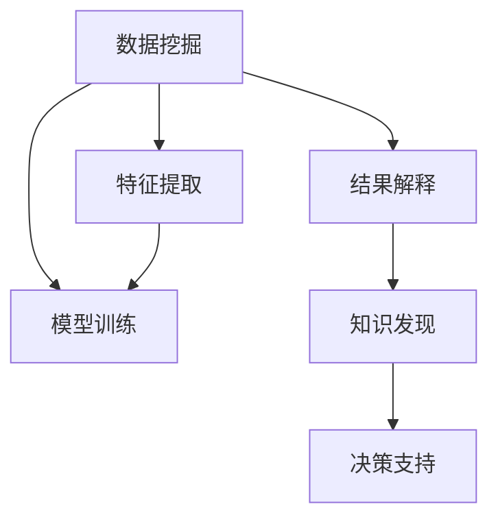

                 

# 从数据挖掘到知识发现：技术演进与应用

> 关键词：数据挖掘,知识发现,机器学习,深度学习,自然语言处理(NLP),计算机视觉(CV),时间序列分析

## 1. 背景介绍

### 1.1 问题由来

在信息爆炸的时代，数据日益成为各种应用的核心资产。如何高效、准确地从海量数据中提取有价值的信息，成为各行各业共同面临的挑战。这便引出了数据挖掘(Data Mining)和知识发现(Knowledge Discovery)的概念。

数据挖掘旨在从原始数据中发现有价值的模式、规律和关系，利用机器学习、统计学、人工智能等技术，自动地完成数据预处理、特征提取、模型训练、结果解读等过程。知识发现则更进一步，旨在发现知识中更深层次的含义，揭示数据背后的故事和知识，为决策提供科学依据。

数据挖掘和知识发现有着紧密的联系，前者关注数据处理和挖掘过程，后者关注挖掘结果的解释和应用。两者共同构成了从数据到知识的完整过程，是当前数据科学、人工智能领域的重要研究方向。

### 1.2 问题核心关键点

数据挖掘和知识发现的核心关键点在于，如何设计有效的算法和模型，自动发现数据中蕴含的知识。这一过程主要包括：

1. **数据预处理**：对原始数据进行清洗、归一化、降维等处理，提高数据质量，便于后续的挖掘和分析。
2. **特征提取**：从原始数据中提取有意义的特征，用于训练模型，发现数据规律。
3. **模型选择与训练**：选择合适的算法和模型，利用标注数据或未标注数据进行训练，提取数据模式。
4. **结果解释与验证**：对挖掘结果进行解释，评估其准确性和泛化能力，确保结果可靠。

数据挖掘和知识发现技术已经在金融、医疗、零售、营销、社交网络等多个领域得到了广泛应用，成为提升业务决策水平和运营效率的重要工具。

## 2. 核心概念与联系

### 2.1 核心概念概述

为更好地理解数据挖掘和知识发现过程，本节将介绍几个关键概念：

- **数据挖掘(Data Mining)**：利用机器学习、统计学等技术，从原始数据中提取有价值的模式、规律和关系。
- **知识发现(Knowledge Discovery)**：在数据挖掘的基础上，深入挖掘数据背后的含义，揭示知识结构，为决策提供科学依据。
- **机器学习(Machine Learning)**：通过数据训练模型，学习数据模式，并应用于新的数据集。
- **深度学习(Deep Learning)**：一种特殊的机器学习方法，通过多层次的非线性映射，从原始数据中学习抽象特征。
- **自然语言处理(NLP)**：利用计算机技术，处理、分析和生成人类语言。
- **计算机视觉(CV)**：通过计算机视觉技术，处理、分析和生成视觉数据。
- **时间序列分析(Time Series Analysis)**：利用统计学方法，分析随时间变化的数据序列，预测未来趋势。

这些核心概念之间的逻辑关系可以通过以下Mermaid流程图来展示：



这个流程图展示了数据挖掘和知识发现的核心过程：

1. 数据挖掘首先对原始数据进行预处理和特征提取，然后训练机器学习模型。
2. 结果解释则对模型输出进行解读，揭示数据背后的含义。
3. 知识发现进一步对挖掘结果进行深入挖掘，形成知识结构，并用于决策支持。

## 3. 核心算法原理 & 具体操作步骤
### 3.1 算法原理概述

数据挖掘和知识发现的核心算法包括机器学习和深度学习。这些算法旨在从数据中学习模式和规律，通过模型训练，提取数据特征，揭示知识结构。

在机器学习中，常见的算法包括决策树、支持向量机、随机森林、线性回归、逻辑回归等。这些算法通过定义损失函数，利用优化算法（如梯度下降、随机梯度下降等），最小化损失函数，得到模型参数，从而实现数据模式的学习。

深度学习算法则通过构建多层次的非线性映射，提取数据中的抽象特征。常用的深度学习模型包括卷积神经网络(CNN)、循环神经网络(RNN)、长短时记忆网络(LSTM)、生成对抗网络(GAN)等。这些模型通过反向传播算法，不断更新模型参数，学习数据特征，实现更加复杂的模式识别和预测。

### 3.2 算法步骤详解

数据挖掘和知识发现的过程通常包括以下几个关键步骤：

**Step 1: 数据预处理**
- 数据清洗：去除噪声、异常值等无用数据，保证数据质量。
- 数据归一化：将数据转换到指定范围，便于后续处理。
- 数据降维：通过PCA、LDA等方法，减少数据维度，提高处理效率。

**Step 2: 特征提取**
- 特征选择：选择最具代表性的特征，用于训练模型。
- 特征提取：利用统计学、工程学等方法，从原始数据中提取有意义的特征。

**Step 3: 模型训练**
- 选择模型：根据任务需求，选择合适的机器学习或深度学习模型。
- 训练模型：利用标注数据或未标注数据，训练模型，提取数据模式。
- 评估模型：利用验证集或测试集，评估模型性能，选择最优模型。

**Step 4: 结果解释**
- 特征解释：对模型提取的特征进行解读，揭示数据含义。
- 结果验证：对模型输出结果进行验证，确保结果可靠。
- 知识发现：对挖掘结果进行深入挖掘，发现知识结构，指导决策。

**Step 5: 应用部署**
- 集成应用：将挖掘结果集成到实际应用系统中，进行模型推理。
- 动态更新：根据新数据，动态更新模型，保持模型性能。

### 3.3 算法优缺点

数据挖掘和知识发现技术具有以下优点：

1. **自动化和高效性**：利用算法自动进行数据处理和特征提取，减少人工干预，提高处理效率。
2. **泛化能力强**：通过模型训练，提取数据模式，泛化能力较强，适用于多种数据集。
3. **结果可解释**：通过特征解释和结果验证，可以对挖掘结果进行科学解读，指导决策。

同时，这些技术也存在一些局限性：

1. **数据质量要求高**：对数据质量和预处理要求较高，需要投入大量时间和精力。
2. **模型复杂度高**：部分深度学习模型参数量庞大，训练和推理复杂，需要高性能设备。
3. **过拟合风险**：模型在训练过程中容易过拟合，需要合理选择超参数和优化策略。
4. **结果解释困难**：部分深度学习模型的输出结果难以解释，不利于应用推广。
5. **应用场景受限**：部分算法适用范围有限，需要根据具体问题选择合适算法。

尽管存在这些局限性，但就目前而言，数据挖掘和知识发现技术仍然是处理大数据、高复杂度问题的有效手段。未来相关研究的重点在于如何进一步提升算法的泛化能力、解释能力、处理效率，同时降低对数据质量和计算资源的要求。

### 3.4 算法应用领域

数据挖掘和知识发现技术已经在众多领域得到广泛应用，例如：

- **金融分析**：利用数据挖掘技术，对市场数据进行分析和预测，辅助投资决策。
- **客户细分**：通过聚类分析，对客户进行细分，提供个性化服务。
- **推荐系统**：利用协同过滤、基于内容的推荐算法，为用户推荐产品或内容。
- **自然语言处理**：通过NLP技术，对文本数据进行情感分析、主题分类、实体识别等。
- **计算机视觉**：通过CV技术，进行图像分类、物体检测、图像分割等。
- **时间序列分析**：对随时间变化的数据序列进行分析，进行趋势预测和异常检测。
- **生物信息学**：对生物数据进行分析和挖掘，揭示基因表达、蛋白功能等生物信息。

除了上述这些领域，数据挖掘和知识发现技术还在教育、医疗、城市规划、社交网络等多个领域得到应用，为数据驱动的决策支持提供了重要工具。

## 4. 数学模型和公式 & 详细讲解 & 举例说明

### 4.1 数学模型构建

以线性回归模型为例，详细讲述数据挖掘中的数学模型构建过程。

线性回归模型用于描述自变量和因变量之间的关系，其数学形式如下：

$$
y = \beta_0 + \beta_1 x_1 + \beta_2 x_2 + ... + \beta_n x_n + \epsilon
$$

其中，$y$ 为因变量，$\beta$ 为模型参数，$x$ 为自变量，$\epsilon$ 为随机误差项。

给定训练集 $D = \{(x_i, y_i)\}_{i=1}^N$，线性回归模型的目标是最小化预测误差，即：

$$
\min_{\beta} \sum_{i=1}^N (y_i - f(x_i, \beta))^2
$$

其中，$f(x_i, \beta) = \beta_0 + \beta_1 x_{i,1} + \beta_2 x_{i,2} + ... + \beta_n x_{i,n}$。

### 4.2 公式推导过程

利用梯度下降算法求解上述优化问题，可以得到模型参数的更新公式：

$$
\beta_{j} \leftarrow \beta_{j} - \eta \frac{1}{N} \sum_{i=1}^N 2(x_{i,j} - \hat{x}_{i,j})y_i
$$

其中，$\eta$ 为学习率，$\hat{x}_{i,j}$ 为$x_{i,j}$的预测值。

通过上述公式，线性回归模型在每次迭代中，根据当前参数的梯度，更新模型参数，使预测误差最小化。

### 4.3 案例分析与讲解

以房价预测为例，分析线性回归模型的应用过程：

1. **数据准备**：收集历史房价数据，包括房屋面积、房龄、位置等特征。
2. **数据预处理**：对数据进行清洗、归一化处理。
3. **特征选择**：选择房屋面积、房龄、位置等特征作为自变量。
4. **模型训练**：利用训练集，训练线性回归模型，得到模型参数。
5. **结果验证**：利用测试集，评估模型性能，验证模型泛化能力。
6. **结果解释**：分析模型参数，揭示房价变化趋势和特征关系。
7. **知识发现**：根据模型结果，发现房价变化规律，指导决策。

通过以上步骤，可以完成房价预测的线性回归模型构建，实现对房价的自动预测和知识发现。

## 5. 项目实践：代码实例和详细解释说明

### 5.1 开发环境搭建

在进行数据挖掘和知识发现实践前，我们需要准备好开发环境。以下是使用Python进行Scikit-Learn开发的开发环境配置流程：

1. 安装Anaconda：从官网下载并安装Anaconda，用于创建独立的Python环境。

2. 创建并激活虚拟环境：
```bash
conda create -n sklearn-env python=3.8 
conda activate sklearn-env
```

3. 安装Scikit-Learn：
```bash
conda install scikit-learn
```

4. 安装各类工具包：
```bash
pip install numpy pandas matplotlib scikit-image scikit-learn
```

完成上述步骤后，即可在`sklearn-env`环境中开始项目实践。

### 5.2 源代码详细实现

下面以线性回归模型为例，给出使用Scikit-Learn进行数据挖掘的Python代码实现。

```python
from sklearn.linear_model import LinearRegression
from sklearn.metrics import mean_squared_error
import numpy as np
import matplotlib.pyplot as plt

# 准备数据
X = np.array([[1, 2, 3], [4, 5, 6], [7, 8, 9]])
y = np.array([3, 5, 7])

# 训练模型
model = LinearRegression()
model.fit(X, y)

# 预测结果
y_pred = model.predict([[10, 11, 12]])

# 评估模型
mse = mean_squared_error(y, y_pred)
print(f"Mean Squared Error: {mse:.2f}")

# 绘制图像
plt.scatter(X[:, 0], y)
plt.plot(X[:, 0], model.predict(X), color='red')
plt.show()
```

### 5.3 代码解读与分析

让我们再详细解读一下关键代码的实现细节：

1. **数据准备**：
   - 使用NumPy生成训练集 $X$ 和 $y$，其中 $X$ 为特征矩阵，$y$ 为标签向量。

2. **模型训练**：
   - 创建线性回归模型实例，并使用 `fit` 方法进行模型训练。`fit` 方法会自动根据训练集数据，求解模型参数 $\beta$，使预测误差最小化。

3. **结果预测**：
   - 使用 `predict` 方法进行预测，输入新的特征数据，得到预测结果 $y_{pred}$。

4. **结果评估**：
   - 使用 `mean_squared_error` 方法计算预测误差，并输出结果。
   - 绘制预测结果与实际结果的对比图，直观展示模型性能。

通过以上代码，可以完成线性回归模型的完整训练和评估过程。

## 6. 实际应用场景

### 6.1 金融分析

金融领域的数据挖掘技术广泛应用于风险评估、投资策略、市场预测等方面。通过对历史金融数据进行挖掘和分析，可以发现市场趋势、识别风险点，为投资决策提供支持。

在风险评估中，利用数据挖掘技术，对历史数据进行分析，可以识别出高风险的资产和交易策略。例如，通过时间序列分析，发现某个资产的价格波动周期和波动幅度，从而进行风险预警。

在投资策略中，利用聚类分析，将市场数据分为不同类别，寻找潜在的投资机会。例如，通过K-means聚类算法，将股票分为价值型、成长型等不同类别，进行差异化投资。

### 6.2 客户细分

客户细分是市场营销中的重要环节，通过对客户行为数据进行挖掘，可以发现不同客户群体的特征和需求，实现个性化营销和精准营销。

在客户细分中，利用聚类分析，对客户行为数据进行分组，识别出不同客户群体。例如，通过K-means聚类算法，将客户分为高价值客户、潜在客户等不同群体，制定针对性的营销策略。

### 6.3 推荐系统

推荐系统是电商、视频、音乐等平台的核心功能之一，通过挖掘用户行为数据，为用户推荐个性化的产品或内容，提高用户满意度和平台转化率。

在推荐系统中，利用协同过滤和基于内容的推荐算法，为用户推荐商品或内容。例如，通过协同过滤算法，根据用户的历史行为数据，推荐相似商品；通过基于内容的推荐算法，根据商品的特征数据，推荐相关商品。

### 6.4 自然语言处理

自然语言处理是NLP技术的重要分支，通过挖掘和分析文本数据，可以实现情感分析、主题分类、实体识别等任务。

在情感分析中，利用文本分类算法，对客户评论进行分类，识别出负面评论和改进建议。例如，通过情感分析算法，将客户评论分为积极、消极两类，及时发现问题并进行改进。

在主题分类中，利用文本分类算法，对新闻、文章等文本进行分类，识别出不同主题。例如，通过主题分类算法，将新闻文章分为政治、经济、体育等不同主题，进行主题推荐。

### 6.5 计算机视觉

计算机视觉是图像处理和分析的重要技术，通过挖掘和分析图像数据，可以实现物体检测、图像分割、人脸识别等任务。

在物体检测中，利用目标检测算法，对图像中的物体进行识别和定位。例如，通过YOLO算法，对街景图像中的车辆进行检测和定位，提高交通管理效率。

在图像分割中，利用图像分割算法，对图像中的物体进行分割，提取关键区域。例如，通过图像分割算法，对医疗图像中的病灶区域进行分割，提高诊断准确性。

### 6.6 时间序列分析

时间序列分析是统计学的重要分支，通过挖掘和分析随时间变化的数据序列，可以实现趋势预测、异常检测等任务。

在趋势预测中，利用时间序列预测算法，对历史数据进行建模，预测未来趋势。例如，通过ARIMA算法，对气温变化数据进行建模，预测未来气温变化趋势，指导农业生产。

在异常检测中，利用时间序列异常检测算法，识别出异常数据点。例如，通过孤立森林算法，对股票价格变化数据进行异常检测，及时发现价格波动异常，进行风险预警。

### 6.7 未来应用展望

随着数据挖掘和知识发现技术的不断发展，未来将会有更多应用场景涌现，为各行各业带来创新和变革。

在智慧医疗领域，通过数据挖掘技术，可以发现疾病发展规律，提供个性化治疗方案。例如，通过基因数据挖掘，发现不同基因型患者的疾病发展规律，进行个性化治疗。

在智能城市治理中，通过数据挖掘技术，可以实现交通流量预测、城市灾害预警等功能。例如，通过交通流量数据挖掘，预测城市交通流量变化，优化交通管理。

在智慧教育领域，通过数据挖掘技术，可以发现学生的学习行为规律，提供个性化学习建议。例如，通过学习行为数据挖掘，发现学生的学习偏好和问题点，进行个性化辅导。

## 7. 工具和资源推荐

### 7.1 学习资源推荐

为了帮助开发者系统掌握数据挖掘和知识发现的技术，这里推荐一些优质的学习资源：

1. 《Python数据科学手册》：一本全面介绍Python数据科学的书籍，包含数据处理、统计分析、机器学习等内容。

2. 《统计学习方法》：李航所著，系统介绍统计学习的基本概念和算法，适合深入学习。

3. 《Deep Learning》：Goodfellow等所著，全面介绍深度学习的基本原理和算法，适合深度学习入门。

4. 《自然语言处理综论》：周志华等所著，全面介绍NLP技术的基本概念和算法，适合NLP入门。

5. 《计算机视觉：模型、学习和推理》：Hinton等所著，全面介绍计算机视觉技术的基本概念和算法，适合CV入门。

6. 《机器学习实战》：Peter Harrington所著，通过实际案例，讲解机器学习的基本概念和算法，适合实战练习。

通过对这些资源的学习实践，相信你一定能够快速掌握数据挖掘和知识发现的精髓，并用于解决实际的业务问题。

### 7.2 开发工具推荐

高效的数据挖掘和知识发现开发离不开优秀的工具支持。以下是几款常用的工具：

1. Python：数据挖掘和知识发现的主流编程语言，具有强大的数据处理和分析能力。

2. Scikit-Learn：Python数据科学库，包含各种机器学习算法和工具，适合快速原型开发。

3. TensorFlow：Google开源的深度学习框架，支持大规模深度学习模型的训练和推理。

4. Keras：基于TensorFlow的高级API，适合快速原型开发和模型训练。

5. PyTorch：Facebook开源的深度学习框架，具有动态计算图和易用性，适合研究和实验。

6. Jupyter Notebook：交互式开发环境，支持代码执行、数据可视化、结果展示，适合数据挖掘和知识发现的实验和报告。

合理利用这些工具，可以显著提升数据挖掘和知识发现的开发效率，加快创新迭代的步伐。

### 7.3 相关论文推荐

数据挖掘和知识发现技术的研究源于学界的持续探索。以下是几篇经典论文，推荐阅读：

1. 《A Taxonomy of Data Mining Techniques and Algorithms》：张大鹏等所著，全面介绍数据挖掘技术的分类和算法。

2. 《Data Mining: Concepts and Techniques》：Jian Mo等所著，全面介绍数据挖掘技术的概念和算法。

3. 《Knowledge Discovery and Data Mining: Theory and Practice》：Wang Ke等所著，全面介绍知识发现的理论和实践。

4. 《Machine Learning: A Probabilistic Perspective》：Murphy等所著，全面介绍机器学习的理论和算法。

5. 《Deep Learning》：Goodfellow等所著，全面介绍深度学习的理论和算法。

6. 《An Introduction to Statistical Learning》：Gareth等所著，全面介绍统计学习的理论和算法。

这些论文代表了大数据挖掘和知识发现技术的发展脉络。通过学习这些前沿成果，可以帮助研究者把握学科前进方向，激发更多的创新灵感。

## 8. 总结：未来发展趋势与挑战

### 8.1 研究成果总结

数据挖掘和知识发现技术在过去几十年中取得了显著进展，广泛应用于金融、医疗、零售、营销、社交网络等多个领域。其核心思想是通过机器学习和深度学习算法，从数据中发现模式和规律，构建知识结构，指导决策。

当前，数据挖掘和知识发现技术已经进入了深度学习时代，基于深度神经网络的模型在图像识别、语音识别、自然语言处理等领域取得了突破性进展。然而，这些技术仍面临一些挑战，如数据质量要求高、模型复杂度高、结果解释困难等。

### 8.2 未来发展趋势

展望未来，数据挖掘和知识发现技术将呈现以下几个发展趋势：

1. **自动化和智能化**：利用自动化工具和智能化算法，提高数据挖掘和知识发现的效率和效果。
2. **多模态融合**：将不同模态的数据进行融合，提高数据挖掘和知识发现的精度和泛化能力。
3. **实时化和在线化**：实现数据挖掘和知识发现的实时化和在线化，提高决策的及时性和准确性。
4. **可解释性**：通过可解释性技术，提高模型的可解释性和可理解性，增强用户信任。
5. **大规模化**：处理大规模数据集，提高数据挖掘和知识发现的效果和效率。

### 8.3 面临的挑战

尽管数据挖掘和知识发现技术已经取得了显著进展，但在迈向更加智能化、普适化应用的过程中，仍面临以下挑战：

1. **数据质量问题**：数据挖掘和知识发现对数据质量要求较高，需要投入大量时间和精力进行数据预处理和清洗。
2. **模型复杂性**：部分深度学习模型参数量庞大，训练和推理复杂，需要高性能设备。
3. **结果解释性**：部分深度学习模型的输出结果难以解释，不利于应用推广。
4. **应用场景受限**：部分算法适用范围有限，需要根据具体问题选择合适算法。
5. **计算资源消耗**：处理大规模数据集需要高性能设备和大规模计算资源。

尽管存在这些挑战，但数据挖掘和知识发现技术仍然是处理大数据、高复杂度问题的有效手段。未来研究需要在提升算法的自动化、智能化、可解释性、泛化能力等方面寻求新的突破。

### 8.4 研究展望

面对数据挖掘和知识发现技术面临的挑战，未来的研究需要在以下几个方面寻求新的突破：

1. **自动化和智能化**：利用自动化工具和智能化算法，提高数据挖掘和知识发现的效率和效果。
2. **多模态融合**：将不同模态的数据进行融合，提高数据挖掘和知识发现的精度和泛化能力。
3. **实时化和在线化**：实现数据挖掘和知识发现的实时化和在线化，提高决策的及时性和准确性。
4. **可解释性**：通过可解释性技术，提高模型的可解释性和可理解性，增强用户信任。
5. **大规模化**：处理大规模数据集，提高数据挖掘和知识发现的效果和效率。

这些研究方向的研究突破，将进一步推动数据挖掘和知识发现技术的发展，为各行各业带来更多创新和变革。

## 9. 附录：常见问题与解答

**Q1: 数据挖掘和知识发现有什么区别？**

A: 数据挖掘和知识发现都是从数据中提取有用信息的过程，但两者侧重点有所不同。数据挖掘更注重发现数据中的模式和规律，具有较强的目标导向性，如预测、分类、聚类等。而知识发现则更注重揭示数据背后的含义，发现知识结构，具有较强的探索性，如关联规则挖掘、异常检测等。

**Q2: 数据挖掘和知识发现有哪些主流算法？**

A: 数据挖掘和知识发现的主流算法包括：
- 分类算法：决策树、支持向量机、随机森林等。
- 聚类算法：K-means、层次聚类等。
- 关联规则挖掘算法：Apriori、FP-growth等。
- 异常检测算法：孤立森林、LOF等。
- 预测算法：线性回归、逻辑回归、随机森林等。

**Q3: 如何选择合适的数据挖掘和知识发现算法？**

A: 选择算法需要根据具体任务需求和数据特点进行。通常，分类和预测任务适合使用分类算法和回归算法；聚类任务适合使用聚类算法；关联规则挖掘适合使用Apriori等算法；异常检测适合使用孤立森林等算法。

**Q4: 如何提高数据挖掘和知识发现算法的泛化能力？**

A: 提高算法的泛化能力可以通过以下几个方法：
- 增加数据量，提高模型泛化能力。
- 使用正则化技术，如L2正则、Dropout等，防止过拟合。
- 选择合适的模型，避免过度拟合。
- 进行交叉验证，评估模型性能。
- 使用集成学习，提高模型泛化能力。

**Q5: 如何提升数据挖掘和知识发现算法的可解释性？**

A: 提升算法的可解释性可以通过以下几个方法：
- 选择可解释性高的模型，如决策树、逻辑回归等。
- 使用特征重要性排序，揭示特征对模型的影响。
- 使用部分可解释性方法，如LIME、SHAP等。
- 进行可视化分析，揭示模型输出。

这些方法可以帮助提高算法的可解释性和可理解性，增强用户信任和决策支持。

---

作者：禅与计算机程序设计艺术 / Zen and the Art of Computer Programming

