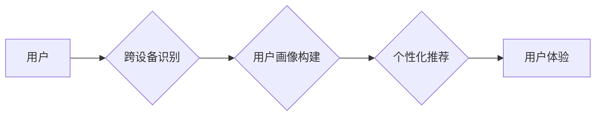

                 

## AI大模型如何提升电商平台的跨设备用户体验一致性

> 关键词：AI大模型、电商平台、跨设备体验、用户一致性、个性化推荐、自然语言处理、机器学习、深度学习、多模态融合

## 1. 背景介绍

随着移动互联网的普及和智能设备的不断发展，用户在购物过程中频繁地切换不同设备，例如从手机到平板电脑，再到电脑。电商平台需要提供跨设备一致的用户体验，以确保用户在任何设备上都能享受到流畅、便捷、个性化的购物体验。然而，跨设备用户体验的实现面临着诸多挑战，例如用户数据孤岛、设备差异、个性化推荐的精准度等。

传统的电商平台通常采用基于cookie和设备标识的跨设备识别技术，但这些技术存在着隐私问题和识别率低的问题。随着AI技术的快速发展，大模型技术为跨设备用户体验的提升提供了新的解决方案。

## 2. 核心概念与联系

**2.1 核心概念**

* **AI大模型:** 指的是在海量数据上训练的具有强大泛化能力的深度学习模型，能够处理复杂的任务，例如自然语言理解、图像识别、语音合成等。
* **跨设备用户体验:** 指的是用户在不同设备上使用电商平台时，能够享受到一致的体验，包括账户信息、购物历史、个性化推荐等。
* **用户一致性:** 指的是用户在不同设备上使用电商平台时，能够保持相同的身份和个性化设置。

**2.2 架构图**



**2.3 核心联系**

AI大模型可以帮助电商平台实现跨设备用户体验的一致性，主要通过以下方式：

* **跨设备识别:** 利用AI大模型对用户行为、设备特征等进行分析，实现更精准的用户识别，即使用户在不同设备上登录，也能保持一致的用户身份。
* **用户画像构建:** 基于AI大模型对用户数据进行分析，构建更全面的用户画像，包括用户的兴趣爱好、购买习惯、偏好设备等，为个性化推荐提供数据支持。
* **个性化推荐:** 利用AI大模型对用户画像进行分析，推荐更符合用户需求的商品和服务，提升用户购物体验。

## 3. 核心算法原理 & 具体操作步骤

**3.1 算法原理概述**

跨设备用户识别主要基于以下算法原理：

* **深度学习:** 利用深度神经网络对用户行为、设备特征等进行特征提取和学习，识别用户跨设备的关联性。
* **联邦学习:** 将用户数据分散存储在各个设备上，通过模型训练和参数更新，实现用户数据隐私保护的同时，提升跨设备识别精度。
* **多模态融合:** 将用户行为、设备特征、用户画像等多模态数据融合，构建更全面的用户特征，提升跨设备识别准确率。

**3.2 算法步骤详解**

1. **数据收集:** 收集用户在不同设备上的行为数据，例如浏览记录、购买记录、搜索记录、设备信息等。
2. **数据预处理:** 对收集到的数据进行清洗、转换、编码等预处理，使其能够被AI模型所接受。
3. **特征提取:** 利用深度学习模型对用户数据进行特征提取，例如用户行为特征、设备特征、用户画像特征等。
4. **模型训练:** 利用训练数据对跨设备识别模型进行训练，例如使用深度神经网络、联邦学习算法等。
5. **模型评估:** 利用测试数据对训练好的模型进行评估，例如计算识别准确率、召回率等指标。
6. **模型部署:** 将训练好的模型部署到电商平台，实现跨设备用户识别功能。

**3.3 算法优缺点**

* **优点:** 
    * 识别精度高，能够识别用户在不同设备上的关联性。
    * 数据隐私保护好，能够保护用户数据安全。
    * 可扩展性强，能够适应不同类型的设备和用户数据。
* **缺点:** 
    * 训练数据量大，需要大量的用户数据进行训练。
    * 模型训练复杂，需要专业的技术人员进行操作。
    * 计算资源消耗大，需要强大的计算能力进行模型训练和部署。

**3.4 算法应用领域**

* **电商平台:** 实现跨设备用户识别，提供个性化推荐、用户画像构建等服务。
* **社交媒体:** 识别用户在不同平台上的账号关联性，提供更全面的用户体验。
* **广告投放:** 识别用户在不同设备上的广告行为，进行精准广告投放。

## 4. 数学模型和公式 & 详细讲解 & 举例说明

**4.1 数学模型构建**

跨设备用户识别模型可以构建为一个多分类问题，其中每个类别代表一个用户。模型的目标是根据用户的行为数据和设备特征，预测用户所属的类别。

**4.2 公式推导过程**

假设用户行为数据和设备特征可以表示为一个向量 $x = (x_1, x_2, ..., x_n)$，其中 $n$ 是特征的数量。模型可以使用一个多层感知机 (MLP) 来进行预测，其输出层包含 $k$ 个神经元，分别对应 $k$ 个用户类别。

MLP 的输出可以表示为：

$$
y_i = \sigma(W_3 \cdot \sigma(W_2 \cdot \sigma(W_1 \cdot x + b_1)) + b_2)
$$

其中：

* $y_i$ 是第 $i$ 个用户类别的预测概率。
* $W_1$, $W_2$, $W_3$ 是权重矩阵。
* $b_1$, $b_2$ 是偏置项。
* $\sigma$ 是激活函数，例如ReLU函数。

模型的损失函数可以采用交叉熵损失函数：

$$
L = -\sum_{i=1}^{k} y_i \log(p_i)
$$

其中：

* $p_i$ 是真实标签为第 $i$ 个类别的概率。

模型的训练目标是最小化损失函数，可以使用梯度下降算法进行优化。

**4.3 案例分析与讲解**

假设电商平台收集到用户的浏览记录、购买记录、设备信息等数据，并将其表示为一个向量 $x$。模型可以根据用户的 $x$ 向量，预测用户属于哪个用户类别，例如“高价值用户”、“忠诚用户”、“新用户”等。

通过对不同用户类别的特征进行分析，电商平台可以针对不同用户群体提供个性化的推荐、营销活动等服务。例如，对“高价值用户”提供更优惠的折扣，对“忠诚用户”提供更个性化的商品推荐，对“新用户”提供更丰富的引导和优惠活动。

## 5. 项目实践：代码实例和详细解释说明

**5.1 开发环境搭建**

* 操作系统：Ubuntu 20.04
* Python 版本：3.8
* 框架：TensorFlow 2.x
* 库：NumPy, Pandas, Scikit-learn

**5.2 源代码详细实现**

```python
import tensorflow as tf
from tensorflow.keras.models import Sequential
from tensorflow.keras.layers import Dense, Dropout

# 构建模型
model = Sequential()
model.add(Dense(128, activation='relu', input_shape=(input_dim,)))
model.add(Dropout(0.2))
model.add(Dense(64, activation='relu'))
model.add(Dropout(0.2))
model.add(Dense(num_classes, activation='softmax'))

# 编译模型
model.compile(optimizer='adam',
              loss='sparse_categorical_crossentropy',
              metrics=['accuracy'])

# 训练模型
model.fit(X_train, y_train, epochs=10, batch_size=32)

# 评估模型
loss, accuracy = model.evaluate(X_test, y_test)
print('Loss:', loss)
print('Accuracy:', accuracy)
```

**5.3 代码解读与分析**

* 代码首先构建了一个多层感知机 (MLP) 模型，包含三个全连接层和一个输出层。
* 每个全连接层都使用ReLU激活函数，Dropout层用于防止过拟合。
* 输出层使用softmax激活函数，将用户数据映射到不同的用户类别概率。
* 模型使用Adam优化器，交叉熵损失函数和准确率作为评估指标。
* 代码最后训练模型，并评估模型的性能。

**5.4 运行结果展示**

训练完成后，可以根据模型的输出结果，预测用户的类别，并进行相应的个性化服务。

## 6. 实际应用场景

**6.1 个性化推荐**

AI大模型可以根据用户的跨设备行为数据，构建更精准的用户画像，并推荐更符合用户需求的商品和服务。例如，如果用户在手机上浏览了某个品牌的服装，在电脑上则搜索了该品牌的优惠活动，AI大模型可以推断出用户对该品牌的兴趣，并推荐该品牌的新款服装或优惠活动。

**6.2 跨设备购物体验**

AI大模型可以帮助电商平台实现跨设备购物体验的一致性，例如用户在手机上添加购物车，可以在电脑上继续购物，无需重新登录或添加商品。

**6.3 用户行为分析**

AI大模型可以对用户的跨设备行为数据进行分析，了解用户的购物习惯、偏好和需求，为电商平台提供数据支持，帮助其制定更有效的营销策略和产品策略。

**6.4 未来应用展望**

随着AI技术的不断发展，AI大模型在电商平台的应用场景将会更加广泛，例如：

* **多模态融合:** 将用户行为数据、设备特征、用户画像等多模态数据融合，构建更全面的用户特征，提升跨设备识别精度和个性化推荐效果。
* **实时个性化:** 利用实时数据流，对用户的行为进行实时分析，提供更精准的个性化推荐和服务。
* **虚拟助手:** 开发基于AI大模型的虚拟助手，帮助用户完成购物任务，例如搜索商品、添加购物车、下单支付等。

## 7. 工具和资源推荐

**7.1 学习资源推荐**

* **书籍:**
    * 《深度学习》 by Ian Goodfellow, Yoshua Bengio, Aaron Courville
    * 《自然语言处理》 by Dan Jurafsky, James H. Martin
* **在线课程:**
    * Coursera: Deep Learning Specialization
    * Udacity: Machine Learning Engineer Nanodegree
* **博客和网站:**
    * TensorFlow Blog: https://blog.tensorflow.org/
    * PyTorch Blog: https://pytorch.org/blog/

**7.2 开发工具推荐**

* **深度学习框架:** TensorFlow, PyTorch
* **数据处理库:** NumPy, Pandas
* **机器学习库:** Scikit-learn
* **云计算平台:** AWS, Azure, GCP

**7.3 相关论文推荐**

* **跨设备用户识别:**
    * "Federated Learning for Cross-Device User Identification"
    * "Cross-Device User Identification via Multi-Modal Deep Learning"
* **个性化推荐:**
    * "Collaborative Filtering for Recommender Systems"
    * "Deep Learning for Recommender Systems"

## 8. 总结：未来发展趋势与挑战

**8.1 研究成果总结**

AI大模型在电商平台的应用取得了显著的成果，例如跨设备用户识别、个性化推荐、用户行为分析等。

**8.2 未来发展趋势**

* **多模态融合:** 将更多类型的用户数据融合，例如文本、图像、视频等，构建更全面的用户特征。
* **实时个性化:** 利用实时数据流，对用户的行为进行实时分析，提供更精准的个性化推荐和服务。
* **解释性AI:** 提升AI模型的解释性，帮助用户理解模型的决策过程。

**8.3 面临的挑战**

* **数据隐私保护:** 跨设备用户识别需要收集和分析用户的敏感数据，如何保护用户隐私是一个重要的挑战。
* **模型可解释性:** AI模型的决策过程往往是复杂的，如何提升模型的可解释性，帮助用户理解模型的决策过程是一个重要的研究方向。
* **计算资源消耗:** 训练大型AI模型需要大量的计算资源，如何降低模型训练成本是一个重要的挑战。

**8.4 研究展望**

未来，AI大模型在电商平台的应用将会更加广泛和深入，例如：

* 开发更精准的个性化推荐系统，为用户提供更符合其需求的商品和服务。
* 利用AI大模型进行用户画像分析，帮助电商平台更好地了解用户的需求和行为。
* 开发基于AI大模型的虚拟助手，帮助用户完成购物任务，提升用户购物体验。


## 9. 附录：常见问题与解答

**9.1 如何保护用户隐私？**

在跨设备用户识别过程中，需要采取以下措施保护用户隐私：

* **数据匿名化:** 对用户数据进行匿名化处理，去除用户个人身份信息。
* **联邦学习:** 利用联邦学习算法，将模型训练在用户的设备上，避免将用户数据集中存储。
* **差分隐私:** 利用差分隐私技术，对用户数据进行扰动，保护用户隐私。

**9.2 如何评估AI模型的性能？**

AI模型的性能可以评估以下指标：

* **准确率:** 模型预测正确的比例。
* **召回率:** 模型识别出所有真实用户的比例。
* **F1-score:** 准确率和召回率的调和平均值。
* **AUC:** 曲线下面积，衡量模型的区分能力。

**9.3 如何部署AI模型？**

AI模型可以部署到以下平台：

* **云计算平台:** AWS, Azure, GCP
* **边缘设备:** 手机、平板电脑、智能电视等

作者：禅与计算机程序设计艺术 / Zen and the Art of Computer Programming 


<end_of_turn>

