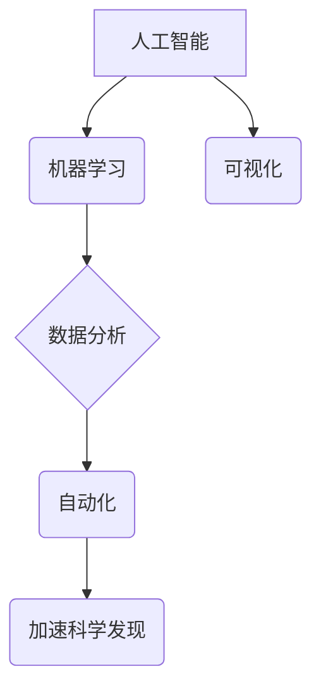

                 

## AI如何改变科学研究方法论

> 关键词：人工智能、科学研究、机器学习、数据分析、自动化、可视化、创新

## 1. 背景介绍

科学研究，作为人类探索世界、理解自然规律和解决问题的重要手段，历经数百年发展，形成了相对固定的方法论体系。然而，随着数据量的爆炸式增长和计算能力的飞速提升，传统的科学研究方法面临着新的挑战和机遇。人工智能（AI）的出现，为科学研究带来了前所未有的变革，正在深刻地改变科学研究方法论，推动科学研究进入一个新的时代。

传统的科学研究方法通常依赖于人类的直觉、经验和观察，并通过实验、数据收集和分析来验证假设。然而，随着科学研究领域越来越复杂，数据量越来越庞大，传统的科学研究方法难以有效应对。AI技术的出现，为科学研究提供了新的工具和方法，可以帮助科学家更有效地处理海量数据、发现隐藏的模式和规律，并加速科学发现的步伐。

## 2. 核心概念与联系

**2.1 核心概念**

* **人工智能 (AI):**  指模拟人类智能行为的计算机系统，包括机器学习、深度学习、自然语言处理等技术。
* **机器学习 (ML):**  一种人工智能技术，通过算法训练模型，使模型能够从数据中学习并做出预测或决策。
* **深度学习 (DL):**  一种机器学习的子集，使用多层神经网络来模拟人类大脑的学习过程，能够处理更复杂的数据和任务。
* **数据分析:**  指从数据中提取有价值信息的过程，包括数据清洗、数据挖掘、数据可视化等。
* **自动化:**  指使用计算机程序自动执行重复性任务，提高效率和准确性。

**2.2 核心概念联系**



**2.3 AI如何改变科学研究方法论**

AI技术可以从以下几个方面改变科学研究方法论：

* **数据驱动的科学研究:** AI可以帮助科学家从海量数据中发现隐藏的模式和规律，推动科学研究更加数据驱动。
* **自动化实验和数据分析:** AI可以自动化执行重复性实验和数据分析任务，提高效率和准确性，释放科学家更多的时间去思考和探索。
* **加速科学发现:** AI可以帮助科学家更快地发现新的科学规律和知识，加速科学发现的步伐。
* **跨学科研究:** AI可以帮助不同学科的科学家进行跨学科合作，促进科学研究的融合发展。

## 3. 核心算法原理 & 具体操作步骤

**3.1 算法原理概述**

机器学习算法的核心原理是通过训练模型，使模型能够从数据中学习并做出预测或决策。常见的机器学习算法包括：

* **监督学习:**  通过标记数据训练模型，使模型能够预测新的数据标签。例如，图像分类、文本分类等。
* **无监督学习:**  通过未标记数据训练模型，使模型能够发现数据中的隐藏结构和模式。例如，聚类分析、降维等。
* **强化学习:**  通过奖励和惩罚机制训练模型，使模型能够在环境中学习最优策略。例如，游戏AI、机器人控制等。

**3.2 算法步骤详解**

1. **数据收集和预处理:** 收集相关数据，并进行清洗、转换和特征工程等预处理工作。
2. **模型选择:** 根据具体任务选择合适的机器学习算法。
3. **模型训练:** 使用训练数据训练模型，调整模型参数，使模型能够准确地预测或决策。
4. **模型评估:** 使用测试数据评估模型的性能，例如准确率、召回率、F1-score等。
5. **模型部署:** 将训练好的模型部署到实际应用场景中，用于预测或决策。

**3.3 算法优缺点**

* **优点:** 能够自动学习数据中的模式，提高效率和准确性，适用于处理海量数据。
* **缺点:** 需要大量的训练数据，模型训练过程可能耗时，对数据质量要求较高。

**3.4 算法应用领域**

* **药物研发:**  预测药物的活性、副作用等。
* **材料科学:**  设计新的材料，预测材料的性能。
* **基因组学:**  分析基因组数据，预测疾病风险。
* **气候科学:**  预测气候变化趋势。

## 4. 数学模型和公式 & 详细讲解 & 举例说明

**4.1 数学模型构建**

机器学习算法通常使用数学模型来表示数据之间的关系。常见的数学模型包括线性回归、逻辑回归、支持向量机等。

**4.2 公式推导过程**

例如，线性回归模型的目标是找到一条直线，使得这条直线与数据点之间的误差最小。

线性回归模型的数学公式如下：

$$y = w_0 + w_1x_1 + w_2x_2 + ... + w_nx_n$$

其中：

* $y$ 是预测值
* $w_0, w_1, w_2, ..., w_n$ 是模型参数
* $x_1, x_2, ..., x_n$ 是输入特征

模型参数的求解可以使用最小二乘法等优化算法。

**4.3 案例分析与讲解**

假设我们想要预测房价，输入特征包括房屋面积、房间数量、地理位置等。我们可以使用线性回归模型来构建一个预测房价的模型。

通过训练数据，我们可以得到模型参数，例如：

* $w_0 = 100000$
* $w_1 = 500$
* $w_2 = 10000$

这意味着，一个面积为100平方米的，房间数量为2的房屋，位于地理位置为1的区域，其预测房价为：

$$y = 100000 + 500 * 100 + 10000 * 2 = 200000$$

## 5. 项目实践：代码实例和详细解释说明

**5.1 开发环境搭建**

可以使用Python语言和相关的机器学习库，例如Scikit-learn、TensorFlow、PyTorch等，搭建机器学习开发环境。

**5.2 源代码详细实现**

```python
from sklearn.linear_model import LinearRegression
from sklearn.model_selection import train_test_split
from sklearn.metrics import mean_squared_error

# 加载数据
data = ...

# 将数据分为训练集和测试集
X_train, X_test, y_train, y_test = train_test_split(data[:, :-1], data[:, -1], test_size=0.2)

# 创建线性回归模型
model = LinearRegression()

# 训练模型
model.fit(X_train, y_train)

# 使用模型预测测试集数据
y_pred = model.predict(X_test)

# 计算模型性能
mse = mean_squared_error(y_test, y_pred)
print(f"Mean Squared Error: {mse}")
```

**5.3 代码解读与分析**

这段代码演示了如何使用Scikit-learn库训练一个线性回归模型来预测房价。

1. 首先加载数据，并将数据分为训练集和测试集。
2. 创建一个线性回归模型实例。
3. 使用训练集训练模型。
4. 使用训练好的模型预测测试集数据。
5. 计算模型性能，例如均方误差。

**5.4 运行结果展示**

运行代码后，会输出模型的性能指标，例如均方误差。

## 6. 实际应用场景

**6.1 药物研发**

AI可以帮助科学家预测药物的活性、副作用等，加速药物研发过程。例如，DeepMind的AlphaFold模型可以预测蛋白质结构，这对于药物研发至关重要。

**6.2 材料科学**

AI可以帮助科学家设计新的材料，预测材料的性能。例如，使用AI可以设计出更轻、更坚固的航空材料。

**6.3 基因组学**

AI可以分析基因组数据，预测疾病风险。例如，使用AI可以预测个体的癌症风险。

**6.4 气候科学**

AI可以预测气候变化趋势，帮助科学家应对气候变化挑战。例如，使用AI可以预测海平面上升的速度。

**6.5 未来应用展望**

AI在科学研究领域的应用前景广阔，未来将有更多新的应用场景出现。例如，AI可以帮助科学家探索宇宙奥秘、开发清洁能源、解决粮食安全问题等。

## 7. 工具和资源推荐

**7.1 学习资源推荐**

* **在线课程:** Coursera、edX、Udacity等平台提供丰富的机器学习课程。
* **书籍:** 《深度学习》、《机器学习实战》等书籍是机器学习学习的经典教材。
* **开源项目:** TensorFlow、PyTorch等开源项目可以帮助学习者深入了解机器学习算法的实现。

**7.2 开发工具推荐**

* **Python:**  机器学习开发的常用语言。
* **Scikit-learn:**  Python机器学习库，提供各种机器学习算法的实现。
* **TensorFlow:**  Google开发的深度学习框架。
* **PyTorch:**  Facebook开发的深度学习框架。

**7.3 相关论文推荐**

* **AlphaFold: A solution to a 50-year-old grand challenge in biology**
* **Attention Is All You Need**
* **ImageNet Classification with Deep Convolutional Neural Networks**

## 8. 总结：未来发展趋势与挑战

**8.1 研究成果总结**

AI技术在科学研究领域的应用取得了显著成果，例如在药物研发、材料科学、基因组学等领域取得了突破。

**8.2 未来发展趋势**

* **更强大的AI模型:**  未来将出现更强大的AI模型，能够处理更复杂的数据和任务。
* **更广泛的应用场景:**  AI将应用于更多科学研究领域，推动科学研究的全面发展。
* **更深入的人机合作:**  AI将与人类科学家更加紧密地合作，共同探索科学奥秘。

**8.3 面临的挑战**

* **数据质量:**  AI模型的性能依赖于数据质量，需要确保数据的准确性和完整性。
* **算法解释性:**  许多AI算法的决策过程难以解释，需要开发更可解释的算法。
* **伦理问题:**  AI技术在科学研究中的应用需要考虑伦理问题，例如数据隐私、算法偏见等。

**8.4 研究展望**

未来，AI技术将继续推动科学研究方法论的变革，为人类探索世界、理解自然规律和解决问题提供新的工具和方法。


## 9. 附录：常见问题与解答

**9.1 如何选择合适的机器学习算法？**

选择合适的机器学习算法取决于具体任务和数据特点。例如，对于分类任务，可以使用逻辑回归、支持向量机等算法；对于回归任务，可以使用线性回归、决策树等算法。

**9.2 如何评估机器学习模型的性能？**

常用的机器学习模型性能评估指标包括准确率、召回率、F1-score、均方误差等。

**9.3 如何处理机器学习模型的过拟合问题？**

过拟合是指模型在训练数据上表现很好，但在测试数据上表现较差。可以采用正则化、交叉验证等方法来解决过拟合问题。


作者：禅与计算机程序设计艺术 / Zen and the Art of Computer Programming 
<end_of_turn>

