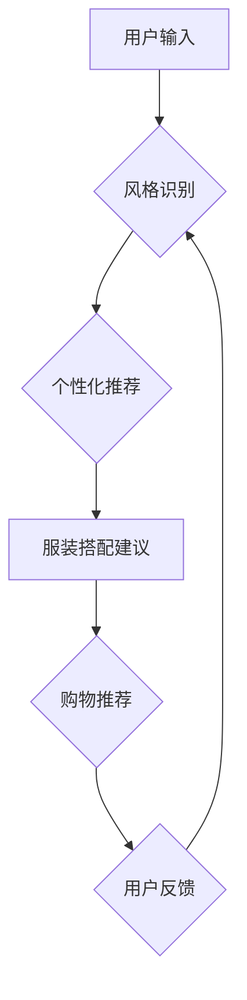

                 

## AI时尚顾问服务：为用户提供个性化、定制化、虚拟时尚顾问和时尚搭配建议

> 关键词：人工智能、时尚顾问、个性化推荐、机器学习、深度学习、计算机视觉、自然语言处理、风格识别

## 1. 背景介绍

时尚行业是一个充满创意和变革的领域，消费者对个性化和定制化的需求日益增长。传统的时尚顾问服务往往昂贵且难以获得，这限制了更多人享受专业的时尚指导。随着人工智能技术的快速发展，AI时尚顾问服务应运而生，为用户提供了一种更便捷、更经济、更个性化的时尚解决方案。

AI时尚顾问服务利用人工智能技术，例如机器学习、深度学习、计算机视觉和自然语言处理，分析用户的个人信息、风格偏好、场合需求等，并根据海量时尚数据，提供个性化的服装搭配建议、风格指导、购物推荐等服务。

## 2. 核心概念与联系

**2.1 核心概念**

* **个性化推荐:** 根据用户的个人信息、喜好、风格等特征，提供定制化的服装搭配建议和购物推荐。
* **风格识别:** 利用计算机视觉技术识别用户的服装风格、颜色偏好、面料材质等，并将其与流行趋势和时尚数据进行关联。
* **自然语言处理:** 理解用户的文字描述、口头表达和情感需求，提供更精准、更人性化的时尚建议。
* **机器学习:** 利用算法从海量时尚数据中学习，不断优化推荐精度和个性化程度。
* **深度学习:** 构建更复杂的模型，例如卷积神经网络和循环神经网络，提高风格识别和图像理解能力。

**2.2 架构图**



## 3. 核心算法原理 & 具体操作步骤

**3.1 算法原理概述**

AI时尚顾问服务的核心算法主要包括：

* **协同过滤:** 基于用户的历史购买记录、评分和浏览行为，推荐与用户相似风格的用户喜欢的商品。
* **内容过滤:** 根据商品的属性、描述和图片特征，推荐与用户偏好相符的商品。
* **深度学习:** 利用卷积神经网络和循环神经网络，从图像数据中学习用户的风格偏好，并生成个性化的服装搭配建议。

**3.2 算法步骤详解**

1. **数据收集:** 收集用户的个人信息、风格偏好、购买记录、浏览历史等数据，以及海量时尚数据，包括服装图片、描述、价格、品牌等。
2. **数据预处理:** 对收集到的数据进行清洗、转换、编码等预处理，使其适合算法训练和使用。
3. **模型训练:** 选择合适的算法模型，例如协同过滤、内容过滤或深度学习模型，并利用训练数据进行模型训练。
4. **模型评估:** 使用测试数据评估模型的性能，例如准确率、召回率、F1-score等指标。
5. **个性化推荐:** 根据用户的输入信息，利用训练好的模型生成个性化的服装搭配建议和购物推荐。
6. **用户反馈:** 收集用户的反馈信息，并将其用于模型优化和改进。

**3.3 算法优缺点**

* **协同过滤:**
    * **优点:** 可以发现用户之间的隐性关联，推荐更精准的商品。
    * **缺点:** 数据稀疏性问题，新用户或新商品难以获得推荐。
* **内容过滤:**
    * **优点:** 不依赖于用户历史数据，可以推荐与用户偏好相符的商品。
    * **缺点:** 难以捕捉用户细微的风格偏好。
* **深度学习:**
    * **优点:** 可以学习更复杂的特征，提高推荐精度和个性化程度。
    * **缺点:** 需要大量的数据进行训练，模型训练成本较高。

**3.4 算法应用领域**

* **电商平台:** 为用户提供个性化的服装推荐、搭配建议和购物指导。
* **时尚杂志:** 利用AI技术分析用户阅读偏好，推荐相关服装和时尚资讯。
* **社交媒体:** 基于用户的社交关系和风格偏好，推荐服装和时尚品牌。
* **虚拟试衣间:** 利用计算机视觉技术，模拟用户穿着不同服装的效果，帮助用户选择合适的服装。

## 4. 数学模型和公式 & 详细讲解 & 举例说明

**4.1 数学模型构建**

AI时尚顾问服务的核心数学模型主要包括：

* **协同过滤模型:** 基于矩阵分解技术，将用户和商品表示为低维向量，并利用相似度计算推荐商品。
* **内容过滤模型:** 基于特征向量和余弦相似度计算，推荐与用户偏好相符的商品。
* **深度学习模型:** 利用神经网络结构，学习用户风格偏好和商品特征之间的映射关系，生成个性化的推荐结果。

**4.2 公式推导过程**

* **协同过滤模型:**

    * 用户-商品评分矩阵: $R \in R^{m \times n}$，其中m为用户数量，n为商品数量。
    * 用户向量: $u_i \in R^k$，其中k为隐特征维度。
    * 商品向量: $v_j \in R^k$。
    * 预测评分: $\hat{r}_{ij} = u_i^T v_j$

* **内容过滤模型:**

    * 用户特征向量: $u_i \in R^d$，其中d为特征维度。
    * 商品特征向量: $v_j \in R^d$。
    * 余弦相似度: $\text{sim}(u_i, v_j) = \frac{u_i^T v_j}{||u_i|| ||v_j||}$

* **深度学习模型:**

    * 使用卷积神经网络 (CNN) 和循环神经网络 (RNN) 学习用户风格偏好和商品特征之间的映射关系。
    * 模型输出: $y = f(W_1x_1 + b_1 + W_2x_2 + b_2 + ... + W_nx_n + b_n)$，其中$x_i$为输入特征，$W_i$为权重矩阵，$b_i$为偏置项，$f$为激活函数。

**4.3 案例分析与讲解**

假设用户A喜欢简约风格的服装，并且经常购买白色和黑色的衣服。AI时尚顾问服务可以利用用户的历史数据和风格偏好，推荐与用户A风格相符的服装，例如白色衬衫、黑色连衣裙、简约设计的牛仔裤等。

## 5. 项目实践：代码实例和详细解释说明

**5.1 开发环境搭建**

* 操作系统: Ubuntu 20.04
* Python 版本: 3.8
* 框架: TensorFlow 2.0
* 库: numpy, pandas, matplotlib, scikit-learn

**5.2 源代码详细实现**

```python
# 协同过滤模型示例代码
import numpy as np
from sklearn.metrics.pairwise import cosine_similarity

# 用户-商品评分矩阵
ratings = np.array([
    [5, 3, 4, 2],
    [4, 5, 2, 3],
    [3, 4, 5, 1],
    [2, 3, 1, 5]
])

# 计算用户相似度
user_similarity = cosine_similarity(ratings)

# 获取用户1的相似用户
similar_users = np.argsort(user_similarity[0])[::-1][1:]

# 推荐商品
recommended_items = np.mean(ratings[similar_users], axis=0)
```

**5.3 代码解读与分析**

* 该代码示例展示了协同过滤模型的基本实现原理。
* 首先，定义用户-商品评分矩阵。
* 然后，利用cosine_similarity函数计算用户之间的相似度。
* 根据用户相似度，获取用户1的相似用户。
* 最后，根据相似用户的评分，计算推荐商品的平均评分。

**5.4 运行结果展示**

运行上述代码，可以得到用户1的推荐商品列表。

## 6. 实际应用场景

AI时尚顾问服务在以下场景中具有广泛的应用前景:

* **电商平台:** 为用户提供个性化的服装推荐、搭配建议和购物指导，提高用户购物体验和转化率。
* **时尚杂志:** 利用AI技术分析用户阅读偏好，推荐相关服装和时尚资讯，提升用户粘性和互动性。
* **社交媒体:** 基于用户的社交关系和风格偏好，推荐服装和时尚品牌，促进用户之间的互动和传播。
* **虚拟试衣间:** 利用计算机视觉技术，模拟用户穿着不同服装的效果，帮助用户选择合适的服装，提高购物决策效率。

**6.4 未来应用展望**

随着人工智能技术的不断发展，AI时尚顾问服务将更加智能化、个性化和人性化。未来，AI时尚顾问服务可能具备以下功能:

* **实时风格分析:** 利用摄像头和深度学习技术，实时分析用户的穿着风格，并提供个性化的搭配建议。
* **虚拟试衣间:** 利用虚拟现实和增强现实技术，构建更加逼真的虚拟试衣间，让用户体验更沉浸式的购物体验。
* **个性化风格定制:** 基于用户的个人信息、风格偏好和场合需求，为用户定制专属的服装风格和搭配方案。
* **智能购物助手:** 帮助用户完成在线购物流程，包括商品搜索、价格比较、下单支付等，提供更加便捷的购物体验。

## 7. 工具和资源推荐

**7.1 学习资源推荐**

* **书籍:**
    * 《深度学习》 - Ian Goodfellow, Yoshua Bengio, Aaron Courville
    * 《机器学习》 - Tom Mitchell
* **在线课程:**
    * Coursera: Machine Learning
    * edX: Deep Learning
* **博客和网站:**
    * Towards Data Science
    * Machine Learning Mastery

**7.2 开发工具推荐**

* **Python:** 
    * TensorFlow
    * PyTorch
    * Keras
* **数据处理工具:**
    * Pandas
    * NumPy
* **可视化工具:**
    * Matplotlib
    * Seaborn

**7.3 相关论文推荐**

* **协同过滤:**
    * "Collaborative Filtering: A User-Based Approach" - Goldberg, D., Nichols, D., Oki, B., & Terry, D. (1992).
* **内容过滤:**
    * "Content-Based Recommendation Systems" - Ricci, F., Rokach, L., Shapira, B., & Kantor, P. B. (2011).
* **深度学习:**
    * "Auto-Encoding Variational Bayes" - Kingma, D. P., & Welling, M. (2013).

## 8. 总结：未来发展趋势与挑战

**8.1 研究成果总结**

AI时尚顾问服务在近年来取得了显著的进展，利用人工智能技术为用户提供更加个性化、定制化的时尚解决方案。

**8.2 未来发展趋势**

* **更精准的推荐:** 利用更先进的深度学习算法和个性化模型，提高推荐的精准度和个性化程度。
* **更丰富的交互方式:** 结合语音识别、自然语言处理和虚拟现实技术，提供更加丰富的交互方式，例如语音购物、虚拟试衣间等。
* **更全面的时尚服务:** 不仅提供服装搭配建议，还包括美妆建议、发型建议、生活方式建议等，打造更加全面的时尚服务平台。

**8.3 面临的挑战**

* **数据获取和隐私保护:** 收集海量时尚数据并保证用户隐私安全是一个重要的挑战。
* **算法模型的复杂性和可解释性:** 深度学习模型的复杂性使得其难以解释和调试，需要进一步研究更可解释的算法模型。
* **用户接受度和信任度:** 提升用户对AI时尚顾问服务的接受度和信任度，需要不断改进服务体验和安全性。

**8.4 研究展望**

未来，AI时尚顾问服务将朝着更加智能化、个性化、人性化的方向发展，为用户提供更加便捷、高效、愉悦的时尚体验。


## 9. 附录：常见问题与解答

**9.1 如何保证用户隐私安全？**

AI时尚顾问服务会严格遵守用户隐私政策，对用户数据进行加密保护，并不会向第三方泄露用户个人信息。

**9.2 如何提高推荐的精准度？**

可以通过以下方式提高推荐的精准度:

* 收集更丰富、更准确的用户数据。
* 利用更先进的深度学习算法和个性化模型。
* 结合用户反馈信息，不断优化推荐算法。

**9.3 AI时尚顾问服务是否会取代传统时尚顾问？**

AI时尚顾问服务可以作为传统时尚顾问的补充，为用户提供更加便捷、高效的时尚解决方案。但AI无法完全替代人类的专业知识和情感理解，传统时尚顾问仍然在一些特定场景中发挥着重要作用。

作者：禅与计算机程序设计艺术 / Zen and the Art of Computer Programming 


<end_of_turn>

