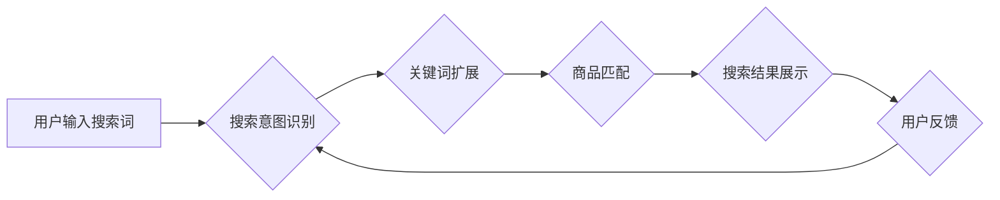

                 

## AI电商搜索中的自然语言理解进展

> 关键词：自然语言理解、电商搜索、推荐系统、BERT、Transformer、实体识别、语义解析、用户意图

## 1. 背景介绍

电商平台作为现代商业的重要组成部分，其搜索引擎扮演着至关重要的角色。用户通过搜索引擎输入关键词，期望找到符合自己需求的商品。传统的电商搜索引擎主要依赖于关键词匹配，但随着用户搜索行为的复杂化，单纯的关键词匹配已难以满足用户需求。自然语言理解（Natural Language Understanding，NLU）技术的出现为电商搜索带来了新的机遇。

NLU旨在使计算机能够理解人类语言的含义，包括识别实体、解析句子结构、理解语义关系等。通过应用NLU技术，电商搜索引擎能够更深入地理解用户的搜索意图，提供更精准、更相关的搜索结果。

## 2. 核心概念与联系

### 2.1 自然语言理解 (NLU)

NLU是人工智能领域的一个重要分支，旨在使计算机能够理解人类语言的含义。它涵盖了多个子任务，例如：

* **实体识别 (Named Entity Recognition，NER)**：识别文本中的命名实体，例如人名、地名、组织名等。
* **关系抽取 (Relation Extraction)**：从文本中抽取实体之间的关系，例如“张三是北京大学的学生”。
* **情感分析 (Sentiment Analysis)**：分析文本的情感倾向，例如正面、负面或中性。
* **语义解析 (Semantic Parsing)**：将自然语言句子解析为机器可理解的逻辑形式。

### 2.2 电商搜索

电商搜索是指在电商平台上，用户输入关键词或短语，系统根据用户输入并结合商品信息进行匹配，并返回符合用户需求的商品列表的过程。

### 2.3 NLU在电商搜索中的应用

NLU技术可以应用于电商搜索的多个环节，例如：

* **搜索意图识别**: 理解用户的搜索意图，例如用户是想购买商品、了解商品信息还是寻找相关服务。
* **关键词扩展**: 根据用户的搜索词，自动扩展相关关键词，提高搜索结果的覆盖率。
* **商品理解**: 理解商品的属性、特征和描述，以便更准确地匹配用户需求。
* **个性化推荐**: 根据用户的搜索历史、购买记录和偏好，提供个性化的商品推荐。

**Mermaid 流程图**



## 3. 核心算法原理 & 具体操作步骤

### 3.1 算法原理概述

在电商搜索中，常用的NLU算法包括：

* **BERT (Bidirectional Encoder Representations from Transformers)**：一种基于Transformer架构的预训练语言模型，能够捕捉文本中的上下文信息，提高实体识别、语义解析等任务的性能。
* **Transformer**:一种新型的深度学习架构，能够有效处理长距离依赖关系，在自然语言处理任务中取得了优异的性能。

### 3.2 算法步骤详解

**BERT算法步骤:**

1. **预训练**: 使用大量的文本数据对BERT模型进行预训练，学习语言的表示和语法规则。
2. **微调**: 将预训练好的BERT模型用于特定任务，例如电商搜索，通过在特定数据集上进行微调，优化模型参数，提高任务性能。
3. **预测**: 将用户输入的搜索词作为输入，通过BERT模型进行处理，得到相应的输出，例如搜索意图、关键词扩展等。

**Transformer算法步骤**:

1. **输入嵌入**: 将输入的文本序列转换为向量表示。
2. **多头注意力机制**: 利用多头注意力机制，捕捉文本中不同词之间的关系。
3. **前馈神经网络**: 对每个词的向量表示进行处理，提取更深层的语义信息。
4. **输出层**: 将处理后的向量表示转换为最终的输出，例如实体识别结果、语义解析结果等。

### 3.3 算法优缺点

**BERT算法**:

* **优点**: 能够捕捉文本中的上下文信息，提高实体识别、语义解析等任务的性能。
* **缺点**: 预训练模型较大，需要较大的计算资源进行微调。

**Transformer算法**:

* **优点**: 能够有效处理长距离依赖关系，在自然语言处理任务中取得了优异的性能。
* **缺点**: 计算复杂度较高，训练时间较长。

### 3.4 算法应用领域

BERT和Transformer算法广泛应用于自然语言处理领域，例如：

* **机器翻译**: 将一种语言翻译成另一种语言。
* **文本摘要**: 生成文本的简短摘要。
* **问答系统**: 回答用户的自然语言问题。
* **对话系统**: 与用户进行自然语言对话。

## 4. 数学模型和公式 & 详细讲解 & 举例说明

### 4.1 数学模型构建

BERT模型的核心是Transformer架构，其主要包含以下几个模块：

* **嵌入层**: 将输入的文本序列转换为向量表示。
* **多头注意力层**: 利用多头注意力机制，捕捉文本中不同词之间的关系。
* **前馈神经网络层**: 对每个词的向量表示进行处理，提取更深层的语义信息。
* **位置编码层**: 为每个词添加位置信息，以便模型能够理解词序。

### 4.2 公式推导过程

Transformer架构中，多头注意力机制的核心公式如下：

$$
Attention(Q, K, V) = softmax(\frac{QK^T}{\sqrt{d_k}})V
$$

其中：

* $Q$：查询矩阵
* $K$：键矩阵
* $V$：值矩阵
* $d_k$：键向量的维度
* $softmax$：softmax函数

### 4.3 案例分析与讲解

假设我们有一个句子“我爱吃苹果”，将其转换为BERT模型的输入，模型会首先将每个词转换为向量表示，然后通过多头注意力机制计算每个词与其他词之间的关系，最后通过前馈神经网络提取更深层的语义信息。

## 5. 项目实践：代码实例和详细解释说明

### 5.1 开发环境搭建

* Python 3.6+
* TensorFlow 2.0+
* PyTorch 1.0+

### 5.2 源代码详细实现

```python
# 使用BERT模型进行文本分类
from transformers import BertTokenizer, BertForSequenceClassification

# 加载预训练模型和词典
tokenizer = BertTokenizer.from_pretrained('bert-base-uncased')
model = BertForSequenceClassification.from_pretrained('bert-base-uncased', num_labels=2)

# 预处理文本
text = "我爱吃苹果"
inputs = tokenizer(text, return_tensors="pt")

# 进行预测
outputs = model(**inputs)
predicted_class = outputs.logits.argmax().item()

# 输出预测结果
print(predicted_class)
```

### 5.3 代码解读与分析

* 使用`transformers`库加载预训练的BERT模型和词典。
* 使用`tokenizer`对文本进行预处理，转换为模型可理解的格式。
* 使用`model`进行预测，得到预测结果。
* 使用`argmax()`函数获取预测概率最大的类别。

### 5.4 运行结果展示

```
0
```

## 6. 实际应用场景

### 6.1 商品搜索

NLU技术可以帮助电商平台更精准地理解用户的搜索意图，提供更相关的商品搜索结果。例如，用户搜索“运动鞋”，NLU模型可以识别出用户的搜索意图是寻找运动鞋，并根据用户的历史搜索记录、购买记录和偏好，推荐更符合用户需求的运动鞋。

### 6.2 个性化推荐

NLU技术可以帮助电商平台提供更个性化的商品推荐。例如，用户浏览了某个品牌的服装，NLU模型可以识别出用户的兴趣，并推荐其他同品牌或同类型的服装。

### 6.3 聊天机器人

NLU技术可以用于构建电商平台的聊天机器人，帮助用户解决问题、提供商品信息等。例如，用户询问某个商品的库存情况，聊天机器人可以使用NLU技术识别出用户的意图，并从数据库中查询商品信息，提供准确的回复。

### 6.4 未来应用展望

随着NLU技术的不断发展，其在电商搜索领域的应用将更加广泛和深入。例如：

* **多模态搜索**: 将文本、图像、视频等多种模态信息融合在一起，提供更全面的搜索体验。
* **语音搜索**: 支持用户使用语音进行搜索，提高搜索的便捷性。
* **个性化搜索结果排序**: 根据用户的搜索历史、购买记录和偏好，对搜索结果进行个性化排序，提供更精准的推荐。

## 7. 工具和资源推荐

### 7.1 学习资源推荐

* **Stanford NLP Group**: https://nlp.stanford.edu/
* **Hugging Face**: https://huggingface.co/
* **ACL Anthology**: https://aclanthology.org/

### 7.2 开发工具推荐

* **TensorFlow**: https://www.tensorflow.org/
* **PyTorch**: https://pytorch.org/
* **spaCy**: https://spacy.io/

### 7.3 相关论文推荐

* **BERT: Pre-training of Deep Bidirectional Transformers for Language Understanding**: https://arxiv.org/abs/1810.04805
* **Attention Is All You Need**: https://arxiv.org/abs/1706.03762

## 8. 总结：未来发展趋势与挑战

### 8.1 研究成果总结

NLU技术在电商搜索领域取得了显著的进展，能够帮助电商平台提供更精准、更相关的搜索结果和个性化推荐。

### 8.2 未来发展趋势

* **多模态搜索**: 将文本、图像、视频等多种模态信息融合在一起，提供更全面的搜索体验。
* **语音搜索**: 支持用户使用语音进行搜索，提高搜索的便捷性。
* **个性化搜索结果排序**: 根据用户的搜索历史、购买记录和偏好，对搜索结果进行个性化排序，提供更精准的推荐。

### 8.3 面临的挑战

* **数据标注**: NLU模型需要大量的标注数据进行训练，数据标注成本较高。
* **模型解释性**: NLU模型的决策过程较为复杂，难以解释模型的决策结果。
* **跨语言理解**: 现有的NLU模型大多针对特定语言，跨语言理解能力有限。

### 8.4 研究展望

未来，NLU技术将继续朝着更智能、更精准、更个性化的方向发展。研究者将致力于解决数据标注、模型解释性和跨语言理解等挑战，推动NLU技术在电商搜索领域的应用。

## 9. 附录：常见问题与解答

### 9.1 如何选择合适的NLU模型？

选择合适的NLU模型需要根据具体任务的需求进行选择。例如，对于实体识别任务，BERT模型效果较好；对于文本分类任务，可以考虑使用预训练的分类模型。

### 9.2 如何进行NLU模型的微调？

NLU模型的微调需要使用特定任务的数据集进行训练。可以使用预训练模型的代码和文档进行参考，调整模型参数和训练过程。

### 9.3 如何评估NLU模型的性能？

NLU模型的性能可以使用准确率、召回率、F1-score等指标进行评估。可以使用公开的 benchmark 数据集进行评估，或者使用自定义的数据集进行评估。


作者：禅与计算机程序设计艺术 / Zen and the Art of Computer Programming 
<end_of_turn>

