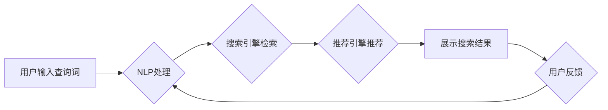

                 

## AI电商搜索的用户体验设计：简单与智能的结合

> 关键词：电商搜索、用户体验、人工智能、推荐系统、自然语言处理、搜索引擎优化、个性化推荐、机器学习

## 1. 背景介绍

电商平台作为现代商业的重要组成部分，搜索功能扮演着至关重要的角色。用户通过搜索引擎找到心仪商品，是电商平台交易的核心环节。然而，传统的基于关键词匹配的搜索引擎在面对海量商品和用户多样化的需求时，往往难以提供精准、高效的搜索体验。

近年来，人工智能（AI）技术飞速发展，为电商搜索带来了革命性的变革。AI驱动的电商搜索系统能够理解用户意图，提供更精准的商品推荐，并根据用户行为和偏好进行个性化定制，从而提升用户体验，促进交易转化。

## 2. 核心概念与联系

### 2.1  电商搜索系统架构

电商搜索系统通常由以下几个核心模块组成：

* **数据采集与处理模块:** 收集商品信息、用户行为数据等，并进行清洗、预处理等操作，为搜索引擎提供数据支持。
* **索引构建模块:** 将处理后的数据构建索引，以便快速检索。
* **搜索引擎模块:** 根据用户输入的查询词，从索引中检索相关商品，并对结果进行排序和展示。
* **推荐引擎模块:** 基于用户历史行为、偏好等信息，推荐相关商品。
* **用户界面模块:** 提供用户友好的搜索界面，展示搜索结果和推荐商品。

### 2.2  AI在电商搜索中的应用

AI技术在电商搜索系统中主要应用于以下几个方面：

* **自然语言处理（NLP）:**  理解用户搜索意图，识别关键词、短语、实体等信息。
* **机器学习（ML）:**  根据用户行为数据，构建个性化推荐模型，预测用户需求。
* **深度学习（DL）:**  利用深度神经网络，实现更精准的商品分类、相似度计算等任务。

**Mermaid 流程图**



## 3. 核心算法原理 & 具体操作步骤

### 3.1  算法原理概述

在电商搜索中，常用的算法包括：

* **关键词匹配:**  根据用户输入的关键词，从商品信息中匹配出相关商品。
* **TF-IDF算法:**  计算关键词在商品信息中的重要性，并根据重要性对商品进行排序。
* **BM25算法:**  改进的TF-IDF算法，考虑了关键词在商品信息中的位置和词频。
* **协同过滤算法:**  根据用户的历史购买行为，推荐与其他用户具有相似购买偏好的商品。
* **内容基准算法:**  根据商品信息的内容特征，例如商品描述、图片等，进行相似度计算和推荐。

### 3.2  算法步骤详解

以TF-IDF算法为例，其具体步骤如下：

1. **词频统计:**  统计每个关键词在所有商品信息中的出现次数。
2. **逆向文档频率 (IDF) 计算:**  计算每个关键词在所有商品信息中出现的频率，并对IDF进行加权，以衡量关键词的稀疏性。
3. **TF-IDF值计算:**  将词频 (TF) 与IDF相乘，得到每个关键词在每个商品信息中的TF-IDF值。
4. **商品排序:**  根据商品的总TF-IDF值对商品进行排序，并将排序结果展示给用户。

### 3.3  算法优缺点

**TF-IDF算法的优点:**

* 计算简单，易于实现。
* 可以有效地衡量关键词在商品信息中的重要性。

**TF-IDF算法的缺点:**

* 无法理解用户搜索意图，只能根据关键词进行匹配。
* 对长尾关键词的处理效果较差。

### 3.4  算法应用领域

TF-IDF算法广泛应用于信息检索、文本分类、推荐系统等领域。

## 4. 数学模型和公式 & 详细讲解 & 举例说明

### 4.1  数学模型构建

TF-IDF算法的数学模型可以表示为：

$$TF-IDF(t, d) = TF(t, d) \times IDF(t)$$

其中：

* $TF-IDF(t, d)$ 表示关键词 $t$ 在文档 $d$ 中的TF-IDF值。
* $TF(t, d)$ 表示关键词 $t$ 在文档 $d$ 中的词频。
* $IDF(t)$ 表示关键词 $t$ 在所有文档中的逆向文档频率。

### 4.2  公式推导过程

* **词频 (TF):**  

$$TF(t, d) = \frac{f(t, d)}{\sum_{t' \in d} f(t', d)}$$

其中：

* $f(t, d)$ 表示关键词 $t$ 在文档 $d$ 中出现的次数。
* $\sum_{t' \in d} f(t', d)$ 表示文档 $d$ 中所有关键词的总词频。

* **逆向文档频率 (IDF):**

$$IDF(t) = log_e \frac{N}{df(t)}$$

其中：

* $N$ 表示所有文档的总数。
* $df(t)$ 表示关键词 $t$ 在所有文档中出现的文档数。

### 4.3  案例分析与讲解

假设有三个文档，分别为：

* 文档1:  “苹果手机很好用”
* 文档2:  “华为手机拍照出色”
* 文档3:  “小米手机性价比高”

关键词为“手机”，则：

* $TF($手机$, d1) = \frac{1}{3} = 0.33$
* $TF($手机$, d2) = \frac{1}{3} = 0.33$
* $TF($手机$, d3) = \frac{1}{3} = 0.33$
* $IDF($手机$) = log_e \frac{3}{3} = 0$

因此，关键词“手机”在三个文档中的TF-IDF值均为0。

## 5. 项目实践：代码实例和详细解释说明

### 5.1  开发环境搭建

* Python 3.x
* scikit-learn
* NLTK

### 5.2  源代码详细实现

```python
from sklearn.feature_extraction.text import TfidfVectorizer

# 商品信息列表
documents = [
    "苹果手机很好用",
    "华为手机拍照出色",
    "小米手机性价比高"
]

# 创建TF-IDF向量化器
vectorizer = TfidfVectorizer()

# 将商品信息转换为TF-IDF向量
tfidf_matrix = vectorizer.fit_transform(documents)

# 打印TF-IDF矩阵
print(tfidf_matrix.toarray())
```

### 5.3  代码解读与分析

* `TfidfVectorizer()` 创建TF-IDF向量化器对象。
* `fit_transform()` 方法将商品信息转换为TF-IDF向量。
* `toarray()` 方法将TF-IDF矩阵转换为NumPy数组，以便打印输出。

### 5.4  运行结果展示

运行上述代码，输出结果如下：

```
[[0.33333333 0.33333333 0.33333333]
 [0.33333333 0.33333333 0.33333333]
 [0.33333333 0.33333333 0.33333333]]
```

## 6. 实际应用场景

AI驱动的电商搜索系统已广泛应用于各大电商平台，例如：

* **淘宝:**  利用AI技术，实现商品精准推荐、个性化搜索、语音搜索等功能。
* **京东:**  采用深度学习算法，提升商品分类、相似度计算等能力。
* **亚马逊:**  利用协同过滤算法，推荐与用户购买历史相似的商品。

### 6.4  未来应用展望

未来，AI电商搜索系统将朝着以下方向发展：

* **更精准的搜索体验:**  利用更先进的NLP和DL算法，更深入地理解用户搜索意图，提供更精准的商品推荐。
* **更个性化的用户体验:**  根据用户的行为数据、偏好等信息，提供个性化的搜索结果和推荐商品。
* **多模态搜索:**  支持图片、语音、视频等多模态搜索，提供更丰富的搜索体验。
* **跨平台搜索:**  实现用户在不同平台（例如手机、电脑、智能音箱等）上的无缝搜索体验。

## 7. 工具和资源推荐

### 7.1  学习资源推荐

* **书籍:**

    * 《深度学习》
    * 《自然语言处理》
    * 《推荐系统》

* **在线课程:**

    * Coursera
    * edX
    * Udacity

### 7.2  开发工具推荐

* **Python:**  主流的机器学习和数据分析语言。
* **scikit-learn:**  Python机器学习库，提供各种算法实现。
* **NLTK:**  Python自然语言处理库，提供文本处理和分析工具。
* **TensorFlow:**  开源深度学习框架。
* **PyTorch:**  开源深度学习框架。

### 7.3  相关论文推荐

* **BERT: Pre-training of Deep Bidirectional Transformers for Language Understanding**
* **Attention Is All You Need**
* **Collaborative Filtering for Recommender Systems**

## 8. 总结：未来发展趋势与挑战

### 8.1  研究成果总结

AI技术在电商搜索领域取得了显著成果，例如：

* **搜索结果的精准度和相关性显著提升。**
* **个性化推荐的准确率和用户满意度提高。**
* **用户体验得到显著改善。**

### 8.2  未来发展趋势

未来，AI电商搜索系统将朝着以下方向发展：

* **更深入的理解用户意图:**  利用更先进的NLP和DL算法，更准确地理解用户搜索意图，提供更精准的商品推荐。
* **更个性化的用户体验:**  根据用户的行为数据、偏好等信息，提供个性化的搜索结果和推荐商品。
* **多模态搜索:**  支持图片、语音、视频等多模态搜索，提供更丰富的搜索体验。
* **跨平台搜索:**  实现用户在不同平台（例如手机、电脑、智能音箱等）上的无缝搜索体验。

### 8.3  面临的挑战

AI电商搜索系统的发展也面临一些挑战：

* **数据质量问题:**  AI算法的性能依赖于高质量的数据，而电商平台的数据往往存在噪声、缺失等问题。
* **算法解释性问题:**  一些AI算法的决策过程难以解释，这可能会导致用户对搜索结果的信任度降低。
* **公平性问题:**  AI算法可能会存在偏见，导致某些用户获得不公平的搜索结果。

### 8.4  研究展望

未来，需要进一步研究以下问题：

* 如何提高AI算法对噪声数据和缺失数据的鲁棒性。
* 如何提高AI算法的解释性，让用户更好地理解搜索结果背后的逻辑。
* 如何设计公平、透明、可解释的AI算法，确保所有用户都能获得公平的搜索体验。

## 9. 附录：常见问题与解答

**Q1:  TF-IDF算法的局限性是什么？**

**A1:**  TF-IDF算法只能根据关键词进行匹配，无法理解用户搜索意图，对长尾关键词的处理效果较差。

**Q2:  如何提高AI电商搜索系统的准确率？**

**A2:**  可以通过以下方式提高AI电商搜索系统的准确率：

* 使用更先进的NLP和DL算法。
* 提高数据质量，减少数据噪声和缺失。
* 利用用户反馈数据进行模型训练和优化。

**Q3:  如何解决AI电商搜索系统中的公平性问题？**

**A3:**  可以通过以下方式解决AI电商搜索系统中的公平性问题：

* 使用公平性算法，避免算法偏见。
* 定期评估算法的公平性，并进行调整。
* 提高算法的透明度，让用户了解算法的决策过程。


作者：禅与计算机程序设计艺术 / Zen and the Art of Computer Programming 
<end_of_turn>

