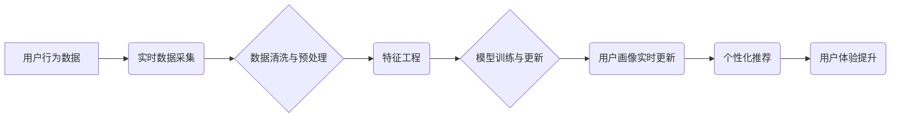

                 

## AI赋能的电商用户画像实时更新与预测系统

> 关键词：电商用户画像、实时更新、预测模型、机器学习、深度学习、数据分析、云计算

## 1. 背景介绍

在当今数据爆炸的时代，电商平台拥有海量用户数据，这些数据蕴藏着丰富的商业价值。用户画像作为电商平台的核心资产之一，能够帮助商家深入了解用户需求、行为模式和偏好，从而实现精准营销、个性化推荐和提升用户体验。然而，传统的静态用户画像难以适应电商平台快速变化的业务环境，无法及时捕捉用户行为的动态变化。

因此，构建一个能够实时更新和预测用户画像的系统显得尤为重要。借助人工智能技术的赋能，我们可以利用实时数据流和先进的机器学习算法，构建一个动态、精准的用户画像系统，为电商平台提供更有效的决策支持。

## 2. 核心概念与联系

### 2.1  电商用户画像

电商用户画像是指通过对用户行为、偏好、属性等多维度数据的分析和挖掘，构建出一个用户特征的综合描述。它可以包括用户的基本信息（如年龄、性别、职业、地理位置等）、购买行为（如购买频率、商品类型、价格敏感度等）、浏览行为（如浏览页面、点击商品、搜索关键词等）、社交行为（如关注店铺、评论商品、分享链接等）等。

### 2.2  实时更新

实时更新是指用户行为数据被收集和处理后，能够及时更新用户画像，反映用户最新的状态和变化。这需要构建一个高效的实时数据处理系统，能够快速地接收、清洗、分析和存储用户数据。

### 2.3  预测模型

预测模型是指利用历史用户数据和机器学习算法，预测用户未来的行为模式和偏好。常见的预测模型包括回归模型、分类模型、聚类模型等。

### 2.4  架构

**电商用户画像实时更新与预测系统架构**



## 3. 核心算法原理 & 具体操作步骤

### 3.1  算法原理概述

该系统主要基于以下核心算法：

* **实时数据流处理:** 利用 Apache Kafka 或 Apache Flink 等流处理框架，实现对用户行为数据的实时采集、清洗和预处理。
* **特征工程:** 通过提取用户行为、属性、上下文等特征，构建用户画像的特征向量。
* **机器学习模型:** 利用深度学习算法，如深度神经网络、循环神经网络等，构建用户画像的预测模型。

### 3.2  算法步骤详解

1. **数据采集:** 从电商平台的各个环节收集用户行为数据，例如：商品浏览记录、购买记录、搜索记录、评论记录、点赞记录等。
2. **数据清洗:** 对收集到的数据进行清洗，去除无效数据、重复数据和错误数据，确保数据质量。
3. **数据预处理:** 对清洗后的数据进行预处理，例如：数据格式转换、数据标准化、数据编码等，使其能够被机器学习模型所接受。
4. **特征工程:** 从用户行为数据中提取特征，例如：用户购买频率、平均购买金额、偏好商品类别、浏览时长等。
5. **模型训练:** 利用提取的特征数据，训练机器学习模型，例如：深度神经网络、循环神经网络等，构建用户画像的预测模型。
6. **模型评估:** 对训练好的模型进行评估，例如：使用准确率、召回率、F1-score等指标，评估模型的性能。
7. **模型部署:** 将经过评估的模型部署到生产环境中，实时更新用户画像。
8. **用户画像分析:** 对实时更新的用户画像进行分析，例如：用户行为趋势分析、用户画像聚类分析等，为电商平台提供决策支持。

### 3.3  算法优缺点

**优点:**

* **实时更新:** 可以及时捕捉用户行为的变化，构建动态的用户画像。
* **精准预测:** 利用机器学习算法，可以更精准地预测用户的未来行为。
* **个性化推荐:** 基于用户画像，可以提供更个性化的商品推荐。
* **数据驱动决策:** 可以为电商平台提供数据驱动的决策支持。

**缺点:**

* **数据依赖:** 需要大量的用户行为数据才能训练出准确的模型。
* **模型复杂:** 需要专业的机器学习知识和技术才能构建和维护模型。
* **隐私安全:** 需要妥善处理用户隐私数据，确保数据安全。

### 3.4  算法应用领域

该算法可以应用于电商平台的多个领域，例如：

* **个性化推荐:** 根据用户的兴趣和偏好，推荐相关的商品。
* **精准营销:** 根据用户的画像特征，进行精准的营销推广。
* **用户行为分析:** 分析用户的浏览、购买、评论等行为，了解用户的需求和偏好。
* **风险控制:** 识别潜在的欺诈行为和恶意用户。

## 4. 数学模型和公式 & 详细讲解 & 举例说明

### 4.1  数学模型构建

用户画像的构建可以看作是一个特征提取和聚类的问题。我们可以使用以下数学模型来构建用户画像：

* **特征提取:** 使用线性回归、逻辑回归等模型，将用户的行为数据转化为特征向量。
* **聚类:** 使用K-means、DBSCAN等聚类算法，将用户按照特征相似度进行分组，形成不同的用户画像。

### 4.2  公式推导过程

**线性回归模型:**

$$
y = \beta_0 + \beta_1x_1 + \beta_2x_2 + ... + \beta_nx_n + \epsilon
$$

其中：

* $y$ 是预测值，例如用户的购买概率。
* $x_1, x_2, ..., x_n$ 是用户的特征向量，例如用户的年龄、收入、购买频率等。
* $\beta_0, \beta_1, ..., \beta_n$ 是模型参数，需要通过训练数据进行学习。
* $\epsilon$ 是误差项。

**K-means聚类算法:**

1. 随机选择K个用户作为初始聚类中心。
2. 将每个用户分配到距离其最近的聚类中心所属的类别。
3. 更新每个聚类中心的坐标为该类别的所有用户的平均值。
4. 重复步骤2和步骤3，直到聚类中心不再变化。

### 4.3  案例分析与讲解

**案例:** 假设我们想预测用户的购买概率，可以使用线性回归模型。我们可以将用户的年龄、收入、购买频率等特征作为输入，预测用户的购买概率。

**举例说明:**

* 用户A的年龄为25岁，收入为5000元，购买频率为10次/月。
* 用户B的年龄为30岁，收入为8000元，购买频率为20次/月。

我们可以使用训练好的线性回归模型，将用户的特征向量输入到模型中，得到用户的购买概率。

## 5. 项目实践：代码实例和详细解释说明

### 5.1  开发环境搭建

该系统可以使用以下开发环境搭建：

* **操作系统:** Linux
* **编程语言:** Python
* **框架:** Apache Kafka、Apache Flink、TensorFlow、PyTorch
* **数据库:** MySQL、MongoDB

### 5.2  源代码详细实现

```python
# 数据采集和预处理
from kafka import KafkaConsumer
from pyspark.sql import SparkSession

# 创建SparkSession
spark = SparkSession.builder.appName("UserPortrait").getOrCreate()

# 创建Kafka消费者
consumer = KafkaConsumer(
    'user_behavior_topic',
    bootstrap_servers=['localhost:9092'],
    auto_offset_reset='earliest',
    group_id='user_portrait_group',
    value_deserializer=lambda x: json.loads(x.decode('utf-8'))
)

# 从Kafka主题中获取数据
for message in consumer:
    user_behavior_data = message.value
    # 数据清洗和预处理
    # ...

# 特征工程
from sklearn.feature_extraction.text import TfidfVectorizer

# 使用TF-IDF向量化用户行为数据
vectorizer = TfidfVectorizer()
user_behavior_features = vectorizer.fit_transform(user_behavior_data)

# 模型训练
from sklearn.ensemble import RandomForestClassifier

# 使用随机森林模型训练用户画像预测模型
model = RandomForestClassifier()
model.fit(user_behavior_features, user_labels)

# 模型部署
# ...

# 用户画像实时更新
# ...
```

### 5.3  代码解读与分析

* **数据采集和预处理:** 使用Kafka消费者从Kafka主题中获取用户行为数据，并进行数据清洗和预处理。
* **特征工程:** 使用TF-IDF向量化用户行为数据，提取用户的特征向量。
* **模型训练:** 使用随机森林模型训练用户画像预测模型。
* **模型部署:** 将训练好的模型部署到生产环境中，实现实时更新用户画像。

### 5.4  运行结果展示

* **用户画像实时更新:** 系统能够实时更新用户的画像，反映用户的最新状态和变化。
* **个性化推荐:** 系统能够根据用户的画像特征，提供个性化的商品推荐。
* **精准营销:** 系统能够根据用户的画像特征，进行精准的营销推广。

## 6. 实际应用场景

### 6.1  电商平台个性化推荐

电商平台可以利用用户画像系统，为用户提供个性化的商品推荐，提高用户体验和转化率。例如，可以根据用户的浏览历史、购买记录和兴趣偏好，推荐相关的商品。

### 6.2  精准营销推广

电商平台可以利用用户画像系统，进行精准的营销推广，提高广告投放效率。例如，可以根据用户的年龄、性别、收入等特征，定向推送广告。

### 6.3  用户行为分析

电商平台可以利用用户画像系统，分析用户的浏览、购买、评论等行为，了解用户的需求和偏好，从而改进产品和服务。

### 6.4  未来应用展望

随着人工智能技术的不断发展，用户画像系统将更加智能化、个性化和精准化。未来，用户画像系统将能够：

* 更准确地预测用户的行为模式和偏好。
* 提供更个性化的商品推荐和服务。
* 更有效地进行精准营销推广。
* 为电商平台提供更全面的数据分析和决策支持。

## 7. 工具和资源推荐

### 7.1  学习资源推荐

* **书籍:**
    * 《深度学习》
    * 《机器学习实战》
    * 《Python机器学习》
* **在线课程:**
    * Coursera
    * edX
    * Udacity

### 7.2  开发工具推荐

* **编程语言:** Python
* **机器学习框架:** TensorFlow、PyTorch
* **流处理框架:** Apache Kafka、Apache Flink
* **数据库:** MySQL、MongoDB

### 7.3  相关论文推荐

* **《基于深度学习的用户画像构建与个性化推荐》**
* **《电商用户画像实时更新与预测系统设计与实现》**
* **《基于机器学习的用户行为分析与预测》**

## 8. 总结：未来发展趋势与挑战

### 8.1  研究成果总结

本文介绍了AI赋能的电商用户画像实时更新与预测系统，阐述了其核心概念、算法原理、实践案例以及未来应用展望。该系统能够利用实时数据流和机器学习算法，构建动态、精准的用户画像，为电商平台提供更有效的决策支持。

### 8.2  未来发展趋势

* **模型更加智能化:** 利用更先进的深度学习算法，构建更智能、更精准的用户画像模型。
* **数据融合更加全面:** 将更多类型的用户数据融合到模型中，例如：社交数据、地理位置数据等，构建更全面的用户画像。
* **个性化程度更高:** 根据用户的个性化需求，提供更精准、更个性化的商品推荐和服务。

### 8.3  面临的挑战

* **数据隐私安全:** 需要妥善处理用户隐私数据，确保数据安全。
* **模型解释性:** 需要提高模型的解释性，让用户能够理解模型是如何生成用户画像的。
* **算法可解释性:** 需要提高算法的可解释性，让用户能够理解算法是如何工作的。

### 8.4  研究展望

未来，我们将继续研究更先进的用户画像算法，提高模型的智能化、精准化和个性化程度，为电商平台提供更有效的决策支持。


## 9. 附录：常见问题与解答

**Q1: 如何保证用户数据的隐私安全？**

**A1:** 我们将采用以下措施来保证用户数据的隐私安全：

* 数据加密：对用户数据进行加密存储和传输。
* 数据匿名化：对用户数据进行匿名处理，去除个人识别信息。
* 数据访问控制：对用户数据进行严格的访问控制，只有授权人员才能访问。

**Q2: 如何提高模型的解释性？**

**A2:** 我们将采用以下方法提高模型的解释性：

* 使用可解释性机器学习算法。
* 使用可视化工具展示模型的决策过程。
* 提供模型的决策规则解释。

**Q3: 如何评估模型的性能？**

**A3:** 我们将使用以下指标来评估模型的性能：

* 准确率
* 召回率
* F1-score
* AUC

**作者：禅与计算机程序设计艺术 / Zen and the Art of Computer Programming**<end_of_turn>

