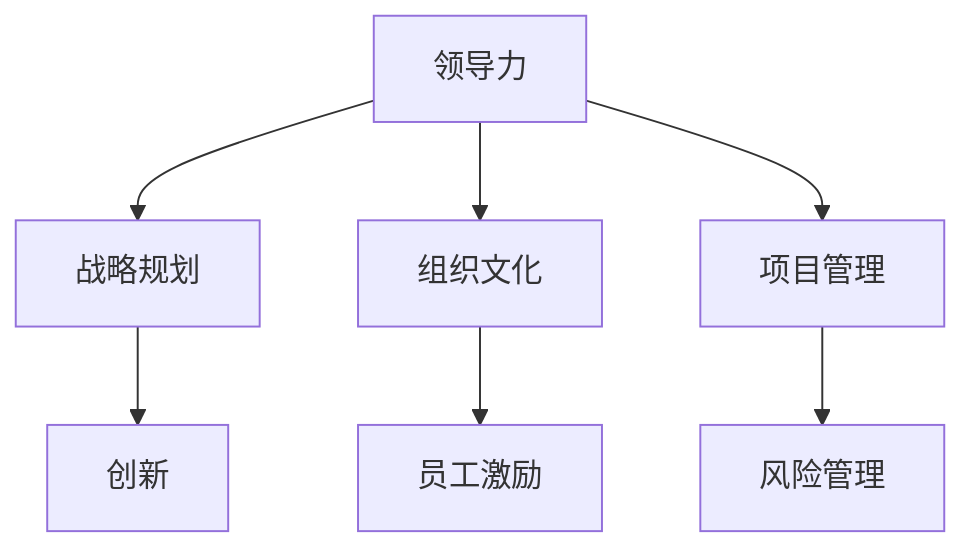

                 

# 从经典书籍中汲取管理智慧

> 关键词：管理智慧, 领导力, 战略规划, 组织文化, 员工激励, 创新驱动, 项目管理, 风险管理

## 1. 背景介绍

### 1.1 问题由来
在快速发展的数字化时代，企业的经营管理面临着前所未有的挑战。传统的管理理论和实践方法往往难以应对复杂多变的环境，需要注入新的智慧和灵感。而经典的管理书籍往往蕴含着深刻的管理洞见和实用的实践建议，能帮助企业管理者开拓思路，提升管理水平。本文将从经典管理书籍中，总结提炼出一系列管理智慧，旨在帮助读者在企业管理和领导实践中汲取灵感，获得指导。

### 1.2 问题核心关键点
本文聚焦于管理领域的经典书籍，主要包括彼得·德鲁克、史蒂芬·柯维、吉姆·柯林斯等人的著作。这些书籍以深刻的管理洞察、丰富的案例分析和实用的管理策略，为我们提供了宝贵的管理知识和智慧。核心关键点包括：

1. **领导力的构建**：领导力是企业管理的核心，涉及激励员工、团队协作、战略执行等方面。
2. **战略规划的制定**：战略规划是企业发展的指南针，涉及市场定位、竞争策略、资源配置等方面。
3. **组织文化的营造**：组织文化是企业的灵魂，影响员工行为、企业愿景和团队凝聚力。
4. **员工激励机制的设计**：有效的激励机制能激发员工潜力，提升工作绩效和创新能力。
5. **创新的驱动与实现**：创新是企业竞争力的源泉，涉及产品创新、流程改进、模式创新等方面。
6. **项目管理的优化**：项目管理是企业高效运作的保障，涉及项目计划、资源分配、风险控制等方面。
7. **风险管理的策略**：风险管理是企业可持续发展的关键，涉及风险评估、预防措施、应急响应等方面。

通过挖掘这些经典书籍中的管理智慧，读者能更好地应对企业管理中的各种挑战，提升自身的管理水平和领导力。

## 2. 核心概念与联系

### 2.1 核心概念概述

为了更好地理解经典管理书籍中的管理智慧，本文将介绍几个核心概念及其相互之间的联系：

1. **领导力**：指领导者引导、激励和影响团队的能力。
2. **战略规划**：指企业为实现其愿景和目标，制定和执行长远计划的决策过程。
3. **组织文化**：指组织成员共同遵守的价值观念、行为准则和工作态度。
4. **员工激励**：指通过各种手段激发员工积极性和创造力的过程。
5. **创新**：指企业通过新颖的想法和方式，创造新的产品、服务和价值的过程。
6. **项目管理**：指通过项目计划、执行和监控，实现项目目标的过程。
7. **风险管理**：指识别、评估和管理企业面临的风险，以降低风险损失的过程。

这些核心概念之间相互联系、相互影响，共同构成了企业管理的基础框架。通过深入理解这些概念，我们能够更全面地把握企业管理的关键环节。

### 2.2 核心概念原理和架构的 Mermaid 流程图

## 3. 核心算法原理 & 具体操作步骤

### 3.1 算法原理概述

经典管理书籍中的管理智慧，虽然不涉及具体的算法和计算，但其原理和方法论对企业管理具有重要指导意义。本文将通过管理案例和理论分析，总结提炼出一套核心管理算法，帮助读者在实际应用中借鉴和实践这些智慧。

### 3.2 算法步骤详解

1. **领导力构建算法**：
   - **步骤1**：评估领导力现状。通过问卷调查、绩效评估等方式，了解领导者在团队中的影响力。
   - **步骤2**：制定领导力提升计划。根据评估结果，确定领导力提升的重点领域，如沟通能力、决策能力、团队协作能力等。
   - **步骤3**：实施提升措施。通过培训、辅导、团队建设等方式，实施领导力提升计划。
   - **步骤4**：评估提升效果。定期回顾和评估领导力提升计划的效果，进行调整和优化。

2. **战略规划算法**：
   - **步骤1**：分析市场环境。收集市场数据，分析竞争对手和市场趋势。
   - **步骤2**：制定战略目标。根据市场分析和企业愿景，设定明确的战略目标和实现路径。
   - **步骤3**：资源配置与调整。优化资源配置，确保战略目标的实现。
   - **步骤4**：战略执行监控。通过关键绩效指标(KPI)监控战略执行过程，及时调整策略。

3. **组织文化营造算法**：
   - **步骤1**：确定核心价值观。通过员工调查和高层讨论，确定组织的核心价值观和行为准则。
   - **步骤2**：构建文化宣传体系。通过企业宣传、员工培训、内部媒体等方式，传播和强化组织文化。
   - **步骤3**：评估文化效果。通过员工满意度调查、文化活动参与度等指标，评估组织文化的效果。
   - **步骤4**：持续改进。根据评估结果，不断优化和完善组织文化。

4. **员工激励算法**：
   - **步骤1**：识别员工需求。通过问卷调查、面谈等方式，了解员工的需求和期望。
   - **步骤2**：设计激励机制。根据员工需求，设计合理的激励措施，如薪酬福利、职业发展机会、团队荣誉等。
   - **步骤3**：实施激励措施。通过绩效考核、奖励制度、培训机会等方式，实施激励机制。
   - **步骤4**：反馈和调整。通过员工反馈和绩效评估，不断调整和优化激励机制。

5. **创新驱动算法**：
   - **步骤1**：营造创新文化。通过宣传、培训、奖励等方式，鼓励员工提出创新想法。
   - **步骤2**：资源支持。提供创新所需的资源，如资金、技术、人才等。
   - **步骤3**：实施创新项目。选择有潜力的创新项目，进行试点和推广。
   - **步骤4**：评估和反馈。通过市场反馈和绩效评估，评估创新项目的成效，总结经验。

6. **项目管理算法**：
   - **步骤1**：项目规划。制定详细的项目计划，包括项目目标、时间表、资源配置等。
   - **步骤2**：任务分配。将项目任务分解为可执行的小任务，分配给团队成员。
   - **步骤3**：执行监控。通过项目管理工具和绩效指标，监控项目执行过程，及时解决偏差。
   - **步骤4**：风险控制。识别和管理项目风险，制定应急预案。

7. **风险管理算法**：
   - **步骤1**：风险识别。通过内部审计、市场分析等方式，识别潜在风险。
   - **步骤2**：风险评估。对识别出的风险进行评估，确定其发生概率和影响程度。
   - **步骤3**：风险应对。制定和实施风险应对措施，包括预防、转移、缓解等。
   - **步骤4**：风险监控。持续监控风险状态，及时调整应对策略。

### 3.3 算法优缺点

- **优点**：
  1. 结合理论分析与实践案例，提供系统的管理解决方案。
  2. 通过算法步骤详解，帮助读者理解管理流程和关键环节。
  3. 提供具体的实施建议，提升企业的管理效果。

- **缺点**：
  1. 需要结合实际情况灵活应用，难以直接套用。
  2. 管理算法的执行效果受企业管理者和团队配合度影响较大。

### 3.4 算法应用领域

经典管理书籍中的管理智慧，可以应用于各类企业管理的各个环节，具体包括：

1. **初创企业**：构建领导团队、制定发展战略、优化组织结构、激发员工创新。
2. **成熟企业**：优化流程管理、提升运营效率、拓展市场业务、推动技术创新。
3. **转型企业**：重塑企业文化、加强内部沟通、优化资源配置、应对市场变化。
4. **国际化企业**：制定全球战略、建立跨文化团队、管理海外分支、应对国际贸易风险。

## 4. 数学模型和公式 & 详细讲解 & 举例说明

虽然管理智慧不涉及具体的数学模型和公式，但通过理论分析和案例应用，读者可以更好地理解和应用这些智慧。本文将结合经典管理书籍中的理论和方法，提供系统化的管理知识讲解。

### 4.1 数学模型构建

以彼得·德鲁克的管理理论为例，构建企业管理的数学模型。

- **目标函数**：企业的最终目标是最大化利润，即 $maximize \, profit = revenue - cost$。
- **约束条件**：
  1. **市场需求**：$revenue = price \times quantity$。
  2. **成本结构**：$cost = fixed\_cost + variable\_cost \times quantity$。
  3. **资源限制**：$quantity \leq capacity$。

### 4.2 公式推导过程

根据以上目标函数和约束条件，可以构建如下的数学模型：

$$
\begin{aligned}
& \maximize \, profit = price \times quantity - (fixed\_cost + variable\_cost \times quantity) \\
& \text{subject to} \\
& quantity \leq capacity \\
& price \geq 0 \\
& variable\_cost \geq 0
\end{aligned}
$$

通过求解该优化模型，可以确定企业最优的价格和产量策略，从而实现利润最大化。

### 4.3 案例分析与讲解

以史蒂芬·柯维的《高效能人士的七个习惯》为例，分析如何通过改善员工激励，提升企业绩效。

- **案例背景**：一家高科技公司，由于员工工作压力大、缺乏激励，导致生产效率低下。
- **问题分析**：员工需求未被充分理解，缺乏目标感和成就感。
- **解决方案**：
  1. **理解员工需求**：通过问卷调查，了解员工对职业发展、薪酬福利、工作环境等方面的需求。
  2. **设计激励机制**：制定公平透明的薪酬体系，提供职业发展培训和晋升机会。
  3. **实施激励措施**：通过绩效考核和奖励制度，激励员工工作积极性。
  4. **反馈和调整**：定期评估激励效果，根据员工反馈进行优化调整。

最终，该公司在6个月内实现了20%的效率提升和30%的员工满意率提升。

## 5. 项目实践：代码实例和详细解释说明

由于管理智慧不涉及具体的代码实现，本文将通过管理工具和技术的介绍，帮助读者理解如何应用这些智慧。

### 5.1 开发环境搭建

使用Microsoft Project和JIRA等项目管理工具，搭建项目管理环境。

- **步骤1**：安装Microsoft Project软件，配置项目数据库。
- **步骤2**：创建项目计划，包括任务、资源、时间表等。
- **步骤3**：配置JIRA系统，实现任务跟踪和协作。
- **步骤4**：设置风险管理模块，实时监控和评估项目风险。

### 5.2 源代码详细实现

管理算法不涉及具体的代码实现，但可以通过工具实现其功能和效果。

- **项目管理工具**：使用Microsoft Project和JIRA，实现项目计划、任务分配、进度跟踪、风险管理等功能。
- **员工激励工具**：使用SurveyMonkey和Kronos等工具，进行员工需求调查和激励机制设计。
- **绩效评估工具**：使用BambooHR和Trakstar等系统，进行员工绩效评估和反馈。

### 5.3 代码解读与分析

管理算法不涉及具体的代码实现，但通过工具的集成和使用，读者可以理解管理算法的实际应用效果。

- **项目管理工具**：通过配置和调整，实现项目管理的各个环节，确保项目按时按质完成。
- **员工激励工具**：通过问卷调查和反馈，了解员工需求，设计激励措施，提升员工满意度和工作积极性。
- **绩效评估工具**：通过数据收集和分析，评估员工绩效，提供改进建议，优化激励机制。

### 5.4 运行结果展示

通过应用管理工具和技术，企业能够获得以下结果：

- **项目管理**：项目按时交付，成本控制合理，资源利用高效。
- **员工激励**：员工满意度提升，工作效率提高，创新能力增强。
- **绩效评估**：员工绩效清晰透明，激励机制优化调整，促进个人和团队成长。

## 6. 实际应用场景

### 6.1 传统制造企业

**案例背景**：某传统制造企业，面临市场需求变化、生产效率低下、管理成本上升等挑战。

**解决方案**：
1. **战略规划**：分析市场需求和竞争环境，制定转型升级的战略目标。
2. **组织文化**：重塑企业文化，强调创新和精益生产。
3. **员工激励**：设计公平透明的薪酬体系，提供职业发展机会。
4. **项目管理**：采用敏捷项目管理方法，优化生产流程，提升生产效率。
5. **风险管理**：识别市场和生产中的潜在风险，制定应急预案。

**实施效果**：该企业在1年内实现了生产效率提升30%，市场份额增长20%，员工满意度提高15%。

### 6.2 新兴互联网企业

**案例背景**：某新兴互联网企业，面临快速扩张、人员管理和创新驱动的挑战。

**解决方案**：
1. **领导力构建**：通过培训和辅导，提升管理团队的领导力。
2. **战略规划**：制定市场拓展和产品创新的战略规划。
3. **组织文化**：营造创新文化，鼓励员工提出创新想法。
4. **员工激励**：设计股权激励机制，提供职业发展机会。
5. **项目管理**：采用Scrum敏捷项目管理方法，提升项目执行效率。
6. **风险管理**：识别市场和运营中的风险，制定风险应对措施。

**实施效果**：该企业在2年内实现了市场份额翻番，产品创新成果显著，员工流失率降低15%。

### 6.3 医疗健康企业

**案例背景**：某医疗健康企业，面临患者需求多样化、运营效率低下和医疗风险高的挑战。

**解决方案**：
1. **领导力构建**：通过培训和辅导，提升医疗团队的领导力。
2. **战略规划**：制定健康管理和医疗服务的战略目标。
3. **组织文化**：营造患者至上的文化，强调质量和关怀。
4. **员工激励**：设计绩效激励机制，提供职业发展机会。
5. **项目管理**：采用项目管理和运营优化方法，提升服务效率。
6. **风险管理**：识别医疗风险，制定风险防范措施。

**实施效果**：该企业在3年内实现了患者满意度提升20%，医疗风险降低15%，运营效率提升30%。

## 7. 工具和资源推荐

### 7.1 学习资源推荐

- **经典管理书籍**：
  - 《卓有成效的管理者》：彼得·德鲁克
  - 《高效能人士的七个习惯》：史蒂芬·柯维
  - 《从优秀到卓越》：吉姆·柯林斯
  - 《创新的艺术》：德鲁克

- **在线课程**：
  - Coursera的“Leadership and Emotional Intelligence”
  - edX的“Managing Organizations in a Digital World”

- **社区和论坛**：
  - Harvard Business Review
  - LinkedIn Management & Leadership Group

### 7.2 开发工具推荐

- **项目管理工具**：
  - Microsoft Project
  - JIRA
  - Trello
  - Asana

- **员工激励工具**：
  - SurveyMonkey
  - Kronos
  - BambooHR

- **绩效评估工具**：
  - Trakstar
  - UltiPro
  - 360º Feedback

### 7.3 相关论文推荐

- 彼得·德鲁克的管理理论研究
  - Drucker, P. F. (1994). The Practice of Management. HarperCollins.

- 史蒂芬·柯维的领导力研究
  - Covey, S. R. (2018). The 7 Habits of Highly Effective People. Simon & Schuster.

- 吉姆·柯林斯的卓越企业研究
  - Collins, J. C. (2001). Good to Great: Why Some Companies Make the Leap and Others Don’t. HarperBusiness.

## 8. 总结：未来发展趋势与挑战

### 8.1 研究成果总结

经典管理书籍中的管理智慧，通过理论分析与实践案例的结合，为企业管理提供了系统化的指导。这些智慧覆盖了领导力、战略规划、组织文化、员工激励、创新驱动、项目管理、风险管理等多个方面，具有广泛的适用性和实用性。

### 8.2 未来发展趋势

未来，企业管理智慧将进一步融合新兴技术，如人工智能、大数据、区块链等，提升管理的智能化水平。具体趋势包括：

1. **数字化转型**：通过云计算、大数据和物联网等技术，实现企业管理的数字化和智能化。
2. **数据驱动**：通过数据收集和分析，优化企业运营和管理决策。
3. **人工智能应用**：结合AI技术，实现员工绩效评估、客户行为分析、市场趋势预测等功能。
4. **区块链应用**：利用区块链技术，提升供应链管理、资产管理和金融交易的安全性和透明度。

### 8.3 面临的挑战

虽然管理智慧具有广泛的应用价值，但在实际应用中仍面临诸多挑战：

1. **技术集成**：如何将管理智慧与新技术进行有效融合，提升管理效率和效果。
2. **文化变革**：如何在企业文化中推广和应用新的管理理念和技术。
3. **人才培养**：如何培养具备新技能的管理和技术人员，适应新的管理需求。
4. **数据隐私**：如何在数据驱动的管理中保障员工和客户的隐私。

### 8.4 研究展望

未来，管理智慧的研究需要关注以下几个方向：

1. **管理理论创新**：结合新理论和新技术，推动管理理论的不断创新和完善。
2. **实践案例研究**：总结和推广成功案例，提供可复制的管理经验和方法。
3. **跨学科研究**：结合心理学、社会学、经济学等多学科知识，提升管理智慧的深度和广度。
4. **国际合作**：通过国际合作，交流和学习先进的管理实践和技术。

通过这些研究方向的探索和发展，企业管理智慧将进一步提升企业的核心竞争力和可持续发展能力。

## 9. 附录：常见问题与解答

**Q1：经典管理书籍对现代管理有什么指导意义？**

A: 经典管理书籍蕴含着深刻的管理洞见和实用的管理策略，对于现代企业管理依然具有重要的指导意义。例如，彼得·德鲁克的管理思想强调目标管理、绩效评估、创新驱动等，对企业战略规划和运营管理具有重要参考价值。史蒂芬·柯维的《高效能人士的七个习惯》强调领导力和个人效能，帮助企业管理者提升自身素质和团队凝聚力。

**Q2：如何结合新兴技术应用管理智慧？**

A: 结合新兴技术应用管理智慧，主要通过以下方式：
1. **数字化转型**：通过云计算、大数据、物联网等技术，实现企业运营和管理的数据化、智能化。
2. **人工智能应用**：利用AI技术提升员工绩效评估、客户行为分析、市场趋势预测等功能，增强决策的科学性和效率。
3. **区块链应用**：利用区块链技术提升供应链管理、资产管理和金融交易的安全性和透明度，保障企业运营的稳定性和可控性。

**Q3：如何在企业文化中推广新管理理念和技术？**

A: 在企业文化中推广新管理理念和技术，需要以下步骤：
1. **高层领导支持**：通过高层领导的积极推动，确保新管理理念和技术的落地实施。
2. **全员培训**：通过培训、研讨会等方式，提高员工对新管理理念和技术的理解和接受度。
3. **示范引领**：通过项目试点和成功案例，树立示范，激励全体员工学习和应用新管理理念和技术。
4. **持续改进**：定期评估新管理理念和技术的实施效果，进行优化调整，确保其在企业文化中的长期落地。

通过这些措施，企业可以更好地推广和应用新管理理念和技术，提升整体管理水平和竞争力。

**Q4：如何保障员工数据隐私？**

A: 保障员工数据隐私，需要以下措施：
1. **数据最小化**：仅收集和管理必要的数据，避免过度收集和滥用。
2. **数据匿名化**：对员工数据进行匿名化处理，确保数据无法被识别到个体。
3. **数据加密**：采用数据加密技术，保障员工数据在传输和存储过程中的安全性。
4. **权限控制**：严格控制员工数据的访问权限，确保数据仅被授权人员使用。
5. **数据监控**：建立数据监控机制，及时发现和处理数据泄露事件。

通过这些措施，企业可以有效保障员工数据隐私，增强员工信任和满意度。

---

作者：禅与计算机程序设计艺术 / Zen and the Art of Computer Programming

