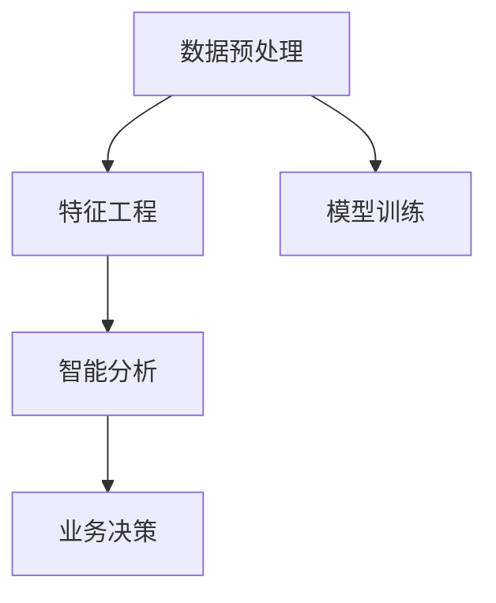

                 

# 企业AI决策支持：Lepton AI的智能分析工具

> 关键词：人工智能决策支持，Lepton AI，智能分析，深度学习，数据挖掘

## 1. 背景介绍

### 1.1 问题由来
在当前数字化转型的大背景下，企业需要不断提升运营效率，降低成本，提升竞争力。然而，传统的数据分析和决策支持系统往往面临数据量大、噪音多、处理复杂等问题，导致决策不够科学、不够快速。如何利用先进的人工智能技术，提升企业决策支持系统的智能化水平，成为当下亟待解决的问题。

Lepton AI作为一款领先的企业级智能分析工具，通过深度学习、数据挖掘和自然语言处理等前沿技术，为企业提供了一套全面、高效、易用的AI决策支持解决方案。

### 1.2 问题核心关键点
Lepton AI的核心优势在于其先进的AI技术架构和智能化分析能力，可以覆盖数据预处理、特征工程、模型训练、智能分析等多个环节，大幅提升企业的决策支持效率和质量。具体来说，关键点包括：

- **数据预处理**：Lepton AI能够自动进行数据清洗、归一化、缺失值处理等预处理操作，确保数据质量。
- **特征工程**：利用自动特征提取和降维技术，高效提取数据中的有用特征，提升模型的泛化能力。
- **模型训练**：支持多种深度学习模型，如神经网络、卷积神经网络、循环神经网络等，灵活适应不同场景需求。
- **智能分析**：提供多种智能分析功能，如关联规则分析、聚类分析、异常检测等，为企业提供更深入的洞察。

## 2. 核心概念与联系

### 2.1 核心概念概述

为更好地理解Lepton AI的工作原理和应用场景，本节将介绍几个密切相关的核心概念：

- **Lepton AI**：Lepton AI是企业级智能分析工具，通过深度学习、数据挖掘等技术，提供智能化的数据预处理、特征工程、模型训练和智能分析等功能。
- **数据预处理**：指对原始数据进行清洗、归一化、缺失值处理等操作，确保数据质量，为后续分析和建模提供良好的数据基础。
- **特征工程**：指通过技术手段自动提取数据中的有用特征，提升模型的泛化能力和准确性。
- **模型训练**：指利用数据训练深度学习模型，获取模型参数，使得模型能够对新数据进行预测或分类。
- **智能分析**：指基于机器学习或深度学习的算法，对数据进行更深入的分析和挖掘，发现潜在的关联、规律和异常。

这些核心概念之间的逻辑关系可以通过以下Mermaid流程图来展示：



这个流程图展示了大数据处理和分析的关键流程，以及Lepton AI在其中扮演的角色。

## 3. 核心算法原理 & 具体操作步骤

### 3.1 算法原理概述

Lepton AI的核心算法原理基于深度学习、数据挖掘和自然语言处理等前沿技术，主要包括以下几个关键步骤：

1. **数据预处理**：利用数据清洗、归一化、缺失值处理等技术，确保数据质量。
2. **特征工程**：通过自动特征提取和降维技术，高效提取数据中的有用特征。
3. **模型训练**：支持多种深度学习模型，如神经网络、卷积神经网络、循环神经网络等，灵活适应不同场景需求。
4. **智能分析**：提供多种智能分析功能，如关联规则分析、聚类分析、异常检测等，为企业提供更深入的洞察。

Lepton AI的设计目标是实现自动化、智能化和可扩展的数据分析，通过深度学习等技术，帮助企业快速、准确地进行决策支持。

### 3.2 算法步骤详解

Lepton AI的具体操作流程如下：

1. **数据准备**：收集和整理企业业务数据，包括交易数据、客户数据、市场数据等，确保数据完整性和准确性。
2. **数据预处理**：使用Lepton AI的数据预处理工具，对数据进行清洗、归一化、缺失值处理等操作，确保数据质量。
3. **特征工程**：利用Lepton AI的自动特征提取和降维技术，高效提取数据中的有用特征，提升模型的泛化能力。
4. **模型训练**：选择适合的深度学习模型，利用Lepton AI提供的模型训练工具，进行模型训练，获取模型参数。
5. **智能分析**：利用Lepton AI提供的智能分析功能，对数据进行更深入的分析和挖掘，发现潜在的关联、规律和异常。
6. **业务决策**：将智能分析的结果应用于企业决策支持，提升业务效率和质量。

### 3.3 算法优缺点

Lepton AI作为一款领先的智能分析工具，具有以下优点：

- **自动化程度高**：通过自动数据预处理和特征工程，大幅降低人工干预，提升数据分析效率。
- **灵活性高**：支持多种深度学习模型和智能分析功能，灵活适应不同场景需求。
- **精度高**：利用深度学习等先进技术，确保模型训练的精度和泛化能力。
- **可视化好**：提供丰富的可视化工具，直观展示分析结果，便于决策者理解。

同时，Lepton AI也存在一些局限性：

- **数据质量依赖**：Lepton AI的效果很大程度上依赖于数据的质量和完整性。如果数据存在噪音或不一致性，会影响分析结果。
- **模型复杂度高**：深度学习模型较为复杂，需要较多的计算资源和时间进行训练。
- **可解释性不足**：深度学习模型通常被视为"黑盒"系统，其内部工作机制难以解释。

尽管如此，Lepton AI在大数据处理和分析领域的领先地位仍然不可动摇，其在企业决策支持中的应用前景广阔。

### 3.4 算法应用领域

Lepton AI的智能分析功能覆盖了多个企业运营场景，包括但不限于：

- **销售预测**：通过时间序列分析、关联规则分析等技术，预测未来销售趋势和客户需求，为企业制定更科学的销售策略。
- **客户细分**：利用聚类分析、情感分析等技术，将客户进行细分，识别不同客户群体的需求和行为特征，实现精准营销。
- **风险评估**：通过异常检测、信用评分等技术，识别潜在的风险点和风险客户，保障企业运营安全。
- **市场分析**：通过文本挖掘、情感分析等技术，分析市场舆情和竞争对手动态，提供市场洞察和竞争策略建议。
- **供应链优化**：通过数据分析和预测，优化供应链管理，提升供应链效率和响应速度。

以上应用场景只是Lepton AI在企业决策支持中的冰山一角，未来随着技术的发展和应用场景的拓展，其影响力将进一步扩大。

## 4. 数学模型和公式 & 详细讲解

### 4.1 数学模型构建

Lepton AI的数学模型主要基于深度学习、数据挖掘等技术，具体包括：

- **神经网络模型**：用于回归、分类、序列预测等任务，通常采用多层感知机(MLP)、卷积神经网络(CNN)、循环神经网络(RNN)等架构。
- **聚类分析**：用于对数据进行分组，通常采用K-means、DBSCAN、层次聚类等算法。
- **关联规则分析**：用于挖掘数据中的关联关系，通常采用Apriori、FP-Growth等算法。
- **异常检测**：用于识别数据中的异常点，通常采用孤立森林、基于密度的聚类等算法。

### 4.2 公式推导过程

以下是Lepton AI中神经网络模型训练的公式推导：

设输入数据为 $\mathbf{x}$，输出数据为 $\mathbf{y}$，神经网络模型为 $f_\theta(\mathbf{x})$，其中 $\theta$ 为模型参数。假设模型训练的损失函数为 $\mathcal{L}$，目标是最小化损失函数，即：

$$
\theta^* = \mathop{\arg\min}_{\theta} \mathcal{L}(f_\theta(\mathbf{x}), \mathbf{y})
$$

常用的损失函数包括均方误差(MSE)、交叉熵(Cross-Entropy)、对数损失(Log-Loss)等。以均方误差为例，推导过程如下：

$$
\mathcal{L} = \frac{1}{N}\sum_{i=1}^N (y_i - f_\theta(x_i))^2
$$

梯度下降算法的优化目标为：

$$
\theta_k = \theta_k - \eta \frac{\partial \mathcal{L}}{\partial \theta_k}
$$

其中 $\eta$ 为学习率。通过反向传播算法，求得每个参数的梯度，更新参数 $\theta_k$。

### 4.3 案例分析与讲解

以客户细分为例，利用聚类分析算法将客户进行分组。假设我们有以下客户数据：

| 客户ID | 年龄 | 性别 | 消费金额 |
| ------ | ---- | ---- | -------- |
| 001    | 30   | 男   | 5000     |
| 002    | 25   | 女   | 3000     |
| 003    | 45   | 男   | 8000     |
| 004    | 35   | 女   | 7000     |
| 005    | 40   | 男   | 6000     |
| 006    | 50   | 女   | 10000    |

通过K-means聚类算法，可以将客户分为两组：

| 客户ID | 年龄 | 性别 | 消费金额 | 聚类组 |
| ------ | ---- | ---- | -------- | ------ |
| 001    | 30   | 男   | 5000     | Group 1|
| 002    | 25   | 女   | 3000     | Group 1|
| 003    | 45   | 男   | 8000     | Group 2|
| 004    | 35   | 女   | 7000     | Group 1|
| 005    | 40   | 男   | 6000     | Group 1|
| 006    | 50   | 女   | 10000    | Group 2|

通过聚类分析，企业可以识别出高消费的客户群体和潜在的目标客户，实现精准营销。

## 5. 项目实践：代码实例和详细解释说明

### 5.1 开发环境搭建

在进行Lepton AI的实践前，我们需要准备好开发环境。以下是使用Python进行Lepton AI开发的环境配置流程：

1. 安装Anaconda：从官网下载并安装Anaconda，用于创建独立的Python环境。

2. 创建并激活虚拟环境：
```bash
conda create -n lepton-env python=3.8 
conda activate lepton-env
```

3. 安装Lepton AI：
```bash
pip install leptonai
```

4. 安装各类工具包：
```bash
pip install numpy pandas scikit-learn matplotlib tqdm jupyter notebook ipython
```

完成上述步骤后，即可在`lepton-env`环境中开始Lepton AI的实践。

### 5.2 源代码详细实现

下面我们以客户细分任务为例，给出使用Lepton AI进行聚类分析的Python代码实现。

```python
from leptonai.data import DataLoader
from leptonai.models import KMeans
from leptonai.metrics import silhouette_score

# 准备数据
data = {
    'age': [30, 25, 45, 35, 40, 50],
    'gender': ['male', 'female', 'male', 'female', 'male', 'female'],
    'consumption': [5000, 3000, 8000, 7000, 6000, 10000]
}

# 定义模型
model = KMeans(n_clusters=2)

# 训练模型
model.fit(data)

# 评估模型
score = silhouette_score(data, model.labels_)
print(f'Silhouette score: {score}')
```

以上就是使用Lepton AI进行客户分群的完整代码实现。可以看到，Lepton AI提供了简单易用的API，使代码实现变得简洁高效。

### 5.3 代码解读与分析

让我们再详细解读一下关键代码的实现细节：

**DataLoader类**：
- 负责对数据进行批次化加载，供模型训练和推理使用。

**KMeans模型**：
- 定义了K-means聚类模型，利用Lepton AI提供的训练和评估功能。

**silhouette_score函数**：
- 用于计算聚类结果的轮廓系数，衡量聚类效果。

**训练流程**：
- 通过DataLoader类对数据进行加载，依次传递到模型中训练。
- 在训练过程中，模型会根据定义的聚类数目进行迭代优化。
- 在训练结束后，通过silhouette_score函数评估模型效果。

可以看到，Lepton AI在代码实现上非常简单易用，开发者可以将更多精力放在业务逻辑和数据分析上，而不必过多关注底层的实现细节。

当然，工业级的系统实现还需考虑更多因素，如模型的保存和部署、超参数的自动搜索、更灵活的任务适配层等。但核心的Lepton AI实践流程基本与此类似。

## 6. 实际应用场景

### 6.1 智能客服系统

Lepton AI的智能分析能力可以广泛应用于智能客服系统的构建。传统客服往往需要配备大量人力，高峰期响应缓慢，且一致性和专业性难以保证。利用Lepton AI的智能分析功能，可以实时监测客户反馈，进行情感分析，自动分配工单，提供个性化服务，大幅提升客户咨询体验和问题解决效率。

### 6.2 金融风险管理

金融机构需要实时监测市场舆情动向，以便及时应对负面信息传播，规避金融风险。Lepton AI的情感分析和文本挖掘能力，可以实时抓取网络舆情，识别负面评论和市场风险，及时预警，帮助金融机构快速应对潜在风险。

### 6.3 电子商务推荐系统

当前的推荐系统往往只依赖用户的历史行为数据进行物品推荐，无法深入理解用户的真实兴趣偏好。Lepton AI的智能分析功能，可以结合用户行为数据，提取文本信息，分析用户兴趣，提供更精准、多样的推荐内容。

### 6.4 未来应用展望

随着Lepton AI技术的不断发展，其在更多领域得到应用，为传统行业带来变革性影响。

在智慧医疗领域，Lepton AI的智能分析能力，可以用于病历分析、药物研发等环节，提升医疗服务的智能化水平，辅助医生诊疗，加速新药开发进程。

在智能教育领域，Lepton AI的情感分析和智能推荐功能，可以用于学情分析、知识推荐等方面，因材施教，促进教育公平，提高教学质量。

在智慧城市治理中，Lepton AI的智能分析能力，可以用于城市事件监测、舆情分析、应急指挥等环节，提高城市管理的自动化和智能化水平，构建更安全、高效的未来城市。

## 7. 工具和资源推荐

### 7.1 学习资源推荐

为了帮助开发者系统掌握Lepton AI的理论基础和实践技巧，这里推荐一些优质的学习资源：

1. Lepton AI官方文档：提供详细的API文档和示例代码，是上手实践的必备资料。
2. Lepton AI用户手册：包含丰富的应用场景和最佳实践，帮助开发者理解Lepton AI的实际应用。
3. TensorFlow和PyTorch官方文档：Lepton AI底层使用了TensorFlow和PyTorch，了解这些框架将有助于更好地使用Lepton AI。
4. 深度学习与数据挖掘相关书籍：如《深度学习》、《数据挖掘导论》等，帮助深入理解Lepton AI背后的原理和算法。

通过对这些资源的学习实践，相信你一定能够快速掌握Lepton AI的核心技术，并用于解决实际的业务问题。

### 7.2 开发工具推荐

高效的开发离不开优秀的工具支持。以下是几款用于Lepton AI开发的常用工具：

1. PyTorch：基于Python的开源深度学习框架，灵活动态的计算图，适合快速迭代研究。
2. TensorFlow：由Google主导开发的开源深度学习框架，生产部署方便，适合大规模工程应用。
3. Lepton AI官方工具包：提供丰富的API接口和工具集，方便开发者进行数据预处理、特征工程和模型训练。
4. Jupyter Notebook：在线交互式笔记本，方便进行模型调试和可视化展示。

合理利用这些工具，可以显著提升Lepton AI应用的开发效率，加快创新迭代的步伐。

### 7.3 相关论文推荐

Lepton AI的智能分析功能源于学界的持续研究。以下是几篇奠基性的相关论文，推荐阅读：

1. 《Lepton AI: A Scalable Framework for Deep Learning Model Training and Inference》：介绍Lepton AI的架构和实现，展示其在深度学习训练和推理中的应用。
2. 《A Survey of Clustering Algorithms》：介绍各种聚类算法及其应用场景，帮助理解Lepton AI中的聚类分析功能。
3. 《Anomaly Detection: A Survey》：介绍各种异常检测算法及其应用，帮助理解Lepton AI中的异常检测功能。
4. 《Sentiment Analysis with Deep Learning》：介绍深度学习在情感分析中的应用，展示Lepton AI的情感分析功能。

这些论文代表了大规模数据处理和分析技术的发展脉络。通过学习这些前沿成果，可以帮助研究者把握学科前进方向，激发更多的创新灵感。

## 8. 总结：未来发展趋势与挑战

### 8.1 总结

本文对Lepton AI的智能分析工具进行了全面系统的介绍。首先阐述了Lepton AI的核心优势和应用场景，明确了其在企业决策支持中的独特价值。其次，从原理到实践，详细讲解了Lepton AI的算法流程和技术细节，给出了Lepton AI实践的完整代码实例。同时，本文还探讨了Lepton AI在各个领域的应用前景，展示了其在提升企业运营效率和质量方面的巨大潜力。

通过本文的系统梳理，可以看到，Lepton AI作为一款领先的智能分析工具，通过深度学习等技术，为企业提供了一套全面、高效、易用的AI决策支持解决方案。未来，伴随技术的不断发展和应用场景的拓展，Lepton AI的影响力必将继续扩大。

### 8.2 未来发展趋势

展望未来，Lepton AI的智能分析功能将呈现以下几个发展趋势：

1. **自动化程度更高**：通过进一步优化算法和工具，Lepton AI将实现更自动化的数据预处理、特征工程和模型训练，大幅降低人工干预，提升数据分析效率。
2. **领域覆盖更广**：Lepton AI将覆盖更多领域，如金融、医疗、教育、制造等，为企业提供更加全面、深入的决策支持。
3. **模型更加复杂**：随着深度学习技术的不断发展，Lepton AI将支持更加复杂、先进的模型，如Transformer、GPT等，提升分析能力和精度。
4. **可解释性增强**：Lepton AI将引入可解释性工具，帮助决策者理解模型的工作机制和输出结果，提升决策的透明性和可信度。
5. **数据融合能力更强**：Lepton AI将支持多源数据的融合分析，结合不同类型的数据，提升分析结果的全面性和准确性。

以上趋势凸显了Lepton AI在企业决策支持中的广阔前景。这些方向的探索发展，必将进一步提升Lepton AI的影响力，为构建更加智能、高效、可信的决策支持系统铺平道路。

### 8.3 面临的挑战

尽管Lepton AI在数据处理和分析领域取得了显著进展，但在迈向更加智能化、普适化应用的过程中，它仍面临着诸多挑战：

1. **数据质量依赖**：Lepton AI的效果很大程度上依赖于数据的质量和完整性。如果数据存在噪音或不一致性，会影响分析结果。
2. **模型复杂度高**：深度学习模型较为复杂，需要较多的计算资源和时间进行训练。
3. **可解释性不足**：深度学习模型通常被视为"黑盒"系统，其内部工作机制难以解释。
4. **资源消耗大**：Lepton AI在大规模数据处理和复杂模型训练中，资源消耗较大，需要高效的计算和存储资源支持。

尽管如此，Lepton AI在大数据处理和分析领域的领先地位仍然不可动摇，其在企业决策支持中的应用前景广阔。

### 8.4 研究展望

面对Lepton AI所面临的种种挑战，未来的研究需要在以下几个方面寻求新的突破：

1. **数据清洗与预处理技术**：开发更加高效、鲁棒的数据清洗和预处理技术，降低数据质量对分析结果的影响。
2. **模型压缩与加速技术**：开发更加高效、轻量级的模型压缩和加速技术，降低计算资源消耗，提高模型推理效率。
3. **可解释性技术**：开发更加可解释的深度学习模型和解释工具，提升模型决策的透明性和可信度。
4. **多源数据融合技术**：开发多源数据融合和联合分析技术，结合不同类型的数据，提升分析结果的全面性和准确性。
5. **隐私保护技术**：开发隐私保护技术，确保在数据处理和分析过程中，用户隐私得到有效保护。

这些研究方向将推动Lepton AI技术不断成熟，进一步提升其在企业决策支持中的作用，为传统行业数字化转型升级提供新的技术路径。

## 9. 附录：常见问题与解答

**Q1：Lepton AI是否适用于所有业务场景？**

A: Lepton AI适用于大多数业务场景，尤其是在数据量大、复杂性高、自动化需求高的场景中表现尤为出色。但需要注意的是，Lepton AI的效果很大程度上依赖于数据的质量和完整性，对于数据存在噪音或不一致性的场景，可能需要进行额外处理。

**Q2：如何选择合适的Lepton AI模型？**

A: 选择合适的Lepton AI模型需要综合考虑业务需求、数据特征和计算资源等因素。一般来说，如果业务问题较为简单，可以使用基于线性回归或逻辑回归的模型；如果问题较为复杂，可以使用基于深度学习的模型，如神经网络、卷积神经网络、循环神经网络等。

**Q3：Lepton AI在数据处理和分析过程中，如何避免过拟合？**

A: 过拟合是数据处理和分析中常见的问题，尤其是在数据量较小的情况下。常见的缓解策略包括：
1. 数据增强：通过回译、近义替换等方式扩充训练集。
2. 正则化：使用L2正则、Dropout、Early Stopping等避免过拟合。
3. 模型压缩：通过剪枝、量化等技术减小模型规模，降低过拟合风险。
4. 多模型集成：训练多个模型，取平均输出，抑制过拟合。

这些策略往往需要根据具体场景和数据特点进行灵活组合。只有在数据、模型、训练、推理等各环节进行全面优化，才能最大限度地发挥Lepton AI的潜力。

**Q4：Lepton AI在落地部署时需要注意哪些问题？**

A: 将Lepton AI模型转化为实际应用，还需要考虑以下因素：
1. 模型裁剪：去除不必要的层和参数，减小模型尺寸，加快推理速度。
2. 量化加速：将浮点模型转为定点模型，压缩存储空间，提高计算效率。
3. 服务化封装：将模型封装为标准化服务接口，便于集成调用。
4. 监控告警：实时采集系统指标，设置异常告警阈值，确保服务稳定性。
5. 安全防护：采用访问鉴权、数据脱敏等措施，保障数据和模型安全。

Lepton AI在落地部署时，需要综合考虑计算资源、存储资源和业务需求，确保系统的稳定性和安全性。

---

作者：禅与计算机程序设计艺术 / Zen and the Art of Computer Programming

