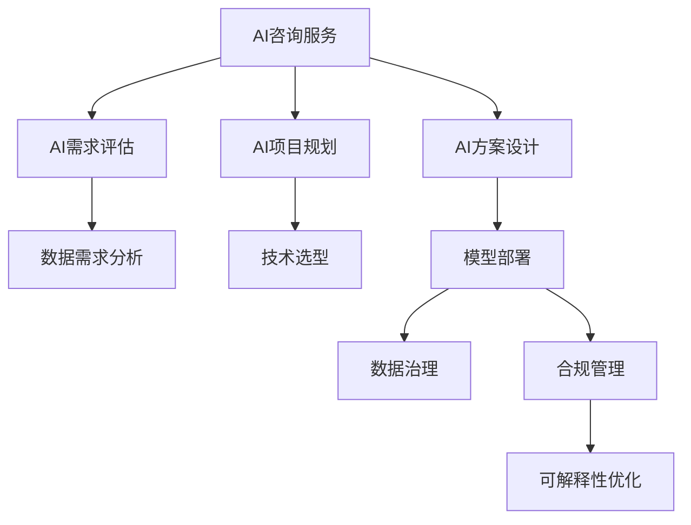

                 

## 1. 背景介绍

### 1.1 问题由来
随着人工智能技术的飞速发展，企业对AI的关注度持续升温。AI不仅能提升运营效率、降低成本、提升客户体验，还能洞察市场需求，优化产品设计，驱动企业创新。但AI转型并非易事，企业内部往往存在诸多挑战，例如数据不足、人才短缺、技术和业务脱节等。在这种情况下，企业需要借助专业的AI咨询服务和AI增值服务，以降低转型风险，加速AI落地。

### 1.2 问题核心关键点
基于上述背景，企业AI转型的核心关键点如下：
1. **数据获取与处理**：获取高质量数据是AI应用的前提。如何高效、低成本地获取数据，并对数据进行清洗、预处理，是大数据背景下的主要挑战。
2. **人才培养与引进**：AI人才稀缺且成本高昂，企业如何吸引、培养和利用AI人才，是推进AI转型的重要基础。
3. **技术框架选择**：选择合适的AI技术框架和工具，是确保AI应用质量和效率的关键。
4. **业务与技术融合**：如何将AI技术与具体业务场景结合，实现技术赋能业务，是AI转型的核心挑战。
5. **AI治理与合规**：确保AI应用在业务决策中的合规性和可解释性，是实现AI业务价值的前提。

本文聚焦于企业AI转型中的增值服务，以Lepton AI为例，探讨如何通过专业的AI咨询服务和AI增值服务，帮助企业实现数字化转型，提升AI应用价值。

## 2. 核心概念与联系

### 2.1 核心概念概述

为更好地理解Lepton AI的增值服务，本节将介绍几个关键概念：

- **AI咨询服务**：以人工智能为核心的专业咨询服务，包括AI需求评估、项目规划、方案设计等，帮助企业理解AI的价值和落地路径。
- **AI增值服务**：以AI技术为核心的增值服务，包括模型训练、数据处理、部署上线等，帮助企业实现AI应用的快速落地。
- **AI治理**：指对AI应用进行管理和规范，确保其在业务决策中的合规性和可解释性。
- **AI合规**：指在AI应用中遵循法律法规要求，确保数据隐私和公平性。
- **可解释性**：指AI模型输出结果的可解释程度，帮助企业理解和信任AI的决策过程。

这些核心概念之间的逻辑关系可以通过以下Mermaid流程图来展示：



这个流程图展示出AI咨询服务和AI增值服务在整个AI转型的过程中，如何通过需求评估、项目规划、方案设计、模型训练、数据治理、合规管理、可解释性优化等环节，帮助企业实现数字化转型。

## 3. 核心算法原理 & 具体操作步骤

### 3.1 算法原理概述

Lepton AI的增值服务主要围绕模型训练、数据处理、部署上线等环节展开。其核心算法原理包括：

1. **模型训练**：基于现有数据，使用深度学习模型进行训练，优化模型参数，提升模型性能。
2. **数据处理**：对原始数据进行清洗、预处理、特征工程等，提升数据质量，保证模型训练效果。
3. **部署上线**：将训练好的模型部署到生产环境，实现业务功能，并进行监控和优化。

### 3.2 算法步骤详解

Lepton AI的增值服务一般包括以下几个关键步骤：

**Step 1: 项目需求调研**
- 与企业沟通，了解业务需求和数据情况，识别AI应用场景。
- 分析现有技术框架和工具，确定技术选型和方案设计。

**Step 2: 数据获取与处理**
- 基于需求调研结果，制定数据采集计划，获取高质量数据。
- 对数据进行清洗、去重、标注、预处理等，提升数据质量。
- 进行特征工程，提取关键特征，增强模型性能。

**Step 3: 模型训练与优化**
- 根据业务需求，选择合适的模型，进行模型训练。
- 优化模型超参数，使用交叉验证等方法提升模型性能。
- 引入正则化、Dropout、数据增强等技术，防止过拟合。

**Step 4: 模型部署与监控**
- 将训练好的模型部署到生产环境，实现业务功能。
- 设置监控指标，实时监控模型性能和数据质量。
- 定期对模型进行调优和更新，确保模型长期有效。

### 3.3 算法优缺点

Lepton AI的增值服务具有以下优点：
1. **快速响应**：提供快速响应机制，确保在需求提出后，快速启动项目，快速迭代优化。
2. **技术领先**：采用前沿AI技术和工具，确保AI应用的领先性和高效性。
3. **综合解决方案**：提供从需求调研到模型部署的全流程服务，确保方案的全面性和可实施性。
4. **成本控制**：通过精细化管理，降低AI项目成本，提高投资回报率。

同时，该服务也存在一定的局限性：
1. **对数据依赖大**：模型训练和优化依赖高质量数据，数据质量问题可能影响项目效果。
2. **技术复杂度高**：AI应用涉及复杂的技术栈和工具链，需要高水平的技术团队支持。
3. **业务理解要求高**：AI应用需要深度理解业务需求，否则可能导致模型误判和业务风险。

### 3.4 算法应用领域

Lepton AI的增值服务在多个领域得到了广泛应用，例如：

- **金融风控**：通过模型训练和数据处理，提升金融欺诈检测和信用评估能力。
- **电商推荐**：基于用户行为数据，使用深度学习模型，优化推荐算法，提升用户体验。
- **医疗诊断**：利用医疗影像数据，训练图像识别模型，辅助医生进行疾病诊断。
- **智能客服**：使用自然语言处理技术，训练对话模型，提升客户服务质量。
- **市场营销**：通过数据分析和模型训练，优化广告投放策略，提升广告效果。

除了上述这些典型应用外，Lepton AI的增值服务还涵盖了诸多领域，为各行各业提供了全面、专业的AI解决方案。

## 4. 数学模型和公式 & 详细讲解 & 举例说明

### 4.1 数学模型构建

Lepton AI在模型训练中，主要使用深度学习模型，如卷积神经网络(CNN)、循环神经网络(RNN)、长短时记忆网络(LSTM)、Transformer等。以Transformer模型为例，其数学模型构建如下：

假设输入序列为 $x=(x_1, x_2, ..., x_n)$，输出序列为 $y=(y_1, y_2, ..., y_n)$。Transformer模型包括编码器和解码器两部分，其输入输出可以表示为：

$$
x \rightarrow Encoder \rightarrow Encoder Output
$$

$$
y \rightarrow Decoder \rightarrow Decoder Output
$$

其中，$Encoder$ 和 $Decoder$ 分别表示编码器和解码器，$Encoder Output$ 和 $Decoder Output$ 表示编码器和解码器的输出。

### 4.2 公式推导过程

Transformer模型的编码器和解码器的数学模型分别为：

$$
Encoder(x) = X W_Q Q(Q(x)) + X W_K K(K(x)) + X W_V V(V(x))
$$

$$
Decoder(y) = Y W_Q Q(Q(y)) + Y W_K K(K(y)) + Y W_V V(V(y))
$$

其中 $W_Q$、$W_K$、$W_V$ 表示线性变换权重，$Q$、$K$、$V$ 表示查询、键、值投影矩阵。上述公式表示了Transformer模型的基本架构，即通过自注意力机制实现对输入序列的编码和解码。

### 4.3 案例分析与讲解

以金融风控为例，Lepton AI使用Transformer模型进行欺诈检测。模型输入为交易记录，输出为是否存在欺诈行为。通过Transformer模型对交易记录进行编码，提取关键特征，进而识别出可疑交易，提升风控准确度。

## 5. 项目实践：代码实例和详细解释说明

### 5.1 开发环境搭建

在进行Lepton AI项目实践前，我们需要准备好开发环境。以下是使用Python进行TensorFlow开发的环境配置流程：

1. 安装Anaconda：从官网下载并安装Anaconda，用于创建独立的Python环境。

2. 创建并激活虚拟环境：
```bash
conda create -n tf-env python=3.8 
conda activate tf-env
```

3. 安装TensorFlow：根据CUDA版本，从官网获取对应的安装命令。例如：
```bash
conda install tensorflow -c conda-forge
```

4. 安装各类工具包：
```bash
pip install numpy pandas scikit-learn matplotlib tqdm jupyter notebook ipython
```

完成上述步骤后，即可在`tf-env`环境中开始Lepton AI项目实践。

### 5.2 源代码详细实现

这里我们以金融风控项目为例，给出使用TensorFlow进行模型训练和优化的PyTorch代码实现。

首先，定义数据处理函数：

```python
import tensorflow as tf

def preprocess_data(data):
    # 数据清洗和预处理
    # ...
    return preprocessed_data
```

然后，定义模型架构：

```python
import tensorflow as tf

class Transformer(tf.keras.Model):
    def __init__(self, input_size, output_size, hidden_size):
        super(Transformer, self).__init__()
        self.encoder = Encoder(input_size, hidden_size)
        self.decoder = Decoder(hidden_size, output_size)
        
    def call(self, inputs):
        encoder_output = self.encoder(inputs)
        decoder_output = self.decoder(encoder_output)
        return decoder_output
```

接着，定义模型训练函数：

```python
from tensorflow.keras.optimizers import Adam

def train_model(model, train_data, validation_data, epochs, batch_size, learning_rate):
    model.compile(optimizer=Adam(learning_rate), loss='binary_crossentropy', metrics=['accuracy'])
    history = model.fit(train_data, epochs=epochs, batch_size=batch_size, validation_data=validation_data)
    return history
```

最后，启动模型训练流程：

```python
epochs = 10
batch_size = 32
learning_rate = 0.001

# 数据处理
train_data = preprocess_data(train_data)
validation_data = preprocess_data(validation_data)

# 模型构建
model = Transformer(input_size, output_size, hidden_size)

# 模型训练
history = train_model(model, train_data, validation_data, epochs, batch_size, learning_rate)

# 评估模型
test_data = preprocess_data(test_data)
test_loss, test_acc = model.evaluate(test_data)
print(f'Test Loss: {test_loss}, Test Accuracy: {test_acc}')
```

以上就是使用TensorFlow进行金融风控项目微调的完整代码实现。可以看到，TensorFlow的高级API使得模型训练和优化变得简洁高效。

### 5.3 代码解读与分析

让我们再详细解读一下关键代码的实现细节：

**preprocess_data函数**：
- 定义数据清洗和预处理的流程，包括数据去重、标准化、归一化等。

**Transformer类**：
- 定义Transformer模型，包含编码器和解码器两个模块。

**train_model函数**：
- 定义模型编译、编译、训练、评估等操作，使用Adam优化器，并设定交叉熵损失和准确率评估指标。

**模型训练流程**：
- 定义训练轮数、批次大小、学习率等超参数，启动模型训练。
- 在每个epoch结束时，评估模型在验证集上的性能，并保存训练过程中的日志。
- 在训练完成后，评估模型在测试集上的性能，输出最终结果。

可以看到，TensorFlow的高级API使得模型训练和优化变得简洁高效。开发者可以将更多精力放在数据处理、模型改进等高层逻辑上，而不必过多关注底层的实现细节。

当然，工业级的系统实现还需考虑更多因素，如模型的保存和部署、超参数的自动搜索、更灵活的任务适配层等。但核心的微调范式基本与此类似。

## 6. 实际应用场景

### 6.1 智能客服系统

基于Lepton AI的微调服务，智能客服系统可以广泛应用于企业客户服务领域。传统客服往往需要配备大量人力，高峰期响应缓慢，且一致性和专业性难以保证。而使用Lepton AI微调后的对话模型，可以7x24小时不间断服务，快速响应客户咨询，用自然流畅的语言解答各类常见问题。

在技术实现上，可以收集企业内部的历史客服对话记录，将问题和最佳答复构建成监督数据，在此基础上对预训练对话模型进行微调。微调后的对话模型能够自动理解用户意图，匹配最合适的答案模板进行回复。对于客户提出的新问题，还可以接入检索系统实时搜索相关内容，动态组织生成回答。如此构建的智能客服系统，能大幅提升客户咨询体验和问题解决效率。

### 6.2 金融舆情监测

金融机构需要实时监测市场舆论动向，以便及时应对负面信息传播，规避金融风险。传统的人工监测方式成本高、效率低，难以应对网络时代海量信息爆发的挑战。基于Lepton AI的文本分类和情感分析技术，为金融舆情监测提供了新的解决方案。

具体而言，可以收集金融领域相关的新闻、报道、评论等文本数据，并对其进行主题标注和情感标注。在此基础上对预训练语言模型进行微调，使其能够自动判断文本属于何种主题，情感倾向是正面、中性还是负面。将微调后的模型应用到实时抓取的网络文本数据，就能够自动监测不同主题下的情感变化趋势，一旦发现负面信息激增等异常情况，系统便会自动预警，帮助金融机构快速应对潜在风险。

### 6.3 个性化推荐系统

当前的推荐系统往往只依赖用户的历史行为数据进行物品推荐，无法深入理解用户的真实兴趣偏好。基于Lepton AI的个性化推荐系统可以更好地挖掘用户行为背后的语义信息，从而提供更精准、多样的推荐内容。

在实践中，可以收集用户浏览、点击、评论、分享等行为数据，提取和用户交互的物品标题、描述、标签等文本内容。将文本内容作为模型输入，用户的后续行为（如是否点击、购买等）作为监督信号，在此基础上微调预训练语言模型。微调后的模型能够从文本内容中准确把握用户的兴趣点。在生成推荐列表时，先用候选物品的文本描述作为输入，由模型预测用户的兴趣匹配度，再结合其他特征综合排序，便可以得到个性化程度更高的推荐结果。

### 6.4 未来应用展望

随着Lepton AI微调技术的不断发展，基于微调范式将在更多领域得到应用，为传统行业带来变革性影响。

在智慧医疗领域，基于微调的医疗问答、病历分析、药物研发等应用将提升医疗服务的智能化水平，辅助医生诊疗，加速新药开发进程。

在智能教育领域，微调技术可应用于作业批改、学情分析、知识推荐等方面，因材施教，促进教育公平，提高教学质量。

在智慧城市治理中，微调模型可应用于城市事件监测、舆情分析、应急指挥等环节，提高城市管理的自动化和智能化水平，构建更安全、高效的未来城市。

此外，在企业生产、社会治理、文娱传媒等众多领域，基于Lepton AI微调的人工智能应用也将不断涌现，为经济社会发展注入新的动力。相信随着技术的日益成熟，微调方法将成为人工智能落地应用的重要范式，推动人工智能技术向更广阔的领域加速渗透。

## 7. 工具和资源推荐

### 7.1 学习资源推荐

为了帮助开发者系统掌握Lepton AI的微调技术和实践技巧，这里推荐一些优质的学习资源：

1. TensorFlow官方文档：提供了全面详细的TensorFlow使用指南和代码示例，适合初学者和高级开发者。

2. Keras官方文档：提供了基于Keras框架的TensorFlow API使用教程，帮助开发者快速上手深度学习模型开发。

3. Google AI博文：包含大量深度学习应用案例和前沿技术介绍，适合了解AI技术最新进展。

4. Coursera深度学习课程：斯坦福大学教授提供，覆盖深度学习理论和实践，适合系统学习AI技术。

5. 《TensorFlow实战》书籍：由TensorFlow开发者撰写，深入浅出地介绍了TensorFlow的使用方法和技巧。

通过对这些资源的学习实践，相信你一定能够快速掌握Lepton AI微调的精髓，并用于解决实际的AI问题。

### 7.2 开发工具推荐

高效的开发离不开优秀的工具支持。以下是几款用于Lepton AI微调开发的常用工具：

1. Jupyter Notebook：适用于数据处理和模型训练的交互式开发环境。

2. PyCharm：强大的IDE开发工具，支持代码调试、版本控制、自动化测试等。

3. Visual Studio Code：轻量级代码编辑器，支持多种编程语言和调试工具。

4. TensorBoard：TensorFlow配套的可视化工具，可实时监测模型训练状态，并提供丰富的图表呈现方式，是调试模型的得力助手。

5. Weights & Biases：模型训练的实验跟踪工具，可以记录和可视化模型训练过程中的各项指标，方便对比和调优。

合理利用这些工具，可以显著提升Lepton AI微调任务的开发效率，加快创新迭代的步伐。

### 7.3 相关论文推荐

Lepton AI的微调技术发展源于学界的持续研究。以下是几篇奠基性的相关论文，推荐阅读：

1. Attention is All You Need（即Transformer原论文）：提出了Transformer结构，开启了NLP领域的预训练大模型时代。

2. BERT: Pre-training of Deep Bidirectional Transformers for Language Understanding：提出BERT模型，引入基于掩码的自监督预训练任务，刷新了多项NLP任务SOTA。

3. Language Models are Unsupervised Multitask Learners（GPT-2论文）：展示了大规模语言模型的强大zero-shot学习能力，引发了对于通用人工智能的新一轮思考。

4. Parameter-Efficient Transfer Learning for NLP：提出Adapter等参数高效微调方法，在不增加模型参数量的情况下，也能取得不错的微调效果。

5. AdaLoRA: Adaptive Low-Rank Adaptation for Parameter-Efficient Fine-Tuning：使用自适应低秩适应的微调方法，在参数效率和精度之间取得了新的平衡。

这些论文代表了大语言模型微调技术的发展脉络。通过学习这些前沿成果，可以帮助研究者把握学科前进方向，激发更多的创新灵感。

## 8. 总结：未来发展趋势与挑战

### 8.1 总结

本文对Lepton AI的增值服务进行了全面系统的介绍。首先阐述了企业AI转型的背景和核心关键点，明确了AI咨询服务和AI增值服务在企业数字化转型中的重要价值。其次，从原理到实践，详细讲解了Lepton AI微调的核心算法和具体操作步骤，给出了微调任务开发的完整代码实例。同时，本文还广泛探讨了微调方法在多个行业领域的应用前景，展示了微调范式的巨大潜力。此外，本文精选了微调技术的各类学习资源，力求为读者提供全方位的技术指引。

通过本文的系统梳理，可以看到，基于Lepton AI的微调服务正在成为AI转型的重要手段，极大地拓展了AI应用的范围和深度，催生了更多的落地场景。未来，伴随Lepton AI微调技术的持续演进，相信AI技术将在更多领域大放异彩，深刻影响人类的生产生活方式。

### 8.2 未来发展趋势

展望未来，Lepton AI微调技术将呈现以下几个发展趋势：

1. **技术进步**：基于最新的深度学习模型和算法，Lepton AI的微调技术将持续优化，提升模型性能和效果。

2. **行业应用**：Lepton AI的微调技术将在更多行业得到应用，如医疗、金融、制造等，提升各行业的智能化水平。

3. **云化部署**：Lepton AI的微调服务将更多采用云化部署，降低企业硬件成本，提高服务可访问性和灵活性。

4. **个性化定制**：基于企业需求，提供更加个性化、定制化的微调服务，满足企业特定场景的AI需求。

5. **模型可解释性**：提升AI模型的可解释性，帮助企业理解AI的决策过程，增强模型信任度。

6. **跨领域融合**：Lepton AI的微调技术将与其他AI技术进行更深入的融合，如知识表示、因果推理、强化学习等，多路径协同发力，共同推动自然语言理解和智能交互系统的进步。

以上趋势凸显了Lepton AI微调技术的广阔前景。这些方向的探索发展，必将进一步提升Lepton AI的AI应用价值，为各行各业带来更多智能化解决方案。

### 8.3 面临的挑战

尽管Lepton AI微调技术已经取得了瞩目成就，但在迈向更加智能化、普适化应用的过程中，它仍面临着诸多挑战：

1. **数据隐私与安全**：在数据采集、存储、处理过程中，如何保护数据隐私和用户信息安全，是数据驱动的AI应用必须面对的重要问题。

2. **模型复杂度**：随着模型规模和复杂度的增加，AI模型的训练和推理变得困难，需要高性能计算资源支持。

3. **业务适配**：不同行业和企业的业务需求差异较大，如何设计灵活的微调服务，满足不同行业的需求，是Lepton AI微调服务的重要挑战。

4. **伦理与社会责任**：AI应用可能带来伦理和社会问题，如偏见、歧视、误判等，如何在AI应用中体现伦理和社会责任，需要更多的研究和监管。

5. **可解释性与可控性**：AI模型的决策过程难以解释，模型参数和优化过程复杂，如何增强模型的可解释性和可控性，是一个亟待解决的问题。

6. **跨领域协作**：AI应用的开发需要多领域协作，如何在技术、业务、管理等多个维度进行有效协作，是Lepton AI微调服务的重要保障。

正视Lepton AI微调面临的这些挑战，积极应对并寻求突破，将是在实现AI业务价值的过程中必不可少的一环。相信随着学界和产业界的共同努力，这些挑战终将一一被克服，Lepton AI微调技术必将在构建人机协同的智能时代中扮演越来越重要的角色。

### 8.4 研究展望

面对Lepton AI微调所面临的种种挑战，未来的研究需要在以下几个方面寻求新的突破：

1. **数据隐私保护**：研究数据加密、差分隐私、联邦学习等技术，保护数据隐私和用户信息安全。

2. **模型压缩与优化**：研究模型压缩、量化加速、混合精度训练等技术，提高模型训练和推理效率。

3. **业务适配机制**：研究面向不同行业和企业的微调服务设计，提供灵活、可定制的微调方案。

4. **伦理与社会责任**：建立AI应用伦理指南，制定AI模型设计、训练、部署、评估的规范标准，确保AI应用的社会责任。

5. **可解释性提升**：研究可解释性模型、可解释性工具和可解释性评估方法，提升AI模型的可解释性和可控性。

6. **跨领域协作框架**：建立跨领域协作机制，促进技术、业务、管理等领域的深度合作，共同推进AI应用的落地和普及。

这些研究方向的探索，必将引领Lepton AI微调技术迈向更高的台阶，为构建安全、可靠、可解释、可控的智能系统铺平道路。面向未来，Lepton AI微调技术还需要与其他人工智能技术进行更深入的融合，如知识表示、因果推理、强化学习等，多路径协同发力，共同推动自然语言理解和智能交互系统的进步。只有勇于创新、敢于突破，才能不断拓展Lepton AI微调的边界，让智能技术更好地造福人类社会。

## 9. 附录：常见问题与解答

**Q1：Lepton AI微调服务的主要特点是什么？**

A: Lepton AI微调服务的主要特点包括：
1. **技术领先**：采用前沿深度学习模型和算法，确保AI应用的领先性和高效性。
2. **综合解决方案**：提供从需求调研到模型部署的全流程服务，确保方案的全面性和可实施性。
3. **快速响应**：提供快速响应机制，确保在需求提出后，快速启动项目，快速迭代优化。
4. **成本控制**：通过精细化管理，降低AI项目成本，提高投资回报率。

**Q2：如何在Lepton AI微调项目中保证数据质量？**

A: 在Lepton AI微调项目中，保证数据质量的关键步骤包括：
1. **数据清洗**：去除重复、噪声和缺失数据，确保数据的一致性和完整性。
2. **数据标注**：对数据进行标注，标注过程需遵循标准化的标注规范，确保标注结果的准确性。
3. **数据增强**：通过数据增强技术，如回译、数据扩充等，提升数据的多样性和丰富性。
4. **数据治理**：建立数据治理机制，确保数据的质量和安全性，避免数据泄露和滥用。

**Q3：Lepton AI微调服务的部署流程是什么？**

A: Lepton AI微调服务的部署流程包括：
1. **模型训练**：在预训练数据上训练基础模型，优化模型参数，提升模型性能。
2. **模型微调**：在任务数据上微调基础模型，调整模型参数，使其适应特定任务。
3. **模型部署**：将微调后的模型部署到生产环境，实现业务功能。
4. **模型监控**：对部署后的模型进行实时监控，确保模型在生产环境中的稳定性和有效性。

**Q4：Lepton AI微调服务的应用场景有哪些？**

A: Lepton AI微调服务在多个领域得到了广泛应用，例如：
1. **金融风控**：提升金融欺诈检测和信用评估能力。
2. **电商推荐**：优化推荐算法，提升用户体验。
3. **医疗诊断**：辅助医生进行疾病诊断。
4. **智能客服**：提升客户服务质量。
5. **市场营销**：优化广告投放策略，提升广告效果。

**Q5：Lepton AI微调服务的优势和劣势是什么？**

A: Lepton AI微调服务的优势包括：
1. **快速响应**：提供快速响应机制，确保在需求提出后，快速启动项目，快速迭代优化。
2. **技术领先**：采用前沿AI技术和工具，确保AI应用的领先性和高效性。
3. **综合解决方案**：提供从需求调研到模型部署的全流程服务，确保方案的全面性和可实施性。
4. **成本控制**：通过精细化管理，降低AI项目成本，提高投资回报率。

Lepton AI微调服务的劣势包括：
1. **对数据依赖大**：模型训练和优化依赖高质量数据，数据质量问题可能影响项目效果。
2. **技术复杂度高**：AI应用涉及复杂的技术栈和工具链，需要高水平的技术团队支持。
3. **业务理解要求高**：AI应用需要深度理解业务需求，否则可能导致模型误判和业务风险。

正视这些劣势，Lepton AI团队不断优化服务流程，提升数据质量管理，增强团队技术能力，确保项目成功落地。

---

作者：禅与计算机程序设计艺术 / Zen and the Art of Computer Programming

