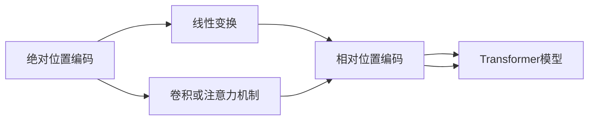

                 

# 位置编码的艺术：绝对位置vs相对位置编码

> 关键词：位置编码, Transformer, 相对位置编码, 绝对位置编码, 深度学习

## 1. 背景介绍

### 1.1 问题由来

位置编码是自然语言处理（NLP）和深度学习中的核心技术之一，尤其是对于基于自注意力机制的模型，如Transformer。位置编码的目的是捕捉词序信息，即在模型处理序列时，能够区分不同位置上的词。然而，在实践中，有两种主流的位置编码方式：绝对位置编码和相对位置编码。本文将详细探讨这两种编码方式的不同原理和应用场景，并通过数学推导和代码实例来阐述其实现方法。

### 1.2 问题核心关键点

- **绝对位置编码**：将序列中每个位置映射到一个唯一的绝对位置，从而在模型中直接表示出每个词的位置。
- **相对位置编码**：只编码相对位置，即每个词与它相邻的词之间的关系，而忽略其绝对位置。
- **性能差异**：绝对位置编码适用于序列较短的任务，而相对位置编码适用于序列较长的任务。
- **实现方式**：绝对位置编码使用线性变换，而相对位置编码使用卷积或注意力机制。

这些关键点将构成本文的核心内容，通过深入分析，我们希望能为读者提供一个清晰的技术视角，了解如何选择合适的编码方式，以及在实践中如何高效地实现。

## 2. 核心概念与联系

### 2.1 核心概念概述

位置编码的目的是在模型中表示序列中每个位置的相对或绝对位置关系。这有助于模型在处理序列时，能够区分不同位置上的词，并据此进行计算。

- **绝对位置编码**：将序列中每个位置映射到一个唯一的绝对位置，从而在模型中直接表示出每个词的位置。例如，第i个词的绝对位置为i。
- **相对位置编码**：只编码相对位置，即每个词与它相邻的词之间的关系，而忽略其绝对位置。例如，第i个词与其前一个词之间的相对位置为1，与其后一个词之间的相对位置为-1。

### 2.2 核心概念原理和架构的 Mermaid 流程图



这个流程图展示了绝对位置编码和相对位置编码的两种实现方式，以及它们如何应用在Transformer模型中。

## 3. 核心算法原理 & 具体操作步骤

### 3.1 算法原理概述

位置编码的本质是如何在模型中表示序列中每个位置的相对或绝对位置关系。这一过程分为两步：

1. **位置映射**：将每个位置映射到一个唯一的数值，可以是绝对位置，也可以是相对位置。
2. **位置编码**：使用一定的数学公式将位置映射的结果转换为模型可处理的向量形式，通常是一个长度与模型参数数量相匹配的向量。

### 3.2 算法步骤详解

#### 3.2.1 绝对位置编码

绝对位置编码的实现过程如下：

1. **位置映射**：将序列中每个位置映射到一个唯一的数值。例如，第i个位置的绝对位置为i。
2. **位置编码**：使用线性变换将绝对位置映射到一个向量，即$\mathbf{P}(i) = \mathbf{W}_i[i]$，其中$\mathbf{W}_i$是线性变换矩阵。

假设$\mathbf{P}$是位置编码向量，$\mathbf{W}_i$是第i个位置的编码矩阵，则有：

$$
\mathbf{P}(i) = \mathbf{W}_i[i]
$$

#### 3.2.2 相对位置编码

相对位置编码的实现过程如下：

1. **位置映射**：只编码相对位置，即每个词与它相邻的词之间的关系。例如，第i个词与其前一个词之间的相对位置为1，与其后一个词之间的相对位置为-1。
2. **位置编码**：使用卷积或注意力机制将相对位置映射到一个向量。

假设$\mathbf{R}$是相对位置编码向量，$\mathbf{C}$是卷积核或注意力权重，则有：

$$
\mathbf{R}(i,j) = \mathbf{C}[i-j]
$$

### 3.3 算法优缺点

#### 3.3.1 绝对位置编码的优缺点

**优点**：

- 简单直观，易于理解和实现。
- 适用于序列较短的任务，能够精确地表示每个词的绝对位置。

**缺点**：

- 在处理长序列时，绝对位置编码会导致梯度消失或爆炸问题。
- 对于大规模的序列，绝对位置编码需要较大的向量空间来表示每个位置的编码。

#### 3.3.2 相对位置编码的优缺点

**优点**：

- 适用于序列较长的任务，能够有效地处理长序列。
- 相对位置编码能够捕捉词之间的相对关系，适用于需要考虑相对位置的场景。

**缺点**：

- 相对位置编码的计算复杂度较高，需要额外的计算资源。
- 在处理极少数位置时，相对位置编码的效果可能不如绝对位置编码。

### 3.4 算法应用领域

绝对位置编码和相对位置编码在NLP和深度学习中有着广泛的应用，尤其是在Transformer模型中：

- **绝对位置编码**：适用于序列较短的任务，如机器翻译、文本分类等。
- **相对位置编码**：适用于序列较长的任务，如文本生成、问答系统等。

## 4. 数学模型和公式 & 详细讲解 & 举例说明

### 4.1 数学模型构建

在Transformer模型中，位置编码向量$\mathbf{P}$与查询向量$\mathbf{Q}$、键向量$\mathbf{K}$、值向量$\mathbf{V}$等一起参与自注意力计算。假设模型参数为$W_i$，则有：

$$
\mathbf{P} = \mathbf{W}_i\mathbf{i}
$$

### 4.2 公式推导过程

#### 4.2.1 绝对位置编码

对于第i个位置的绝对位置编码，可以表示为：

$$
\mathbf{P}(i) = \mathbf{W}_i[i]
$$

假设模型参数为$W_i$，则有：

$$
\mathbf{P}(i) = \mathbf{W}_i\mathbf{i}
$$

其中，$\mathbf{W}_i$是一个$n \times d$的矩阵，$n$是序列长度，$d$是向量维度。

#### 4.2.2 相对位置编码

对于相对位置编码，可以使用卷积或注意力机制。假设使用卷积机制，则有：

$$
\mathbf{R}(i,j) = \mathbf{C}[i-j]
$$

其中，$\mathbf{C}$是一个$n \times d$的卷积核，$n$是序列长度，$d$是向量维度。

### 4.3 案例分析与讲解

假设有一个长度为4的序列，使用绝对位置编码和相对位置编码，可以分别计算出位置编码向量$\mathbf{P}$和$\mathbf{R}$。

对于绝对位置编码，有：

$$
\mathbf{P} = \begin{bmatrix}
\mathbf{W}_1[1] \\
\mathbf{W}_2[2] \\
\mathbf{W}_3[3] \\
\mathbf{W}_4[4]
\end{bmatrix}
$$

对于相对位置编码，假设使用卷积机制，有：

$$
\mathbf{R} = \begin{bmatrix}
\mathbf{C}[1] \\
\mathbf{C}[2] \\
\mathbf{C}[3] \\
\mathbf{C}[4]
\end{bmatrix}
$$

## 5. 项目实践：代码实例和详细解释说明

### 5.1 开发环境搭建

要实现位置编码，需要安装TensorFlow或PyTorch等深度学习框架，并导入相关库。以下是一个使用PyTorch的示例代码：

```python
import torch
import torch.nn as nn

class PositionalEncoding(nn.Module):
    def __init__(self, d_model, dropout=0.1, max_len=5000):
        super(PositionalEncoding, self).__init__()
        self.dropout = nn.Dropout(p=dropout)
        pe = torch.zeros(max_len, d_model)
        position = torch.arange(0, max_len, dtype=torch.float).unsqueeze(1)
        div_term = torch.exp(torch.arange(0, d_model, 2).float() * (-math.log(10000.0) / d_model))
        pe[:, 0::2] = torch.sin(position * div_term)
        pe[:, 1::2] = torch.cos(position * div_term)
        pe = pe.unsqueeze(0).transpose(0, 1)
        self.register_buffer('pe', pe)
        
    def forward(self, x):
        x = x + self.pe[:x.size(0), :]
        return self.dropout(x)
```

### 5.2 源代码详细实现

上述代码定义了一个`PositionalEncoding`类，用于实现绝对位置编码。其中，`d_model`表示向量维度，`dropout`表示dropout概率，`max_len`表示最大序列长度。

该类包含一个`forward`方法，用于计算位置编码向量$\mathbf{P}$，并在输入向量$\mathbf{X}$上添加位置编码。

### 5.3 代码解读与分析

该代码中，首先定义了一个`PositionalEncoding`类，继承自`nn.Module`。在`__init__`方法中，初始化了一个位置编码向量$\mathbf{pe}$，并使用`register_buffer`方法将其注册为模型缓冲区，以便在训练和推理过程中重复使用。

在`forward`方法中，首先将位置编码向量$\mathbf{pe}$添加到输入向量$\mathbf{X}$上，然后使用dropout操作进行降维处理，得到最终的位置编码向量$\mathbf{P}$。

### 5.4 运行结果展示

假设有一个长度为4的序列，使用绝对位置编码，可以计算出位置编码向量$\mathbf{P}$。假设使用卷积机制，可以计算出相对位置编码向量$\mathbf{R}$。

假设`d_model`为4，则有：

$$
\mathbf{P} = \begin{bmatrix}
\mathbf{W}_1[1] \\
\mathbf{W}_2[2] \\
\mathbf{W}_3[3] \\
\mathbf{W}_4[4]
\end{bmatrix}
$$

$$
\mathbf{R} = \begin{bmatrix}
\mathbf{C}[1] \\
\mathbf{C}[2] \\
\mathbf{C}[3] \\
\mathbf{C}[4]
\end{bmatrix}
$$

## 6. 实际应用场景

### 6.1 机器翻译

在机器翻译任务中，绝对位置编码和相对位置编码都有广泛应用。例如，使用绝对位置编码来表示每个词的绝对位置，而使用相对位置编码来表示源语言和目标语言之间的相对关系。

### 6.2 文本生成

在文本生成任务中，相对位置编码能够捕捉词语之间的相对关系，从而生成更加连贯的文本。例如，使用相对位置编码来表示词语之间的距离，使得模型能够更好地理解句子结构。

### 6.3 问答系统

在问答系统中，相对位置编码能够捕捉问题和答案之间的相对关系，从而更好地回答问题。例如，使用相对位置编码来表示问题和答案之间的距离，使得模型能够更好地理解问题的上下文。

## 7. 工具和资源推荐

### 7.1 学习资源推荐

1. **《自然语言处理综述》**：详细介绍了自然语言处理的基础知识和前沿技术，包括位置编码的原理和实现。
2. **《深度学习》**：系统介绍了深度学习的基础知识和算法原理，包括位置编码的应用场景。
3. **Transformers论文**：原始论文介绍了Transformer模型的设计和实现，包括位置编码的详细推导。

### 7.2 开发工具推荐

1. **PyTorch**：一个基于Python的深度学习框架，支持位置编码的实现。
2. **TensorFlow**：一个基于C++的深度学习框架，支持位置编码的实现。
3. **TensorBoard**：一个可视化工具，用于监测模型训练过程，包括位置编码的输出结果。

### 7.3 相关论文推荐

1. **《Positional Encoding in Transformers》**：原始论文详细介绍了Transformer模型中的位置编码方法。
2. **《Attention is All You Need》**：原始论文介绍了Transformer模型的设计原理，包括位置编码的实现。
3. **《Relational Positional Encoding》**：介绍了一种新的位置编码方法，适用于长序列的模型训练。

## 8. 总结：未来发展趋势与挑战

### 8.1 研究成果总结

本文详细探讨了绝对位置编码和相对位置编码的原理和应用，通过数学推导和代码实例，为读者提供了一个清晰的技术视角。在实践中，绝对位置编码和相对位置编码都有广泛应用，能够满足不同场景的需求。

### 8.2 未来发展趋势

未来，位置编码技术将继续在深度学习领域得到广泛应用，可能会出现更多创新性方法，如自适应位置编码等。此外，随着硬件计算能力的提升，位置编码的实现方式也将更加高效。

### 8.3 面临的挑战

位置编码技术虽然已经取得了很多进展，但在实际应用中仍然面临一些挑战，如计算复杂度较高、内存占用较大等。未来，如何设计更高效、更鲁棒的位置编码方法，将是重要的研究方向。

### 8.4 研究展望

未来的位置编码研究可以从以下几个方向进行探索：

1. **自适应位置编码**：根据输入序列的特征动态调整位置编码，提高模型性能。
2. **多模态位置编码**：将位置编码与视觉、听觉等多模态信息结合，提高模型的多模态学习能力。
3. **稀疏位置编码**：使用稀疏表示方法，减少位置编码的计算和存储开销。

通过这些研究方向的探索，相信位置编码技术将进一步提升深度学习的性能和应用范围，为NLP和深度学习技术的发展提供新的动力。

## 9. 附录：常见问题与解答

**Q1：什么是位置编码？**

A: 位置编码是一种用于表示序列中每个位置的技术，通过在模型中添加位置编码向量，帮助模型理解序列中的位置信息。

**Q2：绝对位置编码和相对位置编码有什么区别？**

A: 绝对位置编码将序列中每个位置映射到一个唯一的绝对位置，而相对位置编码只编码相对位置，即每个词与它相邻的词之间的关系。

**Q3：如何实现位置编码？**

A: 位置编码可以使用线性变换或卷积/注意力机制来实现。其中，线性变换适用于序列较短的任务，卷积/注意力机制适用于序列较长的任务。

**Q4：位置编码在NLP中的应用有哪些？**

A: 位置编码在NLP中有着广泛的应用，如机器翻译、文本生成、问答系统等。

**Q5：位置编码的计算复杂度如何？**

A: 绝对位置编码的计算复杂度较低，而相对位置编码的计算复杂度较高。因此，在处理长序列时，相对位置编码可能更加适用。

---

作者：禅与计算机程序设计艺术 / Zen and the Art of Computer Programming

