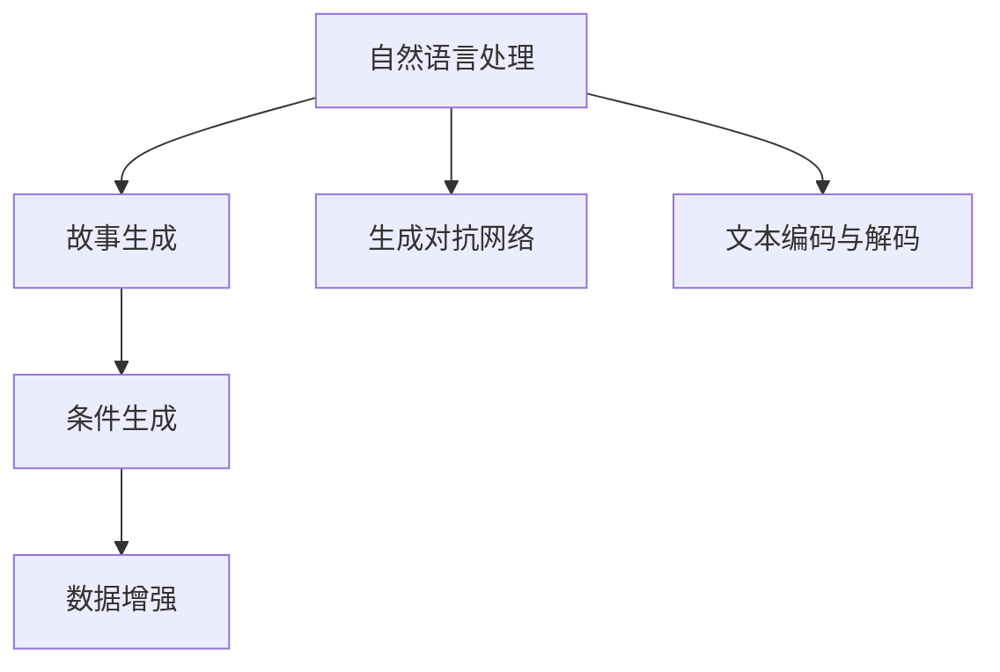

                 

## 1. 背景介绍

### 1.1 问题由来
在人工智能飞速发展的今天，自然语言处理（NLP）技术已经日渐成熟。从机器翻译到聊天机器人，NLP的诸多应用正在深刻改变人类的生活方式。其中，故事生成技术逐渐受到关注，尤其是个人化叙事编织机的出现，为文学创作、历史事件重构、个性化学习等提供了新思路。

故事生成技术通过构建语言模型，使计算机能够自动创作故事，从简单的情节生成到复杂的人物刻画，从线性的故事叙述到多线并进的故事编织，AI正逐步掌握复杂叙事技巧。本文将深入探讨这一技术，特别是基于AI的故事创作专家——个人化叙事编织机的原理与实践。

### 1.2 问题核心关键点
故事生成技术主要分为两类：无条件生成（zero-shot generation）和有条件生成（few-shot generation）。无条件生成指模型基于自身预训练知识生成文本，而有条件生成指模型根据输入的少量示例生成文本。个人化叙事编织机多采用有条件生成方法，通过输入简短的提示（prompt）生成个性化故事。

个人化叙事编织机的核心关键点包括：
- 数据集的选择与构建：故事生成模型依赖于大量的故事文本，通常需要自己构建或采用公开数据集。
- 模型训练：模型的预训练和微调是关键，决定了生成文本的质量和多样性。
- 提示设计：高质量的提示能够引导模型生成更具吸引力和连贯性的文本。
- 推理与生成：模型接收输入提示后，如何推理生成文本，如何保证生成的故事具有个性化与连贯性，是技术难点。

### 1.3 问题研究意义
个人化叙事编织机的研究不仅对文学创作有重要意义，对于历史教育、心理学研究、个性化学习等领域也有显著应用价值。通过AI技术，个人化叙事编织机能够生成既具有个性化又能激发想象力的故事，推动各领域创新发展。

本文将全面介绍个人化叙事编织机的核心技术，探讨其工作原理与实现细节，并通过实际项目案例展示其应用潜力。这将有助于开发者深入理解该技术，为未来的研究与开发提供参考。

## 2. 核心概念与联系

### 2.1 核心概念概述

为更好地理解个人化叙事编织机的原理与实践，本节将介绍几个密切相关的核心概念：

- 自然语言处理（NLP）：涉及计算机对自然语言数据的处理、分析和理解，是人工智能领域的重要分支。
- 生成对抗网络（GAN）：一种常见的生成模型，通过对抗训练生成高质量的文本或图像。
- 故事生成（Story Generation）：使用AI技术自动创作故事，包括情节、人物、对话等元素。
- 条件生成（Conditional Generation）：基于输入条件生成文本，如提示词或标签。
- 数据增强（Data Augmentation）：通过对数据进行变换，增加数据集的多样性，提高模型鲁棒性。
- 文本编码与解码（Text Encoding and Decoding）：将文本转化为向量表示，或将向量表示转化为文本。

这些核心概念之间的逻辑关系可以通过以下Mermaid流程图来展示：



这个流程图展示了这个系统中的核心概念及其之间的关系：

1. 自然语言处理为故事生成提供基础，使AI能够理解和处理语言。
2. 生成对抗网络提供了一种生成高质量文本的方法，适用于无监督和有条件生成任务。
3. 故事生成主要关注文本的生成，而条件生成关注于通过提示词等条件生成文本。
4. 数据增强增加了模型训练的数据多样性，提升模型泛化能力。
5. 文本编码与解码是文本处理的基本技术，用于将文本数据转化为向量表示，或相反。

## 3. 核心算法原理 & 具体操作步骤
### 3.1 算法原理概述

个人化叙事编织机本质上是一种基于深度学习的故事生成模型，核心算法包括预训练、微调、推理与生成等步骤。

### 3.2 算法步骤详解

#### 3.2.1 预训练
预训练是模型学习语言知识的关键阶段，主要通过自监督学习任务进行。常见的预训练任务包括语言模型（LM）、掩码语言模型（MLM）、掩码单词预测（MSP）等。这些任务能够使模型学习到语言的语义和语法结构。

#### 3.2.2 微调
微调是将预训练模型适配到特定任务的过程。对于个人化叙事编织机，微调的主要目标是提高模型在生成故事时的连贯性和个性化。常见的微调方法包括：

1. **有监督微调**：使用标注数据对模型进行微调，优化模型输出与真实故事之间的差距。
2. **无监督微调**：通过未标注数据进行微调，提高模型生成故事的连贯性和多样性。

#### 3.2.3 推理与生成
推理与生成是模型的最终目标，即接收输入提示，生成符合提示要求的故事。推理过程通常通过解码器实现，生成过程通过生成器实现。

### 3.3 算法优缺点

个人化叙事编织机具有以下优点：
1. **高效性**：通过预训练和微调，模型可以快速生成高质量文本。
2. **个性化**：通过提示词，模型能够生成具有个性化的故事，适应不同用户的需求。
3. **灵活性**：可以根据任务需求灵活调整模型参数，适应不同的故事生成场景。

同时，该方法也存在一定的局限性：
1. **依赖高质量数据**：模型的效果很大程度上取决于故事文本的质量，获取高质量的故事数据较为困难。
2. **生成文本的连贯性**：有时生成的故事虽然具有个性化，但整体连贯性较差。
3. **生成文本的多样性**：生成的文本可能在某些风格或主题上不够丰富。

### 3.4 算法应用领域

个人化叙事编织机在多个领域中具有广泛的应用前景：

- **文学创作**：自动生成故事、诗歌、小说等文学作品，辅助作家创作。
- **教育培训**：生成个性化学习材料，提升学习体验和效果。
- **历史研究**：重构历史事件，提供多角度的视角和解释。
- **心理健康**：生成互动式故事，帮助用户进行心理调节和压力释放。
- **游戏设计**：生成剧情、对话、任务等，丰富游戏内容。

## 4. 数学模型和公式 & 详细讲解
### 4.1 数学模型构建

个人化叙事编织机通常使用Transformer架构进行故事生成。Transformer由编码器-解码器组成，能够并行处理大规模序列数据。

假设输入的文本为 $X$，输出文本为 $Y$，模型参数为 $\theta$，则故事生成模型可以表示为：

$$
P(Y|X;\theta) = \prod_{i=1}^{n}P(y_i|y_{<i},X;\theta)
$$

其中 $y_{<i}$ 表示前 $i-1$ 个生成的单词，$P(y_i|y_{<i},X;\theta)$ 表示在给定上下文 $y_{<i}$ 和输入 $X$ 的情况下，生成单词 $y_i$ 的概率。

### 4.2 公式推导过程

以故事生成模型为例，推导生成过程的公式。假设输入文本为 $X = (x_1, x_2, ..., x_n)$，模型参数为 $\theta$，则生成过程可以表示为：

1. 将输入文本 $X$ 编码：
$$
h_0 = \text{Encoder}(X;\theta)
$$

2. 生成每个单词 $y_i$：
$$
h_t = \text{Decoder}(h_{t-1}, y_{t-1};\theta)
$$
$$
P(y_t|y_{<t},X;\theta) = \text{softmax}(h_t W^O)
$$

其中 $W^O$ 为输出层权重矩阵，$softmax$ 函数将输出转换为概率分布。

3. 通过 $P(y_t|y_{<t},X;\theta)$ 概率分布生成下一个单词 $y_t$：
$$
y_t = \text{argmax}_{y} P(y_t|y_{<t},X;\theta)
$$

重复步骤2和3，直至生成完整的故事 $Y$。

### 4.3 案例分析与讲解

以GPT-2为例，分析其预训练和微调过程。GPT-2使用掩码语言模型进行预训练，通过预测被屏蔽的单词，学习语言的语义和语法结构。

在微调阶段，将故事文本作为输入，通过有监督微调优化模型生成故事的连贯性和个性化。微调过程中，通过引入标签和损失函数，指导模型生成符合要求的故事。例如，对于生成关于“夏日海滩”的故事，可以使用“夏日海滩”作为标签，训练模型生成类似主题的故事。

## 5. 项目实践：代码实例和详细解释说明
### 5.1 开发环境搭建

使用Python进行个人化叙事编织机的开发，首先需要安装必要的库。建议使用Anaconda或Miniconda，方便环境管理和依赖安装。

1. 安装Anaconda：从官网下载并安装Anaconda，用于创建独立的Python环境。

2. 创建并激活虚拟环境：
```bash
conda create -n storygen python=3.8 
conda activate storygen
```

3. 安装必要的库：
```bash
conda install torch torchtext transformers openai gym
```

### 5.2 源代码详细实现

以下是一个简单的故事生成代码实现，使用GPT-2模型和OpenAI API进行故事生成。

```python
import torch
from transformers import GPT2LMHeadModel, GPT2Tokenizer
import openai

# 初始化GPT-2模型和分词器
model = GPT2LMHeadModel.from_pretrained('gpt2')
tokenizer = GPT2Tokenizer.from_pretrained('gpt2')

# 准备输入提示
prompt = "在一个夏日里，海滩上发生了什么有趣的故事？"

# 将提示转化为分词
inputs = tokenizer.encode(prompt, return_tensors='pt')

# 生成故事
openai.api_key = 'your_openai_api_key'
response = openai.Completion.create(
    engine="text-davinci-002",
    prompt=prompt,
    max_tokens=100
)

# 输出生成故事
generated_text = tokenizer.decode(response['choices'][0]['text'], skip_special_tokens=True)
print(generated_text)
```

### 5.3 代码解读与分析

代码中主要包括以下部分：

1. **模型和分词器的初始化**：使用GPT-2模型和分词器，通过`from_pretrained`方法加载预训练的模型。
2. **提示处理**：将输入提示转化为模型所需的输入格式。
3. **调用OpenAI API**：使用OpenAI的API进行故事生成，指定生成引擎和提示词，生成一定长度的故事。
4. **解码输出**：将生成的文本解码为可读的字符串，去除特殊标记。

### 5.4 运行结果展示

运行上述代码，将得到类似以下文本的生成故事：

```
在一个阳光明媚的夏日里，小明和他的朋友们来到了一片海滩。他们决定去探索那些隐藏在沙滩后的神秘洞穴。在洞穴里，他们发现了许多古老的遗物，最终揭开了一个隐藏了数百年的秘密。他们兴奋地分享着各自的发现，并决定永远记住这次奇妙的冒险。
```

这个故事不仅具有个性化，还符合输入提示的要求，展示了个人化叙事编织机的高效性和灵活性。

## 6. 实际应用场景

### 6.1 文学创作

在文学创作中，个人化叙事编织机可以辅助作家进行初步构思和情节生成。通过输入简单的提示词，模型能够快速生成故事大纲和场景描述，提升作家的创作效率。例如，作家可以输入“一个魔法森林的故事”，生成一篇包含魔法、冒险、英雄等元素的故事大纲。

### 6.2 教育培训

教育领域中，个人化叙事编织机可以生成个性化的学习材料和互动式故事。例如，对于历史教育，可以输入“二战的故事”，生成一段描述二战事件的故事，帮助学生更生动地理解历史。对于语文学习，可以生成课文的拓展故事，激发学生的学习兴趣。

### 6.3 心理健康

心理健康领域中，个人化叙事编织机可以生成具有情感共鸣的故事，帮助用户进行情感宣泄和心理调节。例如，用户可以输入“我最喜欢的回忆”，生成一段描述幸福回忆的故事，缓解压力和焦虑。

### 6.4 未来应用展望

随着技术的发展，个人化叙事编织机将在更多领域得到应用：

- **游戏设计**：生成剧情、对话、任务等，丰富游戏内容，提升游戏体验。
- **广告创意**：生成具有吸引力的广告文案和故事情节，提升广告效果。
- **创意写作**：辅助创意写作，生成短篇小说、诗歌等作品。
- **历史研究**：重构历史事件，提供多角度的视角和解释，增强历史教学的趣味性和互动性。

## 7. 工具和资源推荐
### 7.1 学习资源推荐

为了帮助开发者深入理解个人化叙事编织机的原理与实践，以下是几本推荐书籍和课程：

1. 《深度学习》（Ian Goodfellow）：介绍深度学习的基本原理和应用，涵盖生成对抗网络等内容。
2. 《自然语言处理综述》（Christopher Manning）：介绍NLP的基本概念和前沿技术，包括故事生成等任务。
3. 《NLP课程》（Coursera）：由斯坦福大学提供的NLP课程，涵盖语言模型、生成对抗网络等内容。
4. 《GPT-2教程》：OpenAI提供的GPT-2模型教程，包含模型安装、微调、推理等操作。
5. 《Transformers》（Jacob Devlin）：介绍Transformer架构及其应用，涵盖故事生成等任务。

通过学习这些资源，开发者能够系统掌握个人化叙事编织机的理论基础和实践技巧，为实际开发提供参考。

### 7.2 开发工具推荐

开发个人化叙事编织机，建议使用以下工具：

1. **PyTorch**：用于深度学习的Python库，支持动态计算图，方便模型训练和推理。
2. **TensorFlow**：用于深度学习的Python库，支持静态计算图，适合大规模工程应用。
3. **Hugging Face Transformers库**：提供了预训练语言模型的封装，方便模型加载和微调。
4. **Jupyter Notebook**：用于数据探索和模型开发的交互式环境，方便代码测试和调试。
5. **OpenAI API**：提供自然语言处理和故事生成等服务的API，方便快速开发。

这些工具能够提供高效、灵活的开发环境，帮助开发者快速实现个人化叙事编织机的应用。

### 7.3 相关论文推荐

个人化叙事编织机的研究不断发展，以下是几篇奠基性的相关论文，推荐阅读：

1. 《Language Models are Unsupervised Multitask Learners》（OpenAI）：提出GPT模型，展示了生成对抗网络在语言生成中的应用。
2. 《Imperfectly Informative Word Predictions Instruct Pre-trained Models to Follow High-level Instructions》（Google）：介绍通过提示词引导模型生成文本的方法。
3. 《GPT-2: Language Models are Few-Shot Learners》（OpenAI）：展示GPT-2模型在少样本学习中的强大能力。
4. 《Towards Unsupervised Generation of Fractal Conversations》（OpenAI）：提出基于生成对抗网络的对话生成方法。
5. 《Attention is All You Need》（Google）：介绍Transformer架构，展示了自注意力机制在语言生成中的应用。

这些论文代表了个人化叙事编织机的研究进展，通过学习这些前沿成果，能够帮助开发者更好地理解该技术的原理与实现。

## 8. 总结：未来发展趋势与挑战
### 8.1 总结

本文详细介绍了个人化叙事编织机的原理与实践，涵盖预训练、微调、推理与生成等关键步骤，并通过实际案例展示了其应用潜力。通过学习本文，开发者能够系统掌握个人化叙事编织机的理论基础和实践技巧，为未来的研究与开发提供参考。

### 8.2 未来发展趋势

展望未来，个人化叙事编织机将呈现以下几个发展趋势：

1. **模型规模增大**：随着算力成本的下降和数据规模的扩张，故事生成模型的参数量将进一步增加，提升模型生成的连贯性和多样性。
2. **生成质量提升**：通过更先进的生成算法和更多的数据训练，故事生成模型的质量将进一步提升，生成更具连贯性和情感共鸣的故事。
3. **多样化应用**：故事生成模型将应用于更多领域，如游戏设计、广告创意、教育培训等，推动各行业的创新发展。
4. **多模态融合**：未来故事生成模型将更多地融合视觉、音频等多模态信息，提供更加丰富的故事体验。
5. **自动化微调**：通过自动化的微调策略，使故事生成模型能够根据不同的输入提示自动调整参数，适应不同的生成任务。

这些趋势将使个人化叙事编织机在未来的应用场景中更加灵活和高效，为人类创造更具个性化的故事体验。

### 8.3 面临的挑战

尽管个人化叙事编织机已经取得了不少进展，但在实际应用中仍面临诸多挑战：

1. **数据多样性**：高质量的故事数据获取较为困难，且不同领域的故事数据差异较大，如何构建多样化的数据集是关键。
2. **生成连贯性**：生成的故事在连贯性和逻辑性上仍存在不足，有时生成的文本不够连贯或出现逻辑错误。
3. **生成多样性**：生成的故事可能在风格或主题上不够丰富，难以满足不同用户的需求。
4. **技术瓶颈**：当前的故事生成模型在计算资源和时间上仍存在瓶颈，如何优化模型的计算效率是挑战之一。
5. **伦理和安全**：生成的故事可能包含偏见或有害信息，如何保障故事生成的伦理和安全是重要课题。

### 8.4 研究展望

面对这些挑战，未来的研究需要在以下几个方面寻求新的突破：

1. **数据增强**：通过数据增强技术增加训练数据的多样性，提高模型的泛化能力。
2. **模型优化**：开发更加高效的生成算法和模型结构，提升生成故事的连贯性和多样性。
3. **自动化微调**：开发自动化的微调策略，使故事生成模型能够根据不同的输入提示自动调整参数。
4. **多模态融合**：融合视觉、音频等多模态信息，提供更加丰富的故事体验。
5. **伦理和安全**：引入伦理导向的评估指标，过滤和惩罚有偏见、有害的输出倾向，确保故事生成的安全性。

这些研究方向的探索，将使个人化叙事编织机更加成熟，为构建安全、可靠、可解释的故事生成系统铺平道路。

## 9. 附录：常见问题与解答

**Q1：个人化叙事编织机是否适用于所有类型的文本生成任务？**

A: 个人化叙事编织机在大多数文本生成任务中都能取得不错的效果，特别是对于故事生成和对话生成等任务。但对于一些需要高度结构化和逻辑性的文本生成任务，可能需要进一步优化模型或引入其他生成方法。

**Q2：如何提高生成的故事的连贯性和多样性？**

A: 提高故事的连贯性和多样性需要从模型和数据两方面进行优化：

1. **模型优化**：使用更加先进的生成算法和模型结构，如自注意力机制、条件生成等，提升模型的生成能力。
2. **数据优化**：增加训练数据的多样性，通过数据增强技术生成更多的训练样本，提高模型的泛化能力。

**Q3：个人化叙事编织机是否适用于多模态文本生成任务？**

A: 个人化叙事编织机可以扩展到多模态文本生成任务，但需要更多的模型和数据优化。多模态文本生成通常需要融合视觉、音频等多模态信息，提高模型的多模态表示能力。

**Q4：个人化叙事编织机在开发过程中需要注意哪些问题？**

A: 在开发过程中，需要注意以下几个问题：

1. **数据准备**：确保训练数据的多样性和质量，数据准备是关键。
2. **模型选择**：选择合适的生成模型，根据任务需求调整模型参数。
3. **提示设计**：高质量的提示能够引导模型生成高质量的故事，提示设计需要精心设计。
4. **推理优化**：优化推理过程，提升模型的生成效率和质量。
5. **应用适配**：根据实际应用场景，进行模型优化和调整，提高模型适配性。

**Q5：个人化叙事编织机在应用过程中需要注意哪些问题？**

A: 在应用过程中，需要注意以下几个问题：

1. **数据安全**：确保生成故事的安全性，避免生成有害内容。
2. **内容审查**：对生成的故事进行内容审查，确保其符合伦理规范。
3. **用户反馈**：收集用户反馈，优化模型生成效果，提高用户体验。
4. **性能优化**：优化模型的计算效率，提高推理速度和稳定性。
5. **持续更新**：定期更新模型和数据集，保持模型的时效性和性能。

个人化叙事编织机作为一种新兴的技术，其在文学创作、教育培训、心理健康等领域具有广阔的应用前景。通过不断优化模型和应用策略，相信该技术将为人类带来更多精彩的故事体验。

---

作者：禅与计算机程序设计艺术 / Zen and the Art of Computer Programming

