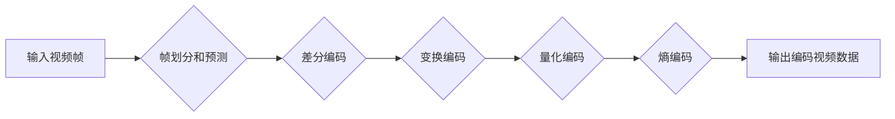

                 

## AV1 视频格式标准介绍：下一代开放媒体编码的优势和应用

> 关键词：AV1, 视频编码, 媒体编码, 压缩算法, 性能优化, 开放标准, 硬件加速

### 1. 背景介绍

随着互联网带宽的不断提升和移动设备的普及，视频内容的消费量呈指数级增长。高效的视频编码技术成为保障高质量视频传输和播放的关键。传统视频编码标准如H.264和H.265，尽管在压缩率和质量方面取得了显著进步，但随着视频分辨率和复杂度的不断提高，其编码效率逐渐面临瓶颈。

为了应对这一挑战，互联网视频联盟（Alliance for Open Media，AOMedia）于2015年成立，并发起了一项名为AV1的开放视频编码标准项目。AV1旨在提供一种更先进、更高效的视频编码技术，以满足未来视频内容的更高要求。

### 2. 核心概念与联系

AV1视频编码标准基于一种名为**“基于块的预测编码”**的原理，它将视频画面分解成多个小的块，并利用这些块之间的相关性进行预测编码。

AV1编码流程主要包括以下几个步骤：

1. **帧划分和预测:** 将视频帧划分为多个块，并根据相邻块的信息进行预测。
2. **差分编码:** 计算每个块与预测值之间的差分，并进行编码。
3. **变换编码:** 将差分数据进行变换编码，以减少数据冗余。
4. **量化编码:** 对变换系数进行量化，以进一步压缩数据。
5. **熵编码:** 对量化系数进行熵编码，以获得最小的比特率。

**Mermaid 流程图:**



### 3. 核心算法原理 & 具体操作步骤

#### 3.1 算法原理概述

AV1视频编码算法的核心是**“基于块的预测编码”**和**“变换编码”**。

* **基于块的预测编码:** AV1将视频帧划分为多个块，并利用相邻块的信息进行预测编码。预测编码可以有效减少视频数据冗余，从而提高压缩效率。
* **变换编码:** AV1采用**离散余弦变换 (DCT)** 和 **离散正弦变换 (DST)** 等变换算法，将差分数据进行变换编码，以减少数据冗余。

#### 3.2 算法步骤详解

1. **帧划分:** 将视频帧划分为多个大小相同的块，每个块通常包含16x16像素或32x32像素。
2. **预测编码:** 对于每个块，AV1会根据相邻块的信息进行预测，并计算预测值与实际值的差分。
3. **差分编码:** AV1使用**差分编码**技术对差分数据进行编码，以减少数据冗余。
4. **变换编码:** AV1采用DCT和DST等变换算法，将差分数据进行变换编码，以进一步减少数据冗余。
5. **量化编码:** AV1对变换系数进行量化，以进一步压缩数据。
6. **熵编码:** AV1使用**熵编码**技术对量化系数进行编码，以获得最小的比特率。

#### 3.3 算法优缺点

**优点:**

* **更高的压缩效率:** AV1相较于H.264和H.265，在相同质量下可以实现更高的压缩率，从而节省带宽和存储空间。
* **更好的视频质量:** AV1在相同比特率下可以提供更好的视频质量，尤其是在高分辨率和复杂场景下。
* **更广泛的应用场景:** AV1支持多种视频分辨率、帧率和色彩空间，可以应用于各种视频内容，包括直播、点播、游戏等。
* **开放标准:** AV1是一个开放标准，任何人都可以免费使用和修改，这有利于促进技术创新和生态发展。

**缺点:**

* **更高的编码复杂度:** AV1的编码算法比H.264和H.265更复杂，需要更强大的计算能力。
* **更长的编码时间:** AV1的编码时间比H.264和H.265更长，这可能会影响实时视频应用的性能。
* **硬件支持不足:** AV1的硬件支持目前还相对不足，需要更多的芯片厂商进行优化和支持。

#### 3.4 算法应用领域

AV1视频编码算法在以下领域具有广泛的应用前景:

* **视频点播:** AV1可以用于压缩和传输高品质的点播视频内容，例如电影、电视剧等。
* **直播视频:** AV1可以用于压缩和传输实时直播视频，例如游戏直播、体育赛事直播等。
* **视频会议:** AV1可以用于提高视频会议的视频质量和压缩效率，从而降低带宽需求。
* **视频监控:** AV1可以用于压缩和存储视频监控数据，从而节省存储空间。
* **虚拟现实 (VR) 和增强现实 (AR):** AV1可以用于压缩和传输高分辨率的VR和AR视频内容。

### 4. 数学模型和公式 & 详细讲解 & 举例说明

#### 4.1 数学模型构建

AV1视频编码算法的核心数学模型是**离散余弦变换 (DCT)** 和 **离散正弦变换 (DST)**。

* **DCT:** DCT是一种将信号从时域变换到频域的变换算法，可以将信号分解成多个频率分量。
* **DST:** DST是一种类似于DCT的变换算法，但其变换基函数是正弦函数。

#### 4.2 公式推导过程

**DCT 公式:**

$$
X(k) = \sqrt{\frac{2}{N}} \sum_{n=0}^{N-1} x(n) \cos \left( \frac{\pi (2n + 1)k}{2N} \right)
$$

其中:

* $X(k)$ 是 DCT 变换后的系数
* $x(n)$ 是原始信号
* $N$ 是信号长度

**DST 公式:**

$$
X(k) = \sqrt{\frac{2}{N}} \sum_{n=0}^{N-1} x(n) \sin \left( \frac{\pi (2n + 1)k}{2N} \right)
$$

其中:

* $X(k)$ 是 DST 变换后的系数
* $x(n)$ 是原始信号
* $N$ 是信号长度

#### 4.3 案例分析与讲解

假设我们有一个包含8个样本的信号 $x(n)$，我们可以使用DCT变换将其变换到频域。

**DCT 变换结果:**

$$
X(k) = \sqrt{\frac{2}{8}} \sum_{n=0}^{7} x(n) \cos \left( \frac{\pi (2n + 1)k}{16} \right)
$$

通过计算上述公式，我们可以得到 $X(k)$ 的值，这些值代表了信号在不同频率分量的强度。

### 5. 项目实践：代码实例和详细解释说明

#### 5.1 开发环境搭建

AV1视频编码的开发环境需要包含以下软件:

* **编译器:** GCC 或 Clang 等
* **AV1 编码库:** libaom 或 x265 等
* **视频处理库:** FFmpeg 或 OpenCV 等

#### 5.2 源代码详细实现

以下是一个使用 libaom 库进行 AV1 视频编码的简单代码示例:

```c
#include <stdio.h>
#include <stdlib.h>
#include <libavcodec/avcodec.h>
#include <libavformat/avformat.h>

int main() {
    // 初始化 AVCodec 库
    avcodec_register_all();

    // 打开输入视频文件
    AVFormatContext *fmt_ctx = avformat_alloc_context();
    if (avformat_open_input(&fmt_ctx, "input.mp4", NULL, NULL) < 0) {
        fprintf(stderr, "Could not open input file\n");
        return -1;
    }

    // 查找视频流
    AVStream *video_stream = NULL;
    for (unsigned int i = 0; i < fmt_ctx->nb_streams; i++) {
        if (fmt_ctx->streams[i]->codecpar->codec_type == AVMEDIA_TYPE_VIDEO) {
            video_stream = fmt_ctx->streams[i];
            break;
        }
    }

    // 打开 AVCodec 上下文
    AVCodecContext *codec_ctx = avcodec_alloc_context3(NULL);
    if (avcodec_parameters_to_context(codec_ctx, video_stream->codecpar) < 0) {
        fprintf(stderr, "Could not copy codec parameters\n");
        return -1;
    }

    // 查找 AVCodec
    AVCodec *codec = avcodec_find_decoder(codec_ctx->codec_id);
    if (!codec) {
        fprintf(stderr, "Could not find codec\n");
        return -1;
    }

    // 打开解码器
    if (avcodec_open2(codec_ctx, codec, NULL) < 0) {
        fprintf(stderr, "Could not open codec\n");
        return -1;
    }

    // ... 视频解码和编码逻辑 ...

    // 释放资源
    avcodec_free_context(&codec_ctx);
    avformat_close_input(&fmt_ctx);

    return 0;
}
```

#### 5.3 代码解读与分析

这段代码演示了如何使用 libaom 库进行 AV1 视频编码。

1. **初始化 AVCodec 库:** 首先需要初始化 AVCodec 库，以便使用 AVCodec API。
2. **打开输入视频文件:** 使用 avformat_open_input 函数打开输入视频文件。
3. **查找视频流:** 遍历视频文件中的所有流，找到视频流。
4. **打开 AVCodec 上下文:** 使用 avcodec_alloc_context3 函数分配 AVCodec 上下文，并使用 avcodec_parameters_to_context 函数将视频流的 codec 参数复制到 AVCodec 上下文中。
5. **查找 AVCodec:** 使用 avcodec_find_decoder 函数查找 AVCodec，根据视频流的 codec_id 找到对应的解码器。
6. **打开解码器:** 使用 avcodec_open2 函数打开解码器。
7. **视频解码和编码逻辑:** 在此部分需要实现视频解码和编码的具体逻辑，例如解码视频帧、进行 AV1 编码、编码视频帧等。
8. **释放资源:** 最后需要释放 AVCodec 上下文和视频文件资源。

#### 5.4 运行结果展示

运行这段代码后，可以将输入视频文件进行 AV1 编码，生成新的 AV1 视频文件。

### 6. 实际应用场景

AV1视频编码标准已经开始在各种实际应用场景中得到应用，例如:

* **YouTube:** YouTube 是首个采用 AV1 编码的视频平台，并提供 AV1 视频的点播和直播服务。
* **Netflix:** Netflix 也开始使用 AV1 编码，并计划在未来逐步将所有视频内容都转换为 AV1 格式。
* **Amazon Prime Video:** Amazon Prime Video 也开始支持 AV1 视频编码，并提供 AV1 视频的点播服务。
* **WebRTC:** WebRTC 是一个开源的实时通信协议，也开始支持 AV1 视频编码，以提高视频通话的质量和效率。

### 6.4 未来应用展望

随着硬件支持的不断完善和编码算法的不断优化，AV1 视频编码标准有望在未来得到更广泛的应用，例如:

* **8K 视频:** AV1 的高压缩效率可以有效支持 8K 视频的传输和播放。
* **VR/AR 视频:** AV1 的高视频质量和低延迟特性可以为 VR/AR 视频应用提供更好的体验。
* **物联网视频:** AV1 的低带宽需求可以为物联网视频应用提供更经济的解决方案。

### 7. 工具和资源推荐

#### 7.1 学习资源推荐

* **AV1 官方网站:** https://aomedia.org/
* **libaom 库官方网站:** https://github.com/AOMedia/libaom
* **x265 库官方网站:** https://github.com/videolan/x265

#### 7.2 开发工具推荐

* **FFmpeg:** https://ffmpeg.org/
* **OpenCV:** https://opencv.org/

#### 7.3 相关论文推荐

* **AV1 Video Coding Standard:** https://aomedia.org/wp-content/uploads/2020/03/AV1-Video-Coding-Standard-White-Paper.pdf

### 8. 总结：未来发展趋势与挑战

#### 8.1 研究成果总结

AV1 视频编码标准的诞生标志着视频编码技术迈入了新的时代。AV1 的高压缩效率、高视频质量和开放标准特性，为未来视频内容的传输和播放提供了更强大的技术支持。

#### 8.2 未来发展趋势

未来，AV1 视频编码标准将继续朝着以下方向发展:

* **更高效的编码算法:** 研究人员将继续探索更先进的编码算法，以进一步提高 AV1 的压缩效率和视频质量。
* **更广泛的硬件支持:** 更多的芯片厂商将加入 AV1 的硬件支持行列，从而降低 AV1 编码的成本和延迟。
* **更丰富的应用场景:** AV1 将被应用于更多新的场景，例如 8K 视频、VR/AR 视频、物联网视频等。

#### 8.3 面临的挑战

AV1 视频编码标准也面临着一些挑战:

* **编码复杂度:** AV1 的编码算法比 H.264 和 H.265 更复杂，需要更强大的计算能力。
* **硬件支持不足:** 目前 AV1 的硬件支持还相对不足，需要更多的芯片厂商进行优化和支持。
* **生态系统建设:** AV1 的生态系统还需要进一步完善，例如需要更多的软件工具和应用支持。

#### 8.4 研究展望

尽管面临挑战，但 AV1 视频编码标准的未来发展前景依然光明。随着技术的不断进步和生态系统的不断完善，AV1 将成为未来视频编码的主流标准，为我们带来更优质的视频体验。

### 9. 附录：常见问题与解答

**Q1: AV1 和 H.265 的区别是什么？**

**A1:** AV1 和 H.265 都是视频编码标准，但 AV1 是一个开放标准，而 H.265 是一个专利标准。AV1 的压缩效率更高，视频质量也更好，但编码复杂度也更高。

**Q2: AV1 的硬件支持如何？**

**A2:** 目前 AV1 的硬件支持还相对不足，但越来越多的芯片厂商开始加入 AV1 的硬件支持行列。

**Q3: 如何使用 AV1 进行视频编码？**

**A3:** 可以使用 libaom 或 x265 等 AV1 编码库进行视频编码。

**Q4: AV1 的未来发展趋势是什么？**

**A4:** AV1 将朝着更高效的编码算法、更广泛的硬件支持和更丰富的应用场景发展。


作者：禅与计算机程序设计艺术 / Zen and the Art of Computer Programming<end_of_turn>

