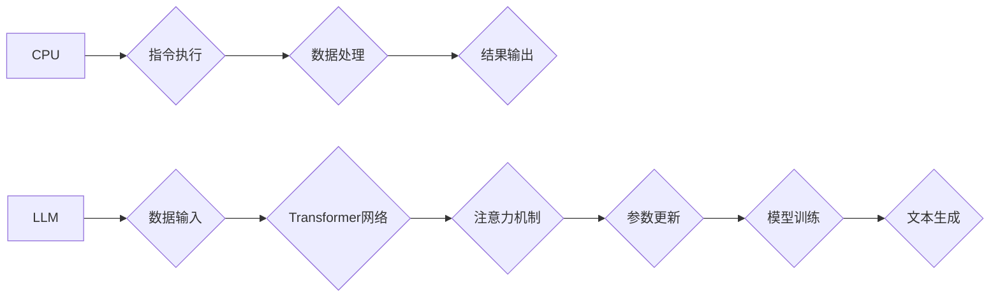

                 

## LLM vs CPU：计算范式的革命性对比

> 关键词：大型语言模型 (LLM)、中央处理器 (CPU)、人工智能 (AI)、深度学习、自然语言处理 (NLP)、计算范式、Transformer、参数量

## 1. 背景介绍

自计算机诞生以来，中央处理器 (CPU) 作为计算的核心，一直主导着信息处理的范式。然而，近年来，大型语言模型 (LLM) 的出现，正在挑战这一传统格局，为计算范式带来一场革命性的变革。

LLM 是一种基于深度学习的强大人工智能模型，能够理解和生成人类语言。它们拥有数十亿甚至数千亿的参数，通过学习海量文本数据，掌握了复杂的语言规律和知识。与传统的基于规则的自然语言处理 (NLP) 方法相比，LLM 具有更强的泛化能力和表达能力，在文本生成、翻译、问答、代码生成等领域展现出惊人的潜力。

## 2. 核心概念与联系

### 2.1 CPU 计算范式

CPU 遵循 von Neumann 体系结构，其核心是执行指令的流水线处理。数据和程序存储在统一的内存中，CPU 通过读取指令并执行相应的操作来处理信息。这种范式高效地处理结构化数据和逻辑运算，但对于复杂、非结构化的语言数据处理效率相对较低。

### 2.2 LLM 计算范式

LLM 采用基于 Transformer 架构的深度神经网络，其核心是通过注意力机制学习语言之间的上下文关系。模型参数存储在网络中，通过前向传播和反向传播算法进行训练。这种范式能够有效地处理非结构化数据，并学习到复杂的语言模式和知识。

**Mermaid 流程图**



## 3. 核心算法原理 & 具体操作步骤

### 3.1 算法原理概述

LLM 的核心算法是 Transformer 网络，它通过注意力机制学习语言之间的上下文关系。注意力机制允许模型关注输入序列中与当前任务最相关的部分，从而提高处理复杂语言的效率和准确性。

### 3.2 算法步骤详解

1. **输入编码:** 将输入文本序列转换为数字向量，每个单词对应一个向量表示。
2. **多头注意力:** 对输入向量进行多头注意力计算，学习每个单词与其他单词之间的关系。
3. **前馈神经网络:** 对注意力输出进行非线性变换，提取更深层的语义信息。
4. **位置编码:** 添加位置信息，使模型能够理解单词在句子中的顺序。
5. **解码:** 使用类似的 Transformer 结构解码输入序列，生成输出文本序列。

### 3.3 算法优缺点

**优点:**

* 强大的语言理解和生成能力
* 能够处理长文本序列
* 泛化能力强，适用于多种 NLP 任务

**缺点:**

* 参数量巨大，训练成本高
* 计算资源需求大
* 容易受到训练数据偏差的影响

### 3.4 算法应用领域

* 文本生成 (例如，文章写作、故事创作)
* 机器翻译
* 问答系统
* 代码生成
* 对话系统

## 4. 数学模型和公式 & 详细讲解 & 举例说明

### 4.1 数学模型构建

LLM 的数学模型主要基于 Transformer 架构，其核心是注意力机制。注意力机制可以表示为一个权重矩阵，该矩阵用于衡量每个单词对当前单词的影响程度。

### 4.2 公式推导过程

注意力机制的计算公式如下：

$$
Attention(Q, K, V) = softmax(\frac{QK^T}{\sqrt{d_k}})V
$$

其中：

* $Q$：查询矩阵
* $K$：键矩阵
* $V$：值矩阵
* $d_k$：键向量的维度
* $softmax$：softmax 函数

### 4.3 案例分析与讲解

假设我们有一个句子 "The cat sat on the mat"，我们想要计算 "sat" 这个单词对整个句子的注意力权重。

1. 将每个单词转换为向量表示，形成 $Q$、$K$ 和 $V$ 矩阵。
2. 计算 $QK^T$，得到一个权重矩阵。
3. 对权重矩阵进行 softmax 操作，得到每个单词对 "sat" 的注意力权重。
4. 将注意力权重与 $V$ 矩阵相乘，得到 "sat" 这个单词对整个句子的上下文表示。

## 5. 项目实践：代码实例和详细解释说明

### 5.1 开发环境搭建

* Python 3.7+
* PyTorch 或 TensorFlow
* CUDA (可选)

### 5.2 源代码详细实现

```python
import torch
import torch.nn as nn

class Attention(nn.Module):
    def __init__(self, d_model, num_heads):
        super(Attention, self).__init__()
        self.d_model = d_model
        self.num_heads = num_heads
        self.head_dim = d_model // num_heads

        self.query = nn.Linear(d_model, d_model)
        self.key = nn.Linear(d_model, d_model)
        self.value = nn.Linear(d_model, d_model)
        self.fc_out = nn.Linear(d_model, d_model)

    def forward(self, query, key, value, mask=None):
        batch_size = query.size(0)

        # Linear projections
        Q = self.query(query).view(batch_size, -1, self.num_heads, self.head_dim).transpose(1, 2)
        K = self.key(key).view(batch_size, -1, self.num_heads, self.head_dim).transpose(1, 2)
        V = self.value(value).view(batch_size, -1, self.num_heads, self.head_dim).transpose(1, 2)

        # Scaled dot-product attention
        scores = torch.matmul(Q, K.transpose(-2, -1)) / torch.sqrt(torch.tensor(self.head_dim, dtype=torch.float))
        if mask is not None:
            scores = scores.masked_fill(mask == 0, -1e9)
        attention = torch.softmax(scores, dim=-1)

        # Weighted sum of values
        context = torch.matmul(attention, V)

        # Concatenate heads and project
        context = context.transpose(1, 2).contiguous().view(batch_size, -1, self.d_model)
        output = self.fc_out(context)

        return output
```

### 5.3 代码解读与分析

这段代码实现了 Transformer 架构中的注意力机制。

* `__init__` 方法初始化模型参数，包括输入维度、注意力头数等。
* `forward` 方法实现注意力机制的计算过程，包括线性投影、缩放点积注意力、softmax 归一化和加权求和等步骤。

### 5.4 运行结果展示

运行该代码可以计算给定输入序列的注意力权重，并生成相应的上下文表示。

## 6. 实际应用场景

LLM 在各个领域都有着广泛的应用场景，例如：

* **文本生成:** 使用 LLM 可以生成高质量的文本内容，例如文章、故事、诗歌等。
* **机器翻译:** LLM 可以实现高质量的机器翻译，突破语言障碍。
* **问答系统:** LLM 可以理解用户的问题，并从知识库中找到相应的答案。
* **代码生成:** LLM 可以根据自然语言描述生成代码，提高开发效率。
* **对话系统:** LLM 可以构建更自然、更智能的对话系统，例如聊天机器人。

### 6.4 未来应用展望

随着 LLM 技术的不断发展，其应用场景将更加广泛，例如：

* **个性化教育:** 根据学生的学习情况，提供个性化的学习内容和辅导。
* **医疗诊断:** 辅助医生进行疾病诊断，提高诊断准确率。
* **法律服务:** 自动分析法律文件，提供法律建议。
* **科学研究:** 帮助科学家进行数据分析和模型构建。

## 7. 工具和资源推荐

### 7.1 学习资源推荐

* **书籍:**
    * "Deep Learning" by Ian Goodfellow, Yoshua Bengio, and Aaron Courville
    * "Speech and Language Processing" by Daniel Jurafsky and James H. Martin
* **在线课程:**
    * Stanford CS224N: Natural Language Processing with Deep Learning
    * DeepLearning.AI: Natural Language Processing Specialization

### 7.2 开发工具推荐

* **PyTorch:** 深度学习框架，支持 GPU 加速
* **TensorFlow:** 深度学习框架，支持多种平台
* **Hugging Face Transformers:** 提供预训练的 LLM 模型和工具

### 7.3 相关论文推荐

* "Attention Is All You Need" by Vaswani et al. (2017)
* "BERT: Pre-training of Deep Bidirectional Transformers for Language Understanding" by Devlin et al. (2018)
* "GPT-3: Language Models are Few-Shot Learners" by Brown et al. (2020)

## 8. 总结：未来发展趋势与挑战

### 8.1 研究成果总结

LLM 的出现标志着人工智能领域取得了重大突破，为自然语言处理带来了革命性的变革。

### 8.2 未来发展趋势

* **模型规模的进一步扩大:** 随着计算资源的不断提升，LLM 的参数量将继续扩大，模型能力将进一步增强。
* **多模态学习:** LLM 将与其他模态数据 (例如图像、音频) 相结合，实现更全面的理解和生成。
* **可解释性研究:** 如何提高 LLM 的可解释性，使其决策过程更加透明，是未来研究的重要方向。

### 8.3 面临的挑战

* **训练成本高:** 训练大型 LLM 需要大量的计算资源和时间，成本很高。
* **数据偏差:** LLM 的训练数据可能存在偏差，导致模型输出存在偏见。
* **安全风险:** LLM 可以被用于生成虚假信息、进行恶意攻击等，需要加强安全防护。

### 8.4 研究展望

未来，LLM 将继续朝着更强大、更智能、更安全的方向发展，为人类社会带来更多福祉。

## 9. 附录：常见问题与解答

* **什么是 LLM?**

LLM 指的是大型语言模型，是一种基于深度学习的强大人工智能模型，能够理解和生成人类语言。

* **LLM 与传统 NLP 方法有什么区别?**

LLM 采用 Transformer 架构，能够有效地处理非结构化数据，并学习到复杂的语言模式和知识，而传统 NLP 方法主要基于规则和特征工程，处理能力有限。

* **LLM 的应用场景有哪些?**

LLM 在文本生成、机器翻译、问答系统、代码生成、对话系统等领域都有广泛的应用场景。

* **如何训练 LLM?**

训练 LLM 需要大量的计算资源和时间，通常使用海量文本数据进行监督学习。

* **LLM 的未来发展趋势是什么?**

LLM 将朝着更强大、更智能、更安全的方向发展，例如模型规模的扩大、多模态学习、可解释性研究等。


作者：禅与计算机程序设计艺术 / Zen and the Art of Computer Programming 
<end_of_turn>

