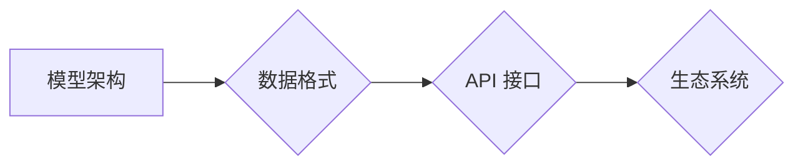

                 

## LLM 标准化：促进互操作性与兼容性

> 关键词：LLM、标准化、互操作性、兼容性、模型架构、数据格式、API接口、生态系统

## 1. 背景介绍

大型语言模型（LLM）近年来取得了令人瞩目的进展，在自然语言处理、文本生成、代码生成等领域展现出强大的能力。然而，随着 LLMs 的快速发展，其多样性和复杂性也日益增加，导致模型之间缺乏标准化，难以实现互操作性和兼容性。

目前，LLMs 的开发和部署面临着诸多挑战：

* **模型架构多样性:** 不同的研究机构和公司采用不同的模型架构，例如 Transformer、GPT、BERT 等，导致模型之间难以直接使用和比较。
* **数据格式不统一:** LLMs 的训练数据格式各异，缺乏统一的标准，难以进行数据共享和迁移学习。
* **API 接口不兼容:** 不同 LLMs 的 API 接口设计不一致，难以实现跨平台的应用开发和集成。
* **生态系统碎片化:** LLMs 的生态系统尚未形成统一的标准，导致工具、资源和服务分散，难以形成规模效应。

这些问题阻碍了 LLMs 的广泛应用和产业化发展。因此，LLM 标准化势在必行，以促进模型互操作性、兼容性和生态系统建设。

## 2. 核心概念与联系

LLM 标准化是指在模型架构、数据格式、API 接口等方面建立统一的标准规范，使不同 LLMs 可以相互理解、交互和协作。

**标准化目标:**

* **互操作性:** 不同 LLMs 可以相互连接和交换数据，实现无缝集成。
* **兼容性:** 不同 LLMs 可以使用相同的工具和资源，降低开发成本和难度。
* **可移植性:** LLMs 可以跨平台、跨设备运行，提高应用的灵活性和扩展性。
* **可维护性:** 标准化的 LLMs 更易于维护和更新，降低运营成本。

**标准化架构:**



**核心概念:**

* **模型架构:** 标准化模型架构可以使不同 LLMs 拥有相同的输入输出结构和计算流程，实现模型之间的互通。
* **数据格式:** 统一的数据格式可以方便 LLMs 之间的训练数据共享和迁移学习，提高模型的泛化能力。
* **API 接口:** 标准化的 API 接口可以使开发者更容易地调用和集成 LLMs，降低开发门槛。
* **生态系统:** 标准化可以促进 LLMs 生态系统的建设，形成丰富的工具、资源和服务，推动 LLMs 的创新和应用。

## 3. 核心算法原理 & 具体操作步骤

### 3.1  算法原理概述

LLM 标准化算法的核心是基于模型架构、数据格式和 API 接口的统一规范。

* **模型架构标准化:** 采用通用的模型架构，例如 Transformer，并定义统一的输入输出格式，使不同 LLMs 可以直接进行数据交换和模型融合。
* **数据格式标准化:** 使用统一的数据格式，例如 JSON 或 YAML，存储和交换 LLMs 的训练数据，方便数据共享和迁移学习。
* **API 接口标准化:** 定义统一的 API 接口规范，使开发者可以方便地调用和集成不同 LLMs，降低开发门槛。

### 3.2  算法步骤详解

1. **模型架构定义:** 确定统一的模型架构，并定义模型的输入输出格式、参数结构等。
2. **数据格式规范:** 制定统一的数据格式规范，包括数据结构、数据类型、数据编码等。
3. **API 接口设计:** 设计统一的 API 接口规范，包括接口请求格式、接口响应格式、接口参数定义等。
4. **标准文档发布:** 将标准规范文档公开发布，供开发者和研究者参考和使用。
5. **工具和资源开发:** 开发工具和资源，支持开发者按照标准规范开发和部署 LLMs。
6. **生态系统建设:** 鼓励开发者和研究者参与到标准化生态系统建设中，共同推动 LLMs 的发展。

### 3.3  算法优缺点

**优点:**

* **提高互操作性:** 标准化可以使不同 LLMs 可以相互连接和交换数据，实现无缝集成。
* **降低开发成本:** 标准化的 API 接口和数据格式可以降低开发者开发和集成 LLMs 的成本。
* **促进生态系统建设:** 标准化可以促进 LLMs 生态系统的建设，形成丰富的工具、资源和服务。

**缺点:**

* **标准制定难度:** 标准化需要跨机构、跨领域的合作，制定标准过程可能比较复杂。
* **标准兼容性问题:** 标准的更新迭代可能会导致兼容性问题，需要不断进行维护和更新。
* **创新阻碍:** 过于严格的标准化可能会阻碍 LLMs 的创新发展。

### 3.4  算法应用领域

LLM 标准化算法可以应用于以下领域:

* **自然语言处理:** 标准化可以使不同 NLP 模型可以相互集成，构建更强大的 NLP 应用。
* **文本生成:** 标准化可以使不同文本生成模型可以相互协作，生成更高质量的文本内容。
* **代码生成:** 标准化可以使不同代码生成模型可以相互配合，提高代码生成效率和准确性。
* **机器翻译:** 标准化可以使不同机器翻译模型可以相互融合，提高翻译质量和效率。

## 4. 数学模型和公式 & 详细讲解 & 举例说明

### 4.1  数学模型构建

LLM 标准化可以基于数学模型进行构建，例如：

* **模型架构相似度度量:** 使用数学公式计算不同模型架构的相似度，例如 Hausdorff距离或编辑距离。
* **数据格式转换算法:** 使用数学算法将不同数据格式转换为统一格式，例如 JSON 或 YAML。
* **API 接口兼容性分析:** 使用数学模型分析不同 API 接口的兼容性，例如接口参数类型匹配度或接口调用流程一致性。

### 4.2  公式推导过程

例如，可以使用 Hausdorff距离来度量两个模型架构的相似度：

$$
d_H(A, B) = \max \{ \sup_{a \in A} \inf_{b \in B} ||a - b||, \sup_{b \in B} \inf_{a \in A} ||a - b|| \}
$$

其中：

* $A$ 和 $B$ 分别表示两个模型架构。
* $||a - b||$ 表示两个模型架构中对应元素之间的距离。

### 4.3  案例分析与讲解

假设有两个模型架构 $A$ 和 $B$，它们的 Hausdorff距离为 0.5，则说明这两个模型架构的相似度较高。

## 5. 项目实践：代码实例和详细解释说明

### 5.1  开发环境搭建

* **操作系统:** Linux 或 macOS
* **编程语言:** Python
* **深度学习框架:** TensorFlow 或 PyTorch
* **工具:** Git、Docker

### 5.2  源代码详细实现

以下是一个简单的 LLM 标准化工具的代码示例，使用 Python 和 TensorFlow 实现：

```python
import tensorflow as tf

# 定义统一的模型架构
class StandardLLM(tf.keras.Model):
    def __init__(self, embedding_dim, hidden_dim, num_layers):
        super(StandardLLM, self).__init__()
        self.embedding = tf.keras.layers.Embedding(vocab_size, embedding_dim)
        self.transformer = tf.keras.layers.Transformer(
            num_layers=num_layers,
            embedding_dim=embedding_dim,
            hidden_dim=hidden_dim,
        )
        self.output = tf.keras.layers.Dense(vocab_size)

    def call(self, inputs):
        x = self.embedding(inputs)
        x = self.transformer(x)
        x = self.output(x)
        return x

# 定义数据格式转换函数
def convert_data_format(data, format="json"):
    if format == "json":
        # 将数据转换为 JSON 格式
        return json.dumps(data)
    elif format == "yaml":
        # 将数据转换为 YAML 格式
        return yaml.dump(data)
    else:
        raise ValueError("Unsupported data format.")

# 定义 API 接口
def predict(text):
    # 使用标准化模型进行预测
    model = StandardLLM(embedding_dim=128, hidden_dim=256, num_layers=6)
    # ...
    return prediction
```

### 5.3  代码解读与分析

* **模型架构定义:** 代码中定义了一个 `StandardLLM` 类，代表标准化的模型架构，使用 Transformer 结构。
* **数据格式转换函数:** `convert_data_format` 函数可以将数据转换为不同的格式，例如 JSON 或 YAML。
* **API 接口:** `predict` 函数定义了一个 API 接口，可以接受文本输入并返回预测结果。

### 5.4  运行结果展示

运行上述代码可以实现文本预测功能，并根据标准化的模型架构和数据格式进行操作。

## 6. 实际应用场景

LLM 标准化在以下场景中具有重要意义:

* **跨平台应用:** 标准化可以使 LLMs 在不同的平台和设备上运行，例如云端、边缘设备和移动设备。
* **模型集成:** 标准化可以使不同 LLMs 可以相互集成，构建更强大的复合模型。
* **数据共享:** 标准化可以促进 LLMs 训练数据的共享，提高模型的泛化能力。
* **自动化开发:** 标准化可以使 LLMs 的开发和部署更加自动化，降低开发成本和时间。

### 6.4  未来应用展望

随着 LLMs 的发展，标准化将发挥越来越重要的作用，推动 LLMs 的广泛应用和产业化发展。

## 7. 工具和资源推荐

### 7.1  学习资源推荐

* **OpenAI API文档:** https://platform.openai.com/docs/api-reference
* **HuggingFace Transformers库文档:** https://huggingface.co/docs/transformers/index
* **TensorFlow文档:** https://www.tensorflow.org/

### 7.2  开发工具推荐

* **Git:** 版本控制工具
* **Docker:** 容器化工具
* **Jupyter Notebook:** 数据分析和代码开发工具

### 7.3  相关论文推荐

* **BERT: Pre-training of Deep Bidirectional Transformers for Language Understanding:** https://arxiv.org/abs/1810.04805
* **GPT-3: Language Models are Few-Shot Learners:** https://arxiv.org/abs/2005.14165
* **The Illustrated Transformer:** https://jalammar.github.io/illustrated-transformer/

## 8. 总结：未来发展趋势与挑战

### 8.1  研究成果总结

LLM 标准化取得了显著进展，例如模型架构标准化、数据格式标准化和 API 接口标准化等。这些标准化工作促进了 LLMs 的互操作性和兼容性，推动了 LLMs 的生态系统建设。

### 8.2  未来发展趋势

* **更广泛的标准化:** 未来将会有更多 LLMs 的标准化工作，包括模型训练、模型评估和模型部署等方面。
* **更灵活的标准:** 标准化需要更加灵活和适应性强，以适应 LLMs 的快速发展和多样化需求。
* **更强大的生态系统:** 标准化将促进 LLMs 生态系统的建设，形成更加丰富的工具、资源和服务。

### 8.3  面临的挑战

* **标准制定难度:** 标准化需要跨机构、跨领域的合作，制定标准过程可能比较复杂。
* **标准兼容性问题:** 标准的更新迭代可能会导致兼容性问题，需要不断进行维护和更新。
* **创新阻碍:** 过于严格的标准化可能会阻碍 LLMs 的创新发展。

### 8.4  研究展望

未来研究方向包括：

* **开发更灵活和适应性的标准:** 探索新的标准化方法，使其更加灵活和适应 LLMs 的快速发展。
* **构建更强大的生态系统:** 鼓励开发者和研究者参与到标准化生态系统建设中，形成更加丰富的工具、资源和服务。
* **研究标准化对 LLMs 创新和应用的影响:** 评估标准化对 LLMs 创新和应用的影响，并提出相应的改进建议。

## 9. 附录：常见问题与解答

**Q1: 为什么需要 LLMs 标准化？**

**A1:** LLMs 标准化可以提高模型互操作性、兼容性和生态系统建设，促进 LLMs 的广泛应用和产业化发展。

**Q2: LLMs 标准化有哪些挑战？**

**A2:** LLMs 标准化面临的挑战包括标准制定难度、标准兼容性问题和创新阻碍等。

**Q3: 未来 LLMs 标准化会朝着什么方向发展？**

**A3:** 未来 LLMs 标准化将更加广泛、灵活和强大，并构建更加丰富的生态系统。


作者：禅与计算机程序设计艺术 / Zen and the Art of Computer Programming<end_of_turn>

