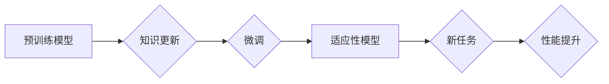

                 

## LLM 的适应性：持续学习和进步

> 关键词：大型语言模型 (LLM)、持续学习、适应性、迁移学习、微调、知识更新、模型蒸馏、神经网络、深度学习

## 1. 背景介绍

大型语言模型 (LLM) 近年来取得了令人瞩目的成就，在自然语言处理 (NLP) 领域展现出强大的能力，例如文本生成、翻译、问答和代码编写。然而，这些模型通常在训练时依赖于海量静态数据集，缺乏对新信息和知识的适应能力。随着世界信息的不停更新和变化，LLM 的知识库会逐渐过时，其性能也会下降。因此，如何使 LLM 具备持续学习和进步的能力，使其能够适应不断变化的环境，成为一个重要的研究方向。

## 2. 核心概念与联系

**2.1 持续学习 (Continual Learning)**

持续学习是指机器学习模型在不断接收到新数据时，能够保留先前学习到的知识，并更新其知识库以适应新信息的能力。 

**2.2 适应性 (Adaptability)**

适应性是指模型能够根据新的环境、任务或数据分布进行调整和优化，从而提高其在特定情境下的性能。

**2.3 迁移学习 (Transfer Learning)**

迁移学习是指利用预训练模型在源任务上的知识，迁移到目标任务，以提高目标任务的学习效率。

**2.4 微调 (Fine-tuning)**

微调是指在预训练模型的基础上，使用目标任务的数据进行进一步训练，以优化模型在目标任务上的性能。

**2.5 知识更新 (Knowledge Update)**

知识更新是指模型能够识别和吸收新知识，并将其整合到现有知识库中，从而更新其理解和预测能力。

**2.6 模型蒸馏 (Model Distillation)**

模型蒸馏是指将大型模型的知识“蒸馏”到小型模型中，从而获得更轻量级、更易部署的模型。

**Mermaid 流程图**



## 3. 核心算法原理 & 具体操作步骤

### 3.1 算法原理概述

LLM 的适应性主要依赖于以下几个核心算法原理：

* **迁移学习:** 利用预训练模型在源任务上的知识，迁移到目标任务，减少目标任务的训练数据需求和训练时间。
* **微调:** 在预训练模型的基础上，使用目标任务的数据进行进一步训练，优化模型在目标任务上的性能。
* **知识蒸馏:** 将大型模型的知识“蒸馏”到小型模型中，从而获得更轻量级、更易部署的模型。
* **持续学习:** 

设计算法和策略，使模型能够在不断接收到新数据时，保留先前学习到的知识，并更新其知识库以适应新信息。

### 3.2 算法步骤详解

**3.2.1 迁移学习**

1. 选择一个预训练模型，该模型在与目标任务相关的领域具有良好的性能。
2. 将预训练模型的权重作为目标模型的初始值。
3. 使用目标任务的数据对模型进行微调，调整模型参数以适应目标任务。

**3.2.2 微调**

1. 选择一个预训练模型，该模型在与目标任务相关的领域具有良好的性能。
2. 使用目标任务的数据对模型进行训练，调整模型参数以优化目标任务的性能。

**3.2.3 模型蒸馏**

1. 选择一个大型模型作为教师模型，并选择一个小型模型作为学生模型。
2. 使用教师模型的输出作为学生模型的监督信号，训练学生模型。
3. 通过调整教师模型和学生模型的结构和参数，提高学生模型的性能。

**3.2.4 持续学习**

1. 使用**经验回放**技术，定期从历史数据中随机抽取样本进行训练，以帮助模型保留先前学习到的知识。
2. 使用**正则化**技术，例如**权重衰减**，防止模型过拟合新数据，并保留对先前知识的记忆。
3. 使用**动态权重更新**策略，例如**权重冻结**和**权重衰减**，根据新数据的重要性调整模型参数的更新速度。

### 3.3 算法优缺点

**3.3.1 迁移学习**

* **优点:** 减少训练数据需求，提高训练效率，提高模型性能。
* **缺点:** 需要找到合适的预训练模型，预训练模型的知识可能与目标任务不完全匹配。

**3.3.2 微调**

* **优点:** 可以针对特定任务进行优化，提高模型性能。
* **缺点:** 需要大量的目标任务数据，容易过拟合。

**3.3.3 模型蒸馏**

* **优点:** 可以获得更轻量级、更易部署的模型。
* **缺点:** 蒸馏过程复杂，需要精心设计教师模型和学生模型。

**3.3.4 持续学习**

* **优点:** 使模型能够适应不断变化的环境，保持其知识库的最新状态。
* **缺点:** 算法设计复杂，需要解决遗忘问题和灾难性遗忘问题。

### 3.4 算法应用领域

* **自然语言处理:** 文本分类、情感分析、机器翻译、问答系统等。
* **计算机视觉:** 图像识别、目标检测、图像分割等。
* **语音识别:** 语音转文本、语音合成等。
* **推荐系统:** 商品推荐、内容推荐等。
* **医疗诊断:** 病症诊断、药物推荐等。

## 4. 数学模型和公式 & 详细讲解 & 举例说明

### 4.1 数学模型构建

**4.1.1 迁移学习**

迁移学习的数学模型通常基于**最小化损失函数**的思想。损失函数衡量模型预测结果与真实结果之间的差异。在迁移学习中，损失函数通常包含两个部分：

* **源任务损失:** 衡量模型在源任务上的预测性能。
* **目标任务损失:** 衡量模型在目标任务上的预测性能。

**4.1.2 微调**

微调的数学模型与传统的监督学习模型类似，其目标是**最小化目标任务的损失函数**。

**4.1.3 模型蒸馏**

模型蒸馏的数学模型通常基于**知识蒸馏损失函数**。知识蒸馏损失函数衡量教师模型和学生模型的输出之间的差异。

**4.1.4 持续学习**

持续学习的数学模型通常基于**动态权重更新策略**。这些策略旨在平衡新知识的学习和先前知识的保留。

### 4.2 公式推导过程

**4.2.1 迁移学习损失函数**

$$
L = \lambda_s L_s + \lambda_t L_t
$$

其中：

* $L$ 是总损失函数。
* $\lambda_s$ 和 $\lambda_t$ 是源任务损失和目标任务损失的权重。
* $L_s$ 是源任务损失函数。
* $L_t$ 是目标任务损失函数。

**4.2.2 微调损失函数**

$$
L = L_t
$$

其中：

* $L$ 是总损失函数。
* $L_t$ 是目标任务损失函数。

**4.2.3 模型蒸馏损失函数**

$$
L = KL(P_{stu}||P_{tea}) + \lambda L_{data}
$$

其中：

* $L$ 是总损失函数。
* $KL$ 是KL散度，衡量教师模型输出和学生模型输出之间的差异。
* $P_{stu}$ 是学生模型的输出概率分布。
* $P_{tea}$ 是教师模型的输出概率分布。
* $\lambda$ 是数据损失的权重。
* $L_{data}$ 是数据损失函数，衡量学生模型在目标任务上的预测性能。

### 4.3 案例分析与讲解

**4.3.1 迁移学习案例**

在自然语言处理领域，可以使用预训练的语言模型，例如BERT或GPT-3，进行迁移学习。例如，可以利用BERT在文本分类任务上的预训练知识，迁移到新的文本分类任务中，例如情感分析或主题分类。

**4.3.2 微调案例**

在图像识别领域，可以使用预训练的图像识别模型，例如ResNet或Inception，进行微调。例如，可以使用ResNet在ImageNet数据集上预训练的模型，微调到新的图像识别任务中，例如人脸识别或物体检测。

**4.3.3 模型蒸馏案例**

在语音识别领域，可以使用大型语音识别模型进行模型蒸馏，生成更轻量级的语音识别模型。例如，可以使用Google的语音识别模型将知识蒸馏到更小的模型中，从而降低模型的计算成本和部署难度。

## 5. 项目实践：代码实例和详细解释说明

### 5.1 开发环境搭建

* **操作系统:** Ubuntu 20.04
* **Python 版本:** 3.8
* **深度学习框架:** PyTorch 1.8
* **其他依赖库:** transformers, numpy, pandas

### 5.2 源代码详细实现

```python
import torch
from transformers import AutoModelForSequenceClassification, AutoTokenizer

# 加载预训练模型和分词器
model_name = "bert-base-uncased"
tokenizer = AutoTokenizer.from_pretrained(model_name)
model = AutoModelForSequenceClassification.from_pretrained(model_name, num_labels=2)

# 定义训练数据
train_data = [
    ("This is a positive sentence.", 1),
    ("This is a negative sentence.", 0),
]

# 定义训练函数
def train(model, train_data, epochs=3):
    optimizer = torch.optim.AdamW(model.parameters(), lr=2e-5)
    for epoch in range(epochs):
        for text, label in train_data:
            # 将文本转换为输入
            inputs = tokenizer(text, return_tensors="pt")
            # 前向传播
            outputs = model(**inputs)
            # 计算损失
            loss = outputs.loss
            # 反向传播
            optimizer.zero_grad()
            loss.backward()
            # 更新参数
            optimizer.step()

# 训练模型
train(model, train_data)

# 保存模型
model.save_pretrained("my_fine_tuned_model")
```

### 5.3 代码解读与分析

* **加载预训练模型和分词器:** 使用transformers库加载预训练的BERT模型和对应的分词器。
* **定义训练数据:** 定义一个简单的训练数据集，包含一些文本和对应的标签。
* **定义训练函数:** 定义一个训练函数，使用AdamW优化器对模型进行训练。
* **训练模型:** 调用训练函数，训练模型。
* **保存模型:** 保存训练好的模型。

### 5.4 运行结果展示

训练完成后，可以将模型用于新的文本分类任务。例如，可以将新的文本输入到模型中，得到其对应的分类标签。

## 6. 实际应用场景

**6.1 自然语言处理**

* **情感分析:** 识别文本中的情感倾向，例如积极、消极或中性。
* **问答系统:** 回答用户提出的问题，例如搜索引擎、聊天机器人。
* **文本摘要:** 生成文本的简短摘要，例如新闻文章、会议记录。
* **机器翻译:** 将文本从一种语言翻译成另一种语言。

**6.2 计算机视觉**

* **图像识别:** 识别图像中的物体，例如人脸、车辆、动物。
* **目标检测:** 在图像中定位和识别多个目标，例如自动驾驶汽车。
* **图像分割:** 将图像分割成不同的区域，例如医学图像分析。

**6.3 语音识别**

* **语音转文本:** 将语音转换为文本，例如语音助手、语音输入。
* **语音合成:** 将文本转换为语音，例如语音播报、虚拟助手。

**6.4 其他领域**

* **推荐系统:** 根据用户的历史行为推荐商品或内容。
* **医疗诊断:** 辅助医生诊断疾病，例如分析医学图像、预测患者风险。
* **金融分析:** 分析金融数据，预测市场趋势。

**6.5 未来应用展望**

随着LLM的不断发展，其应用场景将会更加广泛，例如：

* **个性化教育:** 根据学生的学习情况提供个性化的学习内容和辅导。
* **智能客服:** 提供更加智能和人性化的客服服务。
* **创意写作:** 辅助人类进行创意写作，例如诗歌、小说、剧本。
* **科学研究:** 加速科学研究的进程，例如药物研发、材料科学。

## 7. 工具和资源推荐

### 7.1 学习资源推荐

* **书籍:**
    * Deep Learning by Ian Goodfellow, Yoshua Bengio, and Aaron Courville
    * Hands-On Machine Learning with Scikit-Learn, Keras & TensorFlow by Aurélien Géron
* **在线课程:**
    * Stanford CS224N: Natural Language Processing with Deep Learning
    * DeepLearning.AI TensorFlow Specialization
* **博客和网站:**
    * Towards Data Science
    * Machine Learning Mastery
    * OpenAI Blog

### 7.2 开发工具推荐

* **深度学习框架:** PyTorch, TensorFlow, Keras
* **自然语言处理库:** transformers, spaCy, NLTK
* **数据处理库:** pandas, NumPy
* **可视化工具:** Matplotlib, Seaborn

### 7.3 相关论文推荐

* **BERT: Pre-training of Deep Bidirectional Transformers for Language Understanding**
* **GPT-3: Language Models are Few-Shot Learners**
* **Knowledge Distillation**
* **Continual Learning: A Survey**

## 8. 总结：未来发展趋势与挑战

### 8.1 研究成果总结

近年来，LLM 在自然语言处理等领域取得了显著的进展，其适应性、迁移能力和知识更新能力不断增强。

### 8.2 未来发展趋势

* **更强大的模型:** 随着计算资源的不断提升，LLM 的规模和能力将会进一步增强。
* **更有效的训练方法:** 研究人员将继续探索更有效的训练方法，例如自监督学习、强化学习和联邦学习。
* **更广泛的应用场景:** LLM 将应用于更多领域，例如医疗、教育、金融和科学研究。
* **更注重伦理和安全:** 随着LLM 的应用越来越广泛，其伦理和安全问题也越来越重要。

### 8.3 面临的挑战

* **数据获取和标注:** LLM 的训练需要大量的标注数据，获取和标注数据是一个巨大的挑战。
* **计算资源:** 训练大型LLM 需要大量的计算资源，这对于资源有限的机构来说是一个障碍。
* **模型解释性和可解释性:** LLM 的决策过程通常是复杂的，难以解释和理解，这对于其在安全敏感领域的应用是一个挑战。
* **公平性和偏见:** LLM 可能存在公平性和偏见问题，需要进行仔细的评估和缓解。

### 8.4 研究展望

未来，LLM 研究将继续朝着以下方向发展：

* **开发更小、更轻量级的模型:** 降低模型的计算成本和部署难度。
* **提高模型的泛化能力:** 使模型能够更好地适应新的数据和任务。
* **增强模型的安全性:** 确保模型的可靠性和安全性。
* **探索新的训练方法:** 例如自监督学习、强化学习和联邦学习。
* **研究LLM的伦理和社会影响:** 确保LLM 的安全、公平和可解释性。

## 9. 附录：常见问题与解答

**9.1 如何选择合适的预训练模型？**

选择预训练模型需要考虑以下因素：

* **任务类型:** 不同的任务需要不同的预训练模型。例如，文本分类任务可以使用BERT，而图像识别任务可以使用ResNet。
* **模型大小:** 模型大小与性能和计算资源之间存在权衡关系。
* **预训练数据集:** 预训练数据集的大小和质量会影响模型的性能。

**9.2 如何进行模型微调？**

模型微调通常包括以下步骤：

* **加载预训练模型:** 使用transformers库加载预训练模型。
* **准备训练数据:** 将训练数据转换为模型可识别的格式。
* **定义损失函数和优化器:** 选择合适的损失函数和优化器。
* **训练模型:** 使用训练数据训练模型。
* **评估模型:** 使用测试数据评估模型的性能。

**9.3 如何解决模型过拟合问题？**

模型过拟合是指模型在训练数据上表现良好，但在测试数据上表现差。

解决模型过拟合问题的方法包括：

* **增加训练数据:** 更多的训练数据可以帮助模型更好地泛化。
* **使用正则化技术:** 正则化技术可以防止模型过拟合，例如权重衰减和 dropout。
* **使用早停训练:** 在训练过程中，如果模型在验证集上的性能不再提升，则停止训练。
* **使用交叉验证:** 交叉验证可以帮助评估模型的泛化能力。


作者：禅与计算机程序设计艺术 / Zen and the Art of Computer Programming<end_of_turn>
<end_of_turn>

