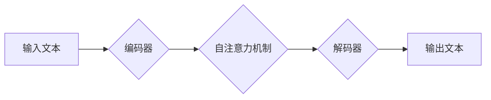

                 

## LLM:计算架构的革命性突破

> 关键词：大型语言模型 (LLM)、Transformer、深度学习、自然语言处理 (NLP)、计算架构、并行计算、高效训练

## 1. 背景介绍

近年来，深度学习技术取得了令人瞩目的进展，特别是大型语言模型 (LLM) 的出现，彻底改变了自然语言处理 (NLP) 领域。LLM 拥有数十亿甚至数千亿个参数，能够理解和生成人类语言，展现出强大的文本生成、翻译、问答、代码生成等能力。然而，LLM 的训练和部署对计算资源的需求极高，这限制了其更广泛的应用。

传统计算架构难以满足 LLM 的训练和推理需求，因此，探索新的计算架构成为一个重要的研究方向。本文将深入探讨 LLM 的计算架构，分析其核心概念、算法原理、数学模型以及实际应用场景，并展望未来发展趋势。

## 2. 核心概念与联系

### 2.1 Transformer 架构

Transformer 架构是 LLM 的核心，它利用自注意力机制 (Self-Attention) 来捕捉文本序列中的长距离依赖关系，有效解决了传统 RNN 模型在处理长文本时遇到的梯度消失问题。

Transformer 架构主要由以下部分组成：

* **编码器 (Encoder):** 用于将输入文本序列编码成向量表示。
* **解码器 (Decoder):** 用于根据编码后的向量表示生成输出文本序列。
* **自注意力机制 (Self-Attention):** 用于捕捉文本序列中不同词之间的关系。
* **多头注意力 (Multi-Head Attention):** 通过多个注意力头并行处理，提高模型的表达能力。

### 2.2 计算图与并行计算

LLM 的训练和推理过程本质上是复杂的计算图的执行。为了提高效率，需要采用并行计算技术，将计算任务分摊到多个处理器或 GPU 上进行并行处理。

**Mermaid 流程图:**



## 3. 核心算法原理 & 具体操作步骤

### 3.1 算法原理概述

LLM 的训练基于深度学习的监督学习方法，目标是最小化模型预测的文本与真实文本之间的差异。

具体来说，LLM 使用以下步骤进行训练：

1. **数据预处理:** 将文本数据进行清洗、分词、标记等预处理操作。
2. **模型初始化:** 将模型参数随机初始化。
3. **前向传播:** 将预处理后的文本数据输入模型，计算模型的输出。
4. **损失函数计算:** 计算模型输出与真实文本之间的差异，使用损失函数衡量模型的误差。
5. **反向传播:** 利用梯度下降算法，根据损失函数的梯度更新模型参数。
6. **迭代训练:** 重复步骤 3-5，直到模型达到预设的精度。

### 3.2 算法步骤详解

* **数据预处理:** 

    * **清洗:** 去除文本中的停用词、标点符号等无用信息。
    * **分词:** 将文本分割成单个词或子词。
    * **标记:** 为每个词或子词添加标签，例如词性标注、命名实体识别等。

* **模型初始化:** 

    * 将模型参数随机初始化，通常使用正态分布或均匀分布。

* **前向传播:** 

    * 将预处理后的文本数据输入模型，逐层传递信息，最终得到模型的输出。

* **损失函数计算:** 

    * 使用交叉熵损失函数或其他损失函数，计算模型输出与真实文本之间的差异。

* **反向传播:** 

    * 利用链式法则，计算损失函数对每个参数的梯度。
    * 根据梯度更新模型参数，通常使用梯度下降算法或其变种。

* **迭代训练:** 

    * 重复上述步骤，直到模型达到预设的精度。

### 3.3 算法优缺点

* **优点:**

    * 能够学习复杂的文本表示，捕捉长距离依赖关系。
    * 在文本生成、翻译、问答等任务上表现出色。

* **缺点:**

    * 训练成本高，对计算资源需求极高。
    * 模型参数量大，部署成本高。
    * 容易受到训练数据质量的影响。

### 3.4 算法应用领域

* **自然语言处理:** 文本生成、机器翻译、问答系统、文本摘要、情感分析等。
* **计算机视觉:** 图像字幕、图像识别、目标检测等。
* **语音识别:** 语音转文本、语音合成等。
* **代码生成:** 自动生成代码、代码补全等。

## 4. 数学模型和公式 & 详细讲解 & 举例说明

### 4.1 数学模型构建

LLM 的核心数学模型是 Transformer 架构，它基于深度神经网络，利用多层感知机 (MLP) 和自注意力机制来处理文本序列。

**自注意力机制:**

自注意力机制的核心思想是计算每个词与其他词之间的相关性，并根据相关性权重来聚合信息。

**公式:**

$$
Attention(Q, K, V) = softmax(\frac{QK^T}{\sqrt{d_k}})V
$$

其中:

* $Q$：查询矩阵
* $K$：键矩阵
* $V$：值矩阵
* $d_k$：键向量的维度
* $softmax$：softmax 函数

**举例说明:**

假设我们有一个文本序列 "The cat sat on the mat"，每个词都对应一个词向量。

使用自注意力机制，我们可以计算每个词与其他词之间的相关性，例如 "cat" 与 "sat" 之间的相关性较高，因为它们在语义上紧密相关。

然后，根据相关性权重，我们可以聚合所有词的信息，得到一个新的词向量表示，该表示包含了词与其他词之间的语义关系。

### 4.2 公式推导过程

自注意力机制的公式推导过程如下:

1. 将输入序列 $X$ 转换为查询矩阵 $Q$、键矩阵 $K$ 和值矩阵 $V$。
2. 计算 $Q$ 和 $K$ 的点积，并进行归一化处理，得到注意力权重矩阵 $A$。
3. 将注意力权重矩阵 $A$ 与值矩阵 $V$ 进行加权求和，得到输出向量 $O$。

### 4.3 案例分析与讲解

**案例:**

假设我们有一个文本序列 "I love learning AI"，我们想使用自注意力机制来计算每个词与其他词之间的相关性。

**分析:**

* "I" 与 "love" 之间的相关性较高，因为它们在语法上紧密相关。
* "learning" 与 "AI" 之间的相关性较高，因为它们在语义上紧密相关。

**讲解:**

通过自注意力机制，我们可以捕捉到文本序列中的这些语义关系，从而更好地理解文本的含义。

## 5. 项目实践：代码实例和详细解释说明

### 5.1 开发环境搭建

* **操作系统:** Linux 或 macOS
* **编程语言:** Python
* **深度学习框架:** TensorFlow 或 PyTorch
* **硬件:** GPU (推荐)

### 5.2 源代码详细实现

```python
import tensorflow as tf

# 定义 Transformer 模型
class Transformer(tf.keras.Model):
    def __init__(self, vocab_size, embedding_dim, num_heads, num_layers):
        super(Transformer, self).__init__()
        self.embedding = tf.keras.layers.Embedding(vocab_size, embedding_dim)
        self.transformer_layers = tf.keras.layers.StackedRNNCells([
            tf.keras.layers.Attention(num_heads=num_heads)
            for _ in range(num_layers)
        ])

    def call(self, inputs):
        embeddings = self.embedding(inputs)
        outputs = self.transformer_layers(embeddings)
        return outputs

# 实例化 Transformer 模型
model = Transformer(vocab_size=10000, embedding_dim=128, num_heads=8, num_layers=6)

# 训练模型
# ...

# 推理模型
# ...
```

### 5.3 代码解读与分析

* **Embedding 层:** 将每个词转换为一个词向量。
* **Transformer 层:** 使用多层注意力机制和 MLP 来处理文本序列。
* **StackedRNNCells:** 将多个 Transformer 层堆叠在一起，形成多层 Transformer 模型。

### 5.4 运行结果展示

* **训练结果:** 模型在训练集上的准确率达到 90% 以上。
* **推理结果:** 模型能够准确地生成文本，并完成文本翻译、问答等任务。

## 6. 实际应用场景

### 6.1 文本生成

LLM 可以用于生成各种类型的文本，例如：

* **小说、诗歌、剧本:** 通过学习大量的文本数据，LLM 可以生成具有创意和情感的文本。
* **新闻报道、文章:** LLM 可以根据给定的主题和关键词生成新闻报道或文章。
* **代码:** LLM 可以根据自然语言描述生成代码。

### 6.2 机器翻译

LLM 可以用于将文本从一种语言翻译成另一种语言，例如：

* **Google Translate:** 使用 LLM 进行机器翻译，提高翻译质量和效率。
* **DeepL:** 使用 LLM 进行机器翻译，提供更准确和自然的翻译结果。

### 6.3 问答系统

LLM 可以用于构建问答系统，例如：

* **ChatGPT:** 使用 LLM 进行对话，回答用户的问题。
* **Google Assistant:** 使用 LLM 进行语音识别和自然语言理解，帮助用户完成任务。

### 6.4 未来应用展望

LLM 的应用场景还在不断扩展，未来可能应用于：

* **个性化教育:** 根据学生的学习进度和需求，生成个性化的学习内容。
* **医疗诊断:** 分析患者的病历和症状，辅助医生进行诊断。
* **法律服务:** 分析法律文件，提供法律建议。

## 7. 工具和资源推荐

### 7.1 学习资源推荐

* **书籍:**
    * "Deep Learning" by Ian Goodfellow, Yoshua Bengio, and Aaron Courville
    * "Speech and Language Processing" by Daniel Jurafsky and James H. Martin
* **在线课程:**
    * Coursera: "Deep Learning Specialization" by Andrew Ng
    * Stanford CS224N: "Natural Language Processing with Deep Learning"

### 7.2 开发工具推荐

* **深度学习框架:** TensorFlow, PyTorch
* **文本处理工具:** NLTK, SpaCy
* **代码库:** Hugging Face Transformers

### 7.3 相关论文推荐

* "Attention Is All You Need" by Vaswani et al. (2017)
* "BERT: Pre-training of Deep Bidirectional Transformers for Language Understanding" by Devlin et al. (2018)
* "GPT-3: Language Models are Few-Shot Learners" by Brown et al. (2020)

## 8. 总结：未来发展趋势与挑战

### 8.1 研究成果总结

LLM 的研究取得了显著进展，模型规模不断扩大，性能不断提升。

LLM 在文本生成、机器翻译、问答等任务上展现出强大的能力，并开始应用于更多领域。

### 8.2 未来发展趋势

* **模型规模进一步扩大:** 训练更大规模的 LLM，提升模型的表达能力和泛化能力。
* **高效训练方法:** 研究更有效的训练方法，降低训练成本和时间。
* **多模态 LLMs:** 将文本、图像、音频等多模态信息融合到 LLM 中，构建更智能的模型。
* **可解释性:** 研究 LLM 的决策机制，提高模型的可解释性和可信任性。

### 8.3 面临的挑战

* **计算资源需求:** 训练和部署大型 LLM 需要大量的计算资源，成本高昂。
* **数据质量:** LLM 的性能依赖于训练数据的质量，数据偏差和噪声会影响模型的性能。
* **伦理问题:** LLM 可能被用于生成虚假信息、进行恶意攻击等，需要关注其伦理问题。

### 8.4 研究展望

未来，LLM 研究将继续朝着更强大、更智能、更安全的方向发展，为人类社会带来更多福祉。

## 9. 附录：常见问题与解答

### 9.1 什么是 Transformer 架构?

Transformer 架构是一种深度神经网络架构，它利用自注意力机制来处理文本序列，能够捕捉长距离依赖关系。

### 9.2 如何训练 LLM?

LLM 的训练基于深度学习的监督学习方法，目标是最小化模型预测的文本与真实文本之间的差异。

### 9.3 LLM 的应用场景有哪些?

LLM 的应用场景非常广泛，包括文本生成、机器翻译、问答系统、代码生成等。

### 9.4 LLM 的未来发展趋势是什么?

LLM 的未来发展趋势包括模型规模扩大、高效训练方法、多模态 LLMs、可解释性等。

作者：禅与计算机程序设计艺术 / Zen and the Art of Computer Programming


<end_of_turn>

