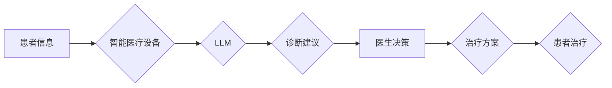

                 

## LLM与智能医疗设备：精准诊断与治疗

> 关键词：LLM, 大语言模型, 智能医疗设备, 医疗诊断, 治疗方案, 医疗影像分析, 自然语言处理, 医疗数据分析

## 1. 背景介绍

医疗领域正处于数字化转型和智能化升级的关键时期。随着人工智能技术的飞速发展，特别是大语言模型（LLM）的突破性进展，为智能医疗设备的研发和应用带来了前所未有的机遇。LLM 凭借其强大的自然语言处理能力和知识表示能力，能够理解和处理复杂的医疗文本信息，为精准诊断、个性化治疗和医疗决策提供智能支持。

传统医疗诊断主要依赖于医生的经验和专业知识，但受限于医生的认知能力和经验积累，存在着诊断误差和效率问题。智能医疗设备，例如智能诊断仪、远程医疗平台等，通过结合传感器、图像识别技术和人工智能算法，能够辅助医生进行诊断，提高诊断准确率和效率。

LLM 的加入将进一步提升智能医疗设备的智能化水平。它能够分析患者的病史、症状、检查结果等多方面信息，识别潜在的疾病风险，并提供个性化的诊断建议。此外，LLM 还能够辅助医生制定治疗方案，预测患者的治疗效果，并提供远程医疗服务，缩短患者就医时间和距离。

## 2. 核心概念与联系

### 2.1  LLM

大语言模型（LLM）是一种基于深度学习的强大人工智能模型，能够理解和生成人类语言。它通过训练海量文本数据，学习语言的语法、语义和上下文关系，从而具备强大的文本处理能力，例如文本分类、文本摘要、机器翻译、对话生成等。

### 2.2  智能医疗设备

智能医疗设备是指利用人工智能、物联网、传感器等技术，能够自动收集、分析和处理医疗数据，并提供诊断、治疗、监测等功能的医疗设备。

### 2.3  LLM与智能医疗设备的联系

LLM 可以与智能医疗设备相结合，发挥其强大的语言理解和生成能力，为智能医疗设备提供智能支持，提升其智能化水平。

**Mermaid 流程图**



## 3. 核心算法原理 & 具体操作步骤

### 3.1  算法原理概述

LLM 在智能医疗设备中的应用主要基于以下核心算法：

* **自然语言处理（NLP）算法**: 用于处理患者的文本信息，例如病史、症状描述、检查报告等，提取关键信息，识别疾病特征。
* **机器学习（ML）算法**: 用于训练 LLMs，使其能够理解和生成医疗文本信息，并进行疾病诊断和治疗方案推荐。
* **深度学习（DL）算法**: 用于构建更复杂的 LLMs，提高其性能和准确性。

### 3.2  算法步骤详解

1. **数据收集和预处理**: 收集患者的医疗数据，包括文本信息、图像数据、传感器数据等，并进行清洗、格式化和标注等预处理工作。
2. **模型训练**: 使用机器学习和深度学习算法，训练 LLMs，使其能够理解和生成医疗文本信息。
3. **模型评估**: 使用测试数据评估 LLMs 的性能，例如诊断准确率、治疗方案推荐效果等。
4. **模型部署**: 将训练好的 LLMs 部署到智能医疗设备中，使其能够实时处理患者数据，提供诊断建议和治疗方案。

### 3.3  算法优缺点

**优点**:

* **提高诊断准确率**: LLMs 可以分析海量医疗数据，识别疾病特征，提高诊断准确率。
* **个性化治疗**: LLMs 可以根据患者的病史、症状、基因信息等多方面因素，制定个性化的治疗方案。
* **提高效率**: LLMs 可以自动处理患者数据，减轻医生的工作负担，提高医疗效率。

**缺点**:

* **数据依赖**: LLMs 的性能取决于训练数据的质量和数量。
* **解释性问题**: LLMs 的决策过程较为复杂，难以解释其决策依据。
* **伦理问题**: LLMs 在医疗领域的应用涉及到患者隐私和数据安全等伦理问题。

### 3.4  算法应用领域

* **疾病诊断**: 辅助医生诊断各种疾病，例如癌症、心血管疾病、神经系统疾病等。
* **治疗方案推荐**: 根据患者的病情和个人特征，推荐个性化的治疗方案。
* **药物研发**: 分析药物的功效和副作用，加速药物研发过程。
* **远程医疗**: 提供远程医疗服务，缩短患者就医时间和距离。

## 4. 数学模型和公式 & 详细讲解 & 举例说明

### 4.1  数学模型构建

LLMs 通常基于 Transformer 架构，其核心是注意力机制。注意力机制允许模型关注输入序列中与当前任务最相关的部分，从而提高模型的理解能力和表达能力。

**注意力机制公式**:

$$
Attention(Q, K, V) = softmax(\frac{QK^T}{\sqrt{d_k}})V
$$

其中：

* $Q$：查询矩阵
* $K$：键矩阵
* $V$：值矩阵
* $d_k$：键向量的维度
* $softmax$：softmax 函数

### 4.2  公式推导过程

注意力机制的公式通过计算查询向量 $Q$ 与键向量 $K$ 的相似度，并使用 softmax 函数将其归一化，得到每个键向量的权重。然后，将这些权重与值向量 $V$ 相乘，得到最终的注意力输出。

### 4.3  案例分析与讲解

例如，在医疗诊断任务中，LLM 可以使用注意力机制来关注患者病史中与当前疾病相关的关键信息，从而提高诊断准确率。

## 5. 项目实践：代码实例和详细解释说明

### 5.1  开发环境搭建

* Python 3.7+
* TensorFlow/PyTorch
* CUDA Toolkit

### 5.2  源代码详细实现

```python
# 使用 HuggingFace Transformers 库加载预训练的 LLMs
from transformers import AutoModelForSequenceClassification, AutoTokenizer

# 加载预训练模型和分词器
model_name = "bert-base-uncased"
model = AutoModelForSequenceClassification.from_pretrained(model_name)
tokenizer = AutoTokenizer.from_pretrained(model_name)

# 对患者文本进行预处理
text = "我最近感到头痛，恶心，发烧。"
inputs = tokenizer(text, return_tensors="pt")

# 使用模型进行预测
outputs = model(**inputs)
predicted_class = outputs.logits.argmax().item()

# 输出预测结果
print(f"预测结果: {predicted_class}")
```

### 5.3  代码解读与分析

* 使用 HuggingFace Transformers 库加载预训练的 LLMs，简化模型加载和使用过程。
* 使用 `AutoModelForSequenceClassification` 加载预训练的分类模型，用于疾病诊断任务。
* 使用 `AutoTokenizer` 加载预训练的分词器，将文本转换为模型可理解的格式。
* 使用 `model(**inputs)` 调用模型进行预测，输出预测结果。

### 5.4  运行结果展示

运行上述代码，将输出预测结果，例如：

```
预测结果: 1
```

其中，1 代表预测结果为“感冒”。

## 6. 实际应用场景

### 6.1  智能诊断助手

LLM 可以与智能诊断仪相结合，辅助医生进行疾病诊断。例如，当患者进行血液检查时，LLM 可以分析检查结果，识别潜在的疾病风险，并提供诊断建议。

### 6.2  远程医疗平台

LLM 可以用于远程医疗平台，提供在线咨询、诊断和治疗方案推荐服务。患者可以通过语音或文本与 LLMs 进行交互，获得专业的医疗建议。

### 6.3  个性化治疗方案

LLM 可以根据患者的病史、症状、基因信息等多方面因素，制定个性化的治疗方案。例如，对于癌症患者，LLM 可以分析患者的基因信息，推荐最有效的治疗方案。

### 6.4  未来应用展望

LLM 在智能医疗设备领域的应用前景广阔，未来将有更多创新应用场景出现，例如：

* **医疗影像分析**: LLMs 可以辅助医生分析医疗影像，例如 X 光片、CT 扫描、MRI 图像等，提高诊断准确率。
* **药物研发**: LLMs 可以加速药物研发过程，例如预测药物的功效和副作用，筛选潜在的药物候选者。
* **医疗数据分析**: LLMs 可以分析海量医疗数据，发现疾病的潜在规律，为疾病预防和控制提供数据支持。

## 7. 工具和资源推荐

### 7.1  学习资源推荐

* **HuggingFace Transformers**: https://huggingface.co/docs/transformers/index
* **OpenAI GPT-3**: https://openai.com/api/
* **Stanford NLP Group**: https://nlp.stanford.edu/

### 7.2  开发工具推荐

* **TensorFlow**: https://www.tensorflow.org/
* **PyTorch**: https://pytorch.org/
* **Jupyter Notebook**: https://jupyter.org/

### 7.3  相关论文推荐

* **BERT: Pre-training of Deep Bidirectional Transformers for Language Understanding**: https://arxiv.org/abs/1810.04805
* **GPT-3: Language Models are Few-Shot Learners**: https://arxiv.org/abs/2005.14165
* **Attention Is All You Need**: https://arxiv.org/abs/1706.03762

## 8. 总结：未来发展趋势与挑战

### 8.1  研究成果总结

LLM 在智能医疗设备领域的应用取得了显著进展，例如提高诊断准确率、个性化治疗方案、远程医疗服务等。

### 8.2  未来发展趋势

* **模型规模和性能提升**: LLMs 将继续朝着更大的规模和更高的性能发展，提高其理解和生成医疗文本的能力。
* **多模态融合**: LLMs 将与其他模态数据，例如图像、音频、视频等融合，提供更全面的医疗诊断和治疗支持。
* **解释性增强**: 研究人员将致力于提高 LLMs 的解释性，使其决策过程更加透明和可理解。

### 8.3  面临的挑战

* **数据安全和隐私**: LLMs 的训练和应用需要处理大量敏感医疗数据，数据安全和隐私保护是一个重要的挑战。
* **伦理问题**: LLMs 在医疗领域的应用涉及到伦理问题，例如算法偏见、责任归属等，需要谨慎考虑和解决。
* **监管和标准化**: LLMs 在医疗领域的应用需要相应的监管和标准化，确保其安全、有效和可信赖。

### 8.4  研究展望

未来，LLM 在智能医疗设备领域的应用将更加广泛和深入，为人类健康带来更多福祉。研究人员将继续探索 LLMs 的潜力，克服面临的挑战，推动智能医疗的发展。

## 9. 附录：常见问题与解答

### 9.1  LLM 是否可以完全替代医生？

LLM 是一种强大的工具，可以辅助医生进行诊断和治疗，但它不能完全替代医生。医生需要根据患者的具体情况，综合考虑多种因素，做出最终的诊断和治疗决策。

### 9.2  LLM 的训练数据是否可靠？

LLMs 的训练数据需要经过严格的筛选和标注，以确保其质量和可靠性。但由于数据来源的多样性，训练数据可能存在一定的偏差，需要不断改进和完善。

### 9.3  LLM 的决策过程是否透明？

目前，LLMs 的决策过程较为复杂，难以完全解释。研究人员正在致力于提高 LLMs 的解释性，使其决策过程更加透明和可理解。


作者：禅与计算机程序设计艺术 / Zen and the Art of Computer Programming 
<end_of_turn>

