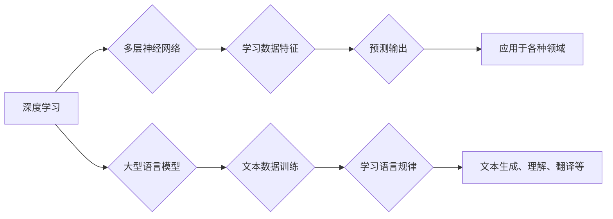

                 

## LLM与深度学习：异同点分析

> 关键词：LLM, 深度学习, Transformer, 自然语言处理, 机器学习, 语言模型, 生成式模型, 训练数据

## 1. 背景介绍

近年来，人工智能（AI）领域取得了令人瞩目的进展，其中深度学习作为其核心驱动力，在图像识别、语音识别、机器翻译等领域取得了突破性成就。而大型语言模型（LLM）作为深度学习的一个重要分支，在自然语言处理（NLP）领域展现出强大的能力，能够理解和生成人类语言，并在文本生成、对话系统、代码生成等领域展现出巨大的应用潜力。

LLM的出现，标志着人工智能进入了一个新的时代，它能够处理和理解人类语言的复杂性，为我们提供更智能、更便捷的交互体验。然而，LLM与深度学习之间存在着密切的联系，也存在着一些本质区别。深入了解这些异同点，对于更好地理解和应用LLM至关重要。

## 2. 核心概念与联系

### 2.1 深度学习

深度学习是一种机器学习的子领域，它借鉴了生物神经网络的结构和功能，利用多层神经网络来学习数据特征。深度学习模型通过大量的训练数据，不断调整神经网络的权重，从而学习到数据的复杂模式和规律。

### 2.2 大型语言模型

大型语言模型（LLM）是一种专门用于处理和生成文本的深度学习模型。它通常拥有数亿甚至数十亿个参数，通过训练大量的文本数据，能够学习到语言的语法、语义和上下文关系。

**Mermaid 流程图**



### 2.3 联系

深度学习是LLM的基础，LLM是深度学习在NLP领域的应用之一。深度学习的强大学习能力和多层神经网络结构为LLM的训练和应用提供了基础。

## 3. 核心算法原理 & 具体操作步骤

### 3.1 算法原理概述

LLM的核心算法是**Transformer**网络结构。Transformer网络通过**自注意力机制**和**多头注意力机制**来捕捉文本序列中的长距离依赖关系，从而实现更准确的语言理解和生成。

### 3.2 算法步骤详解

1. **输入嵌入:** 将输入文本序列中的每个单词转换为向量表示，称为词嵌入。
2. **多头注意力:** 利用多头注意力机制，计算每个单词与其他单词之间的注意力权重，从而捕捉文本序列中的上下文关系。
3. **前馈神经网络:** 对每个单词的注意力输出进行进一步处理，提取更深层的语义特征。
4. **位置编码:** 由于Transformer网络没有循环结构，无法捕捉单词在序列中的位置信息，因此需要添加位置编码来弥补这一缺陷。
5. **输出层:** 将经过多层Transformer网络处理后的隐藏状态转换为输出文本序列。

### 3.3 算法优缺点

**优点:**

* 能够捕捉长距离依赖关系，提高文本理解和生成能力。
* 并行计算能力强，训练速度快。
* 泛化能力强，能够应用于多种NLP任务。

**缺点:**

* 参数量大，训练成本高。
* 对训练数据要求高，需要大量的文本数据进行训练。
* 容易出现过拟合问题。

### 3.4 算法应用领域

* 文本生成：小说、诗歌、剧本等。
* 机器翻译：将一种语言翻译成另一种语言。
* 文本摘要：提取文本的关键信息。
* 对话系统：与人类进行自然语言交互。
* 代码生成：自动生成代码。

## 4. 数学模型和公式 & 详细讲解 & 举例说明

### 4.1 数学模型构建

LLM的数学模型主要基于**概率论**和**统计学**。它将文本序列视为一个概率分布，并通过训练数据学习这个分布的概率参数。

### 4.2 公式推导过程

**自注意力机制**的核心公式是**注意力权重**的计算公式：

$$
Attention(Q, K, V) = softmax(\frac{QK^T}{\sqrt{d_k}})V
$$

其中：

* $Q$：查询矩阵
* $K$：键矩阵
* $V$：值矩阵
* $d_k$：键向量的维度
* $softmax$：softmax函数

**多头注意力机制**是将多个自注意力机制并行执行，并对结果进行融合。

### 4.3 案例分析与讲解

假设我们有一个文本序列“我爱学习编程”，我们想要计算每个单词与其他单词之间的注意力权重。

1. 将每个单词转换为词嵌入向量。
2. 计算每个单词的查询向量、键向量和值向量。
3. 使用自注意力机制计算每个单词与其他单词之间的注意力权重。
4. 将所有单词的注意力权重进行加权平均，得到每个单词的最终注意力表示。

## 5. 项目实践：代码实例和详细解释说明

### 5.1 开发环境搭建

* Python 3.7+
* PyTorch 1.7+
* CUDA 10.2+

### 5.2 源代码详细实现

```python
import torch
import torch.nn as nn

class Transformer(nn.Module):
    def __init__(self, vocab_size, embedding_dim, num_heads, num_layers):
        super(Transformer, self).__init__()
        self.embedding = nn.Embedding(vocab_size, embedding_dim)
        self.transformer_layers = nn.ModuleList([
            nn.TransformerEncoderLayer(embedding_dim, num_heads)
            for _ in range(num_layers)
        ])

    def forward(self, x):
        x = self.embedding(x)
        for layer in self.transformer_layers:
            x = layer(x)
        return x
```

### 5.3 代码解读与分析

* `Transformer`类定义了一个Transformer网络模型。
* `embedding`层将输入单词转换为词嵌入向量。
* `transformer_layers`是一个`nn.ModuleList`，包含多个`nn.TransformerEncoderLayer`层，每个层代表一个Transformer编码器层。
* `forward`方法定义了模型的正向传播过程。

### 5.4 运行结果展示

训练好的LLM模型可以用于各种NLP任务，例如文本生成、机器翻译等。

## 6. 实际应用场景

### 6.1 文本生成

LLM可以用于生成各种类型的文本，例如小说、诗歌、剧本等。例如，OpenAI的GPT-3模型可以生成高质量的创意写作内容。

### 6.2 机器翻译

LLM可以用于将一种语言翻译成另一种语言。例如，Google Translate使用LLM技术进行机器翻译，提高了翻译的准确性和流畅度。

### 6.3 文本摘要

LLM可以用于提取文本的关键信息，生成文本摘要。例如，新闻网站可以使用LLM自动生成新闻摘要，方便用户快速了解新闻内容。

### 6.4 未来应用展望

LLM在未来将有更广泛的应用场景，例如：

* **个性化教育:** 根据学生的学习情况，生成个性化的学习内容。
* **智能客服:** 提供更智能、更自然的客服体验。
* **代码自动完成:** 自动完成代码编写，提高开发效率。

## 7. 工具和资源推荐

### 7.1 学习资源推荐

* **书籍:**
    * 《深度学习》
    * 《自然语言处理》
* **在线课程:**
    * Coursera: 深度学习
    * Udacity: 自然语言处理
* **博客:**
    * The Gradient
    * Towards Data Science

### 7.2 开发工具推荐

* **PyTorch:** 深度学习框架
* **TensorFlow:** 深度学习框架
* **Hugging Face Transformers:** 预训练LLM模型库

### 7.3 相关论文推荐

* **Attention Is All You Need**
* **BERT: Pre-training of Deep Bidirectional Transformers for Language Understanding**
* **GPT-3: Language Models are Few-Shot Learners**

## 8. 总结：未来发展趋势与挑战

### 8.1 研究成果总结

LLM在NLP领域取得了显著的进展，能够处理和生成更复杂的文本，并应用于更广泛的场景。

### 8.2 未来发展趋势

* **模型规模更大:** 随着计算能力的提升，LLM模型规模将继续扩大，从而提高模型的性能。
* **多模态学习:** LLM将与其他模态数据（例如图像、音频）进行融合，实现更全面的理解和生成。
* **可解释性增强:** 研究如何提高LLM的透明度和可解释性，使其更易于理解和信任。

### 8.3 面临的挑战

* **数据安全和隐私:** LLM的训练需要大量数据，如何保证数据安全和隐私是一个重要挑战。
* **模型偏见:** LLM可能存在模型偏见，需要采取措施减少和缓解这种偏见。
* **伦理问题:** LLM的应用可能引发一些伦理问题，例如虚假信息生成、深度伪造等，需要进行深入的伦理思考和规范。

### 8.4 研究展望

未来，LLM研究将继续朝着更强大、更安全、更可解释的方向发展，为我们带来更多创新和便利。

## 9. 附录：常见问题与解答

* **什么是LLM？**

LLM是指大型语言模型，是一种专门用于处理和生成文本的深度学习模型。

* **LLM与传统机器学习模型有什么区别？**

LLM基于深度学习，拥有更强大的学习能力和更复杂的模型结构，能够处理更复杂的文本任务。

* **如何训练LLM？**

LLM的训练需要大量的文本数据，使用自监督学习或监督学习方法进行训练。

* **LLM有哪些应用场景？**

LLM可以应用于文本生成、机器翻译、文本摘要、对话系统等多种NLP任务。


作者：禅与计算机程序设计艺术 / Zen and the Art of Computer Programming 
<end_of_turn>

