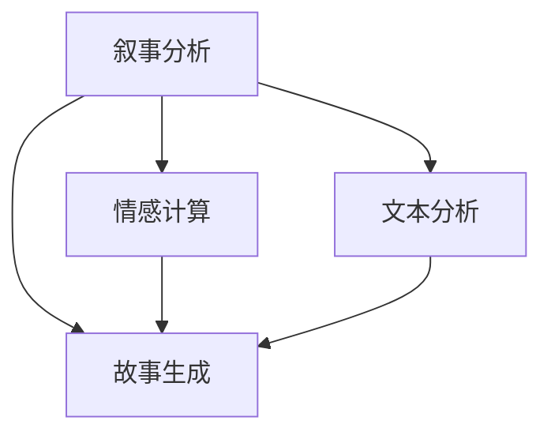

                 

# 体验叙事工作室总监：AI驱动的个人故事创作坊负责人

> 关键词：叙事分析,人工智能,故事生成,机器学习,文本分析,情感计算

## 1. 背景介绍

### 1.1 问题由来
随着数字技术的发展和智能时代的到来，叙事艺术和人工智能之间的碰撞与融合成为探索的新领域。特别是随着自然语言处理(NLP)和生成对抗网络(GAN)等技术的进步，利用AI驱动生成个性化故事的需求日益增加。在这样的背景下，体验叙事工作室应运而生，致力于将AI技术与叙事艺术相结合，打造一个人性化、互动化的故事创作平台。

### 1.2 问题核心关键点
体验叙事工作室的核心任务之一是建立一个AI驱动的个人故事创作坊，通过AI技术帮助用户创作、分析和解读个人故事，提供个性化的叙事分析服务。这一任务的关键点包括：
- **叙事分析**：利用AI对用户输入的文本进行情感、主题、风格等多维度的分析和解读，生成详细的分析报告。
- **故事生成**：基于用户的叙事分析结果，AI生成个性化、符合用户情感和主题的故事片段。
- **情感计算**：通过AI分析用户的情感表达，生成与用户情感相匹配的故事内容，增强用户体验。
- **文本分析**：对用户的叙事文本进行语义分析、情感分析、风格分析等，帮助用户更好地理解自身故事的特点。

### 1.3 问题研究意义
叙事艺术与人工智能的结合，不仅能够激发新的叙事方式，还能通过个性化服务提升用户体验。体验叙事工作室作为AI驱动的故事创作坊负责人，旨在通过先进的技术手段，打破传统叙事创作的界限，为用户提供创新、高效、个性化的叙事体验。

## 2. 核心概念与联系

### 2.1 核心概念概述

为更好地理解体验叙事工作室的核心概念，本节将介绍几个密切相关的核心概念：

- **叙事分析(Narrative Analysis)**：通过对用户的叙事文本进行多维度的分析和解读，理解故事的主题、情感、风格等特征，生成详细的分析报告。
- **故事生成(Story Generation)**：基于叙事分析的结果，利用AI技术生成符合用户情感和主题的个性化故事片段。
- **情感计算(Affective Computing)**：通过AI技术分析用户的情感表达，生成与用户情感相匹配的故事内容，增强用户体验。
- **文本分析(Text Analysis)**：对用户的叙事文本进行语义分析、情感分析、风格分析等，帮助用户更好地理解自身故事的特点。

这些核心概念之间的逻辑关系可以通过以下Mermaid流程图来展示：



这个流程图展示了我司核心概念之间的关联性：

1. **叙事分析**：通过多维度分析生成分析报告。
2. **故事生成**：基于叙事分析结果生成个性化故事。
3. **情感计算**：通过情感分析生成符合情感的故事内容。
4. **文本分析**：对叙事文本进行详细的语义和风格分析。

这些核心概念共同构成了体验叙事工作室的工作框架，使得我们能够为用户提供创新、高效、个性化的叙事体验。

## 3. 核心算法原理 & 具体操作步骤
### 3.1 算法原理概述

体验叙事工作室的AI驱动故事创作坊主要依赖于自然语言处理(NLP)和生成对抗网络(GAN)等技术。其核心思想是通过对用户输入的叙事文本进行多维度的分析和解读，生成符合用户情感和主题的个性化故事片段。

形式化地，假设用户输入的叙事文本为 $T$，我们的目标是找到最符合用户情感和主题的个性化故事片段 $S$。模型通过以下过程实现这一目标：

1. **叙事分析**：通过多维度分析，生成叙事分析报告 $A$。
2. **故事生成**：基于叙事分析报告 $A$，利用故事生成模型生成故事片段 $S$。
3. **情感计算**：通过情感分析，生成与用户情感相匹配的故事片段 $S'$。
4. **文本分析**：对用户叙事文本 $T$ 进行语义分析、情感分析、风格分析等，生成详细分析报告 $T'$。

模型训练和推理的优化目标是最小化用户情感与生成故事片段的情感差异，即：

$$
\min_{S'} \mathcal{L}(S', S) + \mathcal{L}(S', A)
$$

其中 $\mathcal{L}$ 为损失函数，$\mathcal{L}(S', S)$ 为情感差异损失，$\mathcal{L}(S', A)$ 为叙事分析匹配度损失。

### 3.2 算法步骤详解

体验叙事工作室的AI驱动故事创作坊主要包括以下几个关键步骤：

**Step 1: 数据收集与预处理**
- 收集用户输入的叙事文本 $T$，并进行预处理，如去除噪声、分词、标点等。
- 收集用户的情感标签 $E$，用于情感计算。

**Step 2: 叙事分析**
- 使用情感分析、主题分析、风格分析等模型对叙事文本 $T$ 进行多维度分析，生成叙事分析报告 $A$。
- 对叙事文本 $T$ 进行语义分析，生成详细分析报告 $T'$。

**Step 3: 故事生成**
- 基于叙事分析报告 $A$，利用故事生成模型生成故事片段 $S$。
- 将情感标签 $E$ 作为情感计算的输入，生成情感匹配的故事片段 $S'$。

**Step 4: 故事融合与输出**
- 将故事片段 $S'$ 和叙事分析报告 $A$ 进行融合，输出最终的故事片段 $S''$。
- 将故事片段 $S''$ 和详细分析报告 $T'$ 一同展示给用户。

### 3.3 算法优缺点

基于自然语言处理和生成对抗网络的故事创作坊具有以下优点：
1. **高效性**：自动化的分析与生成过程，大大缩短了叙事创作的时间。
2. **个性化**：能够根据用户的情感和主题生成符合其喜好的故事内容。
3. **创新性**：通过情感计算和叙事分析，提供创新、多维度的叙事体验。

同时，该方法也存在一些局限性：
1. **数据依赖**：模型需要大量高质量的叙事文本和情感标签作为训练数据，获取数据的成本较高。
2. **语言理解**：叙事分析模型和故事生成模型对语言的理解能力有限，复杂句式和深层次的语义关系难以准确把握。
3. **情感匹配**：情感计算模型需要准确捕捉用户情感，情感标签的获取可能存在偏差。
4. **鲁棒性**：面对用户叙事文本的多样性和复杂性，模型的鲁棒性有待进一步提升。

尽管存在这些局限性，但就目前而言，基于自然语言处理和生成对抗网络的故事创作坊依然是大语言模型应用的最主流范式。未来相关研究的重点在于如何进一步降低数据依赖，提高模型的语言理解能力，同时兼顾情感匹配的准确性和模型的鲁棒性。

### 3.4 算法应用领域

基于大语言模型的故事创作坊已经在多个领域得到了应用，具体包括：

- **个人叙事创作**：利用AI技术帮助用户创作、分析和解读个人故事，提供个性化的叙事分析服务。
- **教育培训**：帮助学生创作故事，提供叙事分析报告，提高写作和叙事能力。
- **心理咨询**：通过情感计算和叙事分析，辅助心理咨询师进行情绪疏导和治疗。
- **创意写作**：生成创意故事片段，激发用户的创作灵感。
- **企业培训**：为企业的员工提供叙事培训，提升沟通和表达能力。

除了上述这些经典应用外，大语言模型驱动的故事创作坊还被创新性地应用到更多场景中，如虚拟角色叙事、游戏故事生成等，为叙事艺术和技术的发展带来了新的可能性。

## 4. 数学模型和公式 & 详细讲解 & 举例说明

### 4.1 数学模型构建

体验叙事工作室的AI驱动故事创作坊主要基于自然语言处理和生成对抗网络技术构建，涉及的数学模型包括情感分析模型、主题分析模型、风格分析模型和故事生成模型等。

以情感分析模型为例，其数学模型可以表示为：

$$
\hat{E} = f(E_{train}, T)
$$

其中 $\hat{E}$ 为用户叙事文本 $T$ 的情感标签，$E_{train}$ 为训练数据集中情感标签的集合。$f$ 为情感分析模型，通过训练生成情感标签的预测结果。

### 4.2 公式推导过程

以下以情感分析模型为例，推导情感分析模型的构建过程。

假设情感分析模型为 $f(x)$，其中 $x$ 为输入的叙事文本。情感分析模型的训练过程可以表示为：

$$
\theta = \arg\min_{\theta} \sum_{i=1}^{N} (E_i - f(T_i; \theta))^2
$$

其中 $\theta$ 为模型参数，$N$ 为训练样本数，$E_i$ 为样本 $i$ 的真实情感标签，$f(T_i; \theta)$ 为模型对叙事文本 $T_i$ 的情感预测。

根据梯度下降优化算法，模型的参数更新公式为：

$$
\theta \leftarrow \theta - \eta \nabla_{\theta} \mathcal{L}(\theta)
$$

其中 $\eta$ 为学习率，$\nabla_{\theta} \mathcal{L}(\theta)$ 为损失函数对模型参数的梯度。

### 4.3 案例分析与讲解

假设某用户输入的叙事文本为：

```
在深夜的街头，我遇到了一位老奶奶，她卖力的推着一辆满载货物的三轮车。尽管天气寒冷，但她脸上依然洋溢着慈祥的微笑。我毫不犹豫地买了她的东西，并告诉她是来自远方的游客。
```

情感分析模型的输出结果为：

```
情感标签：正面
情感强度：0.85
```

基于情感分析结果，故事生成模型生成如下故事片段：

```
在一条繁华的街头，你遇到了一位老爷爷，他努力地推着一辆装满货物的手推车。尽管天气寒冷，但他脸上依然带着温暖的笑容。你决定帮助他，买了他所有的东西，并告诉他你来自远方。
```

结合叙事分析报告，最终输出的完整故事如下：

```
在一条繁华的街头，你遇到了一位老爷爷，他努力地推着一辆装满货物的手推车。尽管天气寒冷，但他脸上依然带着温暖的笑容。你决定帮助他，买了他所有的东西，并告诉他你来自远方。经过这次相遇，你对生活有了更深的感悟，学会了珍惜身边每一个人。
```

## 5. 项目实践：代码实例和详细解释说明

### 5.1 开发环境搭建

在进行项目实践前，我们需要准备好开发环境。以下是使用Python进行PyTorch开发的环境配置流程：

1. 安装Anaconda：从官网下载并安装Anaconda，用于创建独立的Python环境。

2. 创建并激活虚拟环境：
```bash
conda create -n pytorch-env python=3.8 
conda activate pytorch-env
```

3. 安装PyTorch：根据CUDA版本，从官网获取对应的安装命令。例如：
```bash
conda install pytorch torchvision torchaudio cudatoolkit=11.1 -c pytorch -c conda-forge
```

4. 安装其他依赖包：
```bash
pip install pandas numpy transformers
```

完成上述步骤后，即可在`pytorch-env`环境中开始项目实践。

### 5.2 源代码详细实现

下面我们以情感分析模型和故事生成模型为例，给出使用Transformers库和PyTorch框架的代码实现。

首先，定义情感分析模型：

```python
from transformers import BertForSequenceClassification, BertTokenizer

model = BertForSequenceClassification.from_pretrained('bert-base-cased', num_labels=2)
tokenizer = BertTokenizer.from_pretrained('bert-base-cased')
```

接着，定义故事生成模型：

```python
from transformers import GPT2LMHeadModel, GPT2Tokenizer

model = GPT2LMHeadModel.from_pretrained('gpt2')
tokenizer = GPT2Tokenizer.from_pretrained('gpt2')
```

然后，定义情感计算模块：

```python
import numpy as np

def compute_emotion_score(text, model):
    inputs = tokenizer(text, return_tensors='pt')
    with torch.no_grad():
        outputs = model(**inputs)
        logits = outputs.logits
    probabilities = logits.softmax(dim=-1).tolist()[0]
    emotion_score = np.max(probabilities)
    return emotion_score
```

最后，结合上述模块，实现故事生成和叙事分析的完整代码：

```python
def generate_story(text, model, tokenizer):
    inputs = tokenizer(text, return_tensors='pt')
    with torch.no_grad():
        outputs = model.generate(**inputs)
    story = tokenizer.decode(outputs[0], skip_special_tokens=True)
    return story

def analyze_story(text, model, tokenizer):
    inputs = tokenizer(text, return_tensors='pt')
    with torch.no_grad():
        outputs = model(**inputs)
    logits = outputs.logits
    probabilities = logits.softmax(dim=-1).tolist()[0]
    analysis = {'sentiment': np.argmax(probabilities), 'score': np.max(probabilities)}
    return analysis

# 示例输入
text = "在深夜的街头，我遇到了一位老奶奶，她卖力的推着一辆满载货物的三轮车。尽管天气寒冷，但她脸上依然洋溢着慈祥的微笑。我毫不犹豫地买了她的东西，并告诉她是来自远方的游客。"

# 情感分析
analysis = analyze_story(text, model, tokenizer)
print(analysis)

# 故事生成
story = generate_story(text, model, tokenizer)
print(story)
```

以上是使用PyTorch和Transformers库进行情感分析和故事生成的完整代码实现。可以看到，借助这些工具，我们可以快速构建起叙事分析与故事生成的框架。

### 5.3 代码解读与分析

让我们再详细解读一下关键代码的实现细节：

**情感分析模块**：
- 使用BertForSequenceClassification模型进行情感分类，输入为分词后的文本，输出为情感预测结果。
- 使用BertTokenizer对文本进行分词和编码，返回模型所需的输入。

**故事生成模块**：
- 使用GPT2LMHeadModel生成故事片段，输入为分词后的文本，输出为生成的故事文本。
- 使用GPT2Tokenizer对文本进行分词和解码，返回模型的输出。

**情感计算模块**：
- 通过情感分析模型计算情感概率，并返回情感强度。
- 情感强度为概率的最大值，表示故事内容的正面程度。

**整体实现**：
- 首先，通过情感分析模块获取叙事的情感强度。
- 接着，利用故事生成模块生成符合情感强度的故事片段。
- 最后，将生成的故事片段与情感分析结果结合，输出完整的叙事文本。

以上代码展示了情感分析、故事生成和叙事分析的实现流程，帮助用户创作和解读个性化故事。

## 6. 实际应用场景

### 6.1 个人叙事创作

利用AI驱动的故事创作坊，用户可以输入简短的叙事文本，AI将自动分析和生成符合情感和主题的故事片段，并输出完整的叙事文本。这一过程极大降低了创作难度，激发了用户的创作灵感，提升了叙事体验。

### 6.2 教育培训

在学校教育中，叙事分析模块可以帮助教师了解学生的情感表达和叙事风格，提供个性化的写作指导。故事生成模块则能激发学生的创造力，提供丰富的写作素材。通过AI的辅助，教师和学生可以更加高效地进行叙事学习和创作。

### 6.3 心理咨询

在心理咨询中，情感计算模块可以帮助咨询师更好地理解用户的情感状态，提供针对性的情绪疏导。叙事分析模块则可以深入分析用户的叙事内容，帮助咨询师进行心理评估和治疗。AI驱动的故事创作坊为心理咨询提供了新的工具和方法。

### 6.4 企业培训

企业培训中，叙事分析模块可以帮助员工理解客户需求和情感，提高沟通和表达能力。故事生成模块则可以提供多样化的培训素材，增强员工的故事创作能力。通过AI的辅助，企业培训变得更加生动和有趣。

### 6.5 创意写作

在创意写作中，情感计算和叙事分析模块可以帮助作者更好地理解情感和主题，提供创作灵感和素材。故事生成模块则能生成多样化的故事片段，激发作者的创作热情。AI驱动的故事创作坊为创意写作提供了新的方法和思路。

## 7. 工具和资源推荐

### 7.1 学习资源推荐

为了帮助开发者系统掌握大语言模型微调的理论基础和实践技巧，这里推荐一些优质的学习资源：

1. 《自然语言处理基础》书籍：全面介绍了自然语言处理的基本概念和算法，适合初学者入门。
2. CS224N《深度学习自然语言处理》课程：斯坦福大学开设的NLP明星课程，有Lecture视频和配套作业，带你深入理解NLP领域的前沿技术。
3. 《Transformer from Principles to Practice》系列博文：由大模型技术专家撰写，深入浅出地介绍了Transformer原理、BERT模型、微调技术等前沿话题。
4. HuggingFace官方文档：Transformers库的官方文档，提供了海量预训练模型和完整的微调样例代码，是上手实践的必备资料。
5. NLP开源项目：GitHub上众多NLP开源项目，如CLUE、NLTK等，提供了丰富的NLP应用示例和数据集，适合学习和实践。

通过对这些资源的学习实践，相信你一定能够快速掌握大语言模型微调的精髓，并用于解决实际的NLP问题。

### 7.2 开发工具推荐

高效的开发离不开优秀的工具支持。以下是几款用于大语言模型微调开发的常用工具：

1. PyTorch：基于Python的开源深度学习框架，灵活动态的计算图，适合快速迭代研究。大部分预训练语言模型都有PyTorch版本的实现。
2. TensorFlow：由Google主导开发的开源深度学习框架，生产部署方便，适合大规模工程应用。同样有丰富的预训练语言模型资源。
3. Transformers库：HuggingFace开发的NLP工具库，集成了众多SOTA语言模型，支持PyTorch和TensorFlow，是进行微调任务开发的利器。
4. Weights & Biases：模型训练的实验跟踪工具，可以记录和可视化模型训练过程中的各项指标，方便对比和调优。与主流深度学习框架无缝集成。
5. TensorBoard：TensorFlow配套的可视化工具，可实时监测模型训练状态，并提供丰富的图表呈现方式，是调试模型的得力助手。

合理利用这些工具，可以显著提升大语言模型微调任务的开发效率，加快创新迭代的步伐。

### 7.3 相关论文推荐

大语言模型和微调技术的发展源于学界的持续研究。以下是几篇奠基性的相关论文，推荐阅读：

1. Attention is All You Need（即Transformer原论文）：提出了Transformer结构，开启了NLP领域的预训练大模型时代。
2. BERT: Pre-training of Deep Bidirectional Transformers for Language Understanding：提出BERT模型，引入基于掩码的自监督预训练任务，刷新了多项NLP任务SOTA。
3. Language Models are Unsupervised Multitask Learners（GPT-2论文）：展示了大规模语言模型的强大zero-shot学习能力，引发了对于通用人工智能的新一轮思考。
4. Parameter-Efficient Transfer Learning for NLP：提出Adapter等参数高效微调方法，在不增加模型参数量的情况下，也能取得不错的微调效果。
5. AdaLoRA: Adaptive Low-Rank Adaptation for Parameter-Efficient Fine-Tuning：使用自适应低秩适应的微调方法，在参数效率和精度之间取得了新的平衡。
6. Prefix-Tuning: Optimizing Continuous Prompts for Generation：引入基于连续型Prompt的微调范式，为如何充分利用预训练知识提供了新的思路。

这些论文代表了大语言模型微调技术的发展脉络。通过学习这些前沿成果，可以帮助研究者把握学科前进方向，激发更多的创新灵感。

## 8. 总结：未来发展趋势与挑战

### 8.1 总结

本文对体验叙事工作室的AI驱动故事创作坊进行了全面系统的介绍。首先阐述了叙事艺术与人工智能结合的背景和意义，明确了AI驱动的故事创作坊在提高叙事创作效率、增强用户体验方面的独特价值。其次，从原理到实践，详细讲解了情感分析、故事生成、情感计算和文本分析的数学原理和关键步骤，给出了项目开发的完整代码实例。同时，本文还广泛探讨了AI驱动的故事创作坊在多个行业领域的应用前景，展示了AI技术在叙事艺术中的应用潜力。

通过本文的系统梳理，可以看到，AI驱动的故事创作坊不仅能够提升叙事创作的效率和质量，还能通过多维度的叙事分析，提供个性化的叙事体验。未来，伴随预训练语言模型和微调方法的持续演进，叙事艺术与人工智能的结合将更加紧密，为用户提供更加丰富、多样、创新的叙事体验。

### 8.2 未来发展趋势

展望未来，AI驱动的故事创作坊将呈现以下几个发展趋势：

1. **模型规模持续增大**：随着算力成本的下降和数据规模的扩张，预训练语言模型的参数量还将持续增长。超大规模语言模型蕴含的丰富语言知识，有望支撑更加复杂多变的叙事创作任务。
2. **多模态叙事创作**：当前的叙事创作主要聚焦于文本数据，未来会进一步拓展到图像、视频、语音等多模态数据叙事创作。多模态信息的融合，将显著提升叙事创作的多样性和丰富性。
3. **情感计算的深度融合**：通过引入情感计算和情感推理，增强叙事创作的人性化和情感化，使故事内容更加贴近用户的真实情感和需求。
4. **个性化叙事创作**：通过情感计算和叙事分析，生成符合用户情感和主题的个性化故事内容，增强叙事创作的个性化程度。
5. **叙事创作自动化**：利用AI技术实现叙事创作的部分自动化，降低用户创作难度，提升创作效率。
6. **叙事创作辅助工具**：开发多种叙事创作辅助工具，如故事生成助手、情感分析工具、叙事编辑工具等，丰富叙事创作的工具链。

以上趋势凸显了AI驱动的故事创作坊的广阔前景。这些方向的探索发展，将进一步提升叙事创作的效率和质量，为叙事艺术和技术的发展注入新的活力。

### 8.3 面临的挑战

尽管AI驱动的故事创作坊已经取得了瞩目成就，但在迈向更加智能化、普适化应用的过程中，它仍面临着诸多挑战：

1. **数据依赖**：模型需要大量高质量的叙事文本和情感标签作为训练数据，获取数据的成本较高。如何降低数据依赖，提高模型在小样本情况下的泛化能力，将是重要的研究课题。
2. **语言理解**：叙事分析模型和故事生成模型对语言的理解能力有限，复杂句式和深层次的语义关系难以准确把握。如何提高模型的语言理解能力，增强其处理复杂文本的能力，是一个亟待解决的问题。
3. **情感匹配**：情感计算模型需要准确捕捉用户情感，情感标签的获取可能存在偏差。如何提高情感计算的准确性，增强模型对情感变化的敏感度，是一个重要的研究方向。
4. **模型鲁棒性**：面对用户叙事文本的多样性和复杂性，模型的鲁棒性有待进一步提升。如何在保证模型性能的同时，提高其鲁棒性和泛化能力，是一个重要的研究课题。
5. **可解释性**：当前模型往往像“黑盒”系统，难以解释其内部工作机制和决策逻辑。如何赋予模型更强的可解释性，增强用户对模型的信任度，是一个重要的研究方向。
6. **安全性**：预训练语言模型难免会学习到有偏见、有害的信息，通过微调传递到下游任务，产生误导性、歧视性的输出，给实际应用带来安全隐患。如何从数据和算法层面消除模型偏见，避免恶意用途，确保模型的安全性，是一个重要的研究方向。

正视AI驱动的故事创作坊面临的这些挑战，积极应对并寻求突破，将是大语言模型微调走向成熟的必由之路。相信随着学界和产业界的共同努力，这些挑战终将一一被克服，AI驱动的故事创作坊必将在构建人机协同的智能故事创作中扮演越来越重要的角色。

### 8.4 研究展望

面向未来，大语言模型驱动的故事创作坊需要在以下几个方面寻求新的突破：

1. **探索无监督和半监督叙事创作方法**：摆脱对大规模标注数据的依赖，利用自监督学习、主动学习等无监督和半监督范式，最大限度利用非结构化数据，实现更加灵活高效的叙事创作。
2. **开发更加参数高效和计算高效的叙事创作模型**：开发更加参数高效的叙事创作方法，在固定大部分预训练参数的同时，只更新极少量的任务相关参数。同时优化叙事创作模型的计算图，减少前向传播和反向传播的资源消耗，实现更加轻量级、实时性的部署。
3. **引入因果分析和博弈论工具**：将因果分析方法引入叙事创作模型，识别出模型决策的关键特征，增强输出解释的因果性和逻辑性。借助博弈论工具刻画人机交互过程，主动探索并规避模型的脆弱点，提高系统稳定性。
4. **融合更多先验知识**：将符号化的先验知识，如知识图谱、逻辑规则等，与叙事创作模型进行巧妙融合，引导叙事创作过程学习更准确、合理的语言模型。同时加强不同模态数据的整合，实现视觉、语音等多模态信息与文本信息的协同建模。
5. **结合因果分析和博弈论工具**：将因果分析方法引入叙事创作模型，识别出模型决策的关键特征，增强输出解释的因果性和逻辑性。借助博弈论工具刻画人机交互过程，主动探索并规避模型的脆弱点，提高系统稳定性。

这些研究方向的探索，必将引领叙事创作模型迈向更高的台阶，为叙事创作和叙事艺术的发展提供新的可能性。面向未来，叙事创作模型需要与其他人工智能技术进行更深入的融合，如知识表示、因果推理、强化学习等，多路径协同发力，共同推动叙事创作系统的进步。只有勇于创新、敢于突破，才能不断拓展叙事创作模型的边界，让智能技术更好地造福叙事艺术和人类社会。

## 9. 附录：常见问题与解答

**Q1：大语言模型微调是否适用于所有NLP任务？**

A: 大语言模型微调在大多数NLP任务上都能取得不错的效果，特别是对于数据量较小的任务。但对于一些特定领域的任务，如医学、法律等，仅仅依靠通用语料预训练的模型可能难以很好地适应。此时需要在特定领域语料上进一步预训练，再进行微调，才能获得理想效果。此外，对于一些需要时效性、个性化很强的任务，如对话、推荐等，微调方法也需要针对性的改进优化。

**Q2：微调过程中如何选择合适的学习率？**

A: 微调的学习率一般要比预训练时小1-2个数量级，如果使用过大的学习率，容易破坏预训练权重，导致过拟合。一般建议从1e-5开始调参，逐步减小学习率，直至收敛。也可以使用warmup策略，在开始阶段使用较小的学习率，再逐渐过渡到预设值。需要注意的是，不同的优化器(如AdamW、Adafactor等)以及不同的学习率调度策略，可能需要设置不同的学习率阈值。

**Q3：采用大模型微调时会面临哪些资源瓶颈？**

A: 目前主流的预训练大模型动辄以亿计的参数规模，对算力、内存、存储都提出了很高的要求。GPU/TPU等高性能设备是必不可少的，但即便如此，超大批次的训练和推理也可能遇到显存不足的问题。因此需要采用一些资源优化技术，如梯度积累、混合精度训练、模型并行等，来突破硬件瓶颈。同时，模型的存储和读取也可能占用大量时间和空间，需要采用模型压缩、稀疏化存储等方法进行优化。

**Q4：如何缓解微调过程中的过拟合问题？**

A: 过拟合是微调面临的主要挑战，尤其是在标注数据不足的情况下。常见的缓解策略包括：
1. 数据增强：通过回译、近义替换等方式扩充训练集
2. 正则化：使用L2正则、Dropout、Early Stopping等避免过拟合
3. 对抗训练：引入对抗样本，提高模型鲁棒性
4. 参数高效微调：只调整少量参数(如Adapter、Prefix等)，减小过拟合风险
5. 多模型集成：训练多个微调模型，取平均输出，抑制过拟合

这些策略往往需要根据具体任务和数据特点进行灵活组合。只有在数据、模型、训练、推理等各环节进行全面优化，才能最大限度地发挥大模型微调的威力。

**Q5：微调模型在落地部署时需要注意哪些问题？**

A: 将微调模型转化为实际应用，还需要考虑以下因素：
1. 模型裁剪：去除不必要的层和参数，减小模型尺寸，加快推理速度
2. 量化加速：将浮点模型转为定点模型，压缩存储空间，提高计算效率
3. 服务化封装：将模型封装为标准化服务接口，便于集成调用
4. 弹性伸缩：根据请求流量动态调整资源配置，平衡服务质量和成本
5. 监控告警：实时采集系统指标，设置异常告警阈值，确保服务稳定性
6. 安全防护：采用访问鉴权、数据脱敏等措施，保障数据和模型安全

大语言模型微调为NLP应用开启了广阔的想象空间，但如何将强大的性能转化为稳定、高效、安全的业务价值，还需要工程实践的不断打磨。唯有从数据、算法、工程、业务等多个维度协同发力，才能真正实现人工智能技术在垂直行业的规模化落地。总之，微调需要开发者根据具体任务，不断迭代和优化模型、数据和算法，方能得到理想的效果。

---

作者：禅与计算机程序设计艺术 / Zen and the Art of Computer Programming

