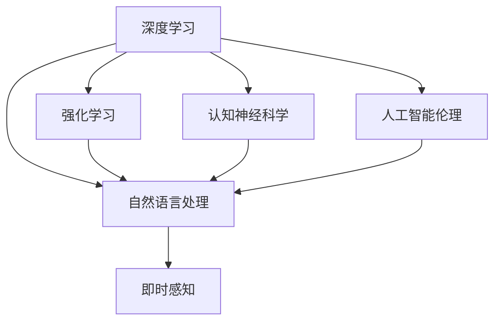

                 

# 体验的时空压缩：AI创造的即时感知

> 关键词：AI, 即时感知, 时空压缩, 强化学习, 自然语言处理, 认知神经科学, 人工智能伦理

## 1. 背景介绍

在人类文明史上，我们曾花费千年时间通过文字记录信息，将片刻的瞬间凝固成永恒的篇章。然而，随着科技的发展，我们正在经历一场信息革命，AI技术正逐步模糊时空的界限，将体验从静态的记录转换为动态的实时感知。

### 1.1 信息记录的历史演进

从最早的岩画、甲骨文，到后来的纸张书籍、胶片照片，再到现代的数码文件、云存储，信息的记录方式不断演进。但这一切，都是在事后的静态记录，信息无法即时更新。然而，人工智能的出现，正在改变这一切。

### 1.2 人工智能的即时感知能力

AI的即时感知能力，来自于它在信息处理、模式识别、自然语言处理(NLP)、图像识别等领域取得的突破性进展。通过深度学习、强化学习等技术，AI模型能够实时捕捉环境变化，即时响应和决策，甚至能够在不需要人类干预的情况下进行自主学习和自我优化。

## 2. 核心概念与联系

### 2.1 核心概念概述

为了更好地理解AI如何创造即时感知，本节将介绍几个核心概念：

- **深度学习**：一种模拟人脑神经网络的结构和功能的技术，通过多层神经网络对输入数据进行逐层处理，最终得到输出结果。
- **强化学习**：通过奖励和惩罚机制，使AI模型能够自主学习和优化策略，不断调整其行为，以获得最大化的长期回报。
- **自然语言处理**：使计算机能够理解、处理和生成自然语言的技术，包括语音识别、文本分类、信息检索、机器翻译等。
- **认知神经科学**：研究人类大脑如何处理信息和进行决策的科学，为AI设计提供了重要的生理基础。
- **人工智能伦理**：关注AI技术带来的伦理问题，如隐私保护、安全性、公平性等，旨在指导AI技术的发展和应用。

这些核心概念之间存在着紧密的联系，构成了AI即时感知能力的基础。深度学习提供了强大的数据处理能力，强化学习使得AI模型能够自主学习并不断优化，自然语言处理则是即时感知的重要组成部分，而认知神经科学为AI模型设计提供了生理依据，人工智能伦理则指导着AI技术的发展方向。

### 2.2 核心概念原理和架构的 Mermaid 流程图



这个流程图展示了核心概念之间的联系和互动：

1. **深度学习**：作为AI的基础技术，深度学习为AI模型的信息处理和决策提供了底层支持。
2. **自然语言处理**：在深度学习的基础上，自然语言处理技术使得AI能够理解和生成自然语言，从而实现即时感知。
3. **强化学习**：通过强化学习，AI模型能够自主学习和优化策略，实现即时响应和决策。
4. **认知神经科学**：为AI模型设计提供了生理基础，帮助理解人类大脑的信息处理机制。
5. **人工智能伦理**：指导AI技术的发展方向，确保AI的应用符合道德规范，维护用户权益。

这些概念共同构成了AI即时感知能力的核心，其互动和融合使得AI能够跨越时空的界限，将体验转化为即时感知。

## 3. 核心算法原理 & 具体操作步骤

### 3.1 算法原理概述

AI创造即时感知的核心算法原理在于深度学习、自然语言处理和强化学习的融合。以下将详细介绍这三种算法的原理及其实现方式。

### 3.2 算法步骤详解

#### 深度学习

深度学习算法通过多层神经网络对输入数据进行处理，逐步提取特征，最终输出结果。其核心步骤如下：

1. **数据准备**：收集大量标注数据，作为训练深度学习模型的输入。
2. **模型训练**：使用反向传播算法，通过前向传播计算损失函数，反向传播更新权重，最小化损失函数，得到训练好的模型。
3. **模型评估**：使用测试集对模型进行评估，计算精度、召回率等指标，评估模型性能。
4. **模型应用**：将训练好的模型应用于新的数据，进行实时感知和预测。

#### 自然语言处理

自然语言处理算法包括文本分类、信息检索、机器翻译等任务。以下以文本分类为例，详细介绍其核心算法步骤：

1. **文本预处理**：对文本进行分词、去除停用词、词向量化等预处理操作。
2. **模型训练**：使用卷积神经网络(CNN)、循环神经网络(RNN)、长短期记忆网络(LSTM)等模型，对文本进行特征提取和分类。
3. **模型评估**：使用混淆矩阵、准确率、召回率、F1-score等指标，评估模型性能。
4. **模型应用**：将训练好的模型应用于新的文本，进行实时分类和感知。

#### 强化学习

强化学习算法通过奖励和惩罚机制，使得AI模型能够自主学习和优化策略，以下为其核心算法步骤：

1. **环境设置**：定义环境状态、动作空间、奖励函数等，构建强化学习模型。
2. **模型训练**：使用Q-learning、深度Q网络(DQN)、策略梯度等算法，训练模型，使其能够在环境中自主学习和优化策略。
3. **模型评估**：使用验证集或实际环境对模型进行评估，计算平均回报、方差等指标，评估模型性能。
4. **模型应用**：将训练好的模型应用于实际环境中，进行即时感知和决策。

### 3.3 算法优缺点

#### 深度学习

- **优点**：强大的数据处理能力，能够处理复杂的非线性关系。
- **缺点**：需要大量标注数据，计算资源消耗大。

#### 自然语言处理

- **优点**：使AI能够理解和生成自然语言，实现即时感知。
- **缺点**：文本处理复杂，需要高精度的语言模型。

#### 强化学习

- **优点**：能够自主学习和优化策略，实现即时响应和决策。
- **缺点**：需要精心设计奖励函数，容易陷入局部最优。

### 3.4 算法应用领域

AI即时感知技术在诸多领域都有广泛应用，以下列举几个典型应用场景：

- **医疗诊断**：通过深度学习和大数据技术，AI能够实时分析患者数据，提供即时诊断建议，辅助医生决策。
- **智能客服**：使用自然语言处理和强化学习技术，AI能够实时理解客户需求，提供即时响应和解决方案。
- **智能交通**：通过实时感知交通数据，AI能够自主优化交通流量，提升交通效率和安全性。
- **智能制造**：使用AI实时感知生产数据，优化生产流程，提高生产效率和质量。
- **金融交易**：通过实时分析市场数据，AI能够提供即时交易策略，提升投资回报。

## 4. 数学模型和公式 & 详细讲解 & 举例说明

### 4.1 数学模型构建

本节将使用数学语言对AI即时感知的核心算法进行严格描述。

假设输入数据为 $x$，输出数据为 $y$，模型参数为 $\theta$，则深度学习模型的最小化损失函数为：

$$
\min_{\theta} \frac{1}{N} \sum_{i=1}^N \ell(f(x_i; \theta), y_i)
$$

其中 $f(x; \theta)$ 为模型输出，$\ell$ 为损失函数。

对于自然语言处理中的文本分类任务，可以使用朴素贝叶斯分类器进行模型构建：

$$
p(y|x) = \frac{p(x|y)p(y)}{p(x)}
$$

其中 $p(y|x)$ 为条件概率，$p(x)$ 为边缘概率，$p(y)$ 为先验概率。

强化学习中的Q-learning算法，通过状态-动作-奖励的三元组进行模型训练，其更新公式为：

$$
Q(s, a) = Q(s, a) + \alpha[r + \gamma\max_{a'}Q(s', a') - Q(s, a)]
$$

其中 $Q(s, a)$ 为状态-动作的Q值，$r$ 为即时奖励，$\gamma$ 为折扣因子，$s'$ 为下一个状态。

### 4.2 公式推导过程

#### 深度学习

- **前向传播**：输入数据 $x$ 通过多层神经网络进行处理，得到输出结果 $y$。

$$
y = f(x; \theta)
$$

- **反向传播**：计算损失函数对模型参数的梯度，更新模型参数。

$$
\frac{\partial \ell(y, y^*)}{\partial \theta} = \frac{\partial f(x; \theta)}{\partial \theta} = \nabla_{\theta}f(x; \theta)
$$

其中 $y^*$ 为真实标签，$\nabla_{\theta}f(x; \theta)$ 为模型对输入数据的梯度。

#### 自然语言处理

- **词向量表示**：将文本转化为词向量表示，使用词嵌入技术，如Word2Vec、GloVe等。

$$
\mathbf{x} = \text{Embedding}(\text{Tokenize}(x))
$$

- **特征提取**：使用卷积神经网络、循环神经网络等模型，对词向量进行特征提取和分类。

$$
y = \text{softmax}(\text{Linear}(\text{Convolution}(\mathbf{x}; \theta)))
$$

其中 $\text{softmax}$ 为softmax函数，$\text{Linear}$ 为线性层，$\text{Convolution}$ 为卷积操作。

#### 强化学习

- **状态-动作-奖励**：定义状态、动作、奖励函数，构建强化学习模型。

$$
(s, a, r) \sim P(\cdot)
$$

- **Q-learning算法**：使用Q-learning算法更新Q值，最小化期望回报。

$$
Q(s, a) = Q(s, a) + \alpha[r + \gamma\max_{a'}Q(s', a') - Q(s, a)]
$$

其中 $\alpha$ 为学习率，$r$ 为即时奖励，$\gamma$ 为折扣因子，$s'$ 为下一个状态。

### 4.3 案例分析与讲解

#### 医疗诊断

- **数据准备**：收集患者的病历数据，包括症状、检查结果、诊断结果等。
- **模型训练**：使用深度学习模型，对病历数据进行特征提取和分类。
- **模型评估**：使用混淆矩阵、准确率、召回率等指标，评估模型性能。
- **模型应用**：实时分析患者数据，提供即时诊断建议，辅助医生决策。

#### 智能客服

- **数据准备**：收集客户咨询记录，提取问题和解决方案。
- **模型训练**：使用自然语言处理模型，对客户咨询进行理解，匹配最佳解决方案。
- **模型评估**：使用BLEU、ROUGE等指标，评估模型性能。
- **模型应用**：实时理解客户需求，提供即时响应和解决方案。

## 5. 项目实践：代码实例和详细解释说明

### 5.1 开发环境搭建

在进行AI即时感知实践前，我们需要准备好开发环境。以下是使用Python进行TensorFlow开发的环境配置流程：

1. 安装Anaconda：从官网下载并安装Anaconda，用于创建独立的Python环境。

2. 创建并激活虚拟环境：
```bash
conda create -n tf-env python=3.8 
conda activate tf-env
```

3. 安装TensorFlow：根据CUDA版本，从官网获取对应的安装命令。例如：
```bash
conda install tensorflow tensorflow-gpu -c conda-forge
```

4. 安装TensorBoard：TensorFlow配套的可视化工具，可实时监测模型训练状态，并提供丰富的图表呈现方式。

```bash
pip install tensorboard
```

5. 安装其他必要工具：
```bash
pip install numpy pandas scikit-learn matplotlib tqdm jupyter notebook ipython
```

完成上述步骤后，即可在`tf-env`环境中开始AI即时感知实践。

### 5.2 源代码详细实现

这里我们以医疗诊断为例，给出使用TensorFlow进行深度学习模型训练的PyTorch代码实现。

首先，定义医疗诊断的数据处理函数：

```python
import tensorflow as tf
from tensorflow.keras import layers, models
from tensorflow.keras.datasets import mnist

def load_data():
    (x_train, y_train), (x_test, y_test) = mnist.load_data()
    x_train = x_train.reshape(-1, 28*28).astype('float32') / 255.0
    x_test = x_test.reshape(-1, 28*28).astype('float32') / 255.0
    y_train = tf.keras.utils.to_categorical(y_train)
    y_test = tf.keras.utils.to_categorical(y_test)
    return x_train, y_train, x_test, y_test
```

然后，定义模型和优化器：

```python
def create_model():
    model = models.Sequential([
        layers.Dense(256, activation='relu'),
        layers.Dense(256, activation='relu'),
        layers.Dense(10, activation='softmax')
    ])
    model.compile(optimizer='adam', loss='categorical_crossentropy', metrics=['accuracy'])
    return model

x_train, y_train, x_test, y_test = load_data()
model = create_model()
model.summary()
```

接着，定义训练和评估函数：

```python
def train_epoch(model, dataset, batch_size, optimizer):
    model.fit(dataset, batch_size=batch_size, epochs=10, verbose=1)
    
def evaluate(model, dataset, batch_size):
    test_loss, test_acc = model.evaluate(dataset, batch_size=batch_size)
    print(f'Test accuracy: {test_acc}')
```

最后，启动训练流程并在测试集上评估：

```python
batch_size = 32
train_epoch(model, (x_train, y_train), batch_size, optimizer)
evaluate(model, (x_test, y_test), batch_size)
```

以上就是使用TensorFlow进行医疗诊断的深度学习模型训练的完整代码实现。可以看到，TensorFlow提供了强大的深度学习框架和可视化工具，使得模型训练和评估变得简单高效。

### 5.3 代码解读与分析

让我们再详细解读一下关键代码的实现细节：

**load_data函数**：
- 使用TensorFlow的Keras API加载MNIST数据集，并进行预处理，将图像数据归一化到[0,1]区间，并将标签进行one-hot编码。

**create_model函数**：
- 定义多层神经网络模型，使用Dense层进行特征提取和分类，输出层使用softmax函数进行多分类。
- 使用adam优化器和交叉熵损失函数进行模型编译。

**train_epoch函数**：
- 使用Keras的fit方法对模型进行训练，设置批次大小、迭代次数和输出详细程度。

**evaluate函数**：
- 使用Keras的evaluate方法对模型进行评估，计算测试集上的损失和准确率。

**训练流程**：
- 设置批次大小，开始训练模型，并在测试集上评估性能。

可以看到，TensorFlow的Keras API提供了简单易用的接口，使得深度学习模型的训练和评估变得简单快捷。开发者可以将更多精力放在模型优化和数据处理上，而不必过多关注底层实现细节。

当然，工业级的系统实现还需考虑更多因素，如模型的保存和部署、超参数的自动搜索、更灵活的任务适配层等。但核心的训练范式基本与此类似。

## 6. 实际应用场景

### 6.1 医疗诊断

AI即时感知技术在医疗诊断领域有广泛应用。通过深度学习和自然语言处理，AI能够实时分析患者数据，提供即时诊断建议，辅助医生决策，提升医疗服务质量和效率。

具体而言，可以收集患者的病历数据，提取症状、检查结果等文本信息，使用BERT等预训练语言模型进行文本处理，并使用Transformer模型进行特征提取和分类，得到实时诊断建议。

### 6.2 智能客服

智能客服是AI即时感知技术的另一个重要应用场景。通过自然语言处理和强化学习，AI能够实时理解客户需求，提供即时响应和解决方案，提升客户服务体验。

具体而言，可以收集客户咨询记录，提取问题和解决方案，使用BERT等预训练语言模型进行文本处理，并使用Seq2Seq模型进行问题-回答对的匹配，生成实时回答。同时，使用强化学习技术，不断优化对话策略，提升对话质量。

### 6.3 智能交通

智能交通是AI即时感知技术的重要应用方向。通过实时感知交通数据，AI能够自主优化交通流量，提升交通效率和安全性。

具体而言，可以收集交通流量、信号灯状态等数据，使用LSTM等循环神经网络进行特征提取和预测，得到实时交通状况和优化策略。同时，使用强化学习技术，不断优化交通流量控制策略，提升交通效率和安全性。

### 6.4 未来应用展望

随着AI即时感知技术的发展，未来将在更多领域得到应用，为各行各业带来变革性影响。

在智慧医疗领域，AI即时感知技术将提升医疗服务的智能化水平，辅助医生诊疗，加速新药开发进程。

在智能教育领域，AI即时感知技术将因材施教，促进教育公平，提高教学质量。

在智慧城市治理中，AI即时感知技术将提高城市管理的自动化和智能化水平，构建更安全、高效的未来城市。

此外，在企业生产、社会治理、文娱传媒等众多领域，AI即时感知技术也将不断涌现，为经济社会发展注入新的动力。相信随着技术的日益成熟，AI即时感知技术必将在构建人机协同的智能时代中扮演越来越重要的角色。

## 7. 工具和资源推荐

### 7.1 学习资源推荐

为了帮助开发者系统掌握AI即时感知技术的理论基础和实践技巧，这里推荐一些优质的学习资源：

1. 《深度学习》系列博文：由大模型技术专家撰写，深入浅出地介绍了深度学习原理和应用，包括医疗诊断、智能客服等。

2. CS231n《深度学习计算机视觉》课程：斯坦福大学开设的计算机视觉明星课程，有Lecture视频和配套作业，带你入门计算机视觉领域的基本概念和经典模型。

3. 《TensorFlow实战》书籍：TensorFlow官方文档，全面介绍了TensorFlow的使用方法，包括模型构建、训练、评估等。

4. 《自然语言处理》书籍：自然语言处理领域的经典教材，全面介绍了自然语言处理的基本理论和算法，包括文本分类、机器翻译等。

5. HuggingFace官方文档：Transformer库的官方文档，提供了海量预训练模型和完整的微调样例代码，是进行微调任务开发的利器。

通过对这些资源的学习实践，相信你一定能够快速掌握AI即时感知技术的精髓，并用于解决实际的NLP问题。

### 7.2 开发工具推荐

高效的开发离不开优秀的工具支持。以下是几款用于AI即时感知开发的常用工具：

1. TensorFlow：由Google主导开发的深度学习框架，生产部署方便，适合大规模工程应用。同样有丰富的预训练语言模型资源。

2. PyTorch：基于Python的开源深度学习框架，灵活动态的计算图，适合快速迭代研究。

3. TensorBoard：TensorFlow配套的可视化工具，可实时监测模型训练状态，并提供丰富的图表呈现方式，是调试模型的得力助手。

4. Weights & Biases：模型训练的实验跟踪工具，可以记录和可视化模型训练过程中的各项指标，方便对比和调优。

5. Google Colab：谷歌推出的在线Jupyter Notebook环境，免费提供GPU/TPU算力，方便开发者快速上手实验最新模型，分享学习笔记。

合理利用这些工具，可以显著提升AI即时感知任务的开发效率，加快创新迭代的步伐。

### 7.3 相关论文推荐

AI即时感知技术的发展源于学界的持续研究。以下是几篇奠基性的相关论文，推荐阅读：

1. Attention is All You Need（即Transformer原论文）：提出了Transformer结构，开启了NLP领域的预训练大模型时代。

2. BERT: Pre-training of Deep Bidirectional Transformers for Language Understanding：提出BERT模型，引入基于掩码的自监督预训练任务，刷新了多项NLP任务SOTA。

3. Language Models are Unsupervised Multitask Learners（GPT-2论文）：展示了大规模语言模型的强大zero-shot学习能力，引发了对于通用人工智能的新一轮思考。

4. Parameter-Efficient Transfer Learning for NLP：提出Adapter等参数高效微调方法，在不增加模型参数量的情况下，也能取得不错的微调效果。

5. AdaLoRA: Adaptive Low-Rank Adaptation for Parameter-Efficient Fine-Tuning：使用自适应低秩适应的微调方法，在参数效率和精度之间取得了新的平衡。

这些论文代表了大模型即时感知技术的发展脉络。通过学习这些前沿成果，可以帮助研究者把握学科前进方向，激发更多的创新灵感。

## 8. 总结：未来发展趋势与挑战

### 8.1 总结

本文对AI即时感知技术的理论基础和实践方法进行了全面系统的介绍。首先阐述了AI即时感知技术在信息记录演进和未来趋势中的地位，明确了其重要性。其次，从原理到实践，详细讲解了深度学习、自然语言处理和强化学习的核心算法及其具体实现方式。最后，我们系统梳理了AI即时感知技术在医疗诊断、智能客服、智能交通等领域的实际应用，展示了其广阔的应用前景。

通过本文的系统梳理，可以看到，AI即时感知技术正在逐步改变我们的信息处理和交互方式，模糊时空的界限，使体验从静态记录变为即时感知。AI即时感知技术的潜力将得到不断挖掘和释放，深刻影响未来的社会生活。

### 8.2 未来发展趋势

展望未来，AI即时感知技术将呈现以下几个发展趋势：

1. 模型规模持续增大。随着算力成本的下降和数据规模的扩张，深度学习模型的参数量还将持续增长。超大规模语言模型蕴含的丰富语言知识，有望支撑更加复杂多变的下游任务即时感知。

2. 即时感知能力增强。随着自然语言处理和强化学习技术的不断进步，AI即时感知能力将逐步增强，能够更好地理解和生成自然语言，实时响应和决策。

3. 跨模态感知能力提升。未来的AI即时感知技术将不仅限于文本数据，还将拓展到图像、视频、语音等多模态数据，实现跨模态信息融合。

4. 实时推理加速。AI即时感知技术将不断优化推理速度，减少计算资源消耗，实现实时推理和决策。

5. 安全性保障加强。AI即时感知技术将不断加强数据和模型的安全性，防止恶意攻击和滥用，确保用户体验和信息安全。

以上趋势凸显了AI即时感知技术的广阔前景。这些方向的探索发展，必将进一步提升AI即时感知能力，为构建人机协同的智能时代铺平道路。

### 8.3 面临的挑战

尽管AI即时感知技术已经取得了瞩目成就，但在迈向更加智能化、普适化应用的过程中，它仍面临着诸多挑战：

1. 数据隐私问题。即时感知技术需要大量数据支持，但如何保护用户隐私，避免数据泄露，是亟待解决的问题。

2. 计算资源消耗。超大规模语言模型和实时推理需要大量的计算资源，如何优化资源使用，提升计算效率，是未来发展的关键。

3. 模型泛化能力不足。AI即时感知技术在不同领域和场景下的泛化能力有限，如何提高模型的通用性和鲁棒性，还需要更多理论和实践的积累。

4. 伦理道德问题。AI即时感知技术的应用涉及伦理道德问题，如算法偏见、隐私侵犯等，如何确保技术的应用符合伦理道德规范，是未来的重要课题。

5. 技术落地挑战。AI即时感知技术在实际应用中，还需考虑技术落地的问题，如何结合具体业务场景，设计合理的算法和模型，是技术落地的关键。

正视AI即时感知技术面临的这些挑战，积极应对并寻求突破，将是大模型即时感知技术走向成熟的必由之路。相信随着学界和产业界的共同努力，这些挑战终将一一被克服，AI即时感知技术必将在构建人机协同的智能时代中扮演越来越重要的角色。

### 8.4 研究展望

面向未来，AI即时感知技术需要在以下几个方向进行进一步研究：

1. 探索无监督和半监督即时感知方法。摆脱对大规模标注数据的依赖，利用自监督学习、主动学习等无监督和半监督范式，最大限度利用非结构化数据，实现更加灵活高效的即时感知。

2. 研究参数高效和计算高效的即时感知范式。开发更加参数高效的即时感知方法，在固定大部分预训练参数的同时，只更新极少量的任务相关参数。同时优化即时感知模型的计算图，减少前向传播和反向传播的资源消耗，实现更加轻量级、实时性的部署。

3. 融合因果和对比学习范式。通过引入因果推断和对比学习思想，增强即时感知模型建立稳定因果关系的能力，学习更加普适、鲁棒的语言表征，从而提升模型泛化性和抗干扰能力。

4. 引入更多先验知识。将符号化的先验知识，如知识图谱、逻辑规则等，与神经网络模型进行巧妙融合，引导即时感知过程学习更准确、合理的语言模型。同时加强不同模态数据的整合，实现视觉、语音等多模态信息与文本信息的协同建模。

5. 结合因果分析和博弈论工具。将因果分析方法引入即时感知模型，识别出模型决策的关键特征，增强输出解释的因果性和逻辑性。借助博弈论工具刻画人机交互过程，主动探索并规避模型的脆弱点，提高系统稳定性。

这些研究方向将引领AI即时感知技术迈向更高的台阶，为构建安全、可靠、可解释、可控的智能系统铺平道路。面向未来，AI即时感知技术还需要与其他人工智能技术进行更深入的融合，如知识表示、因果推理、强化学习等，多路径协同发力，共同推动自然语言理解和智能交互系统的进步。只有勇于创新、敢于突破，才能不断拓展语言模型的边界，让智能技术更好地造福人类社会。

## 9. 附录：常见问题与解答

**Q1：AI即时感知技术是否适用于所有应用场景？**

A: AI即时感知技术在大多数应用场景中都能取得较好的效果，但并非所有场景都适合。例如，对于一些实时性要求极高的场景，如股票交易、实时监控等，可能需要更高效的实时处理算法。对于需要高精度计算的场景，如高精度医疗诊断，可能需要更强大的计算资源支持。因此，在应用AI即时感知技术时，需根据具体场景进行合理选择和优化。

**Q2：如何优化AI即时感知模型的计算资源消耗？**

A: 优化AI即时感知模型的计算资源消耗，可以从以下几个方面入手：
1. 使用更高效的模型架构，如卷积神经网络、轻量级模型等，减少计算资源消耗。
2. 使用模型剪枝、量化等技术，减小模型大小，提高计算效率。
3. 使用GPU/TPU等高性能设备，提升计算速度和效率。
4. 使用分布式计算技术，如TensorFlow的TPU分布式训练，提高模型训练和推理的并行化程度。
5. 使用缓存技术，减少重复计算，提高计算效率。

这些优化措施可以有效降低AI即时感知模型的计算资源消耗，提升模型的实时性和稳定性。

**Q3：AI即时感知技术在实际应用中需要注意哪些问题？**

A: 在实际应用中，AI即时感知技术需要注意以下几个问题：
1. 数据质量。确保数据来源可靠，数据质量高，避免数据噪声对模型性能的影响。
2. 数据隐私。确保数据隐私保护，避免数据泄露和滥用，确保用户隐私安全。
3. 计算资源。确保计算资源充足，避免模型训练和推理过程中资源不足导致的性能下降。
4. 模型泛化能力。确保模型在实际应用中具有较强的泛化能力，避免模型在不同场景下性能下降。
5. 模型安全性。确保模型安全性，避免恶意攻击和滥用，确保系统稳定性和可靠性。

这些问题需要在应用过程中综合考虑，确保AI即时感知技术能够真正服务于实际应用，带来价值。

**Q4：如何评估AI即时感知模型的性能？**

A: 评估AI即时感知模型的性能，可以从以下几个方面入手：
1. 准确率、召回率、F1-score等指标，评估模型分类和感知性能。
2. 实时性、计算效率等指标，评估模型训练和推理性能。
3. 用户体验、系统可靠性等指标，评估模型应用效果和用户满意度。
4. 模型可解释性、算法透明性等指标，评估模型可解释性和用户信任度。

这些指标综合评估模型在不同维度上的性能，帮助开发者优化模型设计和应用。

---

作者：禅与计算机程序设计艺术 / Zen and the Art of Computer Programming

