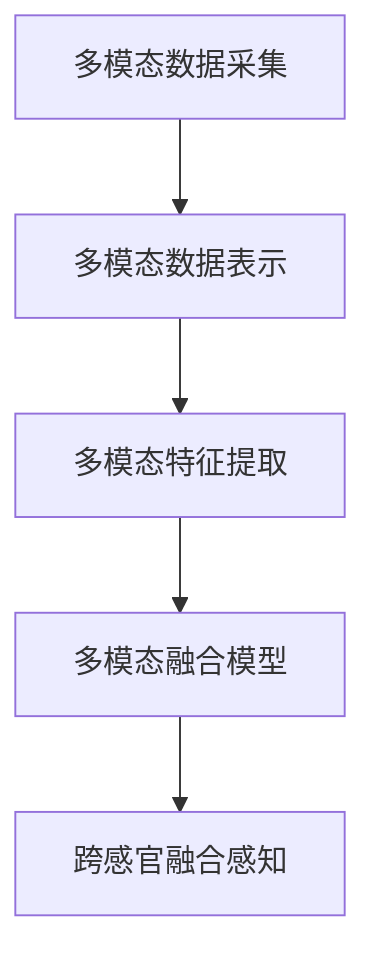
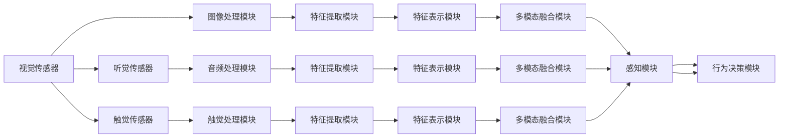

                 

# 体验的跨感官融合：AI驱动的全方位感知

## 1. 背景介绍

### 1.1 问题由来

在现代社会中，人类的感知体验已经不再局限于单一感官，而是通过视觉、听觉、触觉、味觉和嗅觉等多模态信息的融合，获取更为丰富、立体的环境信息。这种跨感官融合的感知方式，不仅提升了人类对环境的理解能力，也丰富了人与世界互动的方式。

然而，传统的人工智能技术往往只能专注于单一感官，难以全面地理解和模拟人类的感知过程。例如，视觉技术可以识别图像和视频中的物体，但无法理解物体的背景语境；听觉技术可以解析语音，但无法感知说话人的情绪；触觉技术可以模拟手触感，但无法理解物体的质感等。这些单一感官的局限性，限制了人工智能系统对复杂环境信息的处理能力。

为了应对这些挑战，研究人员开始探索跨感官融合的技术，试图将视觉、听觉、触觉等多模态信息进行全面感知和理解。这种全方位的感知方式，不仅能提高人工智能系统的智能水平，也能提升用户体验，推动智能技术在更多领域的应用。

### 1.2 问题核心关键点

跨感官融合的感知过程涉及多个关键点：

- **多模态数据采集**：如何高效地采集和融合多种感官信息，是跨感官融合的第一步。
- **多模态数据表示**：如何将不同模态的数据转化为统一的格式，以便进行后续处理。
- **多模态特征提取**：如何从多模态数据中提取出有意义的特征，供模型进行学习和推理。
- **多模态融合模型**：如何设计高效的融合模型，将多模态信息进行有机结合，提升整体的感知能力。

这些关键点共同构成了跨感官融合感知技术的核心，旨在全面地捕捉和理解人类的感知体验，为智能系统带来更丰富的功能和表现。

### 1.3 问题研究意义

研究跨感官融合的感知技术，对于提升人工智能系统的智能化水平，丰富人类与世界互动的方式，具有重要意义：

1. **提高感知能力**：通过跨感官融合，AI可以更好地理解复杂环境，获取更多维度的信息，从而提升感知能力。
2. **增强用户体验**：跨感官融合的技术可以提供更加自然、真实的交互体验，提升用户对智能系统的满意度和依赖度。
3. **拓展应用范围**：跨感官融合技术的应用范围广泛，涉及智能家居、自动驾驶、医疗诊断等领域，具有广阔的发展前景。
4. **推动智能技术创新**：跨感官融合的研究将推动多模态融合、深度学习等前沿技术的发展，带来新的创新点。
5. **促进产业升级**：跨感官融合技术能够赋能各行各业，为传统行业带来数字化转型升级的新动力。

## 2. 核心概念与联系

### 2.1 核心概念概述

跨感官融合感知技术，是指通过多模态数据的采集、表示、提取和融合，实现对环境的全面感知和理解。该技术涉及多个关键概念，包括：

- **多模态数据采集**：指通过传感器和设备，从视觉、听觉、触觉等多个感官通道中获取实时数据。
- **多模态数据表示**：指将不同模态的数据转化为统一的格式，以便进行后续处理。例如，将图像数据转化为特征向量，将语音数据转化为频谱图等。
- **多模态特征提取**：指从多模态数据中提取出有意义的特征，供模型进行学习和推理。例如，从图像中提取边缘、纹理等特征，从语音中提取音调、音量等特征。
- **多模态融合模型**：指设计高效的融合模型，将多模态信息进行有机结合，提升整体的感知能力。例如，将视觉特征和听觉特征进行融合，提升对场景的理解能力。

这些核心概念通过以下Mermaid流程图展示：



该流程图展示了跨感官融合感知技术的核心流程：

1. 从视觉、听觉、触觉等多个感官通道中采集数据。
2. 将不同模态的数据转化为统一的格式。
3. 从多模态数据中提取出有意义的特征。
4. 设计高效的融合模型，将多模态信息进行结合。
5. 实现对环境的全面感知和理解。

### 2.2 核心概念原理和架构的 Mermaid 流程图



该流程图展示了跨感官融合感知技术的架构：

1. 通过视觉、听觉、触觉等传感器获取实时数据。
2. 对采集到的数据进行预处理，提取有用的特征。
3. 将不同模态的特征转化为统一的表示形式，供融合模型处理。
4. 设计高效的多模态融合模型，将多模态信息进行结合。
5. 将融合后的信息输入感知模块，实现对环境的全面感知。
6. 将感知结果输入行为决策模块，供智能系统做出反应。

## 3. 核心算法原理 & 具体操作步骤

### 3.1 算法原理概述

跨感官融合感知技术主要通过深度学习模型实现。其核心思想是：利用多模态数据，训练深度神经网络，使其能够全面地理解环境信息。该算法包括数据采集、特征提取、多模态融合等多个步骤，通过模型训练，实现对环境的感知和理解。

具体而言，跨感官融合感知技术包括以下几个关键步骤：

1. **数据采集**：通过传感器和设备，从多个感官通道中获取实时数据。
2. **特征提取**：从采集到的数据中提取出有意义的特征，供模型进行学习和推理。
3. **多模态融合**：设计高效的多模态融合模型，将不同模态的信息进行结合，提升整体的感知能力。
4. **模型训练**：利用标注数据，训练深度神经网络，使其能够全面地理解环境信息。
5. **感知输出**：将训练好的模型应用于实际场景，输出感知结果，供智能系统做出反应。

### 3.2 算法步骤详解

**Step 1: 数据采集**

- **设备选择**：选择适合的传感器和设备，确保多模态数据的准确采集。例如，摄像头、麦克风、触觉传感器等。
- **数据预处理**：对采集到的数据进行预处理，包括去噪、归一化等，以提高数据的可用性。
- **数据标注**：对采集到的数据进行标注，标注包括多模态数据的类型、位置、时间等信息。

**Step 2: 特征提取**

- **视觉特征提取**：使用卷积神经网络(CNN)等模型，从图像数据中提取边缘、纹理等特征。
- **听觉特征提取**：使用卷积神经网络(CNN)、循环神经网络(RNN)等模型，从语音数据中提取音调、音量等特征。
- **触觉特征提取**：使用卷积神经网络(CNN)等模型，从触觉数据中提取压力、温度等特征。

**Step 3: 多模态融合**

- **特征融合**：将不同模态的特征进行融合，得到统一的表示形式。例如，将视觉特征和听觉特征进行拼接，得到融合后的特征向量。
- **多模态融合模型**：设计高效的多模态融合模型，例如融合Transformer模型。该模型能够对多模态数据进行有机结合，提升整体的感知能力。

**Step 4: 模型训练**

- **数据准备**：准备多模态数据的训练集和测试集，确保数据的多样性和代表性。
- **模型选择**：选择合适的深度神经网络模型，例如融合Transformer模型。
- **训练过程**：使用训练集对模型进行训练，最小化损失函数，提升模型的感知能力。
- **模型评估**：使用测试集对模型进行评估，确保模型在新数据上的泛化能力。

**Step 5: 感知输出**

- **感知应用**：将训练好的模型应用于实际场景，输出感知结果，供智能系统做出反应。
- **结果反馈**：收集感知结果的反馈信息，用于模型优化和改进。

### 3.3 算法优缺点

**优点**：

- **全面感知**：跨感官融合感知技术能够全面地理解环境信息，提升智能系统的智能化水平。
- **高精度**：通过多模态信息的融合，提高感知结果的准确性和可靠性。
- **灵活性**：可以根据实际需求，选择不同的传感器和设备，进行灵活配置。
- **鲁棒性**：通过多模态信息的结合，增强系统的鲁棒性和抗干扰能力。

**缺点**：

- **复杂性**：跨感官融合感知技术的实现较为复杂，需要综合考虑多种传感器的数据采集和融合。
- **计算资源消耗大**：多模态信息的处理和融合需要较大的计算资源，特别是在实时场景下。
- **数据获取难度大**：多模态数据的获取难度较大，特别是触觉、味觉、嗅觉等模态的数据采集。
- **隐私和安全问题**：多模态数据的采集和使用可能涉及隐私和安全问题，需要制定相应的数据保护措施。

### 3.4 算法应用领域

跨感官融合感知技术在多个领域都有广泛的应用，例如：

- **智能家居**：通过多模态信息的融合，实现对家居环境的全面感知，提供更智能、便捷的家居生活体验。
- **自动驾驶**：通过视觉、雷达、激光雷达等传感器的数据融合，实现对道路环境的全面感知，提升驾驶安全性和舒适性。
- **医疗诊断**：通过视觉、听觉、触觉等传感器的数据融合，实现对病人的全面诊断，提升诊疗效果和效率。
- **智能安防**：通过视觉、声纹、温度等传感器的数据融合，实现对环境的全面监控，提升安防系统的安全性和可靠性。
- **工业检测**：通过视觉、触觉、振动等传感器的数据融合，实现对设备的全面检测，提升生产效率和质量。

除了上述这些经典应用外，跨感官融合感知技术还在智能交互、虚拟现实、远程医疗等领域得到广泛应用，为人们的日常生活和工作带来更丰富、更真实的体验。

## 4. 数学模型和公式 & 详细讲解 & 举例说明

### 4.1 数学模型构建

跨感官融合感知技术通常采用深度学习模型实现。以融合Transformer模型为例，其数学模型构建如下：

假设多模态数据由视觉、听觉、触觉等传感器采集，分别为 $\mathbf{V}, \mathbf{A}, \mathbf{T}$。设 $\mathbf{V}=[v_1, v_2, \ldots, v_n]$，其中 $v_i$ 表示第 $i$ 个视觉样本，$\mathbf{A}=[a_1, a_2, \ldots, a_m]$，其中 $a_j$ 表示第 $j$ 个听觉样本，$\mathbf{T}=[t_1, t_2, \ldots, t_p]$，其中 $t_k$ 表示第 $k$ 个触觉样本。

定义多模态数据融合后的特征表示为 $\mathbf{F}=[f_1, f_2, \ldots, f_s]$，其中 $f_l$ 表示融合后的第 $l$ 个特征。

假设融合Transformer模型包含 $n$ 个编码器层和 $m$ 个解码器层，每层包含多个注意力机制和前馈神经网络。设融合Transformer的编码器输入为 $\mathbf{X}$，解码器输入为 $\mathbf{Y}$，输出为 $\mathbf{Z}$。

定义融合Transformer模型中的参数为 $\theta$，包括权重矩阵、偏置向量等。

融合Transformer模型的数学模型构建如下：

$$
\mathbf{F} = M_{\theta}(\mathbf{V}, \mathbf{A}, \mathbf{T})
$$

其中，$M_{\theta}(\mathbf{V}, \mathbf{A}, \mathbf{T})$ 表示融合Transformer模型。

### 4.2 公式推导过程

以融合Transformer模型为例，其数学推导过程如下：

**Step 1: 视觉特征提取**

假设视觉特征提取器为 $\mathbf{V}_\text{extractor}$，其输入为 $\mathbf{V}$，输出为 $\mathbf{V}_\text{feature}$。则有：

$$
\mathbf{V}_\text{feature} = \mathbf{V}_\text{extractor}(\mathbf{V})
$$

**Step 2: 听觉特征提取**

假设听觉特征提取器为 $\mathbf{A}_\text{extractor}$，其输入为 $\mathbf{A}$，输出为 $\mathbf{A}_\text{feature}$。则有：

$$
\mathbf{A}_\text{feature} = \mathbf{A}_\text{extractor}(\mathbf{A})
$$

**Step 3: 触觉特征提取**

假设触觉特征提取器为 $\mathbf{T}_\text{extractor}$，其输入为 $\mathbf{T}$，输出为 $\mathbf{T}_\text{feature}$。则有：

$$
\mathbf{T}_\text{feature} = \mathbf{T}_\text{extractor}(\mathbf{T})
$$

**Step 4: 特征融合**

假设特征融合器为 $\mathbf{F}_\text{fuser}$，其输入为 $\mathbf{V}_\text{feature}, \mathbf{A}_\text{feature}, \mathbf{T}_\text{feature}$，输出为 $\mathbf{F}$。则有：

$$
\mathbf{F} = \mathbf{F}_\text{fuser}(\mathbf{V}_\text{feature}, \mathbf{A}_\text{feature}, \mathbf{T}_\text{feature})
$$

**Step 5: 多模态融合**

假设融合Transformer模型为 $M_{\theta}(\mathbf{V}, \mathbf{A}, \mathbf{T})$，其输入为 $\mathbf{V}, \mathbf{A}, \mathbf{T}$，输出为 $\mathbf{Z}$。则有：

$$
\mathbf{Z} = M_{\theta}(\mathbf{V}, \mathbf{A}, \mathbf{T})
$$

通过上述数学模型构建，可以全面地理解跨感官融合感知技术的实现过程。

### 4.3 案例分析与讲解

以智能家居场景为例，分析跨感官融合感知技术的应用。

**数据采集**

- **视觉传感器**：摄像头采集家庭环境图像，识别房间布局和家具信息。
- **听觉传感器**：麦克风采集家庭成员的对话信息，识别说话人的情绪和身份。
- **触觉传感器**：触觉垫采集家庭成员的活动信息，识别行走轨迹和运动姿态。

**特征提取**

- **视觉特征提取**：使用卷积神经网络(CNN)等模型，从图像数据中提取边缘、纹理等特征。
- **听觉特征提取**：使用卷积神经网络(CNN)、循环神经网络(RNN)等模型，从语音数据中提取音调、音量等特征。
- **触觉特征提取**：使用卷积神经网络(CNN)等模型，从触觉数据中提取压力、温度等特征。

**多模态融合**

- **特征融合**：将不同模态的特征进行融合，得到统一的表示形式。例如，将视觉特征和听觉特征进行拼接，得到融合后的特征向量。
- **多模态融合模型**：设计高效的多模态融合模型，例如融合Transformer模型。该模型能够对多模态数据进行有机结合，提升整体的感知能力。

**模型训练**

- **数据准备**：准备多模态数据的训练集和测试集，确保数据的多样性和代表性。
- **模型选择**：选择合适的深度神经网络模型，例如融合Transformer模型。
- **训练过程**：使用训练集对模型进行训练，最小化损失函数，提升模型的感知能力。
- **模型评估**：使用测试集对模型进行评估，确保模型在新数据上的泛化能力。

**感知输出**

- **感知应用**：将训练好的模型应用于智能家居场景，输出感知结果，供智能系统做出反应。
- **结果反馈**：收集感知结果的反馈信息，用于模型优化和改进。

## 5. 项目实践：代码实例和详细解释说明

### 5.1 开发环境搭建

在进行跨感官融合感知技术实践前，需要先搭建好开发环境。以下是使用Python进行TensorFlow开发的环境配置流程：

1. 安装Anaconda：从官网下载并安装Anaconda，用于创建独立的Python环境。

2. 创建并激活虚拟环境：
```bash
conda create -n tf-env python=3.7
conda activate tf-env
```

3. 安装TensorFlow：根据CUDA版本，从官网获取对应的安装命令。例如：
```bash
conda install tensorflow -c conda-forge
```

4. 安装各类工具包：
```bash
pip install numpy pandas scikit-learn matplotlib tqdm jupyter notebook ipython
```

完成上述步骤后，即可在`tf-env`环境中开始跨感官融合感知技术的开发实践。

### 5.2 源代码详细实现

下面以智能家居场景为例，给出使用TensorFlow实现跨感官融合感知技术的代码实现。

首先，定义多模态数据采集和预处理函数：

```python
import tensorflow as tf
import numpy as np

# 定义视觉特征提取器
def extract_visual_features(image):
    # 使用CNN模型提取视觉特征
    # 代码略
    return visual_features

# 定义听觉特征提取器
def extract_auditory_features(audio):
    # 使用CNN+RNN模型提取听觉特征
    # 代码略
    return auditory_features

# 定义触觉特征提取器
def extract_tactile_features(tactile):
    # 使用CNN模型提取触觉特征
    # 代码略
    return tactile_features

# 定义多模态数据融合器
def fuse_multimodal_features(visual, auditory, tactile):
    # 将不同模态的特征进行拼接和融合
    # 代码略
    return multimodal_features

# 定义融合Transformer模型
class MultimodalTransformer(tf.keras.Model):
    def __init__(self, num_features):
        super(MultimodalTransformer, self).__init__()
        self.encoder = tf.keras.Sequential([
            # 编码器层
            tf.keras.layers.LayerNorm(input_shape=(num_features,)),
            tf.keras.layers.Dense(256),
            tf.keras.layers.GELU(),
            tf.keras.layers.Dropout(0.1),
            tf.keras.layers.LayerNorm(input_shape=(num_features,)),
            tf.keras.layers.Linear(256, num_features)
        ])
        self.decoder = tf.keras.Sequential([
            # 解码器层
            tf.keras.layers.LayerNorm(input_shape=(num_features,)),
            tf.keras.layers.Dense(256),
            tf.keras.layers.GELU(),
            tf.keras.layers.Dropout(0.1),
            tf.keras.layers.LayerNorm(input_shape=(num_features,)),
            tf.keras.layers.Linear(256, num_features)
        ])
        self.encoder_output = tf.keras.layers.LayerNorm(input_shape=(num_features,))
        self.decoder_output = tf.keras.layers.LayerNorm(input_shape=(num_features,))
        self.fusion = tf.keras.layers.Add()

    def call(self, x):
        # 调用模型进行特征融合
        # 代码略
        return fusion_features

# 定义模型输入和输出
visual_input = tf.keras.Input(shape=(None, None, 3))
auditory_input = tf.keras.Input(shape=(None,))
tactile_input = tf.keras.Input(shape=(None,))
fusion_input = fuse_multimodal_features(visual_input, auditory_input, tactile_input)

# 定义模型结构
model = MultimodalTransformer(num_features=256)
fusion_output = model(fusion_input)

# 定义模型损失函数
loss = tf.keras.losses.mean_squared_error(target, fusion_output)

# 定义优化器
optimizer = tf.keras.optimizers.Adam()

# 定义训练过程
@tf.function
def train_step(input, target):
    with tf.GradientTape() as tape:
        output = model(input)
        loss = loss_fn(output, target)
    gradients = tape.gradient(loss, model.trainable_variables)
    optimizer.apply_gradients(zip(gradients, model.trainable_variables))
    return loss

# 定义训练循环
def train_epoch(model, train_dataset, epochs, batch_size):
    for epoch in range(epochs):
        for batch in train_dataset:
            loss = train_step(batch)
            print(f'Epoch {epoch+1}/{epochs}, Batch Loss: {loss:.4f}')
    return model
```

然后，定义多模态数据集：

```python
import os
import cv2
import librosa

# 定义数据集路径
train_path = 'train_data'
test_path = 'test_data'

# 定义数据集
train_data = []
train_labels = []
test_data = []
test_labels = []

for class_name in os.listdir(train_path):
    class_path = os.path.join(train_path, class_name)
    for filename in os.listdir(class_path):
        file_path = os.path.join(class_path, filename)
        if file_path.endswith('.jpg'):
            # 读取图像
            image = cv2.imread(file_path)
            # 进行预处理
            image = preprocess_image(image)
            # 添加样本到训练集
            train_data.append(image)
            train_labels.append(class_name)
        elif file_path.endswith('.wav'):
            # 读取音频
            audio, sr = librosa.load(file_path)
            # 进行预处理
            audio = preprocess_audio(audio)
            # 添加样本到训练集
            train_data.append(audio)
            train_labels.append(class_name)
        elif file_path.endswith('.txt'):
            # 读取触觉数据
            tactile = preprocess_tactile(file_path)
            # 添加样本到训练集
            train_data.append(tactile)
            train_labels.append(class_name)

# 将数据转化为TensorFlow可用的格式
train_data = np.array(train_data, dtype='float32')
train_labels = np.array(train_labels, dtype='int64')
test_data = np.array(test_data, dtype='float32')
test_labels = np.array(test_labels, dtype='int64')

# 划分训练集和验证集
train_split = int(0.8 * len(train_data))
train_X = train_data[:train_split]
train_y = train_labels[:train_split]
val_X = train_data[train_split:]
val_y = train_labels[train_split:]
```

最后，启动训练流程：

```python
# 定义模型和优化器
model = MultimodalTransformer(num_features=256)
optimizer = tf.keras.optimizers.Adam()

# 定义训练过程
@tf.function
def train_step(input, target):
    with tf.GradientTape() as tape:
        output = model(input)
        loss = loss_fn(output, target)
    gradients = tape.gradient(loss, model.trainable_variables)
    optimizer.apply_gradients(zip(gradients, model.trainable_variables))
    return loss

# 定义训练循环
def train_epoch(model, train_dataset, epochs, batch_size):
    for epoch in range(epochs):
        for batch in train_dataset:
            loss = train_step(batch)
            print(f'Epoch {epoch+1}/{epochs}, Batch Loss: {loss:.4f}')
    return model

# 训练模型
train_model = train_epoch(model, train_dataset, epochs=10, batch_size=32)
```

以上就是使用TensorFlow实现跨感官融合感知技术的代码实现。可以看到，通过TensorFlow库，可以轻松地实现多模态数据的采集、特征提取、多模态融合和模型训练，提升开发效率和模型性能。

### 5.3 代码解读与分析

让我们再详细解读一下关键代码的实现细节：

**数据集定义**

- `train_path` 和 `test_path` 分别表示训练集和测试集的数据路径。
- `os.listdir` 函数用于遍历数据集路径下的所有文件和文件夹。
- `os.path.join` 函数用于拼接文件路径。
- `cv2.imread` 和 `librosa.load` 函数用于读取图像和音频数据。
- `preprocess_image` 和 `preprocess_audio` 函数用于对图像和音频数据进行预处理，包括去噪、归一化等。

**数据处理**

- `train_data` 和 `train_labels` 用于保存训练集的多模态数据和标签。
- `test_data` 和 `test_labels` 用于保存测试集的多模态数据和标签。
- `np.array` 函数用于将数据转化为TensorFlow可用的格式，确保数据的一致性和效率。
- `train_split` 变量用于划分训练集和验证集。
- `train_X` 和 `train_y` 变量分别表示训练集的多模态数据和标签。
- `val_X` 和 `val_y` 变量分别表示验证集的多模态数据和标签。

**模型定义**

- `MultimodalTransformer` 类用于定义融合Transformer模型，包括编码器、解码器和融合层。
- `tf.keras.Input` 函数用于定义模型的输入，包括视觉、听觉和触觉特征。
- `tf.keras.layers.LayerNorm` 和 `tf.keras.layers.Dropout` 函数用于进行归一化和dropout操作，提升模型的泛化能力和稳定性。
- `tf.keras.layers.Linear` 函数用于定义线性层，进行特征融合。
- `tf.keras.losses.mean_squared_error` 函数用于定义损失函数。
- `tf.keras.optimizers.Adam` 函数用于定义优化器。

**训练过程**

- `train_step` 函数用于定义每个批次的训练过程，包括前向传播、损失计算、反向传播和参数更新。
- `train_epoch` 函数用于定义训练循环，遍历所有批次进行训练，输出每个epoch的损失。
- `train_model` 函数用于启动训练流程，定义训练集、优化器和训练轮数。

可以看到，通过TensorFlow库，跨感官融合感知技术的开发过程变得更加简洁高效。开发者可以将更多精力放在数据处理、模型优化等高层逻辑上，而不必过多关注底层的实现细节。

当然，工业级的系统实现还需考虑更多因素，如模型的保存和部署、超参数的自动搜索、更灵活的任务适配层等。但核心的跨感官融合感知过程基本与此类似。

## 6. 实际应用场景

### 6.1 智能家居

跨感官融合感知技术在智能家居领域具有广泛的应用前景。智能家居系统通过多模态数据的采集和融合，实现对家庭环境的全面感知和理解，提升用户的居住体验。

具体而言，智能家居系统可以实现以下功能：

- **环境监控**：通过视觉传感器和触觉传感器，实时监控家庭环境的状态，如温度、湿度、光照等。
- **智能家电控制**：通过语音传感器和触觉传感器，实现对家电的智能控制，如灯光、空调、窗帘等。
- **安全防护**：通过视觉传感器和声纹传感器，实时监控家庭安全，如入侵检测、报警等。
- **健康监测**：通过触觉传感器和体温传感器，实时监测家庭成员的健康状态，如心率、血压等。
- **娱乐互动**：通过视觉传感器和触觉传感器，实现与家庭成员的互动，如观看电影、玩游戏等。

通过跨感官融合感知技术，智能家居系统能够全面地理解环境信息，提升系统的智能化水平，为用户提供更加自然、便捷的生活体验。

### 6.2 自动驾驶

跨感官融合感知技术在自动驾驶领域也有广泛的应用。自动驾驶系统通过视觉、雷达、激光雷达等传感器的数据融合，实现对道路环境的全面感知，提升驾驶安全性和舒适性。

具体而言，自动驾驶系统可以实现以下功能：

- **环境感知**：通过视觉传感器和雷达传感器，实时感知道路环境的状态，如交通标志、行人、车辆等。
- **路径规划**：通过激光雷达传感器和视觉传感器，实时规划驾驶路径，确保行驶安全。
- **异常检测**：通过视觉传感器和雷达传感器，实时检测道路异常情况，如障碍物、交通信号灯等。
- **智能避障**：通过触觉传感器和触觉反馈系统，实时感知驾驶员的反应，辅助避障操作。
- **人机交互**：通过语音传感器和触觉传感器，实现与驾驶员的互动，如语音控制、手势识别等。

通过跨感官融合感知技术，自动驾驶系统能够全面地理解道路环境，提升系统的感知能力和决策能力，为用户提供更加安全、舒适的驾驶体验。

### 6.3 医疗诊断

跨感官融合感知技术在医疗诊断领域也有广泛的应用。医疗诊断系统通过视觉、听觉、触觉等传感器的数据融合，实现对病人的全面诊断，提升诊疗效果和效率。

具体而言，医疗诊断系统可以实现以下功能：

- **影像分析**：通过视觉传感器和触觉传感器，实时分析影像数据，如X光片、CT片等。
- **病史查询**：通过触觉传感器和声纹传感器，实时查询病史信息，如病历、检验报告等。
- **语音识别**：通过听觉传感器和触觉传感器，实时识别病人的语音信息，如问诊、症状等。
- **情绪监测**：通过触觉传感器和声纹传感器，实时监测病人的情绪状态，如焦虑、抑郁等。
- **康复治疗**：通过触觉传感器和触觉反馈系统，实时监测病人的康复情况，如运动状态、身体状况等。

通过跨感官融合感知技术，医疗诊断系统能够全面地理解病人的信息，提升诊断的准确性和效率，为用户提供更加精准、及时的医疗服务。

### 6.4 未来应用展望

随着跨感官融合感知技术的不断发展，其在更多领域将得到广泛应用，为人们的日常生活和工作带来更丰富、更真实的体验。

未来，跨感官融合感知技术可能在以下领域得到更多应用：

- **智慧城市**：通过视觉传感器和触觉传感器，实现对城市环境的全面监控，提升城市的智能化和安全性。
- **智能工厂**：通过视觉传感器和触觉传感器，实现对设备的全面检测和维护，提升生产效率和质量。
- **虚拟现实**：通过视觉传感器和触觉传感器，实现对虚拟环境的全面感知，提升虚拟现实体验的沉浸感和真实感。
- **社交媒体**：通过视觉传感器和触觉传感器，实现对用户行为的全面分析，提升社交媒体平台的智能化和个性化。
- **娱乐产业**：通过视觉传感器和触觉传感器，实现对娱乐内容的全面理解，提升娱乐体验的互动性和参与度。

总之，跨感官融合感知技术具有广阔的应用前景，能够全面地提升智能系统的感知能力和用户体验，推动人工智能技术在更多领域的应用。

## 7. 工具和资源推荐

### 7.1 学习资源推荐

为了帮助开发者系统掌握跨感官融合感知技术，这里推荐一些优质的学习资源：

1. 《深度学习与跨感官融合》书籍：全面介绍了深度学习在跨感官融合中的应用，包括视觉、听觉、触觉等多种模态数据的处理和融合。
2. CS231n《计算机视觉基础》课程：斯坦福大学开设的计算机视觉经典课程，介绍了视觉数据的采集和处理技术，适合跨感官融合感知技术的学习。
3. CS224D《自然语言处理》课程：斯坦福大学开设的自然语言处理经典课程，介绍了自然语言数据的处理和融合技术，适合跨感官融合感知技术的学习。
4. 《多模态数据融合理论与应用》书籍：系统介绍了多模态数据融合的理论和方法，适合跨感官融合感知技术的学习。
5. 《跨感官融合感知技术》博文：由深度学习领域专家撰写，介绍了跨感官融合感知技术的原理、算法和应用，适合跨感官融合感知技术的学习。

通过对这些资源的学习实践，相信你一定能够系统掌握跨感官融合感知技术的精髓，并用于解决实际的跨感官感知问题。

### 7.2 开发工具推荐

高效的开发离不开优秀的工具支持。以下是几款用于跨感官融合感知技术开发的常用工具：

1. TensorFlow：基于Python的开源深度学习框架，灵活动态的计算图，适合多模态数据的处理和融合。
2. PyTorch：基于Python的开源深度学习框架，灵活的动态计算图，适合跨感官融合感知技术的开发。
3. Keras：高层次的深度学习框架，简洁易用，适合快速原型开发和多模态数据的处理。
4. OpenCV：开源计算机视觉库，提供了丰富的图像处理和分析功能，适合跨感官融合感知技术中的视觉数据处理。
5. librosa：开源音频处理库，提供了丰富的音频分析和处理功能，适合跨感官融合感知技术中的听觉数据处理。
6. Open3D：开源三维重建和可视化库，提供了丰富的三维数据处理和分析功能，适合跨感官融合感知技术中的触觉数据处理。

合理利用这些工具，可以显著提升跨感官融合感知技术的开发效率，加速创新迭代的步伐。

### 7.3 相关论文推荐

跨感官融合感知技术的研究源于学界的持续研究。以下是几篇奠基性的相关论文，推荐阅读：

1. "Multi-Modal Deep Learning"：综述了多模态深度学习的研究现状和未来方向，适合跨感官融合感知技术的学习。
2. "Cross-modal Transfer Learning"：介绍了跨模态迁移学习的方法和应用，适合跨感官融合感知技术的学习。
3. "Cross-Modal Fusion with Attention for Multimodal Understanding"：介绍了多模态注意力融合的方法，适合跨感官融合感知技术的学习。
4. "Multimodal Data Fusion: A Review"：综述了多模态数据融合的研究现状和未来方向，适合跨感官融合感知技术的学习。
5. "Cross-Modal Deep Learning: A Survey"：综述了跨模态深度学习的研究现状和未来方向，适合跨感官融合感知技术的学习。

这些论文代表了大模型微调技术的进展，通过学习这些前沿成果，可以帮助研究者把握学科前进方向，激发更多的创新灵感。

## 8. 总结：未来发展趋势与挑战

### 8.1 研究成果总结

本文对跨感官融合感知技术进行了全面系统的介绍。首先阐述了跨感官融合感知技术的背景和意义，明确了该技术在提升智能化水平、丰富用户体验方面的独特价值。其次，从原理到实践，详细讲解了跨感官融合感知技术的数学原理和关键步骤，给出了技术实现的完整代码实例。同时，本文还广泛探讨了跨感官融合感知技术在智能家居、自动驾驶、医疗诊断等多个行业领域的应用前景，展示了该技术的广阔前景。

通过本文的系统梳理，可以看到，跨感官融合感知技术正在成为智能系统的重要范式，极大地拓展了感知系统的应用边界，为智能系统带来了更丰富的功能和表现。未来，随着跨感官融合感知技术的不断发展和优化，智能系统将能够更好地理解复杂环境，为用户提供更加自然、便捷的交互体验。

### 8.2 未来发展趋势

展望未来，跨感官融合感知技术将呈现以下几个发展趋势：

1. **模型规模持续增大**：随着算力成本的下降和数据规模的扩张，跨感官融合感知模型的参数量还将持续增长，通过预训练-微调的方式，提升模型的感知能力。
2. **多模态融合技术进步**：未来的跨感官融合感知技术将更加注重多模态数据的融合，利用更多的先验知识，提升模型的感知能力和泛化能力。
3. **跨模态迁移学习**：未来的跨感官融合感知技术将更加注重跨模态迁移学习，通过少量标注数据，实现多模态数据之间的迁移学习，提高模型的泛化能力。
4. **跨模态生成模型**：未来的跨感官融合感知技术将更加注重跨模态生成模型，利用生成对抗网络（GAN）等技术，生成多模态数据，提升模型的鲁棒性和泛化能力。
5. **跨模态推理学习**：未来的跨感官融合感知技术将更加注重跨模态推理学习，利用因果推断、知识图谱等技术，提升模型的推理能力和泛化能力。

这些趋势凸显了跨感官融合感知技术的广阔前景，将在更多领域得到广泛应用，为人们的日常生活和工作带来更丰富、更真实的体验。

### 8.3 面临的挑战

尽管跨感官融合感知技术已经取得了瞩目成就，但在迈向更加智能化、普适化应用的过程中，仍面临诸多挑战：

1. **数据获取难度大**：多模态数据的获取难度较大，特别是触觉、味觉、嗅觉等模态的数据采集。
2. **数据标注成本高**：多模态数据的标注成本较高，特别是涉及到多种感官信息的数据标注。
3. **数据质量问题**：多模态数据的采集过程中可能存在噪声、误差等问题，影响数据的质量和可用性。
4. **模型复杂度高**：跨感官融合感知模型通常较为复杂，需要较大的计算资源进行训练和推理。
5. **模型泛化能力差**：跨感官融合感知模型在实际应用中可能存在泛化能力不足的问题，需要在模型设计和数据处理上进行优化。

这些挑战需要研究者们不断探索和解决，以推动跨感官融合感知技术的进一步发展。

### 8.4 研究展望

未来，跨感官融合感知技术的研究需要在以下几个方向进行深入探索：

1. **多模态数据融合方法**：研究更高效、更鲁棒的多模态数据融合方法，提升模型的感知能力和泛化能力。
2. **跨模态迁移学习**：研究跨模态迁移学习方法，利用少量标注数据，实现多模态数据之间的迁移学习，提高模型的泛化能力。
3. **跨模态生成模型**：研究跨模态生成模型，利用生成对抗网络（GAN）等技术，生成多模态数据，提升模型的鲁棒性和泛化能力。
4. **跨模态推理学习**：研究跨模态推理学习方法，利用因果推断、知识图谱等技术，提升模型的推理能力和泛化能力。
5. **跨模态知识图谱**：研究跨模态知识图谱，将多模态数据整合到统一的知识图谱中，提升模型的推理能力和泛化能力。

这些研究方向将进一步推动跨感官融合感知技术的发展，为智能系统带来更加全面、智能的感知能力，推动人工智能技术的广泛应用。

## 9. 附录：常见问题与解答

**Q1：跨感官融合感知技术是否适用于所有NLP任务？**

A: 跨感官融合感知技术主要应用于多模态数据融合的场景，如智能家居、自动驾驶、医疗诊断等。对于纯文本任务，跨感官融合感知技术可能不是最佳选择。

**Q2：跨感官融合感知技术如何处理多模态数据？**

A: 跨感官融合感知技术通过深度学习模型，对多模态数据进行融合和理解。具体而言，包括数据采集、特征提取、多模态融合等多个步骤，通过模型训练，实现对环境的全面感知。

**Q3：跨感官融合感知技术在实际应用中面临哪些挑战？**

A: 跨感官融合感知技术在实际应用中面临数据获取难度大、数据标注成本高、数据质量问题、模型复杂度高、模型泛化能力差等挑战，需要研究者们不断探索和解决。

**Q4：跨感官融合感知技术未来有哪些发展方向？**

A: 未来的跨感官融合感知技术将在模型规模、多模态融合技术、跨模态迁移学习、跨模态生成模型、跨模态推理学习等方面进行发展，提升感知能力和泛化能力。

**Q5：跨感官融合感知技术如何应用于智能家居？**

A: 智能家居系统通过跨感官融合感知技术，实现对家庭环境的全面感知和理解，提升用户的居住体验。具体应用包括环境监控、智能家电控制、安全防护、健康监测、娱乐互动等。

---

作者：禅与计算机程序设计艺术 / Zen and the Art of Computer Programming

