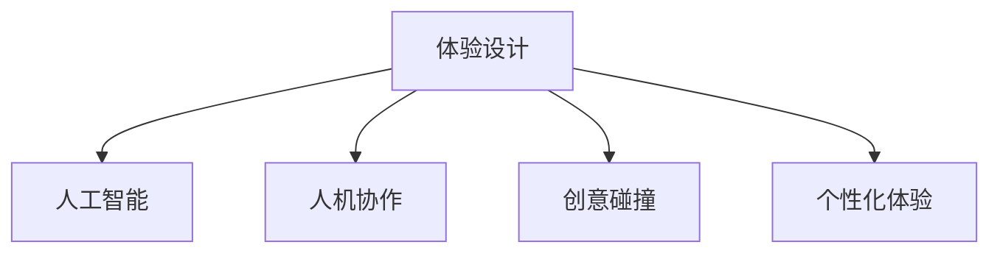

                 

# 体验设计的未来：AI与人类创意的协作

> 关键词：体验设计,人工智能,人机协作,创意碰撞,用户体验

## 1. 背景介绍

在数字化时代，体验设计（Experience Design, XD）已经成为品牌塑造和用户互动的关键驱动力。从网页设计到移动应用、从智能家居到健康医疗，用户对交互的体验感和连贯性有着更高的要求。而人工智能（AI）技术的发展，特别是机器学习和自然语言处理（NLP），为体验设计带来了新的可能。

人工智能不仅能辅助设计师提升效率，还能在用户行为分析、个性化推荐等方面提供洞见。通过AI与人类设计师的深度协作，我们可以创造出更加丰富和互动的体验。本文将深入探讨AI如何重塑体验设计，推动人机协作的创新。

## 2. 核心概念与联系

### 2.1 核心概念概述

为了更好地理解AI与体验设计的协作，本节将介绍几个关键概念：

- **体验设计（XD）**：以用户为中心，通过合理的交互设计和视觉设计，提升产品的使用体验。
- **人工智能（AI）**：通过模拟人类的智能行为，实现数据的智能处理和决策。
- **人机协作（Human-AI Collaboration）**：指AI技术与人类设计师、开发者合作，共同完成产品设计和优化。
- **创意碰撞（Creative Collisions）**：指AI提供的洞察与人类设计师的设计灵感相互激荡，产生创新的设计理念。
- **个性化体验（Personalized Experience）**：根据用户数据，提供量身定制的体验服务。

这些核心概念之间的逻辑关系可以通过以下Mermaid流程图来展示：



这个流程图展示了几大核心概念之间的相互关系：

1. **体验设计**作为基础，通过**人工智能**和**人机协作**辅助优化，通过**创意碰撞**产生新的设计理念，最终提供**个性化体验**。

## 3. 核心算法原理 & 具体操作步骤
### 3.1 算法原理概述

基于AI的体验设计，其核心在于利用机器学习算法分析和理解用户行为，辅助设计师设计出更加符合用户需求的产品。在AI与体验设计的协作中，主要涉及以下算法：

- **用户行为分析**：利用分类、聚类、关联规则等算法，分析用户的使用习惯和偏好。
- **个性化推荐**：使用协同过滤、矩阵分解等算法，为用户推荐个性化内容或功能。
- **自然语言处理（NLP）**：通过文本分析和语义理解，优化用户交互界面。
- **机器学习（ML）**：基于用户行为数据，训练模型预测用户需求，优化产品设计。

### 3.2 算法步骤详解

基于AI的体验设计通常包括以下几个关键步骤：

**Step 1: 数据收集与预处理**

- 收集用户的交互数据，如点击率、停留时间、应用内路径等。
- 清洗数据，去除噪音和异常值，并标准化数据格式。
- 划分子任务数据集，如训练集、验证集和测试集。

**Step 2: 模型训练与优化**

- 选择合适的算法模型，如决策树、随机森林、深度学习等。
- 训练模型，使用交叉验证等技术优化模型参数。
- 在验证集上评估模型性能，调整超参数。

**Step 3: 应用集成与优化**

- 将训练好的模型集成到产品设计中，如用户界面、交互逻辑等。
- 实时监控用户行为，反馈调整模型参数。
- 持续优化算法模型，提高预测精度和用户体验。

**Step 4: 用户测试与反馈**

- 设计用户测试场景，如A/B测试、用户访谈等。
- 收集用户反馈，评估产品的实际体验效果。
- 根据反馈调整设计，迭代优化产品。

### 3.3 算法优缺点

AI辅助的体验设计具有以下优点：

- **效率提升**：AI可以快速分析海量用户数据，辅助设计师快速决策。
- **个性化优化**：AI能够根据用户行为预测需求，提供个性化体验。
- **数据驱动**：AI通过数据分析提供科学的决策依据。

同时，也存在以下缺点：

- **数据隐私问题**：用户的隐私数据可能被滥用，需严格保护。
- **算法偏见**：模型可能学习到用户数据中的偏见，影响决策公平性。
- **复杂性增加**：引入AI技术增加了设计和开发的复杂性。

### 3.4 算法应用领域

AI与体验设计的协作已经在多个领域得到了广泛应用，例如：

- **移动应用**：利用AI分析用户行为，优化界面设计和交互逻辑。
- **网站设计**：通过NLP分析用户评论，优化内容推荐和搜索功能。
- **智能家居**：使用机器学习预测用户需求，实现智能场景和个性化服务。
- **健康医疗**：基于用户健康数据，推荐个性化的医疗服务和健康建议。
- **教育科技**：通过AI分析学生学习行为，提供个性化的学习推荐和辅导。

这些领域的应用展示了AI在体验设计中的巨大潜力，未来还将拓展到更多行业。

## 4. 数学模型和公式 & 详细讲解 & 举例说明

### 4.1 数学模型构建

在本节中，我们将通过具体的数学模型来详细解释基于AI的体验设计。

以协同过滤算法为例，假设我们有一个用户行为数据集 $D=\{(u_i,v_i)\}_{i=1}^N$，其中 $u_i$ 表示用户，$v_i$ 表示用户行为（如点击、购买等）。我们的目标是找到一个用户-物品评分矩阵 $R$，使得每个用户 $u_i$ 对每个物品 $v_i$ 都有一个评分 $R_{u_i,v_i}$。

我们可以使用矩阵分解的方法，将 $R$ 分解为两个低秩矩阵 $P$ 和 $Q$ 的乘积：

$$
R \approx P \times Q^T
$$

其中 $P \in \mathbb{R}^{n \times k}$ 和 $Q \in \mathbb{R}^{k \times m}$ 是两个低秩矩阵，$k$ 是模型降维后的维度数。

### 4.2 公式推导过程

通过上述矩阵分解模型，我们可以构建协同过滤算法的基本公式。假设我们有一个新用户 $u_0$ 和物品 $v_j$，我们可以使用矩阵分解模型来预测用户对物品的评分：

$$
\hat{R}_{u_0,v_j} = \sum_{i=1}^N P_{u_0,i} Q_{i,v_j}
$$

其中 $P_{u_0,i}$ 和 $Q_{i,v_j}$ 分别为用户 $u_0$ 和物品 $v_j$ 的潜在因子。

为了训练矩阵 $P$ 和 $Q$，我们通常使用最小二乘法，最小化预测评分与实际评分之间的误差：

$$
\min_{P,Q} \sum_{i=1}^N \sum_{j=1}^m (R_{i,j} - \sum_{k=1}^K P_{i,k} Q_{k,j})^2
$$

### 4.3 案例分析与讲解

以电商平台为例，我们可以利用协同过滤算法为用户推荐商品。具体步骤如下：

1. 收集用户的历史点击和购买数据，将其转化为用户-物品评分矩阵 $R$。
2. 使用矩阵分解算法，将 $R$ 分解为 $P$ 和 $Q$ 两个低秩矩阵。
3. 利用分解后的矩阵 $P$ 和 $Q$，对新用户 $u_0$ 进行评分预测，并推荐评分高的商品。
4. 根据用户反馈，不断调整模型参数，优化推荐效果。

## 5. 项目实践：代码实例和详细解释说明
### 5.1 开发环境搭建

在进行项目实践前，我们需要准备好开发环境。以下是使用Python进行TensorFlow开发的环境配置流程：

1. 安装Anaconda：从官网下载并安装Anaconda，用于创建独立的Python环境。

2. 创建并激活虚拟环境：
```bash
conda create -n tf-env python=3.8 
conda activate tf-env
```

3. 安装TensorFlow：根据CUDA版本，从官网获取对应的安装命令。例如：
```bash
pip install tensorflow==2.4
```

4. 安装各类工具包：
```bash
pip install numpy pandas scikit-learn matplotlib tqdm jupyter notebook ipython
```

完成上述步骤后，即可在`tf-env`环境中开始项目实践。

### 5.2 源代码详细实现

我们以推荐系统为例，给出使用TensorFlow进行协同过滤算法实现的Python代码。

首先，定义协同过滤算法的输入和输出：

```python
import tensorflow as tf

class协同过滤推荐系统(tf.keras.Model):
    def __init__(self, factor_num):
        super(协同过滤推荐系统, self).__init__()
        self.P = tf.Variable(tf.random.normal([n_users, factor_num]), name='P')
        self.Q = tf.Variable(tf.random.normal([factor_num, n_items]), name='Q')
        
    def call(self, user_indices):
        user_vectors = tf.nn.embedding_lookup(self.P, user_indices)
        item_vectors = tf.nn.embedding_lookup(self.Q, user_indices)
        predictions = tf.matmul(user_vectors, item_vectors, transpose_b=True)
        return predictions
```

然后，定义训练函数：

```python
def train_recommender(dataset, learning_rate, epochs):
    model =协同过滤推荐系统(factor_num)
    optimizer = tf.keras.optimizers.Adam(learning_rate)
    
    for epoch in range(epochs):
        for user_indices, (user_item_pairs, item_scores) in dataset:
            with tf.GradientTape() as tape:
                predictions = model(user_indices)
                loss = tf.reduce_mean(tf.square(predictions - tf.convert_to_tensor(item_scores)))
            gradients = tape.gradient(loss, model.trainable_variables)
            optimizer.apply_gradients(zip(gradients, model.trainable_variables))
    return model
```

最后，启动训练流程：

```python
from dataset import get_dataset

n_users = 1000
n_items = 1000
n_factors = 10

dataset = get_dataset(n_users, n_items, n_factors)
model = train_recommender(dataset, learning_rate=0.001, epochs=10)
```

以上就是使用TensorFlow实现协同过滤算法的完整代码实现。可以看到，TensorFlow提供了强大的计算图和自动微分功能，使得算法模型的实现变得非常便捷。

### 5.3 代码解读与分析

让我们再详细解读一下关键代码的实现细节：

**协同过滤推荐系统类**：
- `__init__`方法：初始化模型的低秩矩阵 $P$ 和 $Q$。
- `call`方法：将用户索引作为输入，计算预测评分。

**train_recommender函数**：
- 循环迭代指定轮数。
- 在每个批次上计算预测评分与真实评分的平方误差，计算损失。
- 使用梯度下降更新模型参数。
- 返回训练好的模型。

**训练流程**：
- 定义总的用户数、物品数和因子数。
- 加载数据集。
- 训练模型并返回。

可以看到，TensorFlow提供了强大的API支持，使得算法模型的实现变得非常简洁高效。开发者可以将更多精力放在算法优化和数据处理上，而不必过多关注底层的实现细节。

当然，工业级的系统实现还需考虑更多因素，如模型的保存和部署、超参数的自动搜索、更灵活的任务适配层等。但核心的协同过滤算法基本与此类似。

## 6. 实际应用场景
### 6.1 智能推荐系统

智能推荐系统已经成为电商平台、视频网站等应用的重要组成部分。传统的推荐系统主要依赖规则引擎和特征工程，难以处理复杂场景和海量数据。基于协同过滤算法的推荐系统，通过用户行为数据训练模型，可以实时推荐用户可能感兴趣的商品或内容。

在实际应用中，可以通过收集用户的历史点击、购买、评分等数据，构建用户-物品评分矩阵 $R$。利用协同过滤算法，训练出用户和物品的潜在因子 $P$ 和 $Q$。通过模型预测新用户的评分，并根据评分排序推荐商品，不断调整模型参数以提高推荐效果。

### 6.2 个性化广告投放

广告投放是互联网公司的主要收入来源之一。传统的广告投放主要依赖人口统计特征和点击率等数据，难以精准触达目标用户。基于协同过滤算法的个性化广告系统，通过用户行为数据训练模型，可以实现更加精准的广告投放。

具体而言，可以收集用户的历史点击、浏览、互动等数据，构建用户-广告评分矩阵 $R$。利用协同过滤算法，训练出用户和广告的潜在因子 $P$ 和 $Q$。根据用户评分预测，推荐最符合用户兴趣的广告，并在广告投放中实时调整模型参数以优化投放效果。

### 6.3 智能内容生成

内容生成是内容平台如新闻网站、视频网站的核心功能。传统的编辑生成内容需要大量人力和时间，难以快速响应市场需求。基于协同过滤算法的智能内容生成系统，通过用户行为数据训练模型，可以实现自动生成个性化内容。

具体而言，可以收集用户的历史浏览、评论、点赞等数据，构建用户-内容评分矩阵 $R$。利用协同过滤算法，训练出用户和内容的潜在因子 $P$ 和 $Q$。根据用户评分预测，推荐最符合用户兴趣的内容，并在内容生成中实时调整模型参数以提高生成质量。

### 6.4 未来应用展望

随着协同过滤算法和其他AI技术的发展，基于AI的体验设计将进一步拓展应用场景。

在智慧医疗领域，智能推荐系统可以帮助医生推荐个性化的治疗方案，提高诊疗效率。在智能家居领域，个性化广告投放可以实现更加精准的产品推荐，提升用户满意度。在内容平台，智能内容生成可以大幅降低编辑成本，提升内容质量。

未来，随着AI技术的不断进步，基于AI的体验设计将变得更加智能和普及。例如：

- 基于深度学习的推荐系统将可以处理更加复杂的用户行为数据，提供更加精准的推荐。
- 基于自然语言处理（NLP）的推荐系统将可以理解更加复杂的用户语义，提供更加个性化的推荐。
- 基于计算机视觉的推荐系统将可以识别用户表情和动作，提供更加情感化的推荐。

这些技术的发展将使得AI与体验设计的协作更加紧密，为各类应用带来更深层次的用户体验优化。

## 7. 工具和资源推荐
### 7.1 学习资源推荐

为了帮助开发者系统掌握基于AI的体验设计，这里推荐一些优质的学习资源：

1. 《TensorFlow实战》系列博文：由TensorFlow官方文档和社区维护者撰写，深入浅出地介绍了TensorFlow的各个模块和应用场景。

2. 《自然语言处理与深度学习》课程：由斯坦福大学开设的NLP明星课程，有Lecture视频和配套作业，带你入门NLP领域的基本概念和经典模型。

3. 《深度学习与推荐系统》书籍：详细介绍了推荐系统的原理和实现，包括协同过滤、矩阵分解等算法。

4. Coursera《机器学习》课程：由斯坦福大学教授Andrew Ng主讲，介绍了机器学习的基本原理和算法，并提供了大量项目实践机会。

5. Kaggle推荐系统竞赛：Kaggle平台上的推荐系统竞赛项目，可以实际参与数据集处理和模型训练，积累实战经验。

通过对这些资源的学习实践，相信你一定能够快速掌握基于AI的体验设计的精髓，并用于解决实际的NLP问题。

### 7.2 开发工具推荐

高效的开发离不开优秀的工具支持。以下是几款用于基于AI的体验设计开发的常用工具：

1. TensorFlow：由Google主导开发的开源深度学习框架，生产部署方便，适合大规模工程应用。

2. PyTorch：基于Python的开源深度学习框架，灵活动态的计算图，适合快速迭代研究。

3. Keras：高层次的神经网络API，可以方便地构建和训练深度学习模型。

4. Scikit-learn：Python的数据科学库，提供了大量的机器学习算法和工具。

5. Jupyter Notebook：交互式的编程环境，支持多种语言和库的混合使用。

6. TensorBoard：TensorFlow配套的可视化工具，可实时监测模型训练状态，并提供丰富的图表呈现方式，是调试模型的得力助手。

合理利用这些工具，可以显著提升基于AI的体验设计任务的开发效率，加快创新迭代的步伐。

### 7.3 相关论文推荐

基于AI的体验设计领域的研究发展迅速，以下是几篇奠基性的相关论文，推荐阅读：

1. Factorization Machines for Ad Click Prediction（FTRL算法）：提出了因子分解机模型，用于广告点击预测，成为工业界的标准算法之一。

2. Deep Factorization Machines with Multi-field Interactions（DeepFM算法）：引入深度神经网络，增强因子分解机的表现力，提升了广告推荐的效果。

3. Neural Collaborative Filtering（NCF算法）：通过引入神经网络，解决了传统协同过滤算法无法处理连续数据的问题，提升了推荐系统的效果。

4. Context-aware Feature Interaction Modeling for Recommender Systems（CTR算法）：引入了上下文信息，提升了推荐系统的效果，成为当前推荐系统的基准算法之一。

5. Model-based Deep Recommendation System with Knowledge Graph（KG-BERT算法）：引入知识图谱信息，提升了推荐系统的表现力，展示了多模态融合的潜力。

这些论文代表了大模型微调技术的发展脉络。通过学习这些前沿成果，可以帮助研究者把握学科前进方向，激发更多的创新灵感。

## 8. 总结：未来发展趋势与挑战
### 8.1 总结

本文对基于AI的体验设计方法进行了全面系统的介绍。首先阐述了体验设计的核心概念和AI技术的发展，明确了AI在提升用户体验方面的巨大潜力。其次，从原理到实践，详细讲解了协同过滤算法的基本原理和操作步骤，给出了具体案例实现。同时，本文还广泛探讨了AI在推荐系统、广告投放、内容生成等实际应用场景中的应用前景，展示了AI在体验设计中的广阔潜力。此外，本文精选了相关学习资源，力求为开发者提供全方位的技术指引。

通过本文的系统梳理，可以看到，基于AI的体验设计正在成为企业数字化转型的重要手段，极大地提升了用户体验和运营效率。未来，伴随AI技术的不断进步，基于AI的体验设计必将在更多领域得到应用，为各类应用带来更深层次的用户体验优化。

### 8.2 未来发展趋势

展望未来，基于AI的体验设计将呈现以下几个发展趋势：

1. 深度学习与推荐系统结合：深度学习模型的引入，将使得推荐系统更加智能和精准。

2. 多模态数据的融合：通过引入视觉、音频等多模态数据，提升推荐系统的表现力和用户体验。

3. 实时数据流的处理：通过实时数据流处理技术，提升推荐系统的响应速度和用户体验。

4. 个性化推荐体系的完善：通过引入更丰富的用户行为数据和上下文信息，提升个性化推荐的效果。

5. 数据隐私与安全保护：随着用户数据的增加，数据隐私和安全保护将成为重要课题。

6. 推荐系统的公平性与透明性：需要保证推荐系统的公平性和透明性，避免偏见和歧视。

以上趋势凸显了基于AI的体验设计技术的广阔前景。这些方向的探索发展，必将进一步提升用户体验，推动人工智能技术的落地应用。

### 8.3 面临的挑战

尽管基于AI的体验设计技术已经取得了瞩目成就，但在迈向更加智能化、普适化应用的过程中，它仍面临诸多挑战：

1. 数据质量与多样性：推荐系统的效果依赖于数据质量，而数据采集和处理存在复杂性。

2. 计算资源的需求：深度学习模型需要大量计算资源，硬件成本高昂。

3. 模型复杂性：深度学习模型复杂，难以解释和调试。

4. 用户隐私保护：用户数据隐私保护是重要问题，需采取技术手段保护用户隐私。

5. 公平性与透明性：推荐系统需要保证公平性和透明性，避免偏见和歧视。

6. 实时性要求：推荐系统需要快速响应，实时更新推荐结果。

这些挑战需要在技术、工程和管理等多个层面进行突破，才能实现基于AI的体验设计技术的广泛应用。

### 8.4 研究展望

面对基于AI的体验设计所面临的挑战，未来的研究需要在以下几个方面寻求新的突破：

1. 提升数据质量和多样性：改进数据采集和处理技术，提升数据质量和多样性。

2. 优化计算资源使用：开发更加高效的深度学习模型，降低计算成本。

3. 提升模型可解释性：通过技术手段提升模型的可解释性和透明性。

4. 增强隐私保护：引入隐私保护技术，如差分隐私、联邦学习等，保护用户隐私。

5. 提升公平性与透明性：引入公平性约束，提升推荐系统的公平性和透明性。

6. 提升实时性：通过流计算、分布式计算等技术，提升推荐系统的实时性。

这些研究方向的探索，必将引领基于AI的体验设计技术迈向更高的台阶，为构建更加智能、公平、透明的推荐系统铺平道路。面向未来，基于AI的体验设计技术还需要与其他人工智能技术进行更深入的融合，如知识表示、因果推理、强化学习等，多路径协同发力，共同推动自然语言理解和智能交互系统的进步。只有勇于创新、敢于突破，才能不断拓展人工智能技术的边界，让智能技术更好地造福人类社会。

## 9. 附录：常见问题与解答

**Q1：如何确保推荐系统的公平性？**

A: 推荐系统的公平性需要从多个层面进行考虑，以下是一些常用方法：

1. 数据公平性：确保数据采集的全面性和代表性，避免数据偏见。
2. 算法公平性：设计公平性约束，避免模型学习到偏见。
3. 结果公平性：引入公平性评估指标，监控推荐结果的公平性。
4. 用户反馈机制：建立用户反馈机制，及时调整推荐策略。

**Q2：推荐系统的推荐效果如何衡量？**

A: 推荐系统的推荐效果通常使用以下指标进行衡量：

1. 精确率（Precision）：预测为正例的样本中，实际为正例的比例。
2. 召回率（Recall）：实际为正例的样本中，预测为正例的比例。
3. F1分数：精确率和召回率的调和平均数，综合衡量推荐效果。
4. ROC曲线和AUC值：衡量分类器的性能，用于评估推荐系统的排序效果。

**Q3：推荐系统如何处理用户数据？**

A: 推荐系统处理用户数据的过程通常包括以下步骤：

1. 数据收集：从日志、应用、设备等渠道收集用户行为数据。
2. 数据清洗：去除噪音和异常值，标准化数据格式。
3. 特征工程：提取和构造用户行为特征，构建用户-物品评分矩阵。
4. 模型训练：使用协同过滤、深度学习等算法，训练推荐模型。
5. 实时推荐：根据新数据实时更新模型，提供实时推荐。

**Q4：推荐系统的推荐算法有哪些？**

A: 推荐系统的推荐算法主要包括以下几类：

1. 协同过滤算法：基于用户行为数据，通过相似性计算推荐物品。
2. 基于内容的推荐算法：通过物品的属性和用户偏好，推荐相似物品。
3. 基于混合的推荐算法：结合协同过滤和基于内容的推荐，提升推荐效果。
4. 基于深度学习的推荐算法：使用深度神经网络，提升推荐系统的表现力。

**Q5：推荐系统面临哪些技术和伦理挑战？**

A: 推荐系统面临的技术和伦理挑战包括：

1. 数据隐私保护：用户数据隐私保护是重要问题，需采取技术手段保护用户隐私。
2. 计算资源需求：深度学习模型需要大量计算资源，硬件成本高昂。
3. 模型复杂性：深度学习模型复杂，难以解释和调试。
4. 公平性与透明性：推荐系统需要保证公平性和透明性，避免偏见和歧视。
5. 实时性要求：推荐系统需要快速响应，实时更新推荐结果。

这些挑战需要在技术、工程和管理等多个层面进行突破，才能实现基于AI的体验设计技术的广泛应用。

通过本文的系统梳理，可以看到，基于AI的体验设计正在成为企业数字化转型的重要手段，极大地提升了用户体验和运营效率。未来，伴随AI技术的不断进步，基于AI的体验设计必将在更多领域得到应用，为各类应用带来更深层次的用户体验优化。

---

作者：禅与计算机程序设计艺术 / Zen and the Art of Computer Programming

