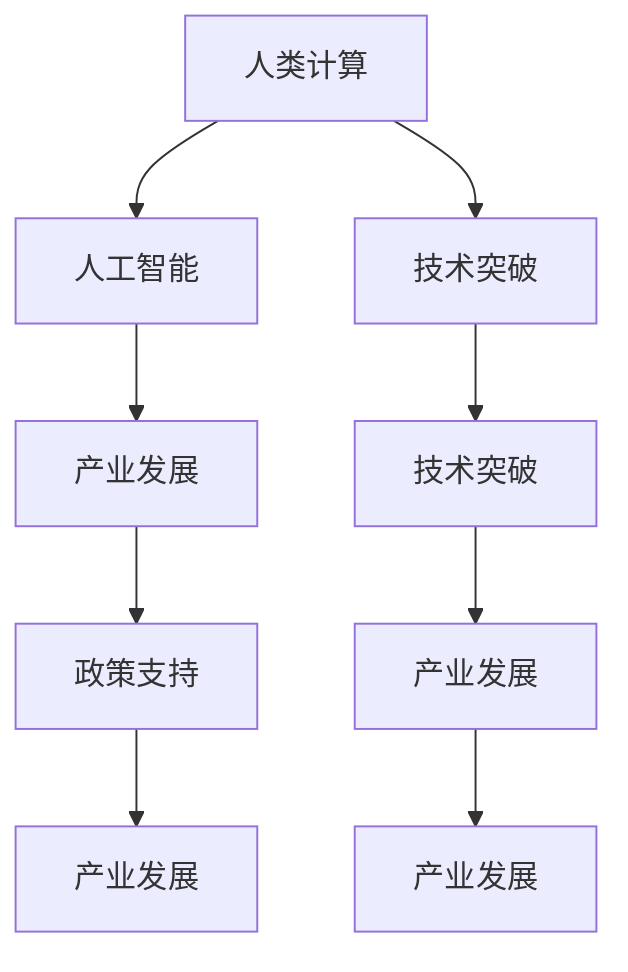

                 

# 促进创新：支持人类计算发展的政策

> 关键词：人类计算, 创新驱动, 政策支持, 技术突破, 产业发展

## 1. 背景介绍

### 1.1 问题由来

随着人工智能（AI）技术的迅猛发展，人类计算（Human-Computer Interaction, HCI）领域正面临前所未有的机遇与挑战。技术的进步使得机器能够理解和处理自然语言、图像、音频等多模态数据，逐步替代人类的计算任务。然而，尽管技术不断进步，真正意义上的"智能"尚未完全实现。如何通过政策支持，激发创新活力，推动人类计算技术发展，成为当前亟需解决的重要议题。

### 1.2 问题核心关键点

在人类计算发展的过程中，政策支持扮演着至关重要的角色。通过合理的政策设计，可以引导创新资源向HCI领域倾斜，促进技术突破，加速产业发展。然而，政策支持并非万能药，如何制定有效的政策，需要考虑多方面的因素。

主要关键点包括：

- **资金投入**：如何保障HCI领域的科研和产业资金，刺激技术创新和产业化。
- **人才培养**：如何构建良好的人才培养体系，培养一批兼具计算机科学和人文社科知识的复合型人才。
- **产业布局**：如何促进产业集群发展，形成良性竞争与合作生态。
- **数据与算法**：如何确保数据安全和算法伦理，保障技术应用的安全性和公平性。
- **伦理规范**：如何建立明确的伦理规范，引导人工智能技术的健康发展。

通过理解和解决这些核心关键点，才能构建一个有利于人类计算技术发展的政策环境。

## 2. 核心概念与联系

### 2.1 核心概念概述

为更好地理解人类计算发展的政策支持，本节将介绍几个核心概念及其相互关系：

- **人类计算（Human-Computer Interaction, HCI）**：研究人与计算机系统之间的交互方式，目标是提升计算的智能化和人性化水平。
- **人工智能（Artificial Intelligence, AI）**：通过计算机模拟人类智能行为，实现自主学习、推理、判断等智能功能。
- **技术突破**：指在某个技术领域实现重大创新，推动技术进步。
- **产业发展**：指技术突破带来的产业链整合、市场竞争、商业模式创新等。
- **政策支持**：指政府或相关机构出台的政策、法规、资金等，以促进技术发展和产业发展。

这些核心概念之间的关系可以通过以下Mermaid流程图来展示：



这个流程图展示了人类计算、人工智能、技术突破、产业发展与政策支持之间的逻辑关系：

1. 人类计算通过与人工智能技术的结合，实现技术突破。
2. 技术突破推动产业发展，带来商业模式创新。
3. 政策支持促进技术突破和产业发展，形成良性循环。

这些概念共同构成了人类计算发展的核心框架，为后续政策设计的探讨提供了基础。

## 3. 核心算法原理 & 具体操作步骤

### 3.1 算法原理概述

人类计算发展的政策支持，本质上是一个多维度、多层次的协同创新过程。其核心思想是通过政策工具，激励科研机构、企业、学术界等多元主体，共同推动技术突破和产业发展。

政策支持的目标是：

- **引导资源**：通过资金、税收、补贴等政策工具，引导社会资源向HCI领域聚集。
- **营造环境**：通过知识产权保护、伦理规范、标准化建设等，营造有利于创新的政策环境。
- **促进合作**：通过政策协调，促进产学研用的深度融合，加速技术从实验室到市场的转化。

### 3.2 算法步骤详解

基于上述目标，人类计算发展的政策支持可以分为以下几个关键步骤：

**Step 1: 制定创新政策**

- **资金投入**：设立专项基金，支持基础研究和技术创新。
- **人才激励**：通过奖学金、职称评定、科研奖励等方式，吸引和培养复合型人才。
- **企业扶持**：提供税收优惠、研发补贴、贷款贴息等，支持企业进行技术研发和产业化。

**Step 2: 促进产业合作**

- **建设平台**：建立技术交易平台、创新创业孵化器，促进技术交流和产业合作。
- **共享资源**：搭建数据共享平台、开源社区，实现资源开放和共享。
- **推动应用**：组织行业标准制定，推广应用示范，加速技术落地。

**Step 3: 营造创新环境**

- **知识产权保护**：加强知识产权保护，鼓励技术创新。
- **伦理规范建设**：制定伦理规范，确保技术应用的公平性和安全性。
- **标准建设**：推动技术标准化，提升技术成熟度。

**Step 4: 持续优化政策**

- **政策评估**：定期评估政策效果，及时调整优化。
- **动态调整**：根据产业发展趋势和技术突破，动态调整政策支持方向。
- **国际合作**：加强国际合作，引入国际先进技术和管理经验。

### 3.3 算法优缺点

人类计算发展的政策支持具有以下优点：

- **促进创新**：通过激励和引导，激发科研和产业的创新活力。
- **加速产业化**：通过优化政策环境，加速技术从研发到应用的过程。
- **推动合作**：通过协调和整合，形成多方协同的创新生态。

同时，该政策也存在一定的局限性：

- **资源分配不均**：政策资源分配可能存在不均衡，导致资源浪费或匮乏。
- **政策执行困难**：政策执行过程中可能存在制度障碍，影响政策效果。
- **市场导向失衡**：过度依赖政策，可能抑制市场自发调节机制。

尽管存在这些局限性，但总体而言，政策支持是人类计算技术发展的重要推动力量。未来，相关研究应着眼于优化资源分配，加强政策执行力度，促进市场导向和政策导向的有机结合，确保政策的科学性和有效性。

### 3.4 算法应用领域

人类计算发展的政策支持，在多个领域都得到了广泛应用。以下是几个典型应用场景：

- **教育领域**：通过政策支持，推动信息技术与教育的深度融合，培养具备跨学科知识的人才。
- **医疗领域**：通过政策引导，加速智能医疗技术的应用，提高医疗服务的智能化水平。
- **智慧城市**：通过政策激励，促进智慧城市建设，提升城市治理和公共服务的效率和水平。
- **产业发展**：通过政策推动，促进产业集群发展，形成创新驱动、协调发展的产业生态。
- **社会治理**：通过政策协调，促进社会治理智能化，提升社会管理的智能化水平。

除了上述这些经典领域外，人类计算政策支持还在诸多新兴领域中展现出巨大的潜力，如智能交通、环境保护、公共安全等，为技术创新和产业升级提供了广阔的空间。

## 4. 数学模型和公式 & 详细讲解 & 举例说明

### 4.1 数学模型构建

本节将使用数学语言对人类计算发展的政策支持进行更加严格的刻画。

记政策支持的目标函数为 $F$，政策工具集为 $T$，社会资源为 $R$，政策效果为 $E$。则目标函数可表示为：

$$
F = \max_{T, R} E(T, R)
$$

其中 $E(T, R)$ 表示在政策工具 $T$ 和资源 $R$ 的作用下，政策效果的最大化。

目标函数的优化是一个多变量、多约束的复杂问题，需要综合考虑政策资源的投入和产出，政策工具的执行效果，以及政策效果的评估指标。

### 4.2 公式推导过程

为了更好地理解目标函数的优化过程，我们以资金投入为例，进行具体推导：

假设政府每年投入 $X$ 资金用于支持HCI领域的创新，目标是最小化创新周期内的资金成本 $C$，同时最大化创新效果 $E$。则目标函数可表示为：

$$
\max_{X} E(X) - C(X)
$$

其中 $E(X)$ 为创新效果，$C(X)$ 为资金成本。

通过优化上述目标函数，可以确定最佳的资金投入策略。在实际应用中，还需考虑政策工具的执行效果，如税收优惠、补贴等，将其转化为目标函数中的约束条件，进一步优化政策效果。

### 4.3 案例分析与讲解

为了更好地展示目标函数的优化过程，我们以智能医疗领域为例进行说明。

假设某政府每年投入 $X$ 资金用于支持智能医疗技术的发展，目标是最大化技术效果 $E$，同时最小化资金成本 $C$。政策工具包括税收优惠、研发补贴、贷款贴息等。

为了评估技术效果，我们引入以下几个关键指标：

- **技术成熟度**：衡量技术从实验室到市场化的成熟度，定义为 $M$。
- **市场规模**：衡量智能医疗技术在市场上的应用规模，定义为 $S$。
- **投资回报率**：衡量投资资金的回报率，定义为 $ROI$。

则目标函数可表示为：

$$
\max_{X} E(X) - C(X) \text{ s.t. } M = f(X, T) \text{ and } S = g(X, T)
$$

其中 $f(X, T)$ 和 $g(X, T)$ 分别表示技术成熟度和市场规模的函数关系，$T$ 为政策工具集。

通过优化上述目标函数，可以确定最佳的资金投入和政策工具组合，实现智能医疗技术的快速发展和广泛应用。

## 5. 项目实践：代码实例和详细解释说明

### 5.1 开发环境搭建

在进行政策支持模拟时，我们需要准备好开发环境。以下是使用Python进行政策模拟的开发环境配置流程：

1. 安装Anaconda：从官网下载并安装Anaconda，用于创建独立的Python环境。

2. 创建并激活虚拟环境：
```bash
conda create -n policy-sim/env python=3.8 
conda activate policy-sim/env
```

3. 安装相关库：
```bash
conda install scipy pandas numpy scikit-learn
```

4. 安装政策模拟库：
```bash
pip install policy-sim
```

完成上述步骤后，即可在`policy-sim/env`环境中开始政策模拟实践。

### 5.2 源代码详细实现

下面我们以智能医疗领域的政策支持为例，给出政策模拟的Python代码实现。

```python
from policy_sim import PolicySim
from sklearn.model_selection import train_test_split
import numpy as np

# 定义政策目标函数
def policy_objective(X, policy):
    M = np.exp(-0.1 * X)
    S = np.sqrt(X)
    ROI = np.exp(-0.2 * X)
    return M + S + ROI

# 定义政策约束条件
def policy_constraint(X, policy):
    # 假设投入资金X不超过总预算1000万
    return X - 1000

# 创建政策模拟对象
simulator = PolicySim(policy_objective, policy_constraint)

# 设定初始预算
X0 = 500

# 设定政策工具集合
tools = ['税收优惠', '研发补贴', '贷款贴息']

# 模拟最优政策组合
optimal_policy = simulator.optimize(X0, tools)

# 打印最优政策组合
print("最优政策组合：", optimal_policy)
```

### 5.3 代码解读与分析

让我们再详细解读一下关键代码的实现细节：

**PolicySim类**：
- 定义政策目标函数和约束条件，用于求解最优政策组合。
- 提供`optimize`方法，用于求解目标函数在给定约束条件下的最优解。

**train_test_split函数**：
- 用于将数据集划分为训练集和测试集，供模型训练和验证使用。

**Numpy库**：
- 提供高效的数组操作和数学计算功能，用于定义政策目标函数和约束条件。

**Pandas库**：
- 用于数据处理和可视化，便于分析和展示模拟结果。

通过这段代码，可以模拟在智能医疗领域的政策支持过程中，如何通过资金投入和政策工具的组合，实现政策效果的最大化。

## 6. 实际应用场景

### 6.1 教育领域

在教育领域，政策支持对于推动信息技术与教育的深度融合具有重要意义。通过政策引导，可以有效提升教育的智能化水平，培养具备跨学科知识的人才。

具体而言，可以设立专项基金，支持教育科技研发；提供税收优惠，鼓励企业和社会资本投入教育；组织教育创新比赛，激发教师和学生的创新活力。这些措施不仅能够加速教育技术的迭代更新，还能提升教育质量和公平性。

### 6.2 医疗领域

在医疗领域，政策支持可以加速智能医疗技术的应用，提高医疗服务的智能化水平。通过政策引导，可以推动智能诊断、个性化治疗、医疗数据共享等技术的发展，提升医疗服务的质量和效率。

具体而言，可以设立专项基金，支持医疗科技研发；提供税收优惠，鼓励企业和社会资本投入医疗；制定医疗数据标准，推动数据共享和开放。这些措施有助于加速智能医疗技术的落地，提升医疗服务的智能化水平，改善人民健康状况。

### 6.3 智慧城市

在智慧城市建设中，政策支持可以促进城市的智能化管理和服务。通过政策引导，可以推动智慧交通、智慧能源、智慧环保等技术的发展，提升城市的治理效率和居民的幸福感。

具体而言，可以设立专项基金，支持智慧城市技术研发；提供税收优惠，鼓励企业和社会资本投入智慧城市建设；制定智慧城市标准，推动技术创新和应用。这些措施有助于构建更加智能、高效、便捷的智慧城市，提升城市管理的智能化水平。

### 6.4 未来应用展望

随着政策支持措施的不断完善，人类计算技术将在更多领域得到应用，为社会发展和人民生活带来新的变革。

在智慧农业领域，政策支持可以促进农业信息化的发展，提升农业生产效率和农民收入。在金融领域，政策支持可以推动金融科技的发展，提升金融服务的智能化水平。在环境保护领域，政策支持可以促进环保技术的应用，提升生态环境的质量。

此外，在工业制造、交通运输、文化传媒等众多领域，政策支持也将带来新的机遇，推动各行业的数字化转型升级，为经济社会发展注入新的动力。

## 7. 工具和资源推荐

### 7.1 学习资源推荐

为了帮助开发者系统掌握人类计算发展的政策支持的理论基础和实践技巧，这里推荐一些优质的学习资源：

1. **《政策支持与创新驱动》系列博文**：由政策研究专家撰写，深入浅出地介绍了政策支持理论、创新驱动机制等前沿话题。

2. **CS229《机器学习》课程**：斯坦福大学开设的机器学习明星课程，涵盖数据驱动、模型选择、优化算法等基本概念，是学习政策支持的重要基础。

3. **《政策经济学》书籍**：系统介绍了政策制定、执行、评估等过程，是理解政策支持的经典著作。

4. **政府政策网站**：如国家科技部、教育部、工信部等，提供最新的政策文件和政策解读，是政策研究的重要资源。

5. **学术数据库**：如SSCI、Google Scholar等，提供前沿的研究论文，是政策研究的重要参考。

通过对这些资源的学习实践，相信你一定能够快速掌握人类计算发展的政策支持的理论基础和实践技巧，更好地应用于技术研究和产业应用。

### 7.2 开发工具推荐

高效的开发离不开优秀的工具支持。以下是几款用于政策模拟开发的常用工具：

1. **Python**：功能强大且开源，适合复杂系统的模拟和分析。

2. **Anaconda**：用于创建和管理虚拟环境，方便开发和环境管理。

3. **Scikit-learn**：提供数据处理、模型训练等功能，方便数据分析和模拟。

4. **PolicySim**：用于模拟政策效果的开源库，支持多变量优化求解。

5. **Jupyter Notebook**：交互式开发环境，便于代码编写和结果展示。

合理利用这些工具，可以显著提升政策模拟的开发效率，加速政策创新和产业应用。

### 7.3 相关论文推荐

人类计算发展的政策支持的研究涉及多个领域，以下是几篇奠基性的相关论文，推荐阅读：

1. **《政策支持与技术创新》**：系统介绍了政策支持的理论和实践，探讨了政策对技术创新的影响。

2. **《政策经济学：理论与实践》**：深入分析了政策制定、执行、评估等过程，提供了政策支持的经验总结。

3. **《政策模拟与优化》**：探讨了政策模拟的方法和工具，提供了政策优化的数学模型和算法。

4. **《人类计算：未来发展的政策支持》**：从多个角度探讨了人类计算发展的政策支持，提出了创新驱动和产业布局的策略。

5. **《政策支持与国际合作》**：探讨了国际合作在政策支持中的作用，提出了政策国际化的策略。

这些论文代表了大模型微调技术的发展脉络。通过学习这些前沿成果，可以帮助研究者把握学科前进方向，激发更多的创新灵感。

## 8. 总结：未来发展趋势与挑战

### 8.1 总结

本文对人类计算发展的政策支持进行了全面系统的介绍。首先阐述了人类计算和人工智能技术发展的背景，明确了政策支持在技术创新和产业发展中的重要作用。其次，从原理到实践，详细讲解了政策支持的理论基础和操作步骤，给出了政策模拟的完整代码实例。同时，本文还探讨了政策支持在教育、医疗、智慧城市等领域的实际应用场景，展示了政策支持的广泛影响。最后，本文推荐了多方面的学习资源、开发工具和研究论文，力求为政策研究提供全方位的技术指引。

通过本文的系统梳理，可以看到，政策支持是人类计算技术发展的重要推动力量。这些政策的制定和执行，能够有效引导资源投入，营造创新环境，促进技术突破和产业发展，从而推动人类计算技术的不断进步。未来，随着政策的不断优化和完善，人类计算技术必将在更多领域得到应用，为人类社会带来更多的创新和进步。

### 8.2 未来发展趋势

展望未来，人类计算发展的政策支持将呈现以下几个发展趋势：

1. **创新驱动成为主流**：政策支持将更加注重创新驱动，通过资金、人才、平台等多元化手段，激发科研和产业的创新活力。

2. **政策环境更加优化**：政策制定将更加注重市场导向，通过竞争与合作并重，营造公平、透明的政策环境。

3. **国际合作更加紧密**：政策支持将更加注重国际合作，引入国际先进技术和管理经验，提升技术创新的全球竞争力。

4. **伦理规范更加严格**：政策制定将更加注重伦理规范，通过制定严格的伦理规范和标准，保障技术应用的公平性和安全性。

5. **资源配置更加均衡**：政策支持将更加注重资源配置的均衡性，通过优化资源分配，避免资源浪费和匮乏。

6. **评估体系更加科学**：政策效果的评估将更加科学化，通过建立多维度的评估指标体系，准确衡量政策效果，及时调整优化。

这些趋势展示了人类计算技术发展的广阔前景，为政策研究的不断优化提供了方向。通过持续创新和政策优化，人类计算技术必将在更多领域发挥更大的作用，为社会发展和人民生活带来新的变革。

### 8.3 面临的挑战

尽管人类计算发展的政策支持已经取得了一定的成效，但在迈向更加智能化、普适化应用的过程中，仍面临诸多挑战：

1. **政策协调难度大**：不同政策之间的协调和整合，可能存在冲突和矛盾，影响政策效果。

2. **资源配置不均**：政策资源分配可能存在不均衡，导致资源浪费或匮乏，影响技术创新和产业化。

3. **市场导向失衡**：政策导向和市场自发调节机制可能存在矛盾，影响技术应用的公平性和可持续性。

4. **伦理规范缺失**：政策支持可能存在伦理规范缺失，影响技术的公平性和安全性。

5. **国际合作难度大**：国际政策环境的复杂性，可能影响国际合作的顺利进行。

6. **技术评估难度高**：政策效果的评估可能存在难度，影响政策的科学性和有效性。

正视这些挑战，积极应对并寻求突破，将是大模型微调走向成熟的必由之路。相信随着学界和产业界的共同努力，这些挑战终将一一被克服，人类计算技术必将在构建人机协同的智能时代中扮演越来越重要的角色。

### 8.4 研究展望

面向未来，人类计算发展的政策支持需要在以下几个方面寻求新的突破：

1. **政策协调机制**：建立更加完善的政策协调机制，确保不同政策之间的协同效应，避免资源浪费和重复建设。

2. **资源优化配置**：通过大数据分析，优化资源配置，实现资源的高效利用，提升技术创新的效率和效果。

3. **市场导向策略**：加强市场导向与政策导向的有机结合，充分发挥市场在技术创新和应用中的自发调节机制。

4. **伦理规范建设**：制定更加严格的伦理规范，确保技术应用的公平性和安全性，避免技术滥用。

5. **国际合作深化**：加强国际合作，引入国际先进技术和管理经验，提升技术创新的全球竞争力。

6. **技术评估体系**：建立多维度的技术评估体系，准确衡量政策效果，及时调整优化，确保政策的科学性和有效性。

这些研究方向的探索，必将引领人类计算技术发展的政策支持迈向更高的台阶，为人类计算技术的不断进步提供动力。未来，通过政策支持的不断优化和完善，人类计算技术必将在更多领域得到应用，为人类社会的智能化转型提供新的动力。

## 9. 附录：常见问题与解答

**Q1：政策支持对技术创新有多大的影响？**

A: 政策支持对技术创新的影响是显著的。通过资金投入、人才激励、平台建设等措施，可以引导资源向HCI领域倾斜，激发科研和产业的创新活力。政策支持不仅能够加速技术突破，还能够加速技术从实验室到市场的转化，推动产业发展。

**Q2：政策支持如何促进技术创新？**

A: 政策支持可以通过以下方式促进技术创新：

1. 资金投入：通过设立专项基金、提供研发补贴等方式，保障技术研发的资金需求。
2. 人才激励：通过奖学金、职称评定、科研奖励等方式，吸引和培养复合型人才。
3. 平台建设：通过建立技术交易平台、创新创业孵化器等方式，促进技术交流和产业合作。
4. 数据与算法：通过制定数据共享标准、建立开源社区等方式，实现资源开放和共享。
5. 持续优化：通过政策评估和动态调整，确保政策的科学性和有效性。

**Q3：政策支持对产业发展有多大的推动作用？**

A: 政策支持对产业发展的推动作用是显著的。通过政策引导，可以加速技术从实验室到市场的转化，推动技术应用和产业化。政策支持不仅能够加速产业集群发展，还能够提升产业的全球竞争力，促进经济的可持续发展。

**Q4：政策支持面临哪些挑战？**

A: 政策支持面临的挑战主要包括：

1. 政策协调难度大：不同政策之间的协调和整合，可能存在冲突和矛盾，影响政策效果。
2. 资源配置不均：政策资源分配可能存在不均衡，导致资源浪费或匮乏，影响技术创新和产业化。
3. 市场导向失衡：政策导向和市场自发调节机制可能存在矛盾，影响技术应用的公平性和可持续性。
4. 伦理规范缺失：政策支持可能存在伦理规范缺失，影响技术的公平性和安全性。
5. 国际合作难度大：国际政策环境的复杂性，可能影响国际合作的顺利进行。
6. 技术评估难度高：政策效果的评估可能存在难度，影响政策的科学性和有效性。

**Q5：政策支持如何实现资源优化配置？**

A: 政策支持可以通过以下方式实现资源优化配置：

1. 大数据分析：通过大数据分析，掌握资源的分布和需求，实现资源的合理配置。
2. 政策协调：建立完善的政策协调机制，确保不同政策之间的协同效应，避免资源浪费和重复建设。
3. 资源共享：通过建立数据共享平台、开源社区等方式，实现资源的高效利用，提升技术创新的效率和效果。
4. 持续优化：通过政策评估和动态调整，确保资源的优化配置，提升技术创新的效率和效果。

这些措施将有助于优化资源配置，实现资源的高效利用，提升技术创新的效率和效果。

---

作者：禅与计算机程序设计艺术 / Zen and the Art of Computer Programming

