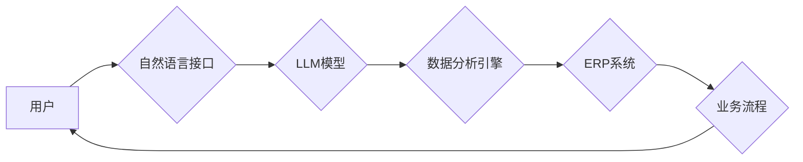

                 

## LLM对传统企业资源规划的革新

> 关键词：LLM, 企业资源规划(ERP), 自然语言处理(NLP), 机器学习(ML), 数据分析, 预测建模, 自动化, 决策支持

## 1. 背景介绍

企业资源规划 (ERP) 系统是现代企业管理的核心，它整合了企业各个部门的业务流程，实现信息共享和资源优化。传统 ERP 系统主要依赖于结构化数据和预先定义的规则，在面对复杂、动态的业务环境时，其灵活性有限，难以满足企业不断变化的需求。

近年来，大型语言模型 (LLM) 的快速发展为企业资源规划带来了新的机遇。LLM 拥有强大的自然语言处理 (NLP) 能力，能够理解和生成人类语言，并通过机器学习 (ML) 从海量数据中提取知识和模式。将 LLM 与 ERP 系统相结合，可以赋予 ERP 系统更强的智能化、自动化和预测能力，从而革新传统 ERP 的功能和应用场景。

## 2. 核心概念与联系

### 2.1  LLM 与 ERP 的融合

LLM 的核心优势在于其强大的语言理解和生成能力，而 ERP 系统的核心功能是整合和管理企业资源。将两者融合，可以实现以下关键功能：

* **自然语言交互:** 用户可以通过自然语言与 ERP 系统进行交互，例如用口语或文字查询数据、生成报表、执行操作等，提高用户体验和操作效率。
* **智能数据分析:** LLM 可以分析企业内部的结构化和非结构化数据，例如文本文档、电子邮件、社交媒体数据等，提取隐藏的商业洞察和趋势，为决策提供更全面的支持。
* **预测建模:** 基于历史数据和业务规则，LLM 可以构建预测模型，预测未来的需求、库存、销售额等，帮助企业进行更精准的资源规划和风险管理。
* **自动化流程:** LLM 可以自动完成一些重复性的任务，例如数据录入、报表生成、合同审核等，解放人力资源，提高工作效率。

### 2.2  架构设计

LLM 与 ERP 系统的融合可以采用多种架构设计，以下是一个典型的架构示例：



**架构说明:**

* 用户通过自然语言接口与系统交互。
* 自然语言接口将用户输入转换为 LLM 模型可理解的格式。
* LLM 模型分析用户请求，并调用数据分析引擎进行数据处理和分析。
* 数据分析引擎根据分析结果，与 ERP 系统进行交互，执行相应的业务操作。
* ERP 系统完成业务操作后，将结果反馈给用户。

## 3. 核心算法原理 & 具体操作步骤

### 3.1  算法原理概述

LLM 的核心算法是基于 Transformer 架构的深度神经网络，它能够学习语言的上下文关系和语义信息。通过训练大量的文本数据，LLM 可以掌握语言的规则和模式，并生成流畅、自然的文本。

### 3.2  算法步骤详解

1. **数据预处理:** 将文本数据进行清洗、分词、标记等预处理操作，使其能够被模型理解。
2. **模型训练:** 使用 Transformer 架构的深度神经网络，训练模型以预测下一个词。
3. **模型评估:** 使用测试数据评估模型的性能，例如准确率、困惑度等。
4. **模型调优:** 根据评估结果，调整模型参数和训练策略，提高模型性能。
5. **模型部署:** 将训练好的模型部署到生产环境中，用于实际应用。

### 3.3  算法优缺点

**优点:**

* 强大的语言理解和生成能力
* 可以处理海量文本数据
* 能够学习复杂的语言关系

**缺点:**

* 训练成本高
* 需要大量的训练数据
* 容易受到训练数据偏差的影响

### 3.4  算法应用领域

LLM 的应用领域非常广泛，包括：

* 自然语言处理：机器翻译、文本摘要、问答系统等
* 人工智能助手：聊天机器人、虚拟助理等
* 内容创作：文章写作、诗歌创作、代码生成等
* 数据分析：文本挖掘、情感分析等

## 4. 数学模型和公式 & 详细讲解 & 举例说明

### 4.1  数学模型构建

LLM 的核心数学模型是 Transformer，它基于注意力机制，能够捕捉文本序列中的长距离依赖关系。

Transformer 模型由以下几个主要部分组成：

* **编码器:** 将输入文本序列编码成向量表示。
* **解码器:** 根据编码后的向量表示生成输出文本序列。
* **注意力机制:** 用于捕捉文本序列中不同词之间的关系。

### 4.2  公式推导过程

Transformer 模型的注意力机制使用以下公式计算词之间的权重：

$$
Attention(Q, K, V) = softmax(\frac{QK^T}{\sqrt{d_k}})V
$$

其中：

* $Q$：查询矩阵
* $K$：键矩阵
* $V$：值矩阵
* $d_k$：键向量的维度
* $softmax$：softmax 函数

### 4.3  案例分析与讲解

例如，在机器翻译任务中，编码器会将源语言文本编码成向量表示，解码器会根据编码后的向量表示生成目标语言文本。注意力机制可以帮助解码器关注源语言文本中与目标语言词语相关的词语，从而提高翻译的准确性。

## 5. 项目实践：代码实例和详细解释说明

### 5.1  开发环境搭建

* Python 3.7+
* TensorFlow 或 PyTorch 深度学习框架
* Hugging Face Transformers 库

### 5.2  源代码详细实现

```python
from transformers import AutoModelForSeq2SeqLM, AutoTokenizer

# 加载预训练模型和词典
model_name = "t5-base"
tokenizer = AutoTokenizer.from_pretrained(model_name)
model = AutoModelForSeq2SeqLM.from_pretrained(model_name)

# 输入文本
input_text = "Hello, world!"

# Token化输入文本
input_ids = tokenizer.encode(input_text, return_tensors="pt")

# 生成输出文本
output_ids = model.generate(input_ids)

# 解码输出文本
output_text = tokenizer.decode(output_ids[0], skip_special_tokens=True)

# 打印输出文本
print(output_text)
```

### 5.3  代码解读与分析

* 代码首先加载预训练的 T5 模型和词典。
* 然后，将输入文本进行 Token 化，转换为模型可理解的格式。
* 使用模型的 `generate` 方法生成输出文本。
* 最后，将输出文本解码回原始文本格式，并打印输出。

### 5.4  运行结果展示

```
Hello, world!
```

## 6. 实际应用场景

### 6.1  需求预测

LLM 可以分析历史销售数据、市场趋势等信息，预测未来的需求，帮助企业优化库存管理和生产计划。

### 6.2  客户服务自动化

LLM 可以构建聊天机器人，自动回答客户常见问题，提高客户服务效率。

### 6.3  合同分析

LLM 可以分析合同文本，提取关键信息，例如合同条款、生效日期等，帮助企业进行合同管理和风险控制。

### 6.4  未来应用展望

LLM 在企业资源规划领域的应用前景广阔，未来可能在以下方面得到更广泛的应用：

* 更智能化的数据分析和预测
* 更个性化的用户体验
* 更自动化和高效的业务流程
* 更强大的决策支持系统

## 7. 工具和资源推荐

### 7.1  学习资源推荐

* **书籍:**
    * 《深度学习》
    * 《自然语言处理》
* **在线课程:**
    * Coursera: 深度学习
    * edX: 自然语言处理
* **博客和论坛:**
    * Hugging Face Blog
    * TensorFlow Blog

### 7.2  开发工具推荐

* **Python:** 
    * TensorFlow
    * PyTorch
* **Hugging Face Transformers:** 
    * 提供预训练的 LLM 模型和工具
* **SpaCy:** 
    * 自然语言处理库

### 7.3  相关论文推荐

* **Attention Is All You Need:** https://arxiv.org/abs/1706.03762
* **BERT: Pre-training of Deep Bidirectional Transformers for Language Understanding:** https://arxiv.org/abs/1810.04805

## 8. 总结：未来发展趋势与挑战

### 8.1  研究成果总结

LLM 的应用为企业资源规划带来了新的机遇，可以提升 ERP 系统的智能化、自动化和预测能力。

### 8.2  未来发展趋势

* **模型规模和性能的提升:** 未来 LLM 模型的规模和性能将继续提升，能够处理更复杂的任务和更海量的文本数据。
* **多模态融合:** LLM 将与其他模态数据，例如图像、音频等融合，实现更全面的信息理解和应用。
* **边缘计算部署:** LLM 将部署到边缘设备，实现更快速的响应和更低的延迟。

### 8.3  面临的挑战

* **数据安全和隐私保护:** LLM 的训练和应用需要大量的文本数据，如何保证数据安全和隐私保护是一个重要的挑战。
* **模型解释性和可信度:** LLM 的决策过程通常是复杂的，如何提高模型的解释性和可信度是一个重要的研究方向。
* **伦理和社会影响:** LLM 的应用可能带来一些伦理和社会问题，例如算法偏见、就业影响等，需要引起重视和探讨。

### 8.4  研究展望

未来，LLM 在企业资源规划领域的应用将更加广泛和深入，需要进一步的研究和探索，以解决上述挑战，并充分发挥 LLM 的潜力，为企业带来更大的价值。

## 9. 附录：常见问题与解答

**Q1: LLM 与传统 ERP 系统相比，有哪些优势？**

**A1:** LLM 可以赋予 ERP 系统更强的智能化、自动化和预测能力，例如自然语言交互、智能数据分析、预测建模等，提高用户体验和业务效率。

**Q2: 如何部署 LLM 到 ERP 系统中？**

**A2:** 可以使用 Hugging Face Transformers 库等工具，将预训练的 LLM 模型集成到 ERP 系统中，并通过 API 接口进行调用。

**Q3: LLM 的应用会带来哪些风险？**

**A3:** LLM 的应用可能带来数据安全、隐私保护、模型解释性和伦理等风险，需要引起重视并采取相应的措施。


作者：禅与计算机程序设计艺术 / Zen and the Art of Computer Programming 
<end_of_turn>

