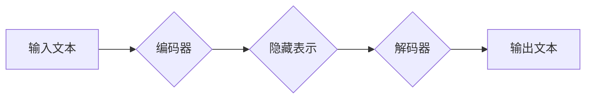

                 

## Python、C和CUDA实现AI：从零开始的LLM之旅

> 关键词：LLM, 大语言模型, Python, C, CUDA, 深度学习, 自然语言处理

## 1. 背景介绍

近年来，深度学习技术取得了飞速发展，特别是大语言模型（LLM）的出现，彻底改变了我们与人工智能的交互方式。LLM 能够理解和生成人类语言，在文本生成、翻译、问答、代码生成等领域展现出强大的能力。然而，训练和部署大型语言模型需要大量的计算资源和专业知识。本文将带领读者从零开始，使用 Python、C 和 CUDA 技术，构建自己的 LLM，深入了解其工作原理和实现细节。

## 2. 核心概念与联系

### 2.1  LLM 的基本概念

大语言模型 (LLM) 是一种基于深度学习的强大人工智能模型，能够理解和生成人类语言。它们通过训练大量的文本数据，学习语言的语法、语义和上下文关系，从而实现各种自然语言处理 (NLP) 任务。

### 2.2  LLM 的架构

LLM 通常基于 Transformer 架构，该架构能够有效地处理序列数据，并捕捉长距离依赖关系。Transformer 由编码器和解码器组成，编码器负责将输入文本转换为隐藏表示，解码器则根据隐藏表示生成输出文本。

**Mermaid 流程图:**



### 2.3  Python、C 和 CUDA 的关系

Python 是一个流行的编程语言，在机器学习和深度学习领域广泛使用。它拥有丰富的库和框架，例如 TensorFlow 和 PyTorch，可以简化模型开发和训练过程。C 是一种性能优异的编程语言，可以用于实现模型的底层计算，提高运行效率。CUDA 是 NVIDIA 开发的并行计算平台，可以利用 GPU 的强大计算能力加速模型训练和推理。

## 3. 核心算法原理 & 具体操作步骤

### 3.1  算法原理概述

LLM 的核心算法是基于 Transformer 架构的注意力机制。注意力机制能够学习文本中不同词语之间的关系，并赋予重要词语更高的权重，从而更好地理解文本语义。

### 3.2  算法步骤详解

1. **词嵌入:** 将输入文本中的每个词语转换为稠密的向量表示，称为词嵌入。
2. **编码器:** 将词嵌入输入到编码器中，编码器通过多层 Transformer 块，学习文本的隐藏表示。
3. **解码器:** 将编码器的输出作为输入，解码器通过多层 Transformer 块，生成输出文本。
4. **损失函数:** 使用交叉熵损失函数，计算模型预测结果与真实结果之间的差异。
5. **反向传播:** 使用梯度下降算法，更新模型参数，降低损失函数值。

### 3.3  算法优缺点

**优点:**

* 能够捕捉长距离依赖关系，理解复杂的文本语义。
* 在各种 NLP 任务中表现出色，例如文本生成、翻译、问答。

**缺点:**

* 训练成本高，需要大量的计算资源和时间。
* 模型参数量大，部署成本较高。
* 容易受到训练数据偏差的影响。

### 3.4  算法应用领域

LLM 在以下领域具有广泛的应用前景:

* **自然语言处理:** 文本生成、翻译、问答、文本摘要、情感分析等。
* **人工智能助手:** 聊天机器人、虚拟助理、智能客服等。
* **代码生成:** 自动生成代码、代码补全、代码翻译等。
* **教育:** 智能辅导、个性化学习、自动批改作业等。

## 4. 数学模型和公式 & 详细讲解 & 举例说明

### 4.1  数学模型构建

LLM 的数学模型主要基于 Transformer 架构，其核心是注意力机制。注意力机制通过计算词语之间的相关性，赋予重要词语更高的权重，从而更好地理解文本语义。

### 4.2  公式推导过程

**注意力机制公式:**

$$
\text{Attention}(Q, K, V) = \text{softmax}\left(\frac{Q K^T}{\sqrt{d_k}}\right) V
$$

其中:

* $Q$：查询矩阵
* $K$：键矩阵
* $V$：值矩阵
* $d_k$：键向量的维度
* $\text{softmax}$：softmax 函数

**解释:**

1. 计算查询矩阵 $Q$ 与键矩阵 $K$ 的点积，并除以 $\sqrt{d_k}$。
2. 应用 softmax 函数，将点积结果转换为概率分布。
3. 将概率分布与值矩阵 $V$ 进行加权求和，得到最终的注意力输出。

### 4.3  案例分析与讲解

假设我们有一个句子 "The cat sat on the mat"，我们想要计算 "sat" 这个词语与其他词语之间的注意力权重。

1. 将每个词语转换为词嵌入向量。
2. 将词嵌入向量作为查询矩阵 $Q$、键矩阵 $K$ 和值矩阵 $V$ 的输入。
3. 计算注意力机制，得到 "sat" 这个词语与其他词语之间的注意力权重。

例如，"sat" 与 "cat" 的注意力权重可能较高，因为它们在语义上相关。

## 5. 项目实践：代码实例和详细解释说明

### 5.1  开发环境搭建

1. 安装 Python 3.x 及相关库 (例如 TensorFlow 或 PyTorch)。
2. 安装 CUDA Toolkit 和 cuDNN。
3. 设置开发环境变量，指向 CUDA 安装路径。

### 5.2  源代码详细实现

以下是一个简单的 LLM 代码示例，使用 TensorFlow 框架实现注意力机制：

```python
import tensorflow as tf

# 定义注意力机制
def attention_mechanism(query, key, value, mask=None):
    # 计算点积
    scores = tf.matmul(query, key, transpose_b=True)
    # 应用 softmax 函数
    attention_weights = tf.nn.softmax(scores, axis=-1)
    # 加权求和
    output = tf.matmul(attention_weights, value)
    return output

# 定义输入数据
query = tf.random.normal([1, 3, 64])
key = tf.random.normal([1, 3, 64])
value = tf.random.normal([1, 3, 64])

# 计算注意力输出
output = attention_mechanism(query, key, value)

# 打印输出
print(output)
```

### 5.3  代码解读与分析

1. `attention_mechanism` 函数实现注意力机制的核心逻辑。
2. `query`, `key`, `value` 分别代表查询矩阵、键矩阵和值矩阵。
3. `scores` 计算查询矩阵与键矩阵的点积。
4. `attention_weights` 应用 softmax 函数，将点积结果转换为概率分布。
5. `output` 通过加权求和，得到最终的注意力输出。

### 5.4  运行结果展示

运行上述代码，会输出一个形状为 `(1, 3, 64)` 的张量，代表注意力机制的输出结果。

## 6. 实际应用场景

### 6.1  文本生成

LLM 可以用于生成各种类型的文本，例如小说、诗歌、新闻报道、代码等。

### 6.2  机器翻译

LLM 可以用于将文本从一种语言翻译成另一种语言。

### 6.3  问答系统

LLM 可以用于构建问答系统，能够理解用户的问题并给出准确的答案。

### 6.4  未来应用展望

LLM 的应用前景广阔，未来将应用于更多领域，例如：

* **个性化教育:** 提供个性化的学习内容和辅导。
* **医疗诊断:** 辅助医生进行疾病诊断和治疗方案制定。
* **法律服务:** 自动分析法律文件，提供法律建议。

## 7. 工具和资源推荐

### 7.1  学习资源推荐

* **书籍:**
    * 《深度学习》 by Ian Goodfellow, Yoshua Bengio, and Aaron Courville
    * 《自然语言处理》 by Dan Jurafsky and James H. Martin
* **在线课程:**
    * Coursera: Deep Learning Specialization
    * Stanford CS224N: Natural Language Processing with Deep Learning

### 7.2  开发工具推荐

* **TensorFlow:** 开源深度学习框架，支持 GPU 加速。
* **PyTorch:** 开源深度学习框架，灵活易用。
* **Hugging Face Transformers:** 提供预训练的 LLM 模型和工具。

### 7.3  相关论文推荐

* **Attention Is All You Need:** https://arxiv.org/abs/1706.03762
* **BERT: Pre-training of Deep Bidirectional Transformers for Language Understanding:** https://arxiv.org/abs/1810.04805
* **GPT-3: Language Models are Few-Shot Learners:** https://arxiv.org/abs/2005.14165

## 8. 总结：未来发展趋势与挑战

### 8.1  研究成果总结

近年来，LLM 取得了显著进展，在各种 NLP 任务中表现出色。Transformer 架构和注意力机制成为 LLM 的核心技术，并推动了模型规模和性能的提升。

### 8.2  未来发展趋势

* **模型规模和性能的进一步提升:** 随着计算资源的不断发展，LLM 的规模和性能将继续提升。
* **多模态 LLM 的发展:** 将文本、图像、音频等多种模态信息融合到 LLM 中，实现更全面的理解和生成能力。
* **可解释性和安全性:** 研究 LLM 的工作机制，提高其可解释性和安全性，避免模型偏差和攻击风险。

### 8.3  面临的挑战

* **训练成本高:** 训练大型 LLM 需要大量的计算资源和时间，成本较高。
* **数据依赖性:** LLM 的性能依赖于训练数据的质量和数量，数据偏差会影响模型的泛化能力。
* **伦理问题:** LLM 的应用可能带来伦理问题，例如信息操纵、隐私泄露等，需要谨慎考虑和规避。

### 8.4  研究展望

未来，LLM 研究将继续朝着更强大、更安全、更可解释的方向发展。

## 9. 附录：常见问题与解答

### 9.1  Q: 如何选择合适的 LLM 模型？

A: 选择合适的 LLM 模型取决于具体的应用场景和需求。例如，对于文本生成任务，可以选择 GPT-3 等生成式模型；对于问答系统，可以选择 BERT 等理解式模型。

### 9.2  Q: 如何训练自己的 LLM 模型？

A: 训练 LLM 模型需要大量的计算资源和专业知识。可以使用开源框架，例如 TensorFlow 或 PyTorch，并参考相关论文和教程进行训练。

### 9.3  Q: 如何部署 LLM 模型？

A: LLM 模型的部署方式取决于模型规模和应用场景。可以使用云平台，例如 AWS 或 Google Cloud，部署模型服务；也可以将模型部署到本地服务器或边缘设备。


作者：禅与计算机程序设计艺术 / Zen and the Art of Computer Programming 
<end_of_turn>

